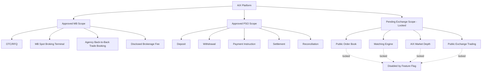
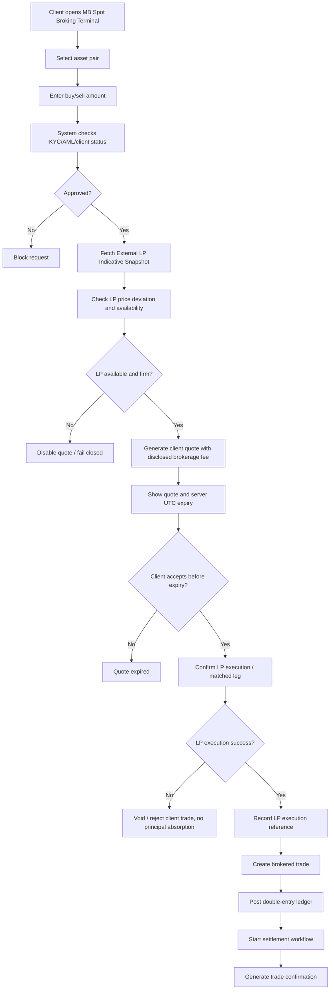

# 00 Licence Scope and Feature Lock  
# AIX Institutional Digital Asset & Tokenized Securities Platform

> ## CANDIDATE VERSION — NOT YET AUTHORITATIVE
>
> **`v1.3` remains the approved, authoritative Doc 00.** This `v1.4` is a candidate
> re-baseline, present on disk and **not promoted**, following the register's own precedent for
> an uncertified newer version (`DOCUMENT_REGISTER.md` §3: *present, not promoted, not
> archived*). Per the register's authority rule, a version becomes authoritative only when
> review/certification evidence exists — a version number and presence on disk confer nothing.
>
> **On approval this document supersedes v1.3 prospectively.** It does **not** rewrite
> historical facts: statements of what was decided, approved or locked at a past time remain as
> v1.3 recorded them.
>
> **Derivation.** `v1.4` is derived from `v1.3` by controlled, section-by-section revision — not
> rewritten from scratch — so **every protection in v1.3 is retained unless this document
> explicitly says otherwise and gives a reason** (§8A records that review). It is based on:
> - **`DEC-011`** — institutional account hierarchy (Legal Entity → Master Account → Subaccount
>   → Ledger Account).
> - **`DEC-012`** — AIX Spot external-routing architecture (Model A accepted, Model B gated as a
>   technical capability, Model C blocked), the order / market-depth terminology rules, the
>   product terminology direction, and the Asset & Instrument Registry securities-feature gate.
> - The independently verified Labuan FSA sources registered in `STR-02` §0.2.
>
> **Unresolved regulatory questions remain locked.** Nothing here approves the scope of AIX's
> Exchange approval, any securities activity, any RWA issuance, any specific venue or
> counterparty, any production order type, or any specific asset. Where a question is
> unresolved the capability **fails closed** — §21, §23.
>
> **Integrity note.** CFG-01 vendors a Doc 00 baseline
> (`services/cfg1/src/lib/doc00-baseline.ts`, `DOC00_SOURCE_VERSION = "v1.3"`) whose hash is
> sealed into the database. That seal correctly continues to reference **v1.3**, which remains
> authoritative — **no integrity break occurs while v1.4 is a candidate.** Re-deriving that
> constant becomes a mandatory prerequisite **at promotion**, and only if promotion changes
> licence status or prohibited-feature scope. See §25. **No code, migration, seeded identifier
> or runtime guard is changed by this document.**

## Document Control

| Item | Details |
|---|---|
| Document name | 00_Licence_Scope_And_Feature_Lock_v1.4.md |
| Platform | AIX Institutional Digital Asset & Tokenized Securities Platform |
| Document type | SDLC Phase 0 / Licence Scope Control |
| Version | v1.4 — **CANDIDATE** |
| Status | **PROPOSED / DRAFT_FOR_GOVERNANCE_APPROVAL.** Not accepted; `v1.3` remains authoritative until this version is certified |
| Prepared for | Development, architecture, compliance, product, and system design |
| Primary purpose | Lock approved licence scope; separate **product architecture** from **regulatory permission**; enforce agency/intermediary execution through approved external counterparties; prohibit internal client-to-client matching; and define capability gates before SRS or coding |
| Derived from | `v1.3`; `DEC-011`; `DEC-012`; `STR-01`; `STR-02` (evidence register §0.2) |

---

## 1. Purpose

This document defines the licence scope, feature activation rules, locked capabilities, prohibited functions, and development boundaries for the AIX Institutional Digital Asset & Tokenized Securities Platform.

### 1.A Product architecture versus regulatory permission

**The single most important rule in this document.** These are two different things and must never be conflated:

| | Meaning | Governed by |
|---|---|---|
| **Product architecture** | What the platform is *designed and built* to be capable of | This document, `DEC-011`, `DEC-012`, the SRS and module blueprints |
| **Regulatory permission / activation** | What AIX is *permitted to operate*, and what is actually *switched on in production* | AIX's licences and approvals, the capability matrix in §20, and the feature-lock model in §21 |

**A product may exist architecturally while individual capabilities remain disabled pending applicable regulatory approval.** Designing a capability is never permission to operate it. Naming a product is never permission to offer it. Nothing in this document becomes enabled because it is described here.

### 1.B What this document prevents

The purpose is to prevent the platform from being developed as:

1. A generic crypto exchange.
2. An unrestricted trading platform.
3. A proprietary trading platform.
4. A market maker platform.
5. A venue operating an internal client-to-client matching book for digital-currency trading (**Model C**, §7.7) — whether or not any Exchange approval exists.
6. A principal-dealing platform disguised as money broking.
7. A platform that admits an asset bearing the features of securities into a Money Broking product (§12A).
8. A platform where a capability becomes live through an absent or unresolved decision rather than an affirmative one (§21).

### 1.C Current licence position

The current licence position is:

1. Money Broking licence is approved.
2. Payment System Operator licence is approved.
3. Exchange application is still pending.

Therefore, the system may proceed with approved Money Broking and PSO-related capabilities, but **all securities / financial-instrument Exchange capability, and all digital-currency internal-matching capability, must remain locked** — the former pending the applicable approval, the latter as a standing prohibition under the Money Broking operating model (§7.7).

**Unchanged from v1.3:** the licence position itself. v1.4 changes how the platform's *products* are described and gated, not what AIX is licensed to do.

This document must be read before preparing:

1. Project Charter.
2. Software Requirement Specification.
3. Master Module Index.
4. Database Design.
5. API Specification.
6. Frontend Page Map.
7. Claude Code implementation prompts.
8. Any production deployment plan.

---

## 2. Regulatory Reference Base

The platform must be designed with reference to the following Labuan FSA regulatory areas.

| Area | Reference |
|---|---|
| Money Broking | Guidelines on the Establishment of Money Broking Business in Labuan IBFC |
| Digital Money Broking Platform | Guidelines on the Management of Digital Money Broking Platform |
| Digital Financial Services | Labuan FSA DFS approval requirements |
| Market Conduct | Guidelines on Market Conduct for Labuan Digital Financial Intermediaries |
| Travel Rule | Guidelines on Travel Rule for Labuan Digital Financial Services |
| AML/CFT/CPF/TFS | Guidelines on AML/CFT/CPF and TFS for Labuan Key Reporting Institutions |
| Digital Currency Admission | Admissibility Framework for Digital Currencies |
| Payment / Settlement | PSO licence scope and relevant LFSA guidance |
| Outsourcing / External Vendors | LFSA external service / outsourcing expectations where applicable |
| Technology / Cyber Risk | Technology management, digital governance, security, access, logging, and monitoring expectations |

### 2.1 Developer Interpretation

For development purposes, the platform must be treated as:

```txt
A regulated Labuan Money Broking + PSO platform
providing institutional digital-currency Spot and OTC products
as intermediary/agent, executed through approved external
counterparties/venues, with payment capability under the PSO licence,
and with tokenisation and securities capability designed but gated
behind classification and applicable regulatory approval.

AIX never matches one client's order against another's.
```

### 2.2 Verified regulatory sources relied on by this version

Registered in full, with paragraph references and official URLs, in `STR-02` §0.2. Independently verified against the published documents.

| Ref | Source | Status |
|---|---|---|
| **LFSA-MB-2024** | Guidelines on the Establishment of Money Broking Business in Labuan IBFC, 9 September 2024 | In force |
| **LFSA-DMB-2025** | Guidelines on the Management of Digital Money Broking Platform (Final) | **Effective 1 January 2027 — see §22** |
| **LFSA-EXCH-WEB** | Labuan FSA Exchange business-area description | Generic; **not** evidence of AIX's own approval scope |

**Rule:** a provision establishes only what it says. Where this document relies on one, it cites it. Where no source establishes a proposition, the proposition is marked unresolved (§23) and the capability fails closed (§21).

---

## 2A. Product Terminology

Approved by `DEC-012` clause 5. **This is platform terminology, not regulatory permission** (§1.A).

| Term | Meaning | Regulatory route |
|---|---|---|
| **AIX Spot** | Digital Money Broking product for **eligible non-security digital currencies** | Money Broking |
| **AIX OTC** | Digital Money Broking **RFQ / institutional block-execution** product for eligible non-security digital currencies / instruments within applicable MB scope | Money Broking |
| **AIX Pay** | Payment product, subject to AIX's **actual PSO scope** and applicable requirements | PSO |
| **AIX RWA** | Real-world-asset tokenisation platform/domain | **Depends on classification** (§12B) |
| **AIX Exchange** | **Reserved** terminology for the Labuan **securities / financial-instrument Exchange** capability | Securities / Exchange — **scope unresolved (§23)** |

**Binding naming rules:**

1. **"AIX Exchange" must never be used to describe BTC/USDT-style digital-currency Spot trading.** Spot is Money Broking.
2. Reserving the term "AIX Exchange" **grants no securities capability** and asserts nothing about the scope of AIX's Exchange approval (§12C, §23).
3. **Historical records must not be silently rewritten.** Statements in prior versions and other documents describing what was approved or locked at a past time remain historically accurate and stand.
4. **Seeded configuration identifiers are frozen** and are not renamed by this document (§9A).

---

## 2B. Four Strategic Product Pillars

The platform is one institutional core with four product pillars. **Each pillar's architectural existence is independent of its regulatory activation** (§1.A, §20).

| Pillar | Product | Regulatory route | Activation |
|---|---|---|---|
| 1 | **AIX Spot** | Money Broking | Per §20; order types per §11B |
| 2 | **AIX OTC** | Money Broking | Per §20 |
| 3 | **AIX Pay** | PSO | Per §20; unverified features stay **PENDING / FEATURE-LOCKED** (§12D) |
| 4 | **AIX RWA** | Depends on classification | Per §20; securities route **locked** (§12B) |

**AIX Exchange** is not a fifth pillar in this version. It is reserved terminology for a capability whose scope is unresolved (§12C, §23).

**Shared institutional core.** The four pillars share one core — identity, RBAC, maker-checker, KYC/KYB/UBO, AML, the Asset & Instrument Registry (§12A), the account hierarchy (§2C), ledger, settlement, reconciliation, audit and the capability-control plane. Pillars must not re-implement core controls independently.

---

## 2C. Institutional Client and Account Scope

**Client scope is unchanged from v1.3:** institutional clients and HNWI / professional clients only; retail onboarding disabled by default (§10.2A). No authoritative approval changing that exists, so v1.4 preserves it.

**Account hierarchy — `DEC-011` (ACCEPTED).** The canonical model is four distinct layers, which must never be collapsed into a single identifier:

```txt
Legal Entity / Client        ← owns the regulatory client relationship and legal ownership
  → Master Account           ← top-level operational account structure
      → Subaccount           ← operational separation (e.g. Trading, Treasury, Payments, RWA)
          → Ledger Account   ← accounting / posting primitive
```

Rules carried from `DEC-011`:

1. The **legal entity** owns the regulatory client relationship. It must **never** itself be treated as a ledger account and must **never** carry financial balances.
2. **Subaccounts are not separate legal clients.** They inherit legal ownership from the parent legal entity.
3. A legal entity may initially have one master account, but the model **must not assume** the relationship can never become one-to-many.
4. Authorised principals attach through the **existing** client-membership and IAM authority chain. A second, parallel organisation-membership system must not be created.

**Product eligibility may be scoped by** legal client, account, subaccount, product, asset, jurisdiction, regulatory status and compliance status (§20, §21). **This document does not design the schema** — that is `CLT-01` / `LED-01` work under `DEC-011`.

**Open, non-blocking:** whether institutional subaccounts attract distinct KYC, reporting or safeguarding treatment (`A2-Q1`), and whether subaccount segregation affects client-money safeguarding obligations (`A2-Q2`) — §23. Neither blocks the architecture; both must be answered **before subaccounts carry client money**.

---

## 3. Current Licence Status

| Licence / Approval | Status | System Treatment |
|---|---|---|
| Money Broking Licence | Approved | Active build scope |
| Payment System Operator Licence | Approved | Active build scope |
| Exchange Application | Pending | Locked until approval |

---

## 4. Licence Boundary Principles

The following principles control the whole platform.

### 4.1 Agency / Broker-Only Principle

AIX must act as broker/intermediary only under the Money Broking operating model.

**Source:** LFSA-MB-2024 ¶1.1 — money broking is **intermediary activity** and **excludes acting as principal, liquidity provider or market maker**. Items 1, 3 and 4 below restate that provision directly.

AIX must not:

1. Act as principal.
2. Take proprietary trading position.
3. Act as market maker.
4. Act as liquidity provider to its own clients under the Money Broking operating model.
5. Earn undisclosed spread margin.
6. Carry naked inventory or market risk.
7. **Match, cross or net one AIX client's order against another AIX client's order.**

**Correction to v1.3 — this is a strengthening, not a relaxation.** v1.3 item 7 read *"Match one AIX client against another AIX client **before Exchange approval**"*, which implied internal client-to-client matching would become permissible once an Exchange approval existed. That implication is wrong under the Money Broking operating model: ¶1.1 confines money broking to intermediary activity irrespective of any Exchange approval, and `DEC-012` clause 3 records internal matching as **BLOCKED / OUT OF SCOPE**, not deferred. The qualifier is therefore removed and the prohibition made standing.

**Scope of the correction.** It governs the Money Broking products (AIX Spot, AIX OTC). Whether a separately approved securities / financial-instrument Exchange capability could operate a matching venue **for securities** is a different question under a different framework, is **not authorised by this document**, and depends on `R1-Q1b` and the applicable securities framework (§12C, §23).

### 4.2 Revenue Model

The approved MVP revenue model is:

```txt
Disclosed brokerage fee / commission only.
```

The following are prohibited:

```txt
AIX spread markup as principal margin.
Hidden spread.
Undisclosed markup.
Principal-risk price absorption.
Market-making revenue.
```

If LP spread exists, it must be treated as LP pricing and disclosed transparently where applicable. AIX revenue must be recorded separately as brokerage fee or commission.

### 4.3 Execution Model

The approved MVP execution model is:

```txt
Agency back-to-back execution.
```

This means:

1. A client trade must be tied to a firm or secured LP leg.
2. AIX must not show an executable client quote unless the LP leg is firm or secured. No softer or undefined execution control is permitted.
3. Every brokered trade must be matched to a completed LP execution or approved counterparty leg.
4. AIX inventory limit is zero.
5. Naked position is not allowed.
6. If LP execution fails, the client trade must not be absorbed by AIX as principal.
7. LP failure handling is locked by this document: if LP execution fails, partially fills, or moves beyond the confirmed quote tolerance, the client trade must be voided, re-quoted, or unwound through reversal entries. AIX must not absorb the difference, hold residual inventory, or carry principal exposure.

---

## 5. Approved Build Scope

The following modules are approved for documentation, system design, and MVP development.

### 5.1 Money Broking Scope

Allowed modules:

1. Client onboarding.
2. KYC/KYB.
3. Beneficial ownership collection.
4. AML risk profile.
5. Source of funds / source of wealth.
6. OTC/RFQ broking.
7. MB Spot Broking Terminal.
8. LP-backed quote request.
9. Agency/back-to-back trade booking.
10. Disclosed brokerage fee calculation.
11. Client trade history.
12. Trade confirmation.
13. Reporting.
14. Audit log.

### 5.2 PSO Scope

Allowed modules:

1. Deposit workflow.
2. Withdrawal workflow.
3. Payment instruction.
4. Payment status tracking.
5. Settlement tracking.
6. Client money ledger.
7. Payment reconciliation.
8. Payment reference tracking.
9. Payment reports.

### 5.3 Compliance Scope

Allowed modules:

1. KYC/KYB review.
2. AML risk scoring.
3. Sanctions screening.
4. PEP screening.
5. Beneficial ownership.
6. Wallet screening.
7. Travel Rule enforcement.
8. AML case management.
9. STR / regulatory filing workflow.
10. Account freeze.
11. Account suspension.
12. Enhanced due diligence.
13. Compliance notes.
14. Compliance decision log.
15. Periodic CDD/KYC refresh.
16. Sanctions re-screening on list update.
17. Threshold transaction reporting.
18. Tainted-funds / mixer handling.

### 5.4 Platform Foundation Scope

Allowed modules:

1. Authentication.
2. MFA.
3. Role-based access control.
4. Feature flags.
5. Audit log.
6. Maker-checker.
7. Notification.
8. Document management.
9. Admin portal.
10. Staff portal.
11. Client portal.
12. System settings.
13. Reporting.
14. System health monitoring.

---

## 6. Locked Capability Scope

**Revised in v1.4.** v1.3 attributed every lock in this section to one cause — *"the Exchange application is pending"*. That conflated two different kinds of lock, and the conflation is why the platform had no vocabulary for a securities venue (`STR-02` §1.5: of 315 "Exchange" occurrences across the twelve masters, **zero** carried the securities meaning). This version separates them. **No lock is removed.**

Two distinct lock classes:

| Class | Meaning | Lifts when |
|---|---|---|
| **STANDING PROHIBITION** | Outside the Money Broking operating model as a matter of what money broking *is* | **Not by Exchange approval.** Would require a different licence basis and a new licence-scope revision |
| **PENDING APPROVAL** | Within a framework AIX does not yet hold approval for | The applicable approval is granted **and** activation gates pass (§20, §21) |

| Capability | Status | Class | Reason |
|---|---|---|---|
| AIX internal matching engine (digital currency) | **Locked** | **STANDING** | LFSA-MB-2024 ¶1.1 intermediary-only; `DEC-012` clause 3 |
| Client-to-client matching (digital currency) | **Locked** | **STANDING** | As above. **Corrected from v1.3**, which classed this as pending approval (§4.1) |
| AIX-operated central order book for MB Spot | **Locked** | **STANDING** | Would make AIX a venue operator; `DEC-012` clause 3 |
| Market maker engine | **Locked** | **STANDING** | ¶1.1 excludes market making |
| Principal dealing engine | **Locked** | **STANDING** | ¶1.1 excludes acting as principal |
| AIX providing its own principal liquidity | **Locked** | **STANDING** | ¶1.1 excludes acting as liquidity provider |
| Presenting AIX as operating a public digital-currency exchange | **Locked** | **STANDING** | Terminology and conduct; §2A rule 1, §8 |
| Securities / financial-instrument Exchange capability | **Locked** | **PENDING APPROVAL** | Exchange application pending; **scope unresolved — `R1-Q1b`** (§12C, §23) |
| Security-token secondary market | **Locked** | **PENDING APPROVAL** | §12B, §12C; `R4-Q2` unresolved |
| Public market API for an AIX-operated market | **Locked** | **STANDING** | Follows from the internal-matching prohibition |
| Stop, Stop-Limit, IOC, FOK, GTC order types | **Locked** | **SEPARATELY GOVERNED** | Not a licence lock — product-rule review (§11B). **Reclassified in v1.4**; see below |

**Reclassification of order types — the substantive change in this section.** v1.3 locked *"resting exchange limit orders"*, *"stop-limit order book"*, *"post-only"* and *"good-till-cancelled exchange orders"* as **Exchange order-book behaviour**. That classification was drafted on the assumption that a pending client order implies an exchange book. It does not: under **Model A** a client order is held in AIX's own order store and routed **externally** for execution, and **LFSA-DMB-2025 ¶6.4(i) expressly requires a control for the cancellation of unexecuted orders** — unexecuted client orders are a contemplated feature of a digital money broking platform, not exchange behaviour.

**Therefore:** order types are no longer locked *as exchange behaviour*. They are **separately governed** under §11B — Market, Limit and Cancel are architectural baseline candidates; Stop, Stop-Limit, IOC, FOK and GTC require specific product-rule review before any production activation. **This reclassifies the reason for the gate; it does not switch any order type on.** No order type is enabled by this document.

**`R3-Q1b` remains open** (`STR-02` §2.8): whether v1.3's *"resting exchange limit orders"* lock was ever intended to reach an OMS-pending order routed externally is an AIX-internal drafting question. v1.4 resolves it prospectively in the manner above; it does not assert that v1.3 meant something other than what it said.

### 6.1 Important Design Rule

The platform may display market information sourced from approved external counterparties/venues, but **must not represent that data as an AIX-operated order book**.

Allowed labels:

```txt
External Market Depth
Aggregated Market Depth
```

Prohibited label for digital-currency Spot:

```txt
AIX Order Book
AIX Exchange
```

See §11A for the full three-way distinction between a client order store, external market depth, and an internal matching book.

---

## 7. Externally-Routed Spot and OTC Model

**Provider-neutral.** AIX sources execution and liquidity from **approved external counterparties / liquidity providers / venues**. 

**v1.4 removes the provider-specific assumption in v1.3**, which read *"AIX may use Binance or another approved liquidity provider"* and set `primary_lp = Binance_or_approved_LP` (§7.5). **No provider is named, approved or assumed anywhere in this document.** See §7A for the counterparty abstraction and the approval path a specific provider must pass.

### 7.1 Approved Concept

The interface may present a professional institutional experience with:

1. Chart.
2. Asset pair selector.
3. **External / aggregated market depth** sourced from approved external counterparties, venues or market-data providers.
4. Order entry (§11B order types; activation separately governed).
5. Open orders and order history.
6. Trade history.
7. Asset and account summary.

**LFSA-DMB-2025 ¶5.9 (effective 1 January 2027 — §22)** makes pre-trade information (current bid prices, current offer prices, available asset volume, depth of trading interest, relevant communication methods) **and** post-trade information (price, trade time, volume of completed transactions, disclosed as close to real-time as technically feasible) **accessible during normal trading hours** a target operating requirement. Presenting market depth and post-trade data is therefore an expected capability of the target platform, not merely a permitted one.

### 7.2 Prohibited Terminal Behaviour

The terminal must not:

1. Let a client order rest inside an **AIX-operated matching book**.
2. Match a client order against another AIX client's order.
3. Display or imply an **AIX-operated** order book.
4. Display matching-engine output of an AIX-operated venue.
5. Use a market-maker or maker/taker fee model.
6. Display a trade tape in a way that implies AIX operates a public digital-currency exchange.
7. Redistribute external counterparty, venue or market-data-provider data without the required market-data rights.
8. Present any order type not activated under §11B.

**Changed from v1.3, with reasons:**

- v1.3 item 1 — *"Allow client to click LP depth level to execute directly"* — is **retained as a constraint but reclassified as unresolved**, not as a settled prohibition. It is `R3-Q2b` (§23): LFSA-DMB-2025 ¶5.9 establishes that depth must be *displayed*, and establishes nothing about executing against it. **Until `R3-Q2b` is answered, click-to-execute against displayed depth remains DISABLED** under the fail-closed rule (§21). It is listed in §23, not here, because it is an open question rather than a standing prohibition.
- v1.3 item 7 — *"Use GTC, post-only, stop-limit, or resting limit order behaviour in MVP"* — is replaced by item 8, which routes every order type through §11B's activation gate. **No order type is enabled by this change.**
- Items 1–6 of this list correspond to v1.3 items 2–6 and 8, retained in substance with "AIX order book" made explicit as "AIX-operated" to align with §11A's three-way distinction.

### 7.3 System Execution Model

The backend must follow this model (**Model A — `DEC-012` clause 1**, the target initial architecture for AIX Spot):

```txt
Institutional Client
↓
AIX Spot UI / API
↓
Client Order Store / OMS          ← records the client instruction and its lifecycle
↓
Eligibility and Pre-Trade Controls
↓
Execution Routing
↓
Approved External LP / Counterparty / Venue     ← execution happens HERE, never inside AIX
↓
Fill / Partial Fill
↓
AIX Ledger
↓
AIX Settlement
↓
AIX Reconciliation
```

**Model B — future technical capability (`DEC-012` clause 2, PRODUCTION-GATED):**

```txt
AIX OMS
↓
Market Data Aggregation
↓
Execution Policy
↓
Multi-LP / Smart Router
↓
Approved Venue Adapters
↓
External LPs / Venues
```

**Model B is a technical capability only. No venue is approved merely because the architecture supports it** (§7A). Routing policy must be configurable and auditable, and every routing decision must be reconstructable and disclosable — LFSA-MB-2024 ¶9.7(i) requires disclosure of order-routing procedures, the fair application of routing, third-party routing arrangements and any payment-for-order-flow / inducement arrangements. A simplistic "lowest price always wins" rule is expressly rejected.

The backend must not follow this model (**Model C — `DEC-012` clause 3, BLOCKED / OUT OF SCOPE**):

```txt
Client A order
↓
AIX-operated matching book
↓
Client-to-client execution
↑
Client B order
```

### 7.4 Externally-Routed Execution Rules

1. **Approved external counterparties / LPs / venues** may provide market data and liquidity. **No provider is named or pre-approved** (§7A).
2. External market depth may be displayed as **external / aggregated market depth**, attributed to its source class.
3. **Executing against displayed depth remains DISABLED** pending `R3-Q2b` (§23) — fail closed (§21).
4. Client execution must pass eligibility and pre-trade controls before routing (§7.3; LFSA-DMB-2025 ¶6.4(ii)).
5. AIX must record the external price snapshot relied on.
6. AIX must record the client order / instruction and its lifecycle (LFSA-DMB-2025 ¶5.5).
7. AIX must record the disclosed brokerage fee.
8. AIX must record the external execution reference where applicable.
9. AIX must record slippage where applicable.
10. AIX must not expose any external counterparty or venue API directly to the client.
11. AIX must not present external market depth as an AIX-operated order book.
12. **AIX must not operate an internal matching engine.** *(v1.3 qualifier "before Exchange approval" removed — §4.1.)*
13. **AIX must not match one AIX client against another AIX client.** *(Same correction.)*
14. External counterparty / venue outage must fail closed.
15. No internal fallback price source is allowed when the external source is unavailable.
16. **Sufficient funds must be available before execution** — LFSA-DMB-2025 ¶5.2 (target requirement, §22). This elevates the existing pre-funded model from an AIX-internal control to a target regulatory requirement.
17. Orders must be **executed promptly and on best available terms**, and must not be improperly withdrawn, delayed or withheld — LFSA-DMB-2025 ¶5.5 (target requirement, §22).
18. **Every execution must retain evidence of:** client instruction; pre-trade checks; routing decision; selected counterparty/venue; price; quantity; fees; timestamps; fill(s); settlement; reconciliation — `DEC-012` clause 1 rule 7. Retention **at least six years** (LFSA-DMB-2025 ¶5.12, §22).
19. **Partial fills must be supported** (`DEC-012` clause 1 rule 8) under the conservation and no-absorption rules in §7.6.

### 7.6 LP Partial Fill, Slippage, and Failure Rules

1. LP partial fill must not create AIX residual inventory.
2. LP fill worse than confirmed client quote must not be absorbed by AIX.
3. If LP execution is incomplete, rejected, expired, or outside approved price tolerance, the client trade must be voided or re-quoted.
4. If a ledger record has already been created before failure confirmation, the system must post reversal ledger entries. Original ledger entries must not be deleted.
5. Any re-quote must require new client confirmation.
6. Client must be informed that the previous quote is no longer executable.
7. Slippage may be recorded for evidence, but AIX must not carry the financial difference as principal exposure.
8. Partial-fill behaviour must be fail-closed by default.


### 7.5 LP Model Parameters

**v1.4 — provider-neutral.** The v1.3 line `primary_lp = Binance_or_approved_LP` is **removed**: no provider may be hard-coded into the licence-scope baseline. Specific providers are governed outside the platform architecture through the approval path in §7A.

```txt
liquidity_model = external_counterparty_routed
approved_counterparties = governed_externally_see_section_7A
primary_lp = REMOVED_IN_v1.4_no_provider_named
displayed_depth_source = approved_external_counterparty_or_market_data_provider
displayed_depth_type = external_aggregated_depth
depth_executable = disabled_pending_R3-Q2b
internal_orderbook = disabled
internal_matching_engine = disabled
client_to_client_matching = disabled
aix_market_making = disabled
aix_principal_dealing = disabled

lp_due_diligence_required = true
lp_api_integration_required = true
lp_order_reference_required = true
lp_execution_report_required = true
lp_slippage_record_required = true
lp_outage_behaviour = fail_closed_no_internal_fallback
lp_rate_limit_handling_required = true
lp_price_snapshot_required = true
lp_price_deviation_limit_pct = to_be_defined
lp_counterparty_exposure_limit = to_be_defined
lp_three_way_reconciliation_required = true
lp_secret_management = kms_vault
lp_environment = sandbox_in_nonprod_only
lp_market_data_redistribution_licensed = required
best_available_terms_evidence = required
```

### 7.7 Model C — Internal Client-to-Client Matching: HARD LOCK

**Status: BLOCKED / OUT OF SCOPE** — `DEC-012` clause 3.

```txt
Client A order  →  [ AIX internal matching mechanism ]  ←  Client B order
                            PROHIBITED
```

No architecture approval is granted for any of the following:

1. An **AIX-operated central client-to-client order book** for Money Broking Spot.
2. **Crossing Client A against Client B**, in whole or in part.
3. An **internal matching engine** for Money Broking Spot.
4. **AIX market making.**
5. **AIX principal liquidity.**
6. **Proprietary dealing** under this architecture.

**Basis.** LFSA-MB-2024 ¶1.1 confines money broking to **intermediary activity** and excludes acting as principal, liquidity provider or market maker. **No provision in any verified source supports internal matching.** This is therefore a **standing prohibition** (§6), not a lock awaiting an approval.

**Capability framing — this is the accurate form of the prohibition.** What is prohibited is the **capability**: maintaining a structure in which independent AIX client orders are **mutually executable**, and matching, crossing or netting one client's order against another's. It is *not* prohibited to record a client's own order (§11A class 1) or to represent externally sourced market depth (§11A class 2). Neither makes client orders mutually executable inside AIX.

**Existing locks are unchanged.** This document does not weaken any runtime or configuration control. The boot-time route guard, the CFG-01 prohibited-feature registry and its `exchange.`-prefix mutation guard, and the seeded feature locks all remain exactly as they are (§9A, §25).

---

## 7A. Approved External Counterparty / LP / Venue Model

**Provider-neutral abstraction.** The licence-scope baseline recognises exactly one abstraction:

```txt
APPROVED EXTERNAL COUNTERPARTY / LP / VENUE
```

**No named provider appears in this document, and none is approved by it.** v1.3's `primary_lp = Binance_or_approved_LP` is removed (§7.5). Naming a provider in the licence-scope baseline would make a commercial selection into a governance fact.

**Basis.** LFSA-MB-2024 ¶7.5 expressly includes **liquidity providers** among permitted counterparties, and requires that applicable counterparties be appropriately regulated / of good track record and subject to due diligence. ¶9.3 requires due diligence covering clients, principal broker / liquidity provider and trading-platform providers, **proportionate to exposure**. ¶9.7(i) requires disclosure of order-routing procedures, the fair application of routing, third-party routing arrangements, and payment-for-order-flow / inducement arrangements. ¶9.5 requires that AIX make clear **the capacity in which it acts** and disclose relevant conflicts involving service providers / LPs.

**A specific provider is governed outside the platform architecture** and must pass, at minimum:

| # | Gate |
|---|---|
| 1 | Due diligence, proportionate to exposure (¶9.3) |
| 2 | Counterparty assessment — appropriately regulated / good track record (¶7.5) |
| 3 | Legal agreement |
| 4 | Operational approval |
| 5 | Regulatory eligibility for the assets and activity concerned |
| 6 | **Notification to Labuan FSA within seven days prior to commencement** of the new arrangement (¶7.5) |
| 7 | Technical onboarding |
| 8 | Testing |
| 9 | Activation control (§21 feature-lock) |

**Gate 6 is an external dependency with a waiting period, not a configuration toggle.** A venue must not be activatable for routing until due diligence is recorded **and** the notification period has elapsed. The venue registry must therefore carry a notification-status dimension and refuse activation before it clears.

**Model B does not approve any venue.** `DEC-012` clause 2 accepts multi-venue routing as a **technical capability, production-gated**. Architectural support for a venue is not approval of that venue. Routing policy must be configurable and auditable, every routing decision reconstructable and disclosable, and **"lowest price always wins" is expressly rejected** — routing must be able to weigh price, available quantity/depth, fees, expected slippage where measurable, venue health, counterparty exposure/limit, supported assets, settlement capability, regulatory eligibility and operational availability.

**Open:** whether any specific external venue or LP is acceptable for AIX is unresolved — `R3-Q6`, §23.

---

## 8. Prohibited Scope

The following features must not be developed or activated unless separately approved by management and regulator where required.

### 8.1 Trading and Product Prohibitions

1. Principal dealing under the MB module.
2. Proprietary trading.
3. Market making.
4. Derivatives.
5. Securities token trading.
6. Margin trading for digital assets.
7. Lending or borrowing of client assets.
8. Staking service.
9. Yield product.
10. Algorithmic stablecoin support.
11. Privacy coin support.
12. Unapproved asset listing.
13. MYR trading pair.
14. **An AIX-operated order book or matching venue for digital-currency trading.** *(v1.3 read "AIX exchange order book before approval"; the "before approval" qualifier is removed — §4.1, §7.7, §8A. **Standing prohibition, stronger than v1.3.**)*
15. **Internal client-to-client matching — matching, crossing or netting one AIX client's order against another's.** *(Same correction; standing prohibition.)*
16. AIX spread markup as principal revenue.
17. Price Target Request as executable resting order.

### 8.2 Custody Prohibitions

1. Self-custody wallet service.
2. Private key custody by AIX unless separately approved.
3. Client asset commingling.
4. Company asset and client asset mixing.
5. Off-ledger balance adjustment.
6. Manual balance editing without ledger transaction.

### 8.3 System Prohibitions

1. Balance update without ledger entry.
2. Sensitive admin action without audit log.
3. Trade booking without approved client status.
4. Withdrawal without compliance and settlement checks.
5. Quote acceptance after expiry.
6. Feature activation from frontend only.
7. Staff approval of own maker-checker request.
8. Production activation of locked exchange features.
9. API bypass of disabled features.
10. Deletion of audit logs.
11. Direct client access to LP account.
12. Hidden or undisclosed spread.
13. Internal fallback pricing during LP outage.
14. Client quote execution without firm/secured LP leg.
15. Carrying unhedged/naked position.

### 8A. Prohibition Review — every v1.3 prohibition individually classified

**Mandatory review.** No lock is removed because the product strategy changed. Each v1.3 prohibition in §8.1–§8.3 and §6 was assessed individually:

| Class | Meaning |
|---|---|
| **A** | **STILL VALID** — preserved verbatim |
| **B** | **VALID BUT REWORDED** — same force, clearer or corrected expression |
| **C** | **SUPERSEDED** by `DEC-011` / `DEC-012` |
| **D** | **HISTORICAL** — requires a later controlled migration |
| **E** | **REGULATORY QUESTION** — remains locked while unresolved |
| **F** | **NEW LOCK** required by the new direction |

#### §8.1 Trading and product prohibitions

| # | Prohibition | Class | Note |
|---|---|---|---|
| 1 | Principal dealing under the MB module | **A** | LFSA-MB-2024 ¶1.1. Preserved |
| 2 | Proprietary trading | **A** | Preserved |
| 3 | Market making | **A** | ¶1.1. Preserved |
| 4 | Derivatives | **A** | Preserved — no verified source permits them |
| 5 | Securities token trading | **E** | **Remains locked.** `R4-Q2` unresolved. §12B, §12C |
| 6 | Margin trading for digital assets | **A** | Preserved |
| 7 | Lending or borrowing of client assets | **A** | Preserved |
| 8 | Staking service | **A** | Preserved |
| 9 | Yield product | **A** | Preserved |
| 10 | Algorithmic stablecoin support | **A** | Preserved. Admissibility remains an asset-gate decision (§12A) |
| 11 | Privacy coin support | **A** | Preserved. Same |
| 12 | Unapproved asset listing | **B** | Preserved and **strengthened** — now routed through the Asset & Instrument Registry gate (§12A) |
| 13 | MYR trading pair | **A** | Preserved |
| 14 | AIX exchange order book before approval | **B** | **Corrected.** Reworded as a **standing** prohibition on an AIX-operated matching book (§7.7), not one lapsing on Exchange approval. **Stronger, not weaker** |
| 15 | Internal client-to-client matching before Exchange approval | **B** | **Corrected identically** — standing prohibition (§4.1, §7.7) |
| 16 | AIX spread markup as principal revenue | **A** | Preserved |
| 17 | Price Target Request as executable resting order | **B** | Preserved in substance; order-type activation now governed by §11B. **No order type is enabled** |

#### §8.2 Custody prohibitions

| # | Prohibition | Class | Note |
|---|---|---|---|
| 1–6 | Self-custody wallet service; AIX private-key custody unless approved; client asset commingling; company/client asset mixing; off-ledger balance adjustment; manual balance editing without ledger transaction | **A** | **All preserved verbatim.** `DEC-011` reinforces 5 and 6: balances live in the ledger, never on a client identity record (§2C) |

#### §8.3 System prohibitions

| # | Prohibition | Class | Note |
|---|---|---|---|
| 1–15 | All fifteen | **A** | **All preserved.** Item 4 (withdrawal without compliance and settlement checks), item 7 (staff self-approval), item 8 (production activation of locked features) and item 9 (API bypass of disabled features) are load-bearing for §21's fail-closed model |

#### New locks required by the new direction

| # | New lock | Class | Basis |
|---|---|---|---|
| F1 | **Admitting an asset with securities features into a Money Broking product** | **F** | LFSA-MB-2024 fn 1 to ¶1.2 — §12A |
| F2 | **Activating a venue before due diligence and the seven-day prior notification have completed** | **F** | LFSA-MB-2024 ¶7.5 — §7A gate 6 |
| F3 | **Product activation on unresolved asset classification** — must fail closed | **F** | §12A, §21 |
| F4 | **Executing against displayed market depth** while `R3-Q2b` is unresolved | **F/E** | §7.2, §23 |
| F5 | **Activating any order type not passed through product-rule review** | **F** | §11B |
| F6 | **Enabling an AIX Exchange capability on terminology alone** | **F** | §12C — reserving a name grants nothing |

**Net effect: no prohibition weakened; two corrected to be stronger (§8.1 items 14–15); six new locks added.**

---

## 9. Feature Flags

The platform must implement backend-enforced feature flags.

Frontend hiding is not enough. If a feature is disabled, the backend API must also block access.

### 9.1 Enabled MVP Feature Flags

```txt
feature_client_onboarding = enabled
feature_kyc_kyb = enabled
feature_document_upload = enabled
feature_compliance_review = enabled
feature_beneficial_ownership = enabled
feature_source_of_funds = enabled
feature_source_of_wealth = enabled

feature_otc_rfq = enabled
feature_mb_spot_broking_terminal = enabled
feature_spot_broking_request = enabled
feature_external_lp_market_depth = enabled
feature_lp_backed_quote = enabled
feature_agency_back_to_back_execution = enabled
feature_trade_booking = enabled
feature_disclosed_brokerage_fee = enabled

feature_deposit = enabled
feature_withdrawal = enabled
feature_payment_instruction = enabled
feature_payment_settlement = enabled
feature_reconciliation = enabled

feature_double_entry_ledger = enabled
feature_audit_log = enabled
feature_maker_checker = enabled
feature_reports = enabled
feature_notifications = enabled

feature_travel_rule_enforcement = enabled
feature_wallet_screening = enabled
feature_aml_case_management = enabled
feature_account_freeze = enabled
feature_account_suspension = enabled
```

### 9.2 Disabled / Locked Feature Flags

```txt
feature_exchange_orderbook = disabled
feature_matching_engine = disabled
feature_market_depth_as_aix_exchange = disabled
feature_public_exchange_trading = disabled
feature_public_market_pair_listing = disabled
feature_public_market_api = disabled
feature_client_to_client_matching = disabled

feature_derivatives = disabled
feature_margin_trading = disabled
feature_securities_token = disabled
feature_market_making = disabled
feature_proprietary_trading = disabled
feature_self_custody_wallet = disabled
feature_staking = disabled
feature_yield_product = disabled

feature_MYR_trading_pair = disabled
feature_privacy_coin = disabled
feature_algorithmic_stablecoin = disabled
feature_aix_spread_markup = disabled
feature_executable_price_target_request = disabled
feature_internal_fallback_pricing = disabled
```

### 9.3 Feature Flag Enforcement Rules

1. Feature flags must be stored in the database.
2. Feature flags must be enforced by backend middleware or service guard.
3. Frontend must also hide disabled features, but frontend is not the source of truth.
4. Admin changes to feature flags must require permission.
5. High-risk feature flag changes must require maker-checker approval.
6. Every feature flag change must create an audit log.
7. Locked exchange features must not be enabled by normal admin users.
8. Locked exchange features require management and regulatory approval confirmation before activation.
9. Backend API must reject disabled-feature requests with `FEATURE_DISABLED`.
10. Locked feature API routes should not be publicly documented until enabled.
11. Feature flag default state must be disabled.
12. Unknown feature flag state must fail closed.
13. System fail-safe default must be deny.

### 9A. Frozen Identifiers and Their Compatibility Meaning

**Rule: identifiers are frozen. This document renames nothing.**

Several seeded feature-lock and configuration identifiers now carry names that read oddly under v1.4's terminology — chiefly because they use "exchange" in the digital-currency-order-book sense that §2A reserves for securities. **Renaming any of them would break governance and integrity**: they are seeded into the CFG-01 prohibited-feature registry, bound into a sealed configuration hash, and cited as licence-lock evidence in test names and acceptance records.

**Therefore: KEEP THE IDENTIFIER. Document its compatibility meaning. Create a future migration requirement.**

| Frozen identifier / name | Reads as | **Compatibility meaning under v1.4** |
|---|---|---|
| `exchange.public_order_book`, `exchange.matching_engine`, `exchange.client_to_client_matching`, `exchange.public_exchange_trading`, `exchange.public_market_depth` | Exchange-approval-pending locks | **An AIX-operated digital-currency matching/venue capability.** Now a **standing** prohibition under §7.7, not one lapsing on Exchange approval |
| `exchange.market_maker`, `exchange.principal_dealing` | Exchange-namespaced | Already `permanent` in the registry; LFSA-MB-2024 ¶1.1 prohibitions. Unchanged |
| `securities.token_trading` | Permanent prohibition | **Unchanged and still locked.** §12B, §12C; `R4-Q2` unresolved |
| `feature_exchange_orderbook`, `feature_matching_engine`, `feature_market_depth_as_aix_exchange`, `feature_public_exchange_trading`, `feature_public_market_api`, `feature_client_to_client_matching` (§9.2) | Doc 00 flag names | Documentation identifiers for the same standing prohibition |
| `EXCHANGE_MODULE_LOCKED` | Error / state code | The locked-capability error code. Meaning unchanged |
| The boot-time route-guard fragment list (incl. `exchange`, `order-book`, `matching-engine`, `client-to-client`) | Path-string guard | A **terminology-based tripwire**, not a capability control. Retained in full and **not weakened** |

**Consequence for a future securities capability.** Because the route guard refuses any route path containing `exchange`, a future AIX Exchange service could not register `/exchange/...` routes without a governed change to that control. **That change is not made, proposed or approved here.** It is recorded as a future migration requirement (§25) and remains subject to `DEC-REQ-A7`, which is deliberately deferred behind the unresolved terminology and securities questions.

**Migration requirement (future, not authorised now).** Any rename of a frozen identifier requires its own controlled decision covering: re-derivation of the CFG-01 vendored Doc 00 baseline and seal; a migration for seeded registry rows; updates to dependent tests and acceptance records; and an assessment of whether regulator notification is required given these identifiers are cited as licence-lock evidence (`R1-Q4`, §23).

---

## 10. Core System Rules

### 10.1 Licence Boundary Rules

1. The platform must operate within approved MB and PSO scope.
2. Exchange features must remain disabled until Exchange approval is granted.
3. AIX acts as broker/intermediary under the MB module.
4. AIX must not act as principal, market maker, or proprietary trader under the MB module.
5. The system must not allow exchange-style order matching before approval.
6. Spot broking must remain quote-and-confirm, LP-backed, and brokered.
7. Payment and settlement features must not become custody service unless separately approved.
8. LP market data must be labelled as external LP market depth, not AIX order book.
9. AIX revenue must be disclosed brokerage fee, not principal spread.
10. AIX inventory limit must be zero.

### 10.2 Client Eligibility Rules

1. Client must complete onboarding before using transaction modules.
2. Client must pass KYC/KYB before trading.
3. Client must have approved status before RFQ or spot broking request.
4. Rejected client cannot trade.
5. Suspended client cannot trade, deposit, or withdraw.
6. Frozen client cannot withdraw.
7. Client risk profile must be created before transaction approval.
8. Beneficial ownership must be collected for corporate clients.
9. Source of funds must be captured where required.
10. Source of wealth must be captured where required.
11. Client type scope must be defined before production.
12. Jurisdiction allowlist must be defined before production.
13. Sanctioned-country blocking must be enforced.
14. Per-trade and daily transaction limits must be enforced.

### 10.2A Client Type Scope Lock

The MVP client type scope is:

```txt
Institutional clients and high-net-worth / professional clients only.
Retail client onboarding is disabled by default.
```

Rules:

1. Retail client onboarding must remain disabled unless separately approved.
2. Corporate and institutional clients must complete KYB and beneficial ownership checks.
3. High-net-worth / professional clients must complete enhanced suitability and source-of-wealth checks where required.
4. The client type must be stored as a controlled field in the client profile.
5. Product access must be filtered by client type.
6. Any future retail access must require separate approval, documentation update, risk assessment, and feature flag change.


### 10.3 AML/KYC Rules

1. Every client must go through CDD.
2. High-risk clients must go through EDD.
3. PEP screening status must be recorded.
4. Sanctions screening status must be recorded.
5. Wallet screening status must be recorded where digital asset transfers are involved.
6. Suspicious activity must create a compliance case.
7. Compliance must be able to freeze or suspend account.
8. Compliance decisions must record user, date, reason, and evidence.
9. AML status must be checked before trade booking and withdrawal.
10. Transaction monitoring rules must be supported in the system.
11. KYC/CDD periodic refresh must be configured by risk rating.
12. Sanctions re-screening must run on list updates.
13. STR / regulatory filing workflow must exist.
14. Threshold transaction reporting must exist.
15. Digital asset deposits must go through wallet screening disposition.
16. Tainted-funds or mixer exposure must trigger quarantine or compliance review.

### 10.4 Travel Rule Enforcement Rules

1. Digital asset transfers must support Travel Rule data capture.
2. Originator information must be stored where applicable.
3. Beneficiary information must be stored where applicable.
4. Wallet address must be linked to the client where possible.
5. Counterparty VASP or financial institution data must be stored where applicable.
6. Transfer must not proceed if required Travel Rule data is missing.
7. Post-facto Travel Rule submission must not be the intended design.
8. Travel Rule records must be audit-ready.
9. Travel Rule exceptions must be recorded.
10. Travel Rule data must be protected as sensitive information.
11. Travel Rule threshold must be configured before production.
12. Self-hosted / unhosted wallet handling must be defined.
13. Counterparty VASP due diligence must be required where applicable.
14. Sunrise-issue handling must be defined.
15. Missing Travel Rule data must block transfer where required.

### 10.5 OTC/RFQ Rules

1. Only approved clients can create RFQ.
2. RFQ must include asset pair, side, amount, and quote type.
3. RFQ must have status.
4. Quote must have expiry timestamp.
5. Expired quote cannot be accepted.
6. Quote must show disclosed brokerage fee.
7. Quote must record price source or LP quote.
8. Quote must record whether it is firm or indicative.
9. Client acceptance must be timestamped.
10. Accepted RFQ must create trade booking.
11. Trade booking must trigger ledger process.
12. RFQ cannot skip required status sequence.
13. For executable quote, LP leg must be firm or secured first.
14. LP failure must not create AIX principal exposure.

### 10.6 MB Spot Broking Rules

1. Spot broking MVP must use brokered quote-and-confirm flow.
2. Spot broking must not operate as a full public exchange.
3. Client must confirm before trade booking.
4. Price, fee, and settlement details must be shown before confirmation.
5. Trade confirmation must be generated after booking.
6. Spot broking request must create audit log.
7. Spot broking trade must use ledger entries.
8. Spot broking cannot use locked matching engine.
9. External LP depth may be displayed only as external indicative market data.
10. Client order must not rest inside an AIX order book.
11. Client order must not match against another AIX client.
12. LP execution reference must be recorded where applicable.
13. LP depth must be non-executable and non-clickable.
14. Quote expiry must use server-authoritative UTC time.
15. Quote acceptance after expiry must be blocked.
16. LP outage disables quoting and execution.
17. No internal fallback quote source is allowed.
18. Price Target Request, if retained, must be alert-only and non-resting.
19. LP partial fill must not create AIX residual position.
20. LP slippage beyond approved tolerance must void or re-quote the client trade.
21. Any re-quote must require fresh client confirmation.
22. Failed LP execution must trigger trade void or ledger reversal, not AIX principal absorption.


### 10.7 Payment and Settlement Rules

1. Deposit must be linked to client account.
2. Withdrawal must be reviewed before processing.
3. Settlement must have status.
4. Settlement must have reference number.
5. Settlement proof must be stored where applicable.
6. Failed settlement must be escalated.
7. Settlement completion must require permission.
8. High-risk settlement must require maker-checker.
9. Payment and settlement must be reconciled.
10. Client money and company money must be separated in ledger.
11. Client money daily reconciliation is required.
12. Three-way reconciliation is required where LP execution is involved.

### 10.8 Ledger Rules

1. Every balance movement must use double-entry ledger.
2. Direct balance editing is prohibited.
3. Total debit must equal total credit.
4. Ledger transaction must have clear source module.
5. Ledger transaction must have reference ID.
6. Ledger reversal must not delete original entry.
7. Ledger reversal must create new reversing entries.
8. Pending balance, available balance, and frozen balance must be separated.
9. Ledger entries must be immutable after posting.
10. Ledger reports must be exportable.
11. Asset precision and rounding policy must be defined.
12. FX rate must be captured where fiat/digital asset conversion is involved.
13. System-wide trial balance must net to zero.
14. Ledger posting must be idempotent.
15. On-chain deposit confirmation threshold must be configured.
16. Suspense and clearing accounts must exist where required.
17. Ledger reversal path must exist for failed LP execution.
18. Reversal entries must be linked to the original trade, LP execution reference, and failure reason.
19. Partial-fill unwind must preserve full audit trail.


### 10.9 Audit Log Rules

1. Every sensitive action must create audit log.
2. Audit logs must not be deleted.
3. Audit logs must capture before and after values where applicable.
4. Audit logs must capture user ID.
5. Audit logs must capture role.
6. Audit logs must capture IP address.
7. Audit logs must capture user agent.
8. Audit logs must capture timestamp.
9. Audit logs must capture module and action.
10. Audit logs must be searchable by authorised staff.
11. Audit log must be append-only.
12. Audit log must be tamper-evident using hash-chain or equivalent.
13. Audit log retention years must be configured.
14. Read access to sensitive PII must be logged.
15. Admin must not be able to modify their own audit trail.

### 10.10 Maker-Checker Rules

1. Sensitive actions must support maker-checker.
2. Staff cannot approve own request.
3. Settlement approval may require checker.
4. Withdrawal approval may require checker.
5. Feature flag change may require checker.
6. Fee configuration change may require checker.
7. Role permission change may require checker.
8. Ledger reversal must require checker.
9. Account freeze or unfreeze may require checker.
10. Checker decision must be logged.

### 10.11 Best Execution / Fair Pricing Rules

1. Best execution / fair pricing policy is required.
2. LP price snapshot must be retained.
3. Client quote must be retained.
4. LP execution report must be retained.
5. Price deviation limit must be enforced.
6. Quote rejection due to price movement must be recorded.
7. Client must see disclosed brokerage fee before confirmation.
8. Evidence must be retained for audit and client dispute handling.

---

## 11. UI Naming Control

The platform must use terminology that reflects MB/PSO scope and avoids implying that AIX is already operating a public exchange.

### 11.1 Preferred UI Terms

**Revised in v1.4.** v1.3's table was written for a quote-and-confirm product and avoided order vocabulary entirely. Under Model A the platform records **client orders** — a concept LFSA-DMB-2025 ¶5.5 and ¶6.4(i) use directly — so avoiding the word "order" would now be less accurate, not more conservative. What must still be avoided is language implying **AIX operates a venue**.

| Use This | Avoid This | Why |
|---|---|---|
| AIX Spot | AIX Exchange *(for digital currency)* | §2A rule 1 — "AIX Exchange" is reserved for securities capability |
| AIX Spot / institutional terminal | Exchange Terminal | Implies AIX operates a venue |
| External Market Depth / Aggregated Market Depth | AIX Order Book | §11A — depth is externally sourced |
| Client Order | *(no change needed)* | ¶5.5 vocabulary. **Changed from v1.3**, which mandated "Instant Quote" instead of "Market Order" |
| Open Orders | *(no change needed)* | ¶6.4(i) contemplates unexecuted orders. **Changed from v1.3**, which mandated "Open Requests" |
| Order History | Order Book History | "Order book" implies a venue |
| Trade History | Exchange Trade Feed | Implies AIX venue activity |
| Price Alert | Price Target Request as execution instruction | Preserved from v1.3 |
| Order Validity / Time in Force *(only for an activated order type)* | — | **Changed from v1.3's "Quote Validity"**, but only usable once §11B activates a type carrying it |
| External Market Activity | AIX Market Activity | Preserved |
| Brokered Trade | Matched Trade | "Matched" implies internal matching |
| Disclosed Brokerage Fee | AIX Spread | Preserved |

**The vocabulary change enables no capability.** Being permitted to *call* something an open order does not activate any order type — that is §11B.

### 11.2 Disabled UI Concepts

**Permanently prohibited** — these imply AIX operates a venue or acts as principal:

1. AIX-operated order book.
2. Maker/taker fee model.
3. Market maker panel.
4. Internal matching engine status.
5. Public trade tape implying AIX venue execution.
6. Any presentation of AIX as a digital-currency exchange.

**Disabled pending resolution** — not permanent prohibitions, but **fail closed** until answered (§21, §23):

7. Click-to-trade depth ladder / executing against displayed depth — `R3-Q2b`.

**Disabled pending order-type activation** (§11B) — not licence locks:

8. Stop, Stop-Limit, IOC, FOK, GTC, post-only.
9. Executable price target request.

**Reclassified in v1.4.** v1.3 listed items 8–9 alongside the venue prohibitions as "MVP disabled". They are now correctly separated: a venue prohibition is permanent; an unactivated order type is a product-rule gate. **Neither is enabled by this reclassification.**

### 11.3 Interface Disclaimer Requirement

The AIX Spot interface must display a clear note such as:

```txt
Market data shown is external market data sourced from approved counterparties or market-data providers. It is not an AIX-operated order book. AIX acts as intermediary: orders are routed for execution to approved external counterparties and are subject to eligibility checks, pre-trade controls and available funds.
```

---

## 11A. Order Records, Market Depth and Matching — the three-way distinction

Approved by `DEC-012` clause 4. These three are routinely conflated under the words "order book", and **conflating them is how an internal matching book gets built by accident.**

| | Concept | What it is | Status |
|---|---|---|---|
| **1** | **Client Order Store / OMS** | Records an AIX client's own instructions and their lifecycle. **Does not imply internal matching** | **PERMITTED** — required by Model A and by LFSA-DMB-2025 ¶5.5 / ¶5.12 |
| **2** | **External / Aggregated Market Depth** | Bid / offer / available quantity / depth information sourced from approved external counterparties, venues or market-data providers. **Does not imply an AIX internal order book** | **PERMITTED** as market data; ¶5.9 makes it a target requirement |
| **3** | **Internal Matching Book** | A structure in which independent AIX client orders are **mutually executable** and matched or crossed by AIX | **PROHIBITED** — Model C, §7.7 |

**Rules:**

1. No permission for (3) may be derived from the existence of (1) or (2).
2. "Market Depth" and "Aggregated Market Depth" refer to (2) only and never imply (3).
3. Whether a client may *execute against* displayed depth is separate and unresolved — `R3-Q2b`, §23. Until answered: **disabled**.

**Policy reframing — do not merely delete a protection.** v1.3 and the `TRD-01` blueprint express the protection as *"no order book data structures may exist"*. Read literally that would prohibit (1) and (2), which Model A requires and ¶5.5/¶5.9 expect. **The protection is therefore reframed, not removed:**

> **PERMITTED:** client order records; OMS state; externally sourced market depth.
> **PROHIBITED:** an AIX client-to-client matching book — i.e. any structure in which independent AIX client orders are mutually executable, and any matching, crossing or netting of one client's order against another's.

The prohibition's **force is unchanged**; its object moves from *any structure resembling a book* to *the capability of internal matching*.

**Downstream drafting requirement — recorded only, not actioned.** `TRD-01` v1.2 §5.21 rule 7 carries the literal wording and must be re-scoped in the same way when `TRD-01` is re-baselined. **`TRD-01` is not modified by this document** (§25).

---

## 11B. Order-Type Policy

**A classification, not an approval.** `DEC-012` clause 7.

| Tier | Order types | Basis |
|---|---|---|
| **Architectural baseline candidates** | **Market**, **Limit**, **Cancel** | Client orders with price and quantity (¶6.4(i)), prompt execution on best available terms (¶5.5), and cancellation of unexecuted orders (¶6.4(i)) are established concepts. The minimum set an OMS must express to satisfy the cited controls |
| **Future — requires specific product-rule / regulatory review** | **Stop**, **Stop-Limit**, **IOC**, **FOK**, **GTC** *(where persistence semantics require review)* | Nothing in the verified sources addresses time-in-force or conditional-order semantics |

**Production activation of every order type — including the baseline candidates — remains subject to product-rule and regulatory review.** Being an architectural baseline candidate is not activation.

**Definition — "Limit Order" under Model A:**

> A **price-conditioned client instruction recorded by the AIX OMS and routed externally for execution when eligible/executable under the applicable execution policy.**
>
> It is **NOT** an order resting on an AIX-operated internal client-to-client matching engine.

That distinction is what makes a limit order compatible with the intermediary model.

**Stop-loss caution — do not overstate.** LFSA-MB-2024 ¶9.2 refers to risk-mitigating measures **such as stop loss orders**. That is a **risk-management reference**. It must **not** be represented as regulatory approval of a specific stop-order implementation, product or execution mechanism.

---

## 12. Development Rules

### 12.1 General Development Rules

1. Do not build active exchange order-book features.
2. Do not build active matching engine.
3. Do not expose locked features in production.
4. Do not bypass feature flags.
5. Do not update balances directly.
6. Do not skip audit logs.
7. Do not allow client access to another client’s data.
8. Do not allow staff action without permission check.
9. Do not allow expired quote acceptance.
10. Do not allow rejected or suspended clients to trade.
11. Do not implement AIX spread markup.
12. Do not implement internal fallback pricing.

### 12.2 Backend Rules

1. Backend must enforce all feature flags.
2. Backend must enforce all permissions.
3. Backend must validate client status before transaction modules.
4. Backend must check AML status where required.
5. Backend must create audit logs for sensitive actions.
6. Backend must use ledger service for financial postings.
7. Backend must reject locked feature API calls.
8. Backend must protect Travel Rule and AML data.
9. Backend must validate all request bodies.
10. Backend must return consistent error codes.
11. Backend must separate external LP market data from internal execution records.
12. Backend must store LP price snapshots for trade evidence.
13. Backend must use idempotency keys for financial operations.
14. Backend must use server-authoritative UTC for quote expiry.
15. Backend must fail safe by default.

### 12.3 Frontend Rules

1. Frontend must hide disabled features.
2. Frontend must show account status clearly.
3. Frontend must show quote expiry clearly.
4. Frontend must show fee and settlement details before confirmation.
5. Frontend must prevent duplicate submission.
6. Frontend must display compliance pending status.
7. Frontend must not expose internal system settings to client.
8. Frontend must not store secrets.
9. Frontend must not calculate final ledger balances.
10. Frontend must show proper error messages from backend.
11. Frontend must label LP data as external LP market depth.
12. Frontend must not label external LP depth as AIX order book.
13. Frontend must not allow clickable execution from LP depth.
14. Frontend must not rely on client-side clock for expiry.

### 12.4 Database Rules

1. Use soft delete where required.
2. Do not delete financial records.
3. Do not delete audit logs.
4. Use indexes for high-volume tables.
5. Use unique references for transactions.
6. Store timestamps for all key events.
7. Separate client account, ledger account, and user account.
8. Separate client funds and company funds in ledger design.
9. Store feature flag changes.
10. Store approval decisions.
11. Store LP price snapshot and execution reference.
12. Store brokerage fee, quote expiry, acceptance time, and settlement reference.
13. Store idempotency keys for financial operations.
14. Store audit hash-chain values or tamper-evidence metadata.
15. Encrypt PII/KYC/Travel Rule sensitive data at rest.

### 12.5 Production Safety Rules

1. Locked Exchange features must remain disabled in production.
2. Production feature flag change must require authorised approval.
3. Production database changes must use migration.
4. Production secrets must not be stored in code.
5. Production logs must not expose passwords, tokens, or sensitive documents.
6. Production deployment must include rollback plan.
7. Production access must be limited.
8. Production admin actions must be logged.
9. Production system must have monitoring.
10. Production release must pass testing checklist.
11. Production uses real LP keys only after approval.
12. Non-production uses LP sandbox only.
13. Non-production must not use real PII.
14. Secrets must be stored in KMS or vault.
15. Data residency requirement must be confirmed before production.

---

## 12A. Asset & Instrument Eligibility — the platform-wide classification gate

Approved by `DEC-012` clause 6. **This gate is platform-wide. It is NOT RWA-only.**

**Basis.** LFSA-MB-2024 **fn 1 to ¶1.2**: digital assets permitted to be traded under the Money Broking framework **must not have the features of securities as defined under section 2 LFSSA**. An asset bearing securities features is therefore **categorically outside** the Money Broking framework — so the securities-features test must be applied before *any* asset enters a Money Broking product, not only before an RWA is issued. A listing decision taken without it could silently take AIX outside the framework it operates under.

**Canonical flow:**

```txt
Asset / Instrument Proposed
  → Regulatory / Legal Classification
  → Product Eligibility
  → Operational Eligibility
  → Activation
```

**Classification outcomes:**

| Outcome | Consequence |
|---|---|
| **NON-SECURITY DIGITAL ASSET** | **May be considered** for AIX Spot / OTC — subject to admissibility (§9.1 asset rules, privacy-coin / algorithmic-stablecoin / MYR locks) and every other requirement in this document |
| **SECURITY / SECURITY TOKEN** | **Must NOT enter AIX Spot / OTC through the Money Broking route.** Routed to the applicable securities / Exchange governance path (§12C), which is itself locked and unresolved |
| **UNRESOLVED** | **FAIL CLOSED. No product activation.** The default state on asset creation |

**"Unresolved" is the default and the most important state.** An asset must not reach activation through an absent decision. Classification is an affirmative, evidenced, approval-bound record — not a field someone forgets to set.

**Eligibility flags derive from classification.** Per-product eligibility (Spot / OTC / Pay / RWA / secondary market) must be **derived from** the classification outcome, never set independently of it.

**No asset is classified by this document.** It defines the gate, not any outcome.

---

## 12B. RWA Classification Boundary

**`RWA` does not mean `security`.** Asserting that equivalence would be wrong in both directions: it would block legitimate non-security tokenisation, and it would obscure the cases that genuinely are securities.

**Canonical gate:**

```txt
RWA Proposal
  → Classification
      SECURITY / SECURITY TOKEN  → securities / STO path
                                 → Exchange path where applicable AND approved
      NON-SECURITY               → applicable non-security framework
      UNRESOLVED                 → HOLD / DISABLED
```

**Current status of each route:**

| Route | Status |
|---|---|
| **Security / security token** | **LOCKED.** `securities.token_trading` remains a permanent prohibition (§8.1 item 5, §9A). Basis for lifting it is unresolved — `R4-Q2` |
| **Non-security** | **Architecturally in scope; not activated.** Whether non-security RWA tokens may be issued under existing licences is unresolved — `R4-Q6`; whether their secondary trading falls under MB, Exchange or neither is unresolved — `R4-Q7` |
| **Unresolved classification** | **HOLD / DISABLED** — fail closed (§21) |

**`R4-Q1` … `R4-Q7` remain unresolved** (§23). This document establishes the **lock architecture** without pretending those questions are answered. AIX RWA is a strategic pillar whose architecture may be designed; **no RWA issuance, listing or trading capability is activated by this document.**

**Custody constraint carried forward:** self-custody remains prohibited and third-party custody required (§8.2), which constrains any future RWA token custody design (`R4-Q5`).

---

## 12C. Securities / AIX Exchange Boundary

**"AIX Exchange" is reserved terminology** for the securities / financial-instrument Exchange capability (§2A). Two things must be held apart:

| | Status |
|---|---|
| **Platform terminology** | **Approved** — `DEC-012` clause 5 |
| **Actual regulatory activation** | **NOT approved.** Subject to AIX's approval conditions, the applicable securities framework, and any required LFSA / MOF approvals |

**No securities trading capability becomes enabled because the terminology is introduced.** Reserving a name grants nothing (§8A new lock F6).

**What is and is not established:**

- **[Established — LFSA-EXCH-WEB]** Labuan Exchanges are described *generically* as venues for listing/trading financial instruments, including equities, investment funds, debt instruments, digital securities and security tokens. This supports the terminology direction.
- **[NOT established]** The precise scope of **AIX's own** Exchange approval. The generic business-area description must **not** be used to infer it. This is **`R1-Q1b`**, unresolved (§23).

**Consequence.** Until `R1-Q1b` is answered, no AIX document may assert what AIX's Exchange approval covers, and no securities capability may be activated. §7.7's internal-matching prohibition for **Money Broking** products is independent of this and is not affected by any future Exchange outcome.

---

## 12D. Payment / PSO Boundary — AIX Pay

**AIX Pay is a strategic product pillar operating under the PSO licence.**

**Do not assume that every crypto-payment-gateway feature is permitted.** The approved PSO scope in §5.2 is the baseline; it is not a licence for an arbitrary merchant-acquiring product set.

**Rule for any capability beyond the §5.2 baseline:**

> A payment capability that is not verified as within AIX's actual PSO scope must be represented as **PENDING / FEATURE-LOCKED**, never as **ENABLED**.

Architectural representation is permitted (§1.A); activation is not. Capabilities such as merchant onboarding, payment intents, hosted checkout, invoicing, QR payments, merchant API keys, webhooks, refunds, conversion where permitted, and a configurable fee engine may be **designed** — each remains **PENDING / FEATURE-LOCKED** until its PSO-scope basis is verified and its activation gates pass (§20, §21).

**Two structural cautions:**

1. **A hosted checkout is a public, pre-authentication surface** — materially larger than the platform's current authenticated surface, and subject to the platform's perimeter posture and its open pre-authentication findings. Any such surface requires its own perimeter analysis before exposure.
2. **Fee models beyond the disclosed brokerage fee** (§4.2) have no verified basis in this document. Payment and RWA fee mechanics are different from broking revenue and require their own basis.

**Third-party product websites are not regulatory authority** and must never be cited as the basis for a payment capability.

---

## 13. MVP Boundary

> **Retained from v1.3; partially superseded.** This section records the v1.3 MVP boundary. Where it refers to the **"MB Spot Broking Terminal"**, read **AIX Spot** (§2A) operating under **Model A** (§7.3). Where it describes quote-and-confirm as the only execution interaction, the normative position is now §7.3 and §11B. The **exclusions** in §13.2 remain in force except where §6, §8A and §11B explicitly reclassify an item. Nothing here enables a capability.


The MVP must focus on approved MB and PSO functions only.

### 13.1 MVP Includes

1. Authentication.
2. MFA.
3. User management.
4. Role and permission.
5. Client onboarding.
6. KYC/KYB.
7. Beneficial ownership.
8. Document upload.
9. Compliance review.
10. Client approval workflow.
11. OTC/RFQ request.
12. RFQ quote handling.
13. RFQ acceptance or rejection.
14. MB Spot Broking Terminal.
15. External LP Market Depth display.
16. LP-backed quote request.
17. Agency/back-to-back trade booking.
18. Deposit request.
19. Withdrawal request.
20. Payment instruction.
21. Settlement tracking.
22. Double-entry ledger.
23. Audit log.
24. Maker-checker.
25. Feature flags.
26. Admin portal.
27. Staff portal.
28. Client portal.
29. Reports.
30. Travel Rule enforcement.
31. AML case management.
32. Account freeze and suspension.
33. Approved asset whitelist.
34. Jurisdiction controls.
35. Transaction limits.
36. Best execution evidence.
37. Institutional / HNWI professional client type scope.
38. Retail onboarding disabled by default.

### 13.2 MVP Excludes

1. Full AIX exchange order book.
2. AIX matching engine.
3. AIX market depth as exchange.
4. Public exchange trading.
5. Public exchange API.
6. Market maker function.
7. Proprietary trading.
8. Securities token trading.
9. Derivatives.
10. Margin trading.
11. Self-custody wallet.
12. Staking.
13. Yield product.
14. Algorithmic stablecoin.
15. Privacy coin.
16. MYR trading pair.
17. Client-to-client matching.
18. Resting public exchange orders.
19. AIX spread markup.
20. Internal fallback pricing.
21. Executable price target request.
22. Retail client onboarding in MVP.

### 13.3 MVP Success Criteria

The MVP is considered successful when:

1. Client can register.
2. Client can complete onboarding.
3. Client can submit KYC/KYB.
4. Compliance can approve or reject client.
5. Approved client can submit OTC/RFQ request.
6. Staff can issue quote.
7. Client can accept valid quote before expiry.
8. Client can use MB Spot Broking Terminal to request and confirm brokered spot quote.
9. System can store external LP price snapshot.
10. System can store client quote and LP execution reference where applicable.
11. System can book agency/back-to-back trade.
12. Ledger entries are created correctly.
13. Settlement status can be tracked.
14. Deposit and withdrawal workflow works.
15. Reports can be generated.
16. All sensitive actions are logged.
17. Disabled exchange features remain inaccessible.
18. Rejected or suspended clients cannot trade.
19. Travel Rule enforcement fields and blocking rules are available for relevant digital asset transfers.
20. AIX inventory remains zero.
21. No AIX spread markup is applied.
22. LP outage fails closed.

---

## 14. High-Level Licence Boundary Diagram

> **Retained from v1.3 for traceability.** The normative licence boundary is §1.C, §6, §7.7 and §20. Where this diagram shows Exchange-pending locks covering internal matching, that lock is now **standing**, not pending (§4.1, §7.7).




---

## 15. Spot Execution Diagram (retained from v1.3)

> **Superseded by §7.3.** This diagram shows the v1.3 quote-and-confirm flow. The normative Spot execution architecture is **Model A** (§7.3), with **Model B** as a production-gated capability and **Model C** prohibited (§7.7). Retained for traceability; **read §7.3 for the current position**.




---

## 16. Initial Developer Parameters

These parameters must be included in later SRS, database design, API design, and Claude Code prompt.

```txt
licence_money_broking_status = approved
licence_pso_status = approved
licence_exchange_status = pending

platform_role = broker_intermediary
execution_model = agency_back_to_back
revenue_model = disclosed_brokerage_fee
principal_dealing = blocked
proprietary_trading = blocked
market_making = blocked
principal_spread_markup = blocked
lp_spread_disclosure = required_pre_trade
aix_inventory_limit = 0
naked_position_allowed = false
lp_leg_firm_before_client_quote = true
lp_hedge_failure_handling = void_or_requote_or_reversal_no_principal_absorption
lp_partial_fill_handling = void_or_requote_no_residual_inventory
lp_slippage_beyond_tolerance = void_or_requote
client_reconfirmation_required_on_requote = true

client_onboarding_required = true
kyc_kyb_required = true
beneficial_ownership_required = true
source_of_funds_required = true
source_of_wealth_required = conditional
pep_screening_required = true
sanctions_screening_required = true
wallet_screening_required = true
travel_rule_enforcement_required = true

liquidity_model = external_counterparty_routed
approved_counterparties = governed_externally_see_section_7A
primary_lp = REMOVED_IN_v1.4_no_provider_named
displayed_depth_source = approved_external_counterparty_or_market_data_provider
displayed_depth_type = external_aggregated_depth
depth_executable = disabled_pending_R3-Q2b
internal_orderbook = disabled
internal_matching_engine = disabled
client_to_client_matching = disabled
aix_market_making = disabled
aix_principal_dealing = disabled

lp_due_diligence_required = true
lp_api_integration_required = true
lp_order_reference_required = true
lp_execution_report_required = true
lp_slippage_record_required = true
lp_outage_behaviour = fail_closed_no_internal_fallback
lp_rate_limit_handling_required = true
lp_price_snapshot_required = true
lp_price_deviation_limit_pct = to_be_defined
lp_counterparty_exposure_limit = to_be_defined
lp_three_way_reconciliation_required = true
lp_secret_management = kms_vault
lp_environment = sandbox_in_nonprod_only
lp_market_data_redistribution_licensed = required
best_available_terms_evidence = required

travel_rule_enforcement = true
travel_rule_threshold = to_be_defined
self_hosted_wallet_handling = required
counterparty_vasp_dd_required = true
travel_rule_block_on_missing_data = true

kyc_periodic_refresh_required = true
sanctions_rescreen_on_list_update = true
str_regulatory_filing_workflow = true
threshold_transaction_reporting = true
deposit_wallet_screening_required = true
aml_record_retention_years = to_be_defined

asset_precision_policy_required = true
fx_rate_capture_required = true
system_trial_balance_zero_invariant = true
ledger_idempotency_required = true
deposit_confirmation_threshold_required = true
client_money_daily_reconciliation = true

audit_log_append_only = true
audit_log_tamper_evidence = hash_chain
audit_read_access_logging = true
audit_retention_years = to_be_defined

approved_asset_whitelist = to_be_defined
approved_fiat_scope = to_be_defined
client_type_scope = institutional_and_HNWI_professional_only
jurisdiction_allowlist = to_be_defined
sanctioned_country_block = true
per_trade_limit = to_be_defined
daily_transaction_limit = to_be_defined

feature_flag_default_state = disabled
fail_safe_default = deny
quote_expiry_time_source = server_utc
pii_encryption_at_rest = true
data_residency = to_be_confirmed
best_execution_policy_required = true

double_entry_ledger_required = true
audit_log_required = true
maker_checker_required = true
feature_flag_required = true
backend_feature_flag_enforcement = true

exchange_orderbook = disabled
matching_engine = disabled
market_depth_as_aix_exchange = disabled
public_exchange_trading = disabled

otc_rfq = enabled
mb_spot_broking_terminal = enabled
spot_broking_request = enabled
external_lp_market_depth = enabled
lp_backed_quote = enabled
payment_settlement = enabled
deposit_withdrawal = enabled
reconciliation = enabled

myr_trading_pair = disabled
privacy_coin = disabled
algorithmic_stablecoin = disabled
securities_token = disabled
derivatives = disabled
margin_trading = disabled
self_custody_wallet = disabled
```

---

## 17. Instruction for Next SDLC Document

After this document is accepted, the next document to prepare is:

```txt
01_Project_Charter.md
```

The Project Charter must use this v1.3 licence scope as its accepted base.

No SRS, database design, API design, or Claude Code implementation should start until this Licence Scope and Feature Lock document is accepted.

---

## 18. Claude Model Usage for This Document

### 18.1 Claude Opus

Use Claude Opus to review this document because it involves licence boundary, architecture, compliance, and high-risk product design.

### 18.2 Claude Sonnet

Do not use Claude Sonnet yet. Coding has not started.

### 18.3 Claude Fable

Do not use Claude Fable yet. UX copy is not the current priority.

---

## 19. Claude Opus Review Prompt (historical — v1.3)

> **HISTORICAL ARTEFACT. Retained verbatim, not rewritten.** The prompt below is the review prompt used for **v1.3** and refers to v1.3's product framing (including a named liquidity provider and the Exchange-pending classification of internal matching). It is **not** a live instruction and is **not** the review prompt for v1.4.
>
> It is preserved because it is part of v1.3's review trail and rewriting it would falsify that record (§26).
>
> **A v1.4 review prompt must be written for the v1.4 governance review** and must cover: the product/permission separation (§1.A); the standing Model C prohibition (§7.7); provider neutrality (§7A); the asset classification gate (§12A); the order-type gate (§11B); the 1 January 2027 temporal rule (§22); the unresolved questions (§23); and the frozen-identifier register (§9A).


```txt
Review this 00_Licence_Scope_And_Feature_Lock_v1.3.md document as a principal fintech architect.

Context:
- Money Broking licence is approved.
- PSO licence is approved.
- Exchange application is pending.
- Platform will support OTC/RFQ, MB Spot Broking Terminal, LP-backed agency/back-to-back execution, onboarding, KYC/KYB, ledger, payment, settlement, audit log, admin portal, staff portal, client portal, and reporting.
- Binance or another approved LP may provide external indicative market depth and liquidity.
- AIX revenue model is disclosed brokerage fee only, not spread markup.
- AIX must keep inventory limit at zero and avoid naked principal position.
- Exchange order-book, internal matching engine, market depth as AIX exchange, client-to-client matching, and public exchange trading must remain disabled until Exchange approval is granted.
- Platform must include Travel Rule enforcement, AML/KYC, audit log, maker-checker, feature flags, best execution evidence, and double-entry ledger.

This v1.3 has applied the second review corrections: client type scope locked to institutional and HNWI/professional only, §4.3.2 soft wording removed, and LP partial-fill/slippage failure rules added.

Review for:
1. Missing feature flags.
2. Missing system restrictions.
3. Risk of accidentally building an exchange.
4. Risk of acting as principal instead of broker.
5. Missing audit and ledger controls.
6. Missing AML/KYC and Travel Rule controls.
7. Missing LP integration controls.
8. Missing developer instructions.
9. Missing MVP boundary controls.
10. Unsafe UI wording.
11. Any unresolved contradiction with agency/back-to-back execution.

Do not write code.

Return only:
- Critical gaps.
- Recommended corrections.
- Additional parameters to add.
```

---

## 20. Licence / Capability Matrix

**Authoritative capability view.** A single "enabled/disabled" column would be misleading, because architecture, regulatory basis and production activation are independent dimensions (§1.A). Each capability therefore records all four.

**Legend.** *Architectural status*: DESIGNED / PLANNED / NOT DESIGNED. *Regulatory status*: APPROVED SCOPE / PENDING / UNRESOLVED / PROHIBITED. *Production activation*: ENABLED / DISABLED / NOT BUILT. *Feature lock*: what must pass before activation.

### 20.1 AIX Spot — regulatory route: Money Broking

| Capability | Architectural | Regulatory | Production | Feature lock |
|---|---|---|---|---|
| Client order store / OMS | DESIGNED (Model A) | APPROVED SCOPE (¶5.5, ¶6.4) | NOT BUILT | §21 gates |
| Pre-trade controls | DESIGNED | APPROVED SCOPE (¶6.4(ii)) | NOT BUILT | §21 gates |
| Routing to one approved external venue | DESIGNED (Model A) | APPROVED SCOPE (¶9.7(i)) | NOT BUILT | Venue gates §7A |
| Multi-venue / smart routing | DESIGNED (Model B) | APPROVED SCOPE (¶9.7(i)) | **DISABLED** | **Per-venue** §7A; routing disclosure |
| External / aggregated market depth display | DESIGNED | APPROVED SCOPE (¶5.9) | NOT BUILT | §21 gates |
| Execute against displayed depth | PLANNED | **UNRESOLVED** (`R3-Q2b`) | **DISABLED** | Fail closed until resolved |
| Order types — Market, Limit, Cancel | DESIGNED | APPROVED SCOPE (¶5.5, ¶6.4(i)) | **DISABLED** | Product-rule review §11B |
| Order types — Stop, Stop-Limit, IOC, FOK, GTC | PLANNED | **UNRESOLVED** (`R3-Q3`) | **DISABLED** | Specific product-rule review §11B |
| Post-trade transparency | DESIGNED | APPROVED SCOPE (¶5.9) | NOT BUILT | §21 gates |
| **Internal client-to-client matching** | **NOT DESIGNED** | **PROHIBITED** (¶1.1) | **DISABLED — STANDING** | **None. §7.7 hard lock** |
| **AIX market making / principal liquidity** | **NOT DESIGNED** | **PROHIBITED** (¶1.1) | **DISABLED — STANDING** | **None. §7.7 hard lock** |

### 20.2 AIX OTC — regulatory route: Money Broking

| Capability | Architectural | Regulatory | Production | Feature lock |
|---|---|---|---|---|
| RFQ / block execution via approved counterparties | DESIGNED | APPROVED SCOPE | NOT BUILT | Venue gates §7A; §21 |
| Quote lifecycle, pre-funded hold, DvP settlement | DESIGNED | APPROVED SCOPE | NOT BUILT | §21 gates |
| **Internal matching of client RFQs** | **NOT DESIGNED** | **PROHIBITED** | **DISABLED — STANDING** | §7.7 |

### 20.3 AIX Pay — regulatory route: PSO

| Capability | Architectural | Regulatory | Production | Feature lock |
|---|---|---|---|---|
| §5.2 baseline (deposit, withdrawal, payment instruction, status, settlement tracking, client-money ledger, reconciliation, references, reports) | DESIGNED | APPROVED SCOPE | NOT BUILT | §21 gates |
| Merchant onboarding, payment intents, checkout, invoicing, QR, merchant API keys, webhooks, refunds, conversion, fee engine | PLANNED | **UNRESOLVED** (`R5-Q1`, §12D) | **PENDING / FEATURE-LOCKED** | PSO-scope verification + §21 |
| Public hosted checkout surface | PLANNED | **UNRESOLVED** | **DISABLED** | Perimeter analysis + §21 |

### 20.4 AIX RWA — regulatory route: depends on classification

| Capability | Architectural | Regulatory | Production | Feature lock |
|---|---|---|---|---|
| Classification gate itself | DESIGNED | — *(a control, not an activity)* | NOT BUILT | §12A |
| Issuer onboarding / asset onboarding | PLANNED | **UNRESOLVED** (`R4-Q1`) | **DISABLED** | §12B |
| Non-security token issuance / servicing | PLANNED | **UNRESOLVED** (`R4-Q6`) | **DISABLED** | §12B |
| Non-security secondary trading | PLANNED | **UNRESOLVED** (`R4-Q7`) | **DISABLED** | §12B |
| **Security-token issuance / secondary market** | NOT DESIGNED | **PROHIBITED** pending basis (`R4-Q2`) | **DISABLED** | `securities.token_trading` permanent lock |
| Holder registry | PLANNED | **UNRESOLVED** (`R4-Q4`) | **DISABLED** | §12B |

### 20.5 AIX Exchange — regulatory route: securities / financial-instrument Exchange

| Capability | Architectural | Regulatory | Production | Feature lock |
|---|---|---|---|---|
| Platform terminology reserved | — | Approved as **terminology only** (`DEC-012` cl. 5) | N/A | §2A |
| Any securities listing / trading capability | NOT DESIGNED | **UNRESOLVED — scope of AIX's approval** (`R1-Q1b`) | **DISABLED** | §12C; approval + §21 |

---

## 21. Feature-Lock and Fail-Closed Model

**The platform fails closed. A capability is enabled only when every applicable condition affirmatively passes.**

Conditions, all of which must pass where applicable:

| # | Condition |
|---|---|
| 1 | Licence scope covers the activity |
| 2 | Regulatory approval obtained where required |
| 3 | Product approval |
| 4 | Asset classification resolved (§12A) |
| 5 | Asset admissibility (§9.1 asset rules and locks) |
| 6 | Client eligibility (§10.2, §2C) |
| 7 | Jurisdiction permitted |
| 8 | Compliance status satisfactory (KYC/KYB/AML) |
| 9 | Account / subaccount status active (§2C) |
| 10 | Counterparty / venue approved and notification complete (§7A) |
| 11 | Operational readiness |
| 12 | Required maker-checker approval obtained |
| 13 | Production feature flag enabled |

**Fail-closed rules:**

1. **Unknown or unresolved → DENY.** Absence of a decision is never permission.
2. **Default state of every flag is disabled** (§9.3 rules 11–13, preserved).
3. An unresolved regulatory question (§23) holds its capability **disabled** regardless of architectural readiness or UI configuration.
4. **Configuration is not authorisation.** A feature flag controls availability, not who may act; authority is a separate control.
5. **Hiding a capability in the UI is not a control.** The backend is the source of truth.
6. **Enabling a capability is one gate among many** and does not by itself make anything production-ready.

---

## 22. Effective-Date Treatment — Guidelines on the Management of Digital Money Broking Platform

**TEMPORAL RULE — binding on this and every downstream document.**

| | Statement |
|---|---|
| **Effective date** | **1 January 2027** |
| **Current status** | **NOT yet effective.** No AIX document may describe these guidelines as currently effective before 1 January 2027 |
| **Permitted use** | As the **target mandatory operating requirement** for a platform intended to operate from that date |

**Why both statements matter.** AIX is designing a platform intended to operate under these guidelines, so the architecture should be built toward compliance with them. That is forward design, not a claim of present obligation. Misstating them as currently in force would be a factual error in a regulatory control document.

**Target requirements to build toward** (LFSA-DMB-2025, effective 1 January 2027):

| ¶ | Requirement |
|---|---|
| 2.1 | Applies to Labuan money brokers operating technology-enabled platforms facilitating trading/exchanging of digital currencies on behalf of clients |
| 5.2 | **Sufficient funds available before execution** |
| 5.5 | **Client order recording**; prompt execution; no improper delay or withholding; **best available terms** |
| 5.9 | **Pre-trade information** — current bid prices, current offer prices, available asset volume, depth of trading interest, relevant communication methods. **Post-trade information** — price, trade time, volume of completed transactions, **disclosed as close to real-time as technically feasible**. Both **accessible during normal trading hours** |
| 5.12 | **Record retention — at least six years** for detailed order and trade records |
| 6.4(i) | **Order price/quantity controls**; **suspicious-order detection and blocking**; **cancellation of unexecuted orders** |
| 6.4(ii) | **Automated pre-trade controls** before execution |
| — | **Post-trade monitoring** |

**Distinction to preserve everywhere:** *current regulatory position* (§1.C, §3) versus *target mandatory operating requirements effective 1 January 2027* (this section).

---

## 23. Regulatory Open Questions

**These are unresolved. Each holds its capability DISABLED under §21. No model, implementation turn or document may answer them.** Full analysis: `STR-02` §6.

| ID | Question | Holds disabled |
|---|---|---|
| **R1-Q1b** | Does AIX's own Exchange approval cover securities, digital-currency order-book activity, or both? | All securities capability (§12C) |
| **R1-Q2** | Does AIX's Exchange lock constrain AIX Spot at all under a Digital Money Broking reading? | Doc 00 §6 final wording |
| **R1-Q3** | May "AIX Exchange" name a securities venue before that licence is granted? | Public product naming |
| **R1-Q4** | Does renaming licence-lock identifiers require regulator notification? | Identifier migration (§9A) |
| **R3-Q1b** | Was v1.3's "resting exchange limit orders" lock intended to reach an OMS-pending order routed externally? | *(AIX-internal drafting question; resolved prospectively by §6)* |
| **R3-Q2b** | May a client execute against displayed market depth? | Click-to-trade (§7.2, §11.2) |
| **R3-Q3** | Which order types are approved **as products**? | All order types (§11B) |
| **R3-Q6** | Is any specific external venue or LP acceptable for AIX? | Every venue activation (§7A) |
| **R4-Q1** | Regulatory basis for issuing/servicing tokenized RWAs from Labuan | AIX RWA (§12B) |
| **R4-Q2** | Basis for lifting the permanent `securities.token_trading` prohibition | Security-token route |
| **R4-Q3** | Legal classifier of record and binding evidence standard for the securities-features test | §12A operation |
| **R4-Q4** | Is an RWA holder registry a regulated securities register? | Holder registry |
| **R4-Q5** | Custody basis for RWA tokens | RWA token lifecycle |
| **R4-Q6** | May non-security RWA tokens be issued under existing licences? | Non-security RWA route |
| **R4-Q7** | Does non-security RWA secondary trading fall under MB, Exchange or neither? | RWA secondary market |
| **R5-Q1** | Does the PSO licence cover merchant acquiring, checkout, invoicing and refunds beyond §5.2? | AIX Pay beyond baseline (§12D) |
| **R5-Q2** | What fee models are permitted for Pay and RWA, given disclosed-brokerage-fee-only? | Fee engine |
| **A2-Q1** | Are institutional subaccounts subject to distinct KYC / reporting / safeguarding treatment? | Subaccount operating rules |
| **A2-Q2** | Does subaccount segregation affect client-money safeguarding obligations? | Subaccounts carrying client money |
| **R-MODEL-C** | May AIX ever match one client's order against another's? **No verified provision supports it** | **Model C — standing lock (§7.7)** |

---

## 24. Go-Live Gates

No capability reaches production until its own gates pass. These are in addition to §21.

| # | Gate |
|---|---|
| 1 | This document approved and promoted (it is a **candidate**; §26) |
| 2 | Downstream masters re-baselined for the capability concerned (§25) |
| 3 | Module blueprint accepted and implementation independently accepted |
| 4 | Asset classification resolved for every asset in scope (§12A) |
| 5 | Counterparty/venue gates complete, including the seven-day prior notification (§7A) |
| 6 | Applicable regulatory open questions (§23) answered for the capability |
| 7 | Compliance, AML, KYC/KYB controls operational |
| 8 | Ledger, settlement and reconciliation proven end-to-end |
| 9 | Maker-checker and segregation-of-duties enforced with real role grants |
| 10 | Perimeter and exposure posture satisfied; outstanding pre-authentication findings closed before any internet exposure |
| 11 | Record retention meeting the six-year requirement operational (§22) |
| 12 | Production feature flag enabled through the governed change path |

---

## 25. Downstream Impact Register

**Nothing below is edited by this document.** Impact is recorded, not actioned.

### 25.1 Master documents

| Document | Status | Reason |
|---|---|---|
| **01 Project Charter** | **MUST REBASELINE BEFORE IMPLEMENTATION** | Vision, scope and §10.2 out-of-scope list conflict with the four pillars and Model A |
| **03 Master Module Index** | **MUST REBASELINE BEFORE IMPLEMENTATION** | New domains; `FUT-09`–`FUT-11` order types need reclassification (§6); two-taxonomy collision unresolved |
| **02 SRS** | **MUST REBASELINE BEFORE IMPLEMENTATION** | Requirements derive from settled scope and module set |
| **04 Role & Permission Matrix** | **MUST REBASELINE BEFORE IMPLEMENTATION** | `DEC-011` needs subaccount scope and client-side functional roles its §5.1 lacks |
| **05 Master Workflow Map** | **MUST REBASELINE BEFORE IMPLEMENTATION** | Order lifecycle, Pay flows, RWA lifecycle |
| **06 Master System Rules** | **MUST REBASELINE BEFORE IMPLEMENTATION** | Order handling, classification gate, eligibility invariants |
| **07 Master Data Flow** | **CAN WAIT** | Market data and venue flows; does not block the critical path |
| **08 Master Technical Architecture** | **CAN WAIT** | OMS/router topology; better written once the module set settles |
| **09 Master Security Architecture** | **CAN WAIT** | API keys, webhook signing, checkout perimeter |
| **10 Master Testing Strategy** | **CAN WAIT** | Venue simulation, order-lifecycle testing |
| **11 Master Deployment Strategy** | **CAN WAIT** | Venue connectivity, market-data feeds |

**Sequence and dependency reasons:** `STR-02` §7.1. Order: Doc 00 → Charter → Module Index → SRS → Role Matrix → Workflow Map → System Rules → module blueprints.

### 25.2 Module blueprints

| Module | Status | Reason |
|---|---|---|
| **TRD-01** | **MUST REBASELINE BEFORE IMPLEMENTATION** | §5.21 rule 7 re-scoping (§11A); client-order state machine; routing policy; venue health; split fills; best-execution reasoning; subaccount scope. **§5.23's multi-LP selection model must be preserved** |
| **LED-01** | **MUST REBASELINE BEFORE IMPLEMENTATION** | **`LED-01` may not freeze its migration or schema design until it consumes `DEC-011`.** `client_id` appears as a scoping column in 9 of its 23 specified tables with no subaccount dimension. It must **not** be blindly replaced: legal owner, operational scope and accounting destination are different dimensions |
| **DEP-01** | MUST REBASELINE BEFORE IMPLEMENTATION | Merchant inbound and RWA subscription inflows |
| **PRT-01** | MUST REBASELINE BEFORE IMPLEMENTATION | Four-pillar information architecture differs from the current product |
| **REC-01** | CAN WAIT | Multi-venue and merchant settlement reconciliation |
| **WDR-01** | CAN WAIT | Independently blocked on KMS |
| **E2E-01** | CAN WAIT | Must eventually cover four pillars' flows |
| **CLT-01, IAM-02, CFG-01** | Extension, not rebaseline | Account hierarchy (`DEC-011`), scoped permissions, multi-dimensional eligibility |
| **FND-01, IAM-01, SEC-01, KYC-01, AML-01, WLT-01** | **NO CHANGE from this document** | Product-neutral or unaffected |

### 25.3 Code, configuration and guards — recorded conflicts, no action

**Even where this document's terminology now differs from the codebase, nothing is changed here.**

| Item | Conflict | Action |
|---|---|---|
| Boot-time route guard (path-string `exchange` fragment list) | Would block a future securities service registering `/exchange/...` routes | **None now.** Future `DEC-REQ-A7`; capability-based successor deferred behind `R1-Q1b`/`R4-Q2`. **Guard remains active and unweakened** |
| CFG-01 seeded prohibited-feature identifiers | Names use "exchange" in the digital-currency sense | **None now.** Frozen; compatibility meanings §9A |
| CFG-01 vendored Doc 00 baseline (`DOC00_SOURCE_VERSION = "v1.3"`) and sealed hash | Correctly references v1.3, which remains authoritative | **None now.** Re-derivation is a **promotion prerequisite** — §26 |
| Module blueprints and UI text using v1.3 terminology | Class C terminology | **None now.** Controlled migration per document |

---

## 26. Change Control

**Status of this document: PROPOSED / DRAFT_FOR_GOVERNANCE_APPROVAL. `v1.3` remains authoritative.**

**Promotion prerequisites** — all must be satisfied before `v1.4` becomes authoritative:

| # | Prerequisite |
|---|---|
| 1 | Governance review and approval of this candidate |
| 2 | Review/certification evidence recorded per the register's authority rule (a `*_Review.md` or `*_Delta_Note.md`) |
| 3 | `DOCUMENT_REGISTER.md` updated to promote `v1.4` and archive `v1.3` to `90_archive/masters/` |
| 4 | **CFG-01 vendored Doc 00 baseline re-derived** — `DOC00_SOURCE_VERSION` bumped and the seal recomputed — **if and only if** promotion changes licence status or prohibited-feature scope. A seeded-registry migration may be required |
| 5 | Downstream `MUST REBASELINE` documents scheduled (§25) |

**On approval this version supersedes v1.3 prospectively.** It does not rewrite historical facts: prior statements of what was approved or locked at a past time remain accurate for the period they describe.

**This document does not approve:** the scope of AIX's Exchange approval; any securities activity; any RWA issuance, listing or trading; any specific venue or counterparty; any production order type; any specific asset; or any change to code, migrations, tests, seeded identifiers or runtime guards.

**Amendment.** Any change to this document requires a new version and the same promotion path. Unresolved questions in §23 may be closed only by external regulatory or legal confirmation, recorded in `DECISION_LOG.md`.
