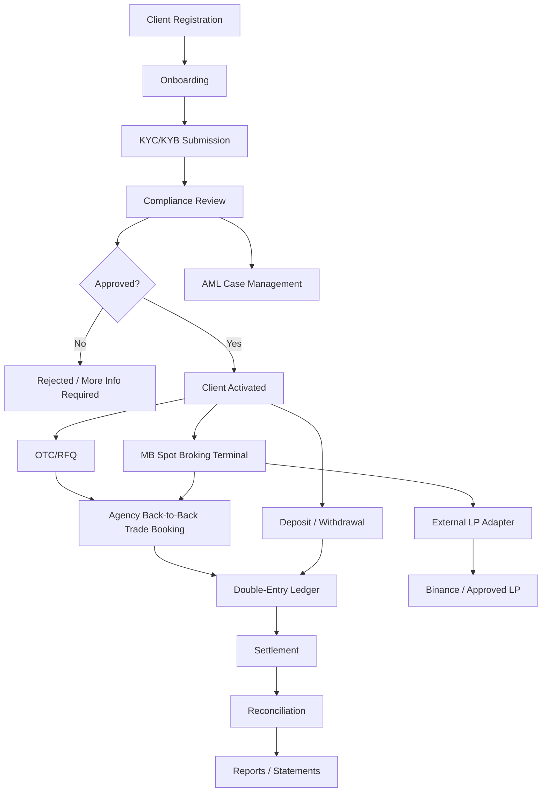
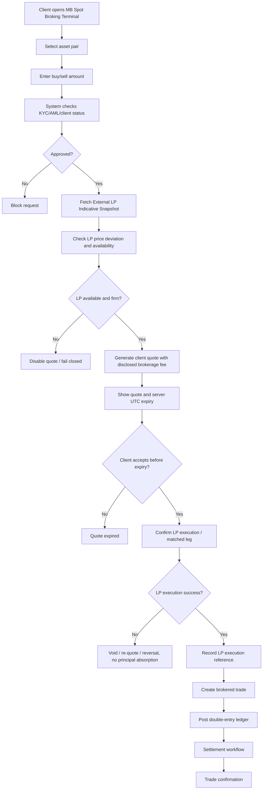

# 01 Project Charter  
# AIX Institutional Digital Asset & RWA Platform

> ## v1.5 — RE-BASELINED ON APPROVED DOC 00 v1.5
>
> **Base document is now `00_Licence_Scope_And_Feature_Lock_v1.5.md` (APPROVED).** v1.4's
> normative scope is superseded prospectively; v1.4 is archived intact and its historical
> statements remain accurate for the period they describe.
>
> **Governing principle added by `DEC-013`:**
>
> > **Unresolved regulation blocks production activation, not software development.**
>
> **What changes.** A capability's **build state**, its **availability per environment**, its
> **production activation state** and its **product/asset eligibility** are four separate facts
> (Doc 00 §1.D) across five environments (Doc 00 §1.E). The Charter's scope sections are
> restated on that basis: **AIX Exchange** — the securities / financial-instrument /
> security-token market capability — becomes a delivery target whose software is built now and
> whose production activation stays gated (§6.4, §12A.6); the full **AIX RWA**, **AIX Pay** and
> **AIX Spot** platforms likewise. §26.1 moves from four environments to five. Three stale locks
> carried from v1.3 are corrected (§6.3, §12.6).
>
> **What does not change — stated first because it is what matters most.**
> - **Model C remains prohibited in every environment, including local development.** No
>   internal client-to-client matching, no AIX-operated MB order book, no crossing or netting of
>   client orders, no principal dealing, no proprietary market making, no AIX principal
>   liquidity (Doc 00 §7.7, §1.D.4).
> - **The securities Exchange matching engine grants AIX Spot nothing** (Doc 00 §12E.4).
> - **Derivatives, futures, margin, leverage, lending, staking and yield remain out of scope.**
> - **Every accepted governance control is preserved in full.** Compliance-first delivery,
>   licence control, safeguarding, maker-checker, segregation of duties, double-entry financial
>   control, audit and evidence, cybersecurity, operational resilience, BCP/DR, vendor and
>   outsourcing governance, testing, acceptance gates, AI governance, feature locking and
>   fail-closed behaviour. **No control is weakened to make product delivery easier, and no
>   control is relaxed in a non-production environment** (Doc 00 §21A rule 7).
>
> **Derived from:** Doc 00 v1.5; `DEC-011`; `DEC-012`; **`DEC-013`**; `STR-01`; `STR-02`;
> **`STR-03`**.
>
> **Approves nothing Doc 00 does not, and claims no regulatory approval AIX has not received.**
> No securities activity, RWA issuance, venue, order type or asset is activated by this Charter.
> Unresolved regulatory questions remain fail-closed in production (Doc 00 §23).

## Document Control

| Item | Details |
|---|---|
| Document name | 01_Project_Charter_v1.5.md |
| Platform | AIX Institutional Digital Asset & RWA Platform |
| Document type | SDLC Phase 1 / Project Initiation |
| Version | v1.5 |
| Status | **APPROVED** — re-baselined on Doc 00 v1.5 and `DEC-013`; internally reviewed for consistency against them |
| Prepared for | Management, product, compliance, development, architecture, and implementation planning |
| Base document | **00_Licence_Scope_And_Feature_Lock_v1.5.md (APPROVED)** |
| Supersedes | v1.4 (archived) |

---

## 1. Purpose of This Document

This Project Charter formally defines the project purpose, scope, boundaries, delivery approach, licence assumptions, MVP scope, exclusions, major risks, and success criteria for the AIX Money Broking Platform.

This is the second SDLC document after:

```txt
00_Licence_Scope_And_Feature_Lock_v1.4.md
```

This document does not define database tables, API endpoints, UI components, or implementation code. Those will be prepared in later documents.

This document answers:

1. What are we building?
2. Why are we building it?
3. Who will use it?
4. What licence scope controls the build?
5. What is included in MVP?
6. What is excluded from MVP?
7. What are the high-level modules?
8. What are the main risks?
9. What are the success criteria?
10. What documents must be prepared next before coding starts?

---

## 2. Project Name and Product Names

```txt
AIX Institutional Digital Asset & RWA Platform
```

**Product names** (Doc 00 v1.5 §2A — platform terminology, not regulatory permission):

| Product | Meaning | Regulatory route |
|---|---|---|
| **AIX Spot** | Institutional digital-currency spot, eligible **non-security** digital assets, externally routed | Digital Money Broking |
| **AIX OTC** | Institutional RFQ / block execution | Digital Money Broking |
| **AIX Pay** | Payment / merchant platform | PSO |
| **AIX RWA** | Real-world-asset tokenisation and asset-lifecycle platform | Depends on classification |
| **AIX Exchange** | The **securities / financial-instrument / security-token market** capability. **A delivery target from v1.5**; production activation gated | Securities / Exchange — scope unresolved (`R1-Q1b`) |

**Names that must never be used for digital-currency spot trading:**

```txt
AIX Exchange          (reserved for securities capability only)
AIX Order Book        (AIX operates no order book)
AIX Matching Engine   (standing prohibition)
AIX Market Maker      (standing prohibition)
AIX Public Trading Market
```

**"AIX Exchange" is a build target, not an approval.** `DEC-013` clause 7 authorises its
architecture, specification, implementation and testing. It grants no securities capability and
asserts nothing about the scope of AIX's Exchange approval, which is unresolved (Doc 00 §12C,
§12E, `R1-Q1b`). **AIX Exchange is not ordinary BTC/USDT Spot**, and must never be used to
describe, label or justify any AIX Spot capability.

---

## 3. Project Background

AIX holds:

1. Approved Money Broking licence.
2. Approved Payment System Operator licence.
3. Pending Exchange application.

The platform will be developed as a regulated Labuan Money Broking and PSO platform.

The platform will support:

1. Client onboarding.
2. KYC/KYB.
3. AML risk controls.
4. OTC/RFQ broking.
5. MB Spot Broking Terminal.
6. External LP-backed agency/back-to-back execution.
7. Payment and settlement workflow.
8. Double-entry ledger.
9. Audit log.
10. Maker-checker approval.
11. Travel Rule enforcement.
12. Reporting.
13. Staff portal.
14. Admin portal.
15. Client portal.

**The Money Broking product must not be developed as a venue.** Three distinct lock classes (Doc 00 v1.5 §6):

- **STANDING PROHIBITION — not unlocked by any approval, in any environment:** an AIX-operated matching book for digital currency, client-to-client crossing, market making, principal dealing, principal liquidity (Model C, §12A.2, §6.3).
- **BUILD-UNLOCKED / PRODUCTION-GATED:** the securities / financial-instrument Exchange capability (§12A.6), the RWA securities route, AIX Pay beyond the §5.2 baseline, and Model B multi-venue routing. **Built and tested now; production activation gated** (§6.4).
- **PRODUCT-SCOPE PROHIBITION — no development effort:** derivatives, futures, margin, leverage, lending, staking, yield (§6.5).

---

## 4. Project Vision

The project vision is to build a secure, scalable, modular, and audit-ready **institutional digital asset, payment and RWA platform**, operating under AIX's Labuan Money Broking and PSO licences, with **securities-market capability built and tested but gated behind classification and applicable regulatory activation**.

The platform must be built as a real production platform, not a demo.

**One institutional core, four product pillars plus a securities-market capability.** AIX Spot, AIX OTC, AIX Pay and AIX RWA share a single core rather than operating as four systems, and AIX Exchange consumes that same core (§12A). The separation that governs this Charter throughout is Doc 00 v1.5 §1.A and §1.D:

> Architecture is never permission to operate. **And the absence of permission to operate is never a bar to architecture.**

A capability's **build state**, its **environment availability**, its **production activation state** and its **product/asset eligibility** are four separate facts. Confirmed target capabilities are built now; production activation stays fail-closed.

The platform must support:

1. More than 1,000 users.
2. High-traffic usage.
3. Modular expansion.
4. Staff operations.
5. Compliance control.
6. Auditability.
7. Ledger integrity.
8. **Institutional account structure** — legal entity, master account, subaccounts (`DEC-011`).
9. **Four product pillars** — Spot, OTC, Pay, RWA — over shared infrastructure, plus the **AIX Exchange** securities-market capability.
10. **Provider-neutral external execution** — no named venue is assumed or approved.
11. **Capability gating** — every capability independently controllable across four states and five environments, and fail-closed (Doc 00 §1.D, §1.E, §21A).
12. **Securities / Exchange capability built and tested ahead of approval**, so that activation is a governed configuration act rather than a build project (`DEC-013` clause 7).
13. **Development, test, UAT and controlled-demo environments carrying the full platform**, with production activation separately and affirmatively gated.

---

## 5. Project Objectives

The project objectives are:

1. Build a production-grade Money Broking platform.
2. Support OTC/RFQ broking.
3. Support MB Spot Broking Terminal.
4. Use external LP-backed agency/back-to-back execution.
5. Prevent AIX from acting as principal, market maker, or liquidity provider.
6. Keep AIX inventory limit at zero.
7. Use disclosed brokerage fee as revenue model.
8. Block AIX spread markup.
9. Support client onboarding and compliance review.
10. Support KYC/KYB and beneficial ownership collection.
11. Support AML risk scoring and compliance case handling.
12. Support Travel Rule enforcement for relevant digital asset transfers.
13. Support deposit, withdrawal, payment instruction, and settlement workflows.
14. Support double-entry ledger for all financial movements.
15. Support audit log for all sensitive actions.
16. Support maker-checker for high-risk actions.
17. Support admin, staff, and client portals.
18. Support reporting and statement generation.
19. Keep **securities / financial-instrument Exchange capability** disabled pending the applicable approval, and keep **internal client-to-client matching** disabled as a **standing prohibition not unlocked by any approval** (Doc 00 §6, §7.7).
20. Prepare the platform for future securities capability activation using feature flags and modular architecture, **subject to AIX's actual approval and the applicable securities framework**.
21. Deliver four products — AIX Spot, AIX OTC, AIX Pay, AIX RWA — over one shared institutional core (§12A).
22. Operate an institutional account hierarchy: legal entity → master account → subaccount → ledger account (`DEC-011`).
23. Route all Spot and OTC execution to approved external counterparties; remain intermediary throughout (`DEC-012`).
24. Gate every capability independently and fail closed on anything unresolved (Doc 00 §21).

---

## 6. Licence Scope Summary

The platform must follow the licence boundaries defined in `00_Licence_Scope_And_Feature_Lock_v1.4.md` (APPROVED).

| Licence / Approval | Status | Project Treatment |
|---|---|---|
| Money Broking | Approved | Active MVP scope |
| Payment System Operator | Approved | Active MVP scope |
| Exchange Application | Pending | Locked future scope |

### 6.1 Money Broking Build Scope

The Money Broking scope includes:

1. OTC/RFQ broking.
2. MB Spot Broking Terminal.
3. Brokered quote-and-confirm flow.
4. External LP-backed liquidity.
5. Agency/back-to-back trade booking.
6. Disclosed brokerage fee calculation.
7. Trade confirmation.
8. Client trade history.
9. Compliance-linked trade approval.
10. Audit-ready transaction records.

### 6.2 PSO Build Scope

The PSO scope includes:

1. Deposit request.
2. Withdrawal request.
3. Payment instruction.
4. Payment tracking.
5. Settlement tracking.
6. Reconciliation.
7. Payment reference.
8. Payment report.

### 6.3 Money Broking Venue Prohibitions — permanent, every environment

**Retitled and reclassified in v1.5.** v1.4 carried this list unchanged from v1.3 under the
heading "Exchange Locked Scope", which conflated three different things: permanent Money Broking
boundaries, order types already reclassified by Doc 00 §11B, and the securities Exchange product
(`STR-03` L-27, L-28). This version separates them. **No prohibition is removed.**

**Permanently prohibited — `CAPABILITY_BUILD_STATE = NOT_SPECIFIED`, disabled in DEVELOPMENT,
TEST, UAT, DEMO and PRODUCTION, with no activation path** (Doc 00 §1.D.4, §7.7):

1. AIX public order book **for Money Broking Spot**.
2. AIX internal matching engine **for Money Broking Spot**.
3. AIX public market depth presented as an AIX-operated market.
4. Public exchange trading **operated by AIX for digital currency**.
5. **Client-to-client matching** — crossing, netting or internalising one AIX client's order
   against another's.
6. Public market API **for an AIX-operated market**.
7. Market maker engine.
8. Exchange-style open market execution **within Money Broking**.
9. Principal dealing and AIX principal liquidity.

**No Exchange approval of any scope unlocks any of these** (Doc 00 §7.7). The securities Exchange
matching engine's existence grants AIX Spot nothing (Doc 00 §12E.4).

**Corrected in v1.5 — items moved out of this list.** v1.4 items 9 and 10 ("resting limit
orders", "stop-limit, GTC, post-only, maker/taker order behaviour") were locked here as exchange
order-book behaviour. **Doc 00 §6 (from v1.4) already reclassified order types out of that lock** into
§11B's product-rule gate, and the Charter was not updated. They are **not licence locks**:
Market, Limit and Cancel are architectural baseline candidates; Stop, Stop-Limit, IOC, FOK and
GTC require specific product-rule review before production activation. **Maker/taker fee
behaviour stays prohibited** as an MB-boundary and revenue-model matter (§7.2). **This corrects a
classification. It activates no order type.**

### 6.4 Build-Unlocked / Production-Gated Scope

**New in v1.5. `DEC-013`.** These capabilities are **delivery targets now**, built and tested,
with production activation gated:

| Capability | Build | Non-production | Production |
|---|---|---|---|
| **AIX Exchange** — securities market (§12A.6) | Authorised | DEV / TEST / UAT / DEMO, synthetic instruments, non-live execution | **DISABLED** pending `R1-Q1b` and Doc 00 §21 |
| **AIX RWA** — full asset lifecycle (§12A.5) | Authorised | DEV / TEST / UAT / DEMO, synthetic assets | **DISABLED** pending `R4-Q1`…`R4-Q7` |
| **AIX Pay** — full payment platform (§12A.4) | Authorised | DEV / TEST / UAT / DEMO | **§5.2 baseline** per gates; **beyond it DISABLED** pending `R5-Q1`, `R5-Q2` |
| **AIX Spot** — full trading capability (§12A.2) | Authorised | DEV / TEST / UAT / DEMO, mock venues | Per Doc 00 §20.1; Model B **per-venue gated** |
| **Security-token issuance and secondary market** | Authorised | Synthetic instruments only | **DISABLED** pending `R4-Q2`, `R1-Q1b` |

**Building a capability is never permission to operate it** (Doc 00 §1.A). **Being available in
four environments is never evidence for the fifth** (Doc 00 §21A rule 4).

### 6.5 Out-of-Scope Products — no build, no environment, no gate

**`DEC-013` clause 6.** Derivatives, perpetual futures, futures, margin trading, leveraged
trading, lending, staking, yield / earn products, DeFi yield, privacy coins, algorithmic
stablecoins where currently prohibited, MYR trading pairs where currently prohibited, and
self-custody wallet service. **No development effort is authorised on any of them**, and none has
a production gate because none has a path to production (Doc 00 §20.6).

---

## 7. Execution and Revenue Model

### 7.1 Execution Model

The approved MVP execution model is:

```txt
Agency back-to-back execution
```

This means:

1. AIX does not act as principal.
2. AIX does not carry naked position.
3. AIX inventory limit is zero.
4. Client execution must be tied to firm or secured LP leg.
5. LP outage must fail closed.
6. No internal fallback pricing is allowed.
7. LP partial fill must not create AIX residual position.
8. LP slippage beyond tolerance must void or re-quote the client trade.
9. Any re-quote requires fresh client confirmation.
10. Failed LP execution triggers void or ledger reversal, not principal absorption.

### 7.2 Revenue Model

The approved MVP revenue model is:

```txt
Disclosed brokerage fee / commission
```

The following are blocked:

1. AIX spread markup.
2. Hidden spread.
3. Principal margin.
4. Market-making revenue.
5. Proprietary trading gain.
6. Client trade loss becoming AIX gain.

---

## 8. Client Type Scope

The MVP client type scope is:

```txt
Institutional clients and HNWI / professional clients only.
```

Retail client onboarding is disabled by default.

Rules:

1. Retail onboarding must remain disabled unless separately approved.
2. Corporate and institutional clients must complete KYB.
3. Beneficial ownership must be collected for corporate clients.
4. HNWI / professional clients must complete required suitability, source of funds, and source of wealth checks.
5. Product access must be filtered by client type.
6. Any future retail access requires separate approval, documentation update, risk assessment, and feature flag change.

---

## 9. Custody and Client-Money Safeguarding Model

This section defines a blocking architecture dependency for all money movement modules.

The MVP must not assume AIX self-custody or AIX private-key custody.

### 9.1 Digital Asset Custody Model

The approved direction is:

```txt
Third-party custody model.
AIX self-custody is blocked unless separately approved.
```

Rules:

1. AIX must not hold client private keys in MVP.
2. Digital assets must be held through a third-party custodian or approved custody arrangement.
3. Client digital asset balances shown in the platform must be ledger-based records backed by custodian records.
4. Custodian sub-account, omnibus account, or segregated account model must be decided before SRS.
5. Custodian reconciliation must be part of daily operations.
6. Custody provider due diligence is required before production.
7. Custody provider SLA, security controls, insurance, incident reporting, and audit rights must be reviewed before production.

Blocking dependency:

```txt
crypto_custody_provider = to_be_selected_before_SRS
custody_model = third_party_custodian_required
self_custody = disabled
```

### 9.2 Fiat Client Money Safeguarding Model

The approved direction is:

```txt
Client money must be segregated at bank-account level from AIX operating funds.
```

Rules:

1. Client fiat funds must not be mixed with AIX operating funds.
2. Client money safeguarding account is required.
3. Bank-level segregation must be reflected in the ledger.
4. Reconciliation must compare platform ledger, bank statement, and settlement records.
5. Client money must not be used for AIX expenses, debt, payroll, vendor payment, or operating cost.
6. Withdrawal workflow must depend on ledger balance and bank/custodian availability.
7. Fiat banking partner must be confirmed before SRS.

Blocking dependency:

```txt
fiat_banking_partner = to_be_selected_before_SRS
client_money_safeguarding_account = segregated_bank_level_required
client_asset_segregation = required
```

### 9.3 Custody and Safeguarding Architecture Decision

Before SRS, the following must be confirmed:

| Item | Status |
|---|---|
| Crypto custodian | To be selected |
| Fiat banking partner | To be selected |
| Client money safeguarding account | Required |
| Custodian account structure | To be defined |
| Daily reconciliation method | Required |
| Custodian API integration | Required if applicable |
| Bank integration / statement import | Required |
| Custody incident handling | Required |
| Custody exit plan | Required |

This is a blocking dependency. The SRS must not finalise deposit, withdrawal, settlement, or client balance logic until custody and client-money safeguarding architecture is defined.

### 9.4 Settlement Sequencing / Delivery-versus-Payment Rules

The SRS must define settlement sequencing before money-movement modules are finalised.

The approved principle is:

```txt
No client ledger credit, LP payment, or asset release may occur in a sequence that creates AIX principal, credit, or settlement exposure.
```

Rules:

1. Client funds or digital assets must be available, verified, and locked before trade execution where pre-funding is required.
2. Final client ledger credit must not be posted before confirmed bank or custodian receipt where doing so creates AIX exposure.
3. LP payment must not be released before the corresponding client-side asset or fund control is confirmed, unless an approved DvP or safeguarded settlement mechanism exists.
4. If true DvP is not available, the system must use pre-funded holds, suspense accounts, clearing accounts, and fail-closed settlement status.
5. Failed settlement must trigger void, re-quote, reversal, or exception workflow. AIX must not absorb the settlement difference as principal.
6. Partial settlement must not create AIX residual position.
7. Ledger posting must distinguish pending, held, cleared, settled, failed, reversed, and disputed states.
8. Settlement completion must require evidence from the bank, custodian, LP, or approved settlement source.
9. Three-way reconciliation must compare LP execution, custodian/bank movement, and platform ledger.
10. DvP sequencing is a blocking decision before SRS money-movement design.

Blocking dependency:

```txt
settlement_sequence_model = to_be_defined_before_SRS
dvp_required_where_available = true
prefunded_hold_required = true
final_credit_requires_confirmed_receipt = true
lp_payment_before_client_control = prohibited
settlement_failure_handling = void_requote_reversal_exception
```

### 9.5 FX / Conversion Policy Gate

The SRS must define FX and conversion policy before fiat-to-digital-asset or multi-currency workflows are finalised.

Rules:

1. FX and conversion rate source must be defined.
2. Rate timestamp must be captured using server UTC.
3. Rate validity window must be defined.
4. Rounding and asset precision policy must be defined.
5. Fee and conversion cost must be disclosed before client confirmation.
6. Any FX movement between quote and settlement must not be absorbed by AIX unless separately approved as a permitted model.
7. If rate changes beyond tolerance, the transaction must be voided or re-quoted.
8. Re-quote requires fresh client confirmation.
9. FX rate, source, timestamp, fee, and rounding must be stored for audit.

Blocking dependency:

```txt
fx_conversion_policy = to_be_defined_before_SRS
settlement_sequence_model = to_be_defined_before_SRS
dvp_required_where_available = true
prefunded_hold_required = true
final_credit_requires_confirmed_receipt = true
lp_payment_before_client_control = prohibited
settlement_failure_handling = void_requote_reversal_exception
fx_rate_source = to_be_defined
fx_rate_timestamp_source = server_utc
fx_rounding_policy = to_be_defined
fx_movement_bearer = client_or_void_requote_no_aix_absorption
```

---

## 10. Project Scope

### 10.1 In Scope for MVP

#### Foundation

1. Authentication.
2. MFA.
3. User management.
4. Role-based access control.
5. Feature flags.
6. Audit log.
7. Maker-checker.
8. Notification.
9. Document management.

#### Client and Compliance

1. Client onboarding.
2. KYC/KYB.
3. Beneficial ownership.
4. Source of funds.
5. Source of wealth.
6. AML risk scoring.
7. Sanctions / PEP status.
8. Wallet screening.
9. Travel Rule enforcement.
10. AML case management.
11. Account freeze / suspension.
12. Periodic KYC/CDD refresh.
13. STR / regulatory filing workflow.
14. Threshold transaction reporting.
15. Tainted-funds / mixer handling.

#### Product — AIX Spot and AIX OTC

1. OTC/RFQ: request, eligibility, LP sourcing, quote comparison, executable quote, client
   acceptance, pre-funded hold, execution, DvP, settlement, reconciliation, reporting.
2. AIX Spot trading interface (v1.5: renamed from "MB Spot Broking Terminal", Doc 00 §2A).
3. Market data, charts, external / aggregated market depth display.
4. LP-backed quote request.
5. Client order lifecycle, open orders, order history, trade history.
6. Market, Limit and Cancel order support; partial fills; split fills.
7. Execution routing; multi-LP capability (production-gated per venue).
8. Agency/back-to-back trade booking.
9. Disclosed brokerage fee calculation.
10. Trade confirmation.
11. Best execution / fair pricing evidence.
12. Trading API.
13. Market surveillance (v1.5: a **required control** under LFSA-DMB-2025 ¶6.4(i), not a locked
    future module — see §12.6).
14. Order types whose production use is unresolved, implemented **behind product/configuration
    gates** (Doc 00 §11B).

#### Product — AIX Pay *(new in v1.5; build-unlocked, production-gated per §6.4)*

1. Merchant onboarding; merchant organisation; merchant users and roles.
2. Payment intent; hosted checkout; API checkout; QR; invoices; payment status lifecycle.
3. Digital-asset payments; conversion orchestration where applicable.
4. Settlement; payout; refund; whitelisted settlement destinations.
5. Fee engine.
6. API keys; webhooks.
7. Reconciliation; merchant reporting; maker-checker; risk controls.

#### Product — AIX RWA *(new in v1.5; build-unlocked, production-gated per §6.4)*

The full lifecycle in §12A.5, end to end, from issuer onboarding to redemption and
secondary-market eligibility.

#### Product — AIX Exchange *(new in v1.5; build-unlocked, production-gated per §6.4)*

The securities-market capabilities in §12A.6. **Securities domain only** (§12A.6 boundary).

#### Money and Settlement

1. Double-entry ledger.
2. Client balance.
3. Deposit workflow.
4. Withdrawal workflow.
5. Payment instruction.
6. Settlement.
7. Daily client-money reconciliation.
8. LP three-way reconciliation.
9. Statement generation.

#### Portal and Reporting

1. Client portal.
2. Staff portal.
3. Admin portal.
4. Compliance reports.
5. Ledger reports.
6. Transaction reports.
7. Settlement reports.
8. Management reports.
9. System health monitoring.
10. Incident log.

---

### 10.2 Out of Scope

**Reclassified in v1.5.** v1.4's single flat list mixed permanent prohibitions, product-scope
exclusions, production gates and delivery-sequencing choices (`STR-03` L-29…L-33). They are now
separated. **Nothing is removed from the platform's prohibitions.**

#### 10.2A Permanently prohibited — every environment, no activation path

1. AIX order book **for Money Broking Spot**.
2. AIX internal matching engine **for Money Broking Spot**.
3. AIX-operated market depth presented as an AIX market.
4. AIX-operated public exchange trading for digital currency.
5. Public market API **for an AIX-operated market**.
6. Client-to-client matching, crossing, netting or internalisation.
7. Market maker module.
8. Proprietary trading / principal dealing / AIX principal liquidity.
9. Maker/taker fee model (§7.2 revenue model).

*(Doc 00 §1.D.4, §7.7, §20.1. `CAPABILITY_BUILD_STATE = NOT_SPECIFIED`, permanently.)*

#### 10.2B Out of product scope — no development effort authorised

10. Derivatives, perpetual futures, futures.
11. Margin trading, leveraged trading.
12. Lending / borrowing of client assets.
13. Staking.
14. Yield / earn products, DeFi yield.
15. Self-custody wallet service.
16. Privacy coins.
17. Algorithmic stablecoins where currently prohibited.
18. MYR trading pairs where currently prohibited.

*(`DEC-013` clause 6; Doc 00 §8.1, §20.6.)*

#### 10.2C Production-gated, not out of scope — build authorised

19. **Securities token trading** — build authorised against synthetic instruments; production
    disabled pending `R4-Q2` and `R1-Q1b` (§6.4). *(Moved out of the prohibition list in v1.5.)*
20. **Execution against displayed depth / click-to-trade depth ladder** — build behind a product
    gate; production disabled pending `R3-Q2b`.
21. **Executable price target request** — remains disabled; Doc 00 §9.2.
22. **Resting client orders routed externally** — no longer classified as exchange behaviour;
    governed by Doc 00 §11B's product-rule gate. *(Corrected in v1.5, matching §6.3.)*

#### 10.2D Client-scope lock — unchanged

23. Retail client onboarding. Institutional and HNWI/professional clients only (Doc 00 §10.2A).

#### 10.2E Out of delivery scope for this phase

24. Mobile native app.

---

## 11. Main User Groups

### 11.1 Client

Client actions:

1. Register account.
2. Complete profile.
3. Submit KYC/KYB.
4. Upload documents.
5. View approval status.
6. Submit OTC/RFQ request.
7. Use MB Spot Broking Terminal.
8. Request deposit.
9. Request withdrawal.
10. View settlement status.
11. Download trade confirmation.
12. Download statement.
13. Submit support request.

### 11.2 Compliance Officer

Compliance actions:

1. Review KYC/KYB.
2. Review beneficial owner details.
3. Review risk profile.
4. Approve client.
5. Reject client.
6. Request additional information.
7. Review AML cases.
8. Freeze account.
9. Suspend account.
10. Add compliance notes.
11. Review transaction alerts.
12. Review Travel Rule data.
13. Prepare STR / regulatory filing workflow.

### 11.3 Operations Officer

Operations actions:

1. Monitor OTC/RFQ.
2. Issue or review quote.
3. Monitor spot broking requests.
4. Review LP-backed execution.
5. Book trade.
6. Monitor settlement.
7. Handle failed trades.
8. Escalate exception cases.
9. Upload settlement proof.
10. Update transaction status.

### 11.4 Finance Officer

Finance actions:

1. View ledger.
2. Perform reconciliation.
3. Review deposits.
4. Review withdrawals.
5. Review fee income.
6. Generate reports.
7. Export settlement reports.
8. Review client money movement.
9. Review trial balance.
10. Review LP three-way reconciliation.

### 11.5 Customer Support

Customer support actions:

1. View client profile.
2. View onboarding status.
3. View transaction status.
4. Create support ticket.
5. Escalate issue.
6. Cannot approve KYC.
7. Cannot process settlement.
8. Cannot change financial records.

### 11.6 Admin

Admin actions:

1. Manage staff users.
2. Manage roles.
3. Manage permissions.
4. Manage feature flags.
5. Manage assets.
6. Manage asset pairs.
7. Manage fee rules.
8. Manage limits.
9. Manage system settings.
10. View audit logs.

### 11.7 Super Admin

Super Admin has high-level system control but must still be subject to:

1. Maker-checker.
2. Audit log.
3. Production safety rules.
4. Feature lock restrictions.
5. No self-approval for restricted actions.
6. No access to modify own audit trail.

---

## 12. High-Level Platform Modules

> **v1.4:** the module set below is the v1.3 baseline, retained. §12A adds the target
> institutional architecture the four products require. Authoritative module ownership,
> numbering and dependencies are the **Master Module Index**'s to define — this Charter states
> the architecture, not the module taxonomy.


### 12.1 Foundation Modules

1. Authentication.
2. MFA.
3. User Management.
4. RBAC.
5. Feature Flags.
6. Audit Log.
7. Maker-Checker.
8. Notification.
9. File / Document Management.

### 12.2 Compliance Modules

1. Client Onboarding.
2. KYC/KYB.
3. Beneficial Ownership.
4. Source of Funds / Source of Wealth.
5. AML Risk Scoring.
6. Sanctions / PEP Screening.
7. Wallet Screening.
8. Travel Rule Enforcement.
9. AML Case Management.
10. Account Freeze / Suspension.
11. STR / Regulatory Filing.
12. Periodic KYC Refresh.
13. Deposit Wallet Screening Disposition.
14. Regulatory Reporting.

### 12.3 Product Modules

1. Asset Configuration.
2. Asset Pair Configuration.
3. Fee Engine.
4. Pricing Engine.
5. LP Adapter.
6. External LP Market Depth.
7. OTC/RFQ.
8. MB Spot Broking Terminal.
9. Best Execution Evidence.

### 12.4 Money and Settlement Modules

1. Double-Entry Ledger.
2. Client Balance.
3. Deposit.
4. Withdrawal.
5. Payment Instruction.
6. Settlement.
7. Reconciliation.
8. Statement Generation.
9. Ledger Reversal.
10. Suspense / Clearing Accounts.
11. Wallet / Blockchain Infrastructure.
12. On-chain Confirmation Monitoring.
13. Records Retention / Archival.

### 12.5 Portal and Reporting Modules

1. Client Portal.
2. Staff Portal.
3. Admin Portal.
4. Reporting.
5. Compliance Reports.
6. Management Reports.
7. System Health.
8. Incident Log.
9. Client Agreement / Consent.
10. BCP / DR.
11. Vendor Integration.

### 12.6 Prohibited and Gated Modules

**Rewritten in v1.5.** v1.4's "Locked Future Modules" list carried two defects
(`STR-03` L-34): it listed **Market Surveillance** as locked, although `SUR-01` now owns it and
LFSA-DMB-2025 ¶6.4(i) *requires* suspicious-order detection and blocking; and it gave no way to
distinguish a permanent prohibition from a production gate.

**Modules that must never exist — permanently, in every environment:**

1. MB Spot Exchange Order Book.
2. MB Spot Matching Engine.
3. AIX-operated Public Market Depth.
4. AIX-operated Public Exchange Trading for digital currency.
5. Public Market API for an AIX-operated market.
6. Market Maker / Principal Dealing module.

*(Doc 00 §1.D.4, §7.7; Master Module Index §17. `MODULE ≠ SERVICE`, and these are not modules in
waiting — there is no capability state that reaches them.)*

**Corrected in v1.5 — Market Surveillance is NOT locked.** It is a **required control** owned by
`SUR-01`, in scope and build-authorised (§10.1, Doc 00 §20.1). Locking it contradicted both the
Master Module Index and LFSA-DMB-2025 ¶6.4(i).

**Modules that are build-authorised and production-gated:** `EXM-01`, `EXO-01`, `EXC-01`,
`EXP-01` (Exchange domain, §12A.6); `RWA-01`…`RWA-04`; `PAY-01`. See §6.4.

---

## 12A. Target Institutional Architecture

Derived from Doc 00 v1.5, `DEC-011`, `DEC-012` and `DEC-013`. **Architecture and delivery, not activation** — every capability is built under `DEC-013` clause 1 and remains subject to Doc 00 §21's **production** gates and §21A's binding state rules.

### 12A.1 Shared institutional core

All four products consume these. **Products must not re-implement core controls independently.**

| Domain | Scope |
|---|---|
| **Legal entity / client** | The regulatory client relationship; legal ownership of assets |
| **Master account** | Top-level operational account structure belonging to a legal entity |
| **Subaccount** | Operational separation (Trading / Treasury / Payments / RWA). **Not separate legal clients** |
| **IAM** | Authentication, MFA, session, step-up |
| **CLT authority** | Membership and authority over the client; **no second membership system** |
| **Compliance** | KYC, KYB, UBO, AML, sanctions/PEP, screening, case handling |
| **Asset & Instrument Registry** | Asset identity, classification outcome, per-product eligibility (Doc 00 §12A) |
| **Wallet / custody** | Custody orchestration, destination whitelisting, screening |
| **Ledger** | Double-entry; the only source of balances |
| **Treasury** | Platform-side asset and liquidity position management |
| **Settlement** | Settlement sequencing and DvP |
| **Reconciliation** | Internal, counterparty and custodian reconciliation |
| **Audit / evidence** | Append-only audit; evidence retention (≥ 6 years for order/trade records) |
| **Reporting** | Client, issuer, internal and regulatory reporting |
| **API platform** | Institutional API surface, credentials, webhooks |
| **Feature / licence control** | Capability gating and fail-closed enforcement |

**Hierarchy (`DEC-011`), four layers never collapsed:**

```txt
Legal Entity / Client → Master Account → Subaccount → Ledger Account
```

Balances live in the ledger, never on a client identity record.

### 12A.2 AIX Spot

| Element | Position |
|---|---|
| **Model A — ACCEPTED** | Client → OMS → eligibility and pre-trade controls → execution routing → approved external counterparty/venue → fill → ledger → settlement → reconciliation |
| **OMS** | Client order store: records instructions and their lifecycle, including unexecuted and cancellable orders |
| **Market data** | External / aggregated market depth from approved sources |
| **External routing** | Execution always external; AIX is intermediary |
| **Provider-neutral LP layer** | Venue abstraction; **no named provider is assumed or approved** |
| **Model B — future capability** | Market-data aggregation → execution policy → multi-LP routing → venue adapters. **Production-gated per venue** |
| **Model C — PROHIBITED** | No mutually executable AIX client order book; no client-to-client crossing; no internal MB matching engine; no AIX market making; no principal liquidity. **Standing prohibition, not unlocked by any Exchange approval** |
| **Order types** | Market / Limit / Cancel are architectural baseline candidates; Stop, Stop-Limit, IOC, FOK, GTC require specific product-rule review. **None activated** |

### 12A.3 AIX OTC

Institutional RFQ / block execution: quote request → external quote sourcing from approved LPs/counterparties → quote aggregation and selection → client acceptance → **pre-funded hold** → external execution → **DvP settlement** → ledger → confirmation → reconciliation. Shares the venue-connectivity and execution-evidence infrastructure with Spot. Internal matching is prohibited here exactly as in Spot.

### 12A.4 AIX Pay

Merchant / payment platform under the PSO licence: merchant onboarding, merchant accounts, payment intents, checkout, payment processing, enterprise APIs, API credentials, webhooks, settlement, payout, refunds, fees, reconciliation and reporting.

**Build-unlocked in v1.5.** AIX Pay development is **not** limited to currently active production functionality. The full enterprise payment platform is architected, specified, implemented and tested, and available in DEVELOPMENT, TEST, UAT and controlled DEMO (§6.4).

**PSO boundary governs production.** The Doc 00 §5.2 baseline is approved scope; **every capability beyond it is `PENDING / FEATURE-LOCKED` in production** until its PSO-scope basis is verified (Doc 00 §12D, `R5-Q1`), and fee models beyond the disclosed brokerage fee remain unresolved (`R5-Q2`). A public checkout surface additionally requires its own perimeter analysis before exposure, and open pre-authentication findings must be closed first. Pay consumes the shared ledger, compliance and reconciliation core; it does not duplicate them.

### 12A.5 AIX RWA

A full tokenisation and asset-lifecycle platform, not a feature. Lifecycle: issuer management → issuer due diligence → asset onboarding → asset verification and evidence → **regulatory classification** → structuring → token configuration → smart-contract orchestration → offering → subscription → investor eligibility → allocation → issuance → holder registry → transfers with restrictions → servicing → corporate actions → distributions → redemption → reporting → secondary-market eligibility.

**Build-unlocked in v1.5.** The full end-to-end RWA platform is architected, specified, implemented and tested against **synthetic assets**, and available in DEVELOPMENT, TEST, UAT and controlled DEMO (§6.4, Doc 00 §12B).

**Classification precedes everything.** Security / security-token route and non-security route are distinguished. **`RWA` does not mean `security`**: every asset passes *Asset Proposal → Classification → Product Eligibility → Operational Eligibility → Activation*. **Unresolved classification prevents production activation of that asset — it does not prevent development of the software, testing with synthetic assets, development of workflows, or UAT and demo of the platform** (Doc 00 §12B.2).

**Production activation is gated** on `R4-Q1`…`R4-Q7`; the security-token route additionally on `R4-Q2` and `R1-Q1b`. Self-custody remains prohibited, constraining RWA token custody design (`R4-Q5`). RWA reuses the shared core and must not re-implement identity, compliance, ledger or settlement.

### 12A.6 AIX Exchange

**New in v1.5. `DEC-013` clause 7. Doc 00 §12E.**

The **securities / financial-instrument / security-token market** capability. **Not** ordinary
BTC/USDT Spot — that is AIX Spot, Money Broking, Model A, externally routed (§12A.2).

| Domain | Scope |
|---|---|
| **`EXM-01`** Exchange Market & Instrument Administration | Instrument admission; listing and listing status; market configuration; trading calendar and sessions; trading halts; market operations |
| **`EXO-01`** Exchange Order Book & Matching Engine | Exchange order entry; central order book; **matching engine**; execution; price/time priority; Exchange market data and depth |
| **`EXC-01`** Exchange Clearing & Settlement Interface | Clearing/settlement interfacing; corporate-action interaction; holder-registry and transfer-control handoff |
| **`EXP-01`** Exchange Participation & Eligibility | Investor/participant eligibility; market permissions; transfer restrictions at the market boundary |
| Shared | `SUR-01` surveillance, `RPT-01` reporting, `API-01` APIs and `AST-01` instrument registry **extend** into the Exchange domain — they are not duplicated |

**Secondary-market route for eligible RWA security tokens:**

```txt
RWA asset → AST-01 classification = SECURITY / SECURITY TOKEN → RWA-02 issuance complete
   → AST-01 secondary-market eligibility → EXM-01 admission/listing → EXP-01 investor eligibility
   → EXO-01 Exchange trading → EXC-01 clearing/settlement
   → LED-01 settlement + RWA-04 holder registry / transfer control → RPT-01 reporting
```

**Binding boundary — permanent, environment-independent (Doc 00 §12E.4):**

> **The Exchange matching engine belongs ONLY to the securities Exchange domain. It must NOT be
> reused, reachable or callable as the MB Spot client-matching engine.**

1. No Money-Broking-domain module may call `EXO-01`. Not `OMS-01`, `EXE-01`, `TRD-01`, `MKD-01`,
   `LQD-01` or `SUR-01`.
2. `OMS-01`'s client order store must never hold mutually executable AIX client orders.
3. `EXE-01` is a router, not a matcher.
4. **Model C remains prohibited.** *"Unlock Exchange development" is not permission to turn AIX
   Spot into an internal matching venue.*

**Production activation: DISABLED**, pending `R1-Q1b` (the scope of AIX's own Exchange approval)
and Doc 00 §21's conditions. **No securities activity is approved by this Charter.**

---

## 13. High-Level System Flow



---

## 14. High-Level Spot Broking Flow



---

## 15. Project Delivery Approach

The project will follow SDLC with module-level blueprint packs.

### 15.0 Program delivery model — the repository is the authoritative control plane

**Binding, and load-bearing for how this programme is executed.**

1. **The Git repository is the authoritative project memory and control plane.** Repository state is what the project knows. Nothing outside it is authoritative.

2. **Model conversations are not authoritative project memory.** A session's reasoning, analysis or report has no standing unless it is written into a version-controlled repository document. A claim that exists only in a conversation does not exist for governance purposes.

3. **The following must be recorded in version-controlled repository documents:**

   | Artefact | Where it lives |
   |---|---|
   | Governance decisions | `DECISION_LOG.md` |
   | Session handovers | `00_project_state/` |
   | Architecture | Masters (`01_masters/`), module blueprints, strategy records (`05_strategy/`) |
   | Implementation reports | Task records / module notes |
   | Acceptance evidence | `02_modules/<MODULE>/acceptance/`, `03_implementation/*/acceptance/`, task records |
   | Findings | `OPEN_FINDINGS.md` |
   | **Regulatory assumptions** | The relevant master, cited to source, or recorded as an unresolved question |

4. **Regulatory assumptions are never implicit.** Every regulatory statement carries an identifiable source, or is explicitly marked unresolved and held fail-closed. An assumption that cannot be sourced is a finding, not a premise.

5. **Findings close on repository evidence only** — a commit and a reproduced result — never on a model's own report.

6. **One module, or one bounded task, per implementation session where practicable.** This keeps a session's context within what it can hold accurately, keeps diffs reviewable, and keeps ownership boundaries clean.

7. **Parallel-agent readiness.** Because the repository is the control plane and work is bounded per session, independent modules may later be developed concurrently by separate agents or worktrees **once shared foundations are stable and module ownership does not overlap**. The Master Module Index carries the dependency clarity that makes this determinable. This Charter authorises the *readiness*, not any particular parallel execution.

8. **Documentation and code are one deliverable.** A change that alters governed behaviour without updating its governing document is incomplete.


### 15.1 SDLC Phases

| Phase | Description | Output |
|---|---|---|
| Phase 0 | Licence scope lock | 00 Licence Scope and Feature Lock |
| Phase 1 | Planning | Project Charter |
| Phase 2 | Requirement analysis | SRS |
| Phase 3 | System design | Architecture, database, API, module blueprints |
| Phase 4 | Development | Source code |
| Phase 5 | Testing | Test results and UAT |
| Phase 6 | Deployment | Staging and production release |
| Phase 7 | Maintenance | Monitoring, fixes, changes, improvements |

### 15.2 Module Blueprint Method

Every module must have its own blueprint pack.

Required files per module:

```txt
01_Module_Blueprint.md
02_Workflow.md
03_Diagrams.md
04_API_Specification.md
05_Database_Design.md
06_State_Machine.md
07_Permission_Rules.md
08_Audit_Log_Events.md
09_Error_Handling.md
10_Test_Cases.md
11_Claude_Prompt.md
```

### 15.3 No Coding Before Documentation Rule

Claude Code must not start coding until the relevant module blueprint is complete and reviewed.

---

## 16. Project Governance

This section defines project authority, sign-off, accountability, and change control.

### 16.1 Governance Roles

| Role | Status | Responsibility |
|---|---|---|
| Project Sponsor | To be named | Business ownership, funding, final project direction |
| Product Owner | To be named | Product scope, backlog priority, user journey approval |
| Principal Officer | To be named / confirm | Regulatory oversight and licence boundary alignment |
| Compliance Officer / MLRO | To be named / confirm | AML, Travel Rule, KYC/KYB, go-live compliance sign-off |
| Operations Lead | To be named | Settlement, trade operations, exception handling |
| Finance Lead | To be named | Ledger, reconciliation, client money control |
| Technical Lead | To be named | Architecture, code quality, delivery management |
| Security Lead | To be named | Security controls, pen test coordination, incident readiness |
| External Legal / Regulatory Advisor | Optional / To be confirmed | Review client terms, disclosures, regulatory matters |

### 16.2 Planning, Budget, and Milestone Control

The exact budget and project timeline must be approved by management before implementation starts.

Indicative milestone structure:

| Milestone | Description | Status |
|---|---|---|
| M1 | SDLC documentation pack completed | In progress |
| M2 | Master Module Index completed | Pending |
| M3 | SRS completed | Pending |
| M4 | Technical architecture and database design completed | Pending |
| M5 | Foundation modules completed | Pending |
| M6 | Compliance modules completed | Pending |
| M7 | Ledger, custody, payment, and settlement modules completed | Pending |
| M8 | OTC/RFQ and MB Spot Broking modules completed | Pending |
| M9 | Testing, security review, and UAT completed | Pending |
| M10 | Pen test, DR test, compliance sign-off, and go-live readiness completed | Pending |

Budget rule:

```txt
project_budget = to_be_defined_before_implementation
project_timeline_milestones = to_be_approved_before_implementation
```

### 16.3 RACI Requirement

A RACI matrix must be prepared before development starts.

Minimum areas requiring RACI:

1. Product scope approval.
2. Licence-boundary change.
3. Feature flag activation.
4. Asset listing approval.
5. LP / vendor approval.
6. Custody provider approval.
7. Client money safeguarding approval.
8. Go-live approval.
9. Production deployment approval.
10. Incident response authority.

### 16.4 Charter Sign-Off Requirement

This Charter must be approved before SRS finalisation.

Required sign-off:

1. Project Sponsor.
2. Compliance Officer / MLRO.
3. Principal Officer.
4. Technical Lead.
5. Operations Lead.
6. Finance Lead.

### 16.5 Charter Change Control

Any change to the following requires formal approval:

1. Licence scope.
2. Client type scope.
3. Execution model.
4. Revenue model.
5. Custody model.
6. Client money safeguarding model.
7. Exchange feature lock.
8. Travel Rule enforcement model.
9. AML/KYC scope.
10. Go-live readiness gates.
11. **Any capability's `PRODUCTION_ACTIVATION_STATE`** (Doc 00 §1.D.3, §21).
12. **The environment model and any environment's capability availability** (§26.1).
13. **Any change to a permanent prohibition in §6.3, §10.2A or §12.6** — which requires a new
    licence-scope revision, not a Charter amendment.

*(Items 11–13 added in v1.5. Item 13 is a constraint on this Charter, not a power it holds:
a permanent prohibition cannot be lifted here.)*

---

## 17. Proposed Technology Stack

The proposed stack is:

| Layer | Recommended Technology |
|---|---|
| Frontend | Next.js + TypeScript |
| Backend | NestJS + TypeScript |
| Database | PostgreSQL |
| ORM | Prisma |
| Cache / Queue | Redis + BullMQ |
| Realtime | WebSocket / Socket.IO |
| File Storage | S3-compatible object storage |
| Infrastructure | Docker first, Kubernetes later |
| API Docs | OpenAPI / Swagger |
| Testing | Jest, Playwright, API tests |
| Monitoring | Sentry, Prometheus, Grafana |
| CI/CD | GitHub Actions |
| Secret Management | KMS / Vault |
| Audit Integrity | Append-only + hash-chain |
| Ledger | Double-entry ledger |

This stack may be confirmed again during `08_Master_Technical_Architecture.md`.

---

## 18. Performance Targets

Initial performance targets:

| Item | Target |
|---|---:|
| Registered users | 1,000+ |
| Concurrent users target | 1,000 |
| Normal API response | Less than 300 ms |
| Heavy API response | Less than 1,000 ms |
| Quote update response | Less than 1 second |
| WebSocket reconnect | Less than 5 seconds |
| Uptime target | 99.9% |
| Error rate target | Below 1% |
| Recovery point objective | 15 minutes or less |
| Recovery time objective | 1 hour or less |

These targets are initial developer planning targets and may be refined after load testing.

---

## 19. Security and Control Principles

The platform must apply:

1. MFA for staff.
2. MFA for clients where required.
3. Role-based access control.
4. Permission guard on every protected API.
5. Backend-enforced feature flags.
6. Maker-checker for sensitive actions.
7. Audit log for all sensitive actions.
8. Tamper-evident audit log.
9. Read access logging for sensitive PII.
10. Double-entry ledger for all balance movements.
11. No direct balance editing.
12. No deletion of audit logs.
13. No production secrets inside code.
14. Rate limiting.
15. Session timeout.
16. Device and IP logging.
17. Secure file upload.
18. Encryption in transit.
19. Encryption at rest for sensitive data.
20. Monitoring and alerting.
21. Backup and restore plan.
22. Incident response process.
23. Server UTC quote expiry.
24. Idempotency on financial operations.
25. Fail-safe default deny.

---

## 20. Dependencies and Vendors

The platform depends on external vendors and regulated service providers. These dependencies must be documented before SRS finalisation.

### 20.1 Required External Dependencies

| Dependency | Status | Purpose |
|---|---|---|
| Crypto custodian | To be selected | Digital asset custody / wallet infrastructure |
| Fiat banking partner | To be selected | Client money safeguarding and settlement |
| Liquidity provider | Binance or approved LP to be confirmed | External liquidity and market data |
| Backup liquidity provider | To be defined | LP concentration risk control |
| Market-data licence / agreement | Required | Legal permission to display LP market data |
| Sanctions / PEP screening vendor | To be selected | AML screening |
| Blockchain analytics vendor | To be selected | Wallet screening and tainted-funds detection |
| KYC / IDV vendor | To be selected | Identity verification / KYB support |
| On-chain node / data provider | To be selected if needed | Blockchain confirmation monitoring |
| Cloud provider | To be selected | Hosting and infrastructure |
| Email / SMS / notification vendor | To be selected | OTP, MFA, alerts, notices |
| E-sign / consent provider | Optional / to be selected | Client agreement and consent capture |

### 20.2 Vendor Controls

Each critical vendor must have:

1. Due diligence.
2. Contract / SLA.
3. Security review.
4. Data protection review.
5. Regulatory / outsourcing assessment.
6. Exit plan.
7. Incident notification duty.
8. Audit or assurance evidence.
9. Concentration-risk assessment.
10. Business continuity arrangement.

### 20.3 Outsourcing / Regulatory Notification

If any outsourced function is material to licensed activity, the project must confirm whether LFSA notification or approval is required before production.

---

## 21. Key Project Assumptions

The project assumes:

1. MB licence is approved.
2. PSO licence is approved.
3. Exchange approval is pending.
4. AIX will not activate Exchange features until approval.
5. Binance or another approved LP may be used for liquidity and market depth.
6. External LP data must be treated as external indicative market depth.
7. LP depth must be non-executable and non-clickable.
8. AIX will not directly expose LP access to client.
9. AIX will not operate internal matching engine in MVP.
10. AIX will use disclosed brokerage fee as revenue model.
11. AIX will not earn principal spread markup.
12. AIX inventory limit is zero.
13. LP outage fails closed.
14. LP partial-fill or slippage beyond tolerance results in void, re-quote, or reversal.
15. Institutional and HNWI/professional clients are the MVP client scope.
16. Retail onboarding is disabled by default.
17. System must be audit-ready from day one.
18. LP depth display uses indicative snapshot mode, not continuous executable order-book streaming.
19. Locked modules must not be partially wired into live MVP paths.
20. OTC/RFQ execution is agency only, with LP/counterparty leg and no AIX principal role.
21. Settlement sequencing must avoid AIX principal, credit, or settlement exposure.
22. FX movement beyond tolerance must result in void or re-quote, not AIX absorption.

---

## 22. Key Project Constraints

The project has these constraints:

1. Exchange application is pending.
2. Exchange features must be locked.
3. AIX must not act as principal under MB module.
4. AIX must not operate market maker logic under MB module.
5. Client-to-client matching is not allowed in MVP.
6. MYR trading pairs are disabled.
7. Privacy coins are disabled.
8. Algorithmic stablecoins are disabled.
9. Securities tokens are disabled unless separately approved.
10. Self-custody wallet is disabled unless separately approved.
11. Retail onboarding is disabled in MVP.
12. Travel Rule enforcement must be built for relevant digital asset transfers.
13. AML/KYC must be integrated into transaction flow.
14. Ledger must be double-entry.
15. Feature flags must be backend-enforced.
16. Audit logs must be immutable and tamper-evident.
17. LP market data redistribution rights must be confirmed before production.
18. Data residency must be confirmed before production.
19. Indicative LP depth must not become continuous executable order-book stream.
20. Locked exchange modules must not be partially built or wired into live MVP paths.
21. OTC/RFQ must use agency/no-AIX-principal execution model.
22. DvP or pre-funded hold sequencing must be defined before SRS money-movement design.
23. FX conversion policy must be defined before SRS money-movement design.

---

## 23. Key Risks

| Risk | Description | Control |
|---|---|---|
| Exchange boundary risk | Platform accidentally behaves like exchange | Feature flags, naming control, no matching engine |
| Principal dealing risk | AIX accidentally acts as principal | Agency/back-to-back flow, zero inventory, disclosed fee only |
| Spread risk | Fee model looks like dealer spread | Prohibit AIX spread markup |
| LP dependency risk | Binance / LP outage | Fail-closed, no internal fallback pricing |
| Slippage risk | LP fills worse than client quote | Void or re-quote, no AIX absorption |
| Partial-fill risk | LP partially fills trade | Void or re-quote, no residual inventory |
| Ledger risk | Balance mismatch | Double-entry ledger, idempotency, reconciliation |
| AML risk | Suspicious client or transaction missed | Risk scoring, case management, screening, STR workflow |
| Travel Rule risk | Missing originator/beneficiary data | Travel Rule enforcement and transfer block rules |
| Security risk | Unauthorised access | MFA, RBAC, logging, rate limits |
| Operational risk | Staff makes wrong approval | Maker-checker, audit log |
| Compliance risk | Wrong asset offered | Approved asset whitelist |
| Custody / safeguarding risk | Client asset loss, custodian failure, or key compromise | Third-party custodian due diligence, reconciliation, incident plan |
| Client money risk | Fiat client funds mixed with operating funds | Bank-level safeguarding account, daily reconciliation |
| LP concentration risk | Binance / LP dependency, offboarding, geo-blocking, credit exposure | Backup LP plan, exposure limits, LP due diligence |
| Market-data licensing risk | External LP data displayed without rights | Market-data licence / agreement before production |
| Conflict-of-interest risk | Broker pricing or LP selection unfair to client | Best execution policy and evidence |
| Data privacy / PDPA risk | Mishandling PII/KYC/Travel Rule data | Encryption, retention policy, access controls |
| Regulatory-change risk | LFSA rules or licence conditions change | Compliance monitoring and change control |
| BCP / DR risk | Platform unavailable or data lost | DR plan, backup testing, recovery targets |
| Key-person risk | Operations depend on one or two people | RACI, documentation, cross-training |
| Settlement sequencing risk | Ledger credit or LP payment occurs before confirmed receipt, creating AIX exposure | DvP rules, pre-funded holds, settlement states, reversal workflow |
| FX movement risk | Rate movement creates unexpected loss or principal exposure | Rate source, timestamp, tolerance, void/re-quote rule |
| Deployment risk | Bug in production | Staging, testing, rollback |

---

## 24. Success Criteria

The project will be considered successful at MVP stage when:

1. Client can register and complete onboarding.
2. Client can submit KYC/KYB and documents.
3. Compliance can review, approve, reject, or request more information.
4. Approved client can submit OTC/RFQ request.
5. Approved client can use MB Spot Broking Terminal.
6. System can show external LP market depth safely.
7. External LP depth is non-executable and non-clickable.
8. Client can request and confirm LP-backed quote.
9. Quote expiry works using server UTC.
10. Trade booking works through agency/back-to-back flow.
11. AIX inventory remains zero.
12. AIX spread markup is not used.
13. LP outage fails closed.
14. LP partial-fill or unacceptable slippage does not create AIX exposure.
15. Ledger entries are created correctly.
16. Deposit and withdrawal workflow works.
17. Settlement status is tracked.
18. Reconciliation workflow exists.
19. Audit log captures sensitive actions.
20. Maker-checker works for sensitive actions.
21. Travel Rule enforcement fields and block rules exist.
22. Reports and statements are generated.
23. Exchange features remain disabled.
24. Suspended or rejected clients cannot trade.
25. Platform can support 1,000+ users with acceptable response time.
26. Compliance / MLRO go-live sign-off is obtained.
27. LFSA notification or approval requirement is confirmed.
28. Penetration test is passed.
29. DR / backup restore test is passed.
30. Client-money reconciliation balances.
31. Ledger trial balance nets to zero.
32. Custody and client-money safeguarding model is approved.
33. Settlement sequencing / DvP model is approved before SRS money-movement design.
34. FX conversion policy is approved before SRS money-movement design.

---

## 25. Deliverables

### 25.1 Documentation Deliverables

1. 00 Licence Scope and Feature Lock.
2. 01 Project Charter.
3. 02 Software Requirement Specification.
4. 03 Master Module Index.
5. 04 Role and Permission Matrix.
6. 05 Master Workflow Map.
7. 06 Master System Rules.
8. 07 Master Data Flow.
9. 08 Master Technical Architecture.
10. 09 Master Security Architecture.
11. 10 Master Testing Strategy.
12. 11 Master Deployment Strategy.
13. Module blueprint packs.
14. AML / Compliance Policy.
15. MLRO / Compliance Manual.
16. Best Execution Policy.
17. Client Agreement / Terms of Business.
18. Risk Disclosure Statement.
19. BCP / DR Plan.
20. Data Protection and Retention Policy.
21. DPIA / Privacy Impact Assessment where required.
22. Incident Response Runbook.
23. Regulatory Reporting SOP.
24. Threat Model.
25. Requirements-to-Licence-to-Module Traceability Matrix.
26. Vendor Due Diligence Pack.
27. Custody and Client-Money Safeguarding Architecture.
28. Settlement Sequencing / DvP Design.
29. FX and Conversion Policy.

### 25.2 Development Deliverables

1. Monorepo setup.
2. Frontend application.
3. Backend application.
4. Database schema.
5. Auth and RBAC.
6. Audit log.
7. Maker-checker.
8. Onboarding.
9. KYC/KYB.
10. Travel Rule enforcement.
11. Ledger.
12. Payment and settlement.
13. OTC/RFQ.
14. MB Spot Broking Terminal.
15. LP Adapter.
16. Reporting.
17. Admin/staff/client portals.
18. Test suite.
19. Deployment pipeline.

---

## 26. Development Delivery Controls

### 26.1 Environment Matrix

**Rewritten in v1.5** (`DEC-013` clause 2; Doc 00 §1.E). v1.4 listed four environments with no
UAT and no DEMO (`STR-03` L-35). The capability-control architecture requires five.

```txt
DEVELOPMENT
TEST
UAT
DEMO
PRODUCTION
```

| Environment | Purpose | Regulated execution | Capability availability |
|---|---|---|---|
| **DEVELOPMENT** | Local and shared development | **Mock / synthetic only** | Per environment configuration |
| **TEST** | Automated unit, integration and E2E testing | **Mock / synthetic only** | Per environment configuration |
| **UAT** | User acceptance testing | **Mock / synthetic only** | Per environment configuration |
| **DEMO** | Controlled demonstration to named audiences | **Mock / synthetic / non-live only** | Per environment configuration |
| **PRODUCTION** | Live regulated operation | Live | **Doc 00 §21 production activation gate** |

Rules:

1. Non-production must not use real client PII.
2. Non-production must not use live LP, venue or custodian credentials.
3. Non-production must use sandbox or mock integrations.
4. Production secrets must be stored in KMS or vault.
5. Production deployment must require approval.
6. **DEMO is not public production.** A controlled demo must never route a real client order to
   a real venue, move real client money, settle a real transaction or issue a real instrument.
7. **No non-production configuration, feature state or capability state may propagate to
   PRODUCTION.** Promotion is an affirmative, governed, maker-checker-approved act, never an
   inheritance.
8. **Unknown or unrecognised environment is treated as PRODUCTION and fails closed.**
9. **A pre-production mirror of production inherits PRODUCTION's activation gate, not UAT's.**
   Where an existing environment identifier does not map cleanly onto these five, it fails closed
   until the mapping is decided (`MIG-005`).
10. **No control is relaxed in a non-production environment.** Audit, permission, KYC/KYB, AML,
    Travel Rule, ledger and balance integrity, client approval, LP settlement approval and
    break-glass logging apply in all five (Doc 00 §21A rule 7).
11. **Enabling a capability in four environments is never evidence for the fifth.**
12. **External DEMO exposure of Exchange and RWA capabilities fails closed** pending `R6-Q1`.

### 26.2 Definition of Done

Each module is only considered done when:

1. Module blueprint is approved.
2. Workflow and diagrams are completed.
3. APIs are documented.
4. Database changes are migrated.
5. Permission rules are implemented.
6. Audit log events are implemented.
7. Error handling is implemented.
8. Unit tests pass.
9. API tests pass.
10. Permission tests pass.
11. Security checks pass.
12. Code review is completed.
13. Documentation is updated.

### 26.3 Code Review and CI/CD Controls

Required controls:

1. Branch protection.
2. Pull request approval.
3. No direct push to main.
4. Automated test run.
5. SAST security scan.
6. DAST security scan where applicable.
7. Dependency vulnerability scan.
8. Secret scanning.
9. Docker image scanning where applicable.
10. Migration review.
11. Release notes.

### 26.4 Test Coverage Standard

The initial minimum test coverage target is:

```txt
min_test_coverage = 80_percent_for_core_business_logic
```

Rules:

1. Ledger, settlement, payment, feature flag, permission, AML, Travel Rule, and quote-expiry logic must have higher test priority than ordinary UI code.
2. Critical financial logic must include unit tests, integration tests, and negative-path tests.
3. Any exception to the minimum coverage target must be approved by the Technical Lead before merge.
4. The Master Testing Strategy may refine the percentage upward by module risk level.

### 26.5 Go-Live Technical Gates

Before production go-live:

1. Independent penetration test must be completed.
2. Critical and high findings must be remediated.
3. DR / backup restore test must pass.
4. Client-money reconciliation must balance.
5. Ledger trial balance must net to zero.
6. Compliance sign-off must be obtained.
7. Production deployment approval must use maker-checker.
8. Rollback plan must be approved.

---

## 27. Build Priority

The build priority must be:

```txt
 1. Documentation
 2. Architecture
 3. Foundation modules            (incl. the five-environment capability-control plane)
 4. Compliance modules
 5. Asset & Instrument Registry   (the classification gate precedes every product)
 6. Ledger and settlement modules
 7. LP / venue integration
 8. AIX OTC (RFQ)
 9. AIX Spot
10. AIX Pay
11. AIX RWA
12. AIX Exchange                  (securities domain; production-gated)
13. Reporting
14. Testing
15. Deployment
```

The platform must not start with the trading screen.

**v1.5 additions.** The capability-control plane (Doc 00 §1.D, §1.E) is foundation work and
precedes every product, because without it a capability can only be enabled everywhere or
nowhere. The Asset & Instrument Registry precedes every product, because the classification gate
governs admission to all of them. **Exchange is last among the products, not because it is
optional, but because it depends on the registry, the ledger, settlement and the RWA issuance
path.** Parallel tracks are set by the Master Module Index's dependency rules, not by this list.

---

## 28. AI Tool Usage

### 28.1 ChatGPT 5.5

Use for:

1. SDLC documentation.
2. Architecture planning.
3. Database design.
4. API planning.
5. Security review.
6. Regulatory logic mapping.
7. Claude prompt generation.
8. Review checklists.

### 28.2 Claude Opus

Use for:

1. Architecture review.
2. Ledger review.
3. Security review.
4. RBAC review.
5. Audit log review.
6. LP-backed spot broking review.
7. Regulatory boundary risk review.

### 28.3 Claude Sonnet

Use for:

1. Normal coding.
2. Module implementation.
3. Frontend pages.
4. Backend APIs.
5. Database migrations.
6. Unit tests.
7. Bug fixing.

### 28.4 Claude Fable

Use for:

1. UX copy.
2. Error messages.
3. Help text.
4. Empty states.
5. Onboarding guidance text.
6. Client-facing explanations.

### 28.5 AI / Claude Governance Rules

1. Do not put real client PII into ChatGPT or Claude prompts.
2. Do not put production secrets, API keys, private keys, tokens, or passwords into prompts.
3. Do not put live LP credentials into prompts.
4. AI-generated regulated logic must be reviewed by a human before merge.
5. AI-generated ledger logic must be reviewed by technical lead and finance/compliance owner.
6. AI-generated AML, Travel Rule, licence-gate, or feature-flag logic must be reviewed by Compliance Officer / MLRO.
7. AI tools must not directly modify production feature flags.
8. AI tools must not bypass licence locks.
9. AI output must go through pull request, test, and review process.
10. External AI tool data-governance rules must be approved before uploading regulated documents, client data, or confidential vendor materials.

---

---

## 29. Additional Charter Parameters

```txt
# --- Governance ---
project_sponsor = to_be_named
mlro_compliance_officer_named = required
charter_management_approval = required
raci_defined = required
project_budget = to_be_defined
project_timeline_milestones = to_be_defined
charter_change_control_authority = defined
compliance_signoff_before_production = required

# --- Custody & client money ---
custody_model = third_party_custodian_required
crypto_custody_provider = to_be_selected_before_SRS
fiat_banking_partner = to_be_selected_before_SRS
client_money_safeguarding_account = segregated_bank_level_required
client_asset_segregation = required
fx_conversion_policy = to_be_defined_before_SRS
settlement_sequence_model = to_be_defined_before_SRS
dvp_required_where_available = true
prefunded_hold_required = true
final_credit_requires_confirmed_receipt = true
lp_payment_before_client_control = prohibited
settlement_failure_handling = void_requote_reversal_exception
fx_rate_source = to_be_defined
fx_rate_timestamp_source = server_utc
fx_rounding_policy = to_be_defined
fx_movement_bearer = client_or_void_requote_no_aix_absorption

# --- Dependencies / vendors ---
lp_legal_agreement_required = true
lp_market_data_license_agreement = required
lp_concentration_backup_lp = to_be_defined
sanctions_screening_vendor = to_be_defined
blockchain_analytics_vendor = to_be_defined
kyc_idv_vendor = to_be_defined
onchain_node_provider = to_be_defined
outsourcing_cloud_regulatory_notification = required

# --- Missing modules ---
module_wallet_blockchain_infra = required
module_regulatory_reporting = required
module_records_retention_archival = required
module_client_agreement_consent = required
module_bcp_dr = required
module_vendor_integration = required

# --- AI / Claude governance ---
ai_no_pii_or_secrets_in_prompts = true
ai_no_real_client_data_in_prompts = true
ai_generated_regulated_logic_human_review = required
ai_cannot_modify_feature_flags = true
ai_cannot_bypass_licence_locks = true
ai_output_code_review_before_merge = required
external_ai_tool_data_governance = required

# --- Delivery controls ---
definition_of_done_per_module = required
code_review_pr_approval = required
branch_protection = required
min_test_coverage = 80_percent_for_core_business_logic
ci_security_scanning = sast_dast_dependency_secret_image
independent_pentest_before_golive = required
production_deploy_approval = maker_checker
environment_matrix = dev_test_staging_prod
rollback_criteria = defined

# --- Go-live assurance gates ---
compliance_golive_signoff = required
lfsa_platform_notification_or_approval = to_be_confirmed
pentest_passed_gate = required
dr_backup_tested_gate = required
client_money_reconciliation_balanced_gate = required

# --- Exchange / principal safety ---
lp_depth_stream_mode = indicative_snapshot_not_continuous
locked_modules_partial_wiring_in_mvp = prohibited
otc_rfq_execution_model = agency_no_aix_principal
```

---

## 30. Next Document

The next document after this Project Charter is:

```txt
02_Software_Requirement_Specification.md
```

However, before writing the full SRS, the recommended supporting document is:

```txt
03_Master_Module_Index.md
```

Reason:

The Master Module Index will define every module and the required blueprint pack for each module. This will make the SRS easier to write and reduce the risk of missing modules.

Recommended next order:

```txt
03_Master_Module_Index.md
02_Software_Requirement_Specification.md
04_Role_And_Permission_Matrix.md
05_Master_Workflow_Map.md
```

---

## 31. Claude Opus Review Prompt

Use Claude Opus to review this document before moving to Master Module Index or SRS.

```txt
Review this 01_Project_Charter_v1.3.md as a principal fintech platform architect.

Context:
- AIX has approved Money Broking and PSO licences.
- Exchange application is pending.
- This Charter is based on 00_Licence_Scope_And_Feature_Lock_v1.4.md (APPROVED).
- The project is to build a regulated Labuan Money Broking + PSO platform.
- Platform includes OTC/RFQ, MB Spot Broking Terminal, external LP-backed agency/back-to-back execution, onboarding, KYC/KYB, AML, Travel Rule enforcement, ledger, payment, settlement, audit log, maker-checker, reporting, and admin/staff/client portals.
- AIX revenue model is disclosed brokerage fee only.
- AIX spread markup, principal dealing, market making, internal matching, and client-to-client matching are blocked.
- Exchange order book, matching engine, public market depth, and public exchange trading must remain locked.
- MVP client scope is institutional and HNWI/professional only. Retail onboarding is disabled by default.

Review for:
1. Missing project scope.
2. Missing constraints.
3. Missing risks.
4. Missing modules.
5. Missing success criteria.
6. Missing licence boundary controls.
7. Missing AI / Claude workflow controls.
8. Missing development delivery controls.
9. Missing documentation deliverables.
10. Any part that may accidentally allow exchange-like or principal-dealing behaviour.

This version has added governance, custody/client-money safeguarding, vendors/dependencies, AI governance, delivery gates, missing modules, go-live assurance, residual exchange/principal controls, settlement sequencing / DvP rules, FX conversion policy gate, DAST alignment, minimum test coverage, and indicative planning milestones.

Do not write code.

Return only:
- Critical gaps.
- Recommended corrections.
- Additional parameters to add.
```
