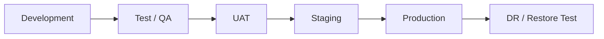
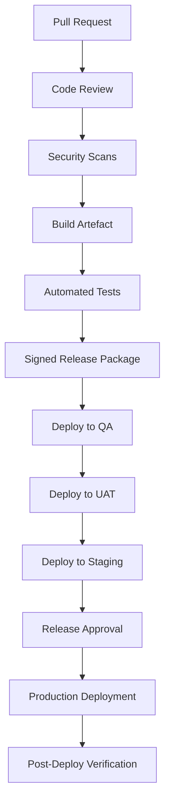

# 11 Master Deployment Strategy  
# AIX Money Broking Platform

## Document Control

| Item | Details |
|---|---|
| Document name | 11_Master_Deployment_Strategy_v1.2.md |
| Platform | AIX Money Broking Platform |
| Document type | SDLC Phase 2 / Master Deployment Strategy |
| Version | v1.2 |
| Status | Accepted / Final verified; master SDLC foundation pack 00–11 complete; no substantive deployment change from v1.1 |
| Prepared for | DevOps, security, architecture, QA, compliance, product, development, operations, finance, and management |
| Base document 1 | 00_Licence_Scope_And_Feature_Lock_v1.3.md |
| Base document 2 | 01_Project_Charter_v1.3.md |
| Base document 3 | 03_Master_Module_Index_v1.2.md |
| Base document 4 | 02_Software_Requirement_Specification_v1.2.md |
| Base document 5 | 04_Role_And_Permission_Matrix_v1.2.md |
| Base document 6 | 05_Master_Workflow_Map_v1.2.md |
| Base document 7 | 06_Master_System_Rules_v1.2.md |
| Base document 8 | 07_Master_Data_Flow_v1.2.md |
| Base document 9 | 08_Master_Technical_Architecture_v1.2.md |
| Base document 10 | 09_Master_Security_Architecture_v1.2.md |
| Base document 11 | 10_Master_Testing_Strategy_v1.2.md |

---

## 1. Purpose

This document defines the master deployment strategy for the AIX Money Broking Platform.

The purpose is to ensure production deployment is controlled, test-backed, auditable, reversible, secure, and aligned with the approved Money Broking and PSO scope.

This document converts the testing strategy, security architecture, technical architecture, workflows, and system rules into a deployment approach covering:

1. Environment promotion.
2. Release governance.
3. Deployment gates.
4. CI/CD controls.
5. Database migration controls.
6. Feature flag and licence-lock validation.
7. Secrets and configuration deployment.
8. Vendor readiness.
9. Data migration and data integrity.
10. Monitoring and observability.
11. Rollback and recovery.
12. Go-live execution.
13. Hypercare and post-go-live support.
14. Production change control.
15. Regulatory and management sign-off.

---

## 2. Deployment Scope Baseline

The deployment strategy must enforce the accepted platform boundary:

```txt
Money Broking licence = approved
PSO licence = approved
Exchange application = pending
MVP client type = institutional and HNWI/professional only
Retail onboarding = disabled by default
Execution model = agency back-to-back
Revenue model = disclosed brokerage fee only
AIX spread markup = blocked
AIX inventory limit = zero
Self-custody = disabled
Third-party custody model = required
Client money safeguarding account = required
Exchange order book = locked
Matching engine = locked
Client-to-client matching = locked
Market making = blocked
Principal dealing = blocked
```

Deployment must not introduce runtime routes, services, flags, jobs, data flows, or admin tools that breach this boundary.

---

## 3. Deployment Principles

### 3.1 Default Production Deny

Production functionality is disabled unless explicitly approved, tested, configured, and released.

### 3.2 Release Only What Is Approved

No module may be deployed to production unless:

1. Module blueprint is approved.
2. Security controls are defined.
3. Test suite is passed.
4. Feature flag is configured.
5. Audit events are mapped.
6. Rollback plan exists.
7. Go-live checklist is signed where applicable.

### 3.3 No Deployment Bypass

Deployment must not bypass:

1. Licence locks.
2. Feature flags.
3. RBAC.
4. Maker-checker.
5. SoD.
6. Audit.
7. Client-money safeguarding.
8. Ledger integrity.
9. Data residency.
10. Vendor approval.

### 3.4 Reversible and Observable

Every production deployment must be:

1. Versioned.
2. Traceable.
3. Approved.
4. Monitored.
5. Reversible where technically possible.
6. Supported by rollback or forward-fix plan.
7. Linked to deployment evidence.

### 3.5 Production Safety Over Speed

If there is conflict between speed and regulated production safety, production safety wins.

---

## 4. Environment Promotion Model



| Environment | Purpose | Promotion Requirement |
|---|---|---|
| Development | Build and developer testing | Unit tests, static checks |
| Test / QA | Formal QA and integration testing | QA test plan executed |
| UAT | Business validation | Domain owner sign-off |
| Staging | Production-like release validation | Full release candidate, masked/synthetic data |
| Production | Live regulated platform | Go-live gates and approval |
| DR / Restore Test | Recovery validation | Backup/restore evidence |

Rules:

1. Code must promote forward through environments.
2. Production hotfix must be back-merged to lower environments.
3. Production config must not be copied into lower environments.
4. Production secrets must not exist in lower environments.
5. Production data must not be used in lower environments unless formally approved, masked, and logged.
6. Every environment must have its own feature flags and secrets.
7. Staging must mirror production architecture sufficiently to validate deployment.

---

## 5. Deployment Architecture Pattern

### 5.1 Recommended Deployment Pattern

The recommended production pattern is:

```txt
Cloud VPC
+ WAF / public edge
+ private application runtime
+ private database and storage
+ controlled egress
+ verified webhook ingress
+ KMS / vault
+ monitoring and alerting
+ encrypted backup and DR
+ CI/CD controlled release
```

### 5.2 Deployment Strategy

The deployment strategy must support:

1. Blue-green, rolling, or equivalent controlled deployment.
2. Backward-compatible database migrations.
3. Worker drain or safe handover.
4. In-flight transaction protection.
5. Feature flag verification.
6. Canary or controlled release where feasible.
7. Rollback or forward-fix plan.
8. Monitoring during and after deployment.

### 5.3 In-Flight Transaction Handling

Deployment must not corrupt or duplicate:

1. Quotes.
2. Pre-funded holds.
3. Trades.
4. LP executions.
5. Deposits.
6. Withdrawals.
7. LP settlement payments.
8. Ledger postings.
9. Reconciliation jobs.
10. Safeguarding jobs.
11. Audit outbox events.
12. Money-event outbox events.

Rules:

1. Financial workers must drain or safely hand over before deployment.
2. Idempotency keys must persist across deployment.
3. Queue consumers must be safe to restart.
4. In-flight workflows must resume from durable state.
5. Deployment cannot reset quote expiry or hold expiry incorrectly.
6. Duplicate processing must be prevented by idempotency and locks.
7. Any uncertain money-critical state goes to controlled exception.

---

## 6. CI/CD Release Pipeline

### 6.1 Required Pipeline Stages



### 6.2 CI Checks

CI must include:

1. Unit tests.
2. API tests.
3. Lint/static checks.
4. SAST.
5. Dependency scan.
6. Secret scan.
7. IaC scan.
8. Container/image scan where applicable.
9. SBOM generation.
10. Build artefact signing / provenance where supported.
11. Migration validation.
12. Contract tests.
13. Licence-lock tests.
14. Security critical regression tests.

### 6.3 CD Controls

CD must enforce:

1. Environment-specific approvals.
2. No direct production deployment without approval.
3. Production deployment maker-checker.
4. Deployment audit event.
5. Rollback plan attached.
6. Release notes attached.
7. Feature flag state attached.
8. Migration plan attached.
9. Monitoring plan attached.
10. Hypercare owner assigned.


### 6.4 Artifact Immutability and Promotion Integrity

The same release artefact tested in staging must be promoted unchanged to production.

Rules:

1. Build once and promote the same signed artefact across environments.
2. Rebuilding specifically for production is prohibited.
3. Artefact hash/digest must be generated at build time.
4. Artefact hash/digest must be verified before production deployment.
5. The staging-tested artefact hash must match the production-deployed artefact hash.
6. SBOM, scan results, and test evidence must link to the same artefact hash.
7. Artefact hash must be stored in the deployment evidence repository.
8. Any hash mismatch blocks deployment and triggers release investigation.
9. Manual artefact replacement is prohibited.
10. Emergency hotfix artefacts must still be signed, scanned, and hash-tracked.

Parameters:

```txt
build_once_promote_same_artifact = required
artifact_hash_verified_pre_prod = required
production_rebuild = prohibited
```

---

## 7. Branching and Release Governance

### 7.1 Branch Rules

Rules:

1. Main branch protected.
2. Pull request required.
3. Code owner review required for critical modules.
4. No direct push to main.
5. No force-push to protected branches.
6. Emergency hotfix branch requires post-incident review.
7. Critical modules require security/compliance reviewer where applicable.

### 7.2 Release Types

| Release Type | Description | Approval |
|---|---|---|
| Standard Release | Planned production release | Product, QA, Security, DevOps |
| Compliance-Critical Release | AML, KYC, Travel Rule, reporting, STR | Compliance / MLRO + Security |
| Money-Critical Release | Ledger, balance, settlement, reconciliation, safeguarding | Finance + Security + DevOps |
| Security Release | Auth, RBAC, encryption, secrets, audit | Security + DevOps |
| Emergency Hotfix | Critical defect or incident fix | Incident owner + Management |
| Configuration Release | Feature flag, thresholds, vendor config | Domain owner + maker-checker |

### 7.3 Release Approval Matrix

| Release Area | Required Approval |
|---|---|
| Licence-lock / Exchange exclusion | Compliance + Architecture |
| Client onboarding / KYC | Compliance |
| AML / STR / Travel Rule | MLRO / Compliance |
| Ledger / balance / holds | Finance + Architecture |
| Settlement / reconciliation | Finance + Operations |
| Client-money safeguarding | Finance + Compliance |
| LP / custodian / bank integration | Operations + Finance + Security |
| Auth / RBAC / break-glass | Security |
| Data privacy / DSAR | DPO / Compliance |
| Reporting / regulatory filing | Compliance / Management |
| Production infrastructure | DevOps + Security |
| Go-live | Management / Principal Officer + Compliance + Security + Finance + Operations |

### 7.4 Production Access Control

Production access must be controlled separately from release approval.

Rules:

1. Standing human production access is prohibited by default.
2. Deployments must execute through a controlled CI/CD pipeline or approved deployment service identity.
3. Human production access must be just-in-time, approved, time-boxed, and audit logged.
4. Human production access must require MFA and privileged-access approval.
5. Human production access must have a named business reason or incident/change reference.
6. Direct database access in production is prohibited except approved emergency or controlled maintenance access.
7. Direct production shell access is prohibited except approved emergency or controlled maintenance access.
8. Production migration access must be via controlled pipeline where possible.
9. Production configuration changes must use maker-checker workflow.
10. Emergency access must follow the break-glass process from the Security Architecture.
11. Human access must expire automatically.
12. Production access history must be included in post-deploy and periodic access review.

Parameters:

```txt
standing_production_access = prohibited
deploy_via_pipeline_identity = required
human_production_access = jit_approved_timeboxed_audited
production_database_direct_access = prohibited_except_approved_emergency
```

---

## 8. Feature Flag and Licence-Lock Deployment

### 8.1 Feature Flag Rules

Every deployable feature must have backend feature flag where applicable.

Rules:

1. Feature flags default to disabled.
2. Production flag change requires maker-checker.
3. Flag change is audit logged.
4. High-risk flag change requires domain approval.
5. Unknown flag state fails closed.
6. Feature flag cannot override licence lock.

### 8.2 Hard-Locked MVP Flags

The following must be hard false in production:

```txt
enable_public_order_book = false
enable_matching_engine = false
enable_client_to_client_matching = false
enable_public_exchange_trading = false
enable_market_maker = false
enable_principal_dealing = false
enable_aix_spread_markup = false
enable_retail_onboarding_by_default = false
enable_derivatives = false
enable_margin = false
enable_lending = false
enable_staking = false
enable_yield_product = false
```

### 8.3 Pre-Deploy Licence-Lock Verification

Before production deployment:

1. Verify locked flags are false.
2. Verify blocked routes are inaccessible.
3. Verify no matching engine service deployed.
4. Verify no public order book store deployed.
5. Verify no client-to-client matching route deployed.
6. Verify no market maker/principal engine deployed.
7. Verify no maker/taker fee engine deployed.
8. Verify no admin override exists.
9. Verify break-glass cannot bypass licence lock.

### 8.4 Post-Deploy Licence-Lock Verification

After production deployment:

1. Run exchange-lock smoke tests.
2. Run route deny tests.
3. Verify feature flag state.
4. Verify deployment artefact does not include active locked services.
5. Verify monitoring alerts for attempted locked route.
6. Record evidence.

---

## 9. Configuration and Secrets Deployment

### 9.1 Configuration Classes

| Config Type | Deployment Control |
|---|---|
| Feature flags | Maker-checker |
| AML thresholds | Compliance approval |
| Transaction limits | Compliance / Finance approval |
| Withdrawal limits | Finance / Compliance approval |
| LP settings | Ops / Finance / Security approval |
| Custodian settings | Ops / Security approval |
| Bank settings | Finance / Security approval |
| FX source and tolerance | Finance / Product approval |
| Asset precision | Finance / Product approval |
| Travel Rule settings | Compliance approval |
| Notification templates | Product / Compliance approval |
| Data retention settings | Compliance / DPO approval |
| Security settings | Security approval |

### 9.2 Secrets Deployment

Rules:

1. Secrets deployed only through KMS/vault.
2. No secrets in source code.
3. No secrets in CI logs.
4. No secrets in AI prompts.
5. No plaintext production secret exposure.
6. Secret rotation is tested.
7. Vendor HMAC secret rotation is tested.
8. Production secrets are environment-specific.
9. Emergency secret rotation procedure exists.

### 9.3 Configuration Drift Detection

Deployment must detect:

1. Production flag mismatch.
2. Vendor endpoint mismatch.
3. Secret reference mismatch.
4. AML threshold mismatch.
5. Transaction limit mismatch.
6. Locked feature accidentally enabled.
7. Data residency config mismatch.
8. Monitoring disabled.
9. Backup disabled.

Drift in Critical config blocks go-live or triggers emergency review.

---

## 10. Database Migration and Data Integrity Deployment

### 10.1 Migration Rules

Rules:

1. Migrations are versioned.
2. Migrations are reviewed before production.
3. Money-critical migrations require Finance/Architecture review.
4. Security-critical migrations require Security review.
5. Migrations must be backward compatible during deployment window where zero-downtime deployment is used.
6. Rollback or forward-fix plan required.
7. Migration must be tested in staging.
8. Migration must generate evidence.

### 10.2 Financial Data Migration Gates

Before migration touching ledger, balance, hold, settlement, safeguarding, or reconciliation data:

1. Capture pre-migration trial balance.
2. Capture pre-migration client balance totals.
3. Capture open holds.
4. Capture open settlements.
5. Capture reconciliation status.
6. Run migration in staging.
7. Compare before/after balances.
8. Confirm no orphaned holds.
9. Confirm no ledger mutation of immutable entries.
10. Confirm audit evidence.
11. Confirm rollback or forward-fix path.
12. Obtain Finance sign-off.

### 10.3 Post-Migration Verification

After production migration:

1. Trial balance before equals after.
2. Client balances unchanged unless expected.
3. No orphaned holds.
4. No duplicate idempotency records.
5. No missing audit/outbox record.
6. No broken reconciliation link.
7. No unexpected data classification change.
8. No client scope / RLS regression.
9. Evidence stored in deployment record.


### 10.4 Expand / Contract Migration Discipline

Zero-downtime deployments must use expand/contract migration where applicable.

Pattern:

1. Expand: add backward-compatible schema, tables, indexes, nullable fields, or read models.
2. Deploy application version that can read/write both old and new structures where required.
3. Migrate/backfill data in controlled idempotent batches.
4. Verify migration integrity and reconciliation.
5. Switch reads/writes through feature flag or controlled cutover.
6. Observe stability.
7. Contract: remove old fields/tables only after old application version is fully drained and rollback window is closed.

Rules:

1. Destructive schema changes are prohibited before old runtime is drained.
2. Money-critical destructive changes require Finance and Architecture approval.
3. Contract phase must not occur during active rollback window.
4. Backfill jobs must be idempotent.
5. Migration must not create balance drift, orphaned holds, or ledger mutation.
6. Expansion and contraction phases require separate evidence.

Parameter:

```txt
expand_contract_migration = required
```

---

## 11. Vendor and Integration Deployment Readiness

### 11.1 Vendor Activation Gates

Vendor integration cannot be enabled unless:

1. Vendor approval completed.
2. Contract/SLA recorded.
3. Security review completed.
4. Compliance review completed.
5. Production credentials stored in KMS/vault.
6. Sandbox tests passed.
7. Production connectivity test passed.
8. Webhook verification tested.
9. Certificate / endpoint authenticity tested where applicable.
10. Reconciliation path tested.
11. Outage behaviour tested.
12. Monitoring configured.

### 11.2 Vendor-Specific Gates

| Vendor Type | Required Deployment Gate |
|---|---|
| KYC/IDV | Sandbox + async result test |
| Sanctions/PEP | Screening and re-screening test |
| Blockchain analytics | Wallet risk response test |
| Travel Rule / VASP | Missing-data block test |
| LP | Quote, execution, slippage, fail-closed test |
| Custodian | Deposit/withdrawal/custody statement test |
| Bank | Statement import/payment status test |
| FX / Rate Source | Rate source/timestamp/tolerance test |
| Notification Vendor | OTP and minimised payload test |
| Monitoring/SIEM | Alert test |
| Backup/DR Provider | Restore test |

### 11.3 Vendor Failover

Rules:

1. LP outage fails closed.
2. Backup LP remains disabled until separately approved.
3. Bank/custodian outage moves workflow to hold/exception.
4. KYC/AML vendor outage holds onboarding/review.
5. Notification outage retries and alerts.
6. Vendor failover cannot create principal exposure.
7. Vendor failover cannot bypass AML/Travel Rule.

---

## 12. Data Deployment, Seeding, and Migration

### 12.1 Allowed Production Seed Data

Allowed production seed data:

1. Roles and permissions.
2. Prohibited permission list.
3. SOD conflict matrix.
4. Feature flags.
5. Licence locks.
6. Asset and pair configuration.
7. FX and precision policy.
8. AML thresholds.
9. Transaction limits.
10. Data retention rules.
11. Notification templates.
12. Report templates.
13. Vendor configuration references.

### 12.2 Seed Data Controls

Rules:

1. Seed data must be versioned.
2. Seed data requires domain owner approval.
3. High-risk seed data requires maker-checker.
4. Seed data changes are audit logged.
5. Seed data must be tested in staging.
6. Production seed run must be idempotent.
7. Seed rollback or correction plan required.

### 12.3 Data Import Controls

If any data import occurs:

1. Import source approved.
2. Import file encrypted.
3. Import schema validated.
4. Import preview reviewed.
5. Import run idempotent.
6. Import result reconciled.
7. Import audit logged.
8. Sensitive import evidence retained.

---

## 13. Monitoring and Observability Deployment

### 13.1 Required Monitoring Before Production

Monitoring must be active for:

1. API availability.
2. API error rate.
3. Authentication failures.
4. MFA resets.
5. Privileged access.
6. Webhook verification failures.
7. Vendor outages.
8. LP outage.
9. Bank/custodian outage.
10. Ledger imbalance.
11. Money-event outbox failure.
12. Audit outbox failure.
13. Missing audit alert.
14. Reconciliation break.
15. Client-money shortfall.
16. Scheduler missed run.
17. Backup failure.
18. DR restore failure.
19. Cross-client access attempt.
20. STR/tipping-off sensitive access.
21. Exchange-locked route access attempt.
22. Ransomware indicators.
23. Secret leak detection.
24. Data export.
25. Deployment failure.

### 13.2 Alert Severity

| Alert Type | Severity |
|---|---|
| Ledger imbalance | Critical |
| Client-money shortfall | Critical |
| Exchange-lock bypass attempt | Critical |
| Spoofed deposit callback attempt | Critical |
| Missing audit for sensitive action | Critical |
| Money-event outbox stuck | Critical |
| Backup tampering | Critical |
| Ransomware indicator | Critical |
| Cross-client data access | Critical |
| STR unauthorised access | Critical |
| LP outage | High |
| Bank/custodian outage | High |
| Reconciliation break | High |
| Safeguarding missed run | Critical |
| DR restore failure | High |

### 13.3 Deployment Dashboard

Go-live dashboard must show:

1. Application health.
2. API health.
3. Database health.
4. Queue health.
5. Worker health.
6. Scheduler health.
7. Vendor health.
8. LP health.
9. Bank/custodian health.
10. Audit outbox health.
11. Money outbox health.
12. Reconciliation status.
13. Safeguarding status.
14. Backup status.
15. Security alerts.
16. Feature flag state.
17. Exchange-lock verification.

---

## 14. Backup, DR, and Ransomware Deployment Readiness

### 14.1 Backup Gates

Production cannot go live unless:

1. Database backup configured.
2. Object storage backup configured.
3. Audit store backup configured.
4. Backup encryption configured.
5. Backup residency approved.
6. Immutable/WORM retention configured.
7. Isolated or air-gapped copy configured.
8. Restore test passed.
9. Restore integrity verified.
10. Backup alerting active.

### 14.2 DR Gates

Production cannot go live unless:

1. DR runbook approved.
2. RTO/RPO defined.
3. DR access controlled.
4. DR restore tested.
5. DR restore does not enable locked Exchange modules.
6. DR restore maintains audit.
7. DR incident communication path defined.
8. DR evidence stored.

### 14.3 Ransomware Readiness

Required:

1. Ransomware playbook approved.
2. Immutable backup restore tested.
3. Isolated backup restore tested.
4. Backup tampering alert tested.
5. Secret rotation procedure tested.
6. Incident escalation path defined.
7. Evidence preservation procedure defined.

---

## 15. Security Deployment Gates

Security go-live requires:

1. Threat model approved.
2. Pen test completed or formally risk accepted.
3. Critical/High vulnerabilities closed or risk accepted.
4. MFA configured.
5. Admin phishing-resistant MFA configured or risk accepted.
6. RBAC tested.
7. SoD tested.
8. Maker-checker tested.
9. Client-side approval tested.
10. Per-client isolation tested.
11. RLS/app scoping tested.
12. Field-level encryption configured.
13. KMS/vault configured.
14. Secret scan passed.
15. Secret rotation tested.
16. Webhook security tested.
17. Vendor cert/endpoint authenticity tested.
18. Audit tamper-evidence tested.
19. Audit-write atomicity tested.
20. Log PII scrubbing tested.
21. STR tipping-off protection tested.
22. Staff impersonation/support-view tested.
23. Break-glass tested.
24. Security monitoring active.
25. Incident response runbook approved.

---

## 16. Testing Gate Before Deployment

Deployment cannot proceed unless testing gate passes.

Required from `10_Master_Testing_Strategy_v1.2.md`:

1. Traceability coverage audit completed.
2. Critical-control coverage 100%.
3. Orphan test count zero.
4. Critical and High test cases executed.
5. Licence-lock test suite passed.
6. Exchange-lock test suite passed.
7. RBAC/SoD/maker-checker suite passed.
8. Client-side approval suite passed.
9. KYC/AML/Travel Rule suite passed.
10. Deposit/withdrawal suite passed.
11. Ledger/balance/idempotency suite passed.
12. Settlement/reconciliation/safeguarding suite passed.
13. Webhook/vendor suite passed.
14. Per-client isolation suite passed.
15. Audit-write atomicity suite passed.
16. Encryption and field-level encryption suite passed.
17. Backup/DR/ransomware suite passed.
18. Offboarding suite passed.
19. Complaints suite passed.
20. Aggregate AIX zero-inventory test passed.
21. Money-event outbox suite passed.
22. Deposit-source verification suite passed.
23. Data-migration integrity suite passed.
24. Certificate/secret/HMAC rotation tests passed.
25. Notification tests passed.
26. Permission-revocation propagation test passed.
27. Performance/load test completed.
28. Pen test completed or risk accepted.
29. No open Critical defect.
30. Deployment dress rehearsal completed.
31. Rollback/forward-fix rehearsal completed.
32. Launch capacity/headroom check passed.
33. Production access/JIT model verified.
34. Build artefact hash verified.
35. Money-flow quiescence/maintenance communication test completed where applicable.
36. NTP/time sync verified.

---

## 17. Go-Live Readiness Checklist

### 17.1 Functional Readiness

1. Onboarding ready.
2. KYC/KYB ready.
3. Professional status ready.
4. Product access ready.
5. Payout destination ready.
6. Deposit ready.
7. Withdrawal ready.
8. OTC/RFQ ready.
9. MB Spot Broking ready.
10. LP execution ready.
11. Ledger ready.
12. Settlement ready.
13. Reconciliation ready.
14. Safeguarding ready.
15. Reporting ready.
16. Complaints ready.
17. DSAR/privacy ready.

### 17.2 Compliance Readiness

1. AML rules configured.
2. Sanctions/PEP screening configured.
3. Transaction monitoring configured.
4. Travel Rule configured.
5. Wallet screening configured.
6. STR workflow restricted.
7. Periodic KYC refresh scheduled.
8. Sanctions re-screening scheduled.
9. Account freeze/suspension ready.
10. Offboarding ready.
11. Records retention configured.
12. Regulatory filing workflow ready.

### 17.3 Financial Readiness

1. Ledger trial balance zero.
2. Balances derive from ledger.
3. No negative balance possible.
4. Holds tested.
5. Idempotency tested.
6. Client-money safeguarding balances.
7. Reconciliation paths tested.
8. LP settlement payment approved flow tested.
9. Aggregate AIX inventory = zero.
10. No principal exposure path.
11. No client-money operational payment path.

### 17.4 Security Readiness

1. Security architecture approved.
2. MFA active.
3. RBAC active.
4. SoD active.
5. Encryption active.
6. KMS/vault active.
7. Webhook security active.
8. Audit active.
9. Monitoring active.
10. Backup active.
11. DR tested.
12. Incident response approved.
13. Pen test evidence stored.
14. Exchange-lock tested.

### 17.5 Operational Readiness

1. Support process ready.
2. Compliance process ready.
3. Finance process ready.
4. Operations process ready.
5. Incident escalation ready.
6. Vendor support contacts ready.
7. Runbooks ready.
8. Hypercare rota ready.
9. Communication plan ready.
10. Post-go-live review scheduled.


### 17.6 Deployment Dress Rehearsal and Launch Capacity Gate

Production go-live requires a full deployment dress rehearsal in staging.

Dress rehearsal must include:

1. Full §18.2 deployment sequence.
2. Migration timing.
3. Secret rotation or secret loading.
4. Feature flag verification.
5. Webhook/vendor readiness checks.
6. Monitoring checks.
7. Smoke tests.
8. Rollback drill or forward-fix drill.
9. Money-flow quiescence simulation where applicable.
10. Hypercare handoff simulation.
11. Evidence capture.

Launch capacity gate must verify:

1. API capacity and latency headroom.
2. Quote/LP adapter headroom.
3. Ledger posting headroom.
4. Queue/worker headroom.
5. Reconciliation batch headroom.
6. Audit/outbox throughput headroom.
7. Database storage and connection headroom.
8. Monitoring/alerting headroom.
9. Backup window impact.
10. Initial transaction-limit configuration.

Parameters:

```txt
deployment_dress_rehearsal = required_before_go_live
rollback_rehearsal = required_before_go_live
launch_capacity_headroom_check = required
```

### 17.7 Trusted Time Readiness

Before go-live:

1. NTP or approved server time sync must be active.
2. Clock-drift alerting must be active.
3. Quote expiry, hold expiry, scheduler, settlement, audit, and token expiry must use server-authoritative UTC.
4. Production smoke test must verify server UTC timestamp behaviour.

Parameter:

```txt
ntp_time_sync_verified_at_go_live = required
```

---

## 18. Go-Live Sequence

### 18.1 Pre-Go-Live Freeze

Before go-live:

1. Code freeze.
2. Config freeze.
3. Data migration freeze where applicable.
4. Release candidate tagged.
5. Final test evidence locked.
6. Final sign-off meeting held.
7. Rollback plan confirmed.
8. Hypercare team confirmed.

### 18.2 Production Deployment Sequence

Recommended sequence:

1. Confirm deployment window.
2. Confirm no open Critical defect.
3. Confirm final approvals.
4. Confirm backups completed.
5. Deploy infrastructure updates.
6. Deploy database migrations.
7. Deploy backend application.
8. Deploy workers/scheduler.
9. Deploy portals.
10. Deploy configuration.
11. Deploy feature flags in disabled-safe state.
12. Rotate/load production secrets.
13. Validate vendor connectivity.
14. Validate monitoring.
15. Run production smoke tests.
16. Run licence-lock tests.
17. Run ledger/reconciliation sanity checks.
18. Run client-money safeguarding sanity check.
19. Confirm Exchange modules disabled.
20. Start controlled production availability.
21. Begin hypercare monitoring.

### 18.3 Initial Production Availability

Initial production availability should be controlled.

Options:

1. Staff-only operational verification.
2. Limited internal client test account.
3. Limited whitelisted pilot client.
4. Transaction limits conservative at launch.
5. Gradual increase only after monitoring stability.

Any pilot or soft launch must remain inside approved licence scope.


### 18.4 Money-Flow Quiescence and Maintenance Communication

Money-critical deployments or migrations must define whether money flows are paused.

Money flows include:

1. Deposit crediting.
2. Withdrawal submission and release.
3. Quote acceptance.
4. LP execution.
5. LP settlement payment.
6. Ledger posting.
7. Custodian transfer.
8. Bank payment instruction.

Rules:

1. Money-critical migrations should pause or quiesce affected money flows unless formally approved otherwise.
2. Quiescence plan must define what is paused, what remains available, and who can resume.
3. Client-facing maintenance notice or status page update is required where client-facing service may be interrupted.
4. Internal operations communication is required before pause and resume.
5. New quote acceptance and LP execution should be disabled during ledger/balance/settlement migration windows.
6. In-flight workflows must be allowed to complete, safely paused, or moved to controlled exception according to runbook.
7. Resume requires post-deploy verification and named approval.
8. Money flows resumed confirmation must be recorded in deployment evidence.

Parameters:

```txt
money_flow_quiescence_during_money_critical_deploy = required
client_maintenance_notification = required
money_flows_resumed_confirmation = required
```

---

## 19. Production Smoke Tests

Immediately after deployment:

1. Login and MFA smoke test.
2. RBAC route deny test.
3. Feature flag verification.
4. Exchange-lock route deny test.
5. KYC workflow smoke test.
6. Payout destination own-name rule smoke test.
7. Deposit no-credit-without-confirmation smoke test.
8. Withdrawal blocked without verified destination smoke test.
9. Quote issue smoke test.
10. Expired quote deny smoke test.
11. LP adapter connectivity test.
12. Ledger posting sanity test.
13. Trial balance check.
14. Reconciliation job dry/sanity run.
15. Safeguarding computation sanity check.
16. Audit event check.
17. Monitoring alert test.
18. Backup status check.
19. Scheduler status check.
20. Notification smoke test.

Smoke tests must not create uncontrolled live financial exposure.

### 19.1 Ring-Fenced Production Smoke-Test Account

Production smoke tests must use a controlled smoke-test mechanism.

Rules:

1. Use a designated synthetic or canary production smoke-test client where feasible.
2. Smoke-test account must be ring-fenced.
3. Smoke-test account must have conservative limits.
4. Smoke-test account must not mix with real client money.
5. Smoke-test actions must be clearly labelled and audit logged.
6. Any live-value smoke test requires Finance and Compliance approval.
7. Smoke-test account access must be restricted.

Additional smoke tests:

1. NTP / server UTC check.
2. Clock-drift alert check.
3. Artefact hash verification check.
4. Production access/JIT access audit check.

Parameter:

```txt
production_smoke_test_account = ring_fenced_synthetic
```


---

## 20. Rollback and Forward-Fix Strategy

### 20.1 Rollback Principles

Rollback must be planned before production deployment.

Rules:

1. Rollback must not corrupt ledger.
2. Rollback must not delete audit.
3. Rollback must not lose idempotency records.
4. Rollback must not duplicate money events.
5. Rollback must not reopen locked Exchange features.
6. Rollback must preserve client state.
7. Rollback must preserve workflow state.
8. Rollback must preserve reconciliation evidence.

### 20.2 Rollback Types

| Rollback Type | Use Case |
|---|---|
| Application rollback | Code defect without migration incompatibility |
| Feature flag rollback | Disable newly released feature |
| Config rollback | Restore previous approved config |
| Forward fix | Financial schema/data cannot safely rollback |
| Vendor disable | Vendor integration failure |
| Worker pause | Queue/job issue |
| Emergency freeze | Money/security risk |
| DR restore | Catastrophic failure |

### 20.3 Financial Rollback Rule

Financial records must not be rolled back by deletion.

For money-critical issues:

1. Pause affected workflow.
2. Preserve evidence.
3. Reconcile affected records.
4. Use reversal workflow if needed.
5. Create incident if material.
6. Obtain Finance/Compliance approval.
7. Resume only after controlled fix.


### 20.4 Rollback Decision Criteria and Point-of-No-Return

Every production deployment must define rollback criteria before release.

Rollback is generally permitted when:

1. Defect is detected before money-critical state changes occur.
2. No irreversible ledger posting has occurred under the new version.
3. No LP execution or settlement payment has been created under the new version.
4. No client-facing financial state has been committed under the new version.
5. Database migration is backward compatible and rollback-safe.
6. Queue/outbox state can be safely processed by the previous version.

Forward-fix is mandatory when:

1. Ledger postings have occurred under the new version and rollback would alter financial history.
2. Money-event outbox events have been emitted under the new version and cannot be safely replayed by old version.
3. LP execution or settlement has occurred under the new version.
4. Client balances, holds, or settlement states would be corrupted by rollback.
5. Migration is destructive or contract phase has passed.
6. Audit, idempotency, or reconciliation continuity would be broken.

Decision authority:

1. DevOps lead decides technical feasibility.
2. Finance decides financial-state risk.
3. Security decides security exposure.
4. Compliance/MLRO decides regulatory exposure.
5. Management/Principal Officer approves material rollback/forward-fix decision.

Rules:

1. Point-of-no-return must be defined in the release plan.
2. Rollback-forbidden state must be detectable through deployment checks.
3. Maximum rollback window must be defined.
4. Financial rollback by deletion is prohibited.
5. Forward-fix plan must include reconciliation and audit evidence.
6. Rollback/forward-fix decision must be recorded.

Parameters:

```txt
rollback_point_of_no_return_defined = required
post_money_event_rollback = prohibited_forward_fix_only
rollback_decision_authority = defined
```

---

## 21. Incident Response During Deployment

### 21.1 Deployment Incident Triggers

Deployment incident is triggered by:

1. Failed migration.
2. Ledger imbalance.
3. Client-money shortfall.
4. Audit outbox failure.
5. Money-event outbox failure.
6. Exchange-lock breach.
7. Cross-client data leak.
8. Webhook spoofing accepted.
9. Vendor connection failure.
10. Secret exposure.
11. Production outage.
12. Ransomware indicator.
13. Backup failure.
14. Security scan critical failure.

### 21.2 Deployment Incident Actions

1. Stop deployment.
2. Activate incident owner.
3. Preserve logs and evidence.
4. Assess client-money impact.
5. Assess AML/regulatory impact.
6. Assess security impact.
7. Decide rollback/forward fix/freeze.
8. Notify management.
9. Notify compliance/MLRO where relevant.
10. Notify regulator/client only through approved process.
11. Document incident.
12. Post-incident review.

---

## 22. Hypercare Strategy

### 22.1 Hypercare Period

Recommended hypercare period:

```txt
minimum 2 weeks after production go-live
longer if live transactions begin during launch period
```

### 22.2 Hypercare Coverage

Hypercare must monitor:

1. Login/MFA issues.
2. Onboarding issues.
3. KYC/KYB review queue.
4. AML alerts.
5. Payout destination requests.
6. Deposits.
7. Withdrawals.
8. Quote/trade activity.
9. LP adapter.
10. Ledger postings.
11. Settlement.
12. Reconciliation.
13. Safeguarding.
14. Audit outbox.
15. Money-event outbox.
16. Scheduler jobs.
17. Vendor connectivity.
18. Support tickets.
19. Security alerts.
20. Performance.

### 22.3 Hypercare Daily Checklist

Daily during hypercare:

1. Review incidents.
2. Review Critical/High alerts.
3. Review failed jobs.
4. Review outbox lag.
5. Review reconciliation breaks.
6. Review safeguarding status.
7. Review ledger trial balance.
8. Review failed withdrawals/deposits.
9. Review AML alerts.
10. Review support complaints.
11. Review vendor status.
12. Review backup status.
13. Record daily hypercare report.

---

## 23. Post-Go-Live Review

### 23.1 Review Timing

Post-go-live review should occur:

1. After first day.
2. After first week.
3. After hypercare period.
4. After first live transaction batch where applicable.
5. After first reconciliation cycle.
6. After first safeguarding cycle.

### 23.2 Review Topics

1. Deployment success/failure.
2. Incidents.
3. Defects.
4. User issues.
5. Operational workload.
6. Compliance alerts.
7. Financial control checks.
8. Vendor performance.
9. Security monitoring.
10. Reconciliation.
11. Safeguarding.
12. Audit completeness.
13. Go-live gate evidence quality.
14. Lessons learned.
15. Backlog for improvement.

### 23.3 Exit from Hypercare

Exit requires:

1. No open Critical incident.
2. No unresolved client-money issue.
3. No unresolved ledger issue.
4. No unresolved AML/STR issue.
5. No unresolved security Critical issue.
6. Daily reconciliation stable.
7. Safeguarding stable.
8. Monitoring stable.
9. Support handover complete.
10. Management approval.

---

## 24. Deployment Evidence Repository

Deployment evidence must include:

1. Release notes.
2. Build artefact hash/version and production digest verification.
3. SBOM.
4. Security scan reports.
5. Test execution summary.
6. Traceability coverage audit.
7. Risk acceptance records.
8. Approval records.
9. Migration plan and result.
10. Rollback plan.
11. Feature flag state.
12. Secret/config verification.
13. Vendor readiness evidence.
14. Smoke test results.
15. Go-live checklist.
16. Monitoring screenshots/exports.
17. Backup/restore evidence.
18. Incident records.
19. Hypercare reports.
20. Post-go-live review.
21. Production access/JIT access approval records.
22. Pipeline/service identity evidence.
23. Dress rehearsal evidence.
24. Rollback/forward-fix rehearsal evidence.
25. Launch capacity/headroom evidence.
26. Money-flow quiescence and resume evidence.
27. Client maintenance/status-page communication evidence.
28. NTP/time-sync verification evidence.

Rules:

1. Evidence repository is access controlled.
2. Sensitive evidence encrypted.
3. Evidence retention follows records policy.
4. Evidence export requires approval.
5. Evidence must link to release ID.

---

## 25. Production Change Management After Go-Live

### 25.1 Change Types

| Change Type | Control |
|---|---|
| Standard change | Planned release process |
| Emergency change | Incident process + retrospective |
| Config change | Maker-checker |
| Feature flag change | Maker-checker + audit |
| Vendor credential change | Security approval |
| AML threshold change | Compliance approval |
| Transaction limit change | Finance/Compliance approval |
| Security policy change | Security approval |
| Data retention change | DPO/Compliance approval |
| Infrastructure change | DevOps/Security approval |

### 25.2 Change Freeze

Change freeze may be required during:

1. Go-live window.
2. Major incident.
3. Regulatory reporting period.
4. Reconciliation issue.
5. Client-money shortfall.
6. Security incident.
7. Pen test remediation.
8. Major vendor outage.

### 25.3 Emergency Change

Emergency change requires:

1. Incident reference.
2. Named approver.
3. Scope.
4. Risk assessment.
5. Rollback/forward-fix plan.
6. Post-change test.
7. Post-incident review.
8. Retrospective approval if pre-approval not possible.

---

## 26. Deployment Parameters

```txt
deployment_strategy = controlled_blue_green_or_rolling
standing_production_access = prohibited
deploy_via_pipeline_identity = required
human_production_access = jit_approved_timeboxed_audited
zero_downtime_deployment = required_with_inflight_txn_handling
production_release_maker_checker = required
deployment_audit_event = required

environment_promotion = dev_qa_uat_staging_production
production_data_in_lower_env = prohibited_unless_approved_masked_logged
production_secret_in_lower_env = prohibited

feature_flag_default = disabled
licence_lock_overrides_feature_flag = true
exchange_locked_flags_verified_pre_and_post_deploy = required

ci_required = unit_api_security_dependency_secret_iac_container_tests
sbom_required = true
signed_build_artifacts = required
build_once_promote_same_artifact = required
artifact_hash_verified_pre_prod = required
production_rebuild = prohibited
dependency_pinning = required

expand_contract_migration = required
rollback_point_of_no_return_defined = required
post_money_event_rollback = prohibited_forward_fix_only
money_flow_quiescence_during_money_critical_deploy = required
client_maintenance_notification = required

database_migration_review = required
financial_data_migration_integrity_check = required
trial_balance_before_after = required
balance_drift_check = required
orphan_hold_check = required

vendor_activation_gate = required
webhook_verification_test = required
vendor_outage_fail_closed_test = required

backup_restore_test_before_go_live = required
immutable_backup = required
air_gapped_or_isolated_backup_copy = required
dr_runbook = required

traceability_coverage_audit = required
critical_control_coverage = 100_percent
orphan_test_count = 0

go_live_signoff = compliance_security_finance_operations_management
hypercare_period = minimum_2_weeks
post_go_live_review = required
deployment_dress_rehearsal = required_before_go_live
rollback_rehearsal = required_before_go_live
launch_capacity_headroom_check = required
ntp_time_sync_verified_at_go_live = required
production_smoke_test_account = ring_fenced_synthetic
```

---

## 27. Deployment-to-Test Mapping

| Deployment Area | Required Test Evidence |
|---|---|
| Licence lock | LIC-TC-001 to LIC-TC-012 |
| Client onboarding | CLT-TC suite |
| RBAC/SoD | RBAC-TC suite |
| Auth/MFA/Impersonation | AUTH-TC suite |
| API security | API-TC suite |
| Vendor/webhook | WH-TC suite |
| Notification | NOTIF-TC suite |
| Deposit | DEP-TC suite |
| Withdrawal | WDR-TC suite |
| Trading/LP | TRD-TC suite |
| Ledger/idempotency/outbox | LED-TC suite |
| Settlement/reconciliation/safeguarding | SET/REC/SAFE suites |
| AML/STR/Travel Rule | AML-TC suite |
| Offboarding | OFF-TC suite |
| Complaints | CMP-TC suite |
| Data/privacy | DATA-TC suite |
| Audit/logging | AUD-TC suite |
| Backup/DR/ransomware | DR-TC suite |
| CI/CD/supply chain | CICD-TC suite |
| Data migration | MIG-TC suite |
| Performance | Load/performance evidence |
| UAT | UAT sign-off evidence |
| Go-live gate | Go-live checklist evidence |
| Traceability audit | WF/DF/security-control/threat-model coverage evidence from doc 10 |
| Production access control | JIT access and pipeline identity evidence |
| Artefact immutability | Signed artefact hash/digest match evidence |
| Rollback point-of-no-return | Rollback/forward-fix rehearsal evidence |
| Money-flow quiescence | Maintenance pause/resume evidence |
| Dress rehearsal and capacity | Staging rehearsal and launch headroom evidence |
| NTP/trusted time | Server time sync and drift alert evidence |

---

## 28. Open Deployment Decisions

The following must be finalised before production go-live:

1. Cloud provider.
2. Production region.
3. Deployment platform.
4. CI/CD tool.
5. IaC tool.
6. Secrets/KMS/vault provider.
7. Monitoring/SIEM platform.
8. Backup provider.
9. DR region/location.
10. Blue-green vs rolling deployment method.
11. Release approval workflow tool.
12. Evidence repository location.
13. Hypercare rota and owners.
14. Vendor production cutover date.
15. Bank/custodian/LP readiness date.
16. Transaction limit values at launch.
17. Soft launch / pilot scope.
18. Production smoke test execution owner.
19. Rollback authority.
20. Emergency freeze authority.
21. Regulator/client communication path if incident occurs.
22. Production access/JIT access tool and approver matrix.
23. Pipeline/service identity model.
24. Artefact signing/hash verification tooling.
25. Rollback point-of-no-return criteria by release type.
26. Money-flow quiescence scope by release type.
27. Maintenance/status-page communication process.
28. Dress rehearsal schedule and owner.
29. Launch capacity/headroom thresholds.
30. Production smoke-test account design.
31. NTP/time-drift threshold and alert owner.

---

## 29. Module Blueprint Deployment Requirements

Every module blueprint must include:

1. Deployment dependencies.
2. Feature flag.
3. Environment variables/configuration.
4. Secrets required.
5. Database migrations.
6. Seed data.
7. Vendor integration dependency.
8. Monitoring alerts.
9. Smoke tests.
10. Rollback/forward-fix plan.
11. Go-live checklist.
12. Hypercare checks.
13. Evidence requirements.
14. Production access requirement.
15. Artefact/version verification requirement.
16. Rollback point-of-no-return rule.
17. Money-flow quiescence requirement where applicable.
18. Maintenance communication requirement where applicable.
19. Capacity/headroom requirement where applicable.

High-risk modules additionally require:

1. Finance/compliance sign-off.
2. Security sign-off.
3. Data migration integrity checks.
4. Reconciliation checks.
5. Safeguarding checks.
6. Incident playbook.
7. Deployment freeze/rollback conditions.

---

## 30. Claude Model Usage

### 30.1 Planning Model

Use for:

1. Deployment strategy refinement.
2. Go-live checklist generation.
3. Rollback/runbook drafting.
4. Module deployment checklist drafting.
5. Claude prompt creation.

### 30.2 Claude Opus

Use for:

1. Review of this Master Deployment Strategy.
2. Regulated fintech go-live readiness review.
3. Deployment gate completeness review.
4. Money-control and client-money deployment review.
5. Security and DR deployment review.
6. Release governance review.

### 30.3 Claude Sonnet

Do not use Sonnet for coding until deployment strategy and relevant module blueprints are approved.

### 30.4 Claude Fable

Use later for user-facing deployment messages, maintenance notices, status-page wording, support messages, and incident communication drafts.

---

## 31. Claude Opus Review Prompt

```txt
Review this 11_Master_Deployment_Strategy_v1.2.md as a principal fintech platform architect and regulated fintech deployment/go-live reviewer.

Context:
- AIX has approved Money Broking and PSO licences.
- Exchange application is pending.
- This document is based on:
  - 00_Licence_Scope_And_Feature_Lock_v1.3.md
  - 01_Project_Charter_v1.3.md
  - 03_Master_Module_Index_v1.2.md
  - 02_Software_Requirement_Specification_v1.2.md
  - 04_Role_And_Permission_Matrix_v1.2.md
  - 05_Master_Workflow_Map_v1.2.md
  - 06_Master_System_Rules_v1.2.md
  - 07_Master_Data_Flow_v1.2.md
  - 08_Master_Technical_Architecture_v1.2.md
  - 09_Master_Security_Architecture_v1.2.md
  - 10_Master_Testing_Strategy_v1.2.md
- MVP supports institutional and HNWI/professional clients only.
- Retail onboarding is disabled by default.
- Platform includes onboarding, KYC/KYB, AML, Travel Rule, transaction monitoring, payout destination whitelist, OTC/RFQ, MB Spot Broking Terminal, LP-backed agency execution, pre-funded hold, best-execution check, ledger, deposit, withdrawal, client-money safeguarding, settlement, reconciliation, audit log, maker-checker, client-side dual authorization, complaints, DSAR/privacy, break-glass access, account freeze/suspension, offboarding, periodic KYC refresh, FX/precision controls, reporting, admin/staff/client portals, security controls, testing strategy, and go-live gates.
- AIX spread markup, principal dealing, market making, internal matching, client-to-client matching, public order book, matching engine, and public exchange trading are blocked.

This v1.2 is final verified and keeps the substantive v1.1 corrections. v1.1 added production access control, no-standing-human-production-access, JIT time-boxed audited access, pipeline/service identity deployment, artifact immutability and hash verification, rollback point-of-no-return and forward-fix criteria, money-flow quiescence, client maintenance/status communication, full deployment dress rehearsal, rollback rehearsal, launch capacity/headroom gate, expand/contract migration discipline, NTP/time-sync go-live verification, and ring-fenced production smoke-test account controls.

Review for:
1. Missing deployment controls.
2. Missing environment, promotion, CI/CD, branch, release, or approval controls.
3. Missing feature flag or licence-lock deployment gates.
4. Missing database migration, financial data integrity, rollback, or forward-fix controls.
5. Missing vendor, LP, custodian, bank, webhook, notification, or monitoring readiness controls.
6. Missing secrets, config, KMS, backup, DR, ransomware, or security deployment controls.
7. Missing testing gates, traceability gate, evidence repository, UAT, smoke test, or go-live controls.
8. Missing incident, hypercare, post-go-live, or production change-management controls.
9. Missing client-money, ledger, reconciliation, safeguarding, settlement, or aggregate zero-inventory deployment checks.
10. Any deployment path that could accidentally enable exchange-like behaviour, principal dealing, client-money misuse, AML failure, audit failure, or cross-client data leakage.
11. Any conflict with 00, 01, 03, 02, 04, 05, 06, 07, 08, 09, or 10.

Do not write code.

Return only:
- Critical gaps.
- Recommended corrections.
- Additional deployment requirements or parameters to add.
```

---

## 32. Final Master Document Handoff

After this Master Deployment Strategy document is reviewed and accepted, the master SDLC foundation pack will contain:

```txt
00_Licence_Scope_And_Feature_Lock
01_Project_Charter
02_Software_Requirement_Specification
03_Master_Module_Index
04_Role_And_Permission_Matrix
05_Master_Workflow_Map
06_Master_System_Rules
07_Master_Data_Flow
08_Master_Technical_Architecture
09_Master_Security_Architecture
10_Master_Testing_Strategy
11_Master_Deployment_Strategy
```

The next stage should be module-by-module blueprint packs, starting with the foundation/security modules, unless management requires a compiled master pack first.
