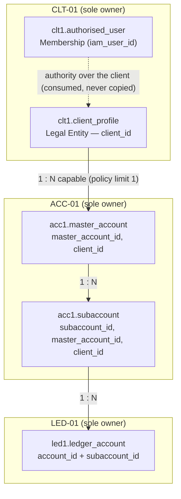
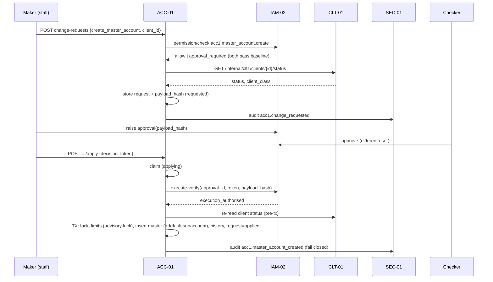
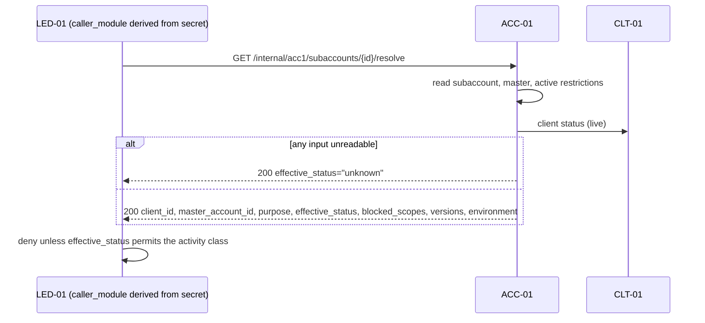
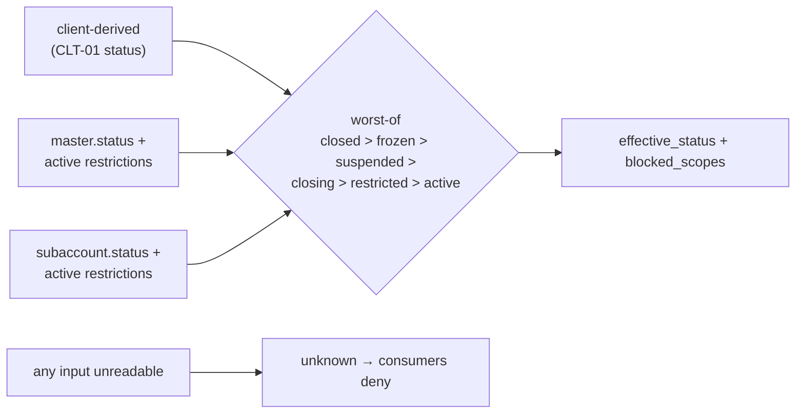
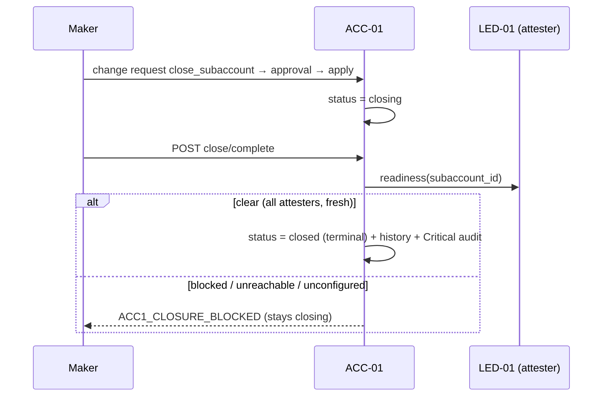

# ACC-01 Account Structure
## 03 Diagrams

## 1. Hierarchy and ownership of each layer

Composite FK `(master_account_id, client_id)` from `subaccount` to `master_account` makes a cross-client subaccount unrepresentable.

## 2. Create master account (change request → approval → apply)

## 3. Resolve on the hot path (e.g. LED-01 before creating or posting to a ledger account)

## 4. Effective status derivation

## 5. Closure

