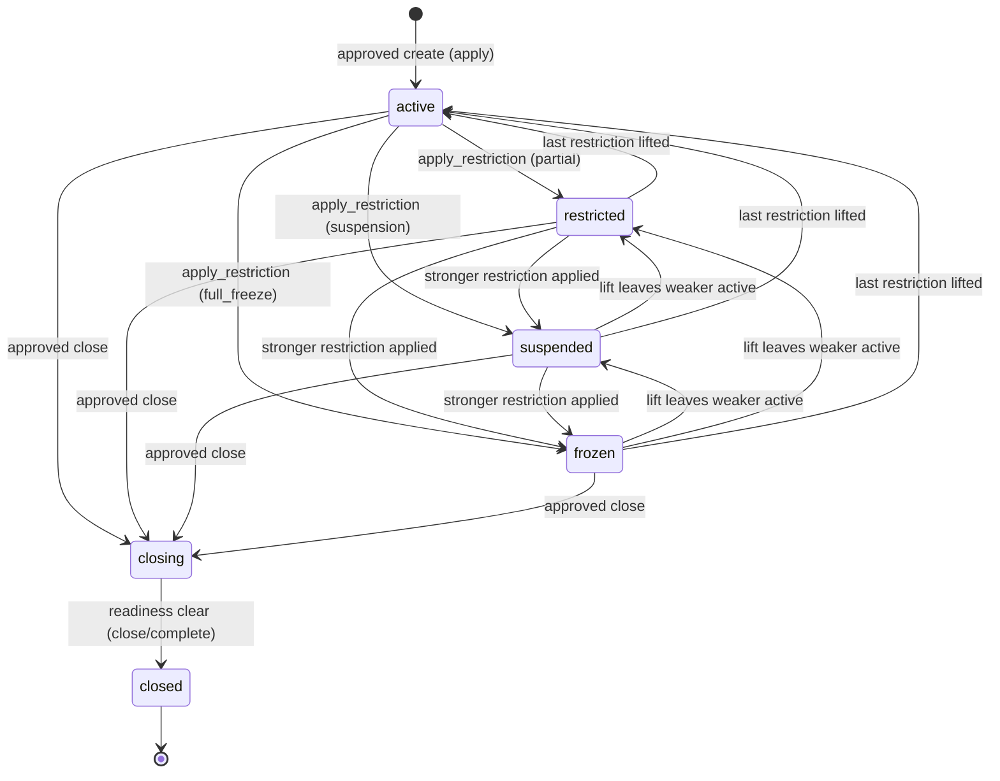
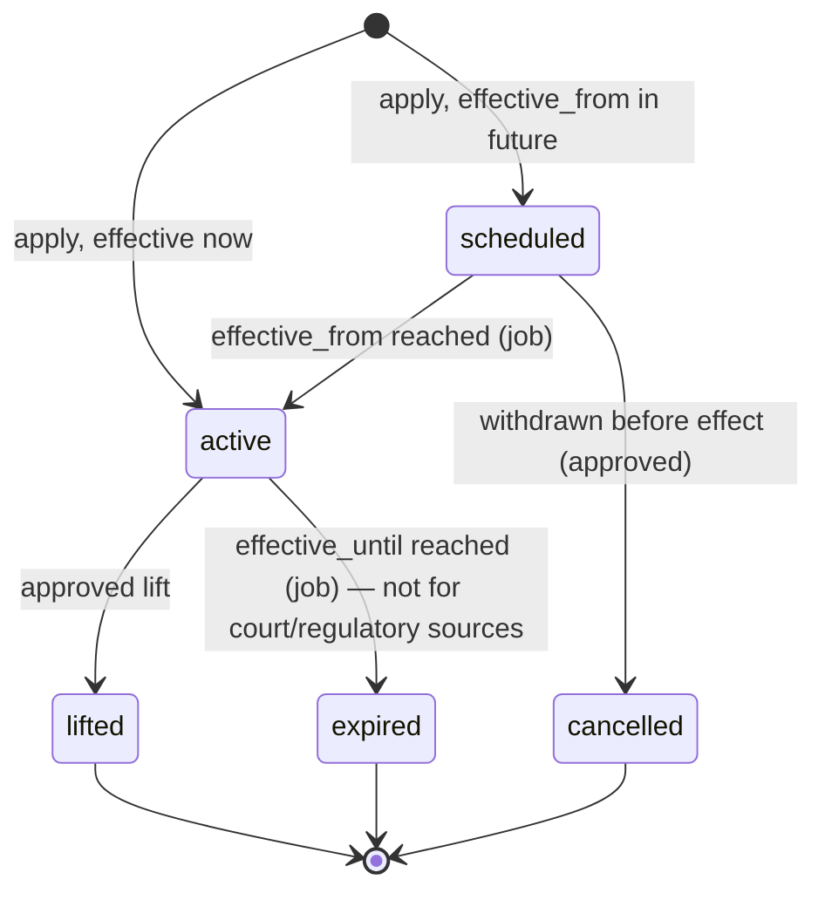
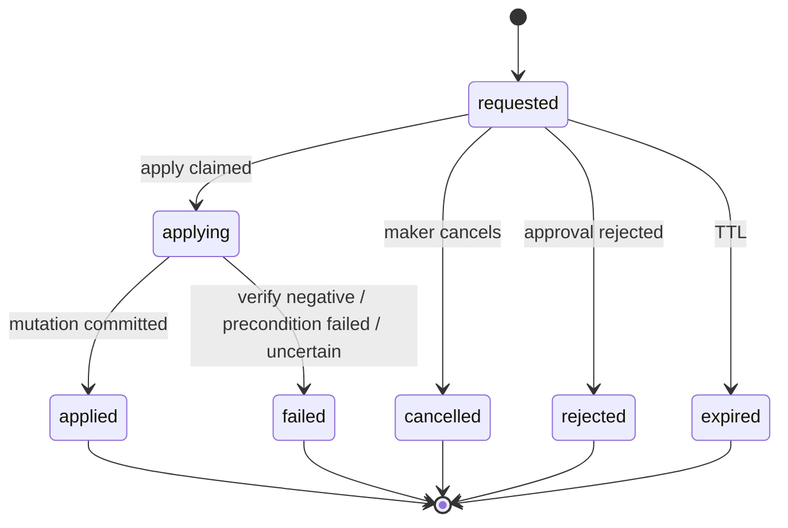

# ACC-01 Account Structure
## 06 State Machine

Statuses are lowercase snake_case, matching the repository convention (`clt1.client_profile.status`). Legal transitions are enforced in the database (file 05 §5) and again in the application; a direct status `UPDATE` that is not a legal transition fails.

## 1. Master account and subaccount status

Identical vocabulary: `active`, `restricted`, `suspended`, `frozen`, `closing`, `closed`.

Rules:

1. The stored status of `active`/`restricted`/`suspended`/`frozen` is a **projection** of the target's active restrictions (§3), recomputed inside the same transaction as any restriction change. It is never set independently. Precedence: `frozen > suspended > restricted > active`.
2. `closing` and `closed` are lifecycle states, not projections. While `closing`, restrictions may still be applied and lifted (recorded on `account_restriction`), but the stored status stays `closing`; the effective-status computation still honours them.
3. `closed` is terminal: no transition out, no identifier reuse, no restriction or profile mutation.
4. There is no `pending`, `rejected` or `cancelled` status on an account row — those outcomes belong to the change request (§4). No account row exists without an approved apply.
5. Only the transitions drawn are legal. Anything else ⇒ `ACC1_STATUS_TRANSITION_INVALID`.

### 1.1 Transition table

| From | To | Cause | Governed by | Audit severity |
|---|---|---|---|---|
| — | `active` | apply `create_*` | Maker-checker | High |
| `active`/`restricted`/`suspended` | `restricted`/`suspended`/`frozen` (stronger) | apply `apply_restriction` | Maker-checker (compliance) | Critical |
| `frozen`/`suspended`/`restricted` | weaker or `active` | apply `lift_restriction` | Maker-checker (compliance) | Critical |
| `active`/`restricted`/`suspended`/`frozen` | `closing` | apply `close_*` | Maker-checker | Critical |
| `closing` | `closed` | `close/complete` with fresh clear attestations | Permission + machine-verified readiness | Critical |

## 2. Effective status

`effective_status ∈ { active, restricted, suspended, frozen, closing, closed, unknown }`, computed for a **subaccount** as the worst of three inputs; for a master account, of two (client-derived, master).

Precedence: `closed > frozen > suspended > closing > restricted > active`. `unknown` overrides everything: if any input is unreadable, absent, or unrecognised, the result is `unknown`.

### 2.1 Client-derived input (CLT-01 `client_profile.status`)

| CLT-01 status | Client-derived status | Note |
|---|---|---|
| `active` | `active` | No effect |
| `active_limited` | `restricted` with transactional scopes blocked | "non-transactional" (CLT-01 §5.19). Account is inert, not denied existence |
| `restricted` | `restricted` with **all** transactional scopes blocked | CLT-01 defines no restriction scope; ACC-01 fails closed to the strictest partial (DCR-ACC-CLT-02) |
| `suspended` | `suspended` | |
| `closed` | `closed` | |
| `pending`, any other value, unreadable | `unknown` | Fail closed |

### 2.2 `blocked_scopes`

Scope vocabulary is FRZ-RULE-002's, restricted to those meaningful for an account:

| Scope | Meaning for consumers |
|---|---|
| `trade_block` | No new orders / quotes / execution (OMS-01, TRD-01, EXE-01) |
| `deposit_block` | No new inbound credit initiation or crediting (DEP-01) |
| `withdrawal_block` | No withdrawal / payout initiation or release (WDR-01, PAY-01) |
| `payout_destination_block` | No destination activation or use (WLT-01) |
| `report_only_access` | Only read/reporting access is permitted; every transactional scope is blocked |
| `full_account_freeze` | Everything blocked, including reads other than to authorised staff |

`login_block` is **not** an account scope; it is principal-level (IAM-01 / CLT-01) and is rejected by ACC-01 (`ACC1_SCOPE_NOT_APPLICABLE`).

Implied scopes by status (union with explicit restriction scopes):

| Status | Implied `blocked_scopes` |
|---|---|
| `active` | none |
| `restricted` | the explicit scopes of its active `partial_restriction` rows |
| `suspended` | `trade_block`, `deposit_block`, `withdrawal_block`, `payout_destination_block`, `report_only_access` |
| `frozen` | `full_account_freeze` (⇒ all of the above) |
| `closing` | `trade_block`, `deposit_block` |
| `closed` | `full_account_freeze` |
| client-derived `restricted` (incl. `active_limited`) | `trade_block`, `deposit_block`, `withdrawal_block`, `payout_destination_block` |
| `unknown` | *all* — consumers treat as deny |

Whether a *frozen* client may still read statements, and what `closing` permits to drain, is decided by the consuming modules and IAM-02, not by ACC-01 (OQ-06).

## 3. Restriction state (`acc1.account_restriction.status`)

This is a deliberately reduced form of WF-26's eleven workflow states: `requested`/`under_review`/`lift_requested`/`lift_under_review`/`rejected` live in the change request and IAM-02 approval, and `active_full_freeze`/`active_partial_restriction`/`active_suspension` are the `kind` × `active` combination. Nothing in WF-26 is dropped; it is split between the compliance workflow and this record of what was applied.

Restriction `kind`: `partial_restriction` (scopes ⊆ the four `*_block` scopes and/or `report_only_access`, non-empty), `suspension` (scopes default to the suspension set), `full_freeze` (scopes = `{full_account_freeze}` only).

`source_type` vocabulary follows FRZ-RULE-001: `sanctions_hit`, `aml_case`, `transaction_monitoring_alert`, `wallet_screening_result`, `court_order`, `regulatory_directive`, `fraud_account_takeover`, `safeguarding_shortfall`, `manual_compliance_decision`, `operational_incident` (WF-26 §30.2 adds this and `break_glass_review`, `pep_high_risk_escalation`; the vocabulary is a `CHECK` list extended by migration only).

## 4. Change request state (`acc1.account_change_request.status`)

`failed`, `rejected`, `cancelled`, `expired` are terminal; a fresh request (new approval) is required. There is no retry of a consumed approval.

## 5. Closure attestation state (`acc1.closure_attestation.attested_status`)

`clear` | `blocked` | `unavailable`. Only `clear`, newer than `ACC1_ATTESTATION_MAX_AGE`, from **every configured attester** for the target, permits `closing → closed`. An attester that is configured-but-unreachable records `unavailable` (blocks). An attester that is *not yet built* is represented by explicit configuration `ACC1_CLOSURE_ATTESTERS`; an empty set is **not** treated as "nothing to attest" — closure is disabled until the set is non-empty (fail closed).

## 6. Invariants asserted by tests (file 10)

1. `subaccount.client_id = master_account.client_id` for every row.
2. Stored status is never inconsistent with the projection of active restrictions (except `closing`/`closed`).
3. Every stored status has a matching last `account_status_history.to_status`.
4. No row leaves `closed`.
5. No account row lacks an approved, applied change request.
