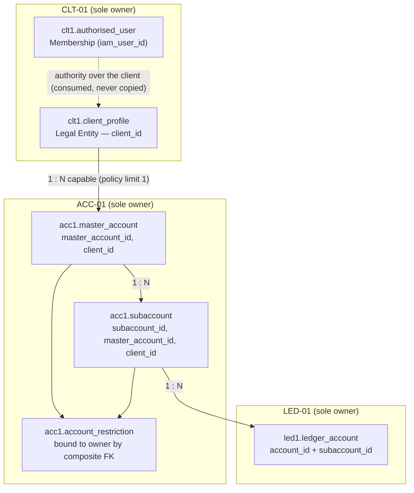
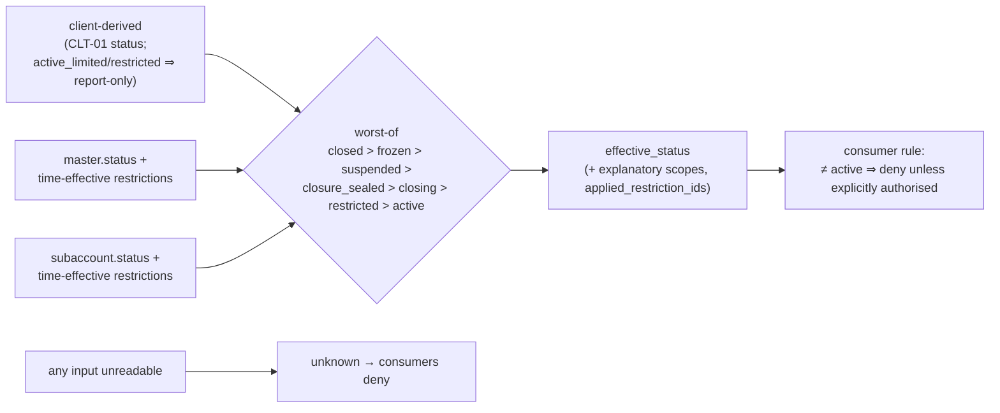

# ACC-01 Account Structure
## 03 Diagrams (v0.2)

## 1. Hierarchy and ownership of each layer



Composite FKs make a cross-client subaccount **and** a cross-client restriction unrepresentable. The default `general` subaccount is a member like any other; it is structural only and is never a fallback target.

## 2. Create master account (change request → approval → apply) — mirrors CLT-01 approve/apply

```mermaid
sequenceDiagram
  participant M as Maker (staff)
  participant A as ACC-01
  participant I as IAM-02
  participant C as CLT-01
  participant O as Operator (outside ACC-01)
  participant K as Checker
  participant S as SEC-01
  M->>A: POST change-requests {create_master_account, client_id}
  A->>I: permission/check (approval_required counts as baseline pass — NOT an entitlement)
  A->>C: client status via dedicated read-scoped credential
  A->>A: store canonical payload + payload_hash = fingerprint(payload)
  A-->>M: change_request_id, approval_payload, payload_hash
  O->>I: POST /iam2/approvals/request {maker_user_id, action, resource, entity_id, client_id, payload}
  Note over I: IAM-02 computes its own fingerprint (sha256:+64 hex)
  K->>I: POST /iam2/approvals/:id/approve  (no entitlement check today — IAM2-FIND-002)
  I-->>M: single-use decision token bound to the maker
  M->>A: POST .../apply {decision_token, approval_id}
  A->>A: recompute payload_hash from STORED payload; pre-checks incl. real-use gate
  A->>I: execute-verify {actor_id = stored requested_by, current_payload_hash, ...}
  I-->>A: execution_authorised (token consumed)
  A->>A: TX: lock, limits (advisory lock), insert master + default subaccount, history, request=applied
  A->>S: audit acc1.master_account_created (fail closed → rollback, request stays 'requested', FRESH approval needed)
```

## 3. Resolve on the hot path (e.g. LED-01 before creating or posting to a ledger account)

```mermaid
sequenceDiagram
  participant L as LED-01 (caller_module derived from secret)
  participant A as ACC-01
  participant C as CLT-01
  L->>A: GET /internal/acc1/subaccounts/{explicit subaccount_id}/resolve
  A->>A: read subaccount, master, restrictions (time-effective)
  A->>C: client status (dedicated read-scoped credential, live, no cache)
  alt any input unreadable
    A-->>L: 200 effective_status="unknown"
  else
    A-->>L: 200 statuses, effective_status, explanatory blocked_scopes, applied_restriction_ids, versions, environment
  end
  L->>L: CONSUMER RULE: effective_status != active ⇒ DENY transactional activity unless explicitly authorised by authoritative policy; unknown ⇒ deny; missing subaccount_id ⇒ deny (never default)
```

## 4. Effective status derivation



## 5. Preventive closure (approved sequence)

```mermaid
sequenceDiagram
  participant M as Maker
  participant A as ACC-01
  participant L as LED-01 (attester + poster)
  M->>A: change request close_* → approval → apply
  A->>A: target(s) = closing (master + listed children in one TX)
  Note over A,L: drain — only explicitly authorised activity; OFF-RULE-001 items 1–5 cleared
  M->>A: POST close/seal
  A->>A: status = closure_sealed, closure_seal_version++  (FINAL BARRIER; no unseal)
  L->>A: resolve ⇒ closure_sealed ⇒ LED-01 refuses EVERY posting
  A->>L: request attestation (AFTER the barrier)
  L-->>A: {seal_version_observed, journal_watermark, in_flight_predating_seal=0, status=clear, as_of}
  M->>A: POST close/complete
  alt seal_version matches, fresh, all attesters clear, no authority restriction, still closure_sealed
    A->>A: CAS closure_sealed → closed (terminal) + history + Critical audit
  else blocked / unreachable / unconfigured / stale / mismatched
    A-->>M: ACC1_CLOSURE_BLOCKED (remains closure_sealed — still barred)
  end
```

For a master: children first (each its own barrier + attestation) → master seals only when **all** children are `closed` → master's own post-barrier attestation → `closed`.

## 6. Runtime dependency graph

```mermaid
flowchart LR
  ACC[ACC-01] -->|status read (dedicated read credential)| CLT[CLT-01]
  CLT -->|open-accounts (client closure)| ACC
  ACC -->|permission/check, execute-verify (scoped credential)| IAM[IAM-02]
  IAM -->|scope-validate (read seam; never calls back)| ACC
  LED[LED-01] -->|resolve (every posting)| ACC
  ACC -->|closure barrier + post-barrier attestation| LED
  CFG[CFG-01] -->|resolve (condition 9)| ACC
  ACC -->|audit| SEC[SEC-01]
```

Readiness never traverses these edges (configuration/contract only).
