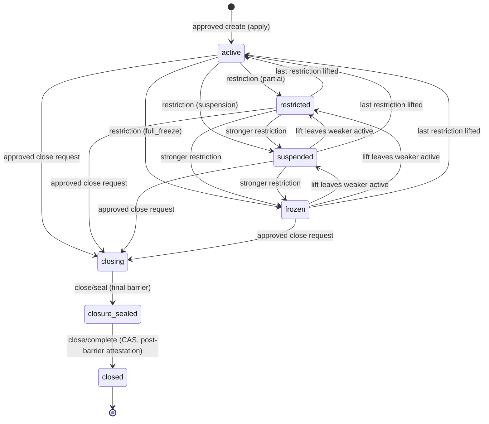
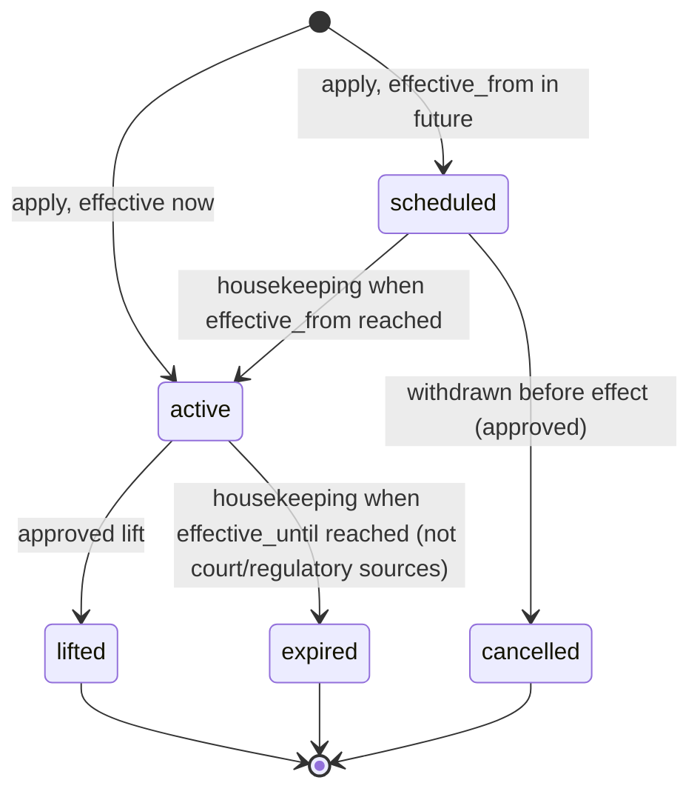
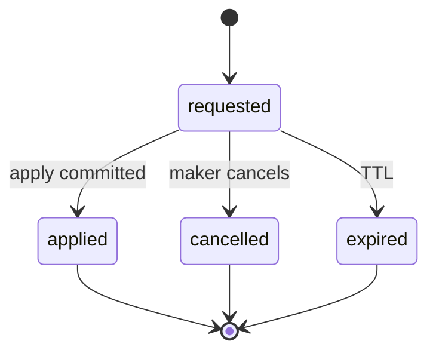

# ACC-01 Account Structure
## 06 State Machine (v0.2)

Statuses are lowercase snake_case, matching the repository convention. Legal transitions are enforced in the database (file 05 §5) and again in the application.

## 1. Master account and subaccount status

Identical vocabulary: `active`, `restricted`, `suspended`, `frozen`, `closing`, `closure_sealed`, `closed`.

Rules:

1. `active`/`restricted`/`suspended`/`frozen` are a **projection** of the target's active restrictions (§3), recomputed in the same transaction as any restriction change. Never set independently. Precedence `frozen > suspended > restricted > active`.
2. `closing`, `closure_sealed`, `closed` are lifecycle states, not projections. While `closing`/`closure_sealed`, restrictions may still be applied/lifted and recorded; stored status stays; effective status honours them.
3. **`closure_sealed` is the final barrier:** no transition out except `closed`. There is **no unseal** in this version. Entering it increments `closure_seal_version` (immutable once set on that row).
4. `closed` is terminal: no transition out, no identifier reuse, no restriction or profile mutation.
5. No `pending`, `rejected` or `cancelled` status on an account row — those outcomes live on the change request. No account row exists without an applied approved request.
6. A **master** may enter `closure_sealed` only when every child subaccount is `closed`; the **default** subaccount may enter `closing` only with its master. Master `closing` moves the master and the children listed in the approved request to `closing` in one transaction (a governed lifecycle cascade of listed rows — restrictions still never fan out).
7. Only the transitions drawn are legal ⇒ else `ACC1_STATUS_TRANSITION_INVALID`.

### 1.1 Transition table

| From | To | Cause | Governed by | Audit |
|---|---|---|---|---|
| — | `active` | apply `create_*` | Request + IAM-02 execute-verify (**real actors gated, G1/G2**) | High |
| `active`/`restricted`/`suspended` | `restricted`/`suspended`/`frozen` (stronger) | apply `apply_restriction` | Request + execute-verify (**G1/G4**) | Critical |
| `frozen`/`suspended`/`restricted` | weaker or `active` | apply `lift_restriction` | Request + execute-verify (**G1/G4**) | Critical |
| `active`/`restricted`/`suspended`/`frozen` | `closing` | apply `close_*` | Request + execute-verify (**G1/G5**) | Critical |
| `closing` | `closure_sealed` | `close/seal` (permission `acc1.*.close`, bound to the approved closure request) | Permission + request binding | Critical |
| `closure_sealed` | `closed` | `close/complete`: CAS + post-barrier attestation at the current `closure_seal_version` | Permission + machine-verified readiness | Critical |

## 2. Effective status and the consumer rule

`effective_status ∈ { active, restricted, suspended, frozen, closing, closure_sealed, closed, unknown }` — for a **subaccount** the worst of client-derived, master, subaccount (each including **time-effective** restrictions, §3); for a master, of client-derived and master.

Precedence: `closed > frozen > suspended > closure_sealed > closing > restricted > active`. `unknown` overrides everything: any input unreadable, absent or unrecognised ⇒ `unknown`.

### 2.0 The consumer rule (normative — RF-04)

> For any **transaction-producing activity**, `effective_status ≠ active` ⇒ **DENY**, unless that **specific activity** is explicitly authorised for that status by authoritative policy. `unknown` ⇒ DENY. A missing `subaccount_id` ⇒ DENY (never a default).

- **Transaction-producing activity** includes (non-exhaustively): trading/quote/order, deposit, withdrawal/payout, settlement, wallet/payout-destination activation, internal transfer, fee posting, subscription/allocation (RWA), payment acceptance/payout (Pay), Exchange/securities-market access, and any other activity that produces a transaction, journal or posting.
- **`blocked_scopes` is explanatory evidence only.** It states *why* and *what kind*; it is **not** an allow-list or a deny-list. An activity not named in `blocked_scopes` is **not** thereby permitted. No consumer may derive an allow from an empty or partial scope set.
- The authoritative policy that could authorise a specific activity under a non-`active` status (e.g. what a `closing` account may still drain; what a partially `restricted` account may still do) **does not exist yet** — DCR-ACC-GOV-04. Until it does, the effective answer is **deny**.
- Read/reporting access is decided by IAM-02 and the consuming module, not by ACC-01 (OQ-06).

### 2.1 Client-derived input (CLT-01 `client_profile.status`)

| CLT-01 status | Client-derived status | Semantics |
|---|---|---|
| `active` | `active` | No effect |
| `active_limited` | `restricted` | **Report-only**: every transaction-producing activity denies — trading, deposit, withdrawal, **settlement**, wallet/payout activation, **Exchange/securities-market access**, and any other (CLT-01 §5.19 lists trading, deposit, withdrawal, settlement, wallet/payout activation, Exchange access as **not permitted**) |
| `restricted` | `restricted` | **Report-only**, same semantics (CLT-01 defines no restriction scope — DCR-ACC-CLT-02; ACC-01 fails closed) |
| `suspended` | `suspended` | |
| `closed` | `closed` | |
| `pending`, any other value, unreadable | `unknown` | Fail closed |

### 2.2 `blocked_scopes` (explanatory) — FRZ-RULE-002 vocabulary, account-meaningful subset

`trade_block`, `deposit_block`, `withdrawal_block`, `payout_destination_block`, `report_only_access`, `full_account_freeze`. `login_block` is principal-level and is rejected by ACC-01 (`ACC1_SCOPE_NOT_APPLICABLE`).

Scopes reported per status (explanatory only): `active` none; `restricted` the explicit scopes of its active partial restrictions, or `report_only_access` when client-derived; `suspended` `report_only_access` plus the four `*_block`; `frozen` `full_account_freeze`; `closing` `trade_block`, `deposit_block`; `closure_sealed` and `closed` `full_account_freeze`; `unknown` all.

## 3. Restriction state (`acc1.account_restriction.status`) and time-effectiveness

**Time-effective rule (RF-08):** for resolution a restriction counts as **in force** when `effective_from_utc <= now()` **and** it is not `lifted`/`cancelled` **and** (`effective_until_utc IS NULL` **or** `now() < effective_until_utc`) — irrespective of whether its stored state has been advanced by the housekeeping job. The job is **housekeeping, not enforcement**: it aligns stored state, status projection, history, audit and `version`; a late job opens no gap.

**Version evidence (RF-08) — one design, used consistently:** **every restriction change bumps the `version` of the row it targets** — apply, housekeeping activation, lift, expiry, cancellation. Resolve returns `versions = {subaccount, master_account}` (both, so a master restriction changes the consumer-visible tuple) **and** `applied_restriction_ids` — the restrictions counted as in force at evaluation, which completes the evidence in the housekeeping-lag window when time alone has changed the effective state. No separate restriction-set version is introduced.

Restriction `kind`: `partial_restriction` (scopes ⊆ the four `*_block` scopes and/or `report_only_access`, non-empty), `suspension` (default suspension set), `full_freeze` (scopes = `{full_account_freeze}` only). `source_type` follows FRZ-RULE-001 (`sanctions_hit`, `aml_case`, `transaction_monitoring_alert`, `wallet_screening_result`, `court_order`, `regulatory_directive`, `fraud_account_takeover`, `safeguarding_shortfall`, `manual_compliance_decision`, `operational_incident`), extended only by migration.

This is a deliberately reduced form of WF-26's eleven workflow states; nothing is dropped — the workflow states before application live in the compliance workflow and IAM-02 approval, the `active_*` states are `kind` × `active`.

**Not decided here:** who owns whole-client freeze and `login_block`, and how a CLT-01 client freeze relates to an ACC-01 restriction (DCR-ACC-GOV-05). An ACC-01 restriction **never substitutes** for a client-level freeze.

## 4. Change request state (`acc1.account_change_request.status`) — mirrors the CLT-01/CFG-01 request/apply row

There is **no `applying`, `failed` or `rejected` state** (v0.1's `applying`/`verification_ref` mechanism is withdrawn). Any failure after IAM-02 execute-verify rolls the apply transaction back and leaves the row `requested`; the consumed approval is not reusable and a **fresh** approval is required. A rejected/expired IAM-02 approval is invisible to ACC-01; the request expires. A precondition failure before verification changes nothing.

## 5. Closure attestation (`acc1.closure_attestation`)

Per (target, attester, `seal_version`): `attested_status` ∈ `clear` | `blocked` | `unavailable`, plus `seal_version_observed`, `journal_watermark`, `in_flight_predating_seal`, `as_of_utc`. `closed` requires **every configured attester** `clear` with `seal_version_observed = current closure_seal_version`, `in_flight_predating_seal = 0`, and `as_of_utc` within `ACC1_ATTESTATION_MAX_AGE_SECONDS` (required configuration; missing/invalid ⇒ fail closed). An attestation taken **before** the seal (older `seal_version` or none) is never accepted. An empty attester set disables closure — it is **not** "nothing to attest" (`ACC1_CLOSURE_ATTESTERS_UNCONFIGURED`).

## 6. Invariants asserted by tests (file 10)

1. `subaccount.client_id = master_account.client_id`; `restriction.client_id` equals its target's `client_id`.
2. Stored status is never inconsistent with the projection of restrictions (except lifecycle states).
3. Every stored status has a matching last `account_status_history.to_status`.
4. No row leaves `closed`; no row leaves `closure_sealed` except to `closed`.
5. No account row lacks an applied, approved creation request.
6. A `closed` row has a `clear` attestation at its `closure_seal_version`.
7. A sealed master has no non-`closed` child.
