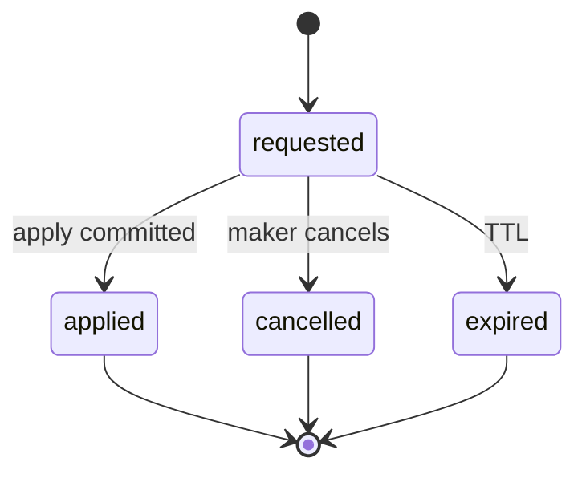

# ACC-01 Account Structure
## 06 State Machine (v0.3)

Statuses are lowercase snake_case, matching the repository convention. Legal transitions are enforced in the database (file 05 §5) and again in the application.

## 1. Master account and subaccount status

Identical vocabulary: `active`, `restricted`, `suspended`, `frozen`, `closing`, `closure_sealed`, `closed`. **PRE-SEAL READY is evidence (`closure_readiness`), not a status** — the vocabulary stays at seven.

```mermaid
stateDiagram-v2
  [*] --> active : approved create (apply)
  active --> restricted : restriction (partial)
  active --> suspended : restriction (suspension)
  active --> frozen : restriction (full_freeze)
  restricted --> suspended : stronger restriction
  restricted --> frozen : stronger restriction
  suspended --> frozen : stronger restriction
  frozen --> suspended : lift leaves weaker active
  frozen --> restricted : lift leaves weaker active
  suspended --> restricted : lift leaves weaker active
  restricted --> active : last restriction lifted
  suspended --> active : last restriction lifted
  frozen --> active : last restriction lifted
  active --> closing : approved close request
  restricted --> closing : approved close request
  suspended --> closing : approved close request
  frozen --> closing : approved close request
  closing --> closure_sealed : seal_closure (FINAL checker approval + pre-seal readiness; sets closure_barrier)
  closure_sealed --> closed : close/complete (machine-verified CAS, latest post-barrier attestation)
  closing --> active : abort_closure (governed recovery, lands on recomputed projection)
  closure_sealed --> active : abort_closure (governed recovery; only path that clears closure_barrier)
  closed --> [*]
```

`abort_closure` lands on the **recomputed operational projection** (`active`, `restricted`, `suspended` or `frozen`, from the restrictions in force by time) — drawn once as `active` for legibility. It is **never** a return to a remembered "prior" value.

Rules:

1. `active`/`restricted`/`suspended`/`frozen` are a **projection** of the target's active restrictions (§3), recomputed in the same transaction as any restriction change. Never set independently. Precedence `frozen > suspended > restricted > active`.
2. `closing`, `closure_sealed`, `closed` are lifecycle states, not projections. While `closing`/`closure_sealed`, restrictions may still be applied/lifted and recorded; stored status stays; resolution honours them.
3. **`closure_barrier` is an independent stored fact (ACC-REQ-042).** It is `true` exactly while status ∈ {`closure_sealed`, `closed`}. It is set only by `closing → closure_sealed` and cleared **only** by the governed recovery transaction (`abort_closure` from `closure_sealed`). Entering `closure_sealed` increments `closure_seal_version` and records `closure_sealed_at_version` (the target `version` the seal wrote). `closure_seal_version` is monotonic and **never reset**, so evidence for an aborted seal can never match a later seal.
4. **`closure_sealed` exits only to `closed` (completion) or, through the governed abort, to the operational projection.** There is no ungoverned reopen. `closing` exits only to `closure_sealed` or, through the governed abort, to the operational projection.
5. `closed` is terminal: no transition out, no identifier reuse, no restriction or profile mutation, no abort.
6. No `pending`, `rejected` or `cancelled` status on an account row — those outcomes live on the change request. No account row exists without an applied approved request.
7. **Master/child rules (ACC-R2-HD-04).** Master `closing` moves the master, **its default subaccount** and every other listed non-closed child to `closing` in **one transaction** (a governed lifecycle cascade of listed rows — restrictions still never fan out). Every child, the default included, then follows the ordinary child path `closing → closure_sealed → closed`. A **master may enter `closure_sealed` only when every child subaccount is `closed`.** The default subaccount may enter `closing` **only in the same transaction as its master's `closing`**; it needs its master to be `closing` — never `closed` or sealed. Invariant: while a master is `closing`, no child is operational (`active`/`restricted`/`suspended`/`frozen`). A master in `closing` or later rejects new child creation.
8. **Abort scope.** A subaccount whose master is `closing`/`closure_sealed`, and the default subaccount, cannot be aborted alone; aborting the master returns the master and every listed non-closed child together. Children already `closed` stay `closed`.
9. Only the transitions drawn are legal ⇒ else `ACC1_STATUS_TRANSITION_INVALID`.

### 1.1 Transition table

| From | To | Cause | Governed by | Audit |
|---|---|---|---|---|
| — | `active` | apply `create_*` | Request + IAM-02 verify (**`DEP-IAM-ACTOR-BINDING`, `DEP-IAM-ENTITLEMENT`, `DEP-LED-CLOSURE-CONTRACT`**) | High |
| `active`/`restricted`/`suspended` | `restricted`/`suspended`/`frozen` (stronger) | apply `apply_restriction` | Request + verify (**+ `DEP-FREEZE-GOVERNANCE`**) | Critical |
| `frozen`/`suspended`/`restricted` | weaker or `active` | apply `lift_restriction` | Request + verify (**+ `DEP-FREEZE-GOVERNANCE`**) | Critical |
| `active`/`restricted`/`suspended`/`frozen` | `closing` | apply `close_*` (initiation; master ⇒ master + default + listed children) | Request + verify (**+ `DEP-LED-CLOSURE-CONTRACT`**) | Critical |
| `closing` | `closure_sealed` | apply `seal_closure`: **final checker approval** + fresh affirmative pre-seal readiness bound into the approved payload; master ⇒ all children `closed` | Request + verify (final human approval) | Critical |
| `closure_sealed` | `closed` | `close/complete`: CAS + latest post-barrier attestation of every attester at the current `closure_seal_version` | Non-approval entitlement-checked permission + **machine-verified** criteria (no second checker) | Critical |
| `closing`/`closure_sealed` | operational projection | apply `abort_closure`: evidence-conditioned governed recovery | Request + verify (maker-checker) | Critical |

## 2. Effective status and the consumer evaluation order

`effective_status ∈ { active, restricted, suspended, frozen, closing, closure_sealed, closed, unknown }` — for a **subaccount** the worst of client-derived, master, subaccount (each including **time-effective** restrictions, §3); for a master, of client-derived and master.

Precedence: `closed > frozen > suspended > closure_sealed > closing > restricted > active`. `unknown` overrides everything: any input unreadable, absent or unrecognised ⇒ `unknown`. **This label is descriptive.** Lifecycle and restriction are different dimensions, so the statuses are not totally ordered and **no protection depends on the ranking** (R2-F03).

### 2.0 The consumer evaluation order (normative — RF-04, ACC-R2-HD-05)

For any **transaction-producing activity**, in this order (file 01 §10 restates it; the two must not diverge):

1. **`closure_barrier`.** `closure_barrier = true` ⇒ **DENY every** transaction-producing activity, absolutely. It is evaluated **before** and **independently of** `effective_status`: it does not matter whether the descriptive status shows `frozen`, `suspended`, `restricted`, `closing` or anything else — **a more severe descriptive status must never mask the barrier.** No allow-list, policy or drain exception applies. `unknown`, an unavailable `resolve` or a missing `subaccount_id` ⇒ DENY (never default).
2. **Structural account status and restrictions — conjunctive over components.** Client-derived, master (stored lifecycle **and** `restriction_status`) and subaccount (same) must **each** permit the activity: permitted only when the component is `active`. **Narrowing exception:** where a component is `closing` (`closure_draining = true`), only the **closure-drain allow-list** (file 01 §7.1) may proceed, and only if every component not itself `closing` is still `active` — drain never overrides a restriction or a client status. Any other non-`active` state ⇒ DENY unless an authoritative policy authorises that specific activity (DCR-ACC-GOV-04 — none exists, so today: deny).
3. **Product/activity policy** (CFG-01, IAM-02, the consuming module) applies afterwards; ACC-01's answer is necessary, never sufficient.

- **Transaction-producing activity** includes (non-exhaustively): trading/quote/order, deposit, withdrawal/payout, settlement, wallet/payout-destination activation, internal transfer, fee posting, subscription/allocation (RWA), payment acceptance/payout (Pay), Exchange/securities-market access, and any other activity that produces a transaction, journal or posting.
- **`blocked_scopes` is explanatory evidence only.** It is **not** an allow-list or a deny-list. An activity not named in it is **not** thereby permitted.
- Read/reporting access is decided by IAM-02 and the consuming module, not by ACC-01 (OQ-06).
- The **closure-drain subset** of status→activity policy is defined in this pack by the approved ACC-R2-HD-01 (file 01 §7.1); the **broader** status→activity policy for other non-`active` states remains DCR-ACC-GOV-04.
- `closure_sealed` and `closed` can never be authorised for any transaction-producing activity: `closure_barrier` is `true` for both.

### 2.1 Client-derived input (CLT-01 `client_profile.status`)

| CLT-01 status | Client-derived status | Semantics |
|---|---|---|
| `active` | `active` | No effect |
| `active_limited` | `restricted` | **Report-only**: every transaction-producing activity denies — trading, deposit, withdrawal, **settlement**, wallet/payout activation, **Exchange/securities-market access**, and any other (CLT-01 §5.19 lists trading, deposit, withdrawal, settlement, wallet/payout activation, Exchange access as **not permitted**). Closure-drain activity is denied too (fail closed) |
| `restricted` | `restricted` | **Report-only**, same semantics (CLT-01 defines no restriction scope — DCR-ACC-CLT-02; ACC-01 fails closed) |
| `suspended` | `suspended` | |
| `closed` | `closed` | |
| `pending`, any other value, unreadable | `unknown` | Fail closed |

### 2.2 `blocked_scopes` (explanatory) — FRZ-RULE-002 vocabulary, account-meaningful subset

`trade_block`, `deposit_block`, `withdrawal_block`, `payout_destination_block`, `report_only_access`, `full_account_freeze`. `login_block` is principal-level and is rejected by ACC-01 (`ACC1_SCOPE_NOT_APPLICABLE`).

Scopes reported per status (explanatory only): `active` none; `restricted` the explicit scopes of its active partial restrictions, or `report_only_access` when client-derived; `suspended` `report_only_access` plus the four `*_block`; `frozen` `full_account_freeze`; `closing` `trade_block`, `deposit_block` (**and nothing here permits any activity — only the closure-drain allow-list does**); `closure_sealed` and `closed` `full_account_freeze`; `unknown` all.

### 2.3 Independent closure facts returned by resolve (R2)

| Field | Meaning |
|---|---|
| `closure_barrier` | `true` if the subaccount **or** its master has the barrier (independent of every other field) |
| `closure_draining` | `true` if the subaccount or its master is `closing` |
| `restriction_status` `{master_account, subaccount}` | Projection of the **time-effective** restrictions per level (`active` when none) — separate from lifecycle, so a restriction can never hide a lifecycle state or vice versa |
| `closure` evidence | `closure_seal_version` and `closure_sealed_at_version` per level; `closure_cycle` per level |

## 3. Restriction state (`acc1.account_restriction.status`) and time-effectiveness

```mermaid
stateDiagram-v2
  [*] --> scheduled : apply, effective_from in future
  [*] --> active : apply, effective now
  scheduled --> active : housekeeping when effective_from reached
  scheduled --> active : inline activation inside a governed lift (time-effective)
  scheduled --> cancelled : cancel_scheduled_restriction (governed; NOT yet effective by time)
  active --> lifted : approved lift (in force by time)
  active --> expired : housekeeping when effective_until reached (not court/regulatory sources)
  lifted --> [*]
  expired --> [*]
  cancelled --> [*]
```

**Time-effective rule (RF-08):** for resolution a restriction counts as **in force** when `effective_from_utc <= now()` **and** it is not `lifted`/`cancelled` **and** (`effective_until_utc IS NULL` **or** `now() < effective_until_utc`) — irrespective of whether its stored state has been advanced by the housekeeping job. The job is **housekeeping, not enforcement**: it aligns stored state, status projection, history, audit and `version`; a late job opens no gap.

**Lifecycle operations are also decided by effective time (R2-F07, ACC-REQ-049):** `lift_restriction` is legal for a restriction **in force by time**, including one still stored `scheduled` (the lift performs the activation inline in its transaction); `cancel_scheduled_restriction` is legal only for a restriction **not yet effective by time**. The housekeeping job **never** determines whether a restriction can be lifted or cancelled. Both are maker-checker governed. Every restriction change, including cancellation, bumps the target `version`.

**Version evidence (RF-08) — one design, used consistently:** every restriction change bumps the `version` of the row it targets — apply, housekeeping activation, inline activation, lift, expiry, cancellation. Resolve returns `versions = {subaccount, master_account}` **and** `applied_restriction_ids` — the restrictions counted as in force at evaluation, which completes the evidence in the housekeeping-lag window. No separate restriction-set version is introduced.

Restriction `kind`: `partial_restriction` (scopes ⊆ the four `*_block` scopes and/or `report_only_access`, non-empty), `suspension` (default suspension set), `full_freeze` (scopes = `{full_account_freeze}` only). `source_type` follows FRZ-RULE-001 (`sanctions_hit`, `aml_case`, `transaction_monitoring_alert`, `wallet_screening_result`, `court_order`, `regulatory_directive`, `fraud_account_takeover`, `safeguarding_shortfall`, `manual_compliance_decision`, `operational_incident`), extended only by migration.

This is a deliberately reduced form of WF-26's eleven workflow states; nothing is dropped — the workflow states before application live in the compliance workflow and IAM-02 approval, the `active_*` states are `kind` × `active`.

**Not decided here:** who owns whole-client freeze and `login_block`, and how a CLT-01 client freeze relates to an ACC-01 restriction (DCR-ACC-GOV-05). An ACC-01 restriction **never substitutes** for a client-level freeze.

## 4. Change request state (`acc1.account_change_request.status`) — mirrors the CLT-01/CFG-01 request/apply row

There is **no `applying`, `failed` or `rejected` state**. Any failure after IAM-02 execute-verify rolls the apply transaction back and leaves the row `requested`; the consumed approval is not reusable and a **fresh** approval is required. A rejected/expired IAM-02 approval is invisible to ACC-01; the request expires. A precondition failure before verification changes nothing.

## 5. Closure evidence (`acc1.closure_readiness`, `acc1.closure_attestation`, `acc1.closure_recovery`)

- **Pre-seal readiness** — per (target, attester, `closure_cycle`), append-only with a sequence: `readiness_status` ∈ `ready` | `not_ready` | `unavailable`; `balance_state` ∈ `none` | `returned` | `present` (no amounts); `open_withdrawal_count`, `open_settlement_count`, `blocking_recon_break_count`, `in_flight_unaccounted_count`; `journal_watermark` (W_pre); `max_resolution_version_observed`; `as_of_utc`. **Only the latest row counts**; a seal is legal only when the latest row of every configured attester is `ready`, all counts are 0, `balance_state ≠ present`, and it is fresh (`ACC1_ATTESTATION_MAX_AGE_SECONDS`, secondary guard).
- **Post-barrier attestation** — per (target, attester, `closure_seal_version`), append-only with a sequence: `attested_status` ∈ `clear` | `blocked` | `unavailable`; `seal_version_observed`; `journal_watermark`; `preseal_watermark_ref`; `committed_after_preseal_watermark`; `max_resolution_version_committed`; `in_flight_count`, `in_flight_status`; `as_of_utc`. **Only the latest row per target + attester + current `closure_seal_version` may satisfy completion.** `closed` requires every configured attester's latest row `clear` with `seal_version_observed = current`, `committed_after_preseal_watermark = 0`, `max_resolution_version_committed < closure_sealed_at_version`, `in_flight_status ∈ {none, refused_by_fence}`, `preseal_watermark_ref` = the recorded readiness watermark, fresh. An attestation taken **before** the seal (older `seal_version` or none) is never accepted. An empty attester set disables closure (`ACC1_CLOSURE_ATTESTERS_UNCONFIGURED`).
- **Recovery** — one append-only `closure_recovery` row per governed abort: target, `from_status`, `closure_cycle_before/after`, `closure_seal_version_at_abort`, `reason_code`, `change_request_id`, attested approval fields.

## 6. Invariants asserted by tests (file 10)

1. `subaccount.client_id = master_account.client_id`; `restriction.client_id` equals its target's `client_id`.
2. Stored status is never inconsistent with the projection of restrictions (except lifecycle states).
3. Every stored status has a matching last `account_status_history.to_status`.
4. No row leaves `closed`; no row leaves `closure_sealed` except to `closed` or through the governed abort.
5. No account row lacks an applied, approved creation request.
6. A `closed` row has a latest `clear` attestation per attester at its `closure_seal_version` satisfying §5.
7. A sealed master has no non-`closed` child; a `closing` master has no operational child.
8. `closure_barrier = (status ∈ {closure_sealed, closed})` at all times; it is cleared only by a governed recovery row.
9. `closure_seal_version` never decreases; an aborted seal's attestations never match a later seal.
