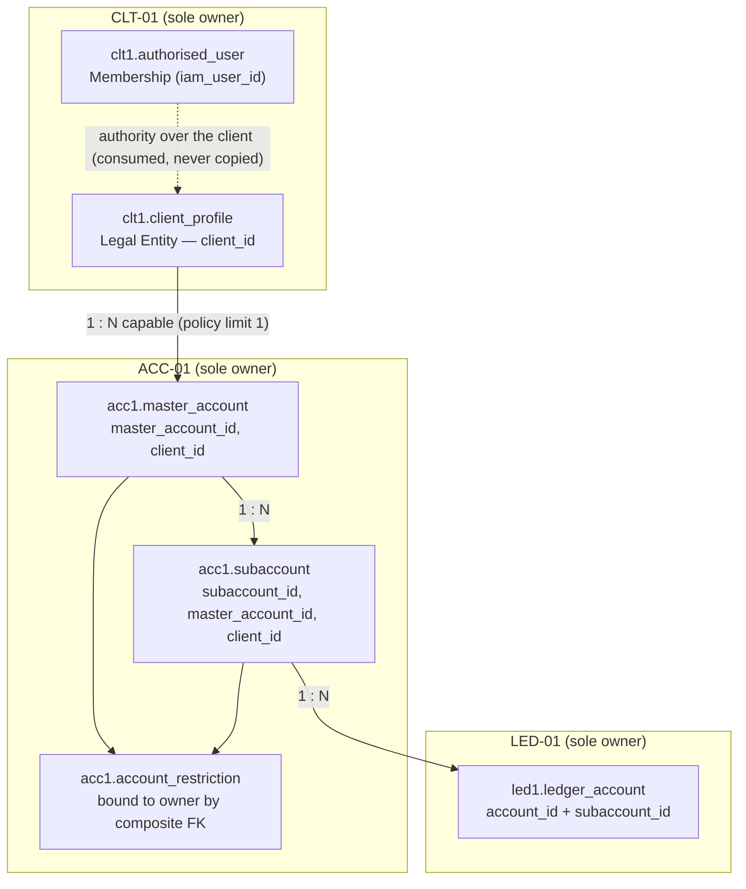
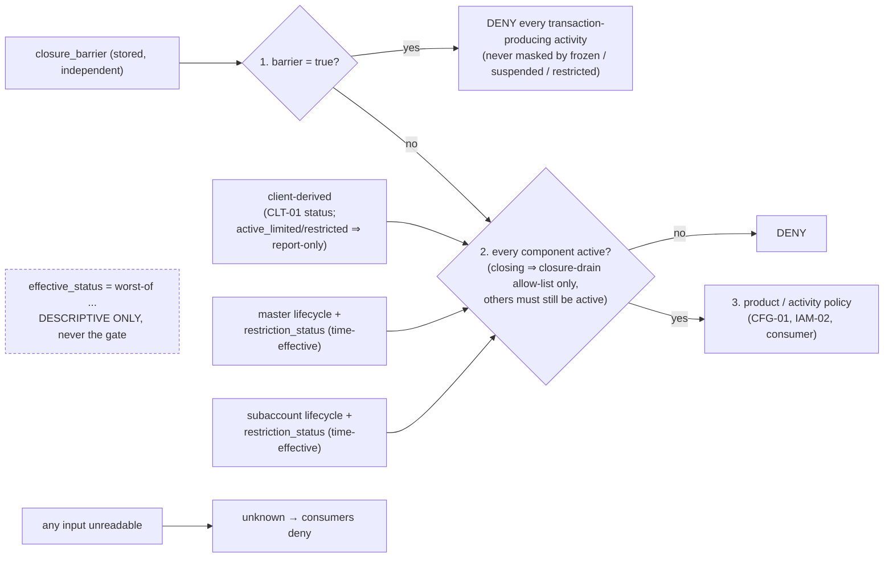

# ACC-01 Account Structure
## 03 Diagrams (v0.4)

## 1. Hierarchy and ownership of each layer



Composite FKs make a cross-client subaccount **and** a cross-client restriction unrepresentable. The default `general` subaccount is a member like any other; it is structural only and is never a fallback target.

## 2. Create master account (change request → approval → apply) — mirrors CLT-01 approve/apply

```mermaid
sequenceDiagram
  participant M as Maker (staff)
  participant A as ACC-01
  participant I as IAM-02
  participant C as CLT-01
  participant O as Operator (outside ACC-01)
  participant K as Checker
  participant S as SEC-01
  M->>A: POST change-requests {create_master_account, client_id}
  A->>I: permission/check (approval_required counts as baseline pass — NOT an entitlement)
  A->>C: client status via dedicated read-scoped credential (every environment)
  A->>A: store canonical payload + payload_hash = fingerprint(payload)
  A-->>M: change_request_id, approval_payload, payload_hash
  O->>I: POST /iam2/approvals/request {maker_user_id, action, resource, entity_id, client_id, payload}
  Note over I: IAM-02 computes its own fingerprint (sha256:+64 hex)
  K->>I: POST /iam2/approvals/:id/approve  (no entitlement check today — IAM2-FIND-002)
  I-->>K: single-use decision token (current seam returns it to the APPROVE caller, not the maker)
  M->>A: POST .../apply {decision_token, approval_id}  (IAM-01 session principal must equal requested_by — local defence in depth)
  A->>A: recompute payload_hash from STORED payload; pre-checks incl. DEP-* dependency prerequisites (no environment logic)
  A->>I: actor-binding seam — TARGET contract DCR-ACC-IAM-06 (DEP-IAM-ACTOR-BINDING): the caller's IAM-01 session reference AS RECEIVED (never minted by ACC-01) + current_payload_hash
  I->>I: IAM-02 verifies the actor itself against IAM-01 (authority outside ACC-01)
  I-->>A: attested {actor_assertion_authority, approval_id, authenticated_actor_id, maker, checker, policy_id, entitlement evidence, payload_hash, action, resource, scope, credential_scope}; token consumed
  Note over A,I: today's execute-verify takes a body actor_id and never verifies approval_id — ACC-01 does NOT fake the proof; real governed apply stays gated
  A->>A: TX: lock, limits (advisory lock), insert master + default subaccount, history, request=applied
  A->>S: audit acc1.master_account_created (fail closed → rollback, request stays 'requested', FRESH approval needed)
```

## 3. Resolve on the hot path (e.g. LED-01 before creating or posting to a ledger account)

```mermaid
sequenceDiagram
  participant L as LED-01 (caller_module derived from secret)
  participant A as ACC-01
  participant C as CLT-01
  L->>A: GET /internal/acc1/subaccounts/{explicit subaccount_id}/resolve
  A->>A: read subaccount, master, restrictions (time-effective)
  A->>C: client status (dedicated read-scoped credential, live, no cache)
  alt any input unreadable
    A-->>L: 200 effective_status="unknown"
  else
    A-->>L: 200 closure_barrier, closure_draining, restriction_status, statuses, effective_status (descriptive), closure/seal versions, explanatory blocked_scopes, applied_restriction_ids, versions, environment
  end
  L->>L: EVALUATION ORDER: (1) closure_barrier=true ⇒ DENY everything; (2) components conjunctive, closing ⇒ closure-drain allow-list only; (3) product policy. unknown ⇒ deny; missing subaccount_id ⇒ deny (never default)
```

## 4. Effective status derivation and the independent closure facts



## 5. Preventive closure of one target (ACC-R2-HD-01…05; R3: maker-only initiation, pinned readiness)

```mermaid
sequenceDiagram
  participant M as Maker (entitled)
  participant K as Checker
  participant A as ACC-01
  participant L as LED-01 (attester + poster)
  M->>A: close/initiate (maker-only, entitlement-checked, Critical audit — NO checker)
  A->>A: target = closing; closure_cycle++
  Note over A,L: DRAIN — only the closure-drain allow-list (CDA-1 bound to closure_initiation_id, already-open withdrawal/settlement, closure-needed recon breaks)
  M->>A: POST close/readiness
  A->>L: pre-seal readiness (drained? balance none/returned, no open items, no unaccounted in-flight, W_pre commit-ordered)
  L-->>A: ready + journal_watermark W_pre + max resolution version
  A->>A: INSERT readiness row (DB: target must be closing at this cycle; stamps target_version_observed)
  M->>A: change request seal_closure — payload PINS readiness_id, seq, W_pre, payload hash, cycle, target version
  K->>A: FINAL HUMAN APPROVAL (the ONE approval; immediately before sealing) → apply
  A->>L: apply-time verification (NOT a readiness row): ready, SAME W_pre
  A->>A: ONE TX: version = approved? pinned row still latest+ready? → closing → closure_sealed, closure_barrier=true, closure_seal_version++, WRITE SEAL PIN
  Note over A: from now no readiness row can be inserted for this target
  L->>A: resolve ⇒ closure_barrier=true ⇒ LED-01 refuses EVERY new posting
  M->>A: POST close/attestation (AFTER the barrier) — sends the PINNED W_pre
  A->>L: attest {seal_version, closure_sealed_at_version, preseal_watermark_ref = pin watermark}
  L-->>A: {…, committed_after_preseal_watermark=0, max_resolution_version_committed < sealed_at_version, in_flight none/refused_by_fence, balance none/returned, open_item_count=0, clear, as_of}
  A->>A: DB binds row to pin → binding_ok
  M->>A: POST close/complete (independent target; machine-verified, NO second checker)
  alt LATEST attestation per attester is clear AND binding_ok (watermark == PIN watermark)
    A->>A: CAS closure_sealed → closed (terminal) + history + Critical audit
  else blocked / unreachable / stale / mismatched
    A-->>M: ACC1_CLOSURE_BLOCKED (stays closure_sealed — barred; re-collect or governed abort)
  end
  opt closure cannot safely complete
    M->>A: change request abort_closure (evidence-conditioned; NO LED-01 dependency)
    K->>A: approval → apply
    A->>A: ONE TX: invalidate evidence, version++, closure_cycle++, clear barrier + pin id, recompute projection, Critical audit
  end
```

## 5a. Master-family closure (ACC-R3-HD-01 — amends ACC-R2-HD-04)

```mermaid
sequenceDiagram
  participant M as Maker (entitled)
  participant A as ACC-01
  participant K as Checker
  M->>A: master close/preview → family_set_hash
  M->>A: master close/initiate (family_set_hash)
  A->>A: ONE TX: master + DEFAULT + every operational child = closing (closure_family_id); independent closures recorded independent_preserved, untouched
  loop each master-directed child (default included)
    M->>A: readiness → own seal_closure request
    K->>A: OWN final approval → child closure_sealed (barrier, pin) → attestation
    Note over A: child STOPS here — no individual completion; not closed
  end
  Note over A: every independent child must be CLOSED (its own lifecycle) or the master seal is refused
  M->>A: master readiness → seal_closure (payload binds family_set_hash of the sealed children)
  K->>A: master final approval → master closure_sealed (pin) → master attestation
  M->>A: master close/complete
  A->>A: ONE ATOMIC TX: lock master then members by id; re-verify master + EVERY child attestation vs its own pin, barriers, set hash, eligibility → close every master-directed child + default + master
  opt before completion
    K->>A: master abort (evidence of master / default / any master-directed child)
    A->>A: ONE TX reverses master + default + master-directed children; independent closures UNTOUCHED
  end
```

Invariant at every arrow: **every non-`closed` master has exactly one non-`closed` default** (`trg_acc1_master_default_invariant`). A master with **only its default child** follows the same path (T-199).

## 6. Runtime dependency graph

```mermaid
flowchart LR
  ACC[ACC-01] -->|status read (dedicated read credential)| CLT[CLT-01]
  CLT -->|open-accounts (client closure)| ACC
  ACC -->|permission/check + actor-binding seam (scoped credential; IAM-02 verifies the actor vs IAM-01)| IAM[IAM-02]
  IAM -->|scope-validate (read seam; never calls back)| ACC
  LED[LED-01] -->|resolve (every posting; barrier first)| ACC
  ACC -->|contract descriptor + pre-seal readiness + post-barrier attestation (NOT used by abort)| LED
  CFG[CFG-01] -->|resolve (condition 9)| ACC
  ACC -->|audit| SEC[SEC-01]
```

Service readiness never traverses these edges (ACC-01's own configuration only); dependency evidence is verified per operation on these edges, never at readiness. There is **no ACC-01 → CFG-01 edge**: ACC-01 does not read CFG-01 environment scope and implements no environment availability (ACC-R2-HD-06); any future CFG-01 decision about ACC-01 operations is consumed, not duplicated (DCR-ACC-CFG-02) and would also stay out of readiness.
