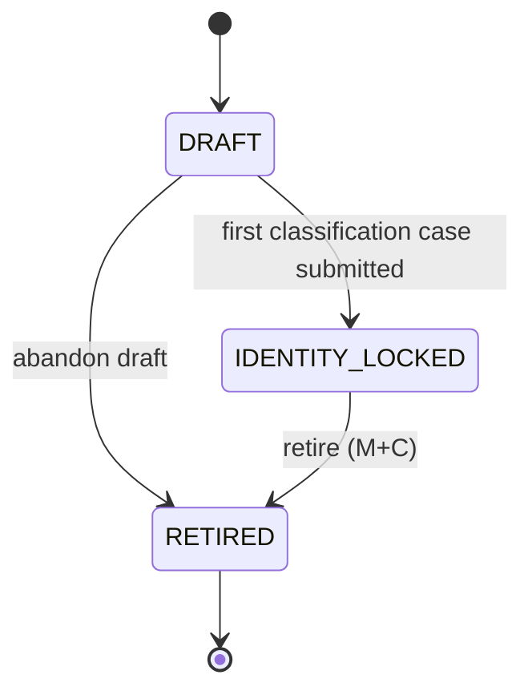
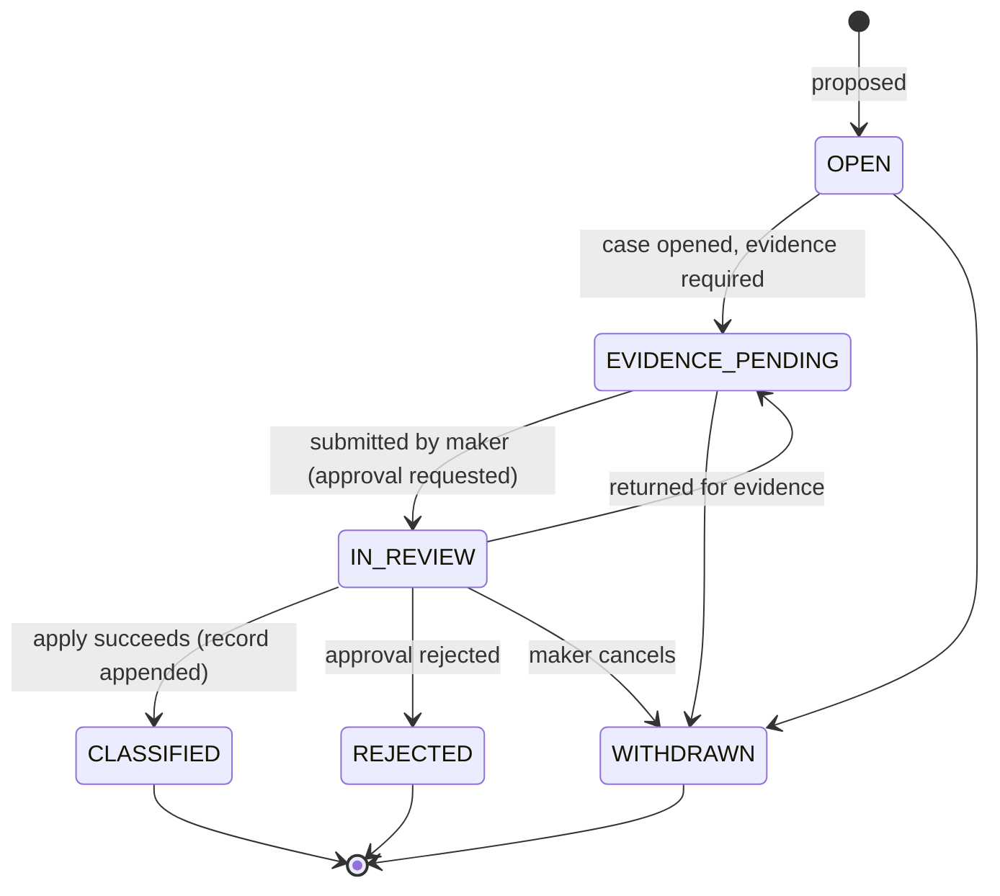
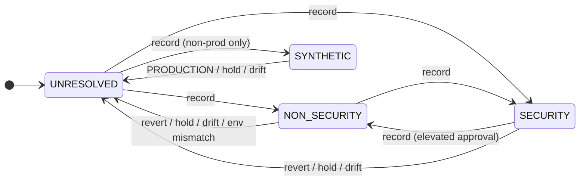
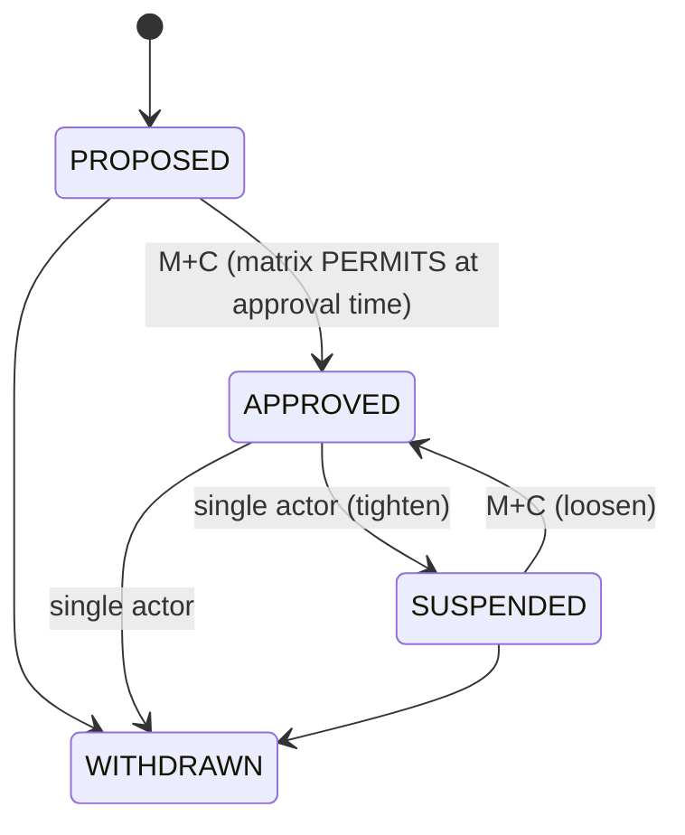

# AST-01 — 06 State Machine

**Status: PLANNED / AWAITING REVIEW.** Nine stored state machines, plus the derived mapping to `WF-35`. Illegal transitions are refused in the service **and** by DB CHECK/trigger where a CHECK can express them. Statuses use lower-case for governed-change rows (CFG-01 convention) and upper-case elsewhere.

## SM-1 Instrument registry status (`instrument.lifecycle_status`)

| Transition | Guard |
|---|---|
| `DRAFT → IDENTITY_LOCKED` | Profile complete (precision, network, characteristics, stablecoin backing); fingerprint computed and frozen |
| `IDENTITY_LOCKED → RETIRED` | Maker-checker. Retired ⇒ derives `INSTRUMENT_RETIRED`, all products deny; history retained |
| any → `DRAFT` | **Forbidden** (identity cannot be reopened) |

## SM-2 Classification case (`classification_case.state`) — maps `WF-35` §33F.3

| `WF-35` state | AST-01 representation |
|---|---|
| `proposed` | `instrument.DRAFT` + case `OPEN` |
| `evidence_pending` | case `EVIDENCE_PENDING` |
| `classification_in_review` | case `IN_REVIEW` |
| `classified_non_security` / `classified_security_or_security_token` / `classified_synthetic_test` | a `classification_record` with that outcome (**not** a case state) |
| `classification_unresolved` (**default**) | **derived**: no valid effective record. Not a stored value |

`CLASSIFIED` is terminal for the case; the outcome lives in the immutable record. A rejected case leaves the instrument exactly as it was (still `UNRESOLVED` if it had no record). Only one non-terminal case per instrument (partial unique index).

## SM-3 Effective classification (**derived**, never stored)

Any arrow into `UNRESOLVED` other than an explicit record is a **derived collapse** (01 §4.4 reasons). There is no arrow `SYNTHETIC → NON_SECURITY|SECURITY` (unpromotable) and none from `UNRESOLVED` into any product state — product answers are functions of this state, not transitions.

## SM-4 Hold (`instrument_hold.status`)

`ACTIVE → RELEASED`. `placed_by` single actor or `system`; release is a governed change (M + C). `RELEASED` is terminal per row; a new hold is a new row. While any row is `ACTIVE`, effective classification is `UNRESOLVED`.

## SM-5 Product admission (`product_admission.status`)

`APPROVED` is meaningful only while `classification_record_id` equals the current effective record. A newer record leaves the row `APPROVED` but **inert** (derives `NOT_ASSESSED: PRODUCT_ADMISSION_NOT_APPROVED`); re-approval against the new record is required. No transition reads or writes an "eligible" value.

## SM-6 Operational state (`instrument_operational_state.state`, per capability)

`DISABLED → ENABLED` (M + C) · `ENABLED → SUSPENDED` (single, tighten) · `SUSPENDED → ENABLED` (M + C) · `* → DISABLED` (single, tighten). Absence ≡ `DISABLED`. Custody support and transfer-restriction profile follow the same tighten/loosen asymmetry (`APPROVED → WITHDRAWN` single; back to `APPROVED` M + C; profile `UNASSESSED → NONE_CONFIRMED|DEFINED` M + C, and `→ UNASSESSED` single).

## SM-7 Governed change (`governed_change.status`)

Follows CFG-01's *reachable-subset* discipline (migration 016): `requested → applied` (terminal success) and `requested → rejected | cancelled | failed`. A change left `requested` after a failed apply is **safely retriable with a fresh IAM-02 approval** — no separate "mark failed" write is attempted after a consumed token. `approved`/`rolled_back` are catalogued-but-unreachable this phase.

## SM-8 Eligibility decision token

`issued → consumed | expired | revoked`. Only `allow` decisions mint tokens (CHECK on the token table's denormalised `decision`). Revocation reasons: `instrument_reclassified`, `hold_placed`, `environment_mismatch`, `admission_suspended`, `manual`.

## SM-9 Evidence standard (`evidence_standard.status`)

`DRAFT → APPROVED → RETIRED`. A standard applicable to PRODUCTION cannot leave `DRAFT` without `r4q3_resolution_ref`.

---

## 9. Derived-state mapping for the tail of `WF-35`

| `WF-35` state | Where it lives | Stored by AST-01? |
|---|---|---|
| `eligibility_derived` | `deriveProductEligibility()` output | **No** (would be a flag) |
| `operationally_eligible` | `deriveOperationalEligibility()` output | **No** |
| `activated` | `CFG-01` `PRODUCTION_ACTIVATION_STATE` / `cfg1.feature.current_state` (`DEC-014`) | **No — never** |
