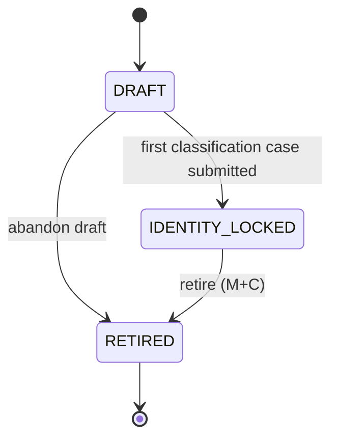
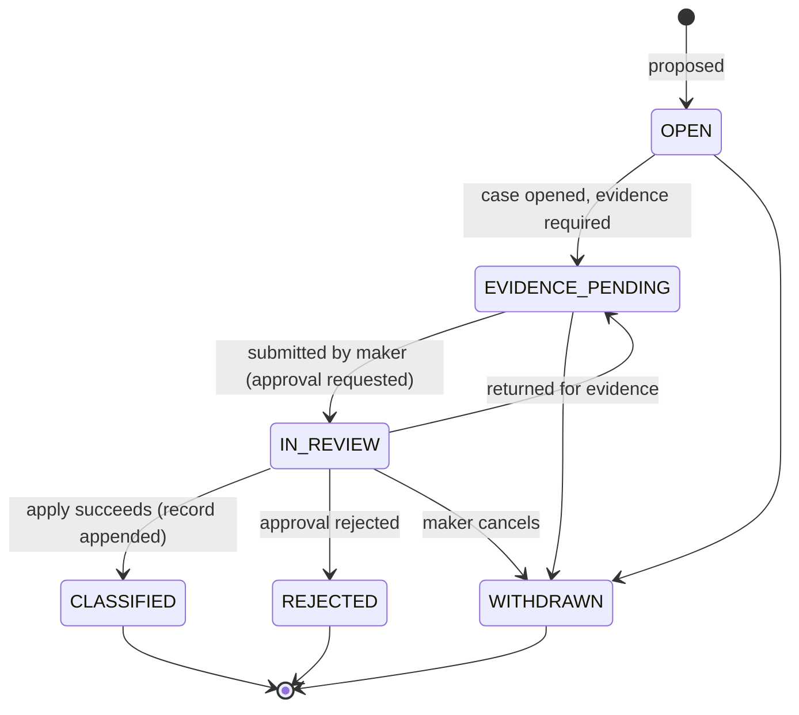
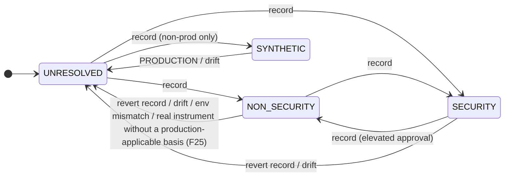
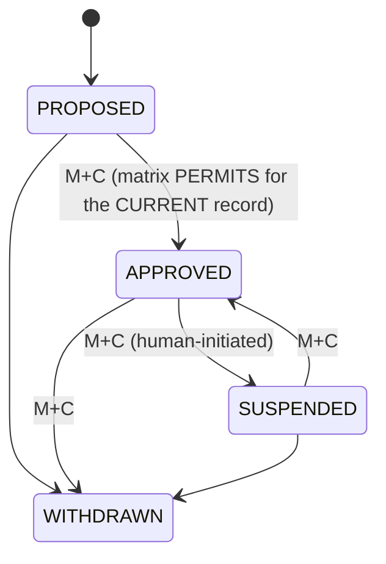

# AST-01 — 06 State Machine (v1.2)

**Status: REMEDIATED / AWAITING RE-REVIEW.** Nine stored state machines, plus the derived mapping to `WF-35`. Illegal transitions are refused in the service **and** by DB CHECK/trigger where a CHECK can express them. Statuses use lower-case for governed-change rows (CFG-01 convention) and upper-case elsewhere.

## SM-1 Instrument registry status (`instrument.lifecycle_status`)

| Transition | Guard |
|---|---|
| `DRAFT → IDENTITY_LOCKED` | Profile complete (precision, network, characteristics, stablecoin backing); fingerprint computed and frozen. `instrument_code`, `declared_synthetic`, `synthetic_emulates` **and `asset_id`, `instrument_form`, `chain`, `network`, `contract_address_canonical`** are immutable **from `INSERT`, in every status** [F09, F19.D] |
| `IDENTITY_LOCKED → RETIRED` | Maker-checker. Retired ⇒ derives `INSTRUMENT_RETIRED`, all subjects deny; history retained. **A retired instrument's canonical identity stays registered permanently and can never be registered again** — no retire-and-recreate on one contract or native identity; a replacement is a new contract under lineage [F19.E] |
| `DRAFT → RETIRED` (abandon) | Also consumes the canonical identity permanently (OQ-8); `POST /instruments/validate` is the dry run |
| any → `DRAFT` | **Forbidden** (identity cannot be reopened) |

## SM-2 Classification case (`classification_case.state`) — maps `WF-35` §33F.3

| `WF-35` state | AST-01 representation |
|---|---|
| `proposed` | `instrument.DRAFT` + case `OPEN` |
| `evidence_pending` | case `EVIDENCE_PENDING` |
| `classification_in_review` | case `IN_REVIEW` |
| `classified_non_security` / `classified_security_or_security_token` / `classified_synthetic_test` | a `classification_record` with that outcome (**not** a case state) |
| `classification_unresolved` (**default**) | **derived**: no valid effective record. Not a stored value |

`CLASSIFIED` is terminal for the case; the outcome lives in the immutable record. A rejected case leaves the instrument exactly as it was (still `UNRESOLVED` if it had no record). Only one non-terminal case per instrument (partial unique index).

## SM-3 Effective classification (**derived**, never stored)

Any arrow into `UNRESOLVED` other than an explicit record is a **derived validity collapse** (01 §4.4 reasons). **A hold is not an arrow here** — it is a separate conjunct and never alters this state [F07]. **Neither is the lineage conjunct C0b (01 §4.7A) [F20]**: a `NON_SECURITY` sibling stays `NON_SECURITY` in this diagram while `LINEAGE_SECURITY_REVIEW_REQUIRED` denies; it is cleared only by a newer elevated record, which is an ordinary arrow. There is no arrow `SYNTHETIC → NON_SECURITY|SECURITY` (unpromotable), and `SECURITY → UNRESOLVED → NON_SECURITY` is subject to the elevated approval because the rule reads lineage **history**, not the previous row [F06]. Subject answers are functions of this state, not transitions.

## SM-4 Hold (`instrument_hold.status`) — a conjunct, not a classification state [F07]

`ACTIVE → RELEASED`. `hold_origin = SYSTEM` (integrity failure) is inserted immediately with no human approval (after a backstop trip, by the application in a **separate transaction** — the raising trigger cannot persist it [F24]); `hold_origin = HUMAN` requires an approved governed change (maker-checker); **release is always a governed change**. `RELEASED` is terminal per row; a new hold is a new row. While any row is `ACTIVE`, derivation applies conjunct C0 (`INSTRUMENT_ON_HOLD`, `NOT_ASSESSED`); **the effective classification outcome is not changed** and no classification record is written.

## SM-5 Product admission (`product_admission.status`)

`SUSPENDED`/`WITHDRAWN` and re-approval are human-initiated ⇒ maker-checker [F07]. `APPROVED` is meaningful only while `classification_record_id` equals the current effective record (DB trigger enforces the binding at approval [F04]). A newer record leaves the row `APPROVED` but **inert** (derives `NOT_ASSESSED: PRODUCT_ADMISSION_NOT_APPROVED`); re-approval against the new record is required. No transition reads or writes an "eligible" value.

## SM-6 Operational state (`instrument_operational_state.state`, per **domain-scoped subject**: `DEPOSIT_MB_PSO`, `WITHDRAWAL_MB_PSO`, `DEPOSIT_SECURITIES`, `WITHDRAWAL_SECURITIES`) [F01]

`DISABLED → ENABLED`, `ENABLED → SUSPENDED`, `SUSPENDED → ENABLED`, `* → DISABLED`: **all human-initiated transitions are maker-checker** [F07]; system integrity failures deny immediately through conjunct C0. Absence ≡ `DISABLED`. `ENABLED` for an `MB_PSO` subject is refused for a security outcome by the SQL backstop. Custody support and the transfer-restriction profile follow the same rule (`APPROVED → WITHDRAWN`, back to `APPROVED`; profile `UNASSESSED ↔ NONE_CONFIRMED|DEFINED`).

## SM-7 Governed change (`governed_change.status`)

Follows CFG-01's *reachable-subset* discipline (migration 016): `requested → applied` (terminal success) and `requested → rejected | cancelled | failed`. `origin ∈ {HUMAN, SYSTEM, SERVICE}`: a `HUMAN` change is `applied` only with an **IAM-02-attested** approval, approver identities and policy id [F05]; `SYSTEM`/`SERVICE` origins are an enumerated allow-list. A change left `requested` after a failed apply is **safely retriable with a fresh IAM-02 approval** — no separate "mark failed" write is attempted after a consumed token. `approved`/`rolled_back` are catalogued-but-unreachable this phase.

## SM-8 Eligibility decision token

`issued → consumed | expired | revoked`. Only `allow` decisions mint tokens (CHECK on the token table's denormalised `decision`). Revocation reasons: `instrument_reclassified`, `hold_placed`, `environment_mismatch`, `admission_suspended`, `attestation_stale`, `lineage_security_determination`, `backstop_reject`, `manual`. A token is bound to subject, domain, consumer service, instrument, environment, classification record and payload (client facts) [F02, F23]. **[v1.2: F18]** Binding columns are **immutable after mint**; only `consumed_at_utc`, `revoked_at_utc`, `revoked_reason` change, one-way. `issued → consumed` happens only inside the single consumption transaction (instrument lock → token lock → recheck → conditional update), and the database trigger re-runs the SQL backstop at that update (05 §7A). A failed consumption leaves the token `issued` (or `revoked` where the cause requires it, in a separate transaction); it is never half-consumed.

## SM-9 Evidence standard (`evidence_standard.status`)

`DRAFT → APPROVED → RETIRED`. A standard applicable to PRODUCTION cannot leave `DRAFT` without `r4q3_resolution_ref`.

---

## 9. Derived-state mapping for the tail of `WF-35`

| `WF-35` state | Where it lives | Stored by AST-01? |
|---|---|---|
| `eligibility_derived` | `deriveProductEligibility()` output | **No** (would be a flag) |
| `operationally_eligible` | `deriveOperationalEligibility()` output | **No** |
| `activated` | `CFG-01` `PRODUCTION_ACTIVATION_STATE` / `cfg1.feature.current_state` (`DEC-014`) | **No — never** |
