# CFG-01 Feature Flag / Licence Lock  
## 03 Diagrams

## 1. Runtime Feature Decision

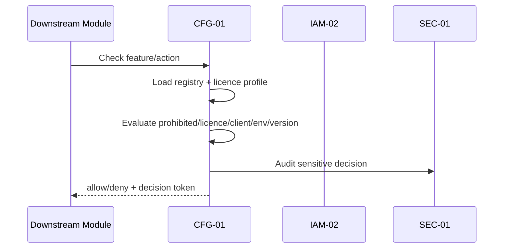

---

## 2. Feature Change

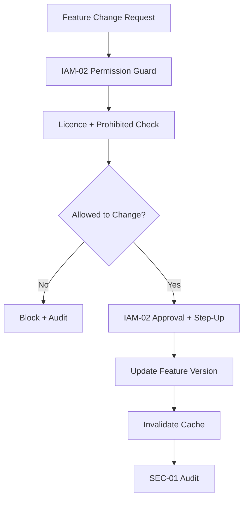

---

## 3. Licence Profile Change

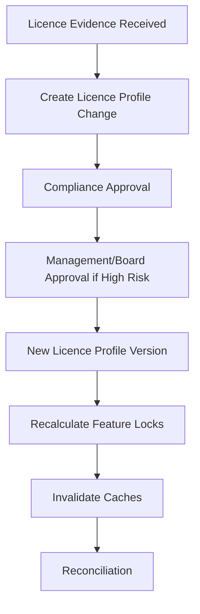

---

## 4. Kill-Switch

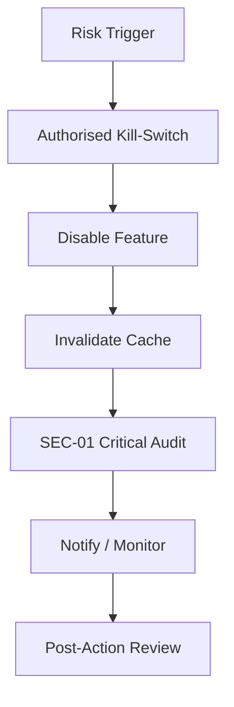

---

## 5. Deployment Gate

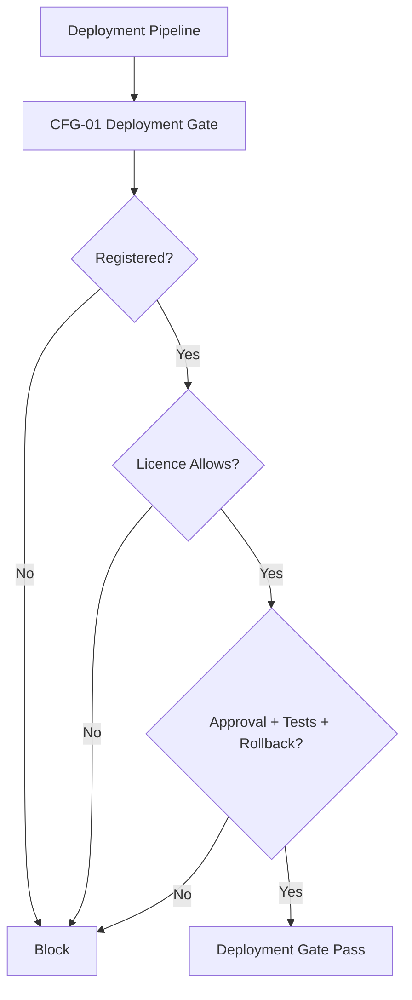

---

## 6. Interim Handoff

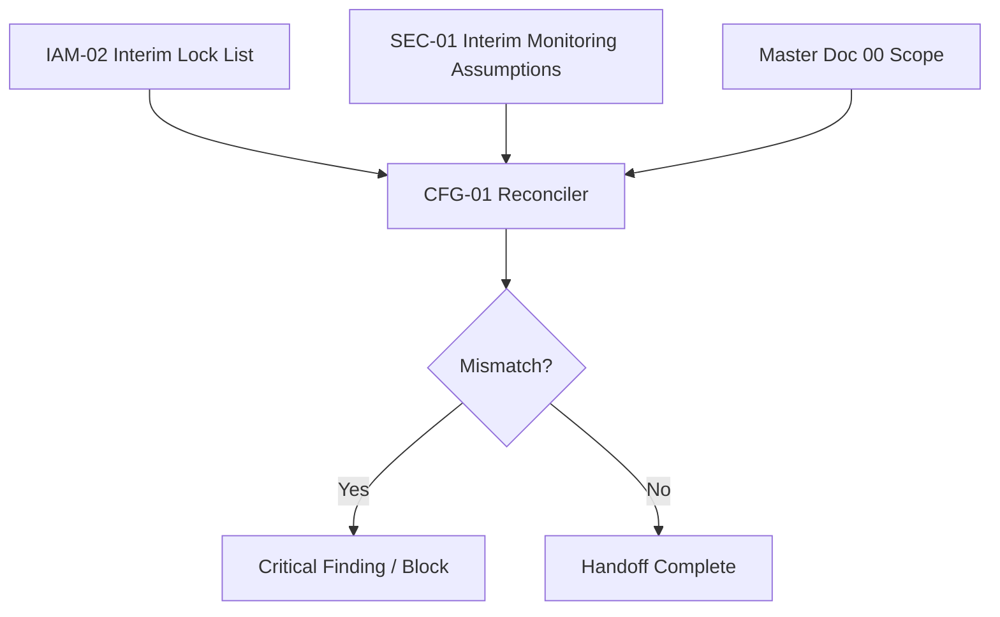

---

## 7. Config Integrity Seal

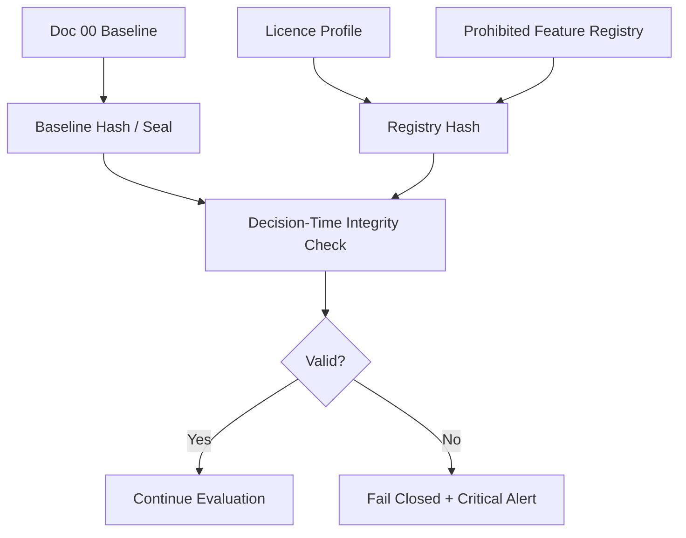

---

## 8. Exchange Activation Ceremony

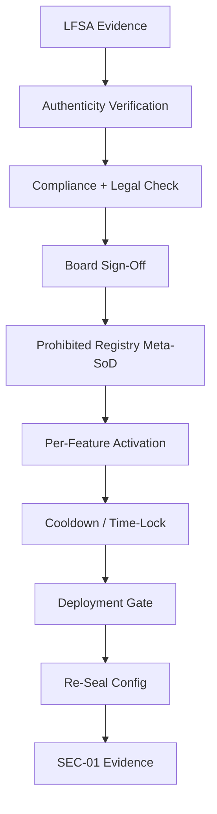

---

## 9. IAM-02 Bound Feature Gate

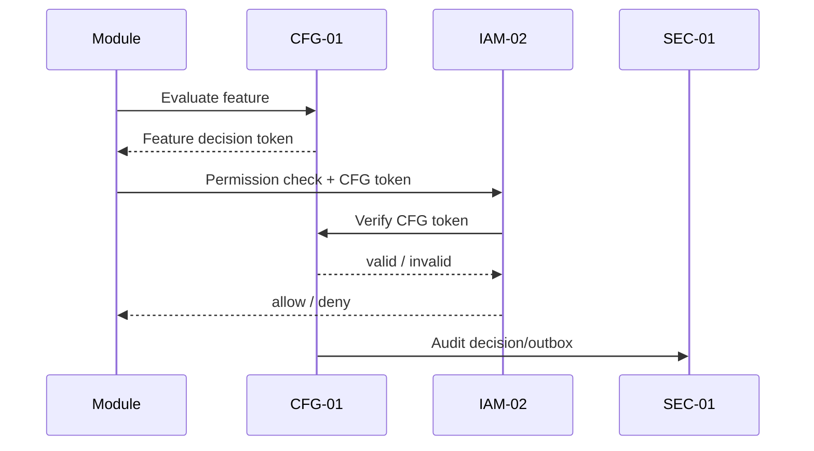

---

## 10. Asymmetric Audit Outage

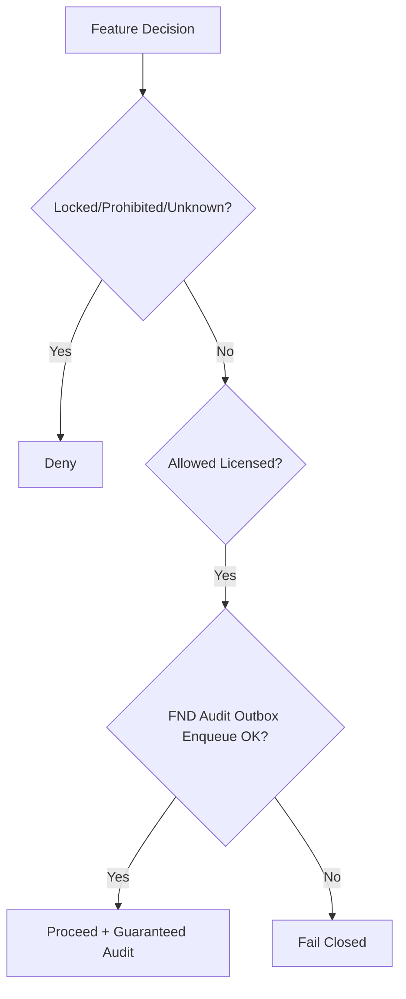

---

## 11. All-Environment Prohibited Lock

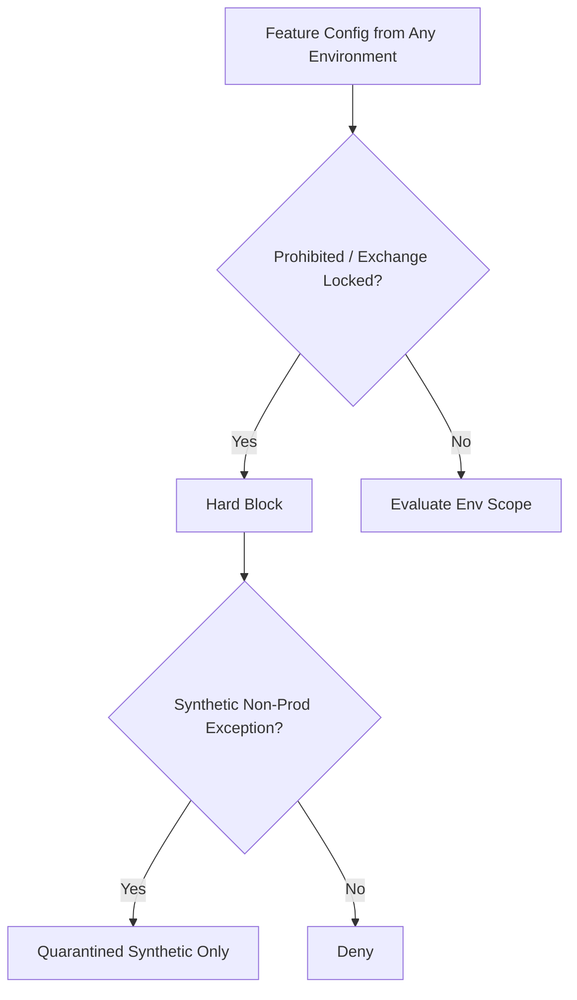
