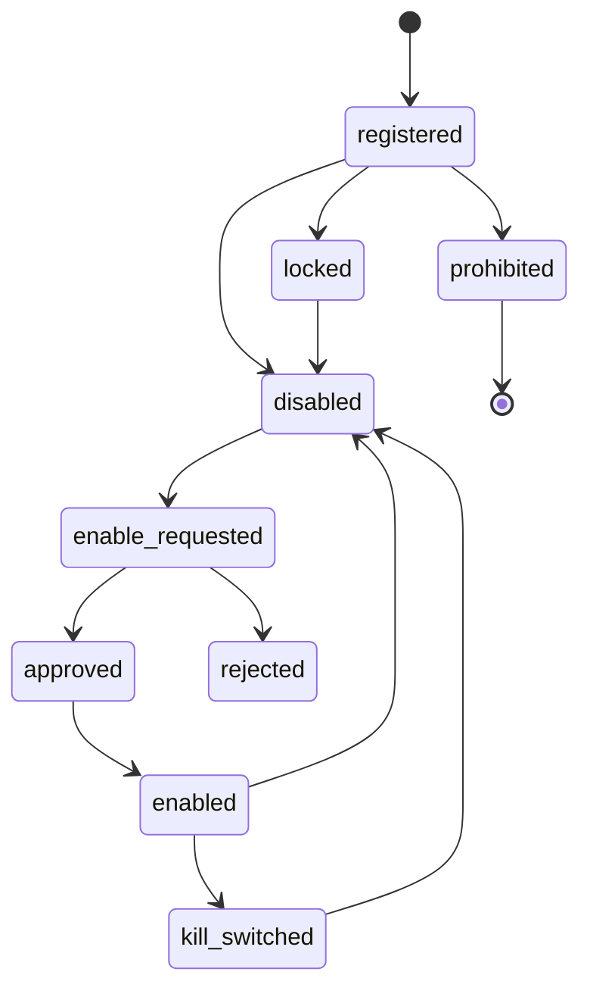
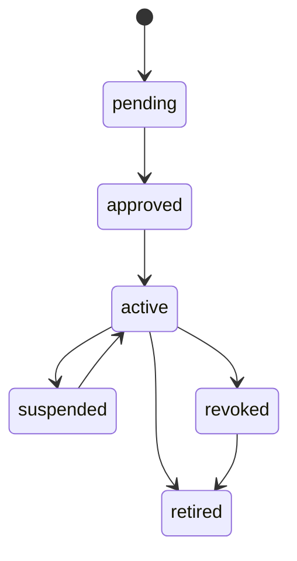
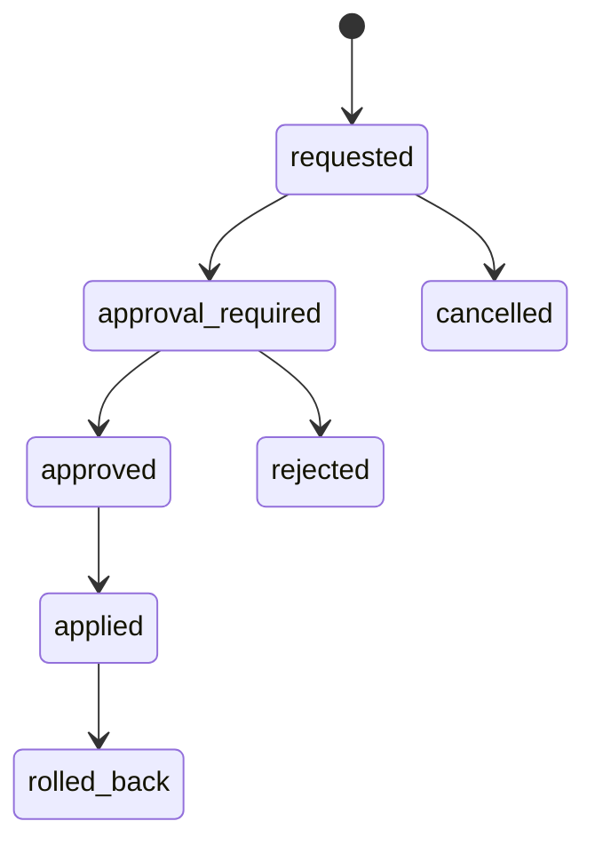
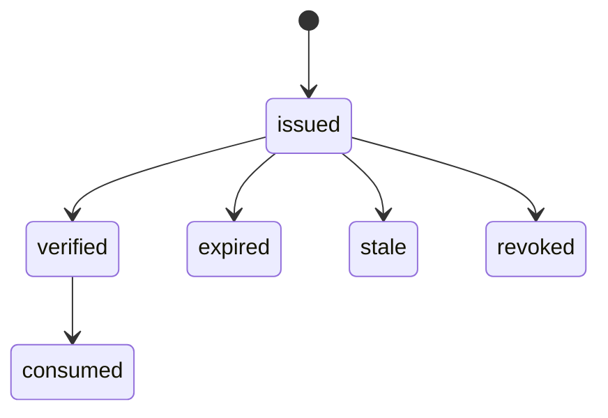
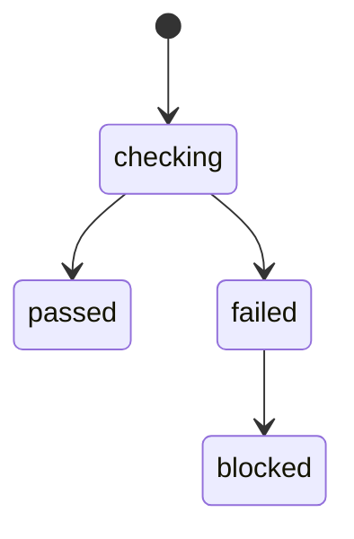
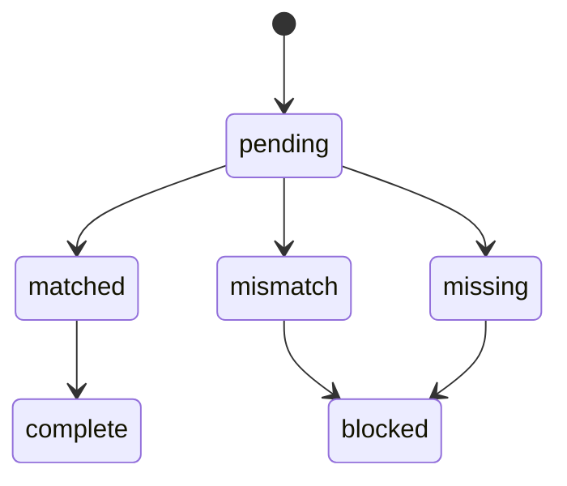
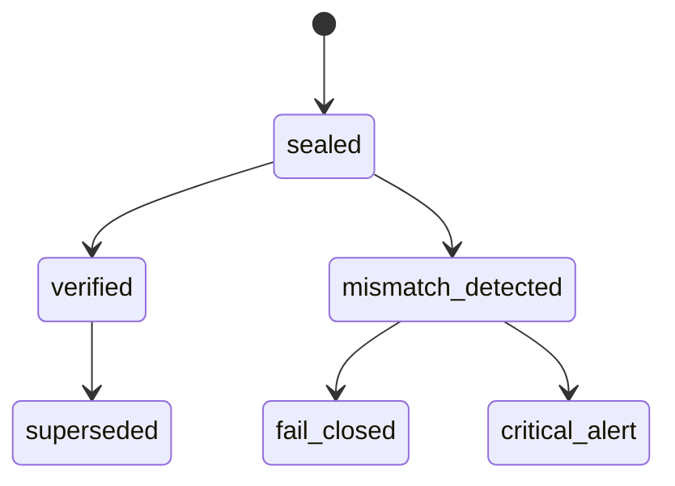
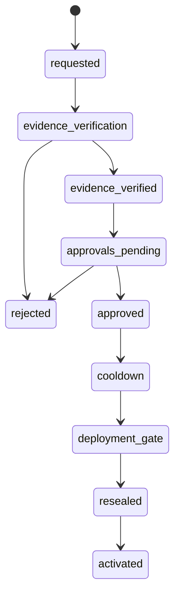
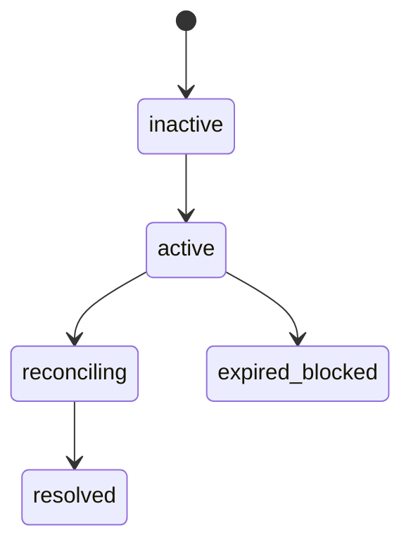

# CFG-01 Feature Flag / Licence Lock  
## 06 State Machine

## 1. Feature State

## 2. Licence Profile State

## 3. Feature Change State

## 4. Decision Token State

## 5. Deployment Gate State

## 6. Handoff Reconciliation State

## 7. Config Integrity State

## 8. Exchange Activation Ceremony State

## 9. Audit Outage Mode State

