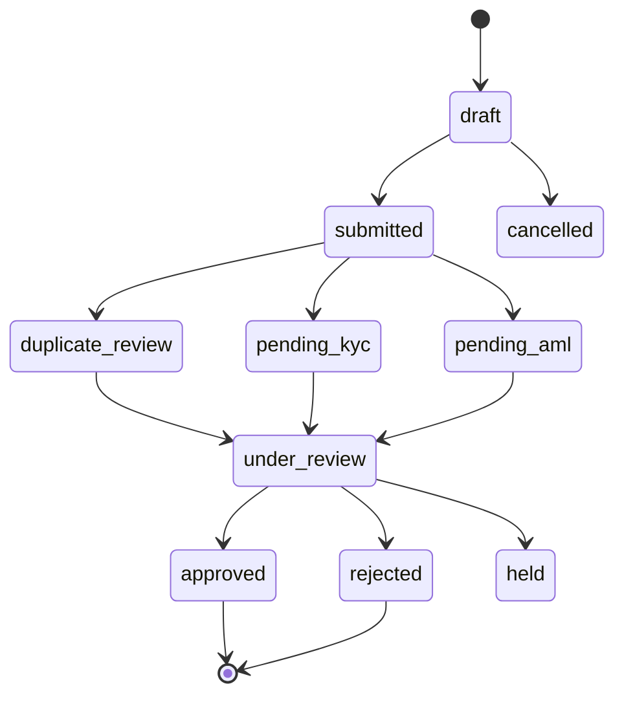
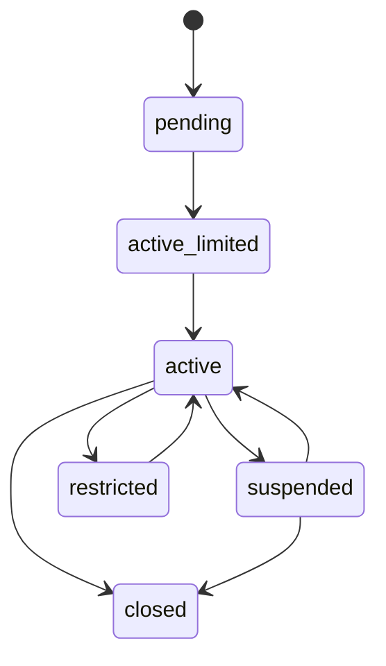
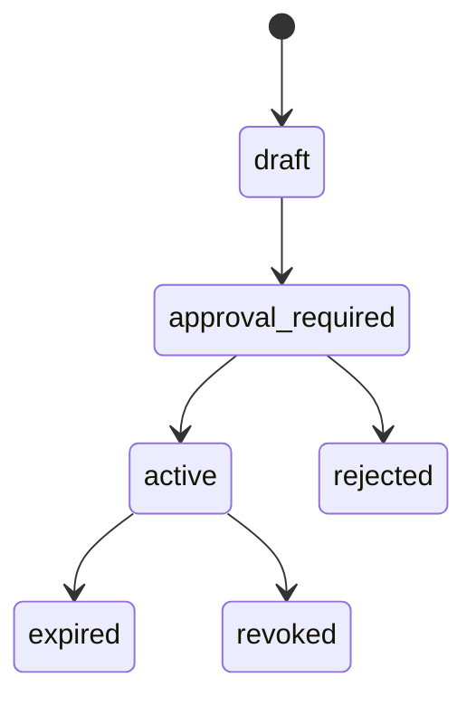
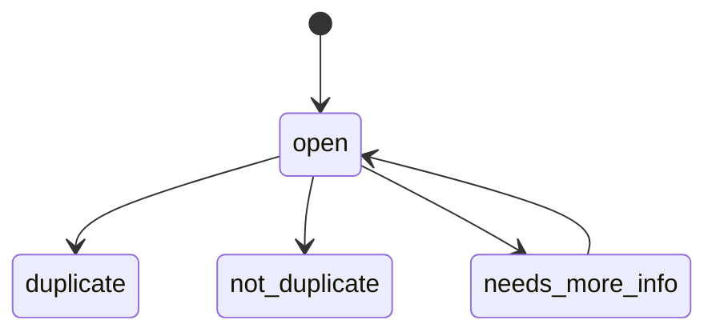
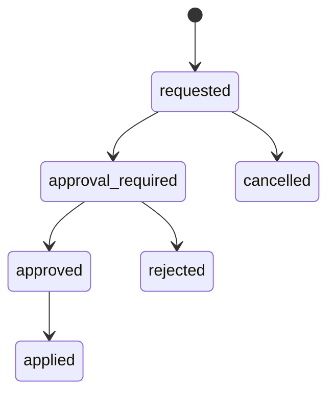
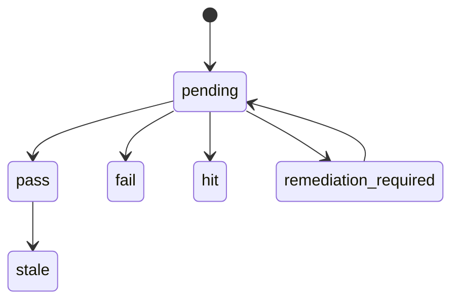
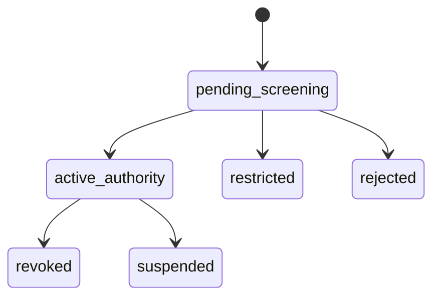
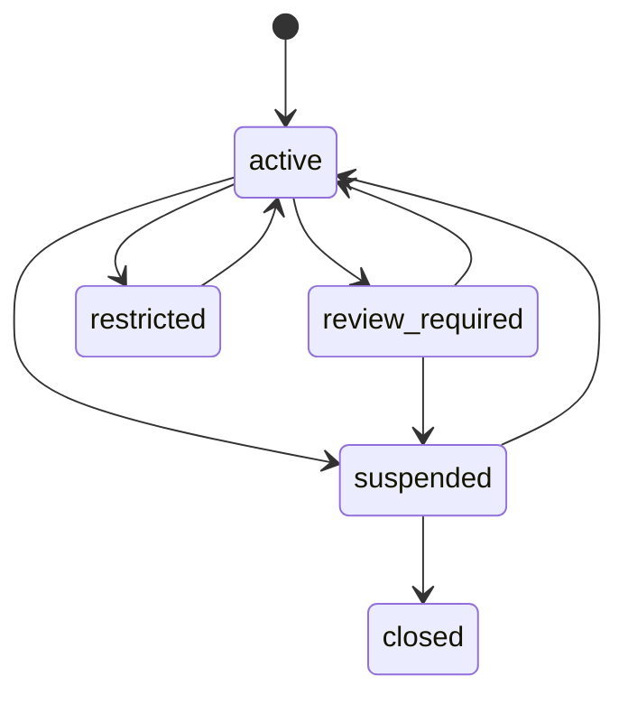

# CLT-01 Client Onboarding / Client Profile
## 06 State Machine

## 1. Application State

## 2. Client Profile State

## 3. Mandate State

## 4. Duplicate Review State

## 5. Profile Change State

## 6. CDD Outcome State

## 7. Authorised Party State

## 8. Ongoing Monitoring State

