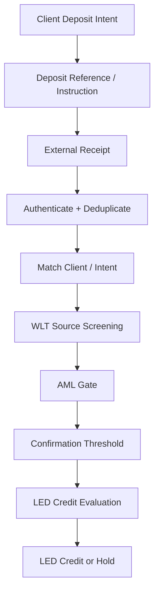
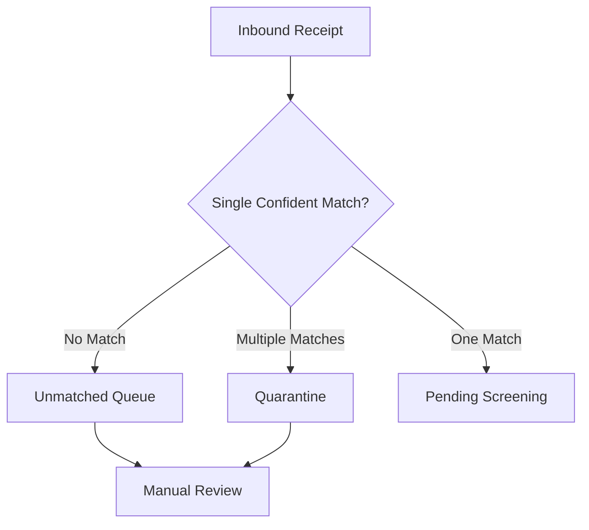
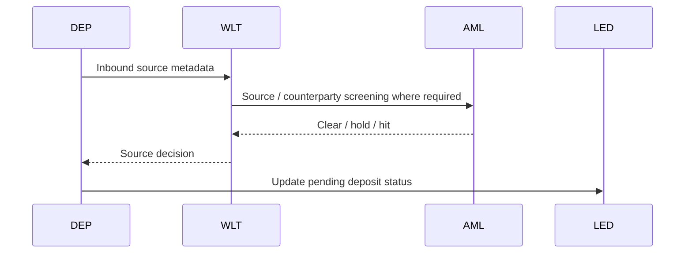
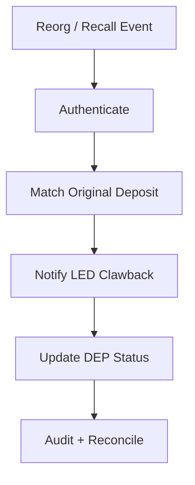
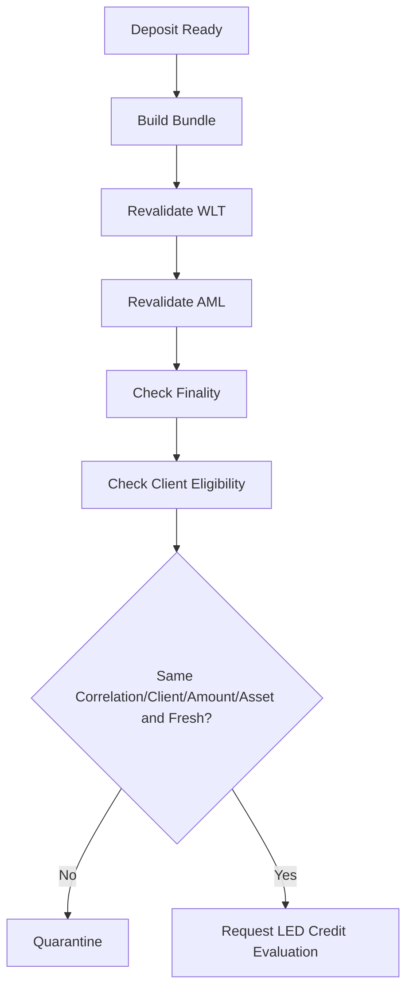
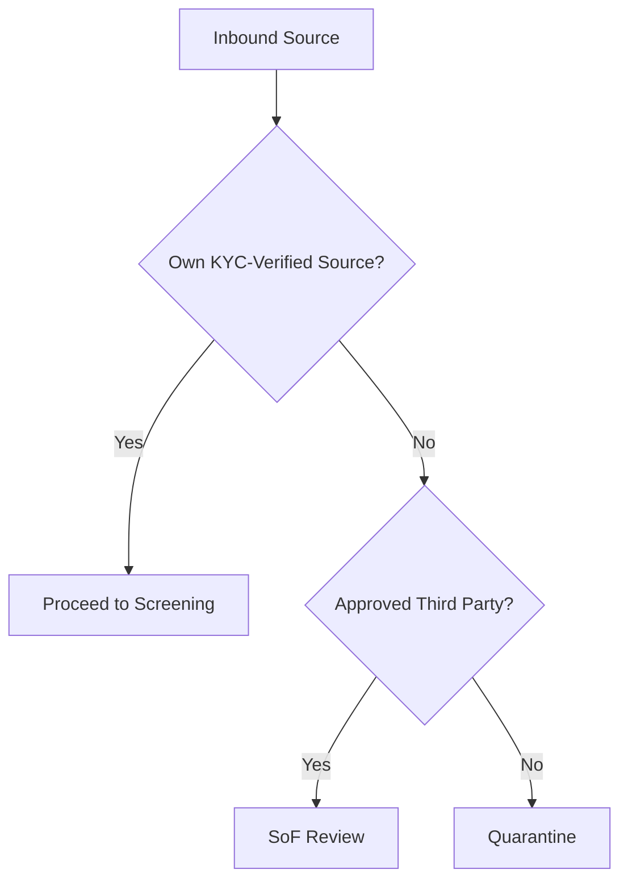
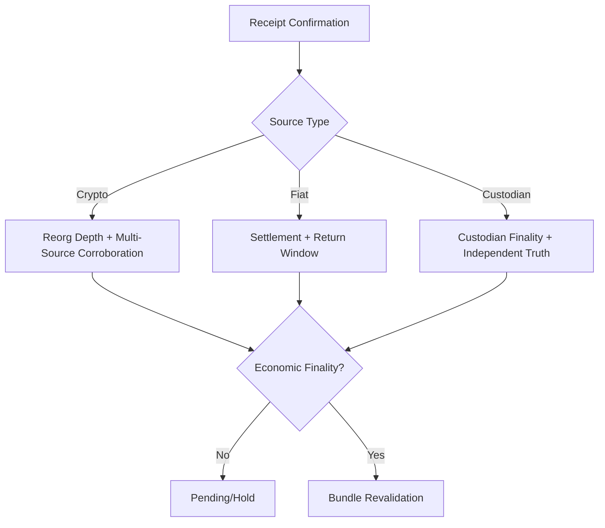

# DEP-01 Deposit Execution / Inbound Receipt
## 03 Diagrams

## 1. Deposit Intent to Credit Evaluation

## 2. Mis-Attribution Guard

## 3. Source Screening

## 4. Reversal / Recall

## 5. Credit-Request Bundle Revalidation

## 6. Source-of-Funds Binding

## 7. Finality Model

