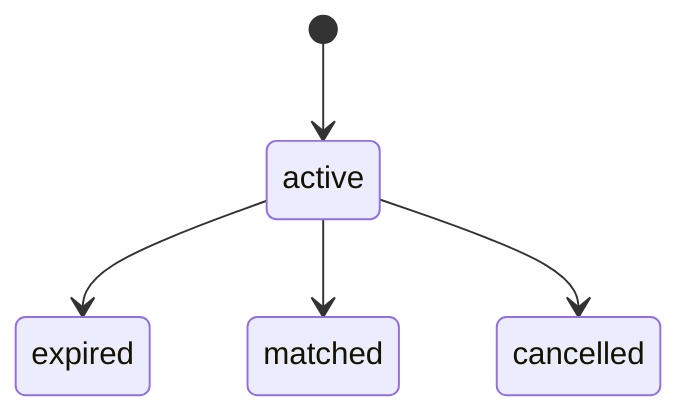
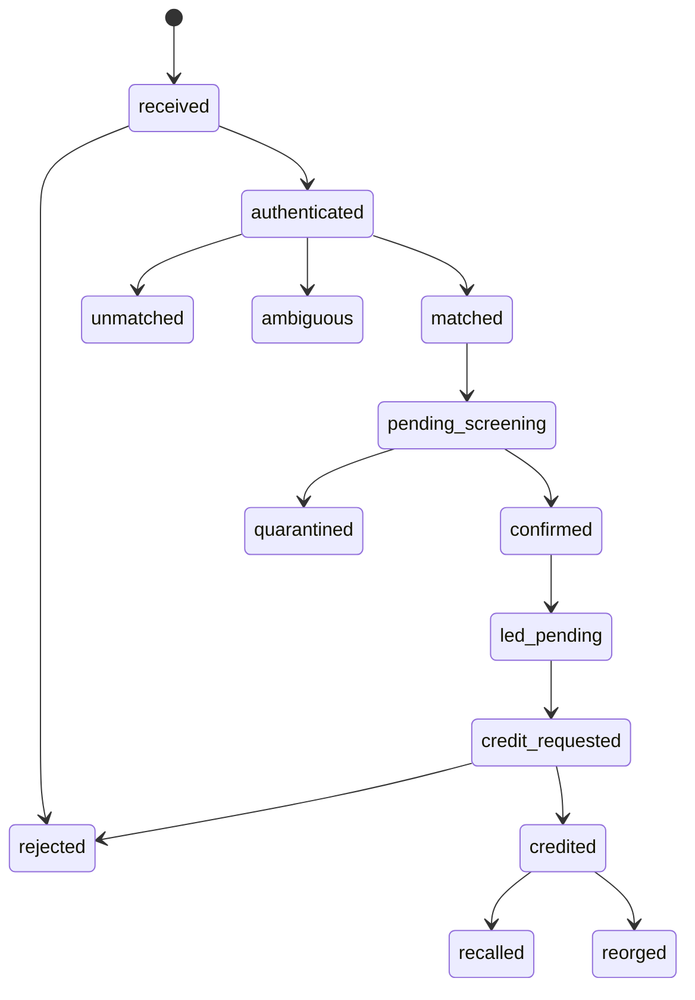
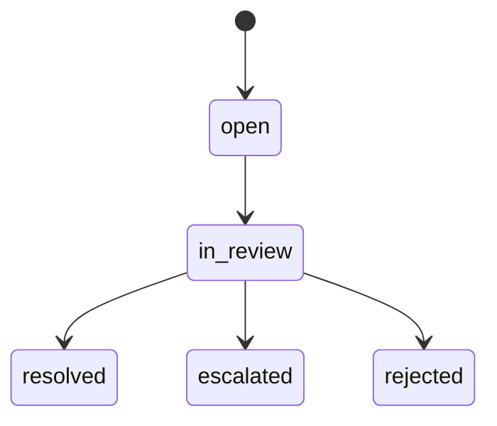
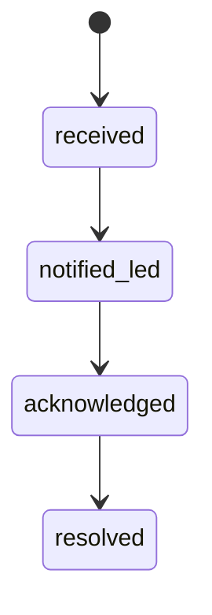
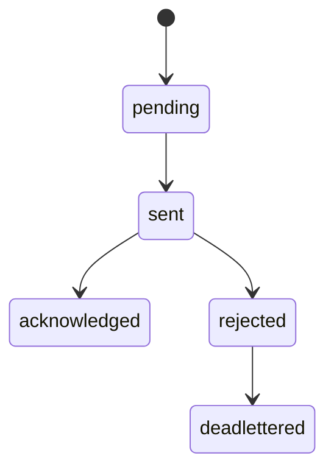
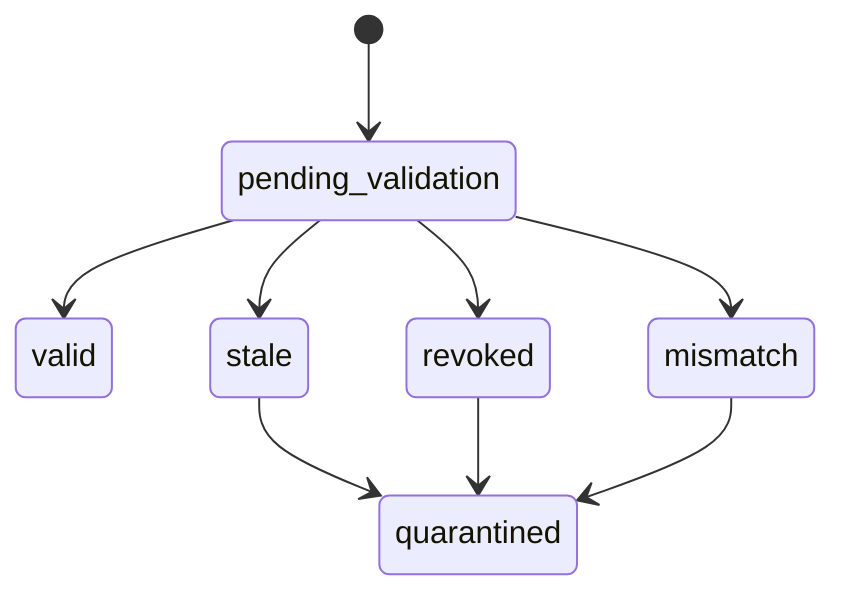
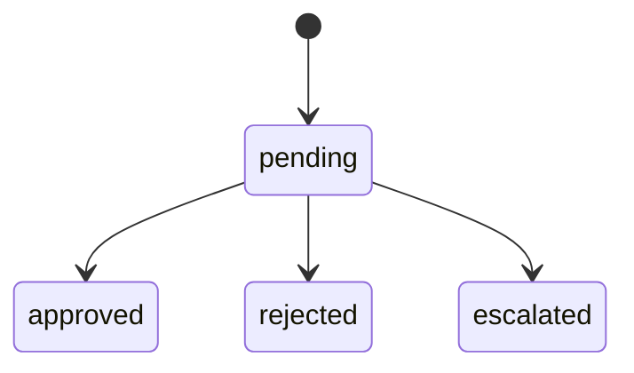
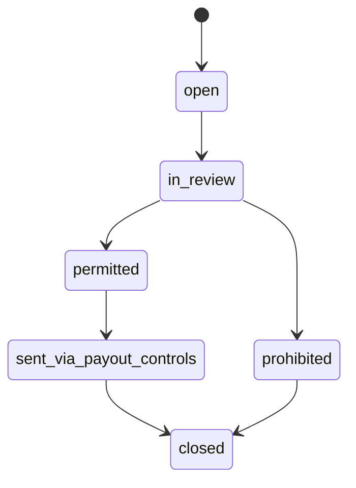

# DEP-01 Deposit Execution / Inbound Receipt
## 06 State Machine

## 1. Deposit Intent State

## 2. Receipt State

## 3. Quarantine Case State

## 4. Reversal State

## 5. LED Handoff State

## 6. Credit Bundle State

## 7. SoF Review State

## 8. Return Case State

