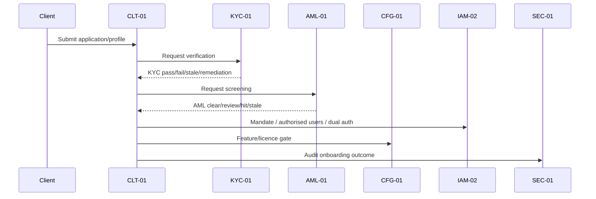
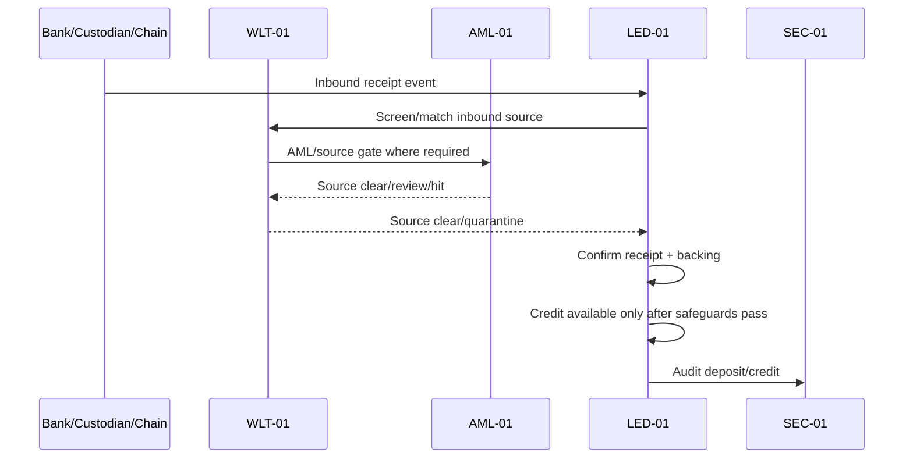
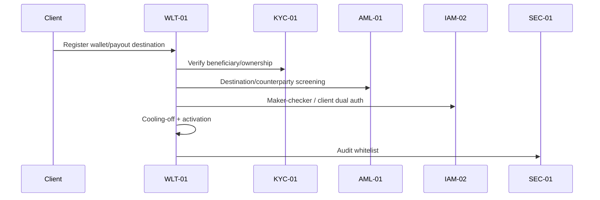
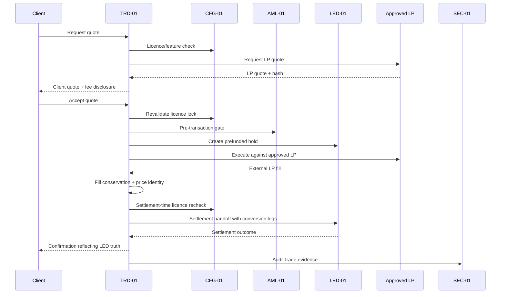
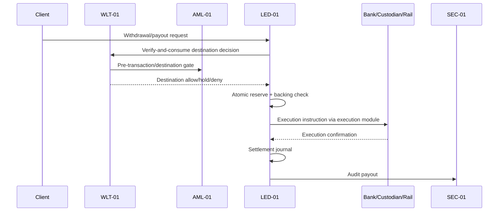

# E2E-01 Cross-Module End-to-End Fund-Flow Review
## 03 End-To-End Fund-Flow Map

## 1. Flow A — Client Onboarding to Trading Eligibility



Eligibility output:

```txt
client_trading_eligible = CLT approved + KYC current pass + AML current clear + mandate valid + CFG allowed + no restriction
```

## 2. Flow B — Deposit to Available Balance



Blocking conditions:

1. source unscreened.
2. source sanctioned/high-risk.
3. source/client mismatch.
4. receipt unconfirmed.
5. backing not free/confirmed.
6. AML/KYC/client restriction.
7. duplicate event.

## 3. Flow C — Wallet / Payout Destination Whitelist



Blocking conditions:

1. missing proof-of-control.
2. beneficiary mismatch.
3. third-party beneficiary unapproved.
4. wallet high-risk/sanctions exposure.
5. cooling-off active.
6. AML revocation.
7. unsupported chain/provider.

## 4. Flow D — Quote / Trade / LP Execution / Settlement



Blocking conditions:

1. unapproved LP.
2. stale quote.
3. client quote validity exceeds LP quote validity.
4. no LED hold.
5. stale AML/CFG decision.
6. LP timeout unresolved.
7. no external LP fill.
8. fill conservation failure.
9. price identity failure.
10. internalisation/synthetic LP fill.
11. LED settlement failure.

## 5. Flow E — Withdrawal / Payout



Blocking conditions:

1. destination not active.
2. WLT decision not execution-revalidated.
3. AML gate stale.
4. insufficient live available balance.
5. backing invariant failure.
6. client/mandate freeze.
7. Travel Rule missing data.
