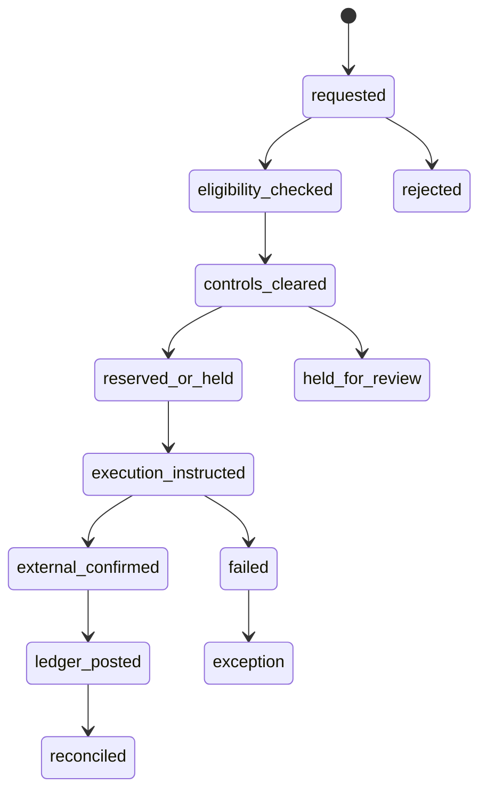
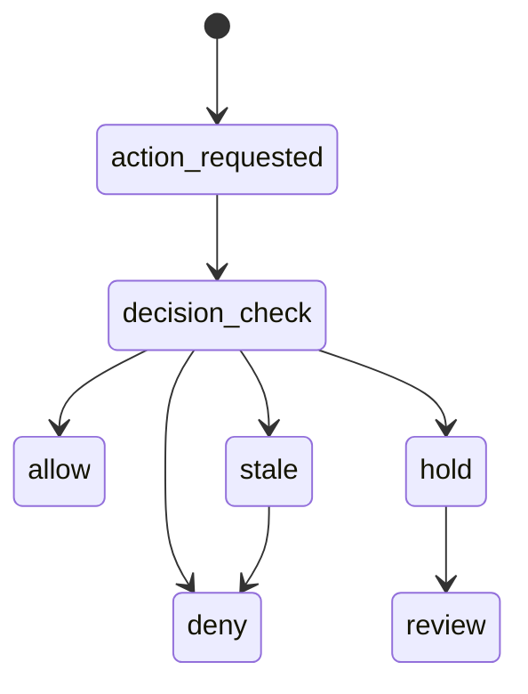
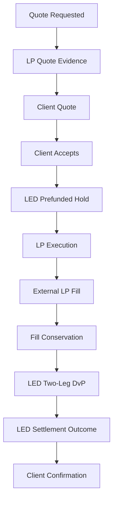
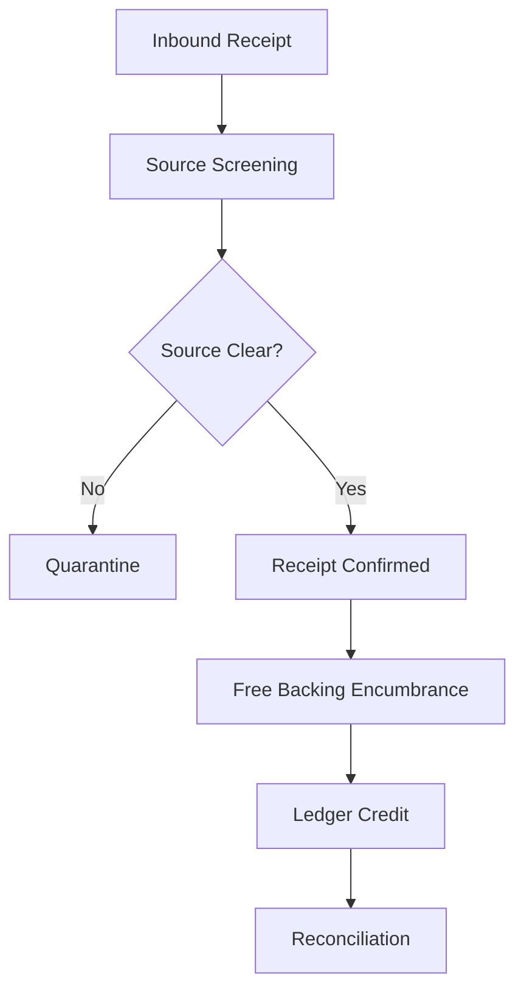
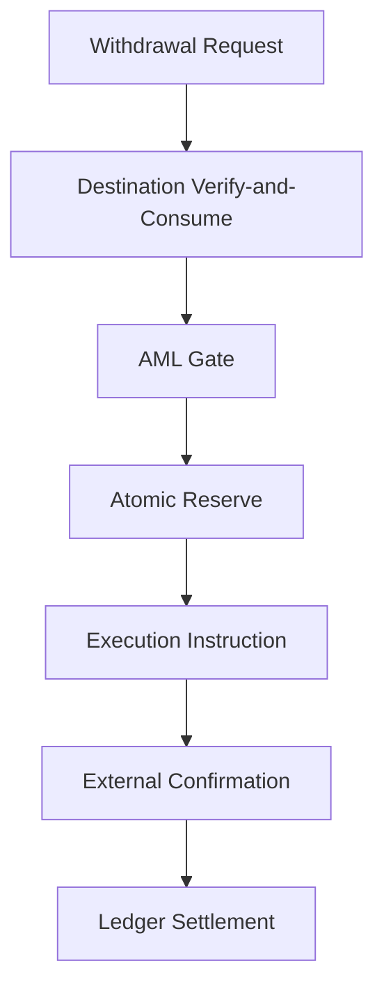
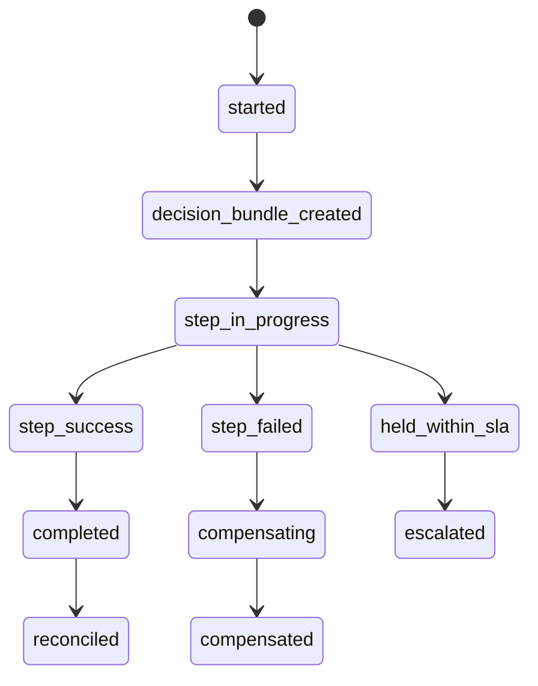
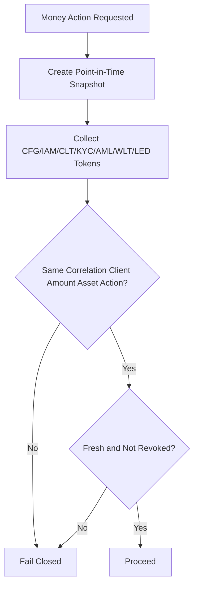
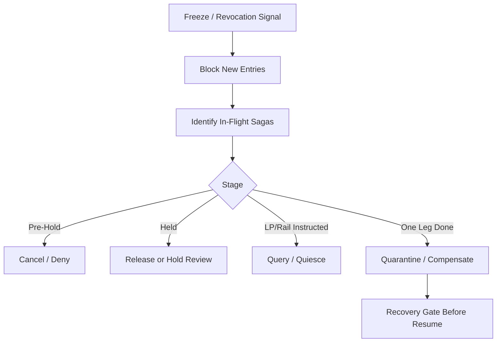
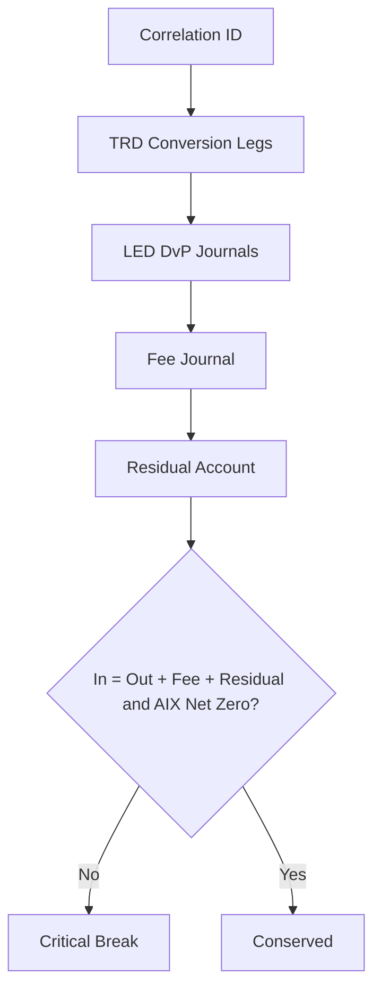

# E2E-01 Cross-Module End-to-End Fund-Flow Review
## 06 E2E State And Sequence Diagrams

## 1. Global Money Movement State

## 2. Cross-Module Fail-Closed State

## 3. End-to-End Trade State Across TRD and LED

## 4. End-to-End Deposit State Across WLT and LED

## 5. End-to-End Withdrawal State Across WLT and LED

## 6. Cross-Module Saga State

## 7. Decision Bundle Validation

## 8. Freeze Propagation

## 9. Value Conservation

