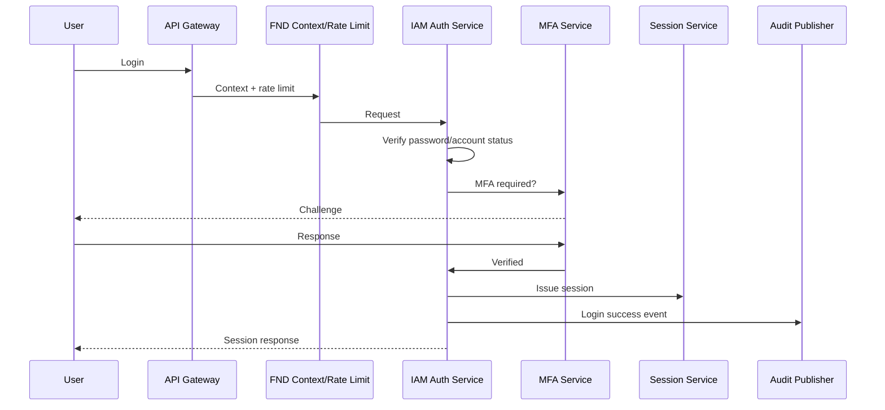
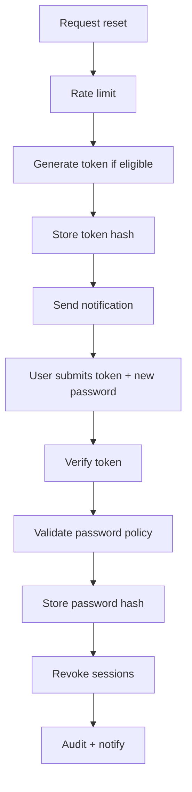
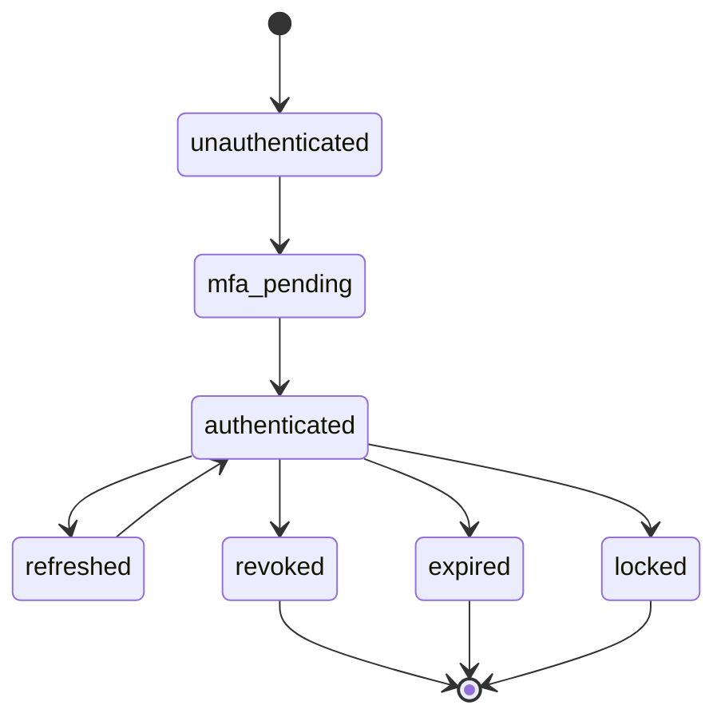
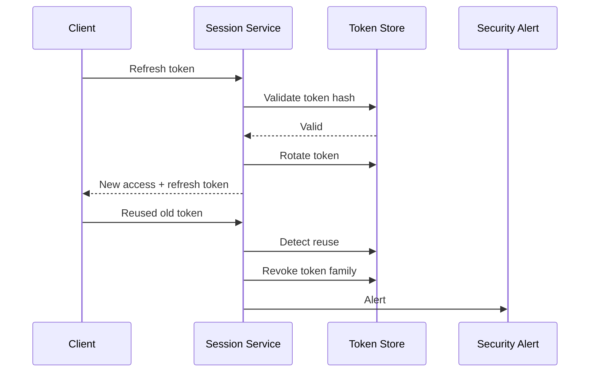
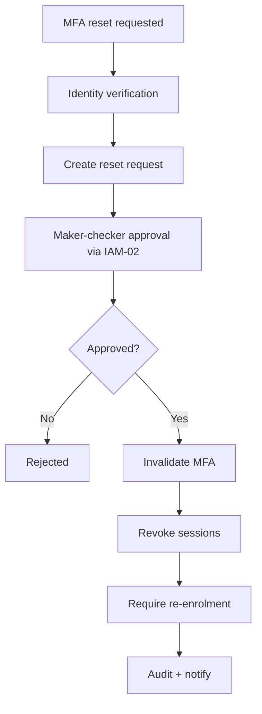
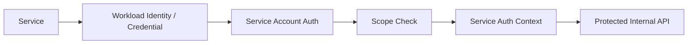
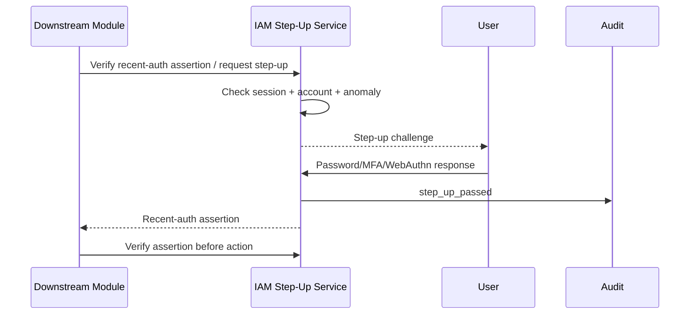
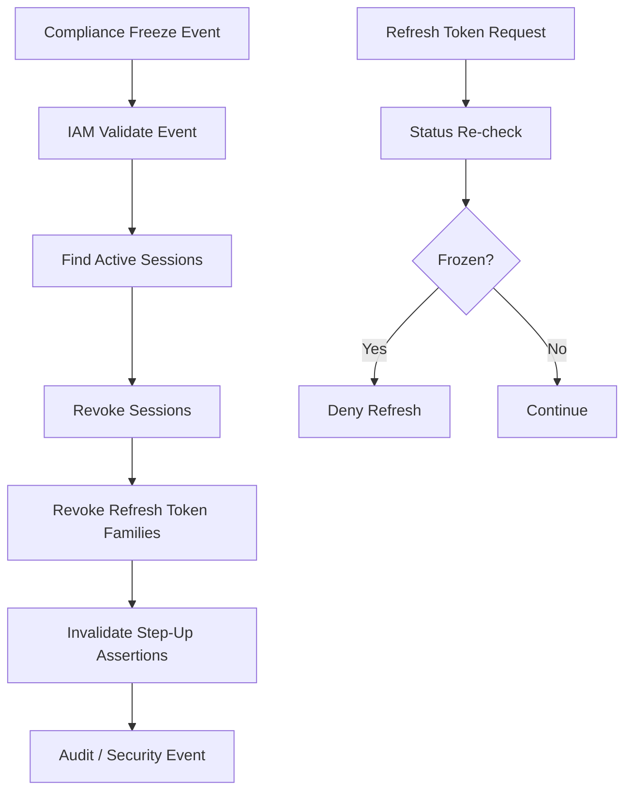
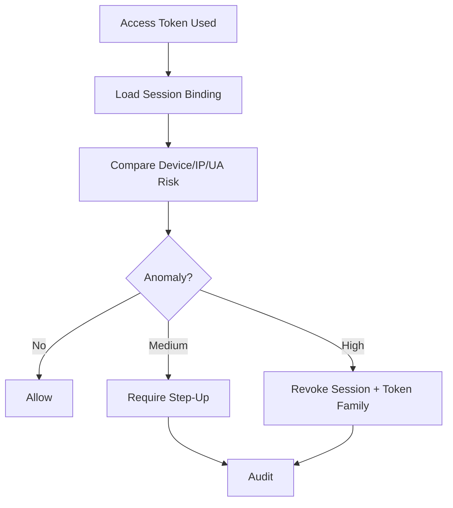
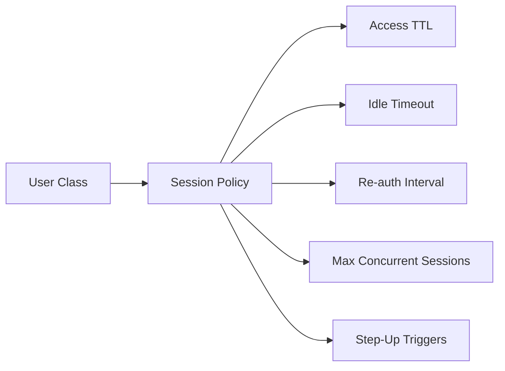

# IAM-01 Authentication / MFA / Session  
## 03 Diagrams

## 1. Login Flow

---

## 2. Password Reset

---

## 3. Session State

---

## 4. Refresh Token Rotation

---

## 5. MFA Reset

---

## 6. Service Account Auth

---

## 7. Step-Up Authentication

---

## 8. Freeze to Session Revocation

---

## 9. Session Hijack / Mid-Session Anomaly

---

## 10. Per-User-Class Session Policy

