# IAM-01 Authentication / MFA / Session  
## 06 State Machine

## 1. User Auth Status

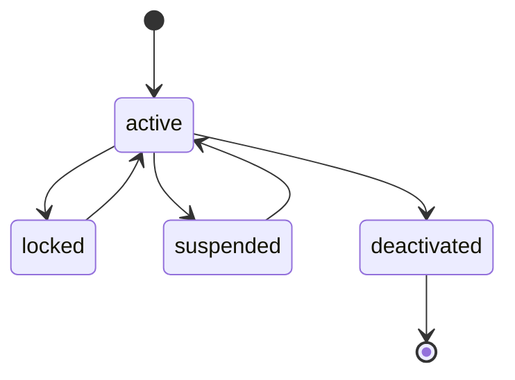

## 2. Login State

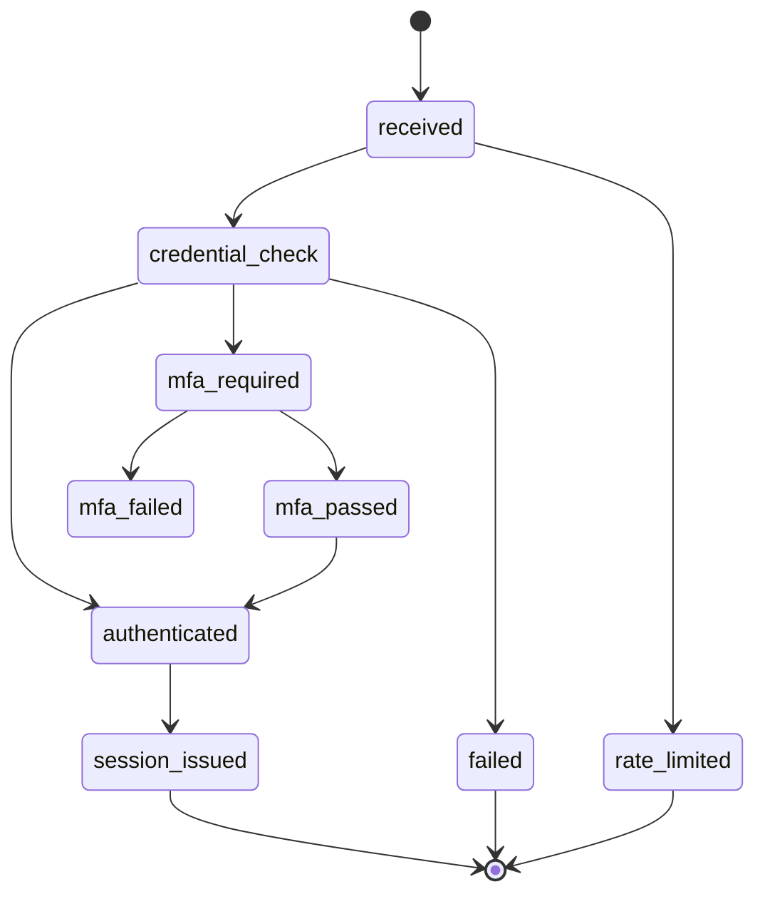

## 3. MFA Factor State

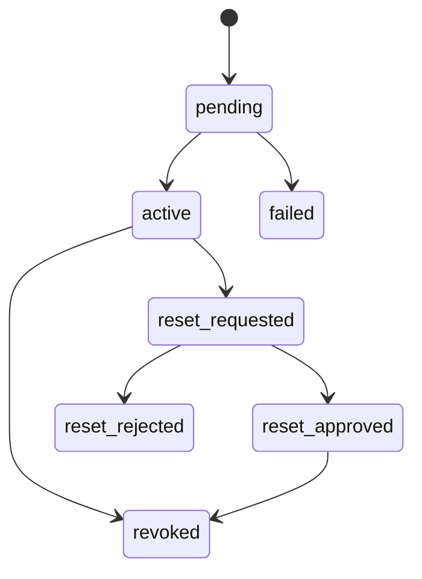

## 4. MFA Challenge State

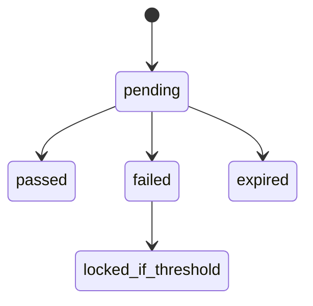

## 5. Session State

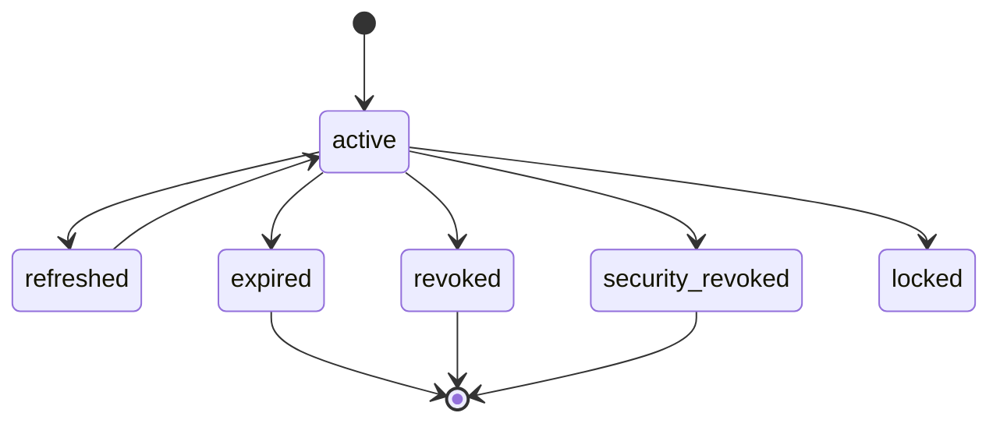

## 6. Refresh Token State

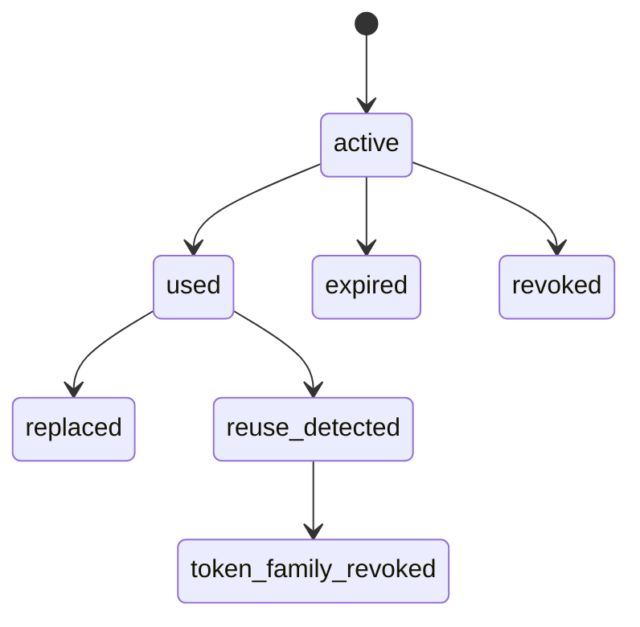

## 7. Password Reset Token State

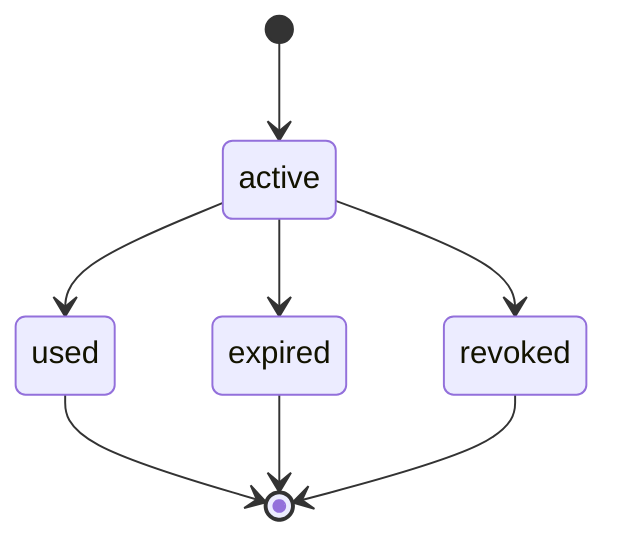

## 8. Service Account State

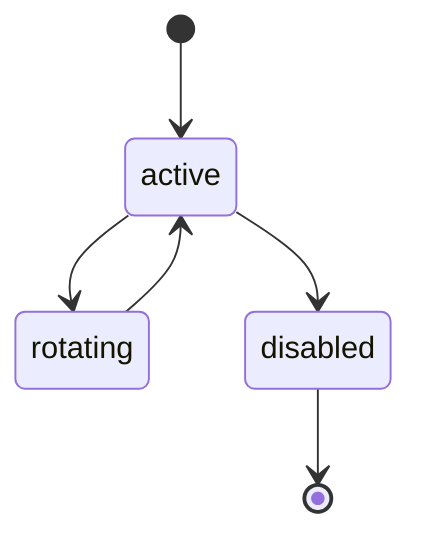

---

## 9. Step-Up Assertion State

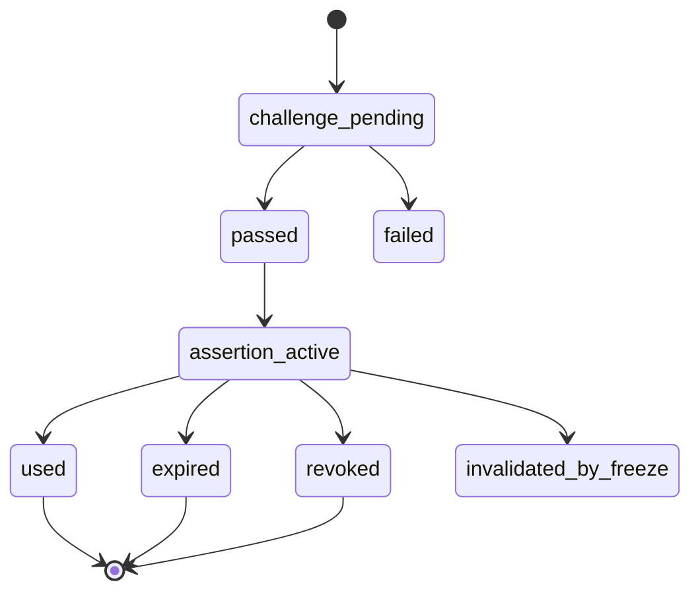

## 10. Freeze Revocation State

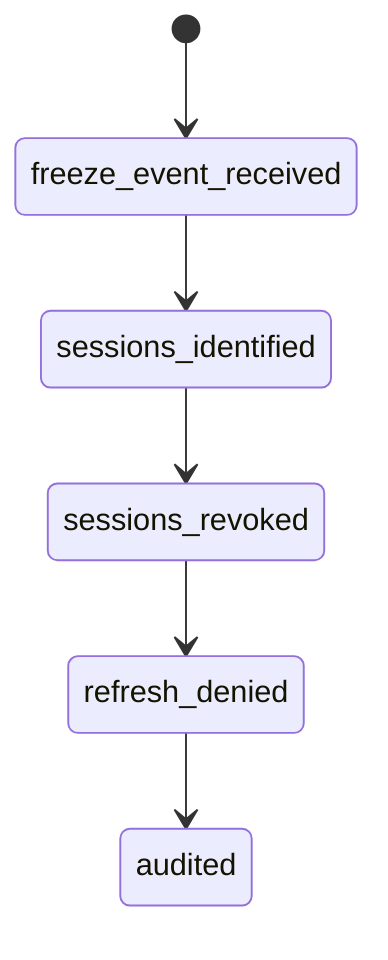

## 11. Session Anomaly State

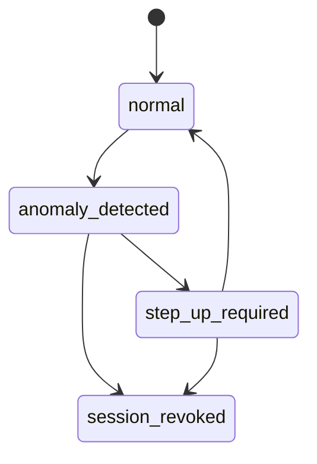

## 12. MFA Reset Request State

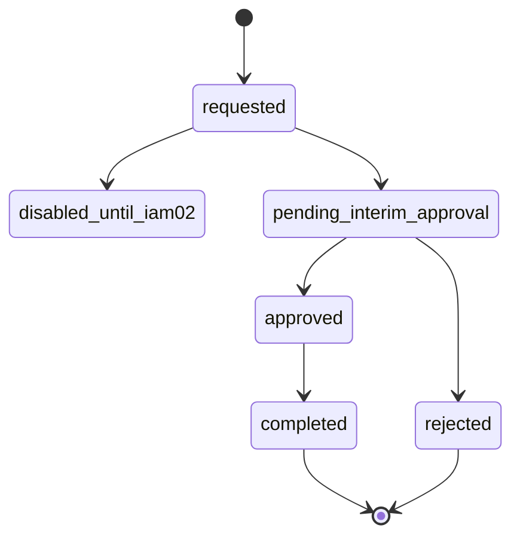
