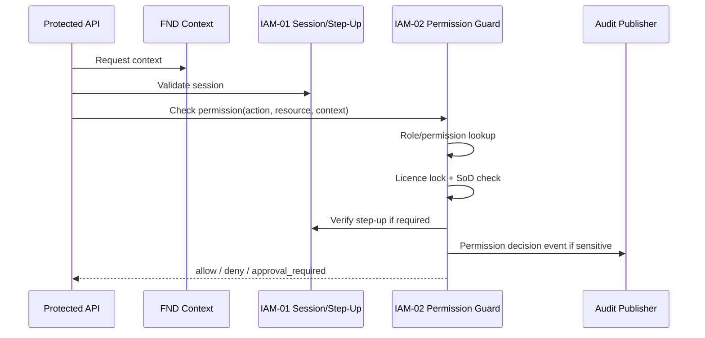
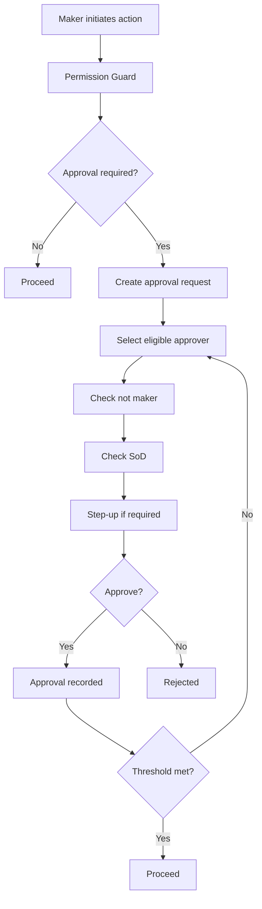
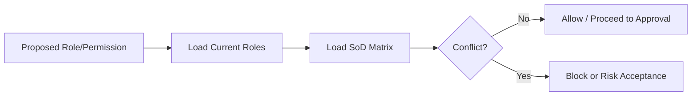
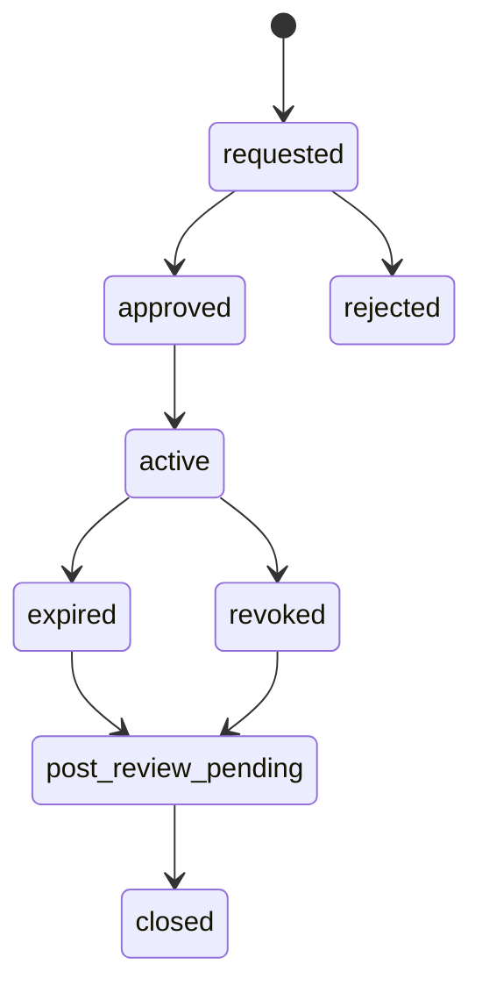
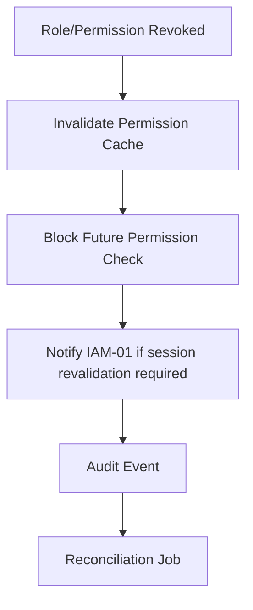
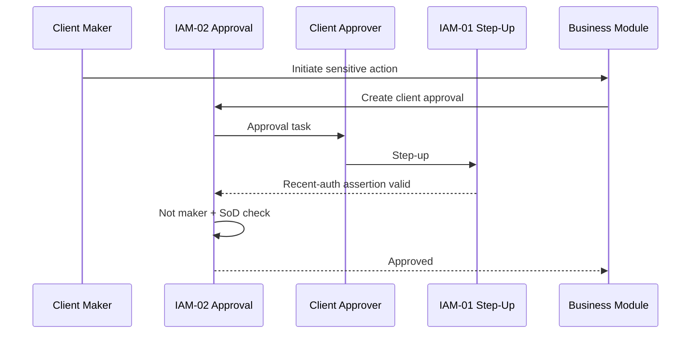
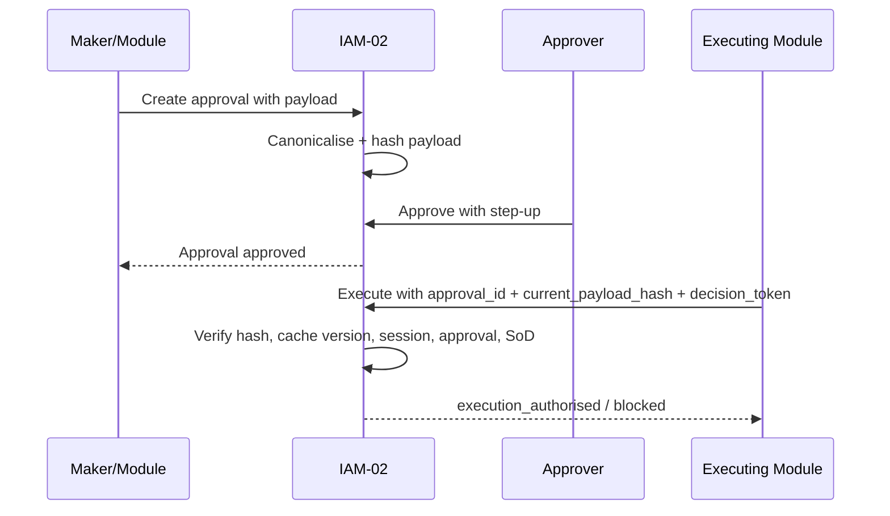
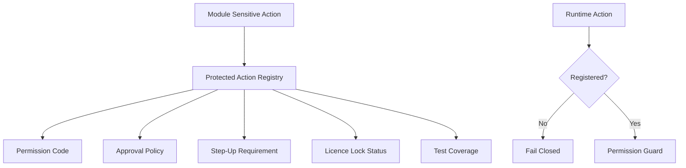
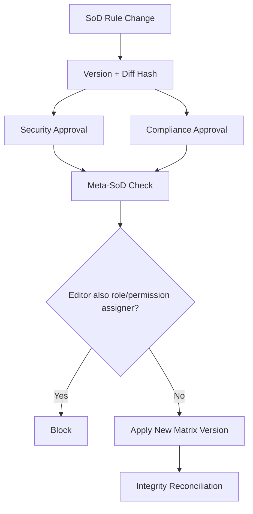
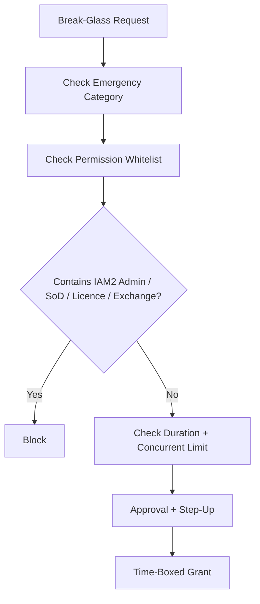

# IAM-02 RBAC / Permission Guard / SoD  
## 03 Diagrams

## 1. Runtime Permission Guard

---

## 2. Maker-Checker Approval

---

## 3. SoD Assignment Check

---

## 4. Break-Glass

---

## 5. Permission Revocation Propagation

---

## 6. Client-Side Dual Authorization

---

## 7. Approval-to-Execution Binding

---

## 8. Protected-Action Registry

---

## 9. SoD Matrix Versioning / Meta-SoD

---

## 10. Break-Glass Ceiling

