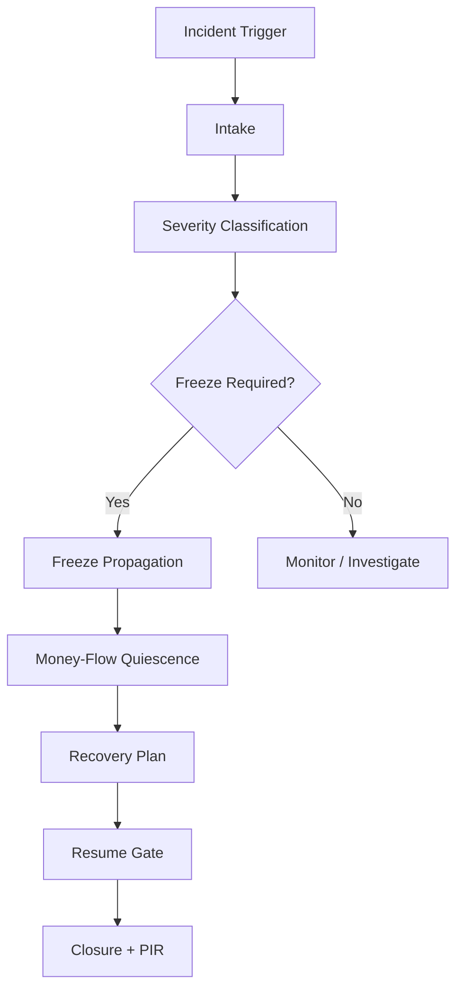
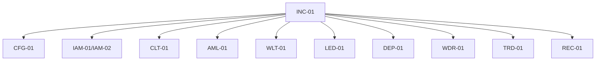
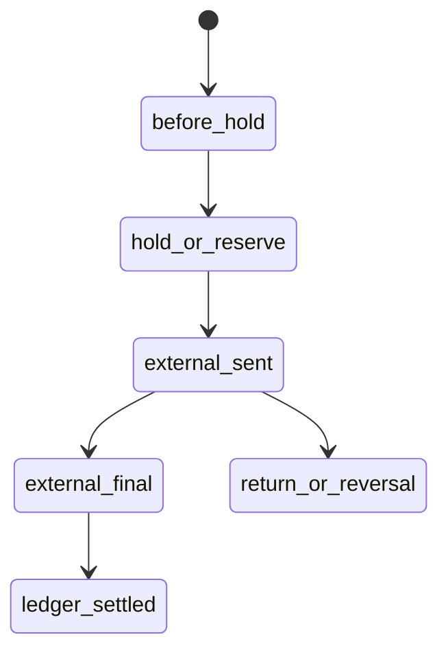
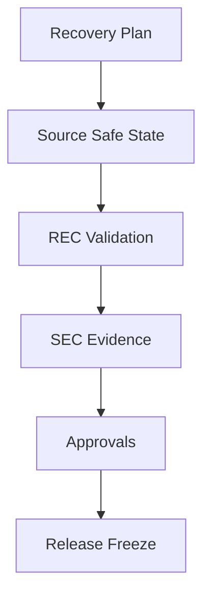
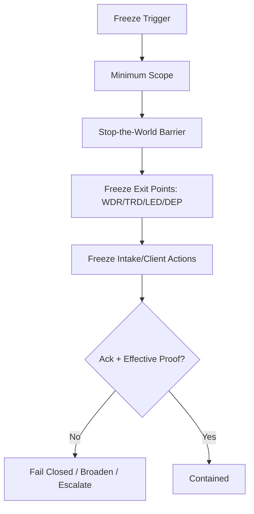
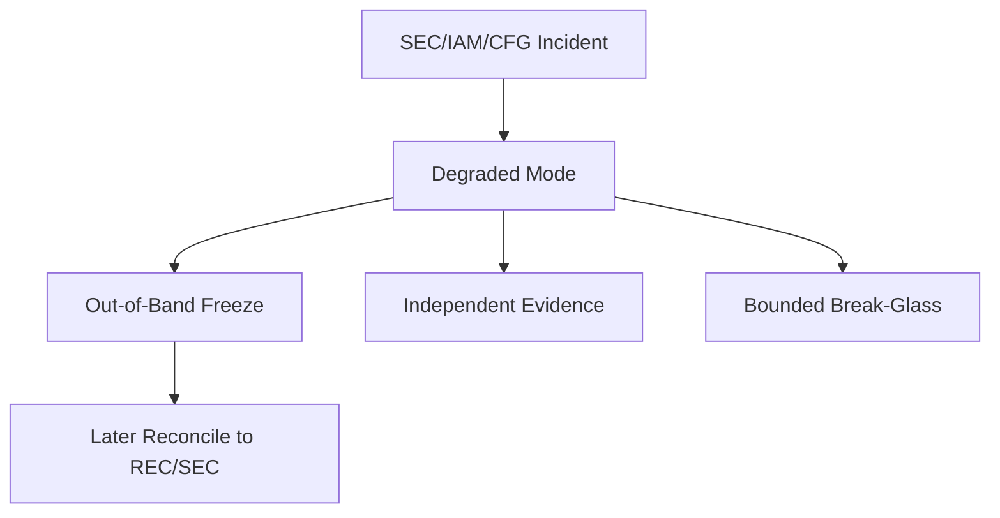
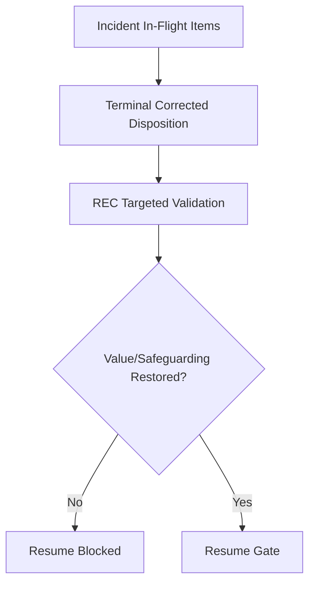

# INC-01 Incident / Freeze / Recovery
## 03 Diagrams

## 1. Incident Response Flow

## 2. Freeze Propagation

## 3. In-Flight Money Flow Stages

## 4. Resume Gate

## 5. Atomic Verified Freeze

## 6. Degraded Mode

## 7. Closed-Loop Money Recovery

