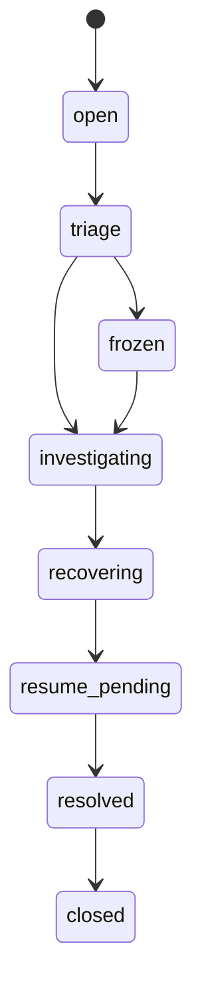
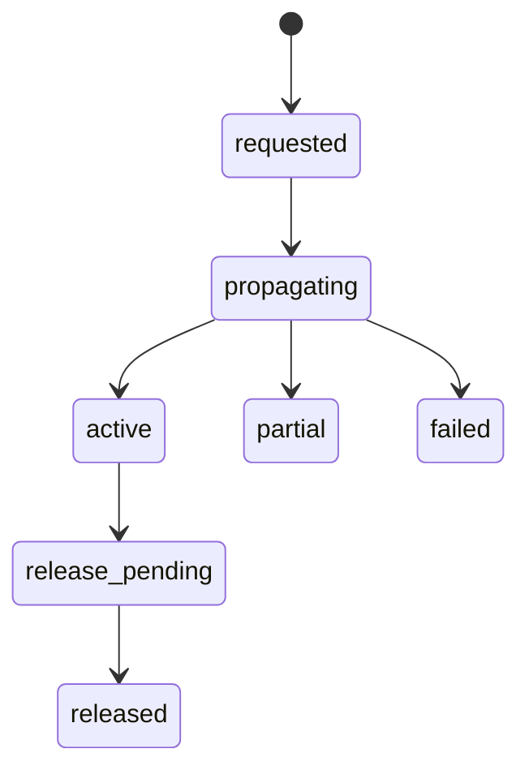
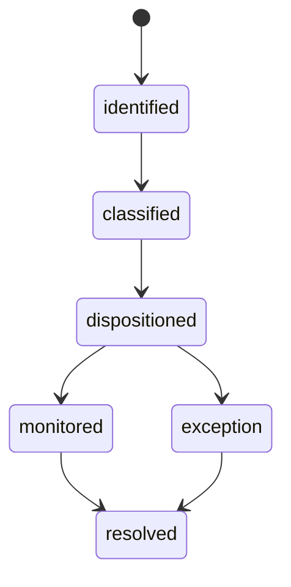
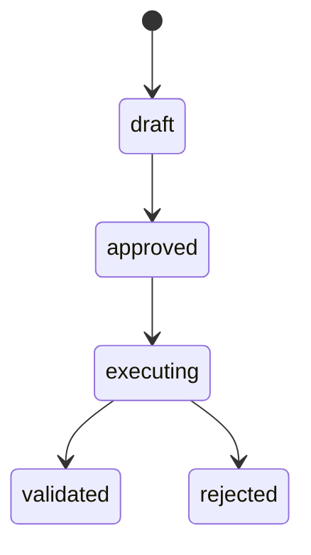
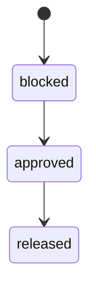
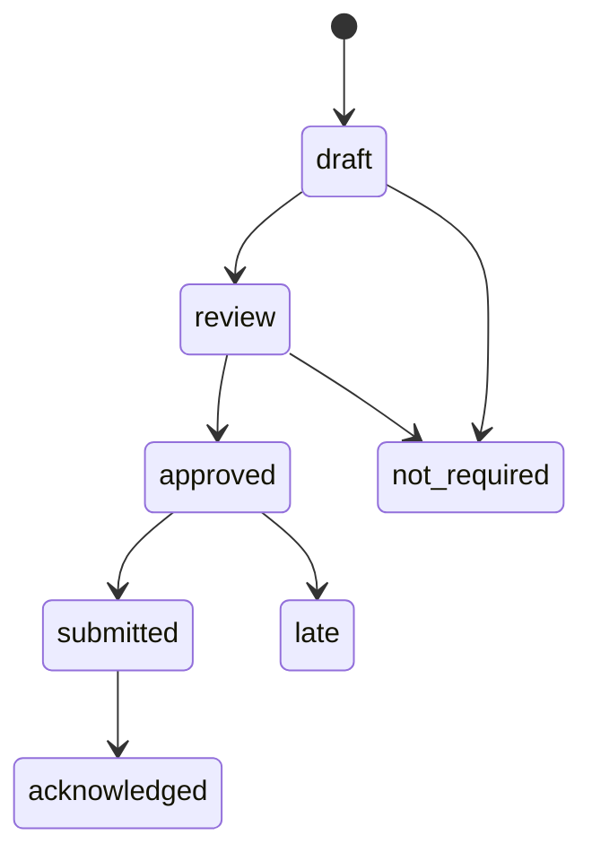
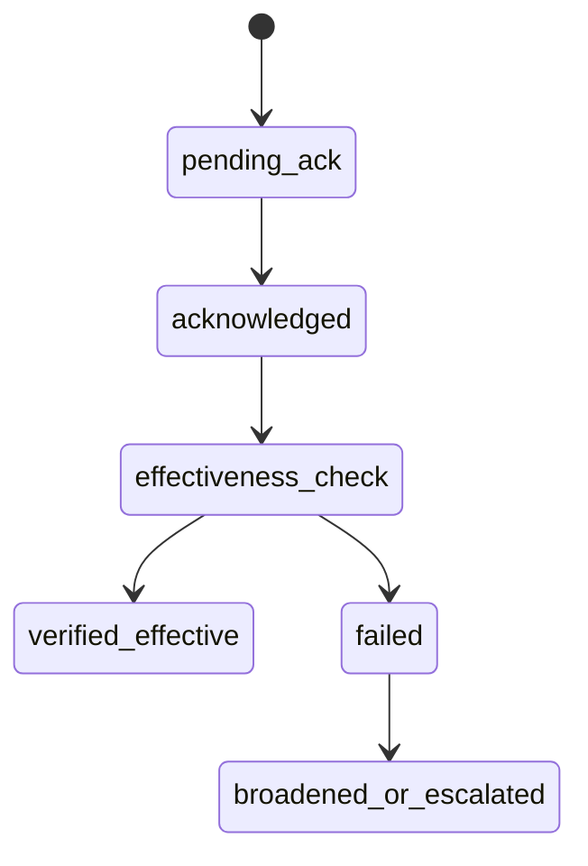
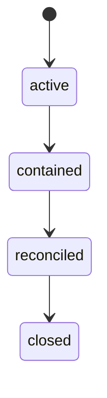
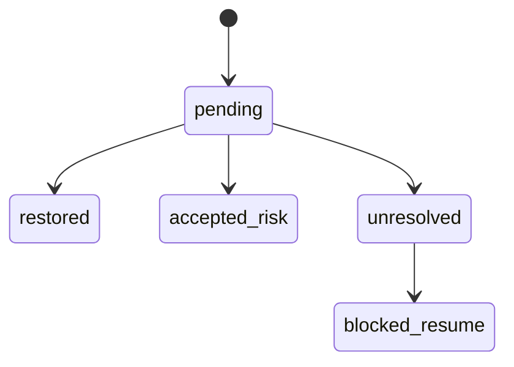
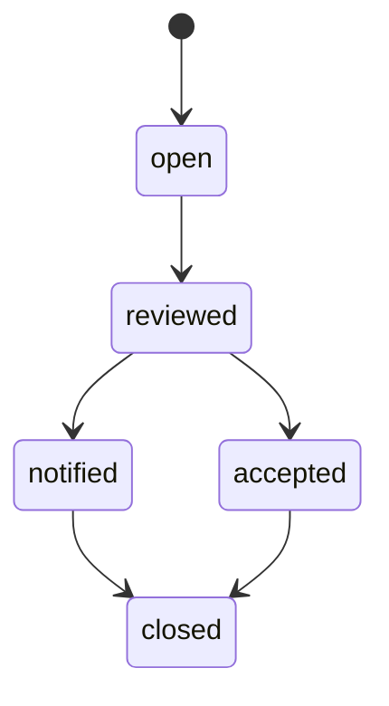

# INC-01 Incident / Freeze / Recovery
## 06 State Machine

## 1. Incident State

## 2. Freeze Order State

## 3. In-Flight Item State

## 4. Recovery Plan State

## 5. Resume Gate State

## 6. Notification Obligation State

## 7. Freeze Effectiveness State

## 8. Degraded Mode State

## 9. Money Recovery Verification State

## 10. Freeze Consequence State

