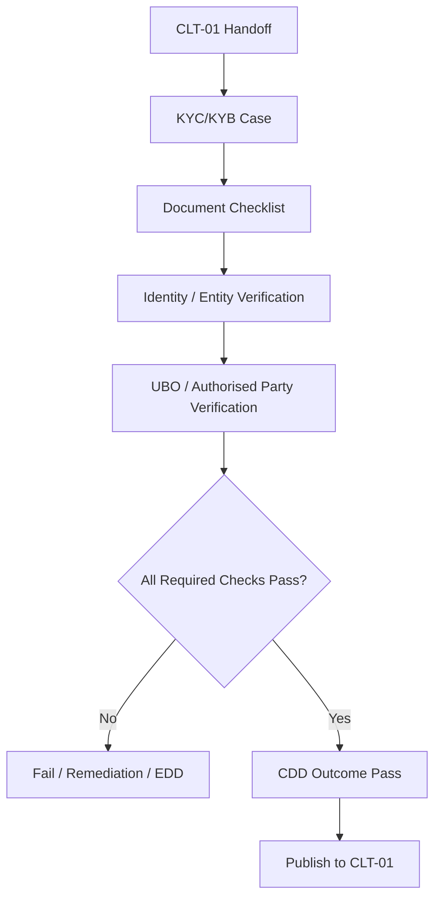
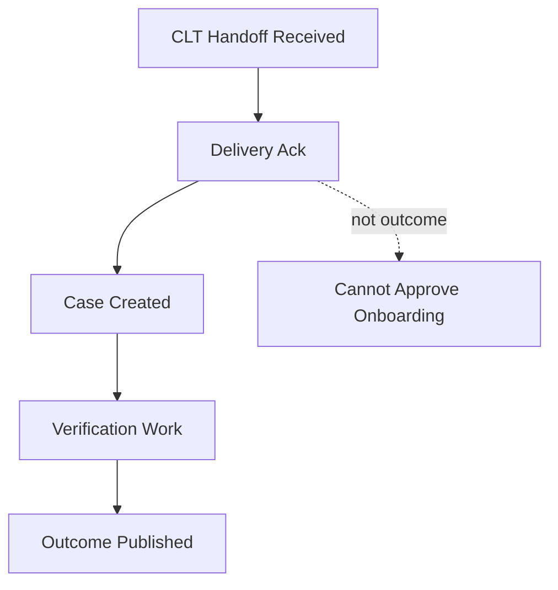
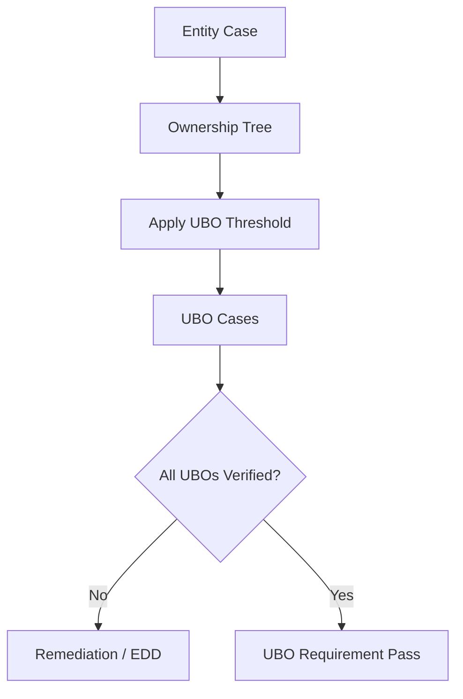
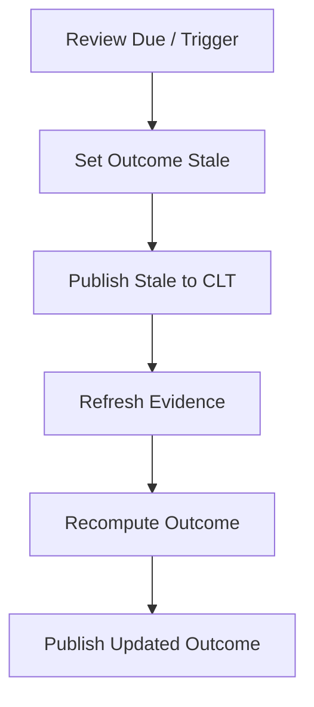
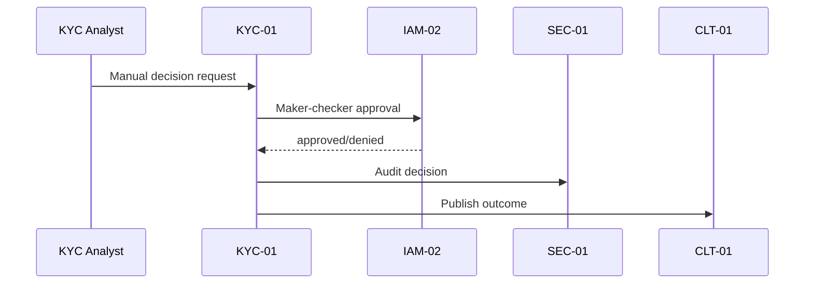
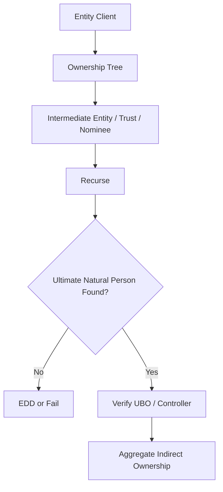
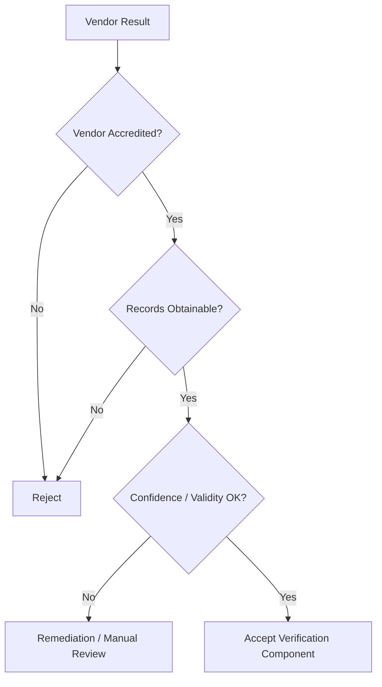
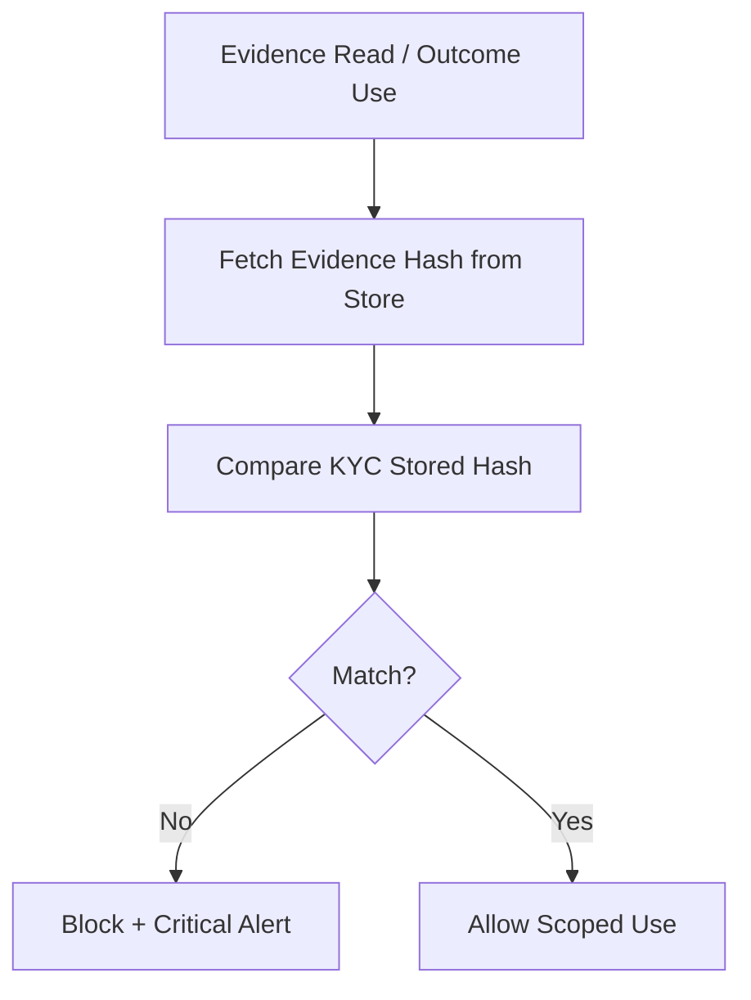
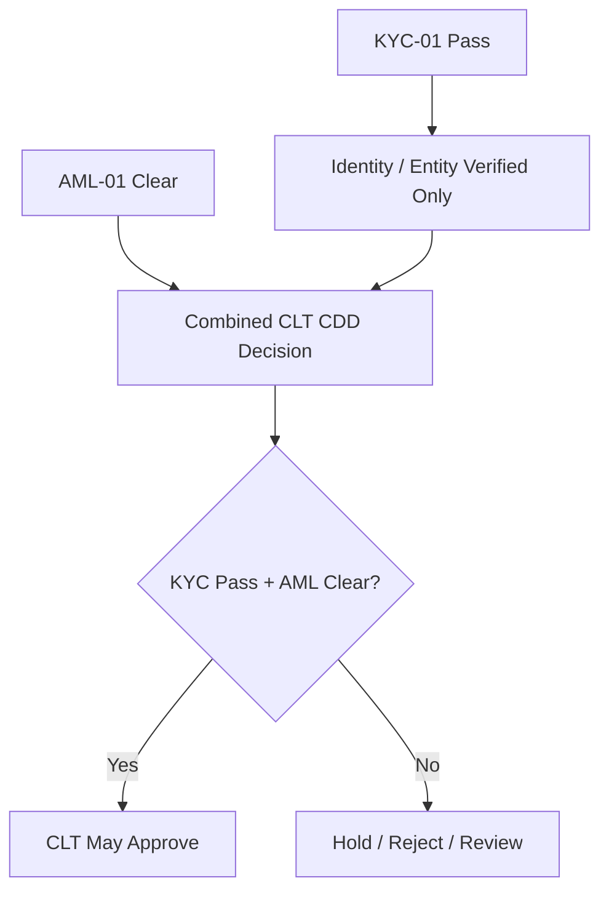

# KYC-01 KYC / KYB Verification
## 03 Diagrams

## 1. KYC/KYB Outcome Flow

---

## 2. Handoff vs Outcome

---

## 3. UBO Verification

---

## 4. Periodic Review

---

## 5. Manual Review

---

## 6. UBO Look-Through

---

## 7. Vendor Reliance

---

## 8. Evidence Store Hash Verification

---

## 9. KYC / AML Boundary

