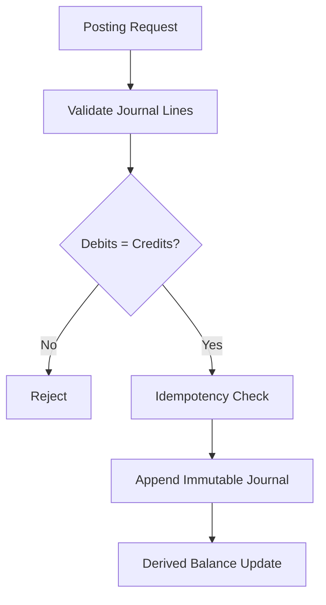
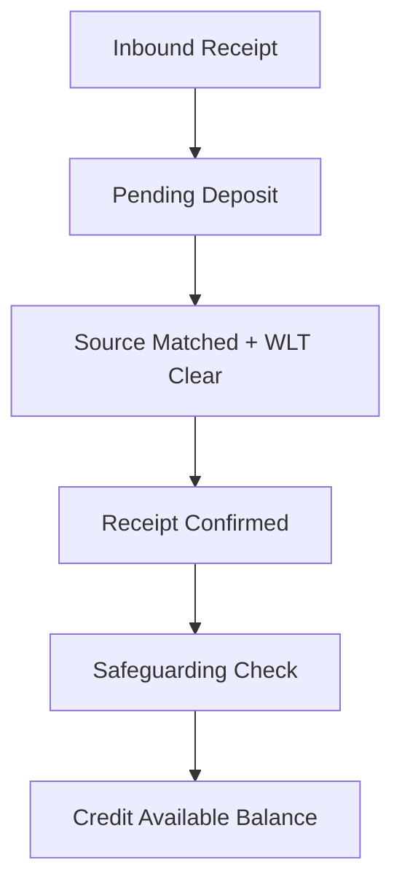
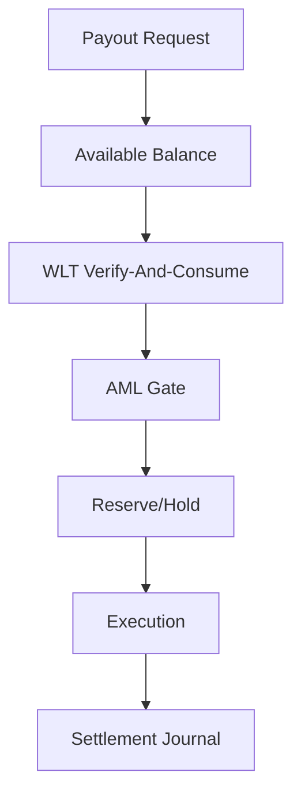
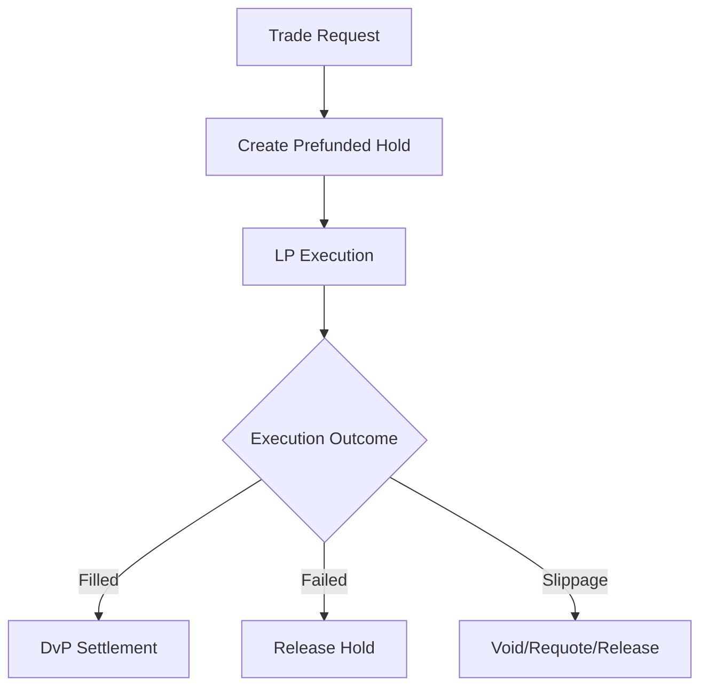
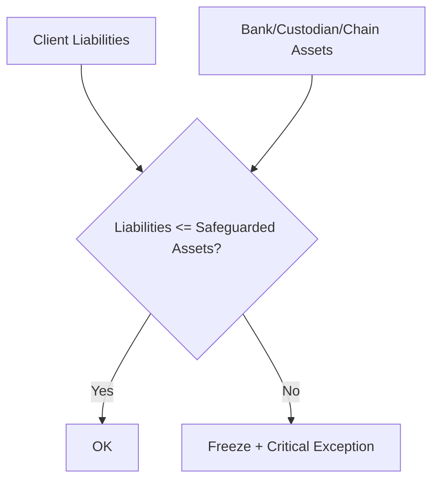
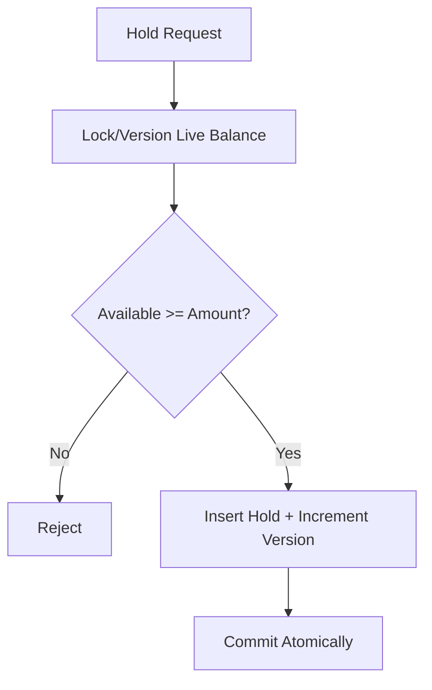
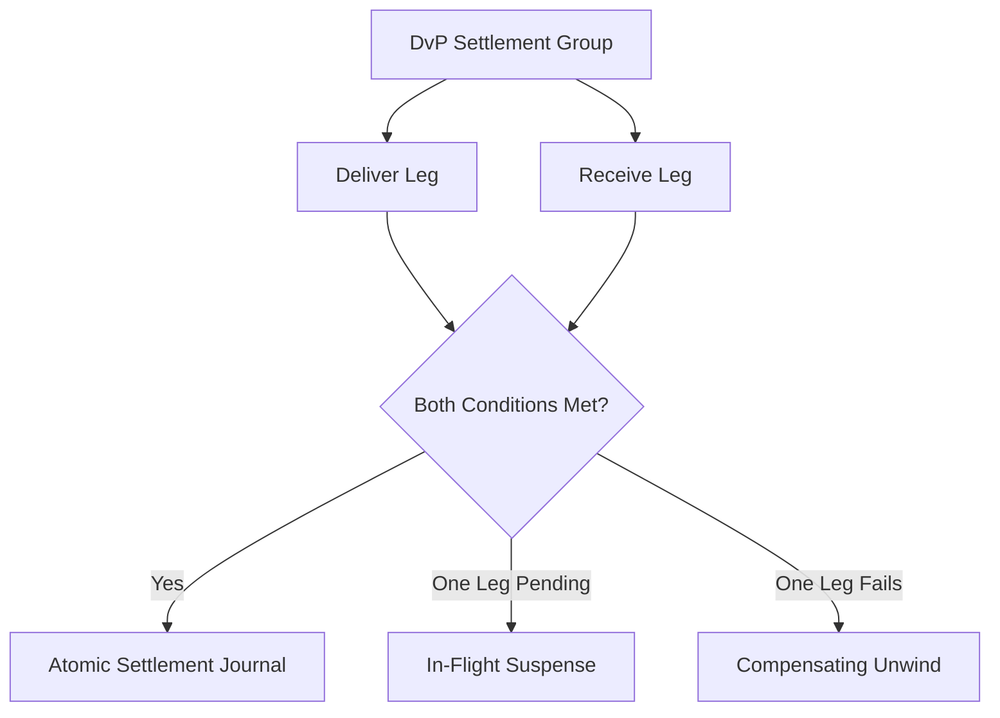
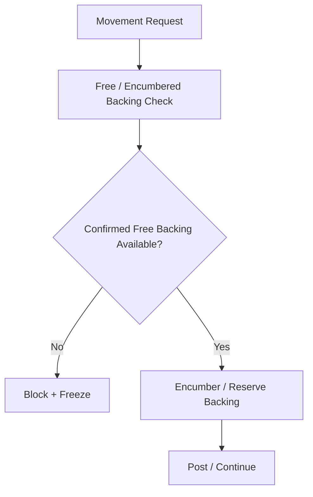
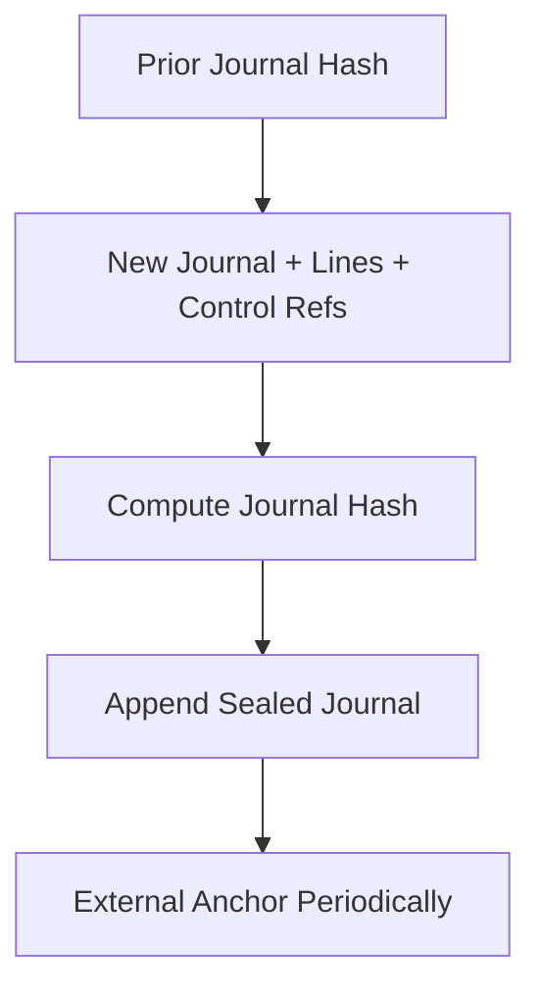
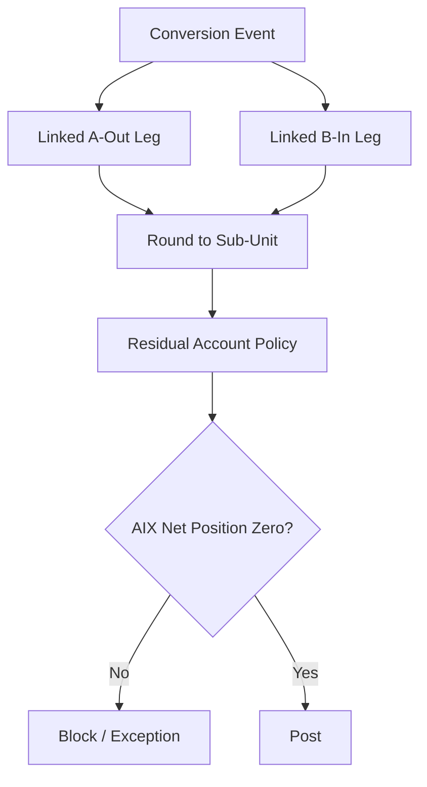

# LED-01 Ledger / Settlement / Safeguarding
## 03 Diagrams

## 1. Double-Entry Posting

---

## 2. Deposit Credit

---

## 3. Withdrawal / Payout

---

## 4. Prefunded Hold / LP Execution

---

## 5. Safeguarding Invariant

---

## 6. Atomic Reservation

---

## 7. Two-Leg DvP

---

## 8. Preventive Safeguarding

---

## 9. Journal Hash Chain

---

## 10. Conversion Residual

