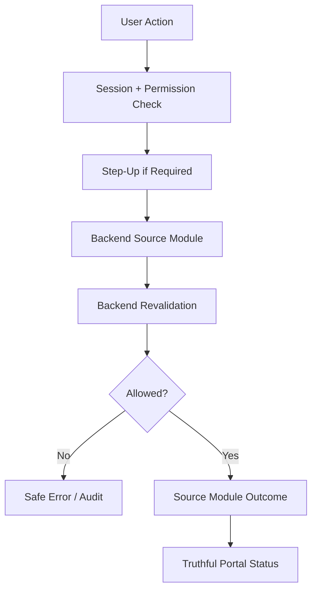
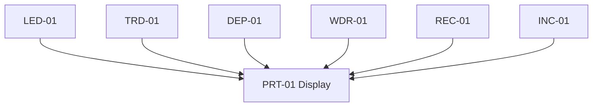
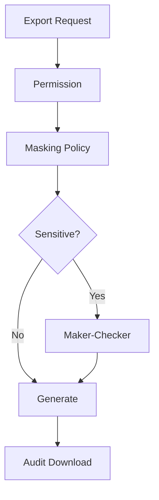
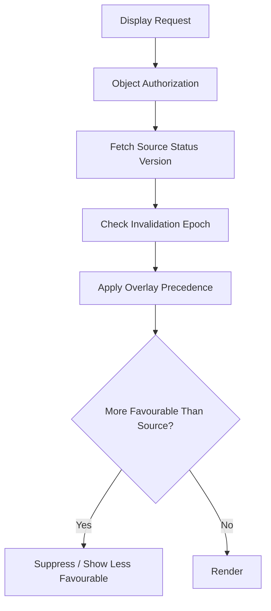
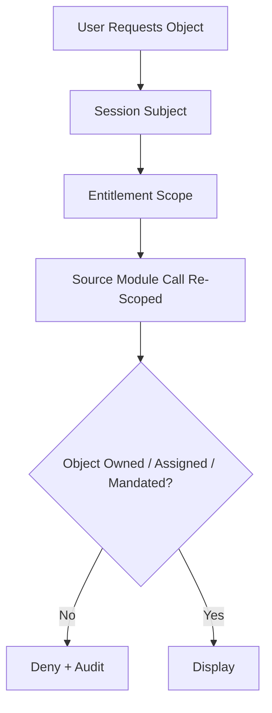
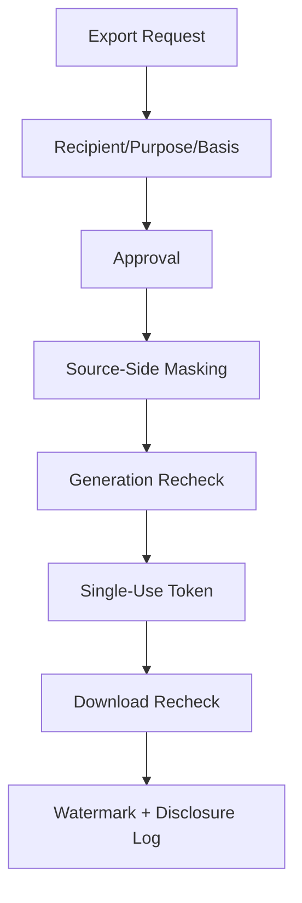

# PRT-01 Client / Staff / Admin Portal Workflows
## 03 Diagrams

## 1. Portal Action Control

## 2. Status Truth

## 3. Export Control

## 4. Display Non-Regression

## 5. Object-Level Authorization

## 6. Export Egress Hardening

