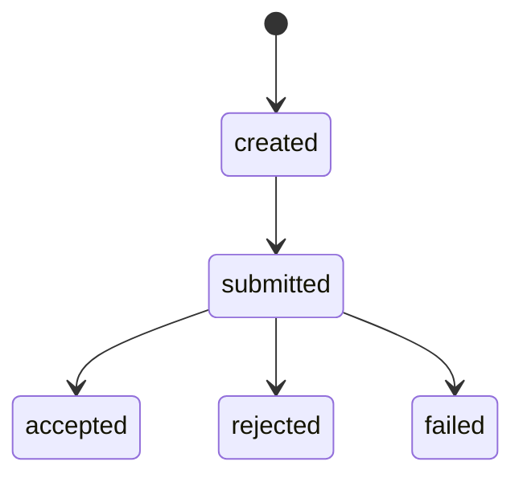
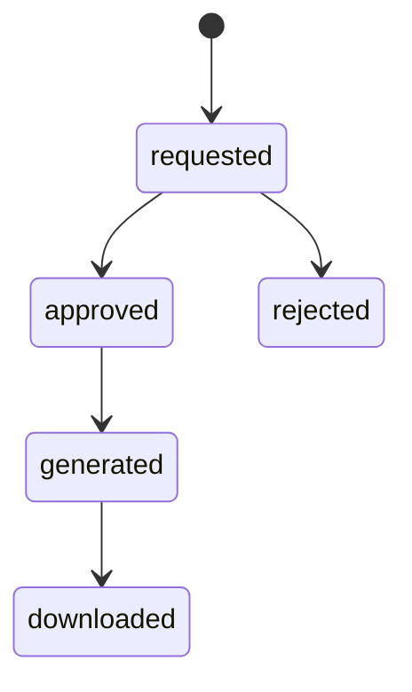
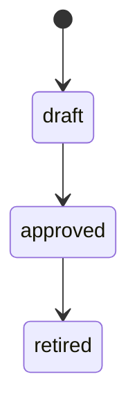
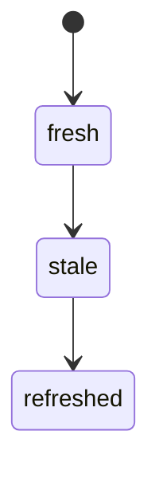
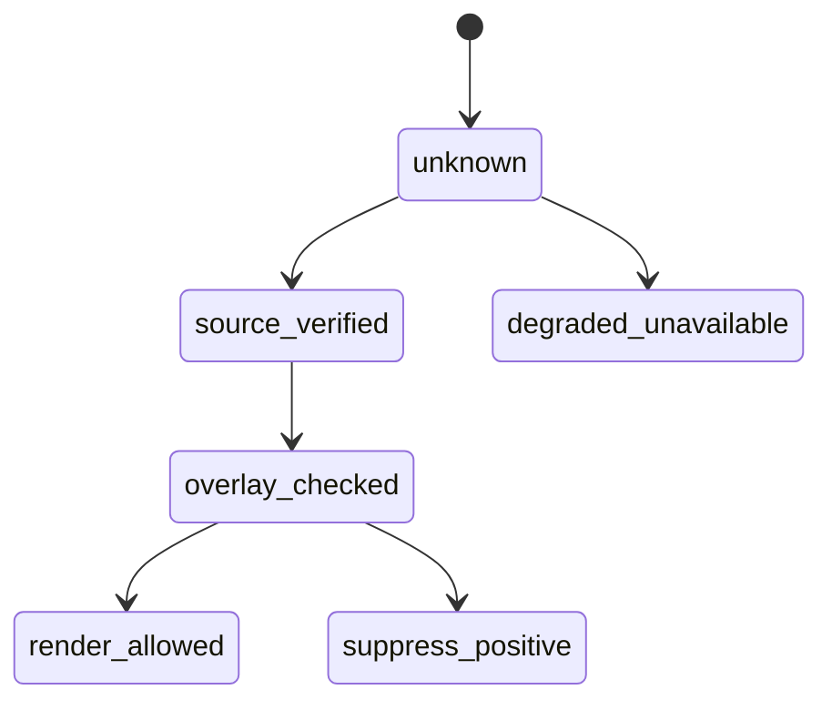
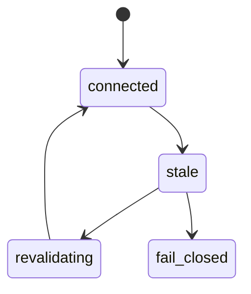
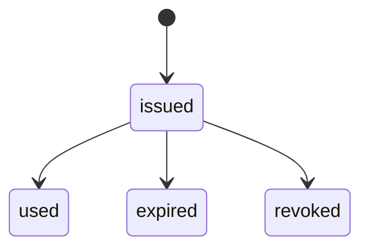
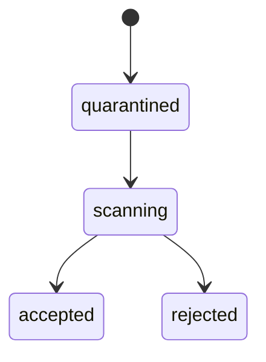
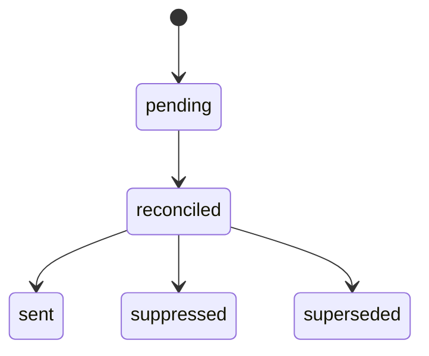

# PRT-01 Client / Staff / Admin Portal Workflows
## 06 State Machine

## 1. Portal Action State

## 2. Export State

## 3. Message Template State

## 4. Display Status State

## 5. Display Truth State

## 6. Invalidation Subscription State

## 7. Download Token State

## 8. Upload Intake State

## 9. Notification State

