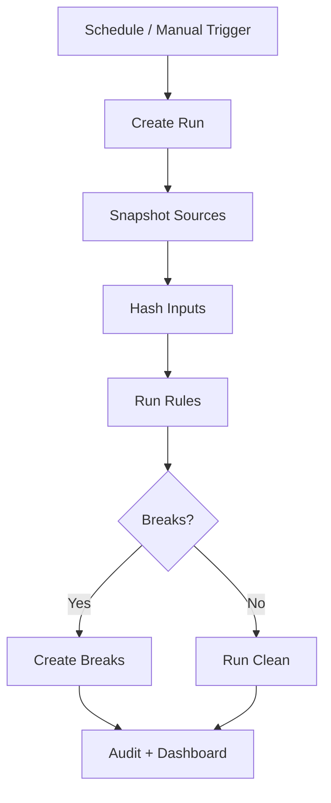
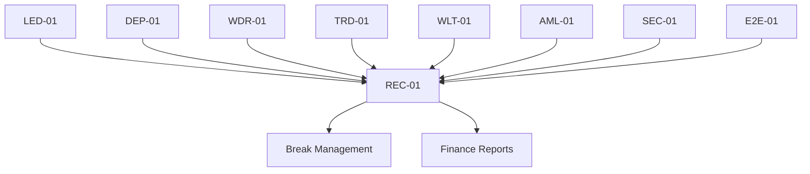
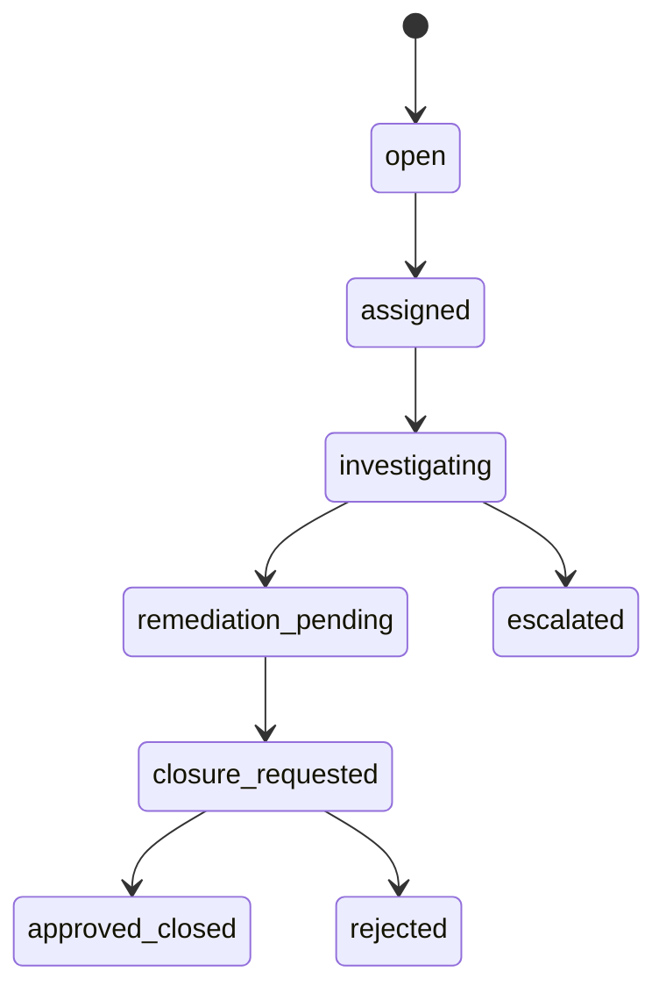
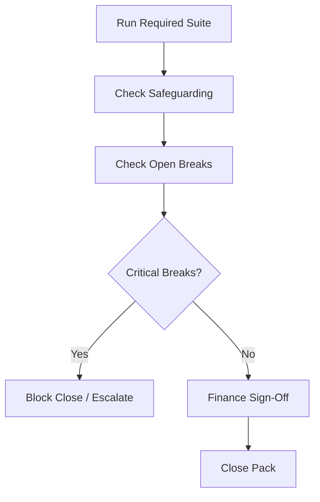
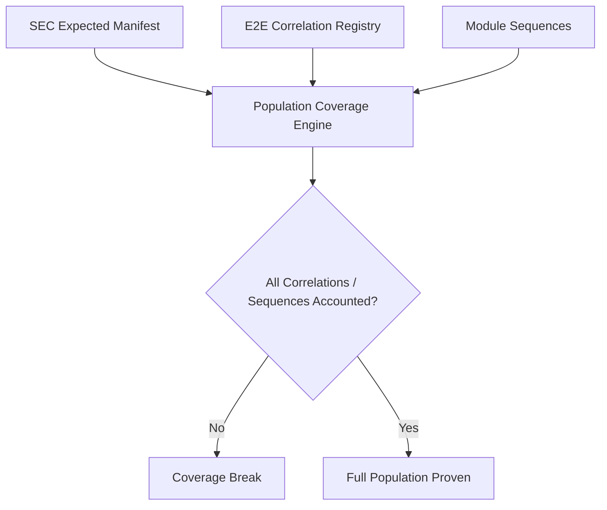
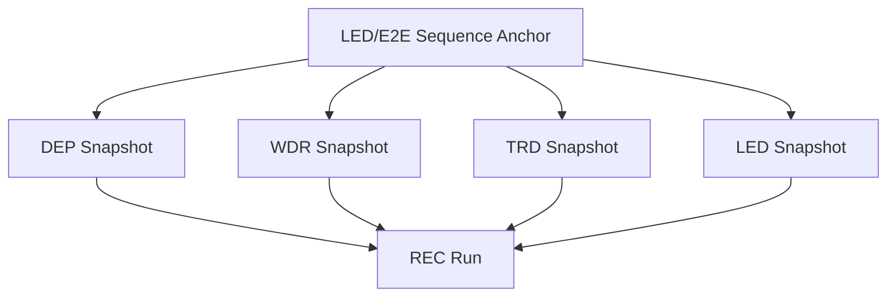
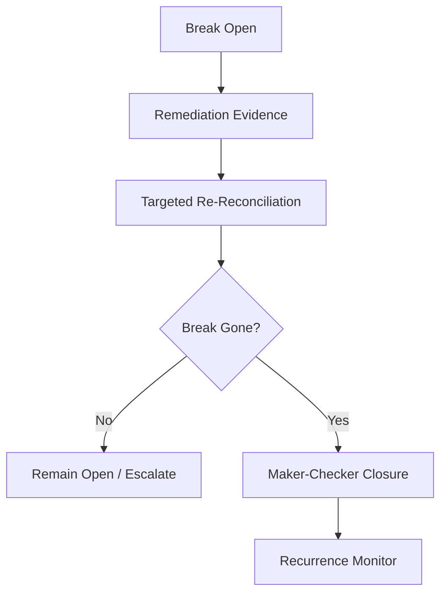

# REC-01 Reconciliation / Finance Reporting
## 03 Diagrams

## 1. Reconciliation Orchestration

## 2. Cross-Module Reconciliation Map

## 3. Break Lifecycle

## 4. Daily Close

## 5. Population Coverage Proof

## 6. Consistent As-Of Snapshot

## 7. Closed-Loop Break Remediation

