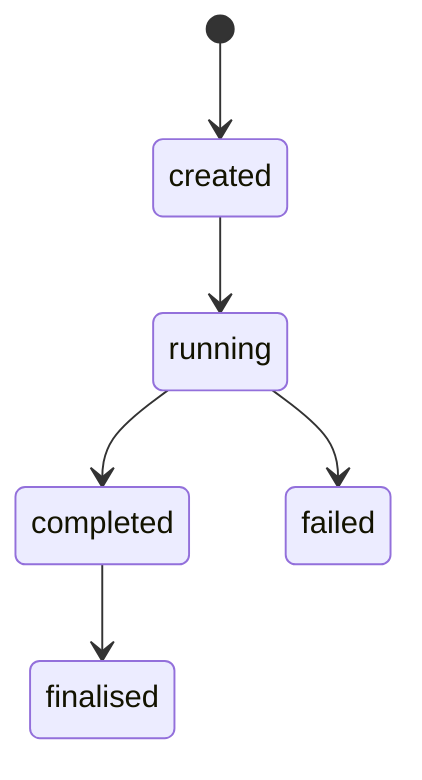
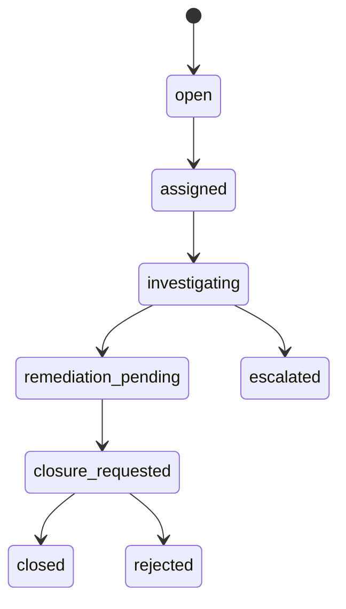
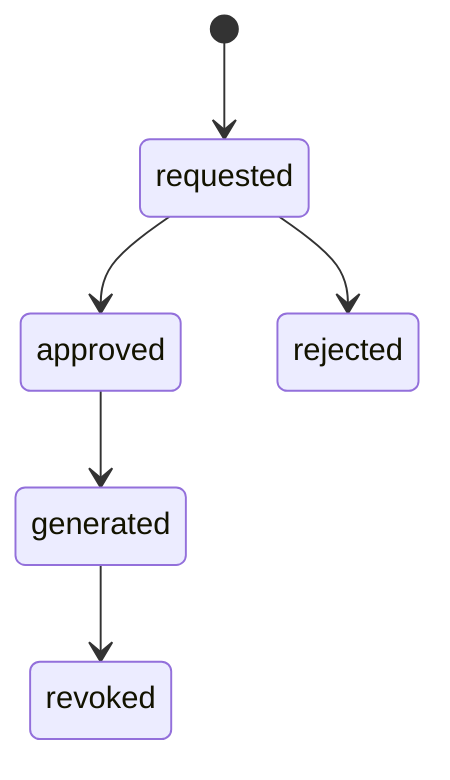
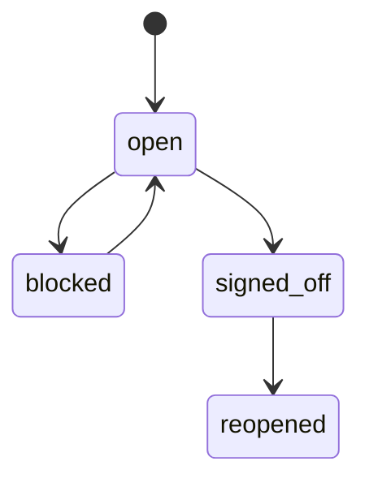
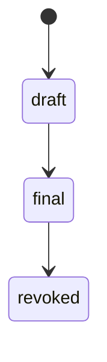
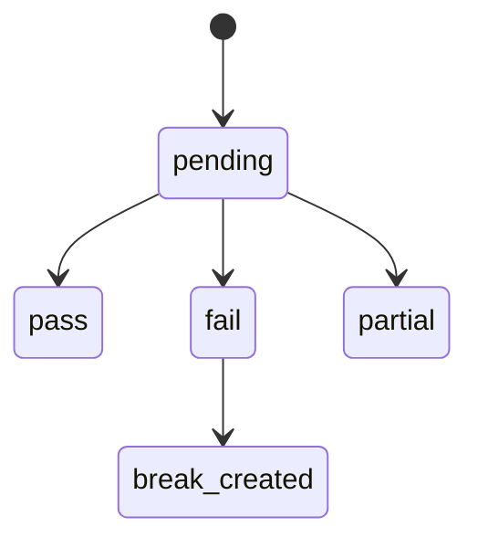
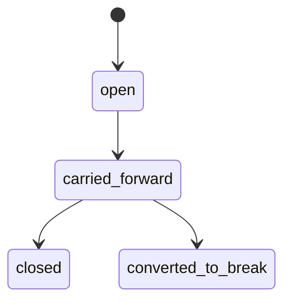
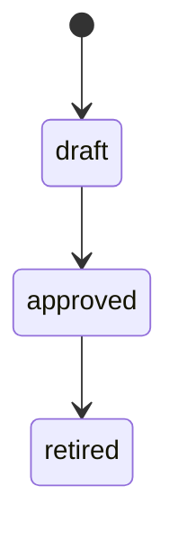
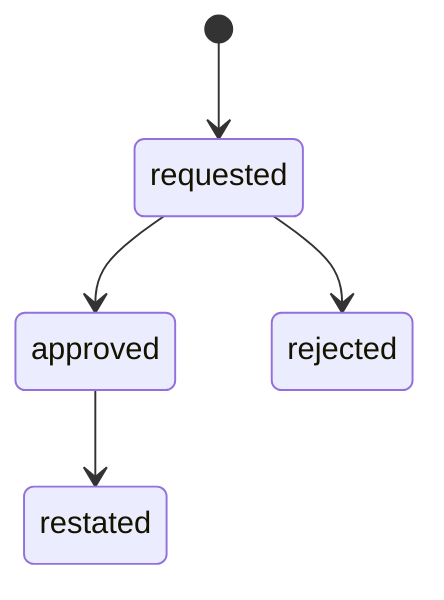
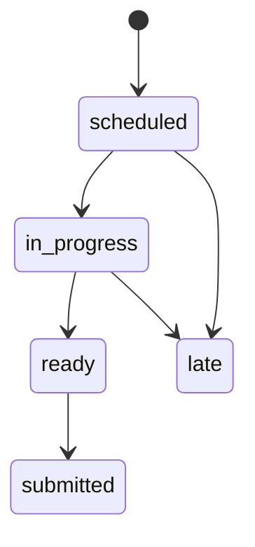

# REC-01 Reconciliation / Finance Reporting
## 06 State Machine

## 1. Reconciliation Run State

## 2. Break State

## 3. Evidence Pack State

## 4. Daily Close State

## 5. Report State

## 6. Population Coverage State

## 7. In-Flight Reconciling Item State

## 8. Policy Version State

## 9. Report Restatement State

## 10. Regulatory Obligation State

