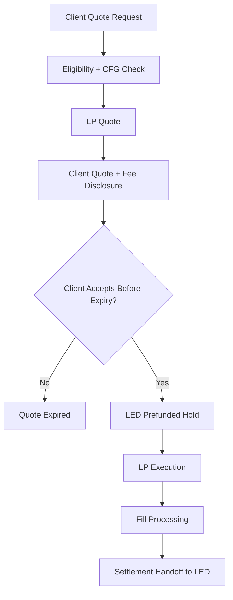
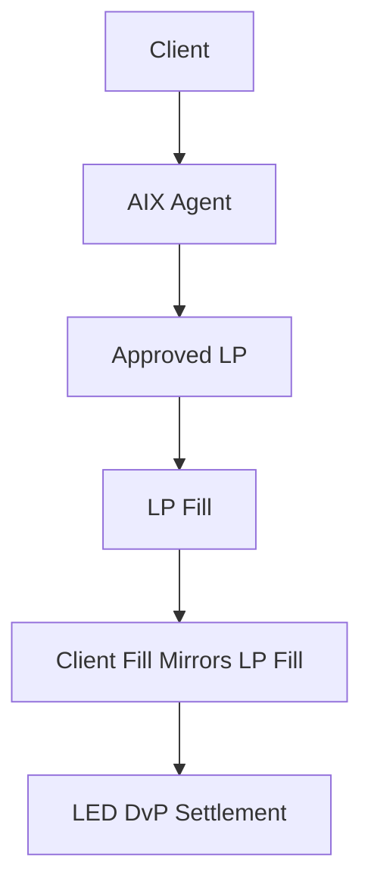
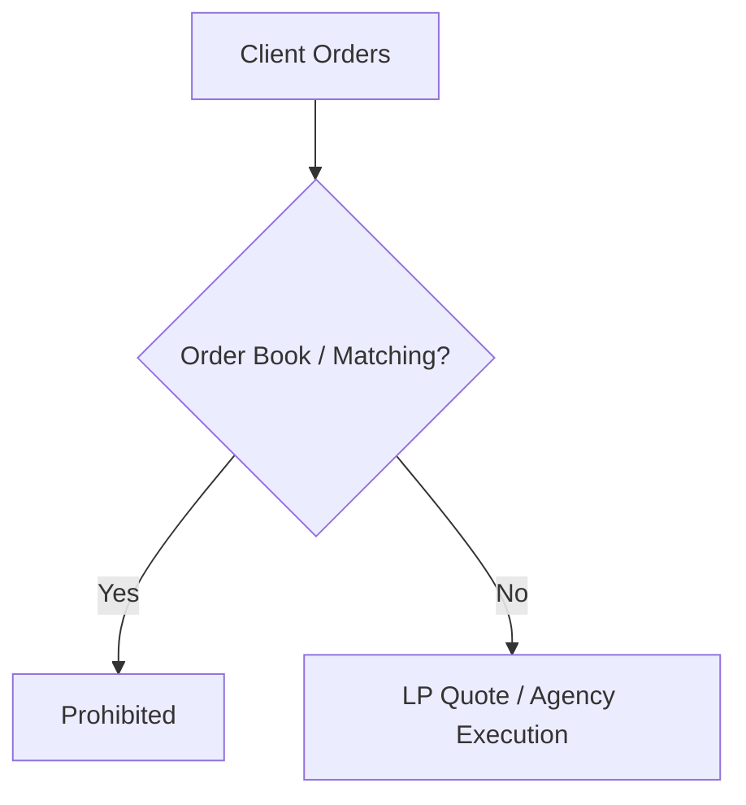
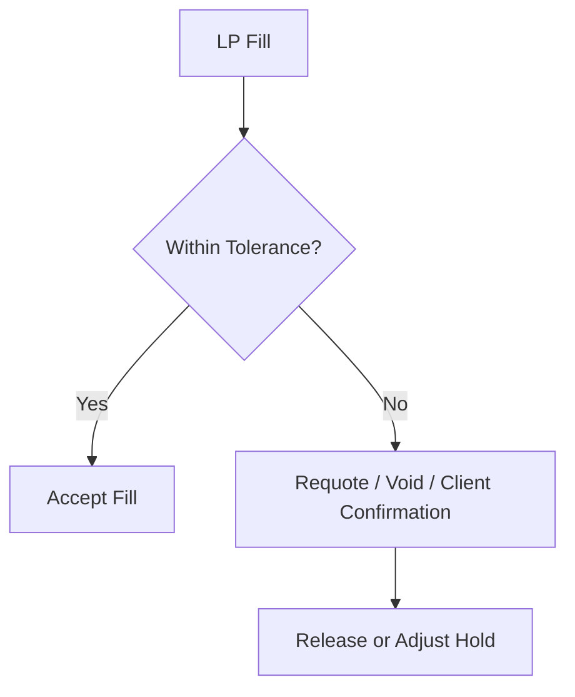
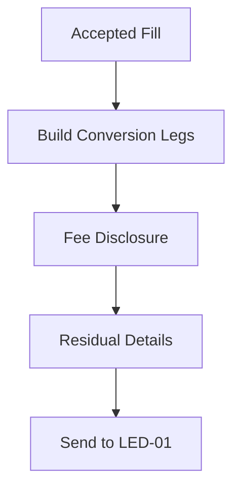
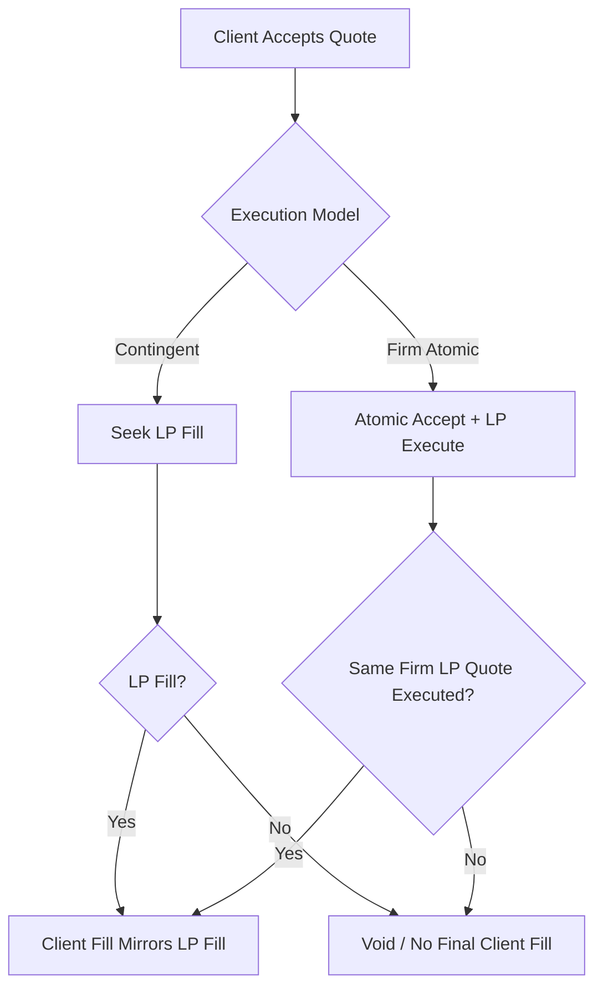
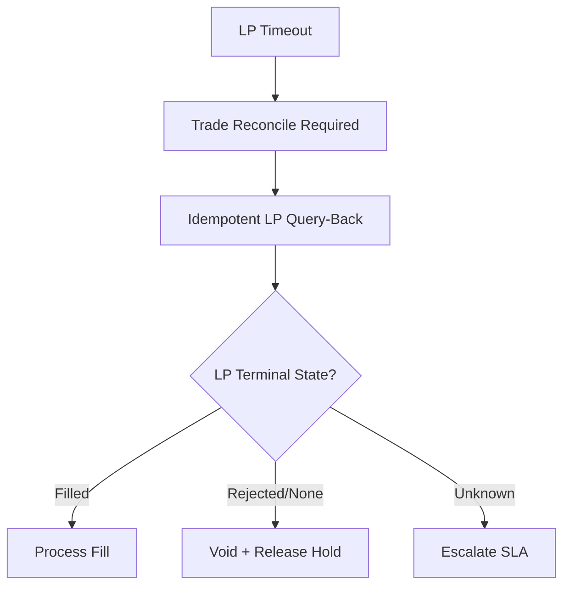
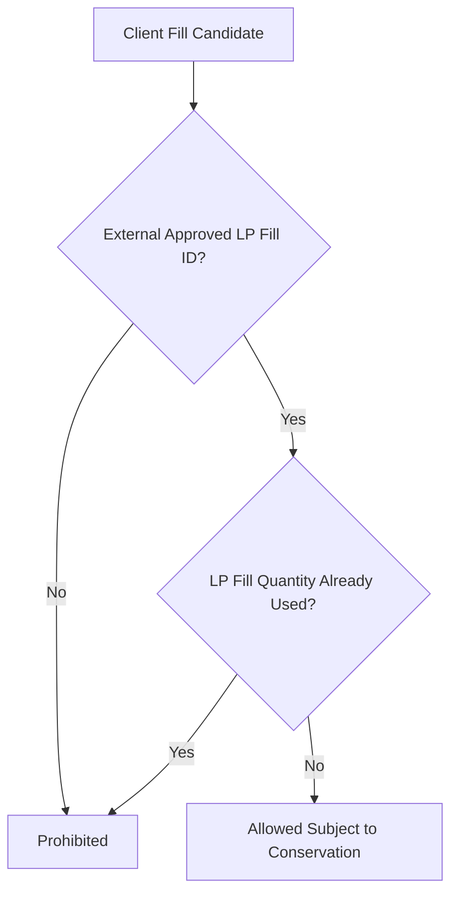

# TRD-01 Quote / Trade / LP Execution
## 03 Diagrams

## 1. Quote and Execution Flow



---

## 2. Agency / Back-to-Back



---

## 3. Prohibited Exchange Features



---

## 4. Slippage Handling



---

## 5. Settlement Handoff



---

## 6. Agency Execution Window



---

## 7. Fill Conservation

```mermaid
flowchart TD
  A[External LP Fill(s)] --> B[Quantity Sum / VWAP]
  B --> C{Client Fill Conserved?}
  C -->|No| D[Block]
  C -->|Yes| E[Create Client Fill]
  E --> F[LED Settlement Handoff]
```

---

## 8. LP Timeout Resolution



---

## 9. No Internalisation


