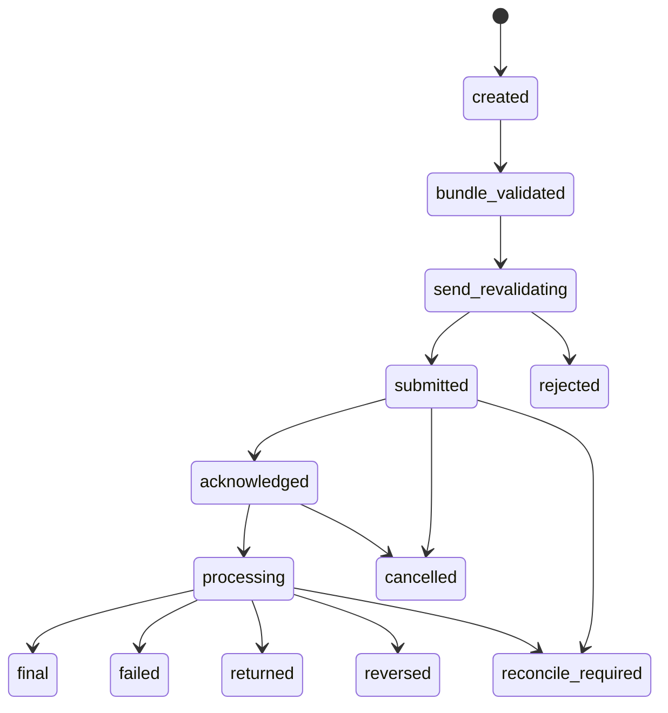
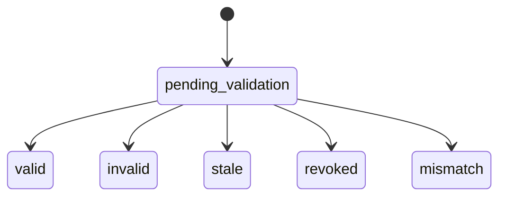
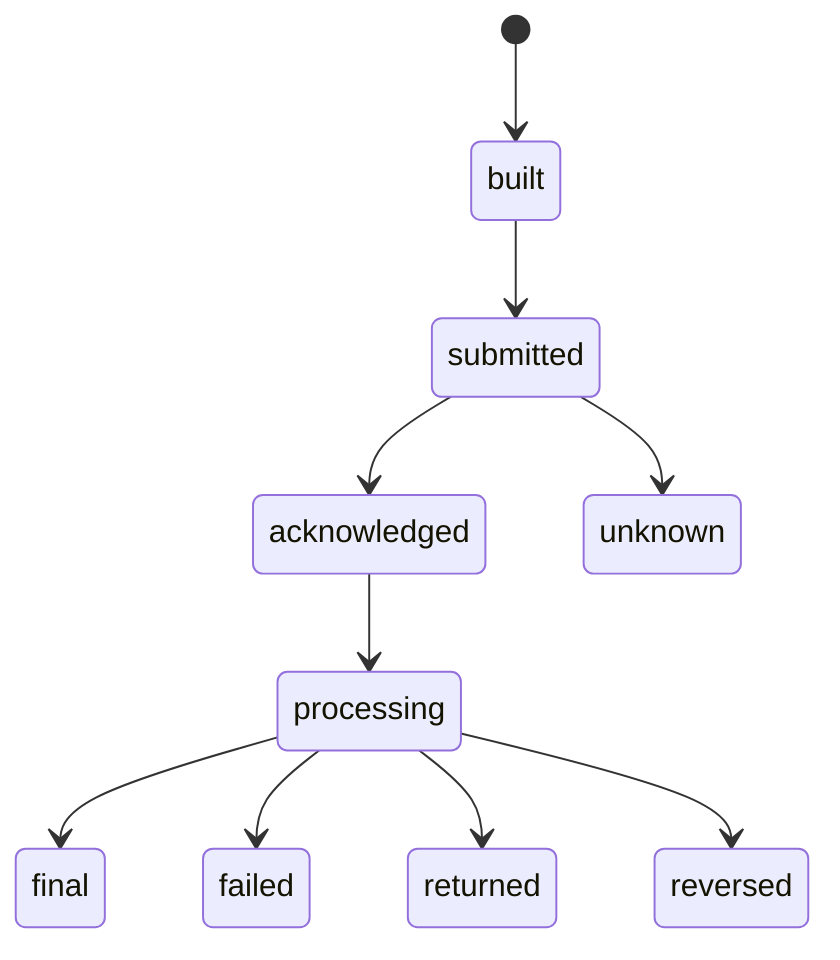
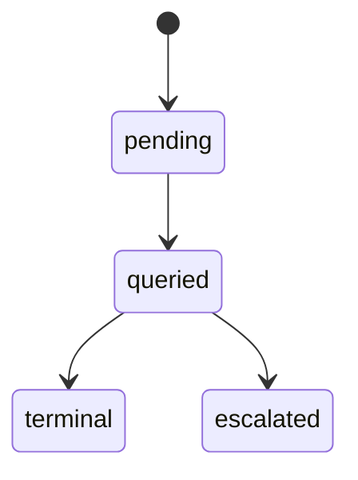
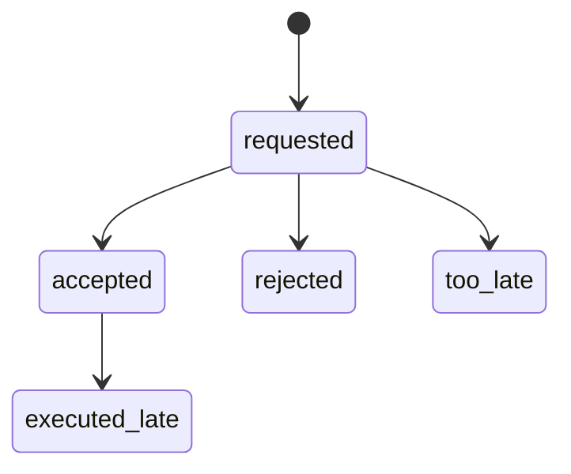
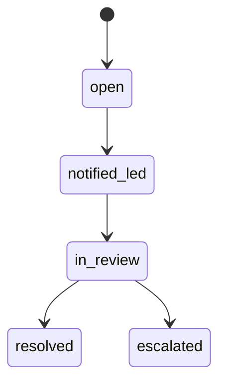
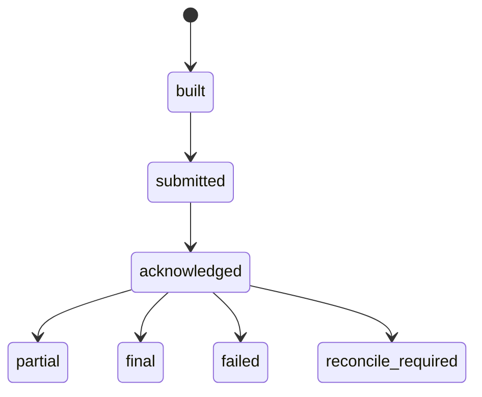
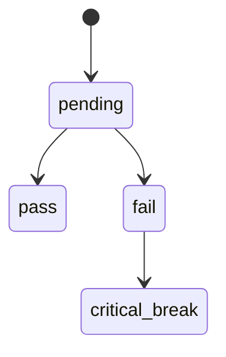
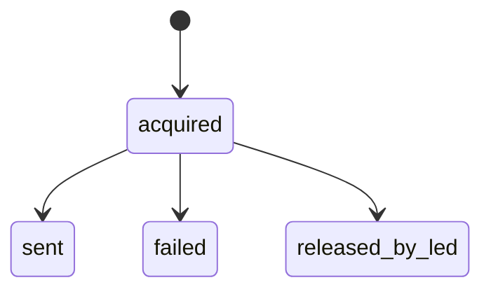

# WDR-01 Withdrawal / Payout Execution Rail
## 06 State Machine

## 1. Payout Execution State

## 2. Decision Bundle State

## 3. Provider Instruction State

## 4. Query-Back State

## 5. Cancellation State

## 6. Return / Reversal Case State

## 7. Batch State

## 8. Value Conservation State

## 9. Reserve Send Lock State

