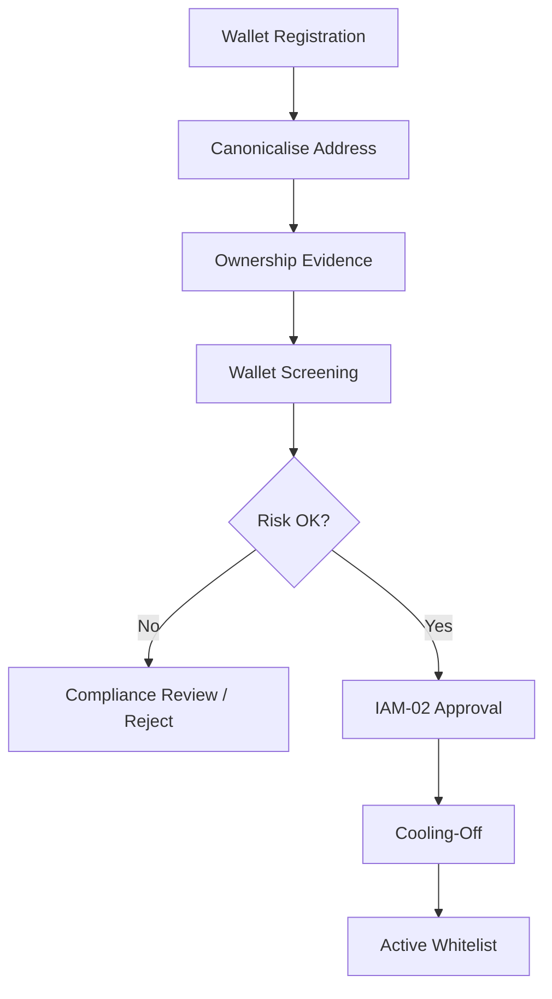
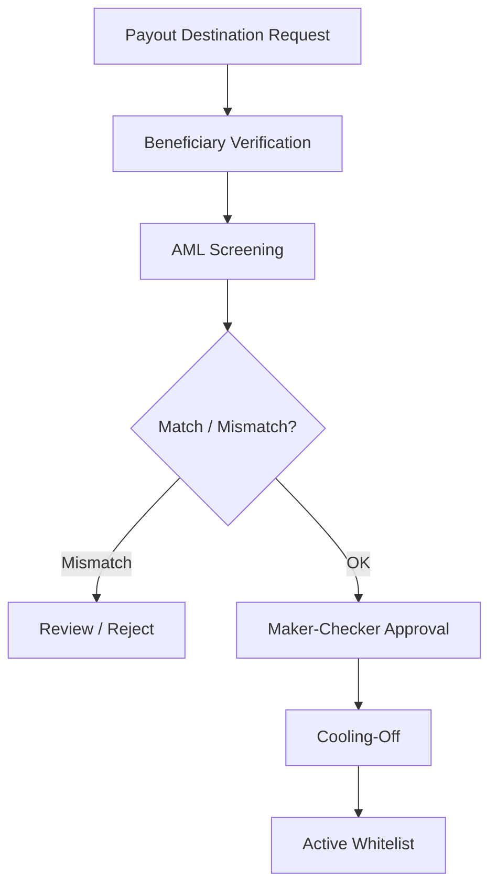
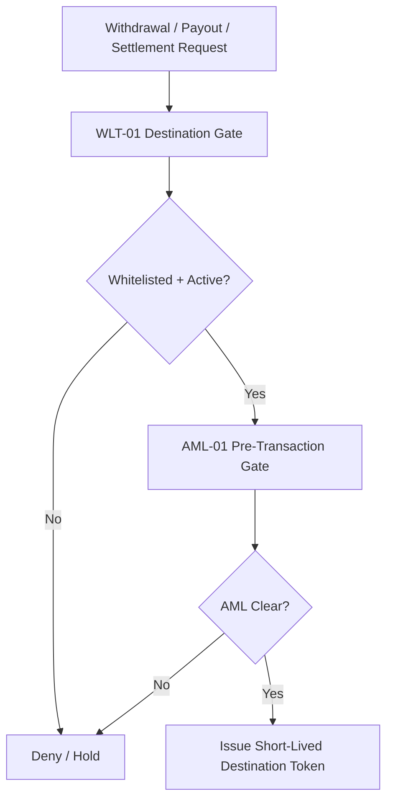
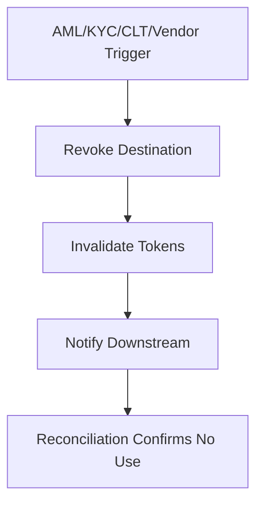
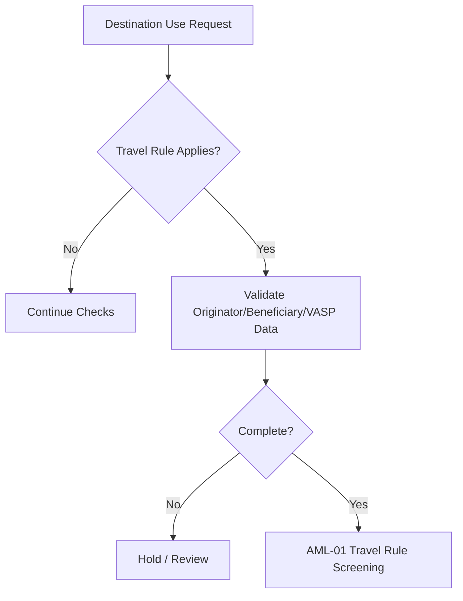
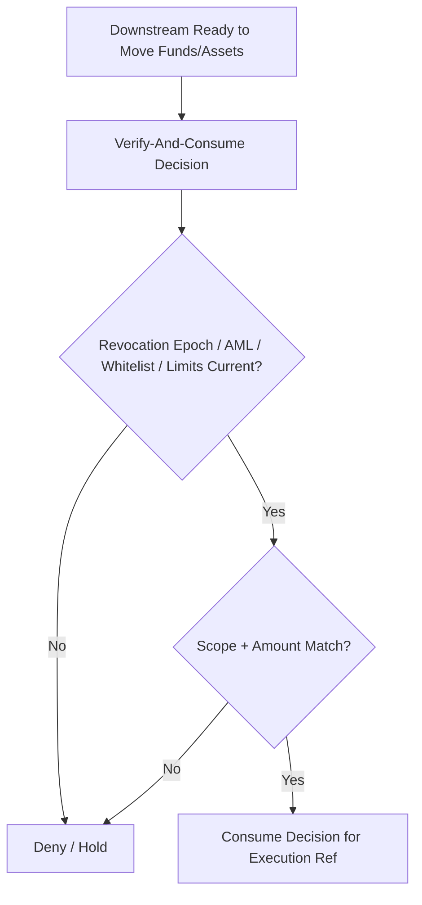
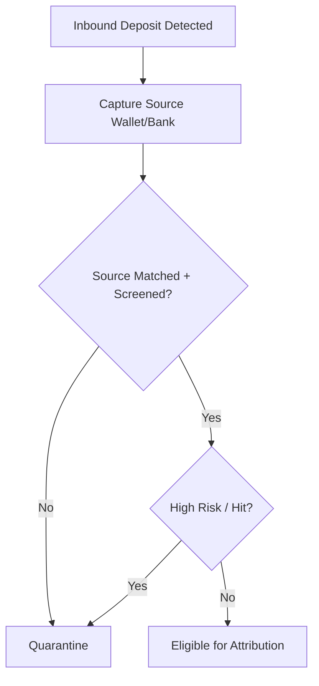
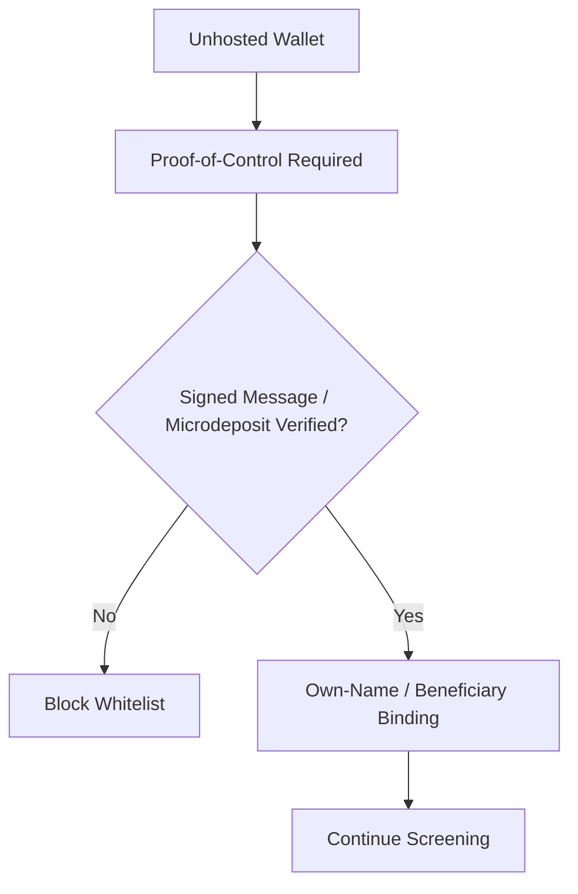
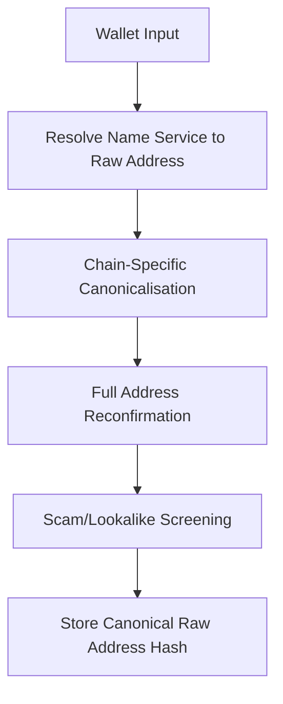

# WLT-01 Wallet Screening / Payout Destination Whitelist
## 03 Diagrams

## 1. Wallet Whitelist Flow

---

## 2. Fiat Payout Destination Flow

---

## 3. Destination Use Gate

---

## 4. Revocation Propagation

---

## 5. Travel Rule Support

---

## 6. Execution-Time Revalidation

---

## 7. Inbound Deposit Source Screening

---

## 8. Unhosted Wallet Proof-of-Control

---

## 9. Address Integrity

