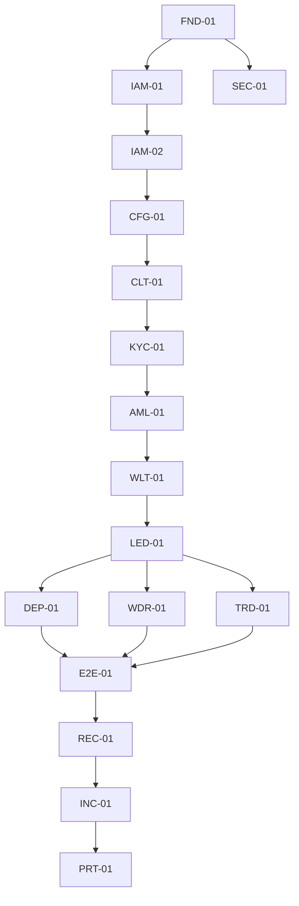

# IMP-01 AIX Master Implementation Handover
## 02 Build Order And Dependency Map

## 1. Recommended Build Order

```txt
Phase A — Foundation / Control Plane
1. FND-01 Platform Foundation
2. IAM-01 Authentication / MFA / Session
3. IAM-02 RBAC / Permission Guard / SoD
4. SEC-01 Audit Log / Security Monitoring
5. CFG-01 Feature Flag / Licence Lock

Phase B — Client / Compliance Tier
6. CLT-01 Client Onboarding / Client Profile
7. KYC-01 KYC / KYB Verification
8. AML-01 Sanctions / PEP / Adverse Media / Travel Rule
9. WLT-01 Wallet Screening / Payout Destination Whitelist

Phase C — Money Tier
10. LED-01 Ledger / Settlement / Safeguarding
11. DEP-01 Deposit Execution / Inbound Receipt
12. WDR-01 Withdrawal / Payout Execution Rail
13. TRD-01 Quote / Trade / LP Execution

Phase D — Assurance / Resilience / Portal
14. E2E-01 Cross-Module End-To-End Fund-Flow
15. REC-01 Reconciliation / Finance Reporting
16. INC-01 Incident / Freeze / Recovery
17. PRT-01 Client / Staff / Admin Portal Workflows

Phase E — Integrated Testing / Go-Live
18. E2E QA
19. Security and compliance testing
20. UAT
21. Dry-run reconciliation
22. Controlled pilot
23. Go-live
```

## 2. Dependency Map



## 3. Hard Dependency Rules

1. IAM-02 must exist before any sensitive workflow.
2. SEC-01 must exist before production-like testing.
3. CFG-01 licence lock must exist before any feature exposure.
4. LED-01 must exist before deposits, withdrawals or trades.
5. DEP/WDR/TRD must not post ledger directly outside LED.
6. REC must not post ledger or mutate source data.
7. INC must not release freeze without resume gate.
8. PRT must not bypass backend controls.
