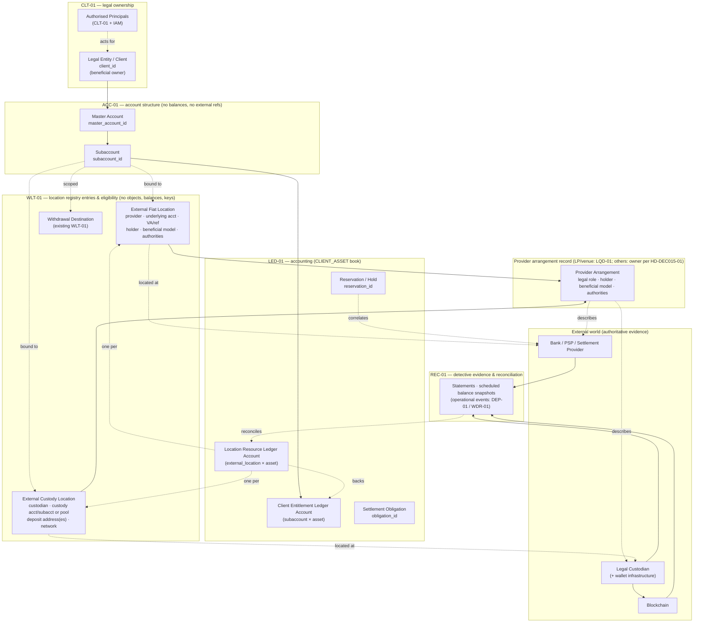
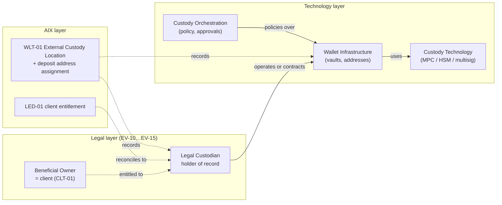
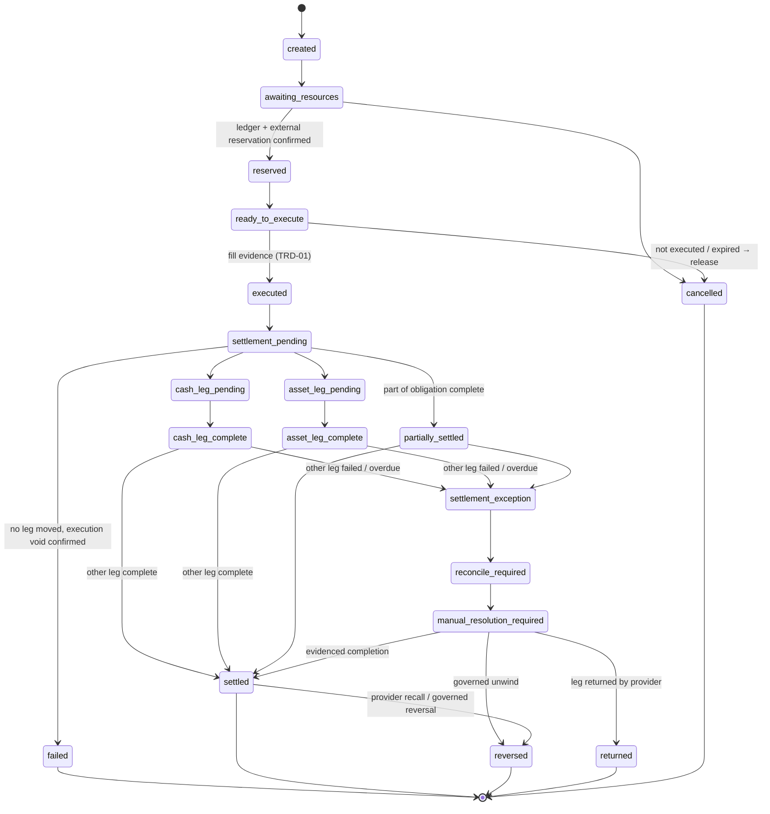
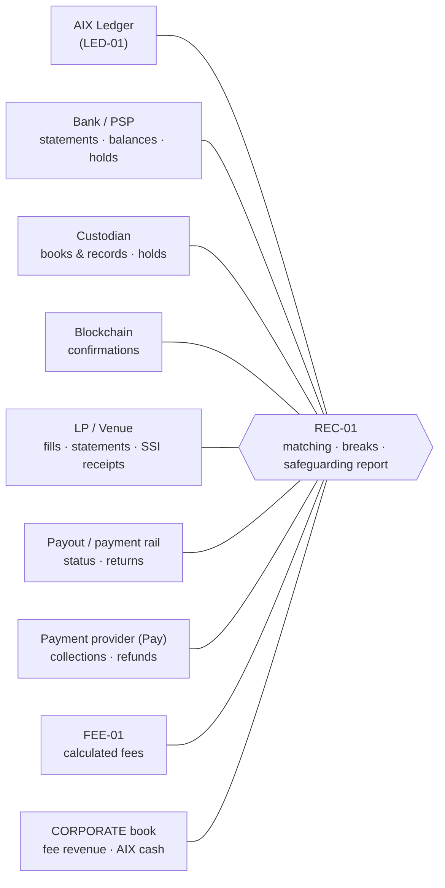

# AIX Client Asset, Fiat Banking, Virtual Account, Custody & Settlement Architecture
# DEC-015 — Architecture Draft v0.1

> ## PROPOSED — AWAITING INDEPENDENT REVIEW AND HUMAN ACCEPTANCE
>
> This document drafts **DEC-015**. It is **not** in `DECISION_LOG.md` and binds nothing until a
> human accepts it. It changes **no** master, **no** module blueprint, **no** code, **no**
> migration, **no** test, **no** seeded identifier, **no** sealed hash and **no** runtime guard.
>
> It **does not**: enable any capability; activate any money movement; select, approve or
> contract any bank, PSP, settlement provider, custodian, wallet-infrastructure vendor, LP or OTC
> counterparty; claim any provider capability; state any legal conclusion; claim any regulatory
> approval; modify, merge or advance `ACC-01` or `AST-01`; set any task to `PLAN_READY`; or
> authorise any implementation.
>
> Where an answer depends on an external legal, contractual or provider fact, this document
> records the fact as an **external validation item** (§41) and, where the answer would change
> ownership, accounting or custody, preserves the alternatives behind an abstraction.

---

## 1. Document Control

| Field | Value |
|---|---|
| Decision drafted | **DEC-015** — next free number confirmed from `docs/DECISION_LOG.md` (last entry `DEC-014`, line 1235) |
| Document ID | `STR-04` (next free strategy ID; `STR-01`…`STR-03` exist in `DOCUMENT_REGISTER.md` §4d) |
| Status | DRAFT — PROPOSED / AWAITING INDEPENDENT REVIEW AND HUMAN ACCEPTANCE |
| Writable baseline | `main` @ `43f2f34a1640dde2934c591342abfc7b14e0082c` (= `origin/main`, tree clean at preflight) |
| Latest accepted backend implementation | `5a4f872` (`MIG-004`) |
| Accepted migration head | `071` (`platform/infra/migrations/071_cfg1_environment_scope.cjs`) |
| `CURRENT_STATE.md` active task at preflight | None |
| ACC-01 input (read-only) | `origin/module/ACC-01` @ `3f23c3dcb2c5023a64afa2bd2dfb0ef77fe544be` — blueprint **v0.10**, round-10 review **ACCEPT (blueprint/architecture only)**, task state `PLANNING`, `NOT_ACCEPTED`, `PLAN_READY` not set, not merged |
| AST-01 input (read-only) | `origin/module/AST-01` @ `1978f2e24192b7d893939b25ec9176cc9920791a` — blueprint **v1.8**, round-9 review **ACCEPT (blueprint/architecture only)**, task state `IDLE`, `NOT_ACCEPTED`, `PLAN_READY` not set, not merged |
| Binding inputs | `DEC-011`, `DEC-012`, `DEC-013`, `DEC-014` (read in full); Doc 00 v1.5; Charter v1.5; SRS v1.3; Module Index v1.4; Role Matrix v1.3; Workflow Map v1.3; System Rules v1.3; masters 07–11 v1.2 (stale, `CAN WAIT`) |
| Author model | Claude Opus 5.5 (architecture / fund-flow turn per `CLAUDE_CODE_USAGE_RULES.md`) |
| Companion documents (this turn) | `05_strategy/AIX_Bank_PSP_Settlement_Provider_Requirements_v0.1.md` (`STR-04A`), `05_strategy/AIX_Institutional_Custodian_Requirements_v0.1.md` (`STR-04B`), `05_strategy/AIX_LP_OTC_Counterparty_Requirements_v0.1.md` (`STR-04C`) — each DRAFT / DEC-015 SUPPORTING DOCUMENT; task record `03_implementation/tasks/DEC-015/` |

**Note on ACC-01 / AST-01 on `main`.** Neither `docs/02_modules/ACC-01/` nor `docs/02_modules/AST-01/`
exists on `main`; on `main` the two modules exist only as Module Index v1.4 rows (§9 and §6
respectively) and references in other masters. Every ACC-01/AST-01 statement in this document is
therefore made against the **read-only module branches** named above, not against `main`.

### 1.1 Reading guide

| If you need… | Read |
|---|---|
| The decision being proposed | §57 |
| Ownership self-check (D-1…D-5) | §53 |
| Adversarial questions | §54 |
| Stale-assumption search | §55 |
| What happens after acceptance, in order | §56 |
| The rules every module must obey | §6, §16, §17, §18 |
| Who owns what | §8, §9, §36 |
| The money flows | §21–§29 |
| What breaks and what happens | §33, §40 |
| What is unknown and when it must be known | §41 |
| What must change later, and in what order | §43–§48 |
| ACC-01 / AST-01 verdicts | §51, §52 |

---

## 2. Purpose

AIX has decided its target business architecture for client assets (§5). The repository's
current masters were written around an earlier, narrower assumption: that client fiat **always**
arrives in an **AIX-held, safeguarded client-money bank account** and that the AIX ledger is the
"sole source of balances". Neither assumption is wrong as a fallback, but both are wrong as the
**default**, and left unfixed they would be built into `LED-01`, `DEP-01`, `WDR-01`, `REC-01`,
`TRE-01`, `PAY-01`, the `RWA-*` modules and `E2E-01` as their schemas are frozen.

DEC-015 exists to **freeze the cross-platform architecture first**, so that later controlled turns
can rebaseline masters and blueprints against one consistent model instead of each module
inventing its own answer to:

- who owns the economic interest in an asset;
- which AIX account structure is using it;
- which ledger account records the entitlement;
- where the asset physically is, who controls that location, and which provider holds it;
- what is available, reserved, pending and settled — and on whose evidence;
- how a trade settles without AIX taking possession of, financing, or principal exposure to, client
  assets.

---

## 3. Scope

**In scope:** fiat (USD first; multi-currency capable), digital assets, the five product
capabilities (AIX Spot, AIX OTC, AIX Pay, AIX RWA, AIX Exchange), client and corporate (AIX-owned)
money, external providers (bank, PSP, settlement provider, custodian, wallet infrastructure,
blockchain, LP/OTC counterparty, venue, payment rail, paying agent, escrow agent), and every module
that records, reserves, moves, settles, reconciles or reports them.

**Out of scope (unchanged by DEC-015):** derivatives, margin, leverage, lending, staking, yield,
DeFi yield, privacy coins, algorithmic stablecoins, MYR pairs where prohibited, self-custody wallet
service (Doc 00 §20.6; `DEC-013` clause 6). Model C and every `DEC-013` clause 5 prohibition
(principal dealing, proprietary market making, AIX principal liquidity, MB internal matching,
crossing, MB central order book) — in every environment.

**Client scope:** institutional, corporate and HNWI/professional clients only. **No retail.**

---

## 4. Existing Binding Decisions

| Decision | What it binds here | DEC-015 treatment |
|---|---|---|
| `DEC-011` | Legal Entity → Master Account → Subaccount → Ledger Account; principals are CLT-01/IAM authority objects; no balance on CLT identity records; `client_id` ≠ `subaccount_id` ≠ `ledger_account_id`; `A2-Q1`/`A2-Q2` open | **Preserved verbatim.** §9 maps every external resource onto this hierarchy without collapsing any layer |
| `DEC-012` | Model A external routing; Model B production-gated; Model C blocked; client order store ≠ market depth ≠ internal matching book; asset gate at AST-01; no venue/order type/asset approved | **Preserved.** Settlement architecture (§25–§26) is the post-execution half of Model A; no internalisation, crossing or netting of client positions is introduced at any settlement step (§30.3) |
| `DEC-013` | Four-state capability model; five environments; build-unlocked / production-gated; clause 5 permanent prohibitions; Exchange/RWA securities build-unlocked | **Preserved.** Every rail, adapter and product pattern here is buildable now; live use is a production-activation question (§46.4) |
| `DEC-014` | `cfg1.feature.current_state` is the local product/operational conjunct, never evidence of the production gate | **Preserved.** Provider live-routing state (§35.6) is a separate conjunct, never inferred from `current_state` |
| Doc 00 v1.5 §8.2 | No self-custody wallet service; no AIX private-key custody unless separately approved; no commingling; no company/client mixing; no off-ledger adjustment; no manual balance edit | **Preserved and strengthened** (§13, §16.4) |
| Doc 00 v1.5 §10.1 | Agency; no principal; no AIX matching; disclosed brokerage fee, not spread; AIX inventory zero; payment/settlement features must not become custody service unless separately approved | **Preserved.** §20 makes the fee explicit; §19 separates AIX-owned liquidity from inventory |
| Module Index v1.4 §19 | Rule 1 "no money movement without ledger"; rule 7 CFG-01 sole capability authority; rule 8 product modules consume shared core | **Preserved.** Rule 1 is read as "no *accounting* balance changes except through LED-01" (§16) |

---

## 5. Human Business Decisions

These were decided by Aiman before this turn and are **authoritative inputs**. DEC-015 does not
re-open them; it states their architectural consequences.

| ID | Decision | Architectural consequence in DEC-015 |
|---|---|---|
| HB-01 | Clients: institutional, corporate, HNWI/professional. No retail | No retail rail, limit or UI pattern is designed. Limits are **configuration**, never architecture constants (§6 P-16) |
| HB-02 | Initial fiat: **USD**; more currencies later | Every money object carries a currency/asset dimension from day one; only USD is configured initially (§10.6) |
| HB-03 | Client experience: deposit USD → see available USD in AIX → trade / pay / subscribe / settle | The AIX balance is an **accounting balance** (§16). Location and control are disclosed separately (§16.5) |
| HB-04 | Preferred fiat model: **bank / PSP / settlement-provider-controlled client-specific virtual account** (or equivalent unique banking identifier); fiat held externally; AIX does not take beneficial ownership; AIX avoids unnecessary legal custody/control; provider confirms deposits, balances, reservations and settlements; direct settlement to approved LPs where available | Rail **F1** is the default (§10, §11, §12) |
| HB-05 | Fiat fallback hierarchy: F1 VA + direct settlement → F2 independent/tri-party settlement agent → F3 AIX safeguarded client-money account **only where legally or operationally required** | F3 is a supported rail, **never the default** (§12) |
| HB-06 | Digital assets: **third-party institutional custody**; client separation from AIX; client-level subaccount/entitlement where practical; unique deposit addresses where practical; omnibus wallet infrastructure permitted under conditions; custodian policy enforcement; maker-checker for sensitive movement | Custody model C1 (preferred) / C2 (fallback) (§13, §14) |
| HB-07 | Fireblocks may be a **candidate** for wallet infrastructure / MPC / orchestration / policy — **not** automatically a legal custodian | Custody technology, wallet infrastructure, orchestration, legal custodian, asset holder and beneficial owner are **separate** objects (§7.3, §13.2) |
| HB-08 | Bank candidates: Maybank, CIMB, Bank Muamalat. LP/OTC candidates: Kraken, Binance OTC. **Candidates only** | No provider is named in any normative rule. Repository evidence: none of these banks appears anywhere in `docs/` or `platform/`; "Binance" appears only in superseded/stale master text (§43) |
| HB-09 | AIX may hold its **own** corporate settlement liquidity / LP prefunding where commercially necessary | `TRE-01`-owned **corporate** book only (§19) |
| HB-10 | AIX must not finance client trades | Insufficient client resources ⇒ reject / reduce / hold / request funding / re-quote; **never** a corporate bridge (§19.4) |
| HB-11 | Fees explicit and disclosed; no hidden spread as default revenue | §20 |
| HB-12 | Five capabilities covered; one shared financial control core; product-specific settlement patterns | §25–§29 |
| HB-13 | Exchange: management indicates approval received; documentary confirmation of scope, conditions and commencement still required | **No repository evidence of approval exists** (§29.6). Recorded as `EV-22`. Build is not made dependent on it |

---

## 6. Architecture Principles

| # | Principle |
|---|---|
| P-01 | **Accounting truth is internal; asset location is external.** The AIX ledger is authoritative for accounting state; external providers are authoritative evidence of where assets actually are. The two must reconcile (§16) |
| P-02 | **Never collapse the ownership chain.** Economic owner, AIX account structure, ledger account, provider, legal holding location, controller of that location, and movement reference are distinct identifiers with distinct owners (§8) |
| P-03 | **Client assets never become AIX assets by implication.** Every transition from a client book to the AIX corporate book is an explicit, evidenced accounting event (§19, §20) |
| P-04 | **No AIX financing, no principal exposure by design.** A client shortfall is never bridged with corporate funds. Unavoidable operational exposures are named, limited and controlled, never mislabelled (§33.6) |
| P-05 | **Fail closed on missing evidence.** Unknown provider capability, stale external evidence, unreconciled location or unverified reservation denies the specific operation that needs it — not the whole platform (§17, §18, §40) |
| P-06 | **Reservations are dual where the rail allows it**: an AIX ledger reservation (concurrency control) bound by correlation id to an external provider reservation (resource control). Where the rail cannot reserve, the fallback is explicit and its residual risk is recorded (§18) |
| P-07 | **Say what the settlement actually is.** "Atomic DvP" only where the infrastructure guarantees atomic exchange; otherwise name the real mechanism (§30) |
| P-08 | **One authoritative owner per financial object.** No new top-level module for an integration; adapters live behind existing module boundaries (§35, §36) |
| P-09 | **Provider neutrality.** Business domain logic speaks capability interfaces, never provider APIs. No provider name in a normative rule, enum, seed or constant (§35) |
| P-10 | **Capability discovery, not assumption.** Each provider's capabilities are declared, governed and evidenced; an undeclared capability is treated as unsupported for the operation that needs it (§35.4) |
| P-11 | **Build state ≠ live state.** Every rail may be built, tested, mocked and sandbox-integrated now; live money movement is gated by CFG-01 production activation **and** provider live-routing state (§46.4) |
| P-12 | **Detective is not corrective.** REC-01 detects and records breaks; it never repairs the ledger. Corrections are governed reversing entries by LED-01 (§34) |
| P-13 | **Separate the books.** Client asset books and the AIX corporate book are separate ledger books; no journal line crosses them except through an explicit cross-book event (§16.4) |
| P-14 | **Location- and provider-aware safeguarding.** The safeguarding invariant is computed per asset **and** per external location/provider, not only in aggregate (§17) |
| P-15 | **No UI-only control.** Hiding is enforced in every layer that can move money (§46.4) |
| P-16 | **Limits are configuration.** No transaction limit, user count, balance ceiling or freshness window is an architecture constant; missing configuration fails closed |
| P-17 | **Same rules in every environment.** Non-production uses mock/sandbox providers and synthetic instruments; controls are never relaxed for convenience (`SYS-RULE-007A`; Module Index §19 rule 12) |
| P-18 | **Evidence or it did not happen.** Every state change that depends on an external fact stores the provider evidence reference, its authentication result and its observation time |

---

## 7. Canonical Terminology

**Every later master and blueprint revision must use these terms with these meanings.** Where an
existing document uses a different word for the same thing, the rebaseline maps it (§49).

### 7.1 Ownership and structure

| Term | Meaning | Identifier (illustrative) | Owner |
|---|---|---|---|
| **Legal Owner / Client** | The legal entity holding the economic (beneficial) interest in client assets | `client_id` | CLT-01 |
| **Authorised Principal** | A person acting for the client under mandate | `authorised_user_id` → `iam_user_id` | CLT-01 + IAM |
| **Master Account** | Top-level AIX operational account structure of a client | `master_account_id` | ACC-01 |
| **Subaccount** | Operational pocket under a master account; **not** a legal client | `subaccount_id` | ACC-01 |
| **Ledger Account** | Accounting/posting primitive in a ledger book | `ledger_account_id` | LED-01 |
| **Ledger Book** | Partition of ledger accounts by economic owner class: `CLIENT_ASSET` (client entitlements and the external resources backing them) and `CORPORATE` (AIX's own money) | `book` | LED-01 |

### 7.2 Fiat / banking objects — never interchangeable

| Term | Meaning | It is **not** |
|---|---|---|
| **External Fiat Provider** | Bank, PSP or settlement provider holding or processing fiat | An AIX module |
| **Underlying Legal Bank Account** | The real account at the provider in whose books the funds sit | The virtual account |
| **Account Holder** | The legal person named as holder of the underlying account (client, AIX, provider, trustee, settlement agent) | Necessarily the beneficial owner |
| **Beneficial Ownership Model** | Who has the beneficial interest in funds in that account (e.g., each client individually; clients collectively via trust/client-money designation; AIX) | Inferred from the account name |
| **Virtual Account (VA)** | A provider-issued unique identifier that attributes inbound/outbound fiat to one client within an underlying account structure | Proof of non-custody; a bank account; an AIX subaccount |
| **Deposit / Payment Reference** | A reference string used to attribute a transfer where no VA exists | A VA |
| **Withdrawal Authority** | Who may instruct funds **out** of the underlying account / VA (client, AIX, both, provider-only) | Settlement-instruction authority |
| **Settlement-Instruction Authority** | Who may instruct a payment to an approved counterparty from the account/VA, and on what controls | Withdrawal authority |
| **Control / Custody (fiat)** | The legal and operational ability to dispose of the funds — a **fact about the arrangement**, established externally (`EV-01`…`EV-05`) | A label AIX may assign |
| **External Fiat Location** | AIX's registry record for one (provider, underlying account, VA or reference) tuple, carrying holder, beneficial-ownership model, authorities and rail type | A balance |
| **AIX Accounting Entitlement** | The ledger-recorded client claim on assets at a location | The physical funds |

**External bank account ≠ external VA ≠ deposit/payment reference ≠ AIX master account ≠ AIX
subaccount ≠ AIX ledger account.** Six different objects; six different identifiers.

### 7.3 Custody / digital-asset objects — never interchangeable

| Term | Meaning |
|---|---|
| **Legal Custodian** | The legal person contractually holding client digital assets as custodian (holder of record) |
| **Custody Technology** | Key-management/signing technology (MPC, HSM, multi-sig) used by someone |
| **Wallet Infrastructure** | The platform operating wallets/vaults and addresses (may be the custodian's own, or a vendor's) |
| **Custody Orchestration** | Software that requests, approves and tracks custody operations through policy |
| **Asset Holder (on-chain)** | The address/vault that controls the asset on-chain |
| **Beneficial Owner** | The client holding the economic interest |
| **Custody Account / Custodian Subaccount** | The custodian's books-and-records unit that attributes holdings to one client (subaccount) or to a pool (omnibus) |
| **Omnibus Pool** | A custodian account or wallet set holding several clients' assets, segregated from AIX corporate assets |
| **Deposit Address** | An on-chain address assigned so inbound transfers attribute to one client entitlement |
| **Withdrawal Destination** | A WLT-01-verified external address/account to which an outbound transfer may go |
| **External Custody Location** | AIX's registry record for one (custodian, custody account/subaccount or pool, network) tuple, with model C1/C2, address-assignment mode, and the controller facts |

**A vendor providing custody technology or wallet infrastructure is not thereby a legal
custodian.** A candidate such as Fireblocks is classified per arrangement against these rows,
never by name (`EV-11`).

### 7.4 Amount states (owned by LED-01)

| State | Meaning |
|---|---|
| **Ledger balance (entitlement)** | Posted, settled accounting entitlement |
| **Pending inbound** | Expected or observed inbound movement not yet confirmed/credited |
| **Held** | Amount restricted by a compliance/operational hold (AML, freeze, dispute) |
| **Reserved** | Amount earmarked for a specific outbound purpose (order, withdrawal, payment, subscription) |
| **Pending outbound / settlement pending** | Amount committed to an executed obligation awaiting external completion |
| **Frozen** | Amount blocked by freeze/incident authority |
| **Available (accounting)** | Entitlement − held − reserved − pending outbound − frozen, at the subaccount × asset level |
| **Usable for movement** | Available (accounting) **and** the backing location's external evidence is fresh, sufficient and unbroken (§16.3) |
| **Settled** | Accounting settlement complete with external evidence for every required leg |

### 7.5 Liquidity terms — always say **whose** funds

| Term | Whose | Meaning |
|---|---|---|
| **Client external resources** | Client | Client assets at external locations (bank/VA/custodian), evidenced by provider |
| **Client reservation** | Client | Earmark of client resources for a client's own order/payment |
| **Client-funded settlement** | Client | Settlement paid from the client's own reserved resources |
| **AIX corporate liquidity** | AIX | AIX's own money in AIX corporate accounts |
| **AIX corporate operational settlement balance** | AIX | AIX-owned money used to smooth operational timing, under limits |
| **AIX corporate LP / venue prefunding** | AIX | AIX-owned money placed at an LP/venue to enable execution or settlement |
| **Venue balance** | Depends on account owner — must always be stated | Balance at an LP/venue |
| **Treasury position** | AIX | TRE-01's view of AIX-owned positions |

**The word "prefunded" may not appear in a normative AIX rule without one of the qualifiers
`client-funded` or `AIX corporate`.** Existing uses ("prefunded hold") are re-read as
**client-funded reservation** (§49).

---

## 8. Legal / Economic Ownership Model

### 8.1 The ten questions and who answers each

| Question | Answered by | Object | Owner module |
|---|---|---|---|
| Who owns the economic interest? | Legal owner | `client_id` (or `AIX` for the corporate book) | CLT-01 |
| Which AIX operational account is using it? | Account structure | `master_account_id`, `subaccount_id` | ACC-01 |
| Which ledger account records the entitlement? | Ledger | `ledger_account_id` in `CLIENT_ASSET` book | LED-01 |
| Where is the actual external asset located? | External location registry entry | `external_location_id` (fiat or custody) | WLT-01 — registry entry and eligibility only (D-1, proposed); the external object itself is the provider's |
| Who controls the external account or wallet? | Arrangement and location facts | holder / beneficial model / withdrawal authority / settlement authority / controller, sourced from `EV-*` evidence | Structure-level facts on the provider arrangement record (owner HD-DEC015-01); location-level facts on the WLT-01 entry; facts established externally |
| Which provider is holding or processing it? | Provider arrangement record | `provider_arrangement_id` | LP/venue: LQD-01. Bank/PSP/custodian/agent: owner per **HD-DEC015-01** (D-2, proposed) |
| Which reference identifies a movement? | Movement record | `movement_id` + provider reference + correlation id | DEP-01 (inbound) / WDR-01 (outbound) |
| What amount is available? | Ledger | available (accounting) + usable-for-movement check | LED-01 (with REC-01 evidence) |
| What amount is reserved? | Ledger + provider | `reservation_id` with external-hold state | LED-01 (D-3, proposed); WDR-01 only transmits the provider instruction |
| What amount is pending? | Ledger | pending inbound / pending outbound | LED-01 |
| What amount is settled? | Ledger + evidence | settlement obligation state + leg evidence | LED-01 |

### 8.2 Canonical account and external-resource model



### 8.3 Ownership rules

1. **Economic owner** of a client asset is always a CLT-01 legal entity. A subaccount never owns
   anything (`DEC-011` layer 4); it scopes.
2. **AIX corporate** assets are owned by AIX and recorded only in the `CORPORATE` book. AIX is
   **not** registered as a CLT-01 client and has **no** ACC-01 master account for its corporate
   money (§9.4).
3. The **legal holding structure** of every external location is a recorded fact with its
   evidence reference. Until the fact is evidenced, the location's `arrangement_status` is
   `UNVERIFIED` and the location cannot back usable-for-movement balances in PRODUCTION (§17.4).
4. The **controller** of a location (who can dispose) is recorded separately from the holder and
   from the beneficial owner. The three often differ (e.g., provider holds, client is beneficial
   owner, AIX has settlement-instruction authority).
5. No module infers legal ownership, holding or control from a name, an identifier format or a
   provider's marketing description.

---

## 9. Institutional Account Hierarchy Mapping

### 9.1 Mapping table

| External / operational object | Maps to | Cardinality (architecture) | Where the binding lives |
|---|---|---|---|
| Client VA / unique banking identifier | Subaccount | One VA ↔ exactly one subaccount (a subaccount may hold several VAs, e.g., per currency/provider) | WLT-01 location registry entry, scoped by `subaccount_id` (from ACC-01 `resolve`) |
| Deposit / payment reference (no VA) | Subaccount | One live reference ↔ one subaccount | WLT-01 External Fiat Location (reference mode) |
| Underlying external bank account (client-money / trust / settlement-agent / AIX-safeguarded) | **Not** a subaccount — a location shared by many clients' VAs | One account ↔ many locations | WLT-01 (as parent of VA locations); LED-01 `Location Resource` account per account × currency |
| Custodian client subaccount (C1) | Subaccount | One custodian subaccount ↔ one AIX subaccount (preferred) | WLT-01 External Custody Location |
| Custodian omnibus pool (C2) | Many subaccounts | Pool ↔ many; attribution by LED-01 client entitlement + custodian books & records | WLT-01 (pool location) + LED-01 client sub-ledger |
| Wallet / vault (infrastructure) | Custody location | Infrastructure detail of the location; never a client identity | WLT-01 (descriptive) |
| Deposit address | Subaccount × instrument-network | One address ↔ one subaccount (unique mode) or ↔ pool with memo/tag (shared mode) | WLT-01 |
| Withdrawal destination | Subaccount (scoping) | Existing WLT-01 model; scoping per DCR-ACC-WLT-01 | WLT-01 |
| Client settlement account (where a separate settlement structure exists, rail F2) | Subaccount | One ↔ one or pool | WLT-01 External Fiat Location (rail F2) |
| LP / counterparty settlement instruction (SSI) | **Not** a client object — counterparty's own account | Per LP × asset × rail | LQD-01 |
| Venue account (AIX's account at an LP/venue) | **CORPORATE** book (AIX-owned) **or** a disclosed client-attributed venue account if ever permitted | Per venue | LQD-01 (account identity) + TRE-01 (corporate position) + LED-01 (CORPORATE book) |
| AIX corporate bank account / treasury account | **CORPORATE** book | Per account × currency | TRE-01 (operational) + LED-01 (CORPORATE book) |
| AIX safeguarded client-money account (rail F3) | `CLIENT_ASSET` book location (pooled), **not** an AIX asset | Pool ↔ many subaccounts | WLT-01 location (holder = AIX, beneficial = clients, designation = client-money) + LED-01 `Location Resource` |

### 9.2 What does **not** move into ACC-01

ACC-01 v0.10 §2 lists "**Never in ACC-01:** … wallet addresses, any monetary amount, any balance,
any ledger identifier, any product/asset eligibility flag" and ACC-REQ-007 forbids any monetary
amount, balance, holding or ledger identifier. DEC-015 adds **no** column, table or responsibility
to ACC-01: VA bindings, custody bindings, deposit addresses, settlement accounts, provider
balances, reservations and treasury positions all live **outside** ACC-01, and **reference**
`subaccount_id` obtained from ACC-01's `resolve` seam under the ACC-01 consumer evaluation order
(ACC-01 v0.10 file 01 §10; DCR-ACC-CONS-01).

### 9.3 Ledger-account shape (architecture, not schema)

| Book | Ledger account type | Dimensions | Purpose |
|---|---|---|---|
| `CLIENT_ASSET` | Client Entitlement | `client_id`, `subaccount_id`, asset | The client's accounting claim |
| `CLIENT_ASSET` | Location Resource | `external_location_id`, asset | The externally evidenced resources backing client entitlements at that location (the "other side" of client entries) |
| `CLIENT_ASSET` | Client Suspense / Unidentified | `external_location_id`, asset | Received, not attributable to a client yet |
| `CLIENT_ASSET` | Client Settlement Clearing | `obligation_id`, asset | In-flight legs of a client settlement |
| `CLIENT_ASSET` | Fee Payable to AIX (client side) | `subaccount_id`, asset | Fee earned by AIX, not yet swept (§20) |
| `CORPORATE` | AIX Cash / Treasury | corporate location, asset | AIX's own money |
| `CORPORATE` | AIX Venue Prefunding | venue, asset | AIX-owned money at an LP/venue |
| `CORPORATE` | Fee Receivable / Fee Revenue | asset | AIX's fee lifecycle |
| `CORPORATE` | Provider Fees Payable / Expense | provider, asset | Bank/custodian/LP/network fees AIX bears |
| `CORPORATE` | Operational Exposure / Receivable | counterparty, asset | Named operational exposure (§33.6), never inventory |

`client_id` and `subaccount_id` remain **separate** dimensions on client-book accounts
(`DEC-011` §4.10: some tables need more than one). Corporate-book accounts carry **no**
`subaccount_id`. This is compatible with ACC-01 reconciliation check R-5 ("every
`led1.ledger_account.subaccount_id` resolves …"), which applies only where a `subaccount_id` is
present.

### 9.4 AIX corporate money is not an ACC-01 account

AIX does not register itself as a CLT-01 client to obtain a master account for its own funds.
Modelling AIX as its own "client" would put corporate and client money on the same identity and
account axis and would make the books' separation a matter of convention. ACC-01's subaccount
purpose `treasury` (ACC-01 v0.10 file 05 `CHECK IN ('general','trading','treasury','payments','rwa')`,
"Label only") therefore means **a client's own treasury pocket** and **never** AIX corporate
treasury. This is a terminology clarification for a future ACC-01 revision (FI-ACC-2, §51), not a
structural change.

### 9.5 Comparison with ACC-01 v0.10

| ACC-01 v0.10 statement | DEC-015 position | Result |
|---|---|---|
| File 01 §1: "ACC-01 is a **structural** module. It never moves, holds, reserves, prices or reports money" | Same | Compatible |
| File 01 §2: LED-01 sole owner of "ledger account, balances, journals, postings, holds, safeguarding" | Same; DEC-015 adds that external resource **evidence** is REC-01's and external **locations** are WLT-01's — neither in ACC-01 | Compatible |
| File 01 §2: WLT-01 "provides the subaccount a destination may be scoped to; no destination data" | DEC-015 extends the same pattern to fiat and custody locations | Compatible (WLT-01-side extension) |
| File 01 §3: three dimensions `client_id` / `subaccount_id` / `ledger_account_id` | Same, plus `external_location_id` as a **fourth, external** dimension owned outside ACC-01 | Compatible |
| ACC-REQ-037: model supports wallet-destination scoping, ledger posting, Spot/OTC/Pay/RWA attribution and reconciliation without coupling to any product | DEC-015 bindings consume `resolve` exactly this way | Compatible |
| File 13 §3: balance, holding, safeguarding-shortfall and client-money reconciliation out of ACC-01 scope | Same — REC-01/LED-01 | Compatible |
| File 01 §7.1 CDA-1…CDA-4 closure-drain allow-list | DEC-015 closure needs external drain too (VA deactivation, custodian subaccount emptied, no open external reservation). Provided by **additional attesters** — ACC-REQ-030 already anticipates "LED-01 (and later WLT-01/others)" | Future integration (FI-ACC-1) |


---

## 10. Fiat Banking Architecture

### 10.1 Rail types

| Rail | Name | Who holds the fiat | AIX role | Default? |
|---|---|---|---|---|
| **F1** | Provider-controlled client VA + direct settlement | Bank/PSP/settlement provider, in a structure where clients (individually or collectively) hold the beneficial interest | Broker, router, accounting platform, settlement orchestrator; holds **settlement-instruction authority** only to the extent the arrangement grants it | **Yes — preferred** |
| **F2** | Independent / tri-party settlement agent | An independent settlement agent or tri-party structure (client – AIX – agent/bank) | Same as F1; agent applies settlement conditions | First fallback |
| **F3** | AIX safeguarded client-money bank account | Bank, in an account **held by AIX**, designated client money, segregated from AIX corporate funds | AIX holds the account and therefore has legal control; safeguarding duties apply in full | Fallback **only** where legally or operationally required |

Every External Fiat Location records its rail type. A rail type is **not** a capability flag and
does **not** imply which legal conclusion applies; it records which structure the arrangement
evidence (§41) shows.

### 10.2 Arrangement facts every fiat location must carry

| Fact | Values (architecture vocabulary) | Source |
|---|---|---|
| `rail_type` | `F1_PROVIDER_VA` / `F2_SETTLEMENT_AGENT` / `F3_AIX_SAFEGUARDED` | Arrangement evidence |
| `account_holder` | `CLIENT` / `AIX` / `PROVIDER` / `TRUSTEE_OR_AGENT` / `UNVERIFIED` | `EV-02` |
| `beneficial_ownership_model` | `CLIENT_INDIVIDUAL` / `CLIENTS_COLLECTIVE_DESIGNATED` / `AIX` (corporate only) / `UNVERIFIED` | `EV-03` |
| `withdrawal_authority` | `CLIENT_INDEPENDENT` / `AIX_INSTRUCTED_ONLY` / `JOINT` / `PROVIDER_CONTROLLED` / `UNVERIFIED` | `EV-04` |
| `settlement_instruction_authority` | `AIX_UNDER_MANDATE` / `CLIENT_ONLY` / `AGENT_CONDITIONAL` / `UNVERIFIED` | `EV-05` |
| `segregation_designation` | `CLIENT_MONEY_DESIGNATED` / `TRUST` / `ESCROW` / `NONE` / `UNVERIFIED` | `EV-06` |
| `arrangement_status` | `UNVERIFIED` / `VERIFIED` / `SUSPENDED` / `TERMINATED` | Governance (maker-checker) |

`UNVERIFIED` in any field that a given operation depends on fails that operation closed in
PRODUCTION. In non-production, mock/sandbox arrangements carry explicit synthetic values and are
labelled synthetic (never promotable — Module Index §19 rule 13 by analogy).

### 10.3 Why `withdrawal_authority` matters architecturally

If the client can withdraw from the underlying account or VA **independently of AIX**
(`CLIENT_INDEPENDENT`), then **no AIX-internal reservation can prevent double use** of the same
funds: the client could execute a trade through AIX and simultaneously withdraw at the bank.
Therefore:

| `withdrawal_authority` | Trading / payment against this location requires |
|---|---|
| `AIX_INSTRUCTED_ONLY` or `PROVIDER_CONTROLLED` (outflows only on AIX instruction or provider-applied conditions) | AIX ledger reservation **plus** either an external reservation (preferred) or fresh external evidence (fallback, §18.4) |
| `JOINT` | Same as above **and** the provider must refuse a unilateral client outflow while an AIX reservation is confirmed externally — i.e., **external reservation is mandatory** |
| `CLIENT_INDEPENDENT` | **External reservation is mandatory.** Without it, the location may receive deposits and display balances, but may **not** fund execution or payment; the client must first move funds into a structure where the client cannot unilaterally withdraw while committed |
| `UNVERIFIED` | No execution or payment funding (fail closed) |

### 10.4 Fiat rail capability dependence

The rail's actual behaviour depends on the provider's declared capabilities (§35.4). The
architecture **requires** for F1/F2 live operation: unique client attribution (VA or reference),
authenticated deposit confirmation, balance evidence, and either reservation support or the §18.4
fallback with `withdrawal_authority ∈ {AIX_INSTRUCTED_ONLY, PROVIDER_CONTROLLED}`. **Direct
counterparty settlement** is preferred; where unsupported, the cash leg uses a two-step path
(client location → settlement structure → counterparty) that remains client-funded and recorded
as such (§25.4).

### 10.5 Statement of non-custody

Whether AIX has "custody" or "control" of fiat under any rail is a **legal conclusion** this
document does not make (`EV-01`, `EV-07`). The architecture records the facts that determine it and
supports every rail. A VA **does not by itself** prove a non-custodial structure (§11.3).

### 10.6 Currency

USD is the only fiat currency configured initially. Every location, ledger account, reservation,
obligation, fee and evidence record carries an ISO 4217 currency (fiat) or AST-01 instrument
identity (digital). Adding a currency is configuration plus AST-01 fiat reference data
(AST-01 v1.8 §3.10), not an architecture change. **No FX conversion is introduced by DEC-015**; a
future FX capability would need its own decision (it touches LED-01 v1.1's FX/residual
controls and `ASSET-RULE-001`).

---

## 11. Virtual Account Architecture

### 11.1 Object model

```
External Fiat Provider (provider arrangement record — owner per HD-DEC015-01)
  └── Underlying Legal Bank Account   (holder, designation, beneficial model — EV)
        └── Virtual Account / Reference   (unique client attribution)
              └── bound to AIX subaccount_id   (WLT-01 registry entry, via ACC-01 resolve)
                    └── LED-01 Client Entitlement account (subaccount × USD)
              └── LED-01 Location Resource account (underlying account × USD)
```

### 11.2 VA registry-entry lifecycle (WLT-01; the VA itself is provider-issued)

`requested → provisioning (provider) → active → suspended → closing → closed`, maker-checker for
activation, suspension and closure; every transition audited (SEC-01). Binding a VA to a
subaccount requires: ACC-01 `resolve` under the consumer evaluation order (closure barrier first);
CLT-01 client status permitting; KYC/AML clearance appropriate to receiving funds; and an
arrangement with `arrangement_status = VERIFIED` in PRODUCTION.

### 11.3 What a VA does **not** prove

| A VA proves | A VA does not prove |
|---|---|
| Inbound funds referencing it can be attributed to one client | Who holds the underlying account |
| The provider can report movements per client | Who is the beneficial owner |
| | Who may withdraw |
| | Whether AIX has custody or control |
| | Insolvency treatment of the funds |
| | That the provider can reserve or settle directly |

### 11.4 Re-use and closure

A VA is **never re-assigned** to another client. Closure requires: zero client entitlement at that
location for that subaccount, no pending inbound/outbound, no open reservation, no open break, and
a provider-confirmed closure. Late inbound funds after closure route to unmatched/suspense and
return-to-source (§21.4). This is the external half of ACC-01 closure-drain (FI-ACC-1).

---

## 12. Fiat Fallback Hierarchy

| Order | Rail | Selection rule |
|---|---|---|
| 1 | **F1** provider-controlled client VA + direct settlement | Default where a provider arrangement supports it and its facts are verified |
| 2 | **F2** independent / tri-party settlement agent | Where F1 cannot provide client attribution, reservation or controlled direct settlement, or where the legal analysis prefers an agent structure |
| 3 | **F3** AIX safeguarded client-money account | **Only** where legal/regulatory analysis or provider capability makes F1/F2 unavailable for a defined scope; requires its own governance record citing the reason |

Rules:

1. Rail selection is per **provider arrangement × currency × product scope**, recorded on the
   provider arrangement record and the executing module's rail-activation registry, governed by
   maker-checker; it is never a per-transaction runtime choice.
2. A client may have locations on more than one rail; balances are never silently moved between
   rails. A rail migration is a governed client-asset transfer with external evidence (§41 `EV-25`).
3. Choosing F3 does not change any control: it **adds** obligations (AIX holds the account; full
   safeguarding, daily reconciliation, bank acknowledgement of client-money designation — `EV-06`,
   `EV-07`).
4. No architecture component may assume F3 (e.g., by modelling "the client-money account" as a
   singleton). The current masters do (§43 rows M-09, M-13, M-14, M-27).

---

## 13. Digital Asset Custody Architecture

### 13.1 Custody models

| Model | Structure | Requirements |
|---|---|---|
| **C1 (preferred)** | Third-party institutional **legal custodian** + client subaccount or identifiable custodian entitlement + unique client deposit address where practical + omnibus wallet infrastructure underneath where appropriate | Custodian books identify each client's position; AIX ledger identifies each client's position; client and aggregate reconciliation possible |
| **C2 (fallback)** | Third-party institutional **omnibus** custody + segregated client asset pool + custodian books and records + AIX client sub-ledger + full reconciliation | Client assets segregated from AIX corporate assets; individual entitlement provable from AIX ledger + custodian pool records; insolvency treatment contractually understood (`EV-13`); asset-return mechanism understood (`EV-15`) |
| **Not a default** | AIX directly controlling client crypto because AIX operates wallet infrastructure | Doc 00 §8.2 item 2: AIX private-key custody **unless separately approved**. DEC-015 approves nothing of the kind |

### 13.2 Separating custodian from technology



**Classification of a candidate vendor** (e.g., Fireblocks) is per arrangement:

| Arrangement shape | Legal custodian is | AST-01 `custody_model` |
|---|---|---|
| Independent institutional custodian, using its own or a vendor's infrastructure | The custodian | `THIRD_PARTY_CUSTODIAN` |
| Vendor provides MPC/wallet infrastructure; an independent licensed custodian holds as custodian of record | The independent custodian | `THIRD_PARTY_CUSTODIAN` |
| Vendor provides infrastructure; **AIX** controls the keys/policies and no independent custodian exists | **AIX** (self-custody in substance) | **No valid value** — AST-01 v1.8 §6 has no AIX-custody value, so it resolves to `NOT_SUPPORTED`; Doc 00 §8.2 applies |

This keeps DEC-015 compatible with an independent institutional custodian and treats any
"infrastructure-only" arrangement as **not** satisfying third-party custody.

### 13.3 Movement controls

1. Custodian-side policy engine and approval quorum for every outbound transfer, where supported
   (`CUS-REQ-*`); AIX-side IAM-02 maker-checker for withdrawals and high-risk transfers in
   **addition**, never instead.
2. Outbound only to WLT-01-verified destinations (existing WLT-01 decision-consumption model) or to
   LQD-01-registered LP settlement instructions for settlement legs.
3. Address allowlisting at the custodian mirrors WLT-01 decisions; a mismatch is a break (§34).
4. AIX holds **no** client signing key. AIX holds only API credentials to request operations,
   in KMS/vault (§37). Live credential use remains blocked by `WDR-FIND-001` (KMS) (§42).

---

## 14. Custody Fallback Hierarchy

| Order | Model | Use when |
|---|---|---|
| 1 | C1 — custodian client subaccount / identifiable entitlement + unique deposit address | Custodian supports per-client attribution |
| 2 | C1 with shared deposit address + memo/tag attribution | Per-client addresses unsupported for a network; attribution by tag |
| 3 | C2 — omnibus custody + AIX client sub-ledger | Custodian supports only pooled custody; conditions in §13.1 met and evidenced |
| — | AIX key control | **Not a fallback.** Prohibited unless separately approved (Doc 00 §8.2) |

Rules: the model is recorded per **custodian arrangement × instrument-network**; migration
between models or custodians is a governed client-asset transfer with reconciliation before and
after, never a silent remap.

---

## 15. Wallet / Address Model

| Object | Owner | Notes |
|---|---|---|
| Deposit address (inbound) | WLT-01 (assignment), custodian (generation) | Assigned to subaccount × instrument-network; never reassigned to another client; retired addresses still attribute late inbound funds or route them to unmatched |
| Shared address + memo/tag | WLT-01 | Missing/wrong tag ⇒ unmatched (§21.4, §22.3) |
| Withdrawal destination | WLT-01 (existing) | Unchanged: registration, screening, proof of control, cooling-off, decision verify-and-consume |
| LP settlement address/account (SSI) | LQD-01 | Counterparty's account; changes are maker-checker; never client-editable |
| Vault / wallet (infrastructure) | Custodian / infrastructure; described in WLT-01 location | Not a client identity; not a ledger account |
| Instrument-network identity | AST-01 | Canonical identity (AST-01 v1.8 §3.11): `(chain, network, contract_address_canonical)` or `(chain, network)` |

**One wallet per client is not required** (HB-06). Unique deposit addresses are preferred for
attribution; the custodian's books and the AIX ledger — not the wallet topology — prove client
entitlement.

---

## 16. Accounting Truth vs External Asset Evidence

### 16.1 The principle (replaces "sole source of balances")

> **The AIX ledger is the authoritative source of platform accounting balances and accounting
> state. External bank, PSP, settlement-provider, custodian, blockchain and venue records are
> authoritative evidence of externally held assets, cash, reservations and settlement resources.
> Internal accounting and external resource evidence must reconcile.**

Nothing in this principle weakens double-entry, immutable journals, reversing-entry corrections or
LED-01's exclusive ownership of accounting balances (Module Index §19 rule 1; Doc 00 §10.8).

### 16.2 Division of authority

| AIX ledger (LED-01) owns | External provider evidence covers |
|---|---|
| Accounting entitlement per client × subaccount × asset | Actual externally held fiat per location |
| Available, held, reserved, pending, settled, frozen | Actual externally held digital assets per custody location / address |
| Fees, receivables, payables | External reservations / holds |
| Settlement obligations and accounting settlement state | External transfer and settlement status |
| Accounting history | External balances and statements |

### 16.3 Usable-for-movement check (preventive)

An outbound movement (withdrawal, settlement leg, payment, subscription, fee sweep) from location
**L** for subaccount **S** and asset **A** may proceed only when **all** hold:

1. LED-01 reserves the amount atomically against S×A available (accounting).
2. The latest **authenticated** external evidence for L×A is within the configured freshness window
   for that operation class (freshness is configuration; missing ⇒ deny).
3. Evidenced external resources at L×A ≥ total client entitlements at L×A that are not already
   encumbered by confirmed outbound movements (location-level safeguarding, §17).
4. No open reconciliation break of severity ≥ the configured blocking threshold covers L×A or S×A.
5. Where the rail requires it (§10.3, §18), the external reservation is confirmed.

### 16.4 Book separation

Every journal is **single-book**, except for an explicit, enumerated set of **cross-book events**,
each a pair of linked journals with a shared `cross_book_event_id` and external evidence:

| Cross-book event | Client book effect | Corporate book effect | External evidence required |
|---|---|---|---|
| Fee sweep (§20) | Fee payable to AIX ↓ / location resource ↓ | AIX cash ↑ / fee receivable ↓ | Provider confirms transfer from client location to AIX corporate account |
| AIX-borne cost recovery agreed with client | Client entitlement ↓ | Receivable ↓ | As above |
| AIX corporate correction of an AIX-caused client loss (compensation) | Client entitlement ↑ / location resource ↑ | Expense ↑ / AIX cash ↓ | Provider confirms transfer from AIX corporate account to client location |

No other journal may touch both books. **A client book can never be credited from corporate funds
to make a trade settle** (HB-10); compensation for an AIX error is a separate, approved, evidenced
event after the fact, never a settlement mechanism.

### 16.5 Client display

The client portal (PRT-01) and statements (RPT-01) show the **accounting balance** with its states
and, per location, **where** it is held and by whom (provider and holding structure, as verified),
using wording that never states or implies that AIX holds, owns or possesses the funds unless the
location's rail is F3 (and then: "held by AIX in a designated client-money account at <bank>").
Exact copy is a Fable task (UX copy), not decided here.

### 16.6 Worked example — mismatch

```
AIX accounting entitlement (client S, USD, location L) = 1,000
Bank-confirmed external resources at L (attributable)  =   900
→ REC-01 opens a RECONCILIATION BREAK (location L, USD, -100)
→ usable-for-movement check fails for outbound USD from L (all clients at L if the shortfall is
  unattributed; client S only if attributable to S) — fail closed
→ investigation (REC-01 case, maker-checker)
→ resolution is a governed LED-01 reversing/adjusting entry with evidence, or a provider correction
→ no silent balance adjustment; displayed balance carries a "under review" state, not a new number
```

---

## 17. Safeguarding Model

### 17.1 Invariant (preserved, made explicit)

```
For every asset A and every external location L in the CLIENT_ASSET book:
    Σ client_entitlement(A, L)  ≤  verified_client_resources(A, L)

and in aggregate per asset:
    Σ client_liabilities(A)  ≤  Σ_L verified_client_resources(A, L)
```

The per-location form is new: aggregate backing can hide a shortfall at one provider behind a
surplus at another, which matters for provider-failure exposure and for `A2-Q2` views (§42).

### 17.2 What counts toward `verified_client_resources`

| Component | Counts? | Condition |
|---|---|---|
| Bank/PSP-held client funds at a verified client location | **Yes** | Authenticated provider evidence within freshness window; arrangement `VERIFIED`; designation evidenced |
| Custodian-held client assets (C1/C2) | **Yes** | Authenticated custodian evidence; custodian books attribute to clients or to the segregated client pool |
| On-chain balance at a client deposit address/vault | **Yes, as corroboration** | Confirmed beyond the network's configured finality threshold; must agree with custodian evidence — chain evidence alone does not make an asset "held for the client" |
| Pending deposit (client notice, unconfirmed) | **No** | Not a resource until provider-confirmed |
| Unidentified deposit (confirmed, not attributed) | **Yes, to suspense only** | Backs the Client Suspense account, never a client entitlement |
| External cash reservation (client funds earmarked at provider) | **Yes** | Still client funds; encumbered |
| Asset reservation at custodian | **Yes** | Still client assets; encumbered |
| Pending settlement — outbound leg sent, not confirmed | **Yes until provider confirms departure; then No** | Movement is "in flight": backed by the Client Settlement Clearing account and tracked to completion |
| Pending settlement — inbound leg expected from LP | **No** | Counterparty obligation, not a resource, until received |
| Withdrawal in flight | As outbound leg | |
| Returns / recalls / reversals received | **Yes** after confirmation | Credited to suspense or to the client per the return's attribution |
| One-leg settlement (cash paid, asset not received) | **No** for the undelivered leg | Creates a **counterparty receivable on the client book** with a settlement exception; never AIX inventory, never covered from corporate funds |
| Fees earned, not yet swept | **Yes** (still at client location) | Offset by "Fee payable to AIX" — counted as client-location resource but **not** client entitlement |
| Rounding residuals | Per LED-01 residual-account policy | Bounded; reconciled; never revenue |
| Provider adjustments (fees charged by bank/custodian to the location) | Reduce resources when evidenced | Must be attributed (to client per agreement, or to AIX with corporate reimbursement — §20.8) |
| AIX corporate money at the same provider | **Never** | Different book, different location |

### 17.3 State-by-state table

| Material state | Client entitlement | Available | Verified resources | Invariant effect |
|---|---|---|---|---|
| Deposit notified | unchanged | unchanged | unchanged | none |
| Deposit confirmed & attributed, compliance pending | ↑ (credited to entitlement in `held` state) | unchanged | ↑ | balanced |
| Deposit confirmed, unattributed | Suspense ↑ | n/a | ↑ | balanced |
| Reservation (order) | unchanged | ↓ | unchanged (encumbered) | balanced |
| Executed, cash leg sent | moved to settlement clearing | unchanged (already reserved) | ↓ when provider confirms debit | balanced |
| Asset leg received at custodian | asset entitlement ↑ on receipt evidence | ↑ (asset) after controls | ↑ | balanced |
| Cash leg sent, asset leg failed | cash entitlement replaced by counterparty receivable (exception) | n/a | ↓ cash | **Invariant tracked via exception; break opened; no corporate top-up** |
| Withdrawal confirmed by provider | ↓ | — | ↓ | balanced |
| Bank recall after credit | ↓ via governed reversal (or shortfall if already spent — §40 row 8) | ↓ | ↓ | possibly negative → freeze scope |

### 17.4 PRODUCTION rule

A location whose arrangement facts are `UNVERIFIED` or whose provider live-routing state is not
`ACTIVE` contributes **zero** to `verified_client_resources` in PRODUCTION and cannot back a
usable-for-movement balance.

### 17.5 Regulatory views (A2-Q2)

REC-01's safeguarding report can be cut by legal entity, master account, subaccount, asset,
external location and provider. **This is a reporting capability only.** It asserts nothing about
whether a subaccount carries separate legal safeguarding treatment — that is `A2-Q2`, unanswered
(§42).

---

## 18. Reservation / Hold Model

### 18.1 Two reservations, one correlation

```mermaid
sequenceDiagram
  autonumber
  participant OMS as OMS-01 / PAY-01 / WDR-01 (requester)
  participant LED as LED-01 (ledger reservation)
  participant WDR as WDR-01 (provider-instruction transmission only)
  participant BANK as Bank / Custodian adapter
  OMS->>LED: reserve(S, A, amount, purpose, idempotency_key)
  LED->>LED: atomic check: available(S,A) ≥ amount; location usable (§16.3)
  LED-->>OMS: reservation_id (state=RESERVED_INTERNAL)
  OMS->>WDR: request external reservation(reservation_id, L, amount)
  WDR->>BANK: hold(amount, correlation=reservation_id)
  BANK-->>WDR: hold_ref / failure (authenticated)
  WDR-->>LED: external confirmed(hold_ref) → state=RESERVED_CONFIRMED
  Note over LED: Only RESERVED_CONFIRMED (or the §18.4 fallback state) may fund execution
  OMS->>LED: consume / release (by reservation_id only)
  LED->>WDR: release or convert to settlement (correlation preserved)
```

### 18.2 Rules

0. **Ownership (D-3, proposed):** LED-01 owns the reservation, including its external-hold state and
   correlation; the requester (OMS-01, WDR-01, PAY-01, RWA-03) owns the purpose; WDR-01 only
   transmits the provider hold/release instruction.
1. **LED-01 is the concurrency authority.** The ledger reservation is atomic and is what prevents
   the same accounting balance being promised twice inside AIX. Frontend display state is never an
   input.
2. **The external reservation is the resource authority.** It prevents the same external funds
   being used outside AIX's control (e.g., a client-independent withdrawal at the bank, §10.3).
3. Both carry the same `reservation_id` / correlation; external hold references are stored on the
   reservation.
4. A withdrawal and an order compete for the **same** S×A available balance; whichever reserves
   first wins; the other is refused (`INSUFFICIENT_AVAILABLE`). Example: USD 1,000 available ⇒ an
   order reserving 1,000 makes a concurrent 1,000 withdrawal fail atomically, and vice versa.
5. Every reservation has a purpose, an owner obligation and an expiry policy (configuration).
   Expiry or release is a governed state transition, never a silent drop.
6. Partial consumption leaves a residual that is released at the obligation's terminal state
   (§32).

### 18.3 Reservation states

`REQUESTED → RESERVED_INTERNAL → EXTERNAL_PENDING → RESERVED_CONFIRMED → (PARTIALLY_CONSUMED) →
CONSUMED | RELEASED | EXPIRED`, plus `EXTERNAL_FAILED`, `EXTERNAL_MISMATCH` (provider hold differs
from ledger), `RECONCILE_REQUIRED`.

### 18.4 Fallback when the provider cannot reserve

Allowed only when the location's `withdrawal_authority ∈ {AIX_INSTRUCTED_ONLY, PROVIDER_CONTROLLED}`
(so no outflow can occur without AIX's instruction or provider conditions):

| Step | Control |
|---|---|
| 1 | LED-01 internal reservation (atomic) |
| 2 | **Fresh** authenticated external balance evidence for L within the operation's freshness window, re-checked immediately before execution |
| 3 | Location-level sufficiency: evidenced resources at L ≥ all confirmed + internal-fallback reservations at L |
| 4 | All outflows from L serialised through WDR-01 (no parallel instruction path) |
| 5 | State `RESERVED_INTERNAL_FALLBACK`, visible in audit and in settlement risk reporting |

**Stated increased risk:** between evidence and settlement, the provider (not AIX) could debit the
location (provider fees, recalls, legal orders, provider error). This is **settlement timing /
provider exposure** (§33.6), not principal exposure; it is limited by freshness windows, per-location
exposure limits (configuration) and fail-closed on stale evidence. If
`withdrawal_authority = CLIENT_INDEPENDENT` or `JOINT`, the fallback is **not available** (§10.3).

### 18.5 Assets

Asset reservations follow the same model at the custodian (custodian hold / policy lock where
supported; otherwise internal reservation + fresh custodian evidence + custodian-side policy
requiring AIX-originated approval for outflows).

---

## 19. Treasury / Corporate Liquidity Model

### 19.1 Permitted structure

```
AIX Corporate Treasury (TRE-01)
   └── AIX-owned operational settlement balance   (CORPORATE book)
   └── AIX-owned LP / venue prefunding            (CORPORATE book)
```

### 19.2 Rules

1. TRE-01 owns AIX corporate liquidity **only**. It never owns, moves, nets, pledges or reports
   client assets as treasury.
2. Client deposits never become AIX treasury, working capital, trading inventory or LP liquidity.
   No journal moves value from the `CLIENT_ASSET` book to the `CORPORATE` book except the
   enumerated cross-book events (§16.4).
3. Corporate prefunding at a venue is AIX's own money. A client trade settled **through** an
   AIX-prefunded venue account is permissible only if the client's own reserved resources pay for
   it in the same obligation (client-funded), so that prefunding is a **timing** tool, never
   financing (§19.4, §25.5).
4. Module Index v1.4 TRE-01 row ("funding of venue accounts, internal transfers") is read as
   **AIX-owned** venue funding and **corporate** internal transfers only (§43 row M-08).

### 19.3 Corporate exposures are named, not hidden

Corporate prefunding exposes AIX to the venue (counterparty/provider-failure exposure). TRE-01
records it as an operational exposure with limits (configuration); it is not "inventory" and not a
principal trading position (Doc 00 §10.1 item 10 "AIX inventory limit must be zero" is preserved —
prefunded cash at a venue is not an asset position taken against clients).

### 19.4 No client financing

If client resources are insufficient at any point before execution, the outcome is one of:
**reject, reduce, hold, request additional funding, re-quote** — as product rules permit. AIX
corporate funds are **never** used to make up a client shortfall, including transiently. If
settlement timing requires AIX corporate liquidity to move first (e.g., the LP requires payment
before the client's provider can release), the trade is permissible only if the client's resources
are **already** externally reserved for that obligation; the corporate leg is then a disclosed
timing advance recorded as an operational receivable from the client's reserved resources, with a
configured maximum and duration — and **if this pattern is used at all it requires its own
governance record** (`EV-20` LP terms; §57 N).

---

## 20. Fee Architecture

### 20.1 Principles

- Fees are explicit, disclosed before acceptance, and recorded separately from trade consideration.
- **No hidden spread markup** (Doc 00 §10.1 item 9; CURRENT_STATE §9 licence lock).
- Client assets become AIX revenue **only** through the fee lifecycle below; each step is an
  accounting event.

### 20.2 Example

```
Client total debit        USD 100,000
Trade consideration       USD  99,800   → paid to LP (client-funded cash leg)
AIX disclosed fee         USD     200   → AIX revenue via explicit sweep
```

### 20.3 Lifecycle

| Step | Owner | Event | Book entries (illustrative) |
|---|---|---|---|
| Calculate | FEE-01 | Schedule × filled consideration, per product rules | none |
| Disclose | FEE-01 → OMS-01/PAY-01/RWA-03 → PRT-01/API-01 | Fee shown in quote / pre-trade confirmation; acceptance evidences disclosure | none (evidence) |
| Reserve | LED-01 | Reservation covers consideration + fee + known third-party charges | reservation |
| Accrue / earn | LED-01 (on FEE-01 instruction) | **At execution (fill)** for trading; at payment completion for Pay; at allotment for RWA subscription — per product policy | Client book: entitlement ↓, Fee payable to AIX ↑. Corporate book: Fee receivable ↑, Fee revenue ↑ |
| Payable point | product policy | Fee becomes due when earned | — |
| Sweep (transfer into AIX money) | WDR-01 instruction, LED-01 accounting | Explicit transfer from client location to AIX corporate account, batched per configuration | Cross-book event (§16.4) on provider confirmation |
| Reconcile | REC-01 | Fee calculated = fee posted = fee swept = fee revenue | — |

### 20.4 Partial fills, cancellation, failure, refund

| Case | Treatment |
|---|---|
| Partial fill | Fee on **filled** amount only (unless disclosed product policy says otherwise); unfilled reservation released including its fee portion |
| Cancelled before execution | No fee earned (unless a disclosed cancellation fee exists); full release |
| LP execution failed | No fee earned; full release |
| Executed, settlement failed and unwound | Fee reversal per disclosed policy, by reversing entry; if already swept, reversal is a cross-book event (§16.4) with provider evidence |
| Refund (Pay) | Merchant fee refund per Pay product policy; reversal entries, never edits |

### 20.5 Third-party charges

| Charge | Default treatment | Note |
|---|---|---|
| Network fee (on-chain) | Disclosed pass-through to the client **or** AIX-borne, per product policy | Must be known/estimated at disclosure; difference rules are product policy |
| Bank fee | As disclosed per rail | Provider fees deducted from a client location must be attributed |
| Custodian fee | As per client agreement | |
| LP fee | Part of consideration or separately disclosed | Never re-labelled as AIX revenue |

### 20.6 Rebates / inducements

Any LP rebate, payment for order flow or inducement must be **recorded, disclosed and
reconciled**; it is AIX corporate income only where disclosure and regulation permit, and it must
not alter routing outside the disclosed routing policy (`DEC-012` clause 2; LFSA-MB-2024 ¶9.7(i)
as recorded in `DEC-012`). DEC-015 does not approve any rebate.

### 20.7 Ownership

FEE-01 owns schedules, calculation, disclosure evidence and the fee instruction. LED-01 owns the
postings. WDR-01 executes sweeps. REC-01 reconciles fee ↔ revenue ↔ sweep.

### 20.8 Provider charges that AIX bears

If a provider debits a client location for a charge AIX has agreed to bear, AIX reimburses the
location from corporate funds through the compensation cross-book event (§16.4) — the client book
is never left short to absorb an AIX cost.


---

## 21. Fiat Deposit Flow

### 21.1 Current repository assumption (superseded as default)

Workflow Map v1.3 `WF-07` §11.1: *"To recognise fiat client money received into a safeguarded
client-money account and credit client ledger only after bank confirmation."* The Workflow Map,
System Rules, SRS, Role Matrix and masters 07–11 each restate **"Client money safeguarding account =
required"** in their baseline block, and Charter v1.5 §9.2 rule 2 states **"Client money
safeguarding account is required."** Under DEC-015 this becomes **rail F3**, a supported fallback
(§12), and WF-07 is rewritten around rail F1 (§44).

### 21.2 Target flow (rail F1; F2/F3 differ only in the location's arrangement facts)

```mermaid
sequenceDiagram
  autonumber
  participant C as Client
  participant PRT as PRT-01 / API-01
  participant WLT as WLT-01 (VA binding)
  participant BANK as Bank / PSP (provider)
  participant DEP as DEP-01 (inbound lifecycle)
  participant AML as AML-01 / KYC-01
  participant LED as LED-01
  participant REC as REC-01
  C->>PRT: request funding instructions
  PRT->>DEP: funding instruction (subaccount S, USD)
  DEP->>WLT: active VA/reference for S×USD (ACC-01 resolve, closure barrier first)
  WLT-->>DEP: VA + underlying-account instruction (verified arrangement)
  DEP-->>C: funding instruction (VA, beneficiary, reference)
  C->>BANK: send USD
  BANK-->>DEP: authenticated receipt event (webhook/poll) + provider reference
  DEP->>DEP: idempotent dedupe; map VA/reference → S; amount/currency check
  DEP->>AML: source / sender screening; Travel-Rule-equivalent data where applicable
  DEP->>LED: post confirmed receipt (Location Resource ↑ / Client Entitlement ↑ in HELD)
  AML-->>DEP: clear / hold
  DEP->>LED: release HELD → available (subject to controls)
  REC->>BANK: statement / balance evidence
  REC->>LED: reconcile location L × USD (event + EOD)
```

### 21.3 Rules

1. A client deposit **notice** creates nothing in the ledger (pending inbound is an expectation,
   not a resource — §17.2).
2. Ledger posting happens only on **authenticated provider confirmation** (signature/mTLS +
   replay protection + idempotency — §37).
3. Credit is posted to the client entitlement in a **held** state until AML/source controls clear;
   only then does it become available. This preserves `LED-01` v1.1 §5.6 ("Deposit attribution does
   not equal available credit").
4. Attribution is by VA (or reference) → WLT-01 binding → `subaccount_id`; never by sender name
   alone.
5. Reconciliation of location L runs on the event and at end of day.

### 21.4 Exceptions

| Case | Handling |
|---|---|
| Unmatched VA / unknown reference | Confirmed funds post to **Client Suspense** at L; case opened; no client credit |
| Wrong VA (belongs to another client) | Attribute to the VA's client **only** if sender is that client's verified source; otherwise suspense + case |
| Amount/currency mismatch | Suspense + case |
| Sender screening hit | Held; AML case; return only under AML-01 rules |
| Late funds to a closed VA | Suspense + return-to-source |
| Return to source | DEP-01 opens return; **WDR-01 executes** via WLT/AML/LED payout controls (DEP-01 v1.1 §5.22 `unmatched_return_path = via_wlt_aml_led_payout_controls`, preserved) |
| Bank recall after credit | Governed reversal (§33, §40 row 8) |

---

## 22. Crypto Deposit Flow

### 22.1 Flow

```
Client → (on-chain) → client deposit address at Legal Custodian (C1) / pool address + tag (C2)
  → custodian detects, applies its screening/policy, reports (authenticated)
  → WLT-01 identifies the actual instrument by canonical identity (AST-01 v1.8 §3.11; DCR-AST1-002)
     and evaluates DEPOSIT_MB_PSO eligibility (AST-01 v1.8 §5.7 — WLT-01 is the allow-listed caller)
  → DEP-01: confirmations ≥ network finality threshold (configuration), dedupe, attribution to S
  → AML-01: source screening / Travel Rule
  → LED-01: Location Resource ↑ / Client Entitlement ↑ (HELD) → available after controls
  → REC-01: custodian ↔ ledger ↔ chain
```

### 22.2 Rules

- A **security / security token** is never accepted into an MB/PSO-domain custody path
  (AST-01 INV-01). A deposit of an ineligible or unidentifiable instrument is quarantined, never
  credited.
- Chain observation is corroboration; custodian confirmation is the holding evidence (§17.2).
- Reorg below finality reverses only through the governed clawback path (LED-01 v1.1 clawback
  section, preserved).

### 22.3 Exceptions

Wrong network / wrong asset (unsupported contract) → quarantine; recovery only if the custodian
can recover, under a governed case. Missing/wrong memo/tag → unmatched. Dust/unsolicited tokens →
quarantine, never credited, never auto-swept.

---

## 23. Fiat Withdrawal Flow

1. Client requests withdrawal from S (USD) to a **WLT-01-verified own-name destination**.
2. LED-01 reserves (atomic) → WDR-01 requests external reservation where the rail supports it.
3. IAM-02 maker-checker / client-side approval where required (requires `IAM2-FIND-002`/`003`
   closure before real-actor use — §42).
4. AML-01 pre-transaction gate; WLT-01 destination decision **verify-and-consume** at execution
   (WDR-01 v1.1 Beneficiary Integrity Guard, preserved).
5. WDR-01 instructs the **provider** to pay from location L (F1/F2: provider pays from the client
   structure under AIX's settlement-instruction authority; F3: AIX instructs its own designated
   client-money account). **WDR-01 does not assume AIX possesses the funds**; it assumes only the
   authority recorded on the location.
6. Provider confirmation → LED-01 settles the withdrawal (Entitlement ↓ / Location Resource ↓).
7. Return/recall → WDR-01 return lifecycle → DEP-01 inbound → LED-01 reversal.

Where `settlement_instruction_authority` is `CLIENT_ONLY`, AIX cannot pay out at all; the
withdrawal is a client-side action at the provider, and AIX's role is to **release** the
reservation and record the provider-evidenced outflow. The architecture supports both.

---

## 24. Crypto Withdrawal Flow

1. Client requests withdrawal of instrument X from S to a WLT-01-verified destination.
2. AST-01 eligibility `WITHDRAWAL_MB_PSO` via WLT-01 (allow-listed caller); transfer restrictions.
3. LED-01 reservation; custodian-side hold/policy lock where supported.
4. IAM-02 maker-checker; AML/Travel Rule; WLT-01 verify-and-consume.
5. WDR-01 submits a **custodian transfer request** (never an AIX-signed on-chain transaction):
   the custodian's policy engine and approval quorum apply.
6. Custodian signing/broadcast status → chain confirmation ≥ finality → LED-01 settles.
7. Network fee per disclosed policy (§20.5).

Live execution is blocked by `WDR-FIND-001` (KMS) until secure credential custody for the
custodian API exists; **build design is allowed now** (§42).

---

## 25. Spot Settlement

### 25.1 Execution and settlement flow (Model A)

```mermaid
sequenceDiagram
  autonumber
  participant C as Client
  participant OMS as OMS-01
  participant FEE as FEE-01
  participant LED as LED-01
  participant WDR as WDR-01
  participant EXE as EXE-01 / LQD-01
  participant LP as External LP / Counterparty
  participant TRD as TRD-01
  participant BANK as Bank / Settlement provider
  participant CUS as Legal Custodian
  participant DEP as DEP-01
  participant REC as REC-01
  C->>OMS: order (buy X with USD, subaccount S)
  OMS->>OMS: CFG-01 capability + AST-01 SPOT eligibility + settlement-destination readiness (§25.3)
  OMS->>FEE: fee quote (disclosed)
  OMS->>LED: reserve USD (consideration + fee) → reservation_id
  LED->>WDR: external reservation at client location L
  WDR->>BANK: hold (correlation = reservation_id)
  BANK-->>LED: RESERVED_CONFIRMED (or §18.4 fallback state)
  OMS->>EXE: route (eligible venue; per-attempt AST-01 re-verify)
  EXE->>LP: execute (RFQ / order)
  LP-->>TRD: fill(s) — price, qty, fees, timestamps
  TRD->>LED: settlement handoff → settlement obligation(s) per fill
  LED->>WDR: cash-leg instruction: pay LP SSI from L (client-funded)
  WDR->>BANK: payment instruction (direct counterparty settlement where supported)
  BANK-->>LED: cash leg complete (authenticated)
  LP->>CUS: deliver X to client custody location (C1 subaccount / C2 pool)
  CUS-->>DEP: receipt (authenticated) → attribution to S
  DEP->>LED: asset leg complete → obligation SETTLED; fee earned per §20
  REC->>REC: trade ↔ LP ↔ bank ↔ custodian ↔ ledger (§34)
```

### 25.2 What AIX records

Instruction, order, routing decision, quote, fill(s), cash reservation, asset reservation (for
sells), settlement obligation per fill, both legs with provider references, fee, provider
confirmations, custodian receipt, accounting settlement, reconciliation result — each with evidence
and six-year retention where `DEC-012` clause 1 rule 7 applies.

### 25.3 Settlement-destination readiness (pre-trade)

Before routing a **buy**, OMS-01 must confirm that the asset leg has a destination: an active
WLT-01 External Custody Location for S × instrument-network, whose `DEPOSIT_MB_PSO` eligibility WLT-01
has evaluated against AST-01 for this operation. Before routing a **sell**, the asset reservation
must be confirmed at the custodian (or fallback). This closes the gap noted in PNF-04 (§41.2)
without changing AST-01: AST-01 v1.8 applies the custody conjunct C6 only to custody subjects, and
allow-lists `DEPOSIT_MB_PSO` only to WLT-01 (AST-01 v1.8 §5.2, §5.8).

### 25.4 Cash-leg variants

| Variant | When | Mechanism |
|---|---|---|
| **Direct counterparty settlement** (preferred) | Provider supports paying LP SSIs from the client structure | Provider pays LP from L on AIX instruction |
| **Two-step client-funded** | Direct settlement unsupported | L → client settlement structure (F2) → LP; every hop client-funded and recorded |
| **AIX corporate prefunded venue** | LP requires prefunding and client funds cannot reach LP in time | Only per §19.4 — client resources already externally reserved; corporate leg recorded as a governed timing advance; **requires its own governance record before use** |

### 25.5 Sells

Mirror image: asset reservation at custodian → execution → asset leg custodian → LP SSI → cash
leg LP → client fiat location (inbound via DEP-01). The client's cash entitlement is credited on
**provider-confirmed receipt**, not on fill.

---

## 26. OTC Settlement

OTC/RFQ uses the same shared core and the same settlement obligation model; differences:

| Aspect | OTC |
|---|---|
| Price discovery | RFQ / quote-and-confirm (Doc 00 §10.5; `WF-10`) via TRD-01; LP selection reasoning preserved (TRD-01 §5.23) |
| Size | Block; partial fills less common but supported |
| Settlement window | Per LP terms (T+0/T+1, cut-offs); obligation carries the window |
| Sequencing | Agreed per LP: client-funded cash first (with LP credit terms, if any, recorded on LQD-01) or LP-delivers-first; whichever applies is recorded on the obligation, never improvised |
| Credit | Any LP credit to the client is LP-to-client, never AIX-to-client; any AIX credit line from an LP for its own corporate account is a TRE-01 matter |

---

## 27. Pay Settlement

### 27.1 Rails

| Rail | Use | Notes |
|---|---|---|
| Bank / payment rail (fiat) | Merchant collection, payout, refund | Collection via merchant VA/reference (WLT-01 location of the merchant subaccount); payout via WDR-01 |
| Stablecoin rail | Only where the instrument is separately eligible for `PAY` (AST-01 subject `PAY`; securities never — AST-HD-5) | Custody via legal custodian; same deposit/withdrawal controls |
| Merchant settlement | Netting of a merchant's **own** collections against its **own** refunds/fees is product policy; never netting across merchants or clients | Settlement obligation per settlement batch |

### 27.2 Rules

- PAY-01 orchestrates payment intents; it consumes DEP-01/WDR-01/LED-01/FEE-01/REC-01 and does not
  re-implement them (Module Index §19 rule 8).
- Payer funds are client assets of the payer (or of the merchant once collected), never AIX
  assets. A payment is settled when the provider confirms; refunds are reversing obligations.
- Doc 00 §10.1 item 7 is preserved: **payment and settlement features must not become a custody
  service unless separately approved.** A PAY flow that would leave funds with AIX beyond
  settlement requires its own decision.
- Production activation of Pay beyond the Doc 00 §5.2 baseline remains gated (CURRENT_STATE §9).

---

## 28. RWA Settlement

### 28.1 Abstraction

Because the legal structure of each RWA offering is unresolved (`R4-Q1`…`R4-Q7`, Doc 00 §23),
RWA cash and holder flows are modelled through **role-based settlement parties**, not a fixed
structure:

| Role | Possible holder (resolved per offering by evidence) | Owner module |
|---|---|---|
| Subscription cash holder | Client location (reserved) / escrow agent / paying agent / issuer account | RWA-03 (orchestration), WLT-01 (location), LED-01 (accounting) |
| Escrow agent | Independent third party | Provider arrangement record (owner per HD-DEC015-01) |
| Paying agent | Independent third party / issuer agent | Provider arrangement record (owner per HD-DEC015-01) |
| Issuer settlement account | Issuer's account (issuer is a CLT-01 client) | WLT-01 location of the issuer's subaccount |
| Holder registry | RWA-04 (or external registrar) | RWA-04 |
| Token custody (securities domain) | Legal custodian — **`R4-Q5` open**; AST-01 v1.8 returns `NOT_ASSESSED` for real-instrument `DEPOSIT_SECURITIES` | EXC-01 / RWA-04 consumers |

### 28.2 Flows (architecture)

| Flow | Sequence |
|---|---|
| Subscription | Investor reservation at investor location → offering close → allotment → cash leg to escrow/issuer per offering terms → holder entry (RWA-04) / token delivery → reconciliation |
| Distribution | Issuer/paying agent funds distribution location → per-holder entitlement computed from RWA-04 record date → payout via WDR-01 or credit to investor location → reconciliation |
| Redemption | Holder instruction → token/holding lock → redemption cash from issuer/paying agent → holder cash credit on provider confirmation → token burn/registry update |

### 28.3 Rules

- Which party holds subscription cash, and whether AIX ever holds it, is an **external validation
  item** per offering (`EV-21`). The architecture supports all variants; none is assumed.
- An RWA settlement obligation uses the same state model (§31) with role-typed legs.
- RWA securities production activation remains gated (`DEC-013` clause 7).

---

## 29. Exchange Clearing / Settlement

### 29.1 Separation

AIX Exchange is the **securities domain** (`DEC-012` clause 5, `DEC-013` clause 7, `LIC-RULE-005`).
Its clearing and settlement interface is **EXC-01**, which consumes the shared financial control
core (LED-01, REC-01, FEE-01, SEC-01, CFG-01, AST-01 securities subjects) but **does not reuse**
MB Spot/OTC execution, routing or settlement-orchestration code paths (Module Index v1.4 §19 rules 5A
and 8; §20 cross-track rule — the Execution and Securities Exchange tracks "must not share execution code").

### 29.2 Interfaces

| Interface | Owner | Notes |
|---|---|---|
| Cash leg | EXC-01 → LED-01 (securities-domain obligation type) → WDR-01/DEP-01 rails | Participant cash locations per participant arrangement |
| Securities / token leg | EXC-01 → RWA-04 holder registry / custodian | `DEPOSIT_SECURITIES` / `WITHDRAWAL_SECURITIES` subjects (AST-01 allow-list: EXC-01, RWA-04) |
| Clearing interface | EXC-01 | Whether a CCP/clearing agent exists is an external fact (`EV-23`) |
| Holder-registry interaction | RWA-04 | Transfer restrictions enforced (AST-01 v1.8 §7) |
| Transfer controls | EXP-01 (market boundary), RWA-04 / on-chain | |

### 29.3 Settlement pattern

Exchange settlement may be atomic DvP **only** if the chosen infrastructure guarantees it (e.g., a
single-ledger token-vs-token-cash swap or a CSD DvP model); otherwise it is **conditional** or
**orchestrated** settlement (§30). The pattern is selected per market model and recorded; it is not
assumed.

### 29.4 Exchange approval evidence

**Repository evidence:** no document in `docs/` or `platform/` records that an Exchange approval
has been received. Doc 00 v1.5 records "Exchange application pending" (e.g. §6 table row
"Securities / financial-instrument Exchange capability … Production: Exchange application pending;
scope unresolved — `R1-Q1b`") and `R1-Q1b` ("Does AIX's own Exchange approval cover securities,
digital-currency order-book activity, or both?") is open. CURRENT_STATE §1 reads "(Exchange
application pending)". Seeded CFG-01 prohibition reasons in `platform/services/cfg1/src/lib/doc00-baseline.ts`
lines 56–60 read "Exchange application pending; …" (frozen identifiers, `MIG-006`/`MIG-008`).

**Therefore:** DEC-015 records `EV-22` — *Obtain and verify actual Exchange approval evidence,
scope, conditions and commencement requirements.* Software build is **not** dependent on it. No
AIX document may state that AIX operates a live Exchange. Existing "pending" wording is left
untouched until the evidence is verified and a governed master revision updates it.

---

## 30. DvP Terminology

### 30.1 Vocabulary (normative)

| Term | Meaning | Use only when |
|---|---|---|
| **TRUE ATOMIC DvP** | Both legs settle in one indivisible operation; neither can complete without the other | The infrastructure **guarantees** it (e.g., single-ledger atomic swap, CSD/central-bank DvP model). **Never** for commercial bank rails + blockchain + custodian combinations |
| **LINKED TWO-LEG SETTLEMENT** | Two legs on different rails, bound by one obligation, each with its own confirmation; one-leg-complete is an explicit state | Default for Spot/OTC across bank + custodian |
| **CONDITIONAL SETTLEMENT** | A third party (settlement agent, escrow, provider) releases one leg only on evidence of the other | Rail F2, escrow agents, some RWA flows |
| **ORCHESTRATED SETTLEMENT** | AIX sequences and instructs both legs under controls, without a third-party condition | F1 direct settlement where the provider pays on AIX instruction |
| **PREFUNDED SETTLEMENT** | One side's resources are placed in advance; must state **whose** (client-funded / AIX corporate / LP) | LP requires prefunding; client reservations |
| **ASYNCHRONOUS EXTERNAL SETTLEMENT** | Legs settle on independent external timelines; AIX observes and reconciles | Most external rails, especially blockchain + bank |

### 30.2 Product mapping (default, subject to provider capability)

| Product | Default pattern |
|---|---|
| Spot / OTC | Linked two-leg settlement, orchestrated, client-funded, asynchronous external confirmation |
| Pay | Orchestrated / asynchronous; refunds as reversing obligations |
| RWA subscription | Conditional (escrow/paying agent) or orchestrated, per offering |
| Exchange | Per market model: true atomic DvP only if infrastructure guarantees it; else conditional/orchestrated |

### 30.3 What settlement never does

No settlement step nets, crosses or internalises one AIX client's position against another's
(`DEC-012` clause 3; `DEC-013` clause 5 items 1–3). Each client fill settles against a distinct
external counterparty fill (Module Index §19 rule 5). Batching **payments** to the same LP for
operational efficiency is permitted only as a payment-level aggregation of independently recorded
client obligations, never as netting of client positions.

### 30.4 Existing wording to rebaseline

LED-01 v1.1 §5.18 "Two-Leg Linked DvP Settlement … 3. **Atomic completion** requires both
required legs to satisfy settlement conditions" describes linked two-leg settlement, not atomic
DvP. Masters use "DvP sequence" as a control name (Charter §9.4, SET-RULE-001, MON-SRS-007, WF-12,
DF-11, Security Architecture threat table). These are terminology changes recorded in §43/§49
(PNF-03).

---

## 31. Settlement State Model

### 31.1 Obligation states (LED-01)



`suspense` is a **ledger account** state for funds, not an obligation state: unattributed or
contested amounts sit in Client Suspense / Client Settlement Clearing accounts while the obligation
is in `reconcile_required` or `manual_resolution_required`.

### 31.2 Mapping to required meanings

| Required meaning | State |
|---|---|
| created / awaiting_resources / reserved / ready_to_execute / executed | same |
| settlement_pending / cash_leg_pending / asset_leg_pending / cash_leg_complete / asset_leg_complete | same (per-leg sub-states on the obligation) |
| partially_settled | same |
| settled / failed / returned / reversed / cancelled | same |
| reconcile_required / manual_resolution_required | same |
| suspense | ledger account state (above) |
| settlement_exception | added explicit state between one-leg completion and reconciliation |

State names may be adjusted by LED-01's blueprint revision to its conventions; the **meanings** and
the transitions above are binding.

### 31.3 Rules

1. Every transition requires a cause and evidence; transitions out of `manual_resolution_required`
   are maker-checker.
2. `executed` is irreversible as a fact: if execution happened, the obligation never returns to
   `ready_to_execute` or `cancelled` (§33.3).
3. Time limits per state are configuration; breach escalates (INC-01) and opens a break (REC-01).

---

## 32. Partial Fill Handling

```
USD 1,000 reserved (RESERVED_CONFIRMED, correlation R)
USD   600 executed (fill F1)
→ obligation O1 created for 600 (+ fee on 600)
→ O1 settles (cash 600 to LP; asset to custodian)
→ order reaches terminal state (filled-and-done / cancelled remainder / expired)
→ LED-01 releases the unconsumed 400 (+ unearned fee portion) from R
→ WDR-01 releases or reduces the external hold to match
→ REC-01: reservation ↔ provider hold ↔ fills ↔ obligations
```

Rules:

1. Fee follows the **filled** amount unless disclosed product policy states otherwise (§20.4).
2. **No unfilled value remains reserved indefinitely**: an order's residual reservation is released
   at the order's terminal state or at the configured reservation expiry, whichever first.
3. Multiple fills (incl. split across venues under Model B) create one obligation per fill or per
   venue-fill group; each settles independently.
4. Slippage/price-tolerance breaches route to release / re-quote / void per TRD-01, unchanged.

---

## 33. Failed / Reversed Settlement

### 33.1 Execution failed (nothing executed)

```
USD 1,000 reserved → LP execution fails / times out with confirmed no-fill
→ order failed; obligation never created (or cancelled)
→ reservation released by governed transition; external hold released
→ no fee; no AIX financing; client informed
```

A **timeout without confirmed status** is not a failure: it is `reconcile_required` until the LP
confirms fill or no-fill (§40 row 15).

### 33.2 Execution succeeded, settlement uncertain

Do **not** pretend execution did not happen. Move to `settlement_exception` →
`reconcile_required` → `manual_resolution_required` as evidence dictates. The client's reserved
resources stay reserved; the position is shown as "executed, settlement pending/exception".

### 33.3 One leg completes first

| Case | Treatment |
|---|---|
| Cash leg complete, asset leg pending | Normal transient state within the obligation's window. Client sees "awaiting delivery". Past window → `settlement_exception`; client book carries a **counterparty receivable** (asset due from LP) attributed to the client; REC-01 break; LQD-01 counterparty exposure updated; **AIX does not deliver from inventory or corporate funds** |
| Asset leg complete, cash leg pending | Asset is credited **held** to the client (received at the client's custody location) pending cash leg; if the cash leg cannot complete, unwind is a governed return of the asset to the LP or completion from the client's reserved funds — never AIX funds |
| Partial settlement | Explicit `partially_settled`; no AIX residual position (Charter §9.4 rule 6 preserved) |

### 33.4 Reversal / return

Provider recalls, returns, custodian reversals, chain reorgs below finality, LP corrections → a
**governed reversal** (reversing entries, never edits) with provider evidence, triggering
safeguarding re-run (LED-01 v1.1 clawback section preserved). If reversed funds were already used
by the client, the resulting shortfall is a **client receivable** with freeze of the affected scope
— not absorbed by AIX as principal (Doc 00 §10.6 item 22 "Failed LP execution must trigger trade
void or ledger reversal, not AIX principal absorption", generalised).

### 33.5 Who decides

LED-01 owns the accounting state; REC-01 detects; Finance/Operations resolve through maker-checker
(Role Matrix §23 reconciliation break closure); INC-01 freezes where an incident threshold is met.

### 33.6 Exposure terminology

| Class | Examples | Status |
|---|---|---|
| **PROHIBITED** | Proprietary trading exposure; company-funded client shortfall; principal liquidity provision; undisclosed inventory execution | Never designed, never permitted, every environment |
| **OPERATIONAL (possible, controlled)** | Counterparty exposure to an LP mid-settlement; settlement timing exposure; provider-failure exposure (bank/custodian/LP insolvency or outage); operational treasury exposure (AIX corporate prefunding); failed-settlement exposure | Named, limited (configuration), monitored, reported; never re-labelled as proprietary dealing and never claimed to be zero |

DEC-015 does **not** claim AIX has zero exposure in all circumstances. It claims AIX takes **no
prohibited** exposure by design and **minimises and controls** operational exposure.


---

## 34. Reconciliation Architecture

### 34.1 Topology



### 34.2 Reconciliation set

| # | Reconciliation | Ways | Cadence |
|---|---|---|---|
| R1 | Ledger ↔ bank/PSP per fiat location (entitlement + suspense + clearing vs evidenced balance) | 2-way | Event-level + intraday + EOD |
| R2 | Ledger ↔ custodian per custody location (client and pool level) | 2-way (C1 per client; C2 per pool **and** per client from AIX sub-ledger vs custodian pool records) | Event + intraday + EOD |
| R3 | Custodian ↔ chain (addresses/vaults) | 2-way, corroborative | Event + EOD |
| R4 | **Ledger ↔ custodian ↔ chain** | 3-way | EOD |
| R5 | **Trade ↔ LP ↔ bank ↔ custodian** (fill ↔ LP confirmation ↔ cash leg ↔ asset leg) | **4-way** (Spot/OTC) | Per obligation + EOD |
| R6 | Reservation ↔ provider hold | 2-way | Event + intraday |
| R7 | Settlement obligation ↔ provider settlement status (each leg) | 2-way per leg | Event + EOD |
| R8 | Fee calculated (FEE-01) ↔ fee posted (LED-01) ↔ fee swept (bank) ↔ fee revenue (CORPORATE) | 4-way | Daily |
| R9 | **Aggregate client entitlement ↔ verified external resources** per asset × location (safeguarding) | Aggregate | Intraday + EOD (safeguarding report) |
| R10 | Payout rail ↔ ledger (withdrawals, returns) | 2-way | Event + EOD |
| R11 | Payment provider ↔ ledger (Pay collections, refunds, merchant settlement) | 2-way / 3-way with merchant settlement | Event + EOD |
| R12 | Structural (ACC-01 R-5/R-6 via REC-01) | Existing | Per REC-01 schedule |
| R13 | External location registry ↔ provider (VA list, custodian subaccounts, address assignments) | 2-way | Daily |

### 34.3 Event-handling rules

| Condition | Rule |
|---|---|
| Statement completeness | Safeguarding report is not final until every location's statement for the period is received and authenticated (REC-01 v1.1 `statement_completeness = all_safeguarding_accounts`, preserved) |
| Late event | Matched on arrival; break auto-closes **only** if evidence fully explains it; otherwise stays open |
| Duplicate event | Idempotency by provider event id + content hash; duplicates recorded, never re-posted |
| Out-of-order event | Processed by provider sequence/time; state machine rejects impossible transitions → break |
| Provider correction | New evidence record linked to the corrected one; LED-01 governed reversal if postings depended on it |
| Bank recall | §33.4 |
| Chain reorg | §33.4; custodian confirmation threshold per network (configuration) |
| Custodian correction | As provider correction; client-level re-attribution under maker-checker |
| LP correction | Trade correction workflow (TRD-01), never silent fill edits |
| Reservation mismatch | `EXTERNAL_MISMATCH`; affected movements blocked |
| Settlement mismatch | `settlement_exception` |
| Fee mismatch | Break; fee sweep for the affected scope blocked until resolved |

### 34.4 Remediation

REC-01 **detects and records**; it **never** changes the ledger. Remediation is a governed LED-01
reversing/adjusting entry or a provider-side correction, approved by maker-checker (Role Matrix §23
"Reconciliation break closure"), with evidence retained. Blocking thresholds (which breaks freeze
which scope) are configuration with a fail-closed default.

### 34.5 Evidence retention

All provider evidence (raw signed payload hash, parsed record, authentication result, receipt
time), reconciliation runs, breaks and resolutions are retained at least as long as the ledger and
order records they support (≥ 6 years where `DEC-012` clause 1 rule 7 applies); the platform
retention policy, once defined, governs (DCR-ACC-GOV-06 precedent).

---

## 35. Provider Adapter Architecture

### 35.1 Interfaces (provider-neutral)

| Interface | Primary consumers | Responsibilities |
|---|---|---|
| **Bank / PSP / Settlement Adapter** | DEP-01, WDR-01, REC-01, WLT-01 | VA lifecycle, receipt events, balances, holds, payments, returns, statements |
| **Custodian Adapter** | WLT-01, DEP-01, WDR-01, REC-01 | Custody accounts/subaccounts, address assignment, balances, holds/policy locks, transfer requests, signing status, statements |
| **Blockchain Observation Adapter** | DEP-01, REC-01 | Independent confirmation/finality observation; reorg detection |
| **LP / OTC Adapter** | EXE-01, TRD-01, LQD-01 | Quotes, orders, fills, cancellations, settlement status, statements |
| **Venue Settlement Adapter** | LED-01 (via WDR-01/DEP-01), REC-01 | LP/venue settlement instructions and confirmations; AIX corporate venue balances |
| **Payment Rail Adapter** | PAY-01, WDR-01, DEP-01 | Payment intents, collections, payouts, refunds, chargebacks where applicable |
| **Statement / Reconciliation Adapter** | REC-01 | Statement ingestion (API/file), authentication, completeness |

### 35.2 Placement

Adapters are **implementations behind interfaces owned by the consuming module's boundary** —
repository precedent: AML-01 `services/aml1/src/lib/providers/registry.ts` and WLT-01
`services/wlt1/src/lib/providers/` each keep their own provider registry — with
shared contracts and cross-cutting mechanics (authentication, idempotency, replay protection,
outbox, retry, circuit breaking) in FND-01-style shared packages. No new top-level module is
created for an integration (P-08). The provider-neutral domain model never contains a provider
field beyond an opaque `provider_arrangement_id`.

### 35.3 Inbound provider traffic

Provider webhooks/callbacks are a new class of inbound internet traffic. They must enter through
the IMP-02 perimeter design (no direct exposure of internal services), with per-provider
authentication (signature/mTLS), replay windows and rate limits. **This is a future IMP-02 /
security-architecture item, not a DEC-015 change to IMP-02** (§44, master 09).

### 35.4 Capability model

Each provider adapter carries a **governed capability profile** (held with the consuming module;
LP/venue profiles in LQD-01 — D-2): a set of
declared capabilities, each `SUPPORTED` / `NOT_SUPPORTED` / `UNKNOWN`, with evidence reference and
the environments in which it has been demonstrated (mock / sandbox / production).

**Bank / PSP / settlement:** `supports_virtual_accounts`, `supports_unique_payment_reference`,
`supports_balance_api`, `supports_available_balance_api`, `supports_reservations`,
`supports_reservation_release`, `supports_direct_counterparty_settlement`, `supports_wire`,
`supports_swift`, `supports_webhooks`, `supports_polling`, `supports_return_to_source`,
`supports_reversal_events`, `supports_multi_currency`, `supports_provider_maker_checker`,
`supports_statements`.

**Custodian:** `supports_client_subaccounts`, `supports_omnibus`,
`supports_unique_deposit_addresses`, `supports_address_assignment`, `supports_balance_api`,
`supports_transaction_status`, `supports_withdrawal_policy`, `supports_provider_maker_checker`,
`supports_signing_status`, `supports_whitelisting`, `supports_settlement_transfer`,
`supports_statements`, `supports_reconciliation`, `supported_assets`, `supported_networks`.

**Legal facts are not capabilities.** Custodian legal role, account holder, beneficial ownership,
insolvency treatment and insurance are **arrangement facts** (§10.2, §13.2) evidenced by `EV-*`,
recorded separately from technical capability flags.

**Rule:** an operation that needs capability *k* checks *k* = `SUPPORTED` for the arrangement in
the current environment; `NOT_SUPPORTED` or `UNKNOWN` denies **that operation** (and selects the
documented fallback where one exists, e.g., §18.4), never the whole provider.

### 35.5 Provider-specific leakage

Provider error codes, state names and payload shapes are mapped to canonical vocabularies in the
adapter. A domain module never branches on a provider name.

### 35.6 Live-routing state

Each provider rail has a **live-routing (rail activation) state** per operation class and
environment (`DISABLED` / `SANDBOX_ONLY` / `ACTIVE` / `SUSPENDED`), held by the module executing that
operation class as a deny-by-default, maker-checker registry (precedent `wlt1.fiat_rail_coverage`,
migration 061; LP/venue activation stays in LQD-01), evaluated as a conjunct in addition to CFG-01
production activation (`DEC-013` clause 11 access formula). In
PRODUCTION, live routing to a provider requires: arrangement facts `VERIFIED`, due diligence
complete (WF-19), required notifications complete where applicable (e.g., LP/venue: ¶7.5 seven-day
prior notification per `DEC-012`), credentials in KMS/vault, and CFG-01 production activation of
the consuming capability. `cfg1.feature.current_state = enabled` is never evidence of any of these
(`DEC-014`).

---

## 36. Module Ownership Matrix

> **Revision note (same drafting turn).** The first draft of this section extended LQD-01 to every
> provider type, gave WDR-01 ownership of all external reservations and made REC-01 the store for
> all external evidence. The ownership self-check (§53) found those three too broad and D-1/D-4 in
> need of narrower wording. This section is the corrected version. Every D-item remains
> **PROPOSED — SUBJECT TO INDEPENDENT DEC-015 REVIEW AND HUMAN ACCEPTANCE**.

### 36.1 Financial objects — one authoritative owner each

| Object | Authoritative owner | Notes |
|---|---|---|
| Legal entity / beneficial owner | **CLT-01** | `DEC-011` |
| Authorised principal / membership | **CLT-01** (+ IAM binding) | `DEC-011` |
| Master account, subaccount | **ACC-01** | ACC-01 v0.10 §2 |
| Asset / instrument identity, network registry, classification, derived eligibility, instrument custody-support **facts** | **AST-01** | AST-01 v1.8 §1.1 |
| Fiat currency reference data | **AST-01** | AST-01 v1.8 §3.10 |
| LP / venue arrangement, LP SSIs, LP prefunding/credit terms, venue capability/health, venue activation gate | **LQD-01** (unchanged) | Module Index v1.4 l.432 |
| Non-LP provider **arrangement record** (bank, PSP, settlement agent, legal custodian, escrow agent, paying agent, wallet-infrastructure vendor): legal/commercial facts, due-diligence and WF-19 approval status | **UNASSIGNED in Module Index v1.4 — HD-DEC015-01** (§53, D-2) | Pre-existing gap: WF-19 defines a "Vendor record" but no module owns it (DEC015-PNF-08). Consumers hold only an opaque `provider_arrangement_id` until assigned |
| Provider **adapter** and its declared technical capability profile | The **consuming module boundary**, on a shared provider-neutral contract | Precedent: `services/aml1/src/lib/providers/registry.ts`, `services/wlt1/src/lib/providers/` |
| Provider **rail activation** (live-routing) per operation class | The module that executes that operation class (deny-by-default, maker-checker registry) | Precedent: `wlt1.fiat_rail_coverage` (`coverage_status` × `activation_status`, migration 061). Always **in addition to** CFG-01 production activation, never instead (`DEC-014`) |
| **External location registry entry & eligibility** (provider-issued identifier/reference, binding to `subaccount_id`, verification, screening and use-eligibility) for withdrawal destinations, deposit locations (VA/reference, custody deposit address) and client custody accounts/subaccounts | **WLT-01** (D-1, narrowed) | WLT-01 v1.1 §2 purpose: "whether a wallet address or fiat payout destination is eligible for use"; Module Index v1.4 extension "custody orchestration; destination scoping to subaccount" |
| The external account / VA / custody account / wallet **itself** | **The provider** (external) | AIX owns only its registry entry |
| Ledger books, ledger accounts, journals | **LED-01** | |
| Accounting balances & states (entitlement, held, reserved, pending, frozen, available) | **LED-01** | |
| **Reservation** — internal reservation **and** its external-hold state/correlation | **LED-01** (D-3, corrected) | LED-01 v1.1 Hold / Reserve Service, Atomic Reservation Engine, Backing Encumbrance Engine |
| Decision to reserve (business purpose) | The **requester**: OMS-01 (order), WDR-01 (withdrawal), PAY-01 (payment), RWA-03 (subscription), LED-01 (settlement fee/residual) | |
| Transmission of a provider hold / release / payment instruction | **WDR-01** provider-instruction transmission (integration, not ownership of the purpose) | WDR-01 v1.1 Provider Authentication Service, Provider Transmission Adapter, Signing Key Governance |
| **Accounting** settlement obligation, leg accounting state, sequencing rule (which leg may be instructed next) | **LED-01** (D-4, narrowed) | LED-01 v1.1 DvP Settlement Controller / DvP Leg Controller (renamed per §30) |
| External outbound transfer instruction & its lifecycle (withdrawal, settlement cash/asset leg out, fee sweep, refund, return-to-source execution, payout) | **WDR-01** | Live execution blocked on KMS (`WDR-FIND-001`) |
| External inbound movement & original provider receipt events (VA receipt, custody receipt, LP asset-leg delivery, returns-in, unmatched/suspense case) | **DEP-01** | DEP-01 v1.1 Fiat / Custodian / Chain Receipt Ingestion Adapters, Receipt Authentication Service |
| Provider settlement execution | **The provider** (external) | AIX records evidence only |
| Periodic external statements and scheduled balance snapshots (detective evidence) | **REC-01** (D-5, narrowed) | REC-01 v1.1 External Statement Loader, External Statement Trust Engine |
| Movement-scoped pre-movement balance read | The module performing the movement, as evidence on that movement | Forwarded to REC-01; immutable |
| Reconciliation runs, breaks, evidence associations, safeguarding report | **REC-01** | Detective only; never writes the ledger |
| Fee schedule, calculation, disclosure evidence, fee instruction | **FEE-01** | |
| Fee postings | **LED-01** | |
| AIX corporate liquidity, corporate venue prefunding, corporate operational exposure | **TRE-01** | Never client assets |
| Client order, pre-trade controls, sufficient-resources check, settlement-destination readiness | **OMS-01** | |
| Routing decision | **EXE-01** | |
| Quote / trade / fill evidence, settlement handoff | **TRD-01** | |
| Payment intent / merchant flows | **PAY-01** | Consumes shared core |
| Issuer onboarding, structuring, offering/subscription, holder registry/servicing | **RWA-01…04** | Role-based settlement parties (§28) |
| Exchange clearing/settlement interface | **EXC-01** | Securities domain only |
| Capability evaluation, environment availability, production activation | **CFG-01** | `DEC-013`, `DEC-014` |
| Permissions, approvals, SoD, maker-checker | **IAM-02** | `IAM2-FIND-002`/`003` gate real-actor use |
| Audit evidence | **SEC-01** | |
| Freeze / incident | **INC-01** | Freeze ownership questions per DCR-ACC-GOV-05 remain |
| Statements & regulatory reports | **RPT-01** | From LED-01/REC-01 data |
| UI presentation | **PRT-01** | No balance logic |
| End-to-end fund-flow assurance | **E2E-01** | |

### 36.2 Module responsibility matrix (required set)

| Module | DEC-015 responsibility | Must not |
|---|---|---|
| CLT-01 | Legal owner; beneficial-owner identity for client books; issuer/merchant clients | Carry balances; own locations |
| ACC-01 | Master/subaccount identity, status, `resolve`, closure barrier; future additional closure attesters | Store any external reference, amount, balance or ledger id |
| AST-01 | Instrument identity incl. fiat reference; custody-support facts (`THIRD_PARTY_CUSTODIAN` + `custodian_ref` → arrangement of a **legal custodian**); eligibility incl. `DEPOSIT_MB_PSO`/`WITHDRAWAL_MB_PSO` | Own entitlements, custodian balances, ledger balances, settlement state, destinations |
| WLT-01 | External location **registry entries and eligibility** (destinations, deposit locations, custody accounts), deposit-address assignment requests, inbound instrument identification (DCR-AST1-002), custody-orchestration **requests** | Own the external object, its balance, the provider relationship or arrangement legal facts; hold keys; post ledger; execute transfers; generate deposit instructions (DEP-01) |
| LED-01 | Books, accounts, journals, balance states, reservations incl. external-hold state, accounting obligations and sequencing rule, safeguarding computation, fee postings | Transmit provider instructions; ingest provider events; repair from REC-01 output without governance |
| TRE-01 | Corporate liquidity, corporate prefunding, corporate exposure limits | Touch client books; bridge client shortfalls |
| FEE-01 | Schedules, calculation, disclosure evidence | Post entries; hide fees in price |
| DEP-01 | Inbound movement lifecycle; original inbound provider events; deposit instructions (from WLT-01 bindings); unmatched/suspense cases; inbound rail activation | Credit before authenticated confirmation |
| WDR-01 | Outbound movement lifecycle; provider-instruction transmission (holds, releases, payments) on behalf of LED-01 reservations/obligations; outbound rail activation | Own the reservation or its purpose for non-withdrawal flows; assume AIX possesses funds; execute live before KMS |
| REC-01 | Statement and snapshot ingestion; reconciliation; breaks; safeguarding report | Own original provider transaction events; change the ledger; initiate movements |
| PAY-01 | Payment orchestration over shared rails | Re-implement ledger/settlement/recon; become custody |
| LQD-01 | LP/venue arrangements, SSIs, LP terms, venue capability/health, venue activation gate, counterparty limits | Become a generic provider master; hold client money |
| OMS-01 | Orders; pre-trade; reservation request; settlement-destination readiness | Read external balances directly |
| EXE-01 | Routing decision & evidence | Route to non-active venues |
| TRD-01 | Execution/fill evidence; settlement handoff | Settle |
| RWA-01 | Issuer/asset onboarding; classification request | Hold subscription cash |
| RWA-02 | Structuring/issuance; initial holder recording | Assume custody basis (`R4-Q5`) |
| RWA-03 | Offering/subscription/allocation orchestration (subscription cash roles) | Assume escrow structure |
| RWA-04 | Holder registry, distributions, redemption | — |
| EXC-01 | Exchange clearing/settlement interface | Reuse MB settlement/execution code |
| SEC-01 | Audit for every event in §38 | — |
| IAM-02 | Approvals for location binding/verification, rail activation, withdrawals, settlement-exception resolution, fee sweep | Activate capabilities |
| CFG-01 | Capability / production activation conjuncts | Treat `current_state` or a rail activation as production evidence |
| RPT-01 | Client statements with location disclosure; safeguarding reports | Compute balances |
| PRT-01 | Display per §16.5 | Imply AIX holds client funds |
| E2E-01 | Cross-module assurance under DEC-015 | — |

**No `BANK-01`, `CUS-01` or `SET-01` is created.** Settlement accounting is LED-01's; external
movement execution is DEP-01's/WDR-01's; external locations are WLT-01's registry entries; LP
relationships are LQD-01's. The single residual gap — who owns the non-LP provider arrangement
record — is **pre-existing** (WF-19 has no owning module) and is put to the human as HD-DEC015-01
rather than hidden by over-extending an unrelated module.

### 36.3 Embedded decision points

The full adversarial analysis is §53. Summary of the corrected positions:

| ID | Corrected position | Status |
|---|---|---|
| **D-1** | WLT-01 owns the **registry entry and eligibility** of client-attributable external locations (destinations, deposit locations incl. VAs, custody accounts) — not the external object, its balance, the provider relationship or the arrangement's legal facts | PROPOSED — SUBJECT TO INDEPENDENT DEC-015 REVIEW AND HUMAN ACCEPTANCE |
| **D-2** | LQD-01 is **not** extended; it stays LP/venue. Adapters and capability profiles sit with consuming modules; rail activation with the executing module; the non-LP arrangement record's owner is **HD-DEC015-01** | PROPOSED — SUBJECT TO INDEPENDENT DEC-015 REVIEW AND HUMAN ACCEPTANCE |
| **D-3** | LED-01 owns reservations including external-hold state; requesters own the purpose; WDR-01 only **transmits** provider instructions | PROPOSED — SUBJECT TO INDEPENDENT DEC-015 REVIEW AND HUMAN ACCEPTANCE |
| **D-4** | LED-01 owns the **accounting** obligation, leg accounting state and sequencing rule; WDR-01/DEP-01 execute/record external legs; the provider executes | PROPOSED — SUBJECT TO INDEPENDENT DEC-015 REVIEW AND HUMAN ACCEPTANCE |
| **D-5** | REC-01 owns statements, scheduled snapshots, reconciliation records, breaks and evidence associations; original provider transaction events belong to DEP-01/WDR-01 | PROPOSED — SUBJECT TO INDEPENDENT DEC-015 REVIEW AND HUMAN ACCEPTANCE |
| **HD-DEC015-01** | Owner of the non-LP provider arrangement record (§53 D-2) | HUMAN DECISION AT DEC-015 ACCEPTANCE |

---

## 37. Security Architecture Consequences

### 37.1 Bank / PSP

| Control | Requirement |
|---|---|
| API authentication | Per-arrangement credentials; mutual TLS where the provider supports it |
| Webhook authenticity | Signature verification (provider key, pinned/rotated); unauthenticated events are rejected and alerted, never processed |
| Replay protection | Timestamp window + nonce/event-id store |
| Idempotency | Provider event id + payload hash; AIX-originated instructions carry idempotency keys the provider honours where supported |
| Network | Provider IP allowlists / private connectivity where offered; inbound via IMP-02 perimeter |
| Instruction signing | Payment instructions signed/authenticated with keys in KMS/HSM (WDR-01 v1.1 §5.22 signing-key governance, preserved) |
| Maker-checker | IAM-02 for high-risk payments, SSI changes, VA binding, location verification; provider-side maker-checker where supported, **in addition** |
| Reservation controls | Reservation create/release only by WDR-01 service identity; release requires obligation terminal state or governed override |
| Credential separation | Per environment, per provider, per function (read vs instruct); non-production never holds live credentials (Doc 00 §1.E rule 2) |

### 37.2 Custodian

| Control | Requirement |
|---|---|
| Policy engine | Custodian-side transfer policies (amount thresholds, destinations, velocity) mirror AIX policy; mismatch is a break |
| Withdrawal approvals | Custodian quorum + AIX IAM-02 maker-checker |
| Address allowlists | Custodian allowlist synchronised from WLT-01 decisions |
| Key model | MPC/HSM held by custodian (or its infrastructure); **AIX holds no client signing key** |
| Signing workflow | AIX requests; custodian signs; signing status observed |
| High-risk approval | Large/new-destination/new-network transfers require elevated approval |
| Credential/key management | API credentials in KMS/vault; rotation; least privilege; `WDR-FIND-001` gates live use |

### 37.3 General

No plaintext provider credentials anywhere (code, config, logs, task records); KMS/vault; least
privilege; environment-separated credentials; immutable audit (SEC-01); fail closed on
authentication/evidence failure; incident freeze (INC-01) per provider/location/subaccount scope;
provider outage handling (§40); **no UI-only controls**.

---

## 38. Audit / Evidence Requirements

Every event below emits SEC-01 audit with actor (or service identity), correlation ids
(`client_id`, `subaccount_id`, `external_location_id`, `provider_arrangement_id`, `reservation_id`,
`obligation_id`, `movement_id`, provider reference), before/after state, evidence hash and
environment:

location created/verified/suspended/closed; VA bound/unbound; deposit address assigned/retired;
provider arrangement created/capability changed/live-routing changed; inbound event received
(incl. authentication result) / matched / suspensed / credited / returned; reservation requested /
confirmed / failed / mismatched / released / expired; order routed; fill recorded; obligation state
transitions; each leg instructed / confirmed / failed / returned; fee calculated / disclosed /
earned / swept / reversed; cross-book event; reconciliation run / break opened / break resolved;
safeguarding report generated / signed off; freeze applied/lifted; manual resolution approved.

Evidence retention per §34.5.

---

## 39. Data Model Principles

Architecture only — **no migration is designed here.**

| Concept | Owner | Belongs to ACC-01? | Belongs to AST-01? |
|---|---|---|---|
| Legal entity | CLT-01 | No | No |
| Master account | ACC-01 | **Yes** | No |
| Subaccount | ACC-01 | **Yes** | No |
| Ledger account / ledger book | LED-01 | No | No |
| External fiat provider (arrangement record) | Owner per HD-DEC015-01 | No | No |
| External fiat legal account | Provider (object); WLT-01 registry entry | No | No |
| Virtual account | Provider (object); WLT-01 registry entry & eligibility | No | No |
| External account holder | Arrangement record (structure-level) / WLT-01 entry (location-level) | No | No |
| Beneficial ownership model | Arrangement record (owner per HD-DEC015-01) | No | No |
| External balance evidence | REC-01 (statements, scheduled snapshots); movement module (pre-movement read) | No | No |
| Reservation (ledger) / status | LED-01 | No | No |
| External reservation (hold) reference | LED-01 (on the reservation); transmitted by WDR-01 | No | No |
| Settlement obligation / status | LED-01 | No | No |
| Settlement instruction (outbound) | WDR-01 | No | No |
| Settlement account (client side) | WLT-01 registry entry | No | No |
| Settlement account (LP SSI) | LQD-01 | No | No |
| AIX corporate treasury account | TRE-01 + LED-01 CORPORATE book | No | No |
| AIX corporate venue balance | TRE-01 + LED-01 CORPORATE book | No | No |
| Client accounting entitlement | LED-01 | No | No |
| Legal custodian (arrangement record) | Owner per HD-DEC015-01 | No | Referenced (opaque `custodian_ref`) |
| Custody account / custodian subaccount / omnibus pool | Custodian (object); WLT-01 registry entry | No | No |
| Deposit address | Custodian (generation); WLT-01 registry entry/assignment | No | No (AST-01 owns the instrument-network it is valid for) |
| Withdrawal destination | WLT-01 | No | No |
| External custody balance evidence | REC-01 | No | No |
| LP / counterparty | LQD-01 | No | No |
| Venue account | LQD-01 (identity) | No | No |
| Fee receivable / payable / revenue | LED-01 (postings), FEE-01 (rules) | No | No |
| Reconciliation record | REC-01 | No | No |
| Instrument custody support (is third-party custody approved for this instrument × domain) | AST-01 | No | **Yes** (existing `ast1.custody_support`) |
| Fiat currency identity & precision | AST-01 | No | **Yes** (existing) |

**Only two concepts belong to ACC-01 (master account, subaccount) and only two to AST-01
(instrument custody-support facts, fiat reference data) — all already present in the reviewed
branch designs.** Everything else is outside both modules. No generic "balance" table may collapse
these concepts (LED-01's balance states are per ledger account; external evidence is per location;
neither substitutes for the other).

---

## 40. Failure Mode Matrix

Legend — **Moves?** whether money movement continues for the affected scope; **Avail.** effect on
client available (accounting) balance; **Res.** whether the reservation remains; **Esc.**
escalation; **MC** maker-checker action.

| # | Failure | System state | Moves? | Avail. | Res. | Esc. | Reconciliation action | MC | Audit evidence |
|---|---|---|---|---|---|---|---|---|---|
| 1 | Bank API unavailable | Provider `DEGRADED`; adapter circuit open | **No** new outbound from affected locations; inbound queued | Unchanged; usable-for-movement fails | Kept | Ops alert; INC-01 if beyond threshold | Gap-fill from statements on recovery | — | Outage start/end, failed calls |
| 2 | Bank balance stale (beyond freshness) | Location evidence `STALE` | **No** for operations requiring freshness | Unchanged; usable fails | Kept | Alert | Force refresh; break if persists | — | Staleness event |
| 3 | Reservation unavailable (capability `NOT_SUPPORTED`/`UNKNOWN`) | Fallback per §18.4 if permitted; else deny | Only under fallback controls | ↓ by internal reservation | Internal only | — | R6 marks fallback | — | Fallback mode recorded |
| 4 | Reservation failed (provider refused) | `EXTERNAL_FAILED` | **No** for that obligation | Internal reservation released | Released | Client informed | R6 | — | Provider reason code |
| 5 | Reservation expired at provider before use | `EXPIRED` external | **No** until re-reserved | Internal kept or released per policy | Re-reserve or release | — | R6 break if ledger still reserved | — | Expiry event |
| 6 | Bank callback duplicated | Duplicate detected | n/a | Unchanged | n/a | — | Logged | — | Duplicate record |
| 7 | Bank callback delayed | Pending inbound / leg pending | Dependent movements wait | Unchanged | Kept | Escalate past SLA | Polling + statement | — | Delay metric |
| 8 | Bank transaction recalled after credit | Governed reversal | Freeze affected subaccount scope if funds used | ↓ (possibly negative ⇒ client receivable) | n/a | Ops + Compliance | Break until resolved | Reversal approval | Recall evidence |
| 9 | Unmatched VA deposit | Client Suspense | n/a | Unchanged | n/a | Case | R1 suspense line | Match/return approval | Case trail |
| 10 | Wrong VA / reference | Suspense unless verified source of VA owner | n/a | Unchanged until resolved | n/a | Case | R1 | Re-attribution approval | Case trail |
| 11 | Custodian unavailable | Provider `DEGRADED` | **No** outbound crypto; deposits queued | Unchanged; usable fails | Kept | Alert/INC-01 | Catch-up on recovery | — | Outage |
| 12 | Custodian balance mismatch | Break on location | **No** outbound from location (or affected clients if attributable) | Unchanged display; "under review" | Kept | Finance + Ops | R2/R4 investigation | Resolution approval | Break record |
| 13 | Blockchain delayed | Leg/deposit pending | Waits | Unchanged | Kept | Past SLA | Chain observation | — | Confirmation counts |
| 14 | Blockchain reorg (below finality) | Governed clawback | Freeze if funds used | ↓ | n/a | Ops | R3/R4 | Reversal approval | Reorg evidence |
| 15 | LP unavailable | Venue health `DOWN`; EXE-01 excludes | No routing to that LP | Reservation released if order expires | Per order policy | — | — | — | Health event |
| 16 | LP execution timeout (status unknown) | `reconcile_required` (not failed) | **No** release until LP confirms | Reserved | **Kept** | Trading ops | R5 | Resolution approval if manual | Timeout + query trail |
| 17 | Partial fill | Obligation for filled part; residual released at terminal state | Yes for filled part | Residual ↑ on release | Partially | — | R5/R6 | — | Fill records |
| 18 | Execution succeeds, settlement uncertain | `settlement_exception` → `reconcile_required` | Leg instructions paused for that obligation | Reserved/clearing | Kept | Ops + Finance | R5/R7 | Manual resolution | Full trail |
| 19 | Cash leg succeeds first, asset leg fails | `settlement_exception`; client counterparty receivable | No further legs for obligation | Cash moved to receivable | n/a | Ops + LQD-01 exposure | R5 | Unwind/complete approval | Leg evidence |
| 20 | Asset leg succeeds first, cash leg fails | Asset held; cash leg retried or asset returned | Retry under controls | Asset `HELD` | Cash reservation kept | Ops | R5 | Unwind approval | Leg evidence |
| 21 | Payout returned | Return lifecycle; DEP-01 inbound | n/a | ↑ on confirmed return (to entitlement or suspense) | n/a | Client informed | R10 | Re-send approval | Return evidence |
| 22 | Settlement reversal (provider-initiated after settled) | `reversed` via governed entries | Freeze if needed | ↓ | n/a | Ops + Compliance | R7 | Approval | Reversal evidence |
| 23 | Fee posting failure | Obligation cannot reach `settled` until fee posts (fee atomic with settlement journal — LED-01 v1.1 fee atomicity) | Sweep blocked | Unchanged | Kept | Ops | R8 | — | Error trail |
| 24 | Reconciliation break (general) | Break per scope and severity | Blocked per configured threshold | Display "under review" | Kept | Per severity | Investigation | Closure approval (Role Matrix §23) | Break record |
| 25 | External statement missing | Safeguarding report **not final** | Movements continue only if intraday evidence fresh; else stop for that location | Unchanged | Kept | Finance | Completeness alert | Sign-off blocked | Missing-statement record |
| 26 | Provider webhook authentication failure | Event **rejected**; security alert | Affected inbound not posted | Unchanged | n/a | Security + Ops | Recover via authenticated poll/statement | — | Rejected payload hash, reason |
| 27 | Wrong asset / wrong network deposit | Quarantine | n/a | Unchanged | n/a | Case | R2/R3 | Recovery approval | Case trail |
| 28 | Provider arrangement suspended (e.g., due-diligence lapse) | Live-routing `SUSPENDED` | **No** new movements via provider | Unchanged; usable fails | Kept until governed migration | Management | Full recon before migration | Migration approval | Suspension record |
| 29 | Client independently withdraws at bank despite AIX reservation (only possible if `withdrawal_authority` misrecorded) | Location break; obligation exception | **No** for location | Display "under review" | n/a | Compliance + Ops | R1/R6 | Resolution | Evidence of outflow |

---

## 41. External Validation Register

Trigger vocabulary: **LPA** before live provider activation; **PA** before production activation of
the consuming capability; **LCF** before live client fiat; **LCA** before live client digital-asset
transfer; **LEX** before live Exchange operation; **ARCH** — the answer would change the software
architecture (none of the items below is ARCH, because each is held behind an abstraction).

### 41.1 Register

| ID | Item | Why it matters | Abstraction that absorbs it | Trigger |
|---|---|---|---|---|
| EV-01 | Bank VA legal structure (what the VA is in the bank's books) | Determines rail type F1/F2/F3 | `rail_type` on location | LPA, LCF |
| EV-02 | Underlying account holder | Control/custody analysis | `account_holder` | LPA, LCF |
| EV-03 | Beneficial ownership of funds | Client-asset status; insolvency | `beneficial_ownership_model` | LPA, LCF |
| EV-04 | Withdrawal authority | Double-spend control (§10.3) | `withdrawal_authority` | LPA, LCF |
| EV-05 | Settlement-instruction authority | Whether AIX can pay LPs from client structure | `settlement_instruction_authority` | LPA, LCF |
| EV-06 | Client-money designation / segregation acknowledgement | Safeguarding | `segregation_designation` | LCF |
| EV-07 | Client-money legal treatment under applicable Labuan rules for each rail | Whether F1/F2 satisfy safeguarding duties or F3 is required | Rail hierarchy + per-scope rail selection | LCF |
| EV-08 | Reservation API capability (each candidate bank) | Reservation mode | Capability profile | LPA |
| EV-09 | Direct LP settlement capability | Cash-leg variant | Capability profile | LPA |
| EV-10 | Bank insolvency treatment of client funds | Provider-failure exposure; disclosure | Location facts + reporting | LCF |
| EV-11 | Custodian legal structure; whether a candidate (e.g., Fireblocks) acts as legal custodian or technology only | `custody_model` validity | §13.2 classification | LPA, LCA |
| EV-12 | Custodian client-subaccount capability | C1 vs C2 | Capability profile + custody model | LPA |
| EV-13 | Custodian omnibus terms | C2 conditions | Custody model | LCA |
| EV-14 | Custodian insolvency treatment | Client-asset protection | Location facts | LCA |
| EV-15 | Asset-return / custodian-exit process | Migration and exit | Governed migration procedure | LCA |
| EV-16 | Insurance (custodian, bank where relevant) | Risk disclosure | Arrangement facts | LCA |
| EV-17 | Custodian Travel Rule integration points | AML-01 integration | Adapter capability | LCA |
| EV-18 | Network finality thresholds per supported network | Credit timing | Configuration | LCA |
| EV-19 | LP prefunding terms (whose funds, where held, return) | Corporate exposure; §19 | TRE-01 limits + LQD-01 terms | LPA |
| EV-20 | Counterparty settlement terms (sequencing, windows, credit) | Obligation sequencing | LQD-01 terms on obligation | LPA |
| EV-21 | RWA subscription cash holder per offering (escrow/paying agent/issuer) | Ownership of subscription cash | Role-based settlement parties (§28) | PA (RWA) |
| EV-22 | **Exchange approval evidence — obtain and verify actual approval, scope, conditions and commencement requirements** | Every Exchange production statement; `R1-Q1b` | Production activation gate | LEX |
| EV-23 | Exchange clearing model (CCP/agent/none) and settlement infrastructure | Atomic DvP availability | EXC-01 interface | LEX |
| EV-24 | Regulatory notification requirements for new providers/arrangements (e.g., LP seven-day prior notification per `DEC-012`; any equivalent for banks/custodians) | Live-routing gate | Rail activation (executing module) / LQD-01 venue gate | LPA |
| EV-25 | Rail/custodian migration legal mechanics | Governed client-asset transfers | Migration procedure | Before any migration |
| EV-26 | Whether AIX's current PSO/MB permissions permit rail F1/F2 orchestration without additional approval | Production activation of fiat rails | CFG-01 production gate | PA |
| EV-27 | Data residency for provider-held client data | Provider selection | Arrangement facts | LPA |

### 41.2 Proposed new findings

These are **PROPOSED**. None is added to `OPEN_FINDINGS.md` by this turn; a later review/human
decision may promote them.

| ID | Severity | Affected | Evidence | Risk | Required action | Trigger |
|---|---|---|---|---|---|---|
| **DEC015-PNF-01** | MEDIUM | Charter v1.5, SRS v1.3, masters 07, 08 | **Charter** `01_Project_Charter_v1.5.md` l.1043 `R[Binance / Approved LP]`, l.1338 "Binance or approved LP to be confirmed", l.1378 "Binance or another approved LP may be used", l.1436, l.1447; **SRS** `02_Software_Requirement_Specification_v1.3.md` l.910 "integrate with Binance or another approved LP"; `07_Master_Data_Flow_v1.2.md` l.200, l.232; `08_Master_Technical_Architecture_v1.2.md` l.201 | A named LP in current core masters contradicts Doc 00 v1.5 §7 ("No provider is named, approved or assumed anywhere in this document"; v1.3 `primary_lp = Binance_or_approved_LP` removed) and could be read as a selection. Notably the Charter and SRS were re-baselined to v1.5/v1.3 on `DEC-013` with this wording retained | Remove in the Charter v1.6 / SRS v1.4 / 07 / 08 rebaselines | Next revision of each |
| **DEC015-PNF-02** | MEDIUM | Charter §9.2/§9.3, SRS l.115/l.390, Workflow Map l.107/WF-07, System Rules l.118, Role Matrix l.107, masters 07–11 baseline blocks | "Client money safeguarding account = required" / "Client fiat safeguarding account is required" | If carried into LED-01/DEP-01 schemas, rail F3 becomes structurally mandatory and F1 un-implementable | Rebaseline after DEC-015 acceptance (§44) | Before LED-01/DEP-01 schema freeze |
| **DEC015-PNF-03** | LOW | LED-01 v1.1 §5.18; Charter §9.4; SET-RULE-001; MON-SRS-007; WF-12; DF-11 | "Atomic completion requires both required legs"; "DvP" used for linked two-leg sequencing | Misdescribes settlement as atomic DvP to clients/regulators | Adopt §30 vocabulary | LED-01 revision; master rebaseline |
| **DEC015-PNF-04** | MEDIUM | OMS-01 / EXE-01 (consumers), AST-01 v1.8 §5.2/§5.8 | AST-01 custody conjunct C6 applies only to custody subjects; `SPOT`/`OTC` eligibility does not require approved MB custody; only WLT-01 may evaluate `DEPOSIT_MB_PSO` | A buy could execute for an instrument with no approved custody destination → undeliverable asset leg → settlement exception | OMS-01 settlement-destination readiness via WLT-01 (§25.3) — **no AST-01 change** | OMS-01/EXE-01 blueprint |
| **DEC015-PNF-05** | LOW | Module Index v1.4 TRE-01 row | "funding of venue accounts, internal transfers" without "AIX-owned" qualifier | Reads as permitting treasury movement of client funds | Qualify in Module Index rebaseline | Module Index v1.5 |
| **DEC015-PNF-06** | LOW | `platform/apps/web/components/site/public-trust-control.tsx` l.101 | "Client funds remain subject to pre-funded controls and safeguarding boundaries throughout the settlement process." | "pre-funded" without whose-funds qualifier; implies a single safeguarding model | Fable copy revision | Before public-site release |
| **DEC015-PNF-08** | MEDIUM | Workflow Map v1.3 WF-19; Module Index v1.4 | WF-19 "Vendor / LP / Custodian / Bank Approval" defines a vendor record, approval states and activation (§23.2–§23.4) but **no module in the 37-module index owns that record**; LQD-01 covers LP/venue only (l.432) | Bank/PSP/custodian/agent arrangement facts (holder, beneficial ownership, insolvency, DD) have no owner; live provider activation would rest on an unowned record | HD-DEC015-01 at DEC-015 acceptance; record in Module Index v1.5 and Workflow Map v1.4 | Before live provider activation |
| **DEC015-PNF-09** | LOW | LED-01 v1.1 (and v1.2) component list | LED-01 v1.1 `01_Module_Blueprint.md` l.633 "Reconciliation Engine — Bank/custodian/chain/sub-ledger recon" alongside REC-01's reconciliation ownership | Duplicate reconciliation owner; risk of the ledger reconciling and correcting itself | LED-01 keeps internal sub-ledger integrity checks only; external reconciliation is REC-01's (§53 D-5) | LED-01 revision |
| **DEC015-PNF-10** | INFO | WLT-01 schema | `platform/infra/migrations/061_wlt1_fiat_payout_destination.cjs`: `wlt1.fiat_rail_coverage` seeds MY/MYR, SG/SGD, HK/HKD, ID/IDR only (all `inactive`); `account_identifier_type IN ('local_account')`, `bank_identifier_type IN ('bic')` | USD (HB-02) payout destinations cannot be represented as covered; cross-border USD identifiers may need more types. Inert today (no active row) | WLT-01 revision + governed migration | Before live USD payouts |
| **DEC015-PNF-07** | MEDIUM | Charter v1.5 l.925, Module Index v1.4 l.405/l.534, Workflow Map v1.3 l.1921 | "the only source of balances" / "Sole source of balances" | Ambiguous: could be read as the ledger being authoritative for external holdings, suppressing reconciliation breaks | Replace with §16.1 principle | Master rebaseline |

---

## 42. Existing Finding Impact

| Item | Current state | DEC-015 impact | Closed? |
|---|---|---|---|
| **A2-Q1** (Doc 00 §23) — distinct KYC/reporting/safeguarding treatment of subaccounts | Open, non-blocking | DEC-015 provides reporting **views** by subaccount (§17.5) but asserts no distinct treatment. Answer still required before subaccounts carry client money (`DEC-011`) | **No** |
| **A2-Q2** — subaccount segregation and client-money safeguarding | Open | Safeguarding/reconciliation views by legal entity, master account, subaccount, asset/currency, external location and provider are supported (§17.5, R9). No claim that a subaccount has separate legal safeguarding treatment. Becomes more concrete under DEC-015 because VAs bind at subaccount level: whether a per-subaccount VA creates per-subaccount legal segregation is folded into `EV-03`/`EV-07` | **No** |
| **CFG-FIND-002** (MEDIUM) | Open | Provider live-routing state (§35.6) and any new production-activation conjunct must be covered by a decision-time-verified integrity seal; DEC-015 adds weight to remediating CFG-FIND-002 before any UAT/DEMO use of a provider-gated capability | **No** |
| **IAM2-FIND-002** (HIGH) | Open | Every DEC-015 maker-checker (VA binding, location verification, provider activation, withdrawal, settlement exception resolution, fee sweep) depends on IAM-02 approval entitlement. Trigger unchanged ("before real-actor approval integration, UAT of maker-checker, production exposure"); DEC-015 broadens the set of flows it gates | **No** |
| **IAM2-FIND-003** (MEDIUM) | Open | Approval policies for the new action classes must be seeded; an absent policy must fail closed for money-moving actions | **No** |
| **WDR-FIND-001** (BLOCKED, KMS) | Open | **Build design allowed; live key/credential execution blocked** until secure KMS/provider prerequisites. Now also gates live transmission of provider hold/release instructions and fee sweeps (WDR-01 transmits them — D-3) | **No** |
| **WLT-FIND-016** (INFO/FUTURE_CONSUMER) | Open | WLT-01 becomes the first natural consumer of fiat verification posture when fiat locations are added (D-1). DEC-015 requires the control to be `true` in all five environments when consumed (consistent with the finding's remedy) | **No** |
| ACC-01-RF-01 (HIGH) | Open external gate | External IAM entitlement/actor-binding dependency — **not** an ACC structure change (§51) | **No** |
| AST-01-F02/F05/F17/F21/F46 | Open | F17 (canonical identity at WLT-01) is a prerequisite for crypto deposit attribution under DEC-015 (§22); others unaffected | **No** |


---

## 43. Repository Impact Matrix

**Method.** Keyword sweep of `docs/` and `platform/` on `main` @ `43f2f34` (excluding
`90_archive/` and `*/reviews/`) for: client money, safeguard, virtual account, sole source / source
of truth, DvP, omnibus, Fireblocks, Binance, Kraken, prefund, custodian, Maybank/CIMB/Muamalat,
"application pending", inventory, plus module IDs, seeded codes, config keys and migration names;
and of `origin/module/ACC-01` @ `3f23c3d` and `origin/module/AST-01` @ `1978f2e` for their current
designs. Module blueprints are assessed at their **authoritative** version on `main` (v1.1 for
REVIEW_REQUIRED packs, per `DOCUMENT_REGISTER.md` §3; v1.2 for TRD-01) — v1.2 REVIEW_REQUIRED
packs carry the same assumptions and inherit the same disposition. Line numbers are at `43f2f34`.
**No bank candidate name (Maybank, CIMB, Bank Muamalat) appears anywhere in the repository at `43f2f34`** (they appear only in the DEC-015 documents themselves, as candidates).

### 43.1 Masters

| # | File | Section / Symbol | Current assumption | DEC-015 impact | Disposition |
|---|---|---|---|---|---|
| M-01 | `01_masters/00_Licence_Scope_And_Feature_Lock_v1.5.md` | §5.2 item 6 "Client money ledger" | PSO baseline includes a client-money ledger | Re-term as client-asset book (§16.4); scope unchanged | UPDATE_AFTER_DEC015_ACCEPTANCE |
| M-02 | same | §10.7 rules 10–12 | Client/company money separated in ledger; daily client-money reconciliation; three-way reconciliation where LP involved | Preserved; add per-location invariant (§17) and 4-way trade↔LP↔bank↔custodian (§34 R5) | UPDATE_AFTER_DEC015_ACCEPTANCE |
| M-03 | same | §8.2 custody prohibitions items 1–6 | No self-custody; no AIX key custody unless approved; no commingling; no company/client mixing; no off-ledger adjustment | Fully consistent; DEC-015 relies on it (§13.2) | NO_CHANGE |
| M-04 | same | §10.1 items 3, 4, 7, 9, 10 | Agency; no principal; payment/settlement not custody; disclosed fee; inventory zero | Consistent (§19, §20, §27.2) | NO_CHANGE |
| M-05 | same | §6 table row "Securities / financial-instrument Exchange capability … Exchange application pending; scope unresolved — `R1-Q1b`"; §10.1 item 2; §12C | Exchange application pending | No repository evidence of approval; recorded as `EV-22` | NO_ACTION_WITH_REASON — change only on verified evidence through a governed revision |
| M-06 | same | Appendix review prompt l.2036–2048 ("Exchange application is pending", "Binance or another approved LP…") | Historical v1.3 review prompt | Historical record | HISTORICAL_ONLY |
| M-07 | same | §23 regulatory questions | 21 preserved questions incl. `A2-Q1`, `A2-Q2`, `R4-Q5` | Add `EV-07` (client-money treatment per rail) and `EV-26` (permission for F1/F2 orchestration) as regulatory questions | UPDATE_AFTER_DEC015_ACCEPTANCE |
| M-08 | `01_masters/01_Project_Charter_v1.5.md` | §9.1 rule 4; `crypto_custody_provider = to_be_selected_before_SRS` | Sub-account / omnibus / segregated model "must be decided before SRS" | Model decided architecturally (C1 preferred, C2 fallback, §13–§14); provider selection remains external (`EV-11`…`EV-16`) | UPDATE_AFTER_DEC015_ACCEPTANCE |
| M-09 | same | §9.2 Fiat Client Money Safeguarding Model; `client_money_safeguarding_account = segregated_bank_level_required` | AIX-held segregated client-money account is **the** model | Becomes rail F3 fallback; F1 default; segregation duty preserved at the external holding structure | SUPERSEDE (as default) |
| M-10 | same | §9.3 table | Custodian/bank "to be selected"; "Client money safeguarding account: Required" | Replace with rail hierarchy + external validation items | UPDATE_AFTER_DEC015_ACCEPTANCE |
| M-11 | same | §9.4 rules 1–10; `dvp_required_where_available`, `prefunded_hold_required` | DvP sequencing; "pre-funded holds" | Adopt §30 vocabulary; "prefunded hold" → client-funded reservation; rules 3, 5, 6 preserved | UPDATE_AFTER_DEC015_ACCEPTANCE |
| M-12 | same | l.925 "Ledger — Double-entry; the only source of balances" | Ledger sole source | Replace with §16.1 principle (PNF-07) | UPDATE_AFTER_DEC015_ACCEPTANCE |
| M-13 | `01_masters/02_Software_Requirement_Specification_v1.3.md` | l.115 baseline "Client money safeguarding account = required" | F3 mandatory | Rail hierarchy | UPDATE_AFTER_DEC015_ACCEPTANCE |
| M-14 | same | l.390 item 11 "Client fiat safeguarding account is required" | F3 mandatory | Rail hierarchy | UPDATE_AFTER_DEC015_ACCEPTANCE |
| M-15 | same | `MON-SRS-007` (l.1467–1475) | DvP sequencing; pre-funded holds | §30 vocabulary; dual reservation | UPDATE_AFTER_DEC015_ACCEPTANCE |
| M-16 | same | l.944–948 bank statement import; "Client-money safeguarding account reconciliation" | Single safeguarding account | Per-location reconciliation (R1–R13) | UPDATE_AFTER_DEC015_ACCEPTANCE |
| M-17 | `01_masters/03_Master_Module_Index_v1.4.md` | LED-01 row l.405 "… settlement, DvP, safeguarding positions … **Sole source of balances**" | Ledger sole source; DvP | §16.1 principle; linked settlement | UPDATE_AFTER_DEC015_ACCEPTANCE |
| M-18 | same | l.534 "Exchange ledger / settlement — LED-01 — Sole source of balances" | Same | Same | UPDATE_AFTER_DEC015_ACCEPTANCE |
| M-19 | same | TRE-01 row l.406 "funding of venue accounts, internal transfers" | Unqualified | "AIX-owned … corporate only" (PNF-05) | UPDATE_AFTER_DEC015_ACCEPTANCE |
| M-20 | same | WLT-01 row l.397 "Extension: custody orchestration; destination scoping to subaccount" | Custody orchestration extension | Add external fiat locations (D-1) | UPDATE_AFTER_DEC015_ACCEPTANCE |
| M-21 | same | LQD-01 row l.432 "Provider-neutral LP/venue registry …" | LP/venue only | **Unchanged** (D-2 extension withdrawn); Module Index v1.5 must record the owner of the non-LP provider arrangement record per HD-DEC015-01 and the WF-19 owner | UPDATE_AFTER_DEC015_ACCEPTANCE |
| M-22 | same | DEP-01 l.417, WDR-01 l.418, REC-01 l.419 rows | Inbound / outbound / reconciliation | Add LP asset-leg receipts (DEP-01); provider-instruction transmission for LED-01 reservations, settlement payments and fee sweeps (WDR-01); statements and scheduled snapshots (REC-01) | UPDATE_AFTER_DEC015_ACCEPTANCE |
| M-23 | same | l.795 `lp_execution_requires_prefunded_hold = true` | "prefunded" unqualified | `client_funded_reservation_required` meaning | UPDATE_AFTER_DEC015_ACCEPTANCE |
| M-24 | `01_masters/04_Role_And_Permission_Matrix_v1.3.md` | l.107 baseline; l.628 LP settlement payment rule | F3 mandatory; "DvP/safeguarded sequence" | Rail hierarchy; §30 vocabulary | UPDATE_AFTER_DEC015_ACCEPTANCE |
| M-25 | same | l.1132 `BYPASS_PREFUNDED_HOLD` prohibited permission code | Prohibited code | Keep identifier; meaning = bypassing a client-funded reservation | NO_ACTION_WITH_REASON — permission identifiers are not renamed by DEC-015 |
| M-26 | same | §23 maker-checker matrix | No rows for VA binding, location verification, provider activation, settlement-exception resolution, fee sweep | Add rows | UPDATE_AFTER_DEC015_ACCEPTANCE |
| M-27 | `01_masters/05_Master_Workflow_Map_v1.3.md` | l.107 baseline; **WF-07 §11.1** "received into a safeguarded client-money account" | F3 is the deposit model | Rewrite WF-07 around F1 with F2/F3 variants (§21) | UPDATE_AFTER_DEC015_ACCEPTANCE |
| M-28 | same | WF-08, WF-09, WF-12, WF-15 | Single-account safeguarding; DvP | §22–§25, §17 per-location, §30 | UPDATE_AFTER_DEC015_ACCEPTANCE |
| M-29 | same | WF-19 Vendor / LP / Custodian / Bank Approval | Approval only | Add arrangement facts, capability profile, live-routing state | UPDATE_AFTER_DEC015_ACCEPTANCE |
| M-30 | same | WF-27 closure | Ledger drain | Add external drain (VA closure, custody location emptied, no open external reservation) | UPDATE_AFTER_DEC015_ACCEPTANCE |
| M-31 | same | l.1921 "Double entry; sole source of balances" (WF-30 step 13) | Sole source | §16.1 | UPDATE_AFTER_DEC015_ACCEPTANCE |
| M-32 | same | WF-30, WF-31, WF-33 | Pay/RWA/Exchange flows | Rail patterns (§27–§29) | UPDATE_AFTER_DEC015_ACCEPTANCE |
| M-33 | `01_masters/06_Master_System_Rules_v1.3.md` | l.118 baseline; `SET-RULE-001`; l.2133 `settlement_sequence_dvp = required` | F3; DvP | Rail hierarchy; §30; new rules for books, reservations, per-location safeguarding, fee lifecycle | UPDATE_AFTER_DEC015_ACCEPTANCE |
| M-34 | `01_masters/07_Master_Data_Flow_v1.2.md` | l.76 baseline; l.200, l.232 "Binance"; DF-11 §19 | F3; named provider; DvP | Rebaseline; remove provider name (PNF-01) | UPDATE_AFTER_DEC015_ACCEPTANCE; NEW_FINDING_PROPOSED |
| M-35 | `01_masters/08_Master_Technical_Architecture_v1.2.md` | l.76; l.201 "Binance"; §13.1 Fiat Bank Integration; §13.2 Custodian Integration; l.391 Settlement Service | F3; named provider; single bank integration | Adapter architecture (§35) | UPDATE_AFTER_DEC015_ACCEPTANCE; NEW_FINDING_PROPOSED |
| M-36 | `01_masters/09_Master_Security_Architecture_v1.2.md` | l.81; threat table l.224–225; l.875 | F3; DvP | §37 provider security; webhook ingress via IMP-02 | UPDATE_AFTER_DEC015_ACCEPTANCE |
| M-37 | `01_masters/10_Master_Testing_Strategy_v1.2.md` | l.77; l.100; `SET-TC-001` | DvP tests | §48 | UPDATE_AFTER_DEC015_ACCEPTANCE |
| M-38 | `01_masters/11_Master_Deployment_Strategy_v1.2.md` | l.85; l.357 integration ownership | F3 | Provider sandbox per environment; credential separation; live-routing activation | UPDATE_AFTER_DEC015_ACCEPTANCE |
| M-39 | `01_masters/03_Master_Module_Index_v1.4.md` | l.128 baseline "Client money safeguarding account = required" | F3 mandatory | Rail hierarchy | UPDATE_AFTER_DEC015_ACCEPTANCE |
| M-40 | `01_masters/01_Project_Charter_v1.5.md` | l.1043, l.1338, l.1378, l.1436, l.1447 "Binance" | Named LP | Provider-neutral wording (DEC015-PNF-01) | UPDATE_AFTER_DEC015_ACCEPTANCE; NEW_FINDING_PROPOSED |
| M-41 | `01_masters/02_Software_Requirement_Specification_v1.3.md` | l.910 "integrate with Binance or another approved LP through a controlled adapter" | Named LP | Provider-neutral adapter requirement (§35) | UPDATE_AFTER_DEC015_ACCEPTANCE; NEW_FINDING_PROPOSED |
| M-42 | `01_masters/01_Project_Charter_v1.5.md` | l.484 "If true DvP is not available, the system must use pre-funded holds, suspense accounts …" | Correctly distinguishes true DvP | Consistent with §30; "pre-funded" re-read as client-funded | NO_CHANGE (wording aligned at v1.6) |
| U-01 | `04_ui/AIX_UI_MEASUREMENT_SPEC_v0.1.md` | l.918 quotes "Client money safeguarding account = required" as copy source | UI copy grounding | Follows the master rebaseline | UPDATE_AFTER_DEC015_ACCEPTANCE |

### 43.2 Module blueprints on `main`

| # | File | Section / Symbol | Current assumption | DEC-015 impact | Disposition |
|---|---|---|---|---|---|
| B-01 | `02_modules/LED-01/blueprint/v1.1/01_Module_Blueprint.md` | §5.3 Full Backing invariant | Aggregate per asset | Add per-location form; define verified resources (§17) | UPDATE_AFTER_DEC015_ACCEPTANCE |
| B-02 | same | §5.4 "Prefunded Hold Before Execution" | "prefunded" unqualified; internal hold only | Client-funded reservation; dual reservation (§18) | UPDATE_AFTER_DEC015_ACCEPTANCE |
| B-03 | same | §5.5 item 1 "AIX inventory must remain zero unless explicitly non-client operational account and approved" | Corporate exception | Consistent with CORPORATE book (§19) | NO_CHANGE (wording aligned at revision) |
| B-04 | same | §5.18 "Two-Leg Linked DvP Settlement … Atomic completion" | Atomic language | §30 (PNF-03) | UPDATE_AFTER_DEC015_ACCEPTANCE |
| B-05 | same | §5.19 Preventive Safeguarding / Encumbered Backing | Free vs encumbered backing | Maps to external reservations and per-location sufficiency (§16.3) | UPDATE_AFTER_DEC015_ACCEPTANCE |
| B-06 | same | `client_id`-scoped tables (DEC-011: 9 of 23) | No subaccount; no book; no location | Books, location dimension, obligations (§9.3, §31) — together with `DEC-011` consumption | UPDATE_AFTER_DEC015_ACCEPTANCE; FUTURE_MIGRATION_TASK |
| B-07 | `02_modules/DEP-01/blueprint/v1.1/02_Workflow.md` | step 5 "Generate deposit reference / virtual account / approved deposit address instruction" | DEP-01 generates VA | DEP-01 generates the **instruction** from WLT-01's binding (D-1) | UPDATE_AFTER_DEC015_ACCEPTANCE |
| B-08 | `02_modules/DEP-01/blueprint/v1.1/01_Module_Blueprint.md` | §5.22 unmatched return path | Via WLT/AML/LED payout controls | Consistent | NO_CHANGE |
| B-09 | same | l.911 open item "Final virtual account/reference model" | Open | Answered architecturally (§11); provider facts in `EV-01`…`EV-05` | SUPERSEDE |
| B-10 | `02_modules/WDR-01/blueprint/v1.1/01_Module_Blueprint.md` | §1 l.40 "submits externally signed/authorised instructions to banks, custodians, chains" | Could include AIX on-chain signing | Custodian **transfer requests** only for client assets; add external reservations, settlement payments, fee sweeps (D-3) | UPDATE_AFTER_DEC015_ACCEPTANCE |
| B-11 | same | §5.22 signing-key governance | HSM/rotation | Consistent | NO_CHANGE |
| B-12 | `02_modules/REC-01/blueprint/v1.1/01_Module_Blueprint.md` | §5.7 safeguarding report "by asset/currency" | Aggregate | Add entity/master/subaccount/location/provider cuts (§17.5) | UPDATE_AFTER_DEC015_ACCEPTANCE |
| B-13 | same | External statements (l.362–379) authenticated, complete | Consistent | — | NO_CHANGE |
| B-14 | `02_modules/WLT-01/blueprint/v1.1/01_Module_Blueprint.md` | §5.2 "Wallet Screening Is Not Custody"; `custody = out_of_scope` | No custody role | Custody **orchestration** and location registry (no keys, no balances) per Module Index v1.4 + D-1 | UPDATE_AFTER_DEC015_ACCEPTANCE |
| B-15 | `02_modules/E2E-01/blueprint/v1.1/03_End_To_End_Fund_Flow_Map.md`, `05_Global_Control_Invariants.md`, `15_Value_Conservation_And_Freeze_Recovery_Model.md` | "Create prefunded hold"; atomic reserve; value conservation | Single-location model | Material rebaseline (§45) | UPDATE_AFTER_DEC015_ACCEPTANCE |
| B-16 | `02_modules/TRD-01/blueprint/v1.2/01_Module_Blueprint.md` | §5.7 "Prefunded Hold Before LP Execution"; §5.13 settlement handoff | Terminology; handoff to LED-01 | Terminology only; handoff consistent | UPDATE_AFTER_DEC015_ACCEPTANCE |
| B-17 | `02_modules/INC-01/blueprint/v1.1/01_Module_Blueprint.md` | Freeze scopes; safeguarding incidents | Client/account scopes | Add provider and location freeze scopes (§40 rows 1, 11, 28) | UPDATE_AFTER_DEC015_ACCEPTANCE |
| B-18 | `02_modules/PRT-01/blueprint/v1.1/` | Balance display | Not location-aware | §16.5 | UPDATE_AFTER_DEC015_ACCEPTANCE |
| B-19 | `02_modules/CFG-01/blueprint/v1.1/` | Capability evaluation | No provider live-routing conjunct | Rail activation stays conjunctive with CFG-01 production activation (§35.6); CFG-01 never infers it from `current_state` | FUTURE_CODE_TASK |
| B-20 | `02_modules/AML-01/blueprint/v1.1/`, `KYC-01/blueprint/v1.1/` | Screening, Travel Rule | Generic | Bind to VA receipts and custodian deposit events | UPDATE_AFTER_DEC015_ACCEPTANCE |
| B-21 | `02_modules/LED-01/blueprint/v1.1/03_Diagrams.md` (and v1.2) l.92 | `Atomic Settlement Journal` | Journal posted atomically | Accounting atomicity, **not** atomic DvP | NO_CHANGE |
| B-22 | `02_modules/LED-01/blueprint/v1.1/01_Module_Blueprint.md` | l.633 "Reconciliation Engine — Bank/custodian/chain/sub-ledger recon" | LED-01 reconciles externally | External reconciliation is REC-01's (DEC015-PNF-09) | UPDATE_AFTER_DEC015_ACCEPTANCE |
| B-23 | `02_modules/WDR-01/blueprint/v1.1/01_Module_Blueprint.md` | l.582 "LED Reserve Adapter — Validates reserve"; l.583 "Rail Routing Engine — Selects approved rail/provider" | WDR-01 consumes reservations | Confirms D-3 (LED-01 owns reservation; WDR-01 transmits) | NO_CHANGE |

### 43.3 Reference branches (read-only)

| # | File (branch) | Section / Symbol | Current assumption | DEC-015 impact | Disposition |
|---|---|---|---|---|---|
| A-01 | `docs/02_modules/ACC-01/blueprint/v0.10/01_Module_Blueprint.md` (`module/ACC-01` @ `3f23c3d`) | §2 ownership boundary; ACC-REQ-007/-009/-037 | No balances, addresses, ledger ids | Consistent (§9.2, §51) | NO_CHANGE |
| A-02 | same | §7.1 CDA-1…CDA-4; ACC-REQ-030 attesters | LED-01 attester "and later WLT-01/others" | Add external-drain attesters (FI-ACC-1) | NO_ACTION_WITH_REASON — future integration consumed by a later ACC-01 revision or attester contract, not now |
| A-03 | `…/ACC-01/blueprint/v0.10/05_Database_Design.md` | `purpose CHECK IN ('general','trading','treasury','payments','rwa')` "Label only" | `treasury` = label | Clarify = client's own pocket, never AIX corporate treasury (FI-ACC-2) | NO_ACTION_WITH_REASON — clarification at next ACC-01 revision |
| A-04 | `…/ACC-01/blueprint/v0.10/15_Regulatory_Mapping.md` §2 | `A2-Q1`/`A2-Q2` carried | Same | Unchanged | NO_CHANGE |
| A-05 | `…/ACC-01/blueprint/v0.10/13_Reconciliation_Design.md` R-5 | Every `led1.ledger_account.subaccount_id` resolves | Applies to non-null | Corporate-book accounts carry none (§9.3) | NO_CHANGE |
| A-06 | `docs/02_modules/AST-01/blueprint/v1.8/01_Module_Blueprint.md` (`module/AST-01` @ `1978f2e`) | §6 `custody_model ∈ {THIRD_PARTY_CUSTODIAN, NOT_SUPPORTED}`, `custodian_ref` opaque | No AIX custody value | `custodian_ref` → LQD-01 arrangement of a **legal custodian** (FI-AST-1) | NO_ACTION_WITH_REASON — semantic binding, no schema change |
| A-07 | `…/AST-01/blueprint/v1.8/05_Database_Design.md` | `ux_ast1_custody_live (instrument_id, domain)` | One live custody row per instrument × domain | Sufficient for one custodian per instrument × domain; concurrent second custodian would need revision (FI-AST-2) | NO_ACTION_WITH_REASON — conditional future trigger |
| A-08 | `…/AST-01/blueprint/v1.8/01_Module_Blueprint.md` §5.2 C6, §5.8 allow-list | Custody conjunct on custody subjects only; WLT-01 sole deposit/withdrawal caller | Spot readiness via WLT-01 (§25.3, PNF-04) | NO_CHANGE |
| A-09 | same §3.10 | Fiat as reference data | USD now, more later | NO_CHANGE |

### 43.4 Code, migrations, tests, configuration

| # | File | Section / Symbol | Current assumption | DEC-015 impact | Disposition |
|---|---|---|---|---|---|
| C-01 | `platform/services/cfg1/src/lib/doc00-baseline.ts` | l.56–60 seeded `exchange.*` prohibition reasons "Exchange application pending; …" | Sealed baseline text | Frozen identifiers (`DEC-012` class D; `DEC-013` cl. 10; `MIG-006`/`MIG-008`); approval status is `EV-22` | NO_ACTION_WITH_REASON |
| C-02 | `platform/infra/migrations/014_cfg1_core.cjs`, `015_cfg1_decision_engine.cjs` | `lp_settlement_approval.bypass` prohibited | LP settlement needs maker-checker | Consistent | NO_CHANGE |
| C-03 | `platform/apps/web/components/admin/feature-config-data.ts` | l.47, l.67–81 "Exchange application pending" labels | Mirrors seeded reasons | As C-01 | NO_ACTION_WITH_REASON |
| C-04 | `platform/apps/web/components/site/public-trust-control.tsx` | l.101 "pre-funded controls and safeguarding boundaries" | Ambiguous | PNF-06 | FUTURE_CODE_TASK (Fable copy) |
| C-05 | `platform/apps/web/components/site/public-operating-model.tsx` | l.22–28, l.100–101 | Deliberately avoids universal DvP claim | Consistent with §30 | NO_CHANGE |
| C-06 | `platform/apps/web/components/site/public-product-preview.tsx` | l.99, l.107 "BTC Settlement Wallet" mock | Illustrative | Should read as a custody location, not an AIX wallet | FUTURE_CODE_TASK (LOW) |
| C-07 | `platform/services/wlt1/src/config.ts` | `WLT1_FIAT_VERIFICATION_REQUIRED` (l.184, l.545) | Forced true only in prod | WLT-FIND-016; D-1 makes WLT-01 a fiat consumer | FUTURE_CODE_TASK |
| C-08 | `platform/infra/migrations/061_wlt1_fiat_payout_destination.cjs` | WLT-01 fiat payout destinations | WLT-01 already owns fiat external accounts | Evidence for D-1 | NO_CHANGE |
| C-09 | `platform/services/wlt1/src/server.ts` | l.203 comment "Exchange application PENDING" | Boot-guard comment | As C-01 | NO_ACTION_WITH_REASON |
| C-10 | (none) | LED/DEP/WDR/REC/TRE/FEE/LQD/PAY tables | **No migration exists** for any money module (head `071`) | Schemas designed in module tasks after DEC-015 | FUTURE_MIGRATION_TASK |
| C-11 | `platform/tests/**` | No money-movement tests exist | — | §48 test families | FUTURE_TEST_CHANGE |

### 43.5 Governance and other documents

| # | File | Section / Symbol | Current assumption | DEC-015 impact | Disposition |
|---|---|---|---|---|---|
| G-01 | `docs/00_project_state/CURRENT_STATE.md` | §1 "(Exchange application pending)" | Pending | `EV-22` | NO_ACTION_WITH_REASON (this turn adds only the DEC-015 PROPOSED status pointer) |
| G-02 | same | §9 licence lock | Agency; disclosed fee; inventory zero; third-party custody | Consistent | NO_CHANGE |
| G-03 | `docs/DECISION_LOG.md` | — | DEC-014 last | Add DEC-015 **only after** human acceptance | UPDATE_AFTER_DEC015_ACCEPTANCE |
| G-04 | `docs/DOCUMENT_REGISTER.md` §4d | STR-01…03 | — | STR-04, STR-04A/B/C registered as DRAFT in this turn (authorised control write); status updated after acceptance | UPDATE_AFTER_DEC015_ACCEPTANCE (status only) |
| G-05 | `docs/OPEN_FINDINGS.md` | — | — | Promote PNF-01…07 only by later review/human decision | NO_ACTION_WITH_REASON |
| G-06 | `docs/05_strategy/AIX_Institutional_Platform_Strategic_Re-Baseline_v0.1.md`, `AIX_Re-Baseline_Governance_Decision_Pack_v0.1.md` | Binance/Kraken mentions | Analysis drafts | Historical analysis | HISTORICAL_ONLY |
| G-07 | `docs/04_ui/README.md`, `AIX_UI_DESIGN_FOUNDATION_v0.1.md` etc. | Fireblocks / Kraken Pro as **UI design references** (`REF-UI-002`) | Visual references | Not provider selection; no change | NO_ACTION_WITH_REASON |
| G-08 | `docs/00_project_state/PROJECT_HANDOVER.md` | Narrative | Historical | — | HISTORICAL_ONLY |
| G-09 | `docs/03_implementation/IMP-01/*` | Safeguarding/client-money checklist items | Implementation handover pack (pre re-baseline) | Re-read at E2E-01 rebaseline | NO_ACTION_WITH_REASON |
| G-10 | `docs/90_archive/**` | Superseded masters/modules | Historical | — | HISTORICAL_ONLY |

---

### 43.6 Source code / schema / test / configuration classification

Inspected: all 71 migrations (names; content of `014`, `015`, `049`, `057`, `061`), `platform/services/*/src`
(no `led1`, `acc1`, `ast1`, `dep1`, `wdr1`, `rec1`, `tre1`, `fee1` or `lqd1` service or schema
exists), `platform/apps/web/**` copy and data files, `platform/tests/unit/*provider*`. **No ledger,
reservation, settlement-state, account-type, custody or balance schema, enum, API schema or error
code exists in code today**; those exist only in documents.

| Path / symbol | What it assumes | Classification |
|---|---|---|
| `platform/infra/migrations/061_wlt1_fiat_payout_destination.cjs` — `wlt1.fiat_rail_coverage` rows and `account_identifier_type`/`bank_identifier_type` CHECKs | Four non-USD inactive rails; `local_account` + `bic` only | **FUTURE MIGRATION TASK** (USD coverage and identifier types; DEC015-PNF-10) |
| same — `wlt1.destination.destination_type IN ('wallet','fiat_payout')` | Destinations only | **FUTURE MIGRATION TASK** (WLT-01 decides whether deposit locations / custody accounts extend this table or use new ones — D-1) |
| `platform/infra/migrations/049_wlt1_core.cjs` — `wallet_type IN ('hosted','unhosted','unknown')` | Classifies the **client's own** external wallet | **NO CHANGE** (different concept from an AIX custody location) |
| `platform/services/wlt1/src/config.ts` — `WLT1_FIAT_VERIFICATION_REQUIRED` | Forced `true` only in prod | **FUTURE CODE TASK** (WLT-FIND-016; must be `true` in all five environments when consumed) |
| `platform/services/aml1/src/lib/providers/registry.ts`, `platform/services/wlt1/src/lib/providers/` | Per-module provider registries | **NO CHANGE** (precedent for D-2) |
| `platform/infra/migrations/014_cfg1_core.cjs` l.153 `balance.direct_edit` prohibited ("Client balance must be derived from ledger") | Accounting balance is ledger-derived | **NO CHANGE** (consistent with §16) |
| `014`/`015` `lp_settlement_approval.bypass` prohibited | LP settlement needs maker-checker | **NO CHANGE** |
| `platform/services/cfg1/src/lib/doc00-baseline.ts` l.56–60; `platform/apps/web/components/admin/feature-config-data.ts` l.47, l.67–81; `platform/services/wlt1/src/server.ts` l.203 — "Exchange application pending" | Frozen seeded reasons / labels / comment | **NO CHANGE** (frozen identifiers; `EV-22`) |
| `platform/apps/web/components/site/public-trust-control.tsx` l.101 "pre-funded controls and safeguarding boundaries" | Unqualified "pre-funded" | **FUTURE CODE TASK** (Fable copy; DEC015-PNF-06) |
| `platform/apps/web/components/site/public-product-preview.tsx` l.99, l.107 "BTC Settlement Wallet" | Mock preview implies an AIX wallet | **FUTURE CODE TASK** (LOW) |
| `platform/apps/web/components/site/public-operating-model.tsx` | Avoids universal DvP claim | **NO CHANGE** |
| `platform/apps/web/components/admin/feature-config-data.ts` l.169–172 `balance.direct_edit` | Ledger-derived balance | **NO CHANGE** |
| `platform/tests/unit/wlt1-fiat-providers.test.ts`, `wlt1-providers.test.ts`, `aml1-stub-provider.test.ts`, `aml1-provider-registry.test.ts` | Mock/stub providers for existing modules | **NO CHANGE**; money-module mock providers are **FUTURE TEST CHANGE** (§48) |
| Ledger / reservation / settlement / custody / VA schemas, enums, API schemas, error codes (`PREFUNDED_HOLD_FAILED`, `SETTLEMENT_SEQUENCE_INVALID` exist in masters only) | Not built | **FUTURE MIGRATION TASK** / **FUTURE CODE TASK** in each module's implementation task |

---

## 44. Master Document Impact

**None is modified in this turn.** After DEC-015 acceptance, rebaseline in this order (it mirrors
the accepted `DEC-013` order, `STR-02` §7.1):

| Order | Master | Current | Expected | Why | Key sections |
|---|---|---|---|---|---|
| 1 | Doc 00 Licence Scope & Feature Lock | v1.5 | **v1.6** | Rail hierarchy, client-asset book term, per-location safeguarding, new regulatory questions | §5.2, §10.7, §10.8, §23 (§8.2, §10.1 unchanged) |
| 2 | Project Charter | v1.5 | **v1.6** | §9 is the most direct contradiction (F3 as the only model) | §9.1–§9.4, l.925 |
| 3 | Master Module Index | v1.4 | **v1.5** | Ownership changes D-1…D-5; HD-DEC015-01 outcome; LED-01 wording; TRE-01 qualifier; remove "Client money safeguarding account = required" (l.128) | §6–§16 rows, l.128, l.534, l.795 |
| 4 | SRS | v1.3 | **v1.4** | Requirements for VA, reservations, books, obligations, providers | l.115, l.390, MON-SRS-007, l.944–948, new families |
| 5 | Role & Permission Matrix | v1.3 | **v1.4** | New maker-checker actions | l.107, l.628, §23 |
| 6 | Master Workflow Map | v1.3 | **v1.4** | WF-07 rewrite and dependants | WF-07/08/09/12/15/19/27/30/31/33, l.1921 |
| 7 | Master System Rules | v1.3 | **v1.4** | Book, reservation, safeguarding, fee, settlement-vocabulary rules | l.118, SET-RULE-001, l.2133 |
| 8 | Master Data Flow (07) | v1.2 | **v1.3** | Stale since DEC-013; DF-11; provider name | l.76, l.200, l.232, §19 |
| 9 | Master Technical Architecture (08) | v1.2 | **v1.3** | Adapter architecture | l.76, l.201, §13, l.391 |
| 10 | Master Security Architecture (09) | v1.2 | **v1.3** | Provider credentials, webhooks, custodian policy | l.81, l.224–225, l.875 |
| 11 | Master Testing Strategy (10) | v1.2 | **v1.3** | Failure-mode and reconciliation test families | l.77, l.100, SET-TC-* |
| 12 | Master Deployment Strategy (11) | v1.2 | **v1.3** | Per-environment provider sandboxes; live-routing activation | l.85, l.357 |

Masters 07–11 are already knowingly stale (`CURRENT_STATE.md` §7A, `CAN WAIT`); after DEC-015
they **should not remain stale** once money modules begin schema design, because 07–09 are where
the adapter and security architecture is specified. Recommended: rebaseline 07–11 on `DEC-013` and
`DEC-015` together, each with its own promotion review (`DEC-004`).

---

## 45. Module Blueprint Impact

| Module | Affected? | Architectural consequence | Future required revision | Order |
|---|---|---|---|---|
| FND-01 | Yes (minor) | Shared adapter mechanics: webhook verification, replay store, idempotency, outbox | Shared integration-contract package | 2 |
| CFG-01 | Yes | Provider live-routing as an access-formula conjunct; production activation of rails | Blueprint delta + code task; `CFG-FIND-002` first | 2 |
| IAM-01 | No | — | — | — |
| IAM-02 | Yes | New approval action classes; `IAM2-FIND-002`/`003` gate real-actor use | Policy seeding; permission registration | 2 |
| CLT-01 | Minor | Issuer/merchant clients own their locations via subaccounts; no balance | None structural | — |
| ACC-01 | **Future integration only** (§51) | External-drain attesters; `treasury` purpose clarification | At next ACC-01 revision or attester contract | 3 |
| KYC-01 | Minor | KYC state gates VA activation | Integration | 4 |
| AML-01 | Yes | Source screening / Travel Rule bound to VA and custodian events | Integration delta | 4 |
| SEC-01 | Minor | New audit event families (§38) | Event catalogue | 4 |
| AST-01 | **Future integration only** (§52) | `custodian_ref` semantics; multi-custodian trigger | None now | 3 |
| WLT-01 | **Yes — material** | Location registry entries & eligibility (fiat + custody), deposit-address assignment requests, custody-orchestration requests (D-1) | New blueprint version | 3 |
| LED-01 | **Yes — material** | Books, location dimension, dual reservation, obligations, per-location safeguarding, fee lifecycle, §30 vocabulary — **with DEC-011 consumption, before schema freeze** | New blueprint version | 3 (first money module) |
| TRE-01 | Yes (new) | Corporate-only scope; prefunding limits; operational exposure | First blueprint | 4 |
| FEE-01 | Yes (new) | Fee lifecycle §20 | First blueprint | 4 |
| DEP-01 | **Yes — material** | VA receipts, custody receipts, LP asset-leg receipts, suspense | New blueprint version | 4 |
| WDR-01 | **Yes — material** | Provider-instruction transmission for LED-01 reservations (D-3), settlement payments, fee sweeps, custodian transfer requests; no AIX possession assumption | New blueprint version (KMS still blocks live) | 4 |
| REC-01 | **Yes — material** | Evidence store; R1–R13; per-location safeguarding report | New blueprint version | 4 |
| PAY-01 | Yes (new) | Pay rails over shared core | First blueprint | 5 |
| OMS-01 | Yes (new) | Reservation request; settlement-destination readiness (PNF-04) | First blueprint | 5 |
| MKD-01 | No | — | — | — |
| LQD-01 | Yes (unchanged scope) | LP/venue arrangements, SSIs, LP prefunding/credit terms (D-2: no extension) | First blueprint | 4 |
| EXE-01 | Yes (new) | Route only to `ACTIVE` arrangements | First blueprint | 5 |
| TRD-01 | Minor | Terminology; handoff unchanged | Delta at next revision | 5 |
| SUR-01 | No (minor) | Settlement exceptions as surveillance input | — | — |
| RWA-01 | Minor | Classification request unchanged | — | 6 |
| RWA-02 | Minor | Custody basis `R4-Q5` unchanged | — | 6 |
| RWA-03 | Yes (new) | Subscription cash roles (§28) | First blueprint | 6 |
| RWA-04 | Yes (new) | Distributions/redemptions via shared rails | First blueprint | 6 |
| API-01 | Minor | Client-facing API shows accounting balances + locations; provider webhooks **not** via API-01 | First blueprint | 5 |
| RPT-01 | Yes (new) | Location disclosure in statements; safeguarding reports | First blueprint | 6 |
| PRT-01 | Yes | Display rules §16.5 | Delta | 6 |
| INC-01 | Yes | Provider/location freeze scopes | Delta | 4 |
| E2E-01 | **Yes — material** | Fund-flow assurance rebaseline across five products and three fiat rails | New version | 7 (after module blueprints) |
| EXM-01 | No | — | — | — |
| EXO-01 | No | — | — | — |
| EXC-01 | Yes (new) | Securities-domain clearing/settlement interface pattern (§29) | First blueprint | 6 |
| EXP-01 | No | — | — | — |

Order key: 1 DEC-015 acceptance → 2 platform prerequisites → 3 ownership-defining modules (LED-01,
WLT-01; ACC-01/AST-01 dispositions) → 4 rails, controls and LQD-01 → 5 trading/payment
orchestration → 6 product and reporting modules → 7 E2E-01. The authoritative sequence is §56.

---

## 46. Future Implementation Consequences

### 46.1 Future controlled tasks (to be created as separate task records when authorised; ordering per §56)

| Proposed task | Content | Depends on |
|---|---|---|
| DEC015-T01 | Independent review of DEC-015 (separate context) | This draft |
| DEC015-T02 | Human acceptance record; DECISION_LOG entry; register checkpoint | T01 |
| DEC015-T03 | Doc 00 v1.6 + Charter v1.6 rebaseline | T02 |
| DEC015-T04 | Module Index v1.5 + SRS v1.4 | T03 |
| DEC015-T05 | Role Matrix v1.4 + Workflow Map v1.4 + System Rules v1.4 | T04 |
| DEC015-T06 | Masters 07–11 rebaseline (with DEC-013) | T05 |
| DEC015-T07 | ACC-01 / AST-01 compatibility disposition record (consumes §51/§52) — parallel with T03 (§56 step 4a) | T02 |
| DEC015-T08 | LED-01 blueprint revision (DEC-011 + DEC-015) | T04 |
| DEC015-T09 | WLT-01 blueprint revision (D-1), designed together with LED-01 (T08); LQD-01 first blueprint (LP/venue) | T04 |
| DEC015-T10 | DEP-01 / WDR-01 / REC-01 / TRE-01 / FEE-01 blueprints | T08, T09 |
| DEC015-T11 | E2E-01 rebaseline | T10 |

### 46.2 Code consequences (none authorised)

Provider-neutral adapter contracts; mock and sandbox adapters per provider type; capability
profiles held with consuming modules; LED-01 books, reservations and obligations; WLT-01 location
registry entries; rail-activation registries; the provider arrangement record (owner per
HD-DEC015-01); REC-01 evidence store and R1–R13; CFG-01 live-routing conjunct; UI display rules.

### 46.3 Provider integration consequences

Every live provider integration requires: arrangement facts `VERIFIED` (`EV-*`), WF-19 approval,
capability profile evidenced in sandbox, credentials in KMS/vault (`WDR-FIND-001`), webhook
ingress through the IMP-02 perimeter, live-routing `ACTIVE` by maker-checker, and CFG-01 production
activation of the consuming capability.

### 46.4 Build state vs production activation; production disablement

Per `DEC-013`/`DEC-014`, every DEC-015 capability may be architected, specified, implemented,
tested, mock-integrated, sandbox-integrated, used in UAT and in controlled demo (mock/synthetic
only — `DEC-013` clause 2; `R6-Q1` open) while live production remains gated. Where built but not
authorised for live production, disablement is enforced in **every** layer:

| Layer | Enforcement |
|---|---|
| Frontend exposure | Not rendered/navigable (convenience only — never the control) |
| API exposure | Route refuses (`CFG-01` evaluation) |
| Backend capability gate | CFG-01 access formula (permission ∧ environment ∧ product activation ∧ asset eligibility ∧ production gate) |
| Permissions | IAM-02 — necessary, never sufficient (`DEC-013` cl. 11) |
| Environment availability | `cfg1.feature.environment_scope` (`MIG-004`) |
| Product/operational feature state | `cfg1.feature.current_state` (`DEC-014`) |
| Production activation | `PRODUCTION_ACTIVATION_STATE` (unbuilt; PRODUCTION denies `production_activation_absent`) |
| Asset/instrument eligibility | AST-01 |
| Provider adapter live-routing | Executing module's rail activation registry; LQD-01 venue gate for LPs (§35.6) |
| Settlement execution | LED-01 refuses to create obligations / WDR-01 refuses to instruct for an inactive rail |

"Hide it" never means CSS-only hiding.

---

## 47. Future Migration Consequences

**No migration is designed or authorised.** Future schema areas, each in its owning module's task:

| Module | Schema area |
|---|---|
| LED-01 | Books; ledger accounts with `client_id` + `subaccount_id` (client book) / none (corporate); location dimension; reservations with external-hold state and correlation; obligations and legs; suspense/clearing accounts; cross-book events |
| WLT-01 | Location registry entries (VA/reference, custody account, deposit address, destination), eligibility state, bindings to `subaccount_id` |
| LQD-01 | LP/venue arrangements, SSIs, venue activation |
| Owner per HD-DEC015-01 | Non-LP provider arrangement records (legal facts, DD, WF-19 status) |
| DEP-01 | Inbound movement records incl. provider event ids, authentication results, suspense cases |
| WDR-01 | Outbound movement records, provider-instruction transmission records, sweep batches, outbound rail activation |
| REC-01 | Evidence store, reconciliation runs, breaks, safeguarding report snapshots |
| TRE-01 / FEE-01 | Corporate positions / fee schedules and disclosure evidence |

Sequencing constraint (carried from `DEC-011`): **LED-01 may not freeze its schema until it has
consumed `DEC-011` and (once accepted) DEC-015.** No `client_id` is blindly replaced; no generic
"balance" table collapses distinct concepts (§39).

---

## 48. Future Testing Consequences

| Family | Examples |
|---|---|
| Double-spend | Concurrent order + withdrawal on the same available balance; one wins atomically |
| Reservation | Confirmed, failed, expired, mismatched, fallback mode; `CLIENT_INDEPENDENT` locations refused for execution funding |
| Safeguarding | Per-location shortfall blocks movement at that location only; aggregate surplus does not mask it |
| Evidence | Stale evidence denies; unauthenticated webhook rejected; duplicate/out-of-order events |
| Settlement | Every §31 transition; one-leg-first both directions; partial fills; timeouts as `reconcile_required` |
| Fees | Partial-fill fee; failed-trade no fee; sweep cross-book event; fee reconciliation |
| Books | No journal crosses books outside the enumerated events; no corporate credit to a client book during settlement |
| Failure modes | Each §40 row as a scenario |
| Provider neutrality | Same suite passes against two mock providers with different capability profiles |
| Environment parity | Identical controls in all five environments (`SYS-RULE-007A`) |
| Disablement | Every §46.4 layer independently refuses |

Mock/sandbox only outside PRODUCTION; no live provider credentials in non-production.

---

## 49. Superseded Assumptions

| Old assumption | Where | Replaced by |
|---|---|---|
| Client fiat always arrives in an AIX safeguarded client-money account | Charter §9.2; WF-07 §11.1; SRS l.390; baseline blocks in masters 02, 04–11 | Rail hierarchy F1 → F2 → F3 (§10–§12) |
| "Ledger is the sole/only source of balances" | Charter l.925; Module Index l.405, l.534; Workflow Map l.1921 | §16.1 principle |
| "DvP" for linked two-leg settlement; "atomic completion" | Charter §9.4; LED-01 v1.1 §5.18; SET-RULE-001; MON-SRS-007; DF-11 | §30 vocabulary |
| "Prefunded hold" (whose funds unstated) | Charter §9.4; Module Index l.795; LED-01 §5.4; TRD-01 §5.7; E2E-01 | Client-funded reservation (§7.5, §18) |
| Custody model "to be decided before SRS" | Charter §9.1 rule 4 | C1 preferred / C2 fallback (§13–§14) |
| WLT-01 has no custody role | WLT-01 v1.1 §5.2 | Custody-orchestration requests + location registry entries & eligibility, no objects/keys/balances (D-1) |
| Treasury "funding of venue accounts" unqualified | Module Index TRE-01 row | AIX-owned only (§19) |
| Single bank integration | Master 08 §13.1 | Provider-neutral adapters with capability discovery (§35) |
| Safeguarding by asset only | LED-01 §5.3; REC-01 §5.7 | Per asset × location, with entity/subaccount/provider views (§17) |

---

## 50. Non-Goals

DEC-015 does **not**: select, score, approve or contract any provider; state any provider's
capability; reach any legal conclusion on custody, control, client-money treatment or insolvency;
claim any regulatory approval (including Exchange); answer `A2-Q1`, `A2-Q2`, `R1-Q1b`, `R4-Q1`…`Q7`,
`R6-Q1` or any other open question; design migrations or schemas; change any code, test, seed,
sealed hash or runtime guard; modify, merge or advance `ACC-01` or `AST-01`; set any `PLAN_READY`;
promote any finding into `OPEN_FINDINGS.md`; introduce FX; permit any `DEC-013` clause 5 or clause 6
item; or permit AIX key custody of client assets.

---

## 51. ACC-01 Compatibility Assessment

| Field | Value |
|---|---|
| Branch reviewed | `origin/module/ACC-01` (read-only; not merged, rebased, cherry-picked or advanced) |
| Commit reviewed | `3f23c3dcb2c5023a64afa2bd2dfb0ef77fe544be` (re-verified at the end of this turn) |
| Blueprint reviewed | `docs/02_modules/ACC-01/blueprint/v0.10/` — files 01 (§1, §2, §3, §4.1, ACC-REQ-021/-027/-030/-037, §7.1, §11.3), 05 (`purpose` CHECK, immutability triggers), 13 (R-1…R-10, §3), 15 (§1, §2), 17 (DCRs, OQ-08/-09, §4 human decisions incl. pending HD-7/HD-8) read; 02 and 06 searched |
| Review record reviewed | `docs/03_implementation/tasks/ACC-01/04-review-r10.md` (verdict **ACCEPT — blueprint/architecture only**; §10 external gates RF-01/02/05/09 OPEN; §12 ACC-01-R10-F01 INFO) and `task.json` (`PLANNING`, `NOT_ACCEPTED`, `PLAN_READY` not set) |
| **Compatibility classification** | **`DEC015_COMPATIBLE_FUTURE_INTEGRATION_ONLY`** — reconfirmed against the branch evidence in this continuation |
| Affected sections | File 01 §2 (boundary — confirmed, unchanged); §7.1 CDA-1…CDA-4 and ACC-REQ-030 (closure drain — extended only by **additional attesters** under the existing pinned-attester mechanism); file 05 `purpose` (label semantics — consumer-side clarification); file 13 R-5 (corporate-book ledger accounts carry no `subaccount_id`) |
| Contradictions found | **None** |
| Future changes required | FI-ACC-1…FI-ACC-4 below — all consumer/integration work; none changes an ACC-owned identity or lifecycle invariant |
| Blueprint revision required | **No** |
| Human decision required | **No** (HD-7 and HD-8 stay pending on their own terms; DEC-015 decides neither) |

### 51.1 Reconfirmation of the three specified consequences

| Consequence | Branch evidence | Finding |
|---|---|---|
| **External-resource draining at closure** | ACC-REQ-030: closure needs pre-seal readiness and post-barrier attestation "from LED-01 **(and later WLT-01/others)**"; the required attester set is pinned in the approved seal payload (file 13 R-10: pin row count = `pinned_required_attester_count`, "set equal to the attester list … of its approved seal payload"); CDA-1 already restricts balance return to a verified own-name destination bound to the closure initiation id | External drain (VA/custody location closed or empty; no in-flight external movement or open external hold; no open break) is satisfied by **adding attesters** (WLT-01, DEP-01/WDR-01, REC-01) to the pinned set. The mechanism exists; only attester contracts are new. **Integration only** |
| **`treasury` purpose misread as AIX corporate treasury** | File 05: `purpose … CHECK IN ('general','trading','treasury','payments','rwa')`, "Immutable. **Label only**"; file 01 §11.3 "Purpose is not authorisation"; ACC-REQ-021; file 17 HD-8 (purpose list) **PENDING** | The label can be misread by a consumer, but ACC-01 attaches no meaning to it and `master_account.client_id` must be a CLT-01 client (ACC-REQ-003). AIX corporate funds live in the LED-01 `CORPORATE` book with no ACC-01 account (§9.4). The fix is a **consumer rule** (TRE-01, LED-01) plus a clarifying sentence at the next ACC-01 revision — no enum or invariant change. **Integration/terminology only** |
| **VA / custody account / deposit address / external-resource identity altering the ACC model** | File 01 §2 "Never in ACC-01: … wallet addresses, any monetary amount, any balance, any ledger identifier"; ACC-REQ-007, -009, -037; DCR-ACC-WLT-01 / DCR-ACC-CONS-01 (consumers call `resolve` under the evaluation order) | All external identities live in WLT-01 registry entries that **reference** `subaccount_id`. No ACC-01 column, table, state or transition is needed. **No change** |

### 51.2 RF-01 / `IAM2-FIND-002`

ACC-01-RF-01 is an **external IAM entitlement / actor-binding dependency** (DCR-ACC-IAM-03…-08):
IAM-02 approval endpoints evaluate no entitlement. It gates real-actor governed apply in ACC-01;
it is **not** an Account Structure architecture defect. DEC-015 adds more flows that the same gap
gates (§42) and therefore strengthens the case for fixing `IAM2-FIND-002`, but requires nothing of
ACC-01.

### 51.3 Future integration items

| ID | Item | Owner | Classification |
|---|---|---|---|
| FI-ACC-1 | External-drain attesters added to the pinned closure attester set | WLT-01, DEP-01, WDR-01, REC-01 provide; ACC-01 consumes via existing mechanism | FUTURE_INTEGRATION_WORK |
| FI-ACC-2 | `treasury` = a client's own operational pocket; AIX corporate treasury is never an ACC-01 account; clarifying sentence at next ACC-01 revision | ACC-01 text; TRE-01/LED-01 consumer rule | FUTURE_INTEGRATION_WORK |
| FI-ACC-3 | WLT-01 location binding consumes `resolve` under the consumer evaluation order | WLT-01 | FUTURE_INTEGRATION_WORK |
| FI-ACC-4 | `A2-Q1`/`A2-Q2` unchanged; DEC-015 supplies reporting views only | External | EXTERNAL_VALIDATION |

DEC-015 does **not** set ACC-01 `PLAN_READY`, record ACC-01 acceptance or authorise ACC-01
implementation.

---

## 52. AST-01 Compatibility Assessment

| Field | Value |
|---|---|
| Branch reviewed | `origin/module/AST-01` (read-only; not merged, rebased, cherry-picked or advanced) |
| Commit reviewed | `1978f2e24192b7d893939b25ec9176cc9920791a` (re-verified at the end of this turn) |
| Blueprint reviewed | `docs/02_modules/AST-01/blueprint/v1.8/` — file 01 (§1.1, §1.2, §1.3, §2 INV-01/-04/-16/-18, §3.7, §3.10, §3.11, §5.1–§5.8, §6, §7, §9) read; file 05 (`ast1.custody_support`, `ux_ast1_custody_live`, custody trigger) and file 17 (DCR-AST1-001…010, OQ-1…OQ-8) searched |
| Review record reviewed | `docs/03_implementation/tasks/AST-01/04-review-r9.md` (verdict **ACCEPT — blueprint/architecture only**; external gates F02, F05, F17, F21; F46 LOW; DCR-AST1-010 P1 gate) and `task.json` (`IDLE`, `NOT_ACCEPTED`, `PLAN_READY` not set) |
| **Compatibility classification** | **`DEC015_COMPATIBLE_FUTURE_INTEGRATION_ONLY`** — reconfirmed |
| Affected sections | §6 custody support (`custodian_ref` semantics); file 05 `ux_ast1_custody_live (instrument_id, domain)` (conditional trigger only); §5.2 C6 and §5.8 allow-list (consumer-side readiness — no change) |
| Contradictions found | **None** |
| Future changes required | FI-AST-1…FI-AST-5 below |
| Blueprint revision required | **No** — one **conditional** future trigger (FI-AST-2), not a current defect |
| Human decision required | **No** |

### 52.1 Evidence

1. **Asset / instrument identity, network identity, token/security separation** — unchanged;
   DEC-015 uses canonical identity (§3.11) for deposits (§22) and relies on INV-01.
2. **Regulatory classification and eligibility derivation** — unchanged; DEC-015 adds no matrix
   input.
3. **Custody eligibility** — §6: `custody_model ∈ {THIRD_PARTY_CUSTODIAN, NOT_SUPPORTED}`, "no value
   exists for AIX self-custody or AIX key custody" — exactly DEC-015's custody direction (§13).
4. **External custody resource representation** — §6 "Facts, not eligibility", `custodian_ref` "an
   opaque provider id"; §1.2 excludes wallet addresses, ledger and balances. DEC-015 keeps custody
   locations (WLT-01), entitlements and balances (LED-01) and evidence (REC-01/DEP-01) outside AST-01.
5. **AST-01 never becomes owner** of client custody entitlement, custodian balance, ledger balance,
   settlement state or wallet-destination ownership.
6. **Fiat** — §3.10 supports USD now and more currencies later.

### 52.2 The conditional custodian issue (recorded explicitly)

- **Fact:** file 05 defines `ux_ast1_custody_live (instrument_id, domain) WHERE status IN
  ('PROPOSED','APPROVED')` — "one-live-custody-row-per-domain" — and `custodian_ref` is a single
  value, so AST-01 v1.8 permits **one live custodian per instrument × domain**.
- **DEC-015's current need:** the initial operating model has **one** legal custodian per instrument
  × domain. DEC-015 does **not** require simultaneous live custodians now. Custodian migration (§14,
  `EV-15`, `EV-25`) is a governed client-asset transfer.
- **Trigger:** if a future operating model requires two simultaneously live custodians for one
  instrument in one domain — a multi-custodian model **or** a migration/coexistence window in which
  both must accept deposits or hold client assets — that triggers a **controlled AST-01 revision**
  (or an approved migration procedure that keeps exactly one `APPROVED` custody row at a time, if
  the human finds a sequenced cutover operationally acceptable). Recorded as FI-AST-2; **not** a
  current blueprint defect.

### 52.3 Future integration items

| ID | Item | Owner | Classification |
|---|---|---|---|
| FI-AST-1 | `custodian_ref` must reference a provider arrangement whose role is **legal custodian** (not a technology/wallet-infrastructure vendor); approving `custody_support` in PRODUCTION requires that arrangement's custodian facts `VERIFIED`. No schema change (opaque `varchar(64)`); the referenced record's owner follows HD-DEC015-01 | AST-01 approval procedure + arrangement owner | FUTURE_INTEGRATION_WORK |
| FI-AST-2 | One live custodian per instrument × domain (§52.2) | AST-01 | Conditional BLUEPRINT_REVISION — trigger: before any simultaneous second live custodian |
| FI-AST-3 | Spot/OTC settlement-destination readiness via WLT-01 `DEPOSIT_MB_PSO` evaluation (§25.3; DEC015-PNF-04) | OMS-01 / WLT-01 | FUTURE_INTEGRATION_WORK — no AST-01 change |
| FI-AST-4 | Securities-domain custody (`DEPOSIT_SECURITIES`) stays `NOT_ASSESSED` for real instruments pending `R4-Q5` | External | EXTERNAL_VALIDATION |
| FI-AST-5 | F17 (WLT-01 canonical-identity gate) is a prerequisite for DEC-015 crypto deposit attribution | WLT-01 | FUTURE_INTEGRATION_WORK (existing gate) |

DEC-015 does **not** set AST-01 `PLAN_READY`, remediate F46, record AST-01 acceptance or authorise
AST-01 implementation.

---

## 53. Ownership Self-Check (D-1…D-5)

Each proposed decision was compared against Master Module Index v1.4, `DEC-011`…`DEC-014`, ACC-01
v0.10, AST-01 v1.8, and the authoritative WLT-01, LED-01, DEP-01, WDR-01 and REC-01 blueprints
(v1.1) plus their component lists, and against the adapter requirements of §35. **Three of the
five first-draft positions were too broad and are corrected here; §36 carries the corrected
matrix.**

### D-1 — WLT-01 and external locations

| Aspect | Analysis |
|---|---|
| Existing owner/boundary | WLT-01 v1.1 §2: "controls whether a wallet address or fiat payout destination is eligible for use … does not custody assets, hold keys, post ledger entries, or execute transfers"; §5.2 `custody = out_of_scope`. Module Index v1.4 l.397: "**Extension:** custody orchestration; destination scoping to subaccount". Code: `wlt1.fiat_payout_destination`, `wlt1.fiat_rail_coverage` (migration 061) |
| First-draft position | WLT-01 "owns every external location of client assets" — **too broad** as worded: it read as owning the external object |
| Distinctions applied | **External-resource identity** (the real account/VA/wallet) — provider. **Registry entry** (AIX's record of the identifier, binding to subaccount) — WLT-01. **Eligibility** (verified/screened/allowed for this use) — WLT-01. **Evidence** — DEP-01 (events), REC-01 (statements/snapshots). **Provider relationship / arrangement legal facts** — arrangement record (HD-DEC015-01) or LQD-01 for LPs. **Balance** — LED-01 (accounting) vs provider (evidence). **Deposit destination** — registry entry WLT-01, instruction DEP-01. **Withdrawal destination** — WLT-01 (existing). **VA** — registry entry WLT-01. **Custody account** — registry entry WLT-01. **Wallet/address** — registry entry WLT-01; generated by the custodian |
| Corrected position | WLT-01 owns **registry entries and eligibility** for client-attributable external locations — nothing more |
| Why necessary | One owner must answer "is this external location bound to subaccount S and usable for operation X?" for inbound, outbound and closure uses. That is WLT-01's existing question shape (§2), widened from destinations to all client locations |
| Why not another module | DEP-01 is inbound-only, but VAs and custody accounts are also outbound sources and closure-drain subjects. ACC-01 forbids holding them (§51). LED-01 is accounting, not external identity. AST-01 is instrument identity |
| Ownership or integration | **Ownership** of registry entry + eligibility; **integration** for deposit instructions (DEP-01 reads the binding) and custody operations (requests via adapters) |
| Revision required | Module Index row (v1.5) and a new WLT-01 blueprint version |
| Overlap risk | Medium. With DEP-01 (instructions, inbound events) — mitigated by DEP-01 owning instructions/events and reading WLT-01 bindings. With the arrangement record (legal facts) — mitigated by keeping structure-level facts on the arrangement and only location-level facts on the entry. **Reviewer attention:** the alternative "DEP-01 owns VA entries" is viable if the reviewer prefers WLT-01 to stay destination-only |

### D-2 — LQD-01 and providers

| Aspect | Analysis |
|---|---|
| Existing owner/boundary | Module Index v1.4 l.432 LQD-01 "Liquidity Provider & Venue Management — provider-neutral **LP/venue** registry, venue adapters, venue capability and health, asset and settlement capability, regulatory eligibility, counterparty exposure limits, and the venue activation gate including the seven-days-prior notification requirement" |
| First-draft position | Extend LQD-01 to banks, PSPs, custodians, agents — **too broad, withdrawn**. It would make "Liquidity Provider" semantically misleading, and its activation gate is built around the venue notification of `DEC-012` clause 2, which does not describe banks or custodians |
| Can the provider types share an abstraction? | They can share a **technical adapter contract shape** (auth, idempotency, webhooks, capability declaration) — that is §35, not a module. They should **not** share an owning business module: an LP is an execution counterparty; a bank or custodian **holds client assets**, so its arrangement facts drive safeguarding and custody conclusions |
| Corrected position | (a) **LQD-01 unchanged** — LP/venue, SSIs, LP terms. (b) **Adapters and capability profiles** sit with their consuming modules on shared contracts — repository precedent: AML-01 `services/aml1/src/lib/providers/registry.ts`, WLT-01 `services/wlt1/src/lib/providers/`. (c) **Rail activation** per operation class sits with the executing module — precedent `wlt1.fiat_rail_coverage` (deny-by-default `coverage_status` × `activation_status`); always conjunctive with CFG-01 production activation (`DEC-014`). (d) **Non-LP arrangement record** (legal/commercial facts, DD, WF-19 approval): **no module owns it in Module Index v1.4** — WF-19 defines a "Vendor record" with no owning module (DEC015-PNF-08) |
| HD-DEC015-01 (human decision at acceptance) | Owner of the non-LP provider arrangement record. **Options:** (A) a narrowly scoped **provider/vendor governance** owner added by Module Index revision — justified because WF-19 is already a cross-provider workflow consumed by WLT-01, DEP-01, WDR-01, REC-01, AST-01 and PAY-01 and no existing module's meaning fits; (B) split by type — custodian arrangements to WLT-01 (consistent with "custody orchestration"), bank/PSP/agent arrangements to WDR-01 (which already has a Rail Routing Engine that "selects approved rail/provider") — no new module, but two owners for one record type and WDR-01 becomes the owner of an inbound provider's facts; (C) LQD-01 — rejected (above); TRE-01 — rejected (would place client-asset holding facts in the corporate-treasury module, the confusion §19 forbids); CFG-01 — rejected (configuration authority, not legal-facts owner). **Recommendation:** (A). Until decided, consumers carry only an opaque `provider_arrangement_id`; the gap blocks **live provider activation**, not build |
| Ownership or integration | (a) ownership (unchanged); (b) integration; (c) ownership per operation class; (d) ownership — pending |
| Revision required | Module Index v1.5 (record HD outcome); WF-19 owner in Workflow Map v1.4 |
| Overlap risk | Low once (d) is decided; **high if left undecided into live activation** |

### D-3 — reservations

| Aspect | Analysis |
|---|---|
| Existing owner/boundary | LED-01 v1.1: Hold / Reserve Service, Atomic Reservation Engine ("per-account serialisation and conditional hold creation"), Backing Encumbrance Engine; §5.4 holds before LP execution or payout. WDR-01 v1.1: LED Reserve Adapter "**validates** reserve and reports outcomes" — WDR-01 consumes reservations, it does not own them. TRD-01 v1.2 §5.7 "hold is atomic through LED-01" |
| First-draft position | WDR-01 "owns external reservations" — **incorrect, withdrawn**: a trade-related hold is not a withdrawal, and placing every provider hold in WDR-01 would split one reservation across two owners |
| Candidates assessed | LED-01 (accounting/concurrency authority — existing); settlement orchestration (no separate owner — §D-4); execution/order workflow (OMS-01 decides *that* it needs funds, not the hold's state); bank/custodian adapter (a technical channel, not an owner); WDR-01 (withdrawal requester + instruction transmitter) |
| Corrected position | **LED-01 owns the reservation**, including its external-hold state and correlation (`RESERVED_CONFIRMED`, `EXTERNAL_FAILED`, …). The **requester owns the purpose** (OMS-01 order, WDR-01 withdrawal, PAY-01 payment, RWA-03 subscription). **WDR-01 transmits** the provider hold/release instruction through its existing Provider Authentication Service / Provider Transmission Adapter / Signing Key Governance, as integration on LED-01's behalf |
| Why not LED-01 calling the provider directly | It would put provider credentials, signing and instruction transmission inside the accounting module and duplicate WDR-01's signing-key governance (§5.22) |
| Ownership or integration | LED-01 ownership; WDR-01 integration |
| Revision required | LED-01 and WDR-01 blueprint revisions; Module Index wording |
| Overlap risk | Low; residual risk that WDR-01 becomes a dependency of trading — accepted because every live provider instruction needs the same KMS/signing controls (`WDR-FIND-001`) |

### D-4 — settlement

| Aspect | Analysis |
|---|---|
| Existing owner/boundary | Module Index v1.4 LED-01 "Ledger / Settlement / Safeguarding … settlement, DvP"; LED-01 v1.1 DvP Settlement Controller, DvP Leg Controller, Withdrawal Settlement Service; TRD-01 "settlement handoff to LED-01"; WDR-01 Payout Finality Engine; DEP-01 Finality Model Engine |
| First-draft position | "LED-01 owns settlement obligations" — correct but **underspecified**: could be read as LED-01 owning the whole external settlement workflow |
| Corrected position | LED-01 owns the **accounting** settlement obligation, the per-leg accounting state and the **sequencing rule** (which leg may be instructed next). **External transfer instructions** are WDR-01's; **external receipts** are DEP-01's; **provider settlement execution** is the provider's; **trade evidence** is TRD-01's. "Orchestration" is therefore LED-01's sequencing decision plus WDR-01/DEP-01 execution — no separate module |
| Why not a new SET-01 | Every part already has an owner; a new module would duplicate LED-01's controllers or DEP-01/WDR-01's rails |
| Ownership or integration | Ownership (accounting obligation, sequencing); integration (leg execution) |
| Revision required | LED-01 blueprint (rename DvP controllers per §30); Module Index wording |
| Overlap risk | Low–medium with WDR-01 (who decides retry of a failed leg): rule — LED-01 decides whether a leg may be (re)instructed; WDR-01 decides how and reports outcome |

### D-5 — evidence

| Aspect | Analysis |
|---|---|
| Existing owner/boundary | REC-01 v1.1: External Statement Loader ("imports bank/custodian/chain/provider statements"), External Statement Trust Engine; "External statements are the second source for safeguarding and provider reconciliation". DEP-01 v1.1: Fiat / Custodian / Chain Receipt Ingestion Adapters, Receipt Authentication Service. WDR-01 v1.1: Payout Finality Engine. LED-01 v1.1 also lists a "Reconciliation Engine — Bank/custodian/chain/sub-ledger recon" (pre-existing overlap — DEC015-PNF-09) |
| First-draft position | "REC-01 owns the external-evidence store" — **too broad, corrected**: it read as REC-01 owning raw operational provider events |
| Corrected position | REC-01 owns **reconciliation records, breaks, evidence associations, safeguarding reports**, and the ingestion of **periodic statements and scheduled balance snapshots** as immutable detective evidence. **Original provider transaction events** belong to the operational module: inbound → DEP-01; outbound status → WDR-01; hold confirmations → recorded on the LED-01 reservation via WDR-01. A **pre-movement on-demand balance read** is evidence on the movement, owned by the module performing it, forwarded to REC-01. LED-01 reads REC-01 snapshots read-only for preventive freshness; REC-01 never writes the ledger and never initiates a movement |
| Ownership or integration | REC-01 ownership of detective evidence; DEP-01/WDR-01 ownership of operational events |
| Revision required | REC-01 and LED-01 blueprints (resolve PNF-09: LED-01 keeps internal sub-ledger integrity checks only; external reconciliation is REC-01's) |
| Overlap risk | Low after PNF-09 is resolved |

---

## 54. Mandatory Adversarial Questions

| # | Question | Answer and control | Gap? |
|---|---|---|---|
| 1 | Can the same client resources be allocated twice? | Not inside AIX: LED-01 atomic reservation is the single concurrency authority (§18.2). Not outside AIX where an external hold exists or withdrawal authority excludes unilateral client outflow (§10.3, §18.4) | No |
| 2 | Can a bank balance disagree with the AIX ledger? | Yes — expected; it is a break (§16.6), fails affected movements closed, never silently adjusted | No |
| 3 | Can a custodian balance disagree with the AIX ledger? | Yes — same treatment, R2/R4 (§34) | No |
| 4 | What if one settlement leg succeeds? | `cash_leg_complete`/`asset_leg_complete` → past window `settlement_exception`; client-book counterparty receivable; no AIX delivery from inventory or corporate funds (§33.3) | No |
| 5 | What if an LP fills after an AIX timeout? | A timeout is `reconcile_required`, not failure; the reservation is **kept** until the LP confirms fill or no-fill (§33.1, §40 row 16); a late fill settles normally against the kept reservation. LPC-REQ-007 requires deterministic status | No |
| 6 | Can company money accidentally fund a client position? | Journals are single-book except enumerated cross-book events (§16.4); TRE-01 cannot post to client books (§19.2). **Residual:** an LP that debits AIX corporate prefunding for a client trade funds it transiently — permitted only under §19.4 with the client's resources already externally reserved and a governance record before use (§57 N) | Controlled |
| 7 | Can client money accidentally enter AIX treasury? | Only via the fee-sweep cross-book event with provider evidence; R8 reconciles fee ↔ sweep ↔ revenue (§20, §34) | No |
| 8 | Can a VA be mistaken for the legal asset holder? | No: VA, underlying account, holder, beneficial owner and authorities are separate fields; §11.3 lists what a VA does not prove | No |
| 9 | Can Fireblocks be mistaken for a legal custodian? | No: arrangements are classified by role (§13.2); an infrastructure-only arrangement with AIX key control has no valid AST-01 `custody_model` value | No |
| 10 | Can a wallet address be mistaken for a ledger account? | No: addresses are WLT-01 registry entries; ledger accounts are LED-01 objects keyed by book/subaccount/location/asset (§9.3, §39) | No |
| 11 | Can an external provider balance be mistaken for accounting truth? | No: §16.1–§16.2; external balances are evidence only | No |
| 12 | Can a stale bank balance still permit execution? | No: §16.3 step 2 and §18.4 step 2 deny on stale evidence; missing freshness configuration denies | No |
| 13 | Can a stale reservation permit withdrawal? | No: only `RESERVED_CONFIRMED` (or the permitted fallback state) funds a movement; `EXPIRED`/`EXTERNAL_MISMATCH` block (§18.3, §40 row 5) | No |
| 14 | Can a partial fill release too much or too little? | Release happens only at the order's terminal state, by `reservation_id`, of the unconsumed remainder; R6 reconciles reservation ↔ fills ↔ provider hold (§32) | No |
| 15 | Can a returned payment leave a false settled balance? | `settled → reversed` by governed reversal on authenticated return evidence; R7/R10 (§31, §33.4) | No |
| 16 | Can a custodian outage create a false available asset? | No: asset credit requires authenticated custodian receipt; outage stops new credits and fails usable-for-movement (§40 row 11) | No |
| 17 | Can REC-01 silently repair a break? | No: REC-01 never writes the ledger (§34.4, §53 D-5) | No |
| 18 | Can a production-disabled capability route money through an adapter? | Every layer of §46.4 denies, including the executing module's deny-by-default rail activation and WDR-01's refusal to transmit; non-production holds no live credentials. **Requirement added:** an adapter may be invoked only with a verified CFG-01 decision for the consuming capability **and** an active rail entry — no direct adapter path | Control recorded |
| 19 | Can MB Spot reach the securities Exchange matching path? | No: Module Index §19 rule 5A, §16A.2, §20 cross-track rule; AST-01 allow-list; EXC-01 shares no MB settlement code (§29.1) | No |
| 20 | Can accounting state exist without required external evidence? | Credits, leg completions, returns and sweeps require authenticated evidence. Internal facts (fee earned at fill, reservation) rest on internal evidence (fill record) by design | No |
| 21 | Could DEC-015 make ACC-01 owner of bank/custody balances? | No (§51.1) | No |
| 22 | Could DEC-015 make AST-01 owner of client custody entitlement? | No (§52.1 item 5) | No |
| 23 | Can an external bank/VA object be confused with an ACC master account or subaccount? | No: six distinct objects (§7.2); binding references `subaccount_id` only | No |
| 24 | Can a custody account or wallet be confused with an AST asset/instrument? | No: AST-01 owns instrument identity; custody accounts/addresses are WLT-01 registry entries valid for an instrument-network | No |
| 25 | Could DEC-015 silently invalidate an accepted-review ACC-01/AST-01 invariant? | No: DEC-015 adds no write into either; all impacts are consumer-side (§51, §52) | No |
| 26 | Can a client withdraw externally from a VA while AIX treats the funds as reserved? | Only if `withdrawal_authority` permits it; then external hold is mandatory and the internal-only fallback is forbidden (§10.3). Misrecorded authority is §40 row 29 and `EV-04` (before live client fiat) | Controlled |
| 27 | Does D-1 overload WLT-01? | It did as first worded; corrected to registry entry + eligibility (§53 D-1) | Corrected |
| 28 | Does D-2 overload LQD-01? | It did; extension withdrawn; residual gap put to HD-DEC015-01 (§53 D-2) | Corrected; HD |
| 29 | Does D-3 make WDR-01 owner of trade-related reservations? | It did; corrected — LED-01 owns, WDR-01 transmits (§53 D-3) | Corrected |
| 30 | Does D-5 make REC-01 owner of operational provider events? | It did; corrected — DEP-01/WDR-01 own operational events (§53 D-5) | Corrected |

---

## 55. Final Stale-Assumption Search

Re-run on `main` @ `43f2f34` in this continuation (excluding `90_archive/`, `*/reviews/` and the
DEC-015 files). Historical/archived wording is left as is. Every **current** hit is in §43.

| Assumption | Current authoritative hits | §43 row |
|---|---|---|
| AIX must always receive client fiat into an AIX-controlled safeguarding account | Charter v1.5 l.436 (§9.2 rule 2); baseline block "Client money safeguarding account = required" in SRS l.115, **Module Index l.128**, Role Matrix l.107, Workflow Map l.107, System Rules l.118, masters 07 l.76, 08 l.76, 09 l.81, 10 l.77, 11 l.85; SRS l.390; Workflow Map l.599 (WF-07); UI measurement spec `04_ui/AIX_UI_MEASUREMENT_SPEC_v0.1.md` l.918 (quotation) | M-09, M-13, M-14, M-24, M-27, M-33…M-38, **M-39**, **U-01** |
| VA automatically means AIX controls client fiat | No hit | — |
| Ledger physically holds cash/assets | No hit ("sole/only source of balances" wording handled under M-12, M-17, M-18, M-31) | M-12, M-17, M-18, M-31 |
| Fireblocks is automatically the legal custodian | No hit (UI design references only) | G-07 |
| Binance or Kraken is already the approved LP | **Charter v1.5 l.1043, l.1338, l.1378, l.1436, l.1447; SRS v1.3 l.910**; masters 07 l.200, l.232; 08 l.201 (Kraken Pro is a UI design reference only) | M-34, M-35, **M-40**, **M-41** |
| Client assets may be used as AIX treasury | No hit; TRE-01 wording ambiguity only | M-19 |
| AIX may finance client trades | No hit | — |
| All settlement is atomic DvP | LED-01 v1.1/v1.2 §5.18 rule 3 "Atomic completion"; "DvP" control names in Charter §9.4, SET-RULE-001, MON-SRS-007, WF-12, DF-11 (LED-01 03_Diagrams "Atomic Settlement Journal" is journal atomicity, not DvP — no change) | B-04, M-11, M-15, M-28, M-33, M-34, **B-21** |
| Regulatory approval prevents building target capabilities | No current hit (`DEC-013` re-baseline removed it) | — |
| Frontend hiding alone disables a capability | No hit; Doc 00 l.912/l.995 state the opposite | — |
| MB Spot may access the Exchange matching engine | No hit; all statements prohibit it | — |
| External bank accounts are ACC master accounts | No hit | — |
| Custody accounts are ACC subaccounts | No hit | — |
| Wallet addresses are AST assets/instruments | No hit | — |
| AST classification represents client custody ownership | No hit | — |

---

## 56. Future Consuming Work Plan

Derived from repository dependencies, not from the example sequence. Each step is a separate,
human-authorised controlled task; none is started by this turn.

| Step | Work | Depends on | Evidence for placement |
|---|---|---|---|
| 0 | DEC-015 draft (this turn) | — | — |
| 1 | **Independent separate-context review** of STR-04 + supporting documents | 0 | `DEC-004` review discipline |
| 2 | Remediation, if the review requires it | 1 | — |
| 3 | **Human acceptance** of DEC-015, including **HD-DEC015-01**; `DECISION_LOG.md` entry; register status update | 1–2 | `DECISION_LOG.md` holds accepted decisions only |
| 4a | **ACC-01 and AST-01 compatibility disposition records** | 3 | Both are `…FUTURE_INTEGRATION_ONLY`: no blueprint change, so the dispositions need no master rebaseline. **Placed in parallel with step 4b, not after it**, because LED-01 depends on ACC-01 (Module Index l.405 "LED-01 … dependencies ACC-01, AST-01, FND-01") and holding ACC-01 behind the full master chain would delay the first money module. ACC/AST `PLAN_READY` decisions remain separate human decisions |
| 4b | **Core master rebaseline**: Doc 00 v1.6 → Charter v1.6 → Module Index v1.5 (records D-1…D-5 and HD-DEC015-01) → SRS v1.4 → Role Matrix v1.4 → Workflow Map v1.4 → System Rules v1.4 | 3 | Same order as `DEC-013` (`STR-02` §7.1); Module Index must precede blueprints that cite ownership |
| 4c | ACC-01 / AST-01 controlled revision — **only if** a trigger fires (none now; FI-AST-2 conditional) | 4a | §51, §52 |
| 5 | Masters 07–11 rebaseline (on `DEC-013` + DEC-015) | 4b | 08/09 specify adapter and webhook security needed before rail schemas freeze |
| 6 | **LED-01 + WLT-01** blueprint revisions, together | 4b, 4a | LED-01 must consume `DEC-011` + DEC-015 before schema freeze; its location dimension references WLT-01 location entries, so both are designed in one phase |
| 7 | **TRE-01 / FEE-01** first blueprints | 6 | Both post through LED-01 books |
| 8 | **DEP-01 / WDR-01 / REC-01** revisions | 6, 7, HD-DEC015-01 | Rails consume LED-01 reservations/obligations and WLT-01 entries; REC-01 reconciles fee (FEE-01) and treasury (TRE-01) |
| 8a | Platform prerequisites in parallel: `CFG-FIND-002`, `IAM2-FIND-002`/`003`, KMS (`WDR-FIND-001`) | — | Gate UAT/real-actor/live use, not blueprints |
| 9 | **LQD-01** first blueprint (LP/venue, SSIs) — may run in parallel with 7–8 | 4b | Needed before execution modules |
| 10 | **Execution**: OMS-01, EXE-01, TRD-01 delta (MKD-01 unaffected) | 6, 8, 9 | OMS-01 depends on ACC-01, AST-01, CFG-01, LED-01 (Module Index l.430) |
| 11 | **PAY-01** | 8 | Consumes shared rails (Module Index §19 rule 8) |
| 12 | **RWA-03 / RWA-04** (RWA-01/02 minor) | 8 | Role-based settlement parties |
| 13 | **EXC-01** (Exchange clearing/settlement interface) | 8 | Securities-domain rails |
| 14 | **INC-01, RPT-01, PRT-01, API-01** deltas; then **E2E-01** rebaseline | 10–13 | E2E-01 depends on all money modules |
| 15 | **Implementation tasks**, per module, in the same order, each with its own approved plan | per module | `DEC-013` practice; no blanket authorisation |
| 16 | **Controlled migrations** — inside each module's implementation task, never as a separate bulk phase | 15 | Existing per-task migration discipline (`MIG-004`, `MIG-005`) |

---

## 57. Proposed DEC-015 Decision Record

*Draft text for `DECISION_LOG.md`, to be entered **only** after independent review and human
acceptance.*

### DEC-015 — Client Asset, Fiat Banking, Virtual Account, Custody & Settlement Architecture

**Status: PROPOSED — SUBJECT TO INDEPENDENT DEC-015 REVIEW AND HUMAN ACCEPTANCE.**
Date proposed: 2026-10-04. Baseline commit: `43f2f34`. Scope: platform-wide.

**A. Client experience.** Clients deposit USD, see an available USD balance in AIX, and trade, pay,
subscribe or settle. That balance is an **accounting balance**. It does **not** mean that AIX
physically possesses, owns or holds the funds, or that they sit in an AIX bank account or in AIX
treasury. Where and with whom the assets are held is shown separately (§16.5).

**B. Primary fiat model.** A bank / PSP / settlement-provider-controlled, client-specific virtual
account (or equivalent unique banking identifier), funds held externally, AIX taking no beneficial
ownership and avoiding unnecessary legal custody/control, provider supplying confirmation, balance,
reservation and settlement evidence, and direct settlement to approved counterparties where
available (rail F1). **A virtual account does not by itself mean the structure is non-custodial**:
holder, beneficial ownership, withdrawal authority and settlement-instruction authority are
separate facts, established externally (§10.2, §11.3).

**C. Fiat fallback hierarchy.** F1 → F2 independent/tri-party settlement agent → F3 AIX safeguarded
client-money account **only where legally or operationally required**. **AIX does not always hold
client fiat**; F3 is a supported fallback, never the default (§12).

**D. Custody model.** Third-party institutional **legal** custodian; client subaccount or
identifiable entitlement and unique deposit addresses where practical; omnibus wallet
infrastructure underneath where appropriate (C1). **Custody technology, wallet infrastructure and
custody orchestration are not legal custody; a candidate such as Fireblocks is not thereby a legal
custodian.** AIX holds no client signing key (§13).

**E. Custody fallback hierarchy.** C1 with shared address + tag → C2 omnibus segregated custody with
AIX client sub-ledger and full reconciliation. AIX key control is not a fallback (§14).

**F. Account hierarchy mapping.** `DEC-011` unchanged. External locations, VAs, custody accounts,
deposit addresses and settlement accounts reference `subaccount_id`; **none is an ACC-01 master
account or subaccount, and ACC-01 owns no external asset balance** (§9).

**G. Accounting authority model.** The AIX ledger is the authoritative source of platform
**accounting** balances and accounting state. **The ledger records accounting state; it does not
physically hold money or assets** (§16.1).

**H. External-resource evidence.** Bank, PSP, settlement-provider, custodian, blockchain and venue
records are authoritative evidence of externally held assets, cash, reservations and settlement
resources. **An external balance is evidence, never accounting truth.** Accounting and evidence
must reconcile; a mismatch is a break and fails affected movements closed (§16).

**I. Safeguarding.** Client entitlements ≤ verified client resources, per asset **and** per external
location; components counted per §17. **Client deposits are not AIX treasury** and never count as
AIX resources.

**J. Reservation.** LED-01 reservation (concurrency authority) bound to an external hold (resource
authority) where the rail supports it; internal-only fallback only where the client cannot
withdraw independently, under fresh-evidence controls, with risk recorded (§18).

**K. Settlement.** LED-01 owns the accounting obligation and sequencing; WDR-01/DEP-01 execute and
record external legs; the provider executes. Partial fills settle the filled part and release the
remainder; an executed trade is never treated as unexecuted (§31–§33).

**L. DvP terminology.** **Not all settlement is atomic DvP.** "Atomic DvP" is used only where the
infrastructure guarantees atomic exchange; otherwise linked two-leg, conditional, orchestrated,
prefunded (whose funds stated) or asynchronous external settlement (§30).

**M. Corporate treasury.** TRE-01 owns AIX corporate liquidity and AIX-owned LP/venue prefunding
only; client assets never become treasury, working capital, inventory or LP liquidity (§19).

**N. No client financing.** **AIX may not finance client trades.** Insufficient client resources ⇒
reject, reduce, hold, request funding or re-quote. Any AIX corporate timing advance in a client
settlement requires the client's resources already externally reserved **and** its own governance
record before use (§19.4).

**O. Fee-money transition.** Fees are explicit and disclosed; earned on actual fills unless
disclosed policy says otherwise; transferred into AIX money only by an explicit, evidenced
cross-book sweep; no hidden spread (§20).

**P. Product settlement rails.** One shared financial control core; product-specific patterns for
Spot, OTC, Pay, RWA and Exchange; Exchange clearing/settlement (EXC-01) reuses no MB
execution/settlement code and MB Spot never reaches the Exchange matching engine (§25–§29).

**Q. Provider abstraction.** Provider-neutral adapters with declared capabilities; unknown
capability denies the operation needing it; no provider name in any normative rule (§35).
Ownership positions — **each PROPOSED — SUBJECT TO INDEPENDENT DEC-015 REVIEW AND HUMAN
ACCEPTANCE**:
- **D-1:** WLT-01 owns registry entries and eligibility of client-attributable external locations
  (not the external objects, balances, provider relationships or arrangement facts).
- **D-2:** LQD-01 remains LP/venue only; adapters/capabilities with consuming modules; rail
  activation with the executing module; non-LP arrangement record owner = **HD-DEC015-01**.
- **D-3:** LED-01 owns reservations incl. external-hold state; requesters own purpose; WDR-01
  transmits.
- **D-4:** LED-01 owns the accounting settlement obligation and sequencing; WDR-01/DEP-01 execute
  and record legs.
- **D-5:** REC-01 owns statements, scheduled snapshots, reconciliation records, breaks and evidence
  associations; DEP-01/WDR-01 own original provider events.

**R. Failure handling.** Per §40; fail closed on missing/stale/unauthenticated evidence; no silent
adjustment; governed reversals only.

**S. Reconciliation.** R1–R13 (§34); REC-01 detects and never repairs.

**T. External validation.** `EV-01`…`EV-27` (§41.1) with triggers tied to live activation; no legal
conclusion, provider capability or regulatory approval is asserted. **Exchange approval evidence is
`EV-22`; no AIX document may state that AIX operates a live Exchange.**

**U. Master/module impact.** §43–§45; masters rebaselined in the §56 order after acceptance.

**V. Future implementation consequences.** §46; every rail may be **built, tested, mocked and
sandbox-integrated now** — **build does not wait for production regulatory approval** — while live
money movement needs CFG-01 production activation, an active rail entry, verified arrangement facts
and the `EV-*` items for its trigger.

**W. Future testing consequences.** §48.

**X. Future migration consequences.** §47; none designed or authorised; migrations sit inside each
module's own implementation task.

**Y. Security consequences.** §37; no plaintext credentials; KMS/vault; authenticated webhooks via
the IMP-02 perimeter; no UI-only control.

**Z. Superseded assumptions.** §49, as defaults only; historical records unchanged.

**AA. ACC-01 compatibility.** `DEC015_COMPATIBLE_FUTURE_INTEGRATION_ONLY` (§51). **ACC-01 owns no
external asset balance. DEC-015 does not modify ACC-01, set its `PLAN_READY`, accept it or
authorise its implementation.**

**AB. AST-01 compatibility.** `DEC015_COMPATIBLE_FUTURE_INTEGRATION_ONLY` (§52), with conditional
trigger FI-AST-2. **AST-01 owns no client custody entitlement. DEC-015 does not modify AST-01, set
its `PLAN_READY`, accept it or authorise its implementation.**

**Not an approval of** any provider, legal conclusion, regulatory approval, live activity,
capability enablement, code, schema, migration or runtime-guard change. **Open items preserved:**
`A2-Q1`, `A2-Q2`, `R1-Q1b`, `R4-Q1`…`R4-Q7`, `R6-Q1`; `EV-01`…`EV-27`; HD-DEC015-01; proposed
findings `DEC015-PNF-01`…`10`. **Supersedes** no decision; extends `DEC-011`…`DEC-014` as stated in
§4.

---

*STR-04 v0.1 — DRAFT. Changes no master, blueprint, code, migration, test or runtime guard.
Approves no provider, legal conclusion or regulated activity.*

```txt
DEC-015 STATUS:
PROPOSED / AWAITING HUMAN ACCEPTANCE
```
