# AIX Client Asset, Fiat Banking, Virtual Account, Custody & Settlement Architecture
# DEC-015 — Architecture Draft v0.4 (Round-3 remediation)

> ## ROUND-3 REMEDIATED — AWAITING ROUND-4 INDEPENDENT ACCEPTANCE-GATE REVIEW — NOT ACCEPTED
>
> This document is the **Round-3 remediation** of the DEC-015 draft. Round 1 reviewed **v0.1**
> (`b47deaa`) and returned **REMEDIATE** (`04-review.md`, `f9538b0`); v0.2 (`5fcf43b`) remediated
> DEC015-R01…R17. Round 2 reviewed **v0.2** and returned **REMEDIATE** (`04-review-r2.md`,
> `b9e8277`); v0.3 (`642597a`) remediated DEC015-R2-F01…F18. Round 3 — an independent
> acceptance-gate review — reviewed **v0.3** and returned **REMEDIATE**
> (`docs/03_implementation/tasks/DEC-015/04-review-r3.md`, commit `11b30d7`). v0.4 addresses
> DEC015-R3-F01…F11. The remediation records are `05-remediation.md` (Round 1),
> `05-remediation-r2.md` (Round 2) and `05-remediation-r3.md` (Round 3). **No finding is closed
> until an independent Round-4 reviewer verifies it.**
>
> DEC-015 is **not** in `DECISION_LOG.md` and binds nothing until a human accepts it. This
> document changes **no** master, **no** module blueprint, **no** code, **no** migration, **no**
> test, **no** seeded identifier, **no** sealed hash and **no** runtime guard.
>
> It **does not**: enable any capability; activate any money movement; select, approve or
> contract any bank, PSP, settlement provider, custodian, wallet-infrastructure vendor, LP or OTC
> counterparty; claim any provider capability; state any legal conclusion; claim any regulatory
> approval; modify, merge or advance `ACC-01` or `AST-01`; set any task to `PLAN_READY`; or
> authorise any implementation.
>
> Where an answer depends on an external legal, contractual or provider fact, this document
> records the fact as an **external validation item** (§41) and, where the answer would change
> ownership, accounting or custody, preserves the alternatives behind an abstraction. **Until a
> validation item is proven, the dependent operation fails closed.**

---

## 1. Document Control

| Field | Value |
|---|---|
| Decision drafted | **DEC-015** — next free platform decision number (`docs/DECISION_LOG.md` last entry `DEC-014`). **Known collision:** ACC-01's provisional DCR-ACC-GOV-01 names "a `DEC-015` recording the ACC-01 design decisions" (§51, FI-ACC-6); that provisional number must be renumbered at ACC-01's next controlled revision. ACC-01 is not modified here |
| Document ID | `STR-04` (`DOCUMENT_REGISTER.md` §4d) |
| Version | **v0.4** — supersedes v0.3 **as the current proposed draft**; v0.1, v0.2 and v0.3 are retained unmodified at `05_strategy/AIX_Client_Asset_Fiat_Banking_Virtual_Account_Custody_Settlement_Architecture_v0.1.md`, `…_v0.2.md` and `…_v0.3.md` |
| Status | **ROUND-3 REMEDIATED / AWAITING ROUND-4 INDEPENDENT ACCEPTANCE-GATE REVIEW.** DEC-015: **NOT_ACCEPTED**. Implementation: **NOT AUTHORISED** |
| Round-1 review | `docs/03_implementation/tasks/DEC-015/04-review.md`, verdict **REMEDIATE**, committed at `f9538b0ced1b11c5bceb1fc545f0126160b9445c`; reviewed v0.1 at `b47deaaebcfbb95a1359f75d7ba1dd3636c4d394`. Remediated in v0.2 (`5fcf43b8dc7a5e17de3b977b8ba99db5421eae25`, `05-remediation.md`) |
| Round-2 review | `docs/03_implementation/tasks/DEC-015/04-review-r2.md`, verdict **REMEDIATE** (blocking R2-F01 HIGH, R2-F02, R2-F03 MEDIUM), committed at `b9e82770c1de89544d2ccf15492cc1fd0b231b12`; reviewed v0.2 at `5fcf43b` |
| Round-3 review | `docs/03_implementation/tasks/DEC-015/04-review-r3.md`, independent acceptance-gate review (different model family), verdict **REMEDIATE** (blocking R3-F01 HIGH; R3-F02…F08 MEDIUM; non-blocking R3-F09…F11 LOW), committed at `11b30d7f848adf0bcd69c0ef2970ac84bb2c9255`; reviewed v0.3 at `642597a7abb26c7c1e205fa653859e4af807378f`. Remediated in v0.4 (`05-remediation-r3.md`) |
| Writable baseline (this remediation) | `main` @ `11b30d7f848adf0bcd69c0ef2970ac84bb2c9255` (= `origin/main`, tree clean at preflight) |
| Latest accepted backend implementation | `5a4f872` (`MIG-004`) — unchanged |
| Accepted migration head | `071` — unchanged |
| ACC-01 input (read-only) | `origin/module/ACC-01` @ `3f23c3dcb2c5023a64afa2bd2dfb0ef77fe544be` — blueprint **v0.10**, `PLANNING`, `NOT_ACCEPTED`, `PLAN_READY` not set, not merged |
| AST-01 input (read-only) | `origin/module/AST-01` @ `1978f2e24192b7d893939b25ec9176cc9920791a` — blueprint **v1.8**, `IDLE`, `NOT_ACCEPTED`, `PLAN_READY` not set, not merged |
| Binding inputs | `DEC-011`, `DEC-012`, `DEC-013`, `DEC-014` (re-read in full for this remediation); Doc 00 v1.5; Charter v1.5; SRS v1.3; Module Index v1.4; Role Matrix v1.3; Workflow Map v1.3; System Rules v1.3; masters 07–11 v1.2 (stale, `CAN WAIT`) |
| Author model | Claude Opus 5.5, HIGH (architecture / fund-flow remediation turn). Rounds 1–2 were reviewed by the same model family; Round 3 by a different model family. Round 4 should again be an independent, separate-context acceptance-gate review |
| Companion documents | `STR-04A` v0.4 `05_strategy/AIX_Bank_PSP_Settlement_Provider_Requirements_v0.4.md`; `STR-04B` v0.4 `05_strategy/AIX_Institutional_Custodian_Requirements_v0.4.md`; `STR-04C` v0.4 `05_strategy/AIX_LP_OTC_Counterparty_Requirements_v0.4.md` (each DRAFT / DEC-015 SUPPORTING DOCUMENT; v0.1, v0.2 and v0.3 copies retained) |

**Note on ACC-01 / AST-01 on `main`.** Neither `docs/02_modules/ACC-01/` nor `docs/02_modules/AST-01/`
exists on `main`. Every ACC-01/AST-01 statement here is made against the **read-only module
branches** named above.

### 1.1 Reading guide

| If you need… | Read |
|---|---|
| What changed from v0.1 and why | §1.2 (index) and `05-remediation.md` |
| What changed from v0.2 and why | §1.3 (index) and `05-remediation-r2.md` |
| What changed from v0.3 and why | §1.4 (index) and `05-remediation-r3.md` |
| The decision being proposed | §57 |
| Open human decisions | §58 |
| Ownership self-check (D-1…D-7) | §53 |
| Safeguarding arithmetic (no negative netting, per pool, in-flight, three-valued coverage) | §17 |
| Resource existence vs freshness vs usability vs legal restriction | §16.8 |
| Resource location / pool / source selection | §9.6 |
| Reservation and provider hold; durable instruction intent | §18 (hold lifecycle §18.8) |
| Custody control indicators (facts, not legal conclusions) | §13.4 |
| Custodian new-placement eligibility vs existing-asset servicing; exit / migration | §13.5, §13.6, §14 |
| Exit authority, provider ability, legal permission, destination — and stranded assets | §10.2.2, §13.7 |
| Relationship termination vs asset location vs economic / recovery claim | §10.2.3 |
| Migration and exit accounting per evidenced slice | §13.8 |
| Source-account-specific encumbrance (client entitlement, fee payable, suspense, corporate) | §16.3 |
| Cross-pool recovery restraint needs evidenced authority | §17.9 |
| One requester-owned provider-hold lifecycle; per-action states; conversion handoff | §18.8 |
| Provider event identity profile; ambiguous events | §35.7 |
| Provider submission idempotency profiles; non-idempotent resend rules | §35.8.4 |
| ACC-01 closure proof from original authorities; late-event fencing | §51.5 |
| Provider instruction ownership | §35.8 |
| Provider event ingress, raw evidence, dedupe and event ownership | §35.7 |
| Evidence authority (preventive vs detective) | §16.7 |
| What breaks and what happens | §33, §40 |
| What is unknown and when it must be known | §41 |
| What must change later, and in what order | §43–§48, §56 |
| ACC-01 / AST-01 verdicts | §51, §52 |

### 1.2 Round-1 remediation index

Each row is **REMEDIATED / READY FOR RE-REVIEW** — not closed. Detail, residuals and evidence:
`05-remediation.md`.

| Finding | Sev. | Remediation in v0.2 | Sections |
|---|---|---|---|
| DEC015-R01 | HIGH | Safeguarding redefined per asset × **external resource pool**, client claims floored at zero per client × subaccount, negatives held as separate **Client Deficit** exposure, no cross-pool / cross-currency / cross-legal-pool netting, AIX-owned amounts excluded from qualifying resources; in-flight claims moved to a separate **settlement exposure** view; receivables never safeguarded resources unless externally validated criteria are proven (`EV-29`); shortfall handling and restoration gated by `EV-35` | §7.4, §9.3, §16.4, §17, §33, §40, §57 I |
| DEC015-R02 | HIGH | Entitlement dimension S × A × **P** (resource pool); location / pool / legal-safeguarding-pool model; per-pool amount states; deterministic source selection; pooled-VA allocation modes with `UNSUPPORTED` fail-closed; BNK per-VA debit limitation requirement | §7.2, §9.1, §9.3, §9.6, §11, §16.3, §18, §23; STR-04A §2.2 |
| DEC015-R03 | HIGH | AIX corporate timing advance **removed**; unconditional prohibition on corporate funds advancing, bridging, financing or covering a client-funded obligation; corporate venue prefunding may never be the source of value for a client obligation. `HD-DEC015-03` **not required** | §19.4, §25.4, §54 Q6, §57 N, §58 |
| DEC015-R04 | HIGH | "No client signing key" replaced by a **custody-control model**: 17 control facets, AIX-alone prohibitions, participation disclosure, control indicators → self-custody classification unless `EV-34` concludes otherwise; CUS-REQ evidence for each | §13.3, §13.4, §37.2, §57 D; STR-04B §2.3A |
| DEC015-R05 | MEDIUM | No release on timer while execution status unknown; `EXECUTION_UNKNOWN` protected state; release only on authoritative terminal evidence; provider-hold expiry handling (renew / stop before expiry / exception); explicit late-fill handling | §18.3–§18.6, §32, §33.1, §40 |
| DEC015-R06 | MEDIUM | All diagrams route provider → **Provider Event Ingress** → owning lifecycle module → LED-01; single hold requester; hold-instruction lifecycle vs accounting reservation correlation; event ownership by lifecycle; credential cardinality | §8.2, §17.6, §18.1, §21.2, §25.1, §35.7, §36 |
| DEC015-R07 | MEDIUM | Loss allocation, LP legal capacity, set-off/netting, gross/net, credit support, collateral and finality made external validation items (`EV-30`, `EV-31`, `EV-33`); claim holder / loss bearer held behind abstraction; no cross-client funding in any net settlement | §26, §30.3, §33.3, §41 |
| DEC015-R08 | MEDIUM | Five lifecycles separated; obligation starts at fill; LED-01 owns accounting obligation/guards only; product orchestration with the product workflow owner; finality ≠ accounting settled | §31, §36, §53 D-4 |
| DEC015-R09 | MEDIUM | Fee reserve → accrual → earned → corporate receivable/revenue → bounded sweep → refund/reversal; enumerated fee-earned cross-book event; fee payable at pool level; maximum sweep latency fail-closed; network-fee cap | §9.3, §16.4, §20 |
| DEC015-R10 | MEDIUM | FI-ACC-5 drain mapping to CDA-1…CDA-4 (no subaccount fee object); FI-ACC-6 DEC-015 numbering collision; "Contradictions found" corrected | §51, §43.3 |
| DEC015-R11 | MEDIUM | Uninstructed / direct client outflows: owner, posting path, compliance consequence; resources without an enforceable hold are not trading resources; `EV-32` | §10.3, §11.5, §23.1, §40 |
| DEC015-R12 | MEDIUM | D-1 narrowed (WLT-01 destinations + custody deposit-address assignment only); field-level owner table; `HD-DEC015-01` reframed (Option D recommended), trigger before §56 step 6 | §8.1, §36, §53 D-1/D-2, §58 |
| DEC015-R13 | MEDIUM | Stale LQD-01 `custodian_ref` claim removed; single-custodian model **not** treated as decided → `HD-DEC015-02`; custodian ↔ location consistency rule | §13.5, §43.3 A-06, §52, §58 |
| DEC015-R14 | MEDIUM | Failure matrix expanded (rows 30–50) | §40 |
| DEC015-R15 | LOW | REC-01 detective only; preventive evidence authority defined; disagreement rule | §16.7, §53 D-5 |
| DEC015-R16 | LOW | STR-04A/B/C v0.2 requirement additions | STR-04A/B/C v0.2 |
| DEC015-R17 | LOW | G-05 PNF count; PNF ordering; §56 step 8 → step 5 dependency; §37.1 wording | §37.1, §41.2, §43.5, §56 |

Round 2 (`04-review-r2.md`) recorded R01–R03, R05–R12 and R14–R17 as `CLOSED_BY_V0.2`, R04 and R13
as `SUPERSEDED_BY_NEW_FINDING` (R2-F03, R2-F01) and R12 as `PARTIALLY_REMEDIATED` (R2-F05). The
table above is kept as v0.2 history.

### 1.3 Round-2 remediation index

Each row is **REMEDIATED / READY FOR ROUND-3 REVIEW** — not closed. Detail, residuals and evidence:
`05-remediation-r2.md`.

| Finding | Sev. | Remediation in v0.3 | Sections |
|---|---|---|---|
| DEC015-R2-F01 | HIGH | Custodian **new-placement eligibility** separated from **existing-asset servicing**: custody-location operating state (`ACTIVE` / `WIND_DOWN` with servicing mode `FULL_SERVICING` / `WITHDRAWAL_ONLY` / `RETURN_ONLY` / `MIGRATION_ONLY` / `RETURN_OR_MIGRATION` / `SUSPENDED` / `TERMINATED`); acceptance rule vs servicing rule; governed **custodian-exit / migration transfer** class; loss of new-business eligibility never traps existing client assets; AST-01 v1.8-compatible exit sequence; HD-DEC015-02 option A restated (single custodian for **new** placements + controlled wind-down of the previous one); FI-AST-6 recorded (AST-01 wind-down status, recommended, not made here); same rule applied to fiat arrangements | §7.4, §10.2, §13.5, §13.6, §14, §16.3, §17.7, §40 rows 28, 51–53, §52, §57 E, §58 |
| DEC015-R2-F02 | MEDIUM | Resource **existence / verified amount**, **evidence freshness**, **operational usability**, **pool-wide legal restriction**, **client-specific restriction** and **settlement eligibility** are six separate facts; coverage outcome three-valued `COVERED` / `SHORTFALL` / `UNDETERMINED`; stale evidence, API outage, rail suspension and wind-down never create a shortfall; client-specific orders are `Blocked` on that client's entitlement, not a pool exclusion; safeguarding report lines for verified backing, usable liquidity, legally restricted, temporarily unverifiable and uncertain resources; X6 never triggered by an undetermined or operational cause | §7.4, §16.3, §16.6, §16.8, §17.2, §17.5, §17.7, §17.8, §34.2 R9, §40 rows 1, 2, 11, 25, 28, 43, 44, 49, 50, 58, §57 I |
| DEC015-R2-F03 | MEDIUM | **Custody control indicators** are recorded **facts**, not legal conclusions; architectural effect = `CONTROL_ASSESSMENT_REQUIRED` (not eligible as third-party custody, fail closed) pending `EV-34`; "self-custody in substance" and "Legal custodian is AIX" removed as conclusions; unconditional AIX-alone technical prohibitions kept; STR-04B CUS-REQ-070…076 ask for disclosure, contractual documentation, technical evidence and legal assessment of every AIX participation instead of "AIX holds none" | §6 P-20, §13.1, §13.2, §13.4.3, §13.4.5, §14, §37.2, §41.1 EV-34, §48, §54 Q14, §57 D; STR-04B §2.3A |
| DEC015-R2-F04 | MEDIUM | WDR-01 is **not** a universal provider-instruction gateway: business/product workflow owns *why*, LED-01 owns the accounting reservation, the provider adapter executes, SEC-01/FND-01 controls protect credentials, the lifecycle module owns the movement. WDR-01 keeps outbound external transfers (withdrawals, payouts, settlement payments, fee sweeps, custodian transfer requests, returns) and observed uninstructed outflows; provider holds belong to the requester; account-status / legal-order / set-off notices to the arrangement owner + affected modules + INC-01. Instruction-class table; future Module Index changes recorded (D-3 corrected, D-7 added) | §8.1, §18.1, §18.2, §23.1, §35.1, §35.2, §35.7, §35.8, §36, §37.1, §43 M-22, M-46, B-10, §53 D-3, D-7, §57 J, R |
| DEC015-R2-F05 | MEDIUM | VA registry **not** pre-assigned to DEP-01: canonical bank / VA / resource objects sit behind a **provider / resource registry abstraction** whose owner is a sub-question of HD-DEC015-01; DEP-01 consumes VA → client / subaccount / pool mappings; WDR-01, LED-01, REC-01 consume references; one lifecycle authority where a VA is its own pool | §8.1, §9.1, §11.1, §11.2, §21.2, §35.7, §36, §39, §43 B-07, §47, §53 D-1, §57 R, §58 |
| DEC015-R2-F06 | MEDIUM | Deficit containment defaults to affected client × entitlement × pool × asset × movements, plus a contract-configured client-level **recovery-protection hold** on value leaving AIX; pool-wide block only while coverage is `SHORTFALL` / `UNDETERMINED`, allocation cannot prove who is backed, a whole-pool restriction applies, or risk cannot be isolated — anti-preference rationale stated; operational restrictions documented separately from safeguarding arithmetic; innocent clients' blocked obligations → `settlement_exception` | §16.6, §17.5, §17.9, §40 rows 8, 50 |
| DEC015-R2-F07 | LOW | "AIX-owned surplus" removed; excess external resources are **Unallocated / Excess External Resource** (unknown owner, claims side) until provenance, ledger classification and legal account structure prove ownership | §9.3, §17.2, §17.3, §17.5 |
| DEC015-R2-F08 | MEDIUM | Ingress retains immutable raw evidence (payload or protected reference, hash, signature / header evidence, provider ids and timestamps, schema / API version, verification result, normalised event, normaliser version, correlation ids, delivery-attempt metadata); dedupe on provider-native immutable event id, fallback deterministic semantic fingerprint; delivery attempts recorded separately; same id + different economic content quarantined as conflict; downstream idempotency | §34.3, §34.5, §35.7, §37.1, §40 rows 6, 57 |
| DEC015-R2-F09 | LOW | HD-DEC015-01 → Module Index v1.5 ownership / Workflow Map v1.4 WF-19 / System Rules / Technical Architecture / consuming blueprints, or those masters retain the seam OPEN; HD-DEC015-02 → AST-01 disposition → AST-01 `PLAN_READY` | §56 |
| DEC015-R2-F10 | LOW | One canonical rule: LED-01 always records an obligation from fill evidence; inactive-rail refusal belongs to OMS-01 / EXE-01 before routing and to the instructing module / adapter before any leg instruction | §31.3, §46.4, §54 Q24 |
| DEC015-R2-F11 | LOW | Durable internal instruction / attempt record (outbox convention, master 08 §10.4) **before** any external transmission, for orders, holds, payments and transfers | §18.3, §25.1, §34.2 R14, §35.8.3, §40 row 56 |
| DEC015-R2-F12 | LOW | X1–X7 written as balanced pairs of single-book journals; X4 two-stage; X6 counter-leg Client Deficit ↓; X7 added (recovery from client resources of an evidenced AIX receivable); §17.2 ledger and reconciliation identities completed | §16.4, §17.2 |
| DEC015-R2-F13 | LOW | FI-ACC-5 expanded (Client Deficit, active / attempted / unknown reservations, unresolved execution, obligations and exceptions, pending deposits and withdrawals, provider holds, fee payable incl. single-subaccount pools, breaks, unresolved allocations); non-ledger attester fit stated (preferred: LED-01 sole attester over facts it records) | §51.3, §51.4 |
| DEC015-R2-F14 | LOW | Split reservations **not supported** (reject); invariants defined for any future support | §9.6.3, §9.6.5 |
| DEC015-R2-F15 | LOW | Fee calculation / entitlement / earned / posting / collection instruction / transfer / corporate receipt separated; `COLLECT_DISCLOSED_FEE` authority (`EV-05`); fallback route; BNK-REQ-052…056 | §10.2, §16.4, §20.3, §20.10; STR-04A §2.5 |
| DEC015-R2-F16 | LOW | LP application of AIX corporate collateral after a client failure = corporate exposure; accounting stated; no client asset release on corporate value; no other client debited; LPC-REQ-066…069 | §19.3, §19.5, §33.3, §40 row 54; STR-04C §2.6 |
| DEC015-R2-F17 | INFO | `task.json` unchanged (governance convention preserved) | `05-remediation-r2.md` |
| DEC015-R2-F18 | INFO | PAY-01 owns the Pay chargeback / refund dispute lifecycle; freshness policy keyed by provider × resource type × asset × pool × operation × risk tier × capability × observation method | §16.3, §16.7, §27.2, §35.7, §40 row 55 |

Round 3 (`04-review-r3.md` §3) recorded R2-F02, F05, F07, F09, F10, F11, F12, F14, F15, F16, F17 and
F18 as `CLOSED_BY_V0.3`, and R2-F01, F03, F04, F06, F08 and F13 as `PARTIALLY_REMEDIATED` (carried
into R3-F01…F09). The table above is kept as v0.3 history.

### 1.4 Round-3 remediation index

Each row is **REMEDIATED / READY FOR ROUND-4 REVIEW** — not closed. Detail, residuals and evidence:
`05-remediation-r3.md`.

| Finding | Sev. | Remediation in v0.4 | Sections |
|---|---|---|---|
| DEC015-R3-F01 | HIGH | Six separate exit facts: `NEW_BUSINESS_ELIGIBILITY`, `NORMAL_SERVICING_ELIGIBILITY`, `DISTRESSED_EXIT_AUTHORITY`, `PROVIDER_OPERATIONAL_ABILITY`, `LEGAL_MOVEMENT_PERMISSION`, `DESTINATION_ELIGIBILITY`. Operation-specific gates for `NEW_PLACEMENT`, ordinary `WITHDRAWAL` / settlement leg, `PLANNED_EXIT_TRANSFER`, `DISTRESSED_ASSET_RETURN`, `DISTRESSED_MIGRATION` and `PROVIDER_RUN_RETURN`: a governed exit authorisation and an `EXIT_ONLY` live-routing entry replace WF-19 `approved` / `VERIFIED` / ordinary rail activation for distressed classes, while authentication, AML / sanctions, destination verification, maker-checker, client attribution, anti-preference, legal restrictions, provider capability and durable intent are never waived. The v0.3 device of keeping a departing custodian's AST-01 row `APPROVED` is withdrawn: a return path needs a **truthful** AST-01 representation (§13.7.3). Exit is **not** always possible: an unable provider or a legally prohibited movement yields a **STRANDED / RECOVERY CLAIM**, never a fictitious movement. Already-withdrawn / no-successor case walked through | §6 P-21, P-23; §10.2.1, §10.2.2; §13.5–§13.7 (diagram); §14; §16.3; §16.8; §19.4; §35.6; §40 rows 52, 59–61; §52; §54 Q33, Q51–Q53; §57 E |
| DEC015-R3-F02 | MEDIUM | Relationship state (`relationship_state`), asset-location state (`operating_state`, now with `INACCESSIBLE` and `CLOSED` in place of location `TERMINATED`) and economic / recovery claim (`recovery_claim` record) are separate. A relationship may be `TERMINATED` while assets remain recorded and a claim with an administrator is open; no provider-zero fiction, no forced write-off, no fictitious movement | §10.2, §10.2.1, §10.2.3; §13.6; §16.8; §17.7, §17.8; §38; §40 rows 28, 62; §54 Q54 |
| DEC015-R3-F03 | MEDIUM | One requester-owned hold lifecycle everywhere: per-action states (`PLACE` / `EXTEND` / `REDUCE` / `RELEASE` / `CONSUME`), per-action legal source states and idempotency identities, provider-confirmed release / reduction before internal availability (`RELEASE_PENDING_PROVIDER` / `REDUCE_PENDING_PROVIDER` are not available balance), and one **conversion handoff** into a WDR-01 payment that leaves hold ownership unchanged. §18.2, §25.1, §31.1, §32, R6, §35.8.2, §37.1 corrected | §18.1–§18.3, §18.8 (diagram); §25.1; §31.1; §32; §34.2 R6; §35.8.2; §36; §37.1; §40 rows 30, 69; §53 D-3; §54 Q55–Q56; §57 J |
| DEC015-R3-F04 | MEDIUM | "Missing configuration ⇒ cross-pool hold" removed. A cross-pool / client-wide recovery restraint needs an evidenced authority record (basis, purpose, assets / pools, cap, start, duration, review, maker-checker, release, escalation; `EV-37`). Without it: no restraint; deny new risk-taking, restrict the deficit scope, assess, escalate, preserve ordinary property rights. Pool anti-preference block, client-specific restriction and authorised cross-pool restraint are distinct | §7.4; §16.6; §17.5; §17.9, §17.9.1; §38; §40 rows 8, 68; §41.1 EV-37; §48; §54 Q39, Q57; §57 I |
| DEC015-R3-F05 | MEDIUM | Native event identity namespaced by provider × arrangement / tenant × environment × feed; a governed **provider event-identity profile** states uniqueness semantics. A fallback fingerprint is canonical only where its discriminator is proven unique per economic occurrence; a parent object reference never is. Otherwise `QUARANTINE_AMBIGUOUS_EVENT`, resolved from statement / sequence / query-back / reconciliation. A missing required event id is a provider contract / capability breach, not a duplicate | §34.3; §35.7 (diagram); §37.1; §40 rows 6, 64, 65; §48; §54 Q40, Q58; §57 R; STR-04A/B/C |
| DEC015-R3-F06 | MEDIUM | Every external movement declares `source_account_type` / `source_account_id` / `resource_pool_id` / asset / amount / authority / encumbrance type. Client-funded movements reserve client entitlement; X2 encumbers and consumes the **pool fee payable** once; suspense returns encumber the **suspense item**; corporate-funded movements use corporate source control. Pool selection, evidence, segregation, authority, duplicate-spend prevention, provider idempotency and reconciliation preserved | §9.3; §9.6.3; §16.3; §16.4 X2; §18.3 rule 7; §20.3, §20.4, §20.10; §21.4; §35.8.2; §40 rows 66–67; §51 FI-ACC-5; §54 Q59–Q60; §57 J, O |
| DEC015-R3-F07 | MEDIUM | LED-01's journal watermark no longer claimed to prove non-ledger facts. Closure proof model per independently owned fact: original authority, target / cycle binding, source watermark, clear-state evidence, outstanding-intent / event count, delivery-completeness proof, fence, apply-time recheck, post-barrier late-event handling. Two admissible styles — verified **aggregation attester** or **independent attesters** — both inside ACC-01's existing pinned-attester contract; missing / stale / ambiguous evidence denies readiness | §34.2 R16; §51 (FI-ACC-1, FI-ACC-5), §51.4, §51.5; §40 row 71; §54 Q45, Q61; §57 Z |
| DEC015-R3-F08 | MEDIUM | Per-slice migration accounting: `NOT_SENT` / `SEND_UNKNOWN` / `SOURCE_DEBIT_CONFIRMED` / `IN_FLIGHT_MIGRATION` / `PARTIAL_DESTINATION_RECEIPT` / `DESTINATION_RECEIVED` / `DESTINATION_FAILED` / `RETURN_CONFIRMED` / `RECOVERY_OR_DISPUTE`; balanced journals source → in-flight migration claim → destination; transit claims are not qualifying resources unless separately validated | §9.3; §13.6, §13.8 (diagram); §16.4; §17.3, §17.6, §17.8; §34.2 R15; §40 rows 53, 63; §48; §54 Q62 |
| DEC015-R3-F09 | LOW | CUS-REQ-026 aligned with the control-facet model: no AIX unilateral signing secret or control (unconditional); disclosed non-controlling participation only where documented, technically evidenced and cleared by `EV-34` | §37.2; STR-04B CUS-REQ-026 |
| DEC015-R3-F10 | LOW | §57 I carries the complete canonical §17.2 formula (incl. `PoolException_credit`) and incorporates §17.2 by reference; Q7 and §19.2 enumerate X1–X7 (X7 under its own authority constraints); §57 T lists R1–R16 | §19.2; §38; §54 Q7; §57 I, O, T |
| DEC015-R3-F11 | LOW | Submission idempotency profiles per provider arrangement × instruction class (`PROVIDER_IDEMPOTENT` / `NON_IDEMPOTENT` / `UNVERIFIED`); activation prerequisites for non-idempotent classes; `IDEMPOTENT RETRY` vs `NON-IDEMPOTENT RESEND`; uncertainty never resolved by resend; no release of protected resources until governed resolution | §18.3 rule 7; §35.8.3, §35.8.4; §37.1; §40 rows 56, 70; §46.3; §48; §54 Q63; STR-04A/B/C |

---

## 2. Purpose

AIX has decided its target business architecture for client assets (§5). The repository's
current masters were written around an earlier, narrower assumption: that client fiat **always**
arrives in an **AIX-held, safeguarded client-money bank account** and that the AIX ledger is the
"sole source of balances". Neither assumption is wrong as a fallback, but both are wrong as the
**default**, and left unfixed they would be built into `LED-01`, `DEP-01`, `WDR-01`, `REC-01`,
`TRE-01`, `PAY-01`, the `RWA-*` modules and `E2E-01` as their schemas are frozen.

DEC-015 exists to **freeze the cross-platform architecture first**, so that later controlled turns
can rebaseline masters and blueprints against one consistent model instead of each module
inventing its own answer to:

- who owns the economic interest in an asset;
- which AIX account structure is using it;
- which ledger account records the entitlement;
- where the asset physically is, who controls that location, and which provider holds it;
- what is available, reserved, pending and settled — and on whose evidence;
- how a trade settles without AIX taking possession of, financing, or principal exposure to, client
  assets.

---

## 3. Scope

**In scope:** fiat (USD first; multi-currency capable), digital assets, the five product
capabilities (AIX Spot, AIX OTC, AIX Pay, AIX RWA, AIX Exchange), client and corporate (AIX-owned)
money, external providers (bank, PSP, settlement provider, custodian, wallet infrastructure,
blockchain, LP/OTC counterparty, venue, payment rail, paying agent, escrow agent), and every module
that records, reserves, moves, settles, reconciles or reports them.

**Out of scope (unchanged by DEC-015):** derivatives, margin, leverage, lending, staking, yield,
DeFi yield, privacy coins, algorithmic stablecoins, MYR pairs where prohibited, self-custody wallet
service (Doc 00 §20.6; `DEC-013` clause 6). Model C and every `DEC-013` clause 5 prohibition
(principal dealing, proprietary market making, AIX principal liquidity, MB internal matching,
crossing, MB central order book) — in every environment.

**Client scope:** institutional, corporate and HNWI/professional clients only. **No retail.**

---

## 4. Existing Binding Decisions

| Decision | What it binds here | DEC-015 treatment |
|---|---|---|
| `DEC-011` | Legal Entity → Master Account → Subaccount → Ledger Account; principals are CLT-01/IAM authority objects; no balance on CLT identity records; `client_id` ≠ `subaccount_id` ≠ `ledger_account_id`; `A2-Q1`/`A2-Q2` open | **Preserved verbatim.** §9 maps every external resource onto this hierarchy without collapsing any layer |
| `DEC-012` | Model A external routing; Model B production-gated; Model C blocked; client order store ≠ market depth ≠ internal matching book; asset gate at AST-01; no venue/order type/asset approved | **Preserved.** Settlement architecture (§25–§26) is the post-execution half of Model A; no internalisation, crossing or netting of client positions is introduced at any settlement step (§30.3) |
| `DEC-013` | Four-state capability model; five environments; build-unlocked / production-gated; clause 5 permanent prohibitions; Exchange/RWA securities build-unlocked | **Preserved.** Every rail, adapter and product pattern here is buildable now; live use is a production-activation question (§46.4) |
| `DEC-014` | `cfg1.feature.current_state` is the local product/operational conjunct, never evidence of the production gate | **Preserved.** Provider live-routing state (§35.6) is a separate conjunct, never inferred from `current_state` |
| Doc 00 v1.5 §8.2 | No self-custody wallet service; no AIX private-key custody unless separately approved; no commingling; no company/client mixing; no off-ledger adjustment; no manual balance edit | **Preserved and strengthened** (§13, §16.4) |
| Doc 00 v1.5 §10.1 | Agency; no principal; no AIX matching; disclosed brokerage fee, not spread; AIX inventory zero; payment/settlement features must not become custody service unless separately approved | **Preserved.** §20 makes the fee explicit; §19 separates AIX-owned liquidity from inventory |
| Module Index v1.4 §19 | Rule 1 "no money movement without ledger"; rule 7 CFG-01 sole capability authority; rule 8 product modules consume shared core | **Preserved.** Rule 1 is read as "no *accounting* balance changes except through LED-01" (§16) |

---

## 5. Human Business Decisions

These were decided by Aiman before this turn and are **authoritative inputs**. DEC-015 does not
re-open them; it states their architectural consequences.

| ID | Decision | Architectural consequence in DEC-015 |
|---|---|---|
| HB-01 | Clients: institutional, corporate, HNWI/professional. No retail | No retail rail, limit or UI pattern is designed. Limits are **configuration**, never architecture constants (§6 P-16) |
| HB-02 | Initial fiat: **USD**; more currencies later | Every money object carries a currency/asset dimension from day one; only USD is configured initially (§10.6) |
| HB-03 | Client experience: deposit USD → see available USD in AIX → trade / pay / subscribe / settle | The AIX balance is an **accounting balance** (§16). Location and control are disclosed separately (§16.5) |
| HB-04 | Preferred fiat model: **bank / PSP / settlement-provider-controlled client-specific virtual account** (or equivalent unique banking identifier); fiat held externally; AIX does not take beneficial ownership; AIX avoids unnecessary legal custody/control; provider confirms deposits, balances, reservations and settlements; direct settlement to approved LPs where available | Rail **F1** is the default (§10, §11, §12) |
| HB-05 | Fiat fallback hierarchy: F1 VA + direct settlement → F2 independent/tri-party settlement agent → F3 AIX safeguarded client-money account **only where legally or operationally required** | F3 is a supported rail, **never the default** (§12) |
| HB-06 | Digital assets: **third-party institutional custody**; client separation from AIX; client-level subaccount/entitlement where practical; unique deposit addresses where practical; omnibus wallet infrastructure permitted under conditions; custodian policy enforcement; maker-checker for sensitive movement | Custody model C1 (preferred) / C2 (fallback) (§13, §14) |
| HB-07 | Fireblocks may be a **candidate** for wallet infrastructure / MPC / orchestration / policy — **not** automatically a legal custodian | Custody technology, wallet infrastructure, orchestration, legal custodian, asset holder and beneficial owner are **separate** objects (§7.3, §13.2) |
| HB-08 | Bank candidates: Maybank, CIMB, Bank Muamalat. LP/OTC candidates: Kraken, Binance OTC. **Candidates only** | No provider is named in any normative rule. Repository evidence: none of these banks appears anywhere in `docs/` or `platform/`; "Binance" appears only in superseded/stale master text (§43) |
| HB-09 | AIX may hold its **own** corporate settlement liquidity / LP prefunding where commercially necessary | `TRE-01`-owned **corporate** book only (§19) |
| HB-10 | AIX must not finance client trades | Insufficient client resources ⇒ reject / reduce / hold / request funding / re-quote; **never** a corporate bridge (§19.4) |
| HB-11 | Fees explicit and disclosed; no hidden spread as default revenue | §20 |
| HB-12 | Five capabilities covered; one shared financial control core; product-specific settlement patterns | §25–§29 |
| HB-13 | Exchange: management indicates approval received; documentary confirmation of scope, conditions and commencement still required | **No repository evidence of approval exists** (§29.4). Recorded as `EV-22`. Build is not made dependent on it |

---

## 6. Architecture Principles

| # | Principle |
|---|---|
| P-01 | **Accounting truth is internal; asset location is external.** The AIX ledger is authoritative for accounting state; external providers are authoritative evidence of where assets actually are. The two must reconcile (§16) |
| P-02 | **Never collapse the ownership chain.** Economic owner, AIX account structure, ledger account, provider, legal holding location, controller of that location, and movement reference are distinct identifiers with distinct owners (§8) |
| P-03 | **Client assets never become AIX assets by implication.** Every transition from a client book to the AIX corporate book is an explicit, evidenced accounting event (§19, §20) |
| P-04 | **No AIX financing, no principal exposure by design.** AIX corporate funds never advance, bridge, finance or cover a client-funded obligation, and no AIX-corporate-funded leg precedes a client leg (§19.4). Unavoidable operational exposures are named, limited and controlled, never mislabelled (§33.6) |
| P-05 | **Fail closed on missing evidence.** Unknown provider capability, stale external evidence, unreconciled location or unverified reservation denies the specific operation that needs it — not the whole platform (§17, §18, §40) |
| P-06 | **One requester, one reservation, one bound hold.** An AIX ledger reservation (concurrency control) at one source pool, bound by `reservation_id` to a provider hold (resource control) that is only as strong as its proven enforceability. Never released by a timer while execution status is unknown. Where the rail cannot hold, the fallback is explicit, limited to pools only AIX can debit, and its residual risk is recorded (§10.3, §18) |
| P-07 | **Say what the settlement actually is.** "Atomic DvP" only where the infrastructure guarantees atomic exchange; otherwise name the real mechanism (§30) |
| P-08 | **One authoritative owner per financial object.** No new top-level module for an integration; adapters live behind existing module boundaries (§35, §36) |
| P-09 | **Provider neutrality.** Business domain logic speaks capability interfaces, never provider APIs. No provider name in a normative rule, enum, seed or constant (§35) |
| P-10 | **Capability discovery, not assumption.** Each provider's capabilities are declared, governed and evidenced; an undeclared capability is treated as unsupported for the operation that needs it (§35.4) |
| P-11 | **Build state ≠ live state.** Every rail may be built, tested, mocked and sandbox-integrated now; live money movement is gated by CFG-01 production activation **and** provider live-routing state (§46.4) |
| P-12 | **Detective is not corrective.** REC-01 detects and records breaks; it never repairs the ledger. Corrections are governed reversing entries by LED-01 (§34) |
| P-13 | **Separate the books.** Client asset books and the AIX corporate book are separate ledger books; no journal line crosses them except through an explicit cross-book event (§16.4) |
| P-14 | **Pool-level safeguarding without netting.** Coverage is computed per asset **and** per external resource pool, with each client claim floored at zero; negatives, receivables and in-flight value never offset or stand in for resources; aggregate and legal-pool views never substitute (§17) |
| P-15 | **No UI-only control.** Hiding is enforced in every layer that can move money (§46.4) |
| P-16 | **Limits are configuration.** No transaction limit, user count, balance ceiling or freshness window is an architecture constant; missing configuration fails closed. Freshness policy is keyed by the dimensions that change the risk (provider, resource type, asset, pool, operation, risk tier, capability, observation method — §16.7), not by operation class alone |
| P-17 | **Same rules in every environment.** Non-production uses mock/sandbox providers and synthetic instruments; controls are never relaxed for convenience (`SYS-RULE-007A`; Module Index §19 rule 12) |
| P-18 | **Evidence or it did not happen.** Every state change that depends on an external fact stores the provider evidence reference, its authentication result and its observation time |
| P-19 | **Events flow through their owners; instructions flow from their owners.** Provider events are authenticated once (Provider Event Ingress), retained as raw evidence and handled by exactly one lifecycle owner; LED-01 receives governed instructions, never provider events (§35.7). Every outbound provider instruction is owned by the module that needs it for a business purpose, recorded durably before transmission and executed by a provider adapter whose credentials are protected by shared security controls — no single module is the gateway for every instruction (§35.8) |
| P-20 | **Control facts are recorded; custody classification is assessed.** Every AIX custody control indicator (§13.4) is recorded as a fact and makes the arrangement ineligible as third-party custody until `EV-34` assesses it. Whether AIX holds a complete private key is not the test, and no indicator is itself a legal conclusion |
| P-21 | **Losing eligibility for new business never by itself traps existing client assets — but exit is not always possible.** New-business eligibility, normal servicing, distressed exit authority, provider operational ability, legal movement permission and destination eligibility are separate facts. A provider that may no longer receive new placements keeps a governed path to service, return or migrate what it holds wherever the provider is able and the movement is lawful; where it is not, AIX records a stranded / recovery claim and never a fictitious movement (§10.2.2, §13.5–§13.7) |
| P-22 | **An asset that cannot be seen has not disappeared.** Resource existence, evidence freshness, operational usability, legal restriction and settlement eligibility are separate facts. A stale read, an outage or a suspended rail stops movement; it never creates a safeguarding shortfall or a corporate-funding trigger (§16.8, §17) |
| P-23 | **Relationships end; claims survive.** Termination of a provider relationship, the state of an asset location and the client's economic / recovery claim are recorded separately; none waits for a fictional zero, a fictional provider confirmation or a forced write-off (§10.2.3) |
| P-24 | **Encumber the source that actually pays.** Every external movement declares its source account and encumbers that source exactly once — client entitlement, pool fee payable, suspense item, exception item or corporate account — never a fabricated or duplicated client reservation (§16.3) |
| P-25 | **A restraint needs an authority.** No configuration default, maker-checker approval or deficit by itself creates a right to restrain a client's unrelated property; a cross-pool recovery restraint exists only with evidenced authority and bounded scope (§17.9) |
| P-26 | **An event is identified by what makes it unique.** A provider event is canonical only on a proven unique identity; ambiguous events are quarantined and resolved on evidence, never silently collapsed or silently posted twice (§35.7) |

---

## 7. Canonical Terminology

**Every later master and blueprint revision must use these terms with these meanings.** Where an
existing document uses a different word for the same thing, the rebaseline maps it (§49).

### 7.1 Ownership and structure

| Term | Meaning | Identifier (illustrative) | Owner |
|---|---|---|---|
| **Legal Owner / Client** | The legal entity holding the economic (beneficial) interest in client assets | `client_id` | CLT-01 |
| **Authorised Principal** | A person acting for the client under mandate | `authorised_user_id` → `iam_user_id` | CLT-01 + IAM |
| **Master Account** | Top-level AIX operational account structure of a client | `master_account_id` | ACC-01 |
| **Subaccount** | Operational pocket under a master account; **not** a legal client | `subaccount_id` | ACC-01 |
| **Ledger Account** | Accounting/posting primitive in a ledger book | `ledger_account_id` | LED-01 |
| **Ledger Book** | Partition of ledger accounts by economic owner class: `CLIENT_ASSET` (client claims and the external resources backing them) and `CORPORATE` (AIX's own money) | `book` | LED-01 |

### 7.2 Fiat / banking objects — never interchangeable

| Term | Meaning | It is **not** |
|---|---|---|
| **External Fiat Provider** | Bank, PSP or settlement provider holding or processing fiat | An AIX module |
| **Underlying Legal Bank Account** | The real account at the provider in whose books the funds sit | The virtual account |
| **Legal Account Holder** | The legal person named as holder of the underlying account (client, AIX, provider, trustee, settlement agent) | Necessarily the beneficial owner |
| **Beneficial / Economic Owner** | Who has the beneficial interest in funds in that account (each client individually; clients collectively via trust/client-money designation; AIX) | Inferred from the account name |
| **Virtual Account (VA)** | A provider-issued unique identifier that attributes inbound (and, where supported, outbound) fiat to one client within an underlying account structure. **A VA with a unique number is not automatically client-segregated in law or in operations** (§11.5) | Proof of non-custody; a bank account; an AIX subaccount; a resource pool (unless §9.6 evidence makes it one) |
| **Deposit / Payment Reference** | A reference string used to attribute a transfer where no VA exists | A VA |
| **Withdrawal Authority** | Who may instruct funds **out** of the underlying account / VA, on what terms | Settlement-instruction authority |
| **Settlement-Instruction Authority** | Who may instruct a payment to an approved counterparty from the account/VA, on what controls | Withdrawal authority |
| **AIX Instruction Authority** | What AIX itself may instruct the provider to do (pay, hold, release, close), under which mandate | Ownership or control in law |
| **Client Direct Instruction Authority** | Whether the client can instruct the provider directly, without AIX, and over what | Something AIX can override in software |
| **Provider Hold Authority** | Whether the provider can place a hold on the account/VA at AIX's request, and **whether that hold is legally enforceable** against the account holder, set-off, legal orders and freezes (`EV-32`) | An AIX ledger reservation |
| **Control / Custody (fiat)** | The legal and operational ability to dispose of the funds — a **fact about the arrangement**, established externally (`EV-01`…`EV-05`, `EV-32`) | A label AIX may assign |
| **External Resource Location** | AIX's record of one provider-side place where client resources sit or are attributed: an underlying account, a VA/reference, a custody account/subaccount, an omnibus pool, a deposit address | A balance; a ledger account |
| **External Resource Pool** | The unit at which external resources are **fungible and evidenced** for safeguarding: by default one underlying legal account × currency (all its VAs belong to it), or one custodian subaccount / omnibus pool × instrument-network. A VA is its own pool only where the provider enforces per-VA debit limits (§9.6) | A legal safeguarding pool |
| **Legal Safeguarding Pool** | The legal grouping under which client assets are protected (e.g., a client-money / trust designation spanning one or more resource pools at one provider), established externally (`EV-06`, `EV-07`) | Proof that resources in different resource pools are interchangeable |
| **External-Resource Allocation** | The ledger-recorded attribution of a client's claim to a specific resource pool (S × A × P), with its available / reserved / pending / blocked / unavailable split (§9.6) | The physical funds |
| **AIX Accounting Entitlement** | The ledger-recorded client claim on assets in a resource pool | The physical funds |

**External bank account ≠ external VA ≠ deposit/payment reference ≠ resource pool ≠ legal
safeguarding pool ≠ AIX master account ≠ AIX subaccount ≠ AIX ledger account.** Eight different
objects; eight different identifiers.

### 7.3 Custody / digital-asset objects — never interchangeable

| Term | Meaning |
|---|---|
| **Legal Custodian** | The legal person contractually holding client digital assets as custodian (holder of record) |
| **Custody Technology** | Key-management/signing technology (MPC, HSM, multi-sig) used by someone |
| **Wallet Infrastructure** | The platform operating wallets/vaults and addresses (may be the custodian's own, or a vendor's) |
| **Custody Orchestration** | Software that requests, approves and tracks custody operations through policy |
| **Custody Control Facet** | One of the separately represented powers over client digital assets — key, key share, MPC share, HSM control, recovery material and authority, policy administration, initiation, approval, quorum seat, emergency override, whitelist and wallet administration (§13.4) |
| **Asset Holder (on-chain)** | The address/vault that controls the asset on-chain |
| **Beneficial Owner** | The client holding the economic interest |
| **Custody Account / Custodian Subaccount** | The custodian's books-and-records unit that attributes holdings to one client (subaccount) or to a pool (omnibus) |
| **Omnibus Pool** | A custodian account or wallet set holding several clients' assets, segregated from AIX corporate assets |
| **Deposit Address** | An on-chain address assigned so inbound transfers attribute to one client entitlement |
| **Withdrawal Destination** | A WLT-01-verified external address/account to which an outbound transfer may go |
| **External Custody Location** | An External Resource Location at a custodian (custodian, custody account/subaccount or pool, network), with model C1/C2 and its control facts |

**A vendor providing custody technology or wallet infrastructure is not thereby a legal
custodian.** A candidate such as Fireblocks is classified per arrangement against these rows and
the control facets of §13.4, never by name (`EV-11`, `EV-34`).

### 7.4 Amount states (owned by LED-01; per client × subaccount × asset × resource pool)

| State | Meaning |
|---|---|
| **Settled entitlement** | Posted accounting claim of client S on asset A in resource pool P. **Never negative** (Module Index v1.4 l.793 `client_negative_balance = prohibited`) |
| **Pending inbound** | Expected or observed inbound movement not yet provider-confirmed — not a claim, not a resource |
| **Blocked** | Restricted by a compliance/operational hold (AML, dispute), a freeze (INC-01), an **authorised** cross-pool recovery restraint (only with an evidenced authority record, §17.9.1), or a **client-specific legal restriction** (garnishment, attachment or freeze order attributable to S's interest — §16.8). Still S's claim and still backed by the pool's resources |
| **Reserved** | Earmarked for one specific outbound purpose (order, withdrawal, payment, subscription) from this pool |
| **Pending outbound** | Committed to an executed obligation or instructed transfer, not yet debited by the provider |
| **Unavailable for an operation** | A property of the **pool for that operation**, never of the claim: arrangement not `VERIFIED`, operating state not permitting the operation (§10.2, §13.5), rail not `ACTIVE`, evidence beyond the operation's freshness policy, coverage not `COVERED`, blocking break, or client-held resources without an enforceable hold (§10.3). It changes what may **move**; it does not change the settled entitlement, and it is not a statement that resources are missing (§16.8) |
| **Available (accounting)** | Settled entitlement − blocked − reserved − pending outbound, at S × A × P |
| **Usable for movement** | Available (accounting) **and** the pool is usable for that operation **and** the §16.3 preventive checks pass for P |
| **In-flight settlement claim** | What client S is due on an executed obligation after S's own leg has left its pool and before the counter-leg arrives (§17.3). **Not** a claim on any pool, **not** a safeguarded resource |
| **In-flight migration claim** | What client S is due on a governed exit / migration transfer slice after an authenticated source debit and before authenticated destination receipt or return (§13.8). **Not** a claim on the source or destination pool, **not** a qualifying resource unless separately validated |
| **Stranded (recovery) claim** | A client's still-recorded entitlement at a pool whose location is `INACCESSIBLE` (provider unable, unreachable, or movement legally prohibited), tracked with a recovery-claim record (§10.2.3). The entitlement is **not** written off, relabelled or reduced by this status |
| **Client deficit** | An amount client S owes after an externally imposed reversal (recall, custodian reversal) exceeded S's settled entitlement (§17.5). A separate receivable / exposure, **never** a negative entitlement and **never** an offset against another client's claim |
| **Accounting settled** | All legs of an obligation posted with external evidence (§31) |
| **Final** | Every leg has reached the rail's finality (§31.4). Accounting settled is **not** final |

The client portal may show a total per S × A across pools, but every reservation, withdrawal,
settlement leg, refund and return operates on exactly one S × A × P (§9.6).

### 7.5 Liquidity terms — always say **whose** funds

| Term | Whose | Meaning |
|---|---|---|
| **Client external resources** | Client | Client assets in external resource pools (bank/VA/custodian), evidenced by provider |
| **Client reservation** | Client | Earmark of client resources for a client's own order/payment |
| **Client-funded settlement** | Client | Settlement paid from the client's own reserved resources |
| **AIX corporate liquidity** | AIX | AIX's own money in AIX corporate accounts |
| **AIX corporate venue prefunding / credit support** | AIX | AIX-owned money or collateral placed at an LP/venue for **AIX's own** relationship requirements. **Never the source of value delivered for a client obligation** (§19.4) |
| **Venue balance** | Depends on account owner — must always be stated | Balance at an LP/venue |
| **Treasury position** | AIX | TRE-01's view of AIX-owned positions |

**The word "prefunded" may not appear in a normative AIX rule without one of the qualifiers
`client-funded` or `AIX corporate`.** Existing uses ("prefunded hold") are re-read as
**client-funded reservation** (§49). **"AIX corporate timing advance" is not an architecture
term in v0.2, v0.3 or v0.4**: the v0.1 concept is removed (§19.4).

---

## 8. Legal / Economic Ownership Model

### 8.1 The questions and who answers each

Owners marked *(proposed)* are D-items (§36.3, §53) — **PROPOSED, SUBJECT TO ROUND-4 REVIEW AND
HUMAN ACCEPTANCE**.

| Question | Answered by | Object | Owner module |
|---|---|---|---|
| Who owns the economic interest? | Legal owner | `client_id` (or `AIX` for the corporate book) | CLT-01 |
| Which AIX operational account is using it? | Account structure | `master_account_id`, `subaccount_id` | ACC-01 |
| Which ledger account records the entitlement? | Ledger | `ledger_account_id` in `CLIENT_ASSET` book, dimensioned S × A × P | LED-01 |
| Which external resource pool supports the entitlement? | External-resource allocation | `resource_pool_id` on the entitlement | LED-01 (allocation); pool **definition** on the client-asset holding arrangement (owner per **HD-DEC015-01**) |
| Which external account / custody location is the source of a movement? | Source selection (§9.6) | `resource_pool_id` + `external_location_id` on the reservation | Requester selects under LED-01 rules; LED-01 records |
| Which legal safeguarding pool applies? | Arrangement fact | `safeguarding_pool_id` | Client-asset holding arrangement (owner per **HD-DEC015-01**); evidenced by `EV-06`/`EV-07` |
| Who holds, who controls, who may withdraw / instruct / hold? | Arrangement and location facts | holder / beneficial model / withdrawal, settlement-instruction, AIX-instruction, client-direct and provider-hold authority / control facets — §10.2, §13.4 | Client-asset holding arrangement (owner per **HD-DEC015-01**); established externally |
| Which VA / reference attributes inbound fiat to a subaccount? | VA / reference registry entry, lifecycle and subaccount binding (canonical object behind the **provider / resource registry abstraction**, §36.5) | `external_location_id` (VA) → `subaccount_id`, `resource_pool_id` | **Owner per HD-DEC015-01** (VA-registry sub-question, §58). **DEP-01 consumes** the mapping for inbound attribution and generates funding instructions from it (DEP-01 v1.1 workflow step 5); it is **not** pre-assigned ownership |
| Which deposit address attributes inbound digital assets? | Deposit-address assignment | address → `subaccount_id` × instrument-network | **WLT-01** *(proposed, D-1)* — Module Index v1.4 l.397 "custody orchestration" |
| Where may outbound value go? | Withdrawal / payout destination | destination id | **WLT-01** (existing) |
| Which provider holds or processes it? | Shared provider identity / DD / WF-19 record | `provider_id` | Owner per **HD-DEC015-01** (recommended Option D, §58) |
| Which rail arrangement is used? | Module-owned rail / product arrangement | `provider_arrangement_id` (operational) | Consuming module; LP/venue: **LQD-01** |
| Which reference identifies a movement? | Movement record | `movement_id` + provider reference + correlation id | DEP-01 (inbound, incl. observed returns-in) / WDR-01 (outbound external transfers, incl. observed uninstructed outflows not owned by another lifecycle) |
| What amount is available / reserved / pending / settled? | Ledger | §7.4 states at S × A × P | LED-01 |
| Is the external hold in place? | Provider hold instruction lifecycle | `hold_instruction_id` + provider `hold_ref` + per-action `hold_action_id` | The reservation's **requester** (OMS-01 / PAY-01 / RWA-03 / WDR-01 for its own withdrawals) is the **sole** owner of every hold action (place, extend, reduce, release, consume); a payment from the hold passes to WDR-01 only through a conversion handoff that leaves hold ownership unchanged; the provider adapter executes; LED-01 records the **binding** on the reservation (§18.8, §35.8) |
| Is the obligation settled? | Accounting obligation + leg evidence | `obligation_id` | LED-01 (accounting); product workflow owner (orchestration, §31) |
| May this custody location / pool accept **new** placements, and how may **existing** assets be serviced? | Operating state and servicing mode (§10.2, §13.5) | `operating_state`, `servicing_mode` on the location / pool | Holding-arrangement owner (HD-DEC015-01), maker-checker; AST-01 approval is a **necessary** input for new custody placements only |
| Is the provider relationship still in force? | Relationship state (§10.2.3) | `relationship_state` on the arrangement | Holding-arrangement owner (HD-DEC015-01), maker-checker, aligned with WF-19 status |
| May a distressed return or migration be attempted although ordinary servicing gates no longer hold? Can the provider act? Is moving the assets lawful? | Exit facts (§10.2.2, §13.7) | `exit_authorisation`, `provider_exit_ability`, `legal_movement_permission` | Holding-arrangement owner (HD-DEC015-01) with Compliance + Legal, maker-checker; WF-19 step 10 exit plan |
| What is owed to whom when assets cannot move? | Recovery claim (§10.2.3) | `recovery_claim_id` + linked S × A × P entitlements | Holding-arrangement owner (record) with Legal / Finance; LED-01 keeps the entitlements; REC-01 keeps the break |

### 8.2 Canonical account, allocation and external-resource model

The diagram separates **accounting** (LED-01), **allocation** to a resource pool, the **legal
pool** and the **provider resource**. **The ledger records claims and allocations; it does not
contain the money or the asset.** Operational provider events reach LED-01 only through the
owning lifecycle module; REC-01 observes independently.

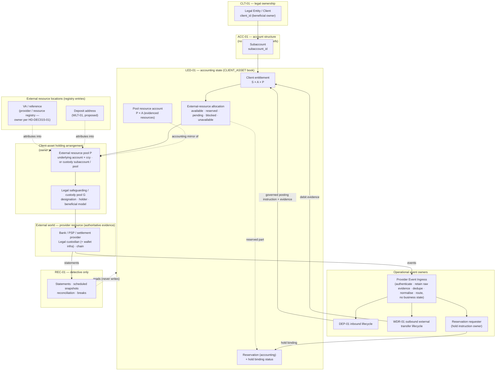

### 8.3 Ownership rules

1. **Economic owner** of a client asset is always a CLT-01 legal entity. A subaccount never owns
   anything (`DEC-011` layer 4); it scopes.
2. **AIX corporate** assets are owned by AIX and recorded only in the `CORPORATE` book. AIX is
   **not** registered as a CLT-01 client and has **no** ACC-01 master account for its corporate
   money (§9.4).
3. The **legal holding structure** of every resource pool is a recorded fact with its evidence
   reference. Until it is evidenced, the pool's arrangement status is `UNVERIFIED` and it cannot
   back a usable-for-movement balance in PRODUCTION (§17.7).
4. The **controller** of a location (who can dispose, and through which control facets) is
   recorded separately from the holder and from the beneficial owner. The three often differ.
5. No module infers legal ownership, holding, segregation or control from a name, an identifier
   format (e.g., a unique VA number) or a provider's marketing description.

---

## 9. Institutional Account Hierarchy Mapping

### 9.1 Mapping table

| External / operational object | Maps to | Cardinality (architecture) | Where the binding / fact lives |
|---|---|---|---|
| Client VA / unique banking identifier | Subaccount (attribution) | One VA ↔ exactly one subaccount, never re-assigned (a subaccount may hold several VAs, e.g., per currency/provider) | VA registry entry, lifecycle and binding: **provider / resource registry abstraction — owner per HD-DEC015-01** (§36.5), scoped by `subaccount_id` from ACC-01 `resolve`; DEP-01 consumes the mapping |
| Deposit / payment reference (no VA) | Subaccount (attribution) | One live reference ↔ one subaccount | Same registry abstraction (owner per HD-DEC015-01); DEP-01 consumes |
| Underlying external bank account | **Not** a subaccount — an **external resource pool** (per currency) shared by many clients' VAs unless §9.6 evidence makes each VA its own pool | One account × currency ↔ one resource pool ↔ many S × A × P allocations | Pool definition and legal facts: client-asset holding arrangement (owner per HD-DEC015-01); accounting: LED-01 pool resource account |
| Custodian client subaccount (C1) | Resource pool for one subaccount (preferred) | One custodian subaccount × instrument-network ↔ one pool ↔ one AIX subaccount | Arrangement (HD-DEC015-01) + LED-01 |
| Custodian omnibus pool (C2) | Resource pool for many subaccounts | Pool ↔ many; attribution by LED-01 allocation + custodian books & records | Arrangement (HD-DEC015-01) + LED-01 |
| Wallet / vault (infrastructure) | Detail of a custody location | Never a client identity; never a ledger account | Arrangement (descriptive) |
| Deposit address | Subaccount × instrument-network (attribution into a custody pool) | One address ↔ one subaccount (unique mode) or ↔ pool with memo/tag (shared mode) | **WLT-01** assignment *(proposed, D-1)* |
| Withdrawal destination | Subaccount (scoping) | Existing WLT-01 model; scoping per DCR-ACC-WLT-01 | WLT-01 (existing) |
| Client settlement account (rail F2) | Resource pool | One ↔ one or pool | Arrangement (HD-DEC015-01) + LED-01 |
| LP / counterparty settlement instruction (SSI) | **Not** a client object — counterparty's own account | Per LP × asset × rail | LQD-01 |
| Venue account (AIX's account at an LP/venue) | **CORPORATE** book (AIX-owned). A client-attributed account at an LP is a client resource pool only if its arrangement facts are evidenced like any other (`EV-30`, `EV-33`) | Per venue | LQD-01 (account identity) + TRE-01 (corporate position) + LED-01 (CORPORATE book) |
| AIX corporate bank account / treasury account | **CORPORATE** book | Per account × currency | TRE-01 (operational) + LED-01 (CORPORATE book) |
| AIX safeguarded client-money account (rail F3) | `CLIENT_ASSET` resource pool (holder = AIX, beneficial = clients, designation = client-money), **not** an AIX asset | Pool ↔ many subaccounts | Arrangement (HD-DEC015-01) + LED-01 |

### 9.2 What does **not** move into ACC-01

ACC-01 v0.10 §2 lists "**Never in ACC-01:** … wallet addresses, any monetary amount, any balance,
any ledger identifier, any product/asset eligibility flag" and ACC-REQ-007 forbids any monetary
amount, balance, holding or ledger identifier. DEC-015 adds **no** column, table or responsibility
to ACC-01: VA bindings, custody bindings, deposit addresses, resource pools, settlement accounts,
provider balances, reservations, fee payables and treasury positions all live **outside** ACC-01,
and **reference** `subaccount_id` obtained from ACC-01's `resolve` seam under the ACC-01 consumer
evaluation order (ACC-01 v0.10 file 01 §10; DCR-ACC-CONS-01).

### 9.3 Ledger-account shape (architecture, not schema)

| Book | Ledger account type | Dimensions | Purpose |
|---|---|---|---|
| `CLIENT_ASSET` | Client Entitlement | `client_id`, `subaccount_id`, asset, `resource_pool_id` | The client's accounting claim on that pool; never negative |
| `CLIENT_ASSET` | Pool Resource | `resource_pool_id`, asset | The externally evidenced resources of the pool (the "other side" of client entries) |
| `CLIENT_ASSET` | Client Suspense / Unidentified | `resource_pool_id`, asset, `suspense_item_id` | Received, not attributable to a client yet — a **client claim of unknown owner**, held per identified receipt item so that a return-to-source encumbers and consumes **that item** (§16.3) and never a fabricated client entitlement |
| `CLIENT_ASSET` | Unallocated / Excess External Resource | `resource_pool_id`, asset | Provider-evidenced resources in P above every recorded claim and AIX-owned amount, found by reconciliation without an attributable inbound event (unallocated receipt, pending identification, unrecorded fee, corporate money, timing difference, provider adjustment, reconciliation break). **Ownership unknown until proven** by provenance, ledger classification and legal account structure (§17.2). Treated on the **claims side**; never AIX-owned by default; never applied to any client's deficit (R2-F07) |
| `CLIENT_ASSET` | Pool Receivable from AIX | `resource_pool_id`, asset | Amount AIX owes pool P for a provider charge AIX agreed to bear that the provider debited from P, pending reimbursement (X4, §16.4). **Not** a qualifying resource (§17.3) |
| `CLIENT_ASSET` | Client Settlement Claim (in-flight) | `obligation_id`, `client_id`, `subaccount_id`, asset due, counterparty | What a client is due after its own leg left its pool (§17.3); outside every pool |
| `CLIENT_ASSET` | Migration In-Transit Resource | `migration_transfer_id`, asset, source pool, destination pool | Value of a governed exit / migration slice after authenticated source debit and before authenticated destination receipt or return (§13.8). **Outside every pool**; **not** a qualifying resource unless separately validated (`EV-25`, `EV-29` criteria) |
| `CLIENT_ASSET` | Client Migration In-Flight Claim | `migration_transfer_id`, `client_id`, `subaccount_id`, asset | The client's claim on that in-transit slice (§13.8); outside every pool; reported separately (§17.8) |
| `CLIENT_ASSET` | Client Deficit (receivable / exposure) | `client_id`, `subaccount_id`, asset, `resource_pool_id` | Amount a client owes after an externally imposed reversal exceeded its entitlement (§17.5); never a negative entitlement |
| `CLIENT_ASSET` | Pool Exception (post-seal / unattributable) | `resource_pool_id`, asset | Provider-evidenced movements that cannot be posted to a subaccount (e.g., after an ACC-01 closure seal, §51.4) pending governed resolution |
| `CLIENT_ASSET` | AIX Fee Payable (held in pool) | `resource_pool_id`, asset | AIX-owned fee amount still physically in the client pool, awaiting the bounded sweep (§20). **Pool-level — no `subaccount_id`** |
| `CORPORATE` | AIX Cash / Treasury | corporate location, asset | AIX's own money |
| `CORPORATE` | AIX Venue Prefunding / Credit Support | venue, asset | AIX-owned money/collateral at an LP/venue for AIX's own relationship (§19.4) |
| `CORPORATE` | Fee Receivable / Fee Revenue | asset | AIX's fee lifecycle |
| `CORPORATE` | Provider Fees Payable / Expense | provider, asset | Bank/custodian/LP/network fees AIX bears |
| `CORPORATE` | Operational Exposure / Receivable | counterparty or client, asset | Named operational exposure (§33.6), including any receivable from a client created by a governed restoration (§17.5) or by an LP's application of AIX collateral where a valid contractual basis exists (§19.5), never inventory |
| `CORPORATE` | Payable to Client Pool | `resource_pool_id`, asset | AIX's liability to pool P for an AIX-borne provider charge debited from P (X4) |
| `CORPORATE` | Collateral Applied by Counterparty — Pending Classification | counterparty, asset | AIX corporate collateral / prefunding an LP has applied or seized, pending classification as recoverable receivable or corporate loss (§19.5) |
| `CORPORATE` | Corporate Loss / Expense | category, asset | Classified corporate losses (e.g., unrecoverable collateral application), compensation (X5) and AIX-borne charges (X4) |

`client_id` and `subaccount_id` remain **separate** dimensions on client-book accounts
(`DEC-011` §4.10). Corporate-book and pool-level accounts carry **no** `subaccount_id`.
**Encumbrances are not accounts:** a client reservation, a fee-payable collection encumbrance, a
suspense-item encumbrance or an exception-item encumbrance is an LED-01 accounting **state** on its
source account or item (§16.3), never a separate balance. This is
compatible with ACC-01 reconciliation check R-5, which applies only where a `subaccount_id` is
present.

### 9.4 AIX corporate money is not an ACC-01 account

AIX does not register itself as a CLT-01 client to obtain a master account for its own funds.
Modelling AIX as its own "client" would put corporate and client money on the same identity and
account axis and would make the books' separation a matter of convention. ACC-01's subaccount
purpose `treasury` (ACC-01 v0.10 file 05 `CHECK IN ('general','trading','treasury','payments','rwa')`,
"Label only") therefore means **a client's own treasury pocket** and **never** AIX corporate
treasury. This is a terminology clarification for a future ACC-01 revision (FI-ACC-2, §51), not a
structural change.

### 9.5 Comparison with ACC-01 v0.10

| ACC-01 v0.10 statement | DEC-015 position | Result |
|---|---|---|
| File 01 §1: "ACC-01 is a **structural** module. It never moves, holds, reserves, prices or reports money" | Same | Compatible |
| File 01 §2: LED-01 sole owner of "ledger account, balances, journals, postings, holds, safeguarding" | Same; resource-pool allocation is LED-01's; external resource **evidence** is REC-01's (detective) and DEP-01's/WDR-01's (operational); location registry entries and arrangement facts are outside ACC-01 | Compatible |
| File 01 §2: WLT-01 "provides the subaccount a destination may be scoped to; no destination data" | Unchanged for destinations; deposit addresses follow the same pattern. Fiat VAs bind through the provider / resource registry abstraction (owner per HD-DEC015-01) and reference `subaccount_id` | Compatible |
| File 01 §3: three dimensions `client_id` / `subaccount_id` / `ledger_account_id` | Same, plus `resource_pool_id` / `external_location_id` as **external** dimensions owned outside ACC-01 | Compatible |
| ACC-REQ-037: model supports wallet-destination scoping, ledger posting, Spot/OTC/Pay/RWA attribution and reconciliation without coupling to any product | DEC-015 bindings consume `resolve` exactly this way | Compatible |
| File 13 §3: balance, holding, safeguarding-shortfall and client-money reconciliation out of ACC-01 scope | Same — REC-01/LED-01 | Compatible |
| File 01 §7.1 CDA-1…CDA-4 closure-drain allow-list, **closed and fail-closed** (CDA-5 "None defined") | v0.2 maps every DEC-015 drain activity to CDA-1…CDA-4 or to a readiness precondition; no subaccount-scoped fee object exists (§20, §51 FI-ACC-5). One candidate list-text amendment is recorded as future integration work only | Future integration (FI-ACC-1, FI-ACC-5) |

### 9.6 External resource location, pool and allocation model (R02)

#### 9.6.1 Three levels, never merged

| Level | Identifier | What it answers | Example |
|---|---|---|---|
| External resource location | `external_location_id` | Where a movement is attributed or executed | VA `…1234`; deposit address; custody subaccount `C-77` |
| External resource pool | `resource_pool_id` | Which externally evidenced resources are fungible and back a claim | Underlying USD account `U` with all its VAs; custodian omnibus pool for BTC |
| Legal safeguarding / custody pool | `safeguarding_pool_id` | Under which legal protection the pool's client assets sit | Client-money designation over `U`; custody segregation agreement |

A location belongs to exactly one pool; a pool belongs to exactly one legal pool (or to
`UNVERIFIED`). **Two locations are in the same pool only if their resources are legally and
operationally fungible on the evidence** (`EV-01`…`EV-06`, `EV-28`). Otherwise they are separate
pools, and no surplus in one may cover the other (§17.2).

#### 9.6.2 Allocation at S × A × P

LED-01 keeps every client claim at **client × subaccount × asset × resource pool**. For each
S × A × P it maintains settled entitlement, blocked, reserved, pending outbound and the derived
available amount (§7.4); a pool that is not usable for an operation makes that operation's
**usable-for-movement** amount zero, while the accounting available amount and the entitlement are
unchanged (§16.8). The sum over S of settled entitlements at P, plus Client Suspense at P, is
the pool's client-claim total used by the coverage rule (§17.2).

#### 9.6.3 Source selection

Every **client-funded** trade reservation, withdrawal, settlement leg, client-funded refund and
client return names exactly one source S × A × P (and the executing `external_location_id`).
**Pool-level movements** — a fee sweep from the pool fee payable, a return of an identified suspense
or exception item — name their source **item** at its own pool instead and need no client
entitlement (§16.3, R3-F06):

1. **Candidates** are pools where S's available ≥ amount **and** P is usable for the operation
   class (for ordinary classes; a distressed exit class is gated by §10.2.2 / §13.7 instead):
   arrangement `VERIFIED`; operating state / servicing mode permits the operation
   (§10.2.1); rail `ACTIVE`; evidence within the applicable freshness policy (§16.7); coverage
   outcome `COVERED` after the movement (§17.2); no blocking break; no legal restriction on the
   amount (§16.8); withdrawal authority and hold enforceability satisfy §10.3; and the provider
   capability the operation needs is `SUPPORTED` (e.g., direct payment to that LP's SSI).
2. **Selection** is deterministic and configured (purpose-designated pool first, then a governed
   ordering), recorded on the reservation with the reason. Runtime convenience never chooses.
3. **No silent split; split funding not supported.** One reservation never spans pools. Funding one
   business obligation from several pools (split reservation) is **NOT SUPPORTED** in v0.3 or v0.4: no
   product rule may enable it until a later controlled change implements the §9.6.5 invariants.
4. If no single pool suffices, the request fails `INSUFFICIENT_AVAILABLE_AT_SOURCE` even when the
   S × A total would suffice (e.g., 600 at pool A + 400 at pool B for a 1,000 order ⇒ reject).
   Moving value between pools is a governed client-asset transfer with external evidence (§12
   rule 2), never a ledger re-label.
5. **Refunds and returns** (including suspense-item returns to source) go back to the pool the value came from, recorded on the obligation or
   movement; a different pool needs a governed decision.
6. A payout instructs the provider only up to **the reserved amount of that reservation at that
   pool**. Because coverage (§17.2) and per-pool serialisation (LED-01 v1.1 §5.17) hold, a payout
   can never consume resources allocated or reserved to another client or obligation.

#### 9.6.4 Pooled VA / omnibus allocation modes

A unique VA on a shared underlying account is an **attribution label**, not segregation. Each
pool therefore records `pool_allocation_mode` from evidence (`EV-28`):

| Mode | Meaning | Live client funds? |
|---|---|---|
| `PROVIDER_PER_VA_ENFORCED` | The provider limits every debit on a VA to that VA's own credited balance and reports per-VA balances | Yes; the VA may be designated its own pool |
| `AIX_EXCLUSIVE_INSTRUCTION` | Only AIX can instruct debits from the underlying account (`withdrawal_authority = AIX_INSTRUCTED_ONLY`); provider-originated debits are limited to evidenced, attributable fees/legal events; AIX enforces per-client allocation through LED-01 per-pool serialisation | Yes, with every provider-originated debit attributed or treated as a pool break (§40 rows 41–45) |
| `UNSUPPORTED` | Anything else — e.g., the client (or any other party) can debit the shared account beyond its own VA balance, or the provider cannot attribute debits | **No.** Fail closed: the structure is recorded as unsupported until validated; it may not hold live client funds in PRODUCTION |

For a pool in any mode, **client attribution, aggregate safeguarding, per-client entitlement,
source allocation, reservation, withdrawal allocation and reconciliation must each remain
provable** from LED-01 records plus provider evidence (§34 R1/R2). Where they cannot, the pool is
`UNSUPPORTED`.

#### 9.6.5 Split reservations across pools — invariants for any future support (R2-F14)

**Status: NOT SUPPORTED / REJECT** (§9.6.3 rules 3–4). The invariants below are recorded so that a
later controlled change cannot enable splitting without them. Defining them enables nothing.

```
parent business obligation (one order / payment / subscription, one requester)
  ├── child reservation A → pool A   (own amount, own provider hold, own evidence, own settlement state)
  ├── child reservation B → pool B   (…)
  └── …
```

| # | Invariant |
|---|---|
| S-1 | Σ child reserved amounts = the parent's reserved amount, at all times, in the same asset (no FX) |
| S-2 | Each child names exactly one S × A × P, binds at most one live provider hold, and carries its own external-resource evidence and its own settlement-leg state |
| S-3 | **All-or-nothing binding:** the parent may reach `READY_TO_EXECUTE` only when every child is `BOUND` (or `BOUND_INTERNAL_ONLY` where §10.3 permits); any child failing ⇒ every child is released under §18.3 before any execution attempt |
| S-4 | **No double allocation:** an amount at S × A × P belongs to at most one child of at most one parent |
| S-5 | **No silent movement between pools:** a child's pool never changes; re-funding from another pool is a new child created by a governed decision |
| S-6 | **No early release:** a child is never released while its external leg can still occur (§18.3 applies per child; `EXECUTION_ATTEMPTED` / `EXECUTION_UNKNOWN` protect each child's full amount) |
| S-7 | **Deterministic fill consumption:** fills consume children in a configured, recorded order; each obligation carries one cash leg per source pool |
| S-8 | **Independent release:** each child is released independently under §18.3, and only for its unconsumed remainder |
| S-9 | Coverage (§17.2) is evaluated per child pool; the parent never aggregates pools for sufficiency |

---

## 10. Fiat Banking Architecture

### 10.1 Rail types

| Rail | Name | Who holds the fiat | AIX role | Default? |
|---|---|---|---|---|
| **F1** | Provider-controlled client VA + direct settlement | Bank/PSP/settlement provider, in a structure where clients (individually or collectively) hold the beneficial interest | Broker, router, accounting platform, settlement orchestrator; holds **settlement-instruction authority** only to the extent the arrangement grants it | **Yes — preferred** |
| **F2** | Independent / tri-party settlement agent | An independent settlement agent or tri-party structure (client – AIX – agent/bank) | Same as F1; agent applies settlement conditions | First fallback |
| **F3** | AIX safeguarded client-money bank account | Bank, in an account **held by AIX**, designated client money, segregated from AIX corporate funds | AIX holds the account and therefore has legal control; safeguarding duties apply in full | Fallback **only** where legally or operationally required |

Every resource pool records its rail type. A rail type is **not** a capability flag and does
**not** imply which legal conclusion applies; it records which structure the arrangement evidence
(§41) shows.

### 10.2 Arrangement facts every fiat resource pool / location must carry

| Fact | Values (architecture vocabulary) | Source |
|---|---|---|
| `rail_type` | `F1_PROVIDER_VA` / `F2_SETTLEMENT_AGENT` / `F3_AIX_SAFEGUARDED` | Arrangement evidence |
| `account_holder` | `CLIENT` / `AIX` / `PROVIDER` / `TRUSTEE_OR_AGENT` / `UNVERIFIED` | `EV-02` |
| `beneficial_ownership_model` | `CLIENT_INDIVIDUAL` / `CLIENTS_COLLECTIVE_DESIGNATED` / `AIX` (corporate only) / `UNVERIFIED` | `EV-03` |
| `withdrawal_authority` | `CLIENT_INDEPENDENT` / `AIX_INSTRUCTED_ONLY` / `JOINT` / `PROVIDER_CONTROLLED` / `UNVERIFIED` | `EV-04` |
| `client_direct_instruction_authority` | `NONE` / `OWN_VA_ONLY` / `WHOLE_ACCOUNT` / `UNVERIFIED` | `EV-04`, `EV-28` |
| `settlement_instruction_authority` | `AIX_UNDER_MANDATE` / `CLIENT_ONLY` / `AGENT_CONDITIONAL` / `UNVERIFIED` | `EV-05` |
| `aix_instruction_authority` | Set of {`PAY_APPROVED_COUNTERPARTY`, `PAY_OWN_NAME_DESTINATION`, `PLACE_HOLD`, `RELEASE_HOLD`, `CLOSE_VA`, `COLLECT_DISCLOSED_FEE`} or `UNVERIFIED`. `COLLECT_DISCLOSED_FEE` = AIX may instruct transfer of an earned, disclosed fee from this pool to AIX's corporate account, within the evidenced source, timing and maximum-amount terms (§20.10, BNK-REQ-052…056) | `EV-05`, `EV-08` |
| `provider_hold_authority` | `NONE` / `TECHNICAL_ONLY` (hold exists in the provider system, enforceability unproven) / `ENFORCEABLE` (`EV-32` proven: binds the holder, including any client direct authority, and ranks as evidenced against set-off, legal orders, freezes, recalls and corrections) / `UNVERIFIED` | `EV-08`, `EV-32` |
| `segregation_designation` | `CLIENT_MONEY_DESIGNATED` / `TRUST` / `ESCROW` / `NONE` / `UNVERIFIED` | `EV-06` |
| `safeguarding_pool_id` | Legal pool reference or `UNVERIFIED` | `EV-06`, `EV-07` |
| `pool_allocation_mode` | §9.6.4 | `EV-28` |
| `arrangement_status` (legal-fact verification) | `UNVERIFIED` (never verified — may not hold live client assets in PRODUCTION) / `VERIFIED` / `REVERIFICATION_DUE` (verified earlier; periodic re-verification overdue, or new evidence questions a fact — **not** a finding that the basis is gone) / `BASIS_DEFEATED` (authenticated evidence establishes that a fact on which client-asset protection depends no longer holds) | Governance (maker-checker) |
| `operating_state` (per pool / location — **asset-location state**) | `PENDING_ACTIVATION` / `ACTIVE` / `WIND_DOWN` / `SUSPENDED` / `INACCESSIBLE` / `CLOSED` (§10.2.1). v0.3's location value `TERMINATED` is replaced by `CLOSED` (zero, provider-confirmed) and `INACCESSIBLE` (assets recorded but not movable) | Governance (maker-checker) |
| `servicing_mode` | While `WIND_DOWN`: `FULL_SERVICING` / `WITHDRAWAL_ONLY` / `RETURN_ONLY` / `MIGRATION_ONLY` / `RETURN_OR_MIGRATION` (§10.2.1) | Governance (maker-checker) |
| `relationship_state` (per arrangement — **operational / contractual relationship**) | `ACTIVE` / `NEW_BUSINESS_STOPPED` / `SUSPENDED` / `TERMINATING` / `TERMINATED` (§10.2.3); aligned with WF-19 `approved` / `suspended` / `terminated` | Governance (maker-checker); evidence of the contractual / operational event |
| `exit_authorisation`, `provider_exit_ability`, `legal_movement_permission` | §10.2.2 | Governance (maker-checker); Compliance + Legal; authenticated provider / administrator evidence |

`UNVERIFIED` in any field that a given operation depends on fails that operation closed in
PRODUCTION. In non-production, mock/sandbox arrangements carry explicit synthetic values and are
labelled synthetic (never promotable — Module Index §19 rule 13 by analogy).

**Verification status and operating state are different facts.** v0.2 used one field
(`UNVERIFIED / VERIFIED / SUSPENDED / TERMINATED`), so a provider losing approval for new business
(`SUSPENDED`) also lost every outbound path for the client assets it already held. v0.3 separates
them (R2-F01, R2-F02). v0.4 further separates the **relationship** from the **location** and from the
**economic claim**, and separates every exit fact from new-business approval (R3-F01, R3-F02).

#### 10.2.1 Operating state and servicing mode (every pool and location — fiat and custody)

`operating_state` is the **asset-location state**: what may happen at this pool / location now. It is
not the provider relationship (§10.2.3) and not the client's economic claim.

| Dimension (prompt / review term) | v0.4 representation | New placements (deposits, VA / address assignment, inbound settlement legs, migration-in) | Existing client assets |
|---|---|---|---|
| `NEW_PLACEMENT_ELIGIBLE` | `operating_state = ACTIVE` ∧ `relationship_state = ACTIVE` ∧ `arrangement_status = VERIFIED` ∧ WF-19 `approved` ∧ (custody) the §13.5 acceptance rule | **Yes** | Full servicing |
| `EXISTING_ASSET_SERVICING_ALLOWED` | `WIND_DOWN` + `FULL_SERVICING` | **No** | Withdrawal, return, outbound settlement legs of sells, migration — while the ordinary servicing gates hold (§10.2.2 `NORMAL_SERVICING_ELIGIBILITY`) |
| `WITHDRAWAL_ONLY` | `WIND_DOWN` + `WITHDRAWAL_ONLY` | **No** | Client withdrawals to WLT-01-verified own-name destinations and migration; **no** new trade legs |
| `RETURN_ONLY` | `WIND_DOWN` + `RETURN_ONLY` | **No** | Return of each client's assets to that client — under the ordinary gates while they hold, otherwise only under `DISTRESSED_EXIT_AUTHORITY` (§10.2.2, §13.7) |
| `MIGRATION_ONLY` | `WIND_DOWN` + `MIGRATION_ONLY` | **No** | Transfer to a successor location that itself satisfies the acceptance rule — planned (`PLANNED_EXIT_TRANSFER`) or distressed (`DISTRESSED_MIGRATION`) |
| (return or migration) | `WIND_DOWN` + `RETURN_OR_MIGRATION` | **No** | Either of the two above |
| `SUSPENDED` | `operating_state = SUSPENDED` | **No** | **No ordinary movement** (incident, outage, regulatory instruction to pause). Recorded reason, owner and review deadline; exceeding it escalates (INC-01, Management) and forces a decision. A **distressed exit authorisation** may be opened for named operations where the provider is able and the movement is lawful (§10.2.2). Suspension is never a statement that the assets are gone (§16.8) and never ends the provider's obligation to return them |
| `INACCESSIBLE` (new in v0.4) | `operating_state = INACCESSIBLE` | **No** | **No movement is possible on current evidence**: the provider is unable or unreachable, or the movement is legally prohibited. Assets stay recorded at their last verified amount; a **stranded / recovery claim** is open (§10.2.3); coverage per §17.7. Re-evaluated when ability or legal permission changes; a provider-run return (administrator distribution) is recorded when it occurs |
| `CLOSED` (replaces v0.3 location `TERMINATED`) | `operating_state = CLOSED` | **No** | **None remain.** Reachable only on authenticated provider evidence of zero (or a provider-confirmed closure) with clean reconciliation after the last movement, maker-checker. A location whose remaining value cannot be moved is `INACCESSIBLE`, **never** `CLOSED` |

Rules:

1. **Loss of new-business eligibility never by itself traps existing assets (P-21).** De-approval,
   suspension of new business, restriction, offboarding, termination notice, insolvency, an
   incident or a regulatory restriction moves the location to `WIND_DOWN` (or `SUSPENDED`) and the
   arrangement's `relationship_state` accordingly (§10.2.3). Servicing continues under the ordinary
   gates while they hold and under a distressed exit authorisation where they do not (§10.2.2).
   **Exit is not always possible:** where the provider is unable or the movement is legally
   prohibited, the location becomes `INACCESSIBLE` and a stranded / recovery claim is recorded — never
   a fictitious movement and never a reapproval fiction.
2. Every `WIND_DOWN` / `SUSPENDED` / `INACCESSIBLE` transition records its cause, the servicing mode,
   the exit plan (Workflow Map v1.3 WF-19 step 10 and blocking condition 8) and the evidence;
   maker-checker.
3. Outflows from a location that is not `ACTIVE` are permitted **only** through the gate of their
   operation class (§10.2.2) and always subject to the unconditional per-movement controls and the
   source-account encumbrance of §16.3, plus reconciliation before the first and after the last
   exit movement (`EV-25`, R15).
4. A provider's exit obligations (return of assets, statements, records — BNK-REQ-077, -080, -081,
   CUS-REQ-007, -063, -080…084, -089) are evidenced **before** live activation, so the contractual
   exit path exists before it is needed. **Contractual evidence does not guarantee ability in
   distress**; ability is re-established on evidence at the time (§10.2.2).
5. Operating state and relationship state never change the settled entitlement and never, by
   themselves, change qualifying resources (§17.2, §17.7).
6. A location becomes `CLOSED` only at evidenced zero. A **relationship** may be `TERMINATED` with
   assets still recorded (§10.2.3).

#### 10.2.2 Exit-authority dimensions — new business is not exit (R3-F01)

v0.3 separated new-placement eligibility from servicing but still routed a distressed exit through
WF-19 `approved`, `VERIFIED` and ordinary rail activation (§16.3, §35.6) and through an AST-01
approval it proposed to keep in place (`04-review-r3.md` R3-F01). v0.4 records **six separate
facts**; none is inferred from another.

| Dimension | Where recorded | Values | Answers |
|---|---|---|---|
| `NEW_BUSINESS_ELIGIBILITY` | Derived (§10.2.1 `NEW_PLACEMENT_ELIGIBLE`) | `YES` / `NO` | May this location receive **new** client value |
| `NORMAL_SERVICING_ELIGIBILITY` | Derived per operation class | `YES` / `NO` | May ordinary withdrawals, settlement legs and ordinary returns run: WF-19 `approved` ∧ arrangement `VERIFIED` ∧ rail `ACTIVE` for the class ∧ operating state / servicing mode permits ∧ (custody) §13.5 Rule B ∧ AST-01 C6 via WLT-01 for AIX-instructed custody withdrawals |
| `DISTRESSED_EXIT_AUTHORITY` | `exit_authorisation` record per arrangement × pool / location × operation class (owner per HD-DEC015-01) | `NONE` / `PROPOSED` / `APPROVED` (scope: clients, assets, locations, operation classes, amount bounds, distribution basis, validity) / `SUSPENDED` / `REVOKED` / `EXPIRED` | May a governed distressed return or migration be attempted **although** ordinary servicing gates no longer hold. Opened under WF-19 step 10 (exit plan); maker-checker Ops + Finance + Compliance + Legal, Management where critical |
| `PROVIDER_OPERATIONAL_ABILITY` | `provider_exit_ability` per arrangement × location × operation class | `ABLE` / `IMPAIRED` (able only for named operations or only through a named process, e.g. an administrator) / `UNABLE` / `UNKNOWN` | Can the provider (or its administrator) actually execute the movement **and evidence it** — authenticated status, statements, transfer evidence |
| `LEGAL_MOVEMENT_PERMISSION` | `legal_movement_permission` per pool / location × scope | `PERMITTED` / `PERMITTED_WITH_CONDITIONS` (e.g., administrator consent, court approval) / `PROHIBITED` (order / moratorium reference) / `UNDER_ASSESSMENT` | Is moving these assets lawful now (`EV-14`, `EV-15`, `EV-32`) |
| `DESTINATION_ELIGIBILITY` | Per movement | Client own-name destination (WLT-01 verify-and-consume, AML-01, Travel Rule) / successor location satisfying §13.5 Rule A (custody) or `ACTIVE` successor pool (fiat) / administrator-run distribution to client details AIX verified | Where the value may lawfully and safely go |

**Operation-class gates.**

| Gate | `NEW_PLACEMENT` | Ordinary `WITHDRAWAL` / settlement leg / ordinary return | `PLANNED_EXIT_TRANSFER` (§13.6 planned cutover) | `DISTRESSED_ASSET_RETURN` | `DISTRESSED_MIGRATION` | `PROVIDER_RUN_RETURN` |
|---|---|---|---|---|---|---|
| WF-19 status | `approved` | `approved` | `approved` | **Not required**: `suspended` or `terminated` permitted; WF-19 step 10 exit plan opened (blocking condition 8 satisfied) | As return | Not required |
| `arrangement_status` | `VERIFIED` | `VERIFIED` | `VERIFIED` | `VERIFIED`, `REVERIFICATION_DUE` or `BASIS_DEFEATED` accepted — the exit is the remedy; `UNVERIFIED` only for an exception case where live assets were found | As return | n/a (AIX instructs nothing) |
| Operating state | `ACTIVE` | `ACTIVE`, or `WIND_DOWN` with a permitting servicing mode | `WIND_DOWN` (`MIGRATION_ONLY` / `RETURN_OR_MIGRATION`) | `WIND_DOWN` or `SUSPENDED` | `WIND_DOWN` or `SUSPENDED` | Any, including `INACCESSIBLE` |
| Live-routing for the class (§35.6) | `ACTIVE` | `ACTIVE` | `ACTIVE` | An **`EXIT_ONLY`** entry for this class, opened by maker-checker under the exit authorisation; ordinary classes may stay `SUSPENDED` | `EXIT_ONLY` | n/a |
| Custody: AST-01 | Rule A | C6 `WITHDRAWAL_MB_PSO` via WLT-01 | Successor Rule A; C6 for returns | C6 `WITHDRAWAL_MB_PSO` via WLT-01, satisfied only by a **truthful** AST-01 representation (§13.7.3) — never by retaining an approval AST-01's own governance has withdrawn | Successor Rule A | n/a |
| `exit_authorisation` | — | — | Exit plan (§13.6) | `APPROVED`, operation within scope | `APPROVED` | `APPROVED` (records AIX's role, client data release and evidence duties) |
| `provider_exit_ability` | (activation evidence) | (failure → exception) | `ABLE` | `ABLE`, or `IMPAIRED` for this operation | As return | Administrator / provider able |
| `legal_movement_permission` | — | No legal restriction on the amount (§16.8) | `PERMITTED` | `PERMITTED`, or conditions evidenced as met | As return | Per the legal process |
| Destination | — | WLT-01 destination / LQD-01 SSI | Successor (Rule A) | Client own-name (WLT-01) | Successor (Rule A) | Administrator distribution to verified client details |
| **Never waived** | All | All | All | **Authentication, AML / sanctions / Travel Rule, destination verification, maker-checker (IAM-02 and provider-side), client attribution (LED-01 + provider books), anti-preference (§13.7.4), legal restrictions (§16.8), provider capability (§35.4), source encumbrance (§16.3), durable intent and submission profile (§18.3 rule 7, §35.8.4), reconciliation (R15)** | All of these | Attribution, anti-preference, legal restrictions, evidence, AML monitoring of the outflow |

**Provider situations are distinguished, never merged.**

| Situation | Recorded as | Consequence |
|---|---|---|
| Provider not approved for new business | `NEW_BUSINESS_ELIGIBILITY = NO`; `relationship_state = NEW_BUSINESS_STOPPED`; location `WIND_DOWN` | Ordinary servicing continues while its gates hold |
| Provider arrangement suspended (WF-19 `suspended`, rail `SUSPENDED`) | `relationship_state = SUSPENDED`; location `SUSPENDED` or `WIND_DOWN` | Ordinary servicing paused; a distressed exit authorisation may be opened |
| Provider legally permitted to return assets | `legal_movement_permission = PERMITTED` | Necessary, **not** sufficient |
| Provider operationally able to return assets | `provider_exit_ability = ABLE` | Necessary, **not** sufficient |
| Provider inaccessible / unable to perform the movement | `provider_exit_ability = UNABLE`, or `UNKNOWN` past the review deadline | Location `INACCESSIBLE`; **STRANDED / RECOVERY CLAIM** (§10.2.3); no movement is promised |
| Movement legally prohibited | `legal_movement_permission = PROHIBITED` | No movement; location `INACCESSIBLE` (legal); stranded claim linked to the legal process; re-evaluated when the prohibition changes. A `WIND_DOWN` label never cures insolvency or a legal prohibition |

**No fake movement, no reapproval fiction.** AIX never records a transfer the provider has not
evidenced, never represents an unable provider as servicing, and never re-approves a provider for
new business, keeps an approval its governance has withdrawn, or bypasses a security / compliance
control in order to honour an exit.

#### 10.2.3 Relationship termination, asset location and the economic claim (R3-F02)

v0.3 allowed `TERMINATED` only after every asset was returned, the location showed zero on
authenticated provider evidence and reconciliation was clean (`04-review-r3.md` R3-F02). After an
insolvency the contract and the operational relationship can end while an administrator still
recognises a disputed claim and no provider-zero statement will ever arrive. v0.4 records three
things separately:

| Record | Owner | Values | Changed by |
|---|---|---|---|
| **Operational / contractual relationship** — `relationship_state` on the arrangement | Holding-arrangement owner (HD-DEC015-01), maker-checker; aligned with WF-19 | `ACTIVE` / `NEW_BUSINESS_STOPPED` / `SUSPENDED` / `TERMINATING` / `TERMINATED` | Evidenced contractual / operational events: termination notice and its expiry, mutual termination, licence revocation, appointment of an administrator, regulatory direction. **`TERMINATED` does not require zero assets, a provider zero statement or a write-off**; it requires that every remaining amount is represented in the location and claim records below (no silent drop) |
| **Asset location** — `operating_state` per pool / location | Same owner | §10.2.1 (`WIND_DOWN` … `INACCESSIBLE` / `CLOSED`) | Movement evidence; provider / administrator evidence of ability; legal permission |
| **Economic claim and recovery** — the client entitlements at S × A × P (LED-01, unchanged) plus a `recovery_claim` record | LED-01 (entitlements); holding-arrangement owner with Legal / Finance (recovery record); REC-01 (break) | Recovery status below | Recovery evidence; governed decisions |

**Recovery-claim record (`recovery_claim`) — preserved fields.** Amount and asset (per client, by
reference to the LED-01 entitlements at the pool — never a copy that can drift); claimant (each
client; AIX where it is the contractual claimant on clients' behalf, `EV-30`/`EV-14`); debtor /
administrator / legal process reference; last authenticated provider evidence and its time;
**evidence age** (derived); `recovery_status ∈ {IDENTIFIED, CLAIM_PREPARED, CLAIM_LODGED,
CLAIM_WITH_ADMINISTRATOR, ADMITTED, DISPUTED, PARTIALLY_RECOVERED, RECOVERED,
UNRECOVERABLE_PENDING_GOVERNANCE}`; expected recovery, if any, with its basis (never counted as a
qualifying resource); `write_off_status ∈ {NONE, PROPOSED, APPROVED}` — `NONE` unless and until a
**separately governed** decision approves a write-down on evidence (`EV-14`, `EV-35`), which DEC-015
does not make; reconciliation status (the REC-01 break stays open).

**Representable example (the review's case).**

```
provider relationship   = TERMINATED                (administrator appointed; contract ended)
asset location          = INACCESSIBLE              (no instruction path; no zero statement)
client economic claim   = USD 100 outstanding       (LED-01 entitlement(S, USD, P) = 100, unchanged)
recovery status         = CLAIM_WITH_ADMINISTRATOR  (claim lodged, acknowledged by administrator)
last evidence / age     = statement 2026-09-30 / n days
expected recovery       = none evidenced            (not a resource)
write-off status        = NONE
reconciliation          = OPEN                      (R1 / R2 break; safeguarding line "stranded")
```

Rules:

1. **No fiction to reach an endpoint.** No zero balance, provider confirmation, movement or
   write-off is invented to make the relationship `TERMINATED` or the location `CLOSED`.
2. **No accounting relabel.** A stranded status changes no entitlement and no Pool Resource amount.
   Coverage follows §17.7 (`UNDETERMINED` while the legal basis or the evidence is unresolved;
   `SHORTFALL` only on authenticated evidence that resources left or are legally unavailable to
   clients). Any later write-down or reclassification is a separately governed, evidenced LED-01
   entry.
3. **Recoveries.** A recovery received is authenticated inbound evidence (DEP-01) and posts into the
   pool where it is received. Where that is a different pool Q, the client's entitlement moves from
   P to Q by the governed transfer journals of §13.8 (never a relabel). A partial recovery of a pooled
   (C2 / omnibus / shared-account) location is distributed under a governed distribution basis — the
   administrator's evidenced allocation, or pro rata to evidenced claims — never first-come, never
   preferring one client (§13.7.4).
4. **No corporate advance.** AIX does not advance, bridge or cover stranded value to clients pending
   recovery (§19.4). Compensation for an AIX-caused loss is X5 by governed decision; restoration of a
   classified shortfall is X6 only under `EV-35`.
5. A provider-run return (administrator distribution) that debits the location is recorded as an
   observed outflow (§23.1) attributable to each client on evidence of delivery to that client.

### 10.3 Withdrawal authority, hold enforceability and trading resources (R02, R11)

If anyone other than AIX can move funds out of the pool **without AIX's instruction** — the
client under its own mandate (`CLIENT_INDEPENDENT`, `JOINT`, `client_direct_instruction_authority ≠ NONE`),
or a third party — then **no AIX-internal reservation can prevent double use** of those funds.
**A software reservation does not legally restrict a bank account.** Therefore:

| Situation | Trading / payment funding from this pool requires |
|---|---|
| `withdrawal_authority ∈ {AIX_INSTRUCTED_ONLY, PROVIDER_CONTROLLED}` and `client_direct_instruction_authority = NONE` | LED-01 reservation **plus** either a bound provider hold (preferred) or the §18.4 fallback |
| `JOINT`, or any client direct authority | A bound provider hold with `provider_hold_authority = ENFORCEABLE` (`EV-32`) — **mandatory**. The §18.4 fallback is not available |
| `CLIENT_INDEPENDENT` | A bound provider hold with `provider_hold_authority = ENFORCEABLE` — **mandatory**. Without it, the pool may receive deposits and display balances, but its resources are **not trading resources**: available for funding = 0. The client must first move funds into a structure it cannot unilaterally debit while committed |
| `provider_hold_authority = TECHNICAL_ONLY` where a hold is mandatory | **Not sufficient.** Treated as no hold until `EV-32` is proven |
| Any `UNVERIFIED` dependency | No execution or payment funding (fail closed) |

Whatever the authority, a debit AIX did not instruct is still a fact AIX must post and reconcile
(§23.1).

### 10.4 Fiat rail capability dependence

The rail's actual behaviour depends on the provider's declared capabilities (§35.4). The
architecture **requires** for F1/F2 live operation: unique client attribution (VA or reference),
authenticated deposit confirmation, balance evidence per pool (and per VA where the allocation
mode needs it), an allocation mode other than `UNSUPPORTED`, and either a bound enforceable hold
or the §18.4 fallback under its conditions. **Direct counterparty settlement** is preferred;
where unsupported, the cash leg uses a two-step path (client pool → settlement structure →
counterparty) that remains client-funded and recorded as such (§25.4).

### 10.5 Statement of non-custody

Whether AIX has "custody" or "control" of fiat under any rail is a **legal conclusion** this
document does not make (`EV-01`, `EV-07`). The architecture records the facts that determine it and
supports every rail. A VA **does not by itself** prove a non-custodial or segregated structure
(§11.3, §11.5).

### 10.6 Currency

USD is the only fiat currency configured initially. Every location, pool, ledger account,
reservation, obligation, fee and evidence record carries an ISO 4217 currency (fiat) or AST-01
instrument identity (digital). Adding a currency is configuration plus AST-01 fiat reference data
(AST-01 v1.8 §3.10), not an architecture change. **No FX conversion is introduced by DEC-015 and
no coverage, reservation or settlement rule nets across currencies**; a future FX capability needs
its own decision (it touches LED-01 v1.1's FX/residual controls and `ASSET-RULE-001`).

---

## 11. Virtual Account Architecture

### 11.1 Object model

```
External Fiat Provider (shared provider record — owner per HD-DEC015-01)
  └── Underlying Legal Bank Account × currency  = External Resource Pool P   (holder, designation,
        │                                           beneficial model, allocation mode — EV)
        ├── Legal Safeguarding Pool G (designation / trust — EV-06, EV-07)
        └── Virtual Account / Reference   (unique client attribution; registry entry behind the
              │                              provider / resource registry abstraction — owner per
              │                              HD-DEC015-01; DEP-01 consumes the mapping)
              └── bound to AIX subaccount_id   (via ACC-01 resolve)
                    └── LED-01 Client Entitlement S × USD × P
        └── LED-01 Pool Resource account P × USD
```

### 11.2 VA registry-entry lifecycle (the VA itself is provider-issued)

`requested → provisioning (provider) → active → suspended → closing → closed`, maker-checker for
activation, suspension and closure; every transition audited (SEC-01). Binding a VA to a
subaccount requires: ACC-01 `resolve` under the consumer evaluation order (closure barrier first);
CLT-01 client status permitting; KYC/AML clearance appropriate to receiving funds; and a pool with
`arrangement_status = VERIFIED`, `operating_state = ACTIVE` and `pool_allocation_mode ≠
UNSUPPORTED` in PRODUCTION.

**Registry owner: not decided in DEC-015** (R2-F05). The VA registry entry, its lifecycle and its
subaccount / pool binding are canonical objects behind the **provider / resource registry
abstraction** (§36.5); the owner is a named sub-question of **HD-DEC015-01** (§58) — candidates are
DEP-01 or the holding-arrangement owner. Until decided, consumers carry the opaque
`external_location_id` / `resource_pool_id` and **DEP-01 consumes** the VA → client / subaccount /
pool mapping for inbound attribution, whoever owns it. **One lifecycle authority:** where a VA is
designated its own resource pool (`PROVIDER_PER_VA_ENFORCED`, §9.6.4), the VA lifecycle above and the
pool's `operating_state` are held by the **same** owner and move together; two modules never hold
lifecycle authority over one object.

### 11.3 What a VA does **not** prove

| A VA proves | A VA does not prove |
|---|---|
| Inbound funds referencing it can be attributed to one client | Who holds the underlying account |
| The provider can report movements per client | Who is the beneficial owner |
| | Who may withdraw, or whether the client can debit it directly |
| | That debits are limited to the VA's own balance (`EV-28`) |
| | That a hold on it is enforceable (`EV-32`) |
| | Whether AIX has custody or control |
| | Insolvency treatment of the funds |
| | That the provider can reserve or settle directly |

### 11.4 Re-use and closure

A VA is **never re-assigned** to another client. Closure requires: zero client entitlement at
that pool for that subaccount, no pending inbound/outbound, no open reservation or provider hold,
no open break, and a provider-confirmed closure. Late inbound funds after closure route to
unmatched/suspense and return-to-source (§21.4). This is the external half of ACC-01 closure-drain
(FI-ACC-1, FI-ACC-5).

### 11.5 Direct bank authority model (what the VA structure must tell AIX)

For every VA and its underlying account, the arrangement must answer, separately and on
evidence: the VA identifier; the underlying legal account; the legal account holder; the
beneficial / economic owner; withdrawal authority; settlement authority; provider hold authority
**and its enforceability**; AIX instruction authority; client direct instruction authority; the
legal safeguarding pool; and the external-resource allocation mode. A missing answer is
`UNVERIFIED` and fails closed for the operation that depends on it (§10.2). **A unique VA number
answers none of these questions.**

---

## 12. Fiat Fallback Hierarchy

| Order | Rail | Selection rule |
|---|---|---|
| 1 | **F1** provider-controlled client VA + direct settlement | Default where a provider arrangement supports it and its facts are verified |
| 2 | **F2** independent / tri-party settlement agent | Where F1 cannot provide client attribution, reservation or controlled direct settlement, or where the legal analysis prefers an agent structure |
| 3 | **F3** AIX safeguarded client-money account | **Only** where legal/regulatory analysis or provider capability makes F1/F2 unavailable for a defined scope; requires its own governance record citing the reason |

Rules:

1. Rail selection is per **provider arrangement × currency × product scope**, recorded on the
   provider arrangement record and the executing module's rail-activation registry, governed by
   maker-checker; it is never a per-transaction runtime choice.
2. A client may have locations on more than one rail; balances are never silently moved between
   rails. A rail migration is a governed client-asset transfer with external evidence (§41 `EV-25`).
3. Choosing F3 does not change any control: it **adds** obligations (AIX holds the account; full
   safeguarding, daily reconciliation, bank acknowledgement of client-money designation — `EV-06`,
   `EV-07`).
4. No architecture component may assume F3 (e.g., by modelling "the client-money account" as a
   singleton). The current masters do (§43 rows M-09, M-13, M-14, M-27).

---

## 13. Digital Asset Custody Architecture

### 13.1 Custody models

| Model | Structure | Requirements |
|---|---|---|
| **C1 (preferred)** | Third-party institutional **legal custodian** + client subaccount or identifiable custodian entitlement + unique client deposit address where practical + omnibus wallet infrastructure underneath where appropriate | Custodian books identify each client's position; AIX ledger identifies each client's position; client and aggregate reconciliation possible; §13.4 control rule satisfied |
| **C2 (fallback)** | Third-party institutional **omnibus** custody + segregated client asset pool + custodian books and records + AIX client sub-ledger + full reconciliation | Client assets segregated from AIX corporate assets; individual entitlement provable from AIX ledger + custodian pool records; insolvency treatment contractually understood (`EV-13`); asset-return mechanism understood (`EV-15`); §13.4 control rule satisfied |
| **Not a default** | AIX able, by itself, to reconstruct signing authority, move client assets, recover them to an AIX-controlled destination, bypass the custodian's controls or re-policy so that AIX alone can move assets (§13.4.2) — prohibited outright; or an arrangement with any AIX custody control indicator (§13.4.3) — **not eligible as third-party custody until `EV-34` assesses it** | Doc 00 §8.2 item 2: AIX private-key custody **unless separately approved**. DEC-015 approves nothing of the kind |

### 13.2 Separating custodian from technology

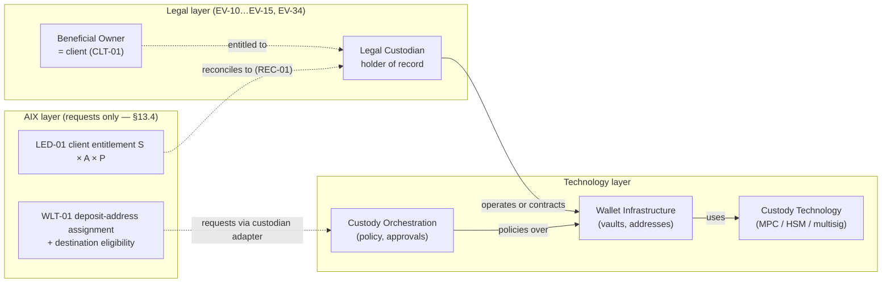

**Architectural eligibility of a candidate arrangement** (e.g., one involving Fireblocks) is decided
per arrangement **and per control facet** (§13.4). The table states what the architecture does with
each shape. **It states no legal conclusion**: who is custodian in law is `EV-11` / `EV-34` (R2-F03).

| Arrangement shape | Architectural classification | Effect | AST-01 `custody_model` |
|---|---|---|---|
| Independent institutional custodian, using its own or a vendor's infrastructure; every facet evidenced (§13.4.5); **no AIX custody control indicator** | `THIRD_PARTY_ELIGIBLE` | May back a live custody location once the arrangement is `VERIFIED` | `THIRD_PARTY_CUSTODIAN` (custodian of record, `EV-11`) |
| Vendor provides MPC / wallet infrastructure; an independent licensed custodian holds as custodian of record; every facet evidenced; **no AIX custody control indicator** | `THIRD_PARTY_ELIGIBLE` | As above | `THIRD_PARTY_CUSTODIAN` |
| Any AIX custody control indicator present (§13.4.3), and no technical prohibition of §13.4.2 breached | **`CONTROL_ASSESSMENT_REQUIRED`** | **Not eligible as third-party custody; fail closed:** no live custody location, no client assets placed, until `EV-34` assesses the arrangement. If `EV-34` concludes it is third-party custody, the classification becomes `THIRD_PARTY_ELIGIBLE` with the AIX participation recorded and its contractual and technical limits evidenced. If `EV-34` finds AIX control, Doc 00 §8.2 applies (no AIX custody unless separately approved) | No valid value until assessed — AST-01 v1.8 §6 has no AIX-custody value, so a custody row may not reference it (`NOT_SUPPORTED`) |
| Any arrangement in which AIX, **by itself**, can do anything §13.4.2 prohibits — e.g., vendor infrastructure with AIX controlling keys / policies and no independent custodian | **`PROHIBITED_AIX_UNILATERAL_CONTROL`** | Not usable under DEC-015 regardless of any legal classification; Doc 00 §8.2 | No valid value |

### 13.3 Movement controls

1. Custodian-side policy engine and approval quorum for every outbound transfer
   (`CUS-REQ-020`/`021`); AIX-side IAM-02 maker-checker for withdrawals and high-risk transfers in
   **addition**, never instead. **An AIX IAM-02 approval requests an action; it never completes
   a transfer.**
2. Outbound only to WLT-01-verified destinations (existing WLT-01 decision-consumption model) or to
   LQD-01-registered LP settlement instructions for settlement legs.
3. Address allowlisting at the custodian mirrors WLT-01 decisions; a mismatch is a break (§34).
4. **Custody control is governed by §13.4**, not by the absence of a complete private key. AIX
   holds API credentials to *request* operations, in KMS/vault (§37). Live credential use remains
   blocked by `WDR-FIND-001` (KMS) (§42).

### 13.4 Custody control model (R04)

#### 13.4.1 Control facets — each represented separately on the custody arrangement

| # | Facet | Recorded fact (holder(s), scope, evidence) |
|---|---|---|
| K1 | Private key | Who generates, holds and can use complete keys |
| K2 | Key share | Who holds any share of a split key |
| K3 | MPC share / API co-signer | Who operates any MPC participant or co-signing node |
| K4 | HSM control | Who administers the HSMs holding key material |
| K5 | Recovery material | Who holds backup shares, seeds or recovery kits |
| K6 | Recovery authority | Who may invoke recovery, and to which destination |
| K7 | Policy administrator | Who may create or change transfer policies, thresholds, quorums |
| K8 | Transaction initiator | Who may initiate a transfer request |
| K9 | Transaction approver | Who may approve a transfer request |
| K10 | Approval-quorum seat | Which seats exist, who holds each, and the quorum rule |
| K11 | Emergency override | Who may bypass or suspend policy, and under what procedure |
| K12 | Whitelist administrator | Who may add / remove withdrawal destinations at the custodian |
| K13 | Wallet administrator | Who may create, freeze or retire wallets/vaults and addresses |
| K14 | Ability to reconstruct signing authority | Whether any party or combination including AIX can assemble enough material to sign |
| K15 | Ability to move assets unilaterally | Whether any single party can move assets without another party's independent approval |
| K16 | Legal custody | Who is custodian of record (`EV-11`) |
| K17 | Operational control | Who in practice can cause a transfer to occur (combining K1–K15) |

#### 13.4.2 Architecture principle

AIX must **not** be able, **by itself**, to: reconstruct signing authority (K14); unilaterally
move client assets (K15); unilaterally recover client assets to an AIX-controlled destination
(K5, K6, K12); bypass the custodian's independent controls (K11); or change policy so that AIX
alone can move assets (K7, K10, K12).

#### 13.4.3 Custody control indicators — facts, not legal conclusions (R2-F03)

A **custody control indicator** is a recorded **fact** that AIX (any AIX entity, employee or
system) holds or participates in any of:

| Indicator | Facets |
|---|---|
| Private-key possession | K1 |
| Key share | K2 |
| MPC share / API co-signer | K3 |
| HSM control | K4 |
| Recovery material | K5 |
| Recovery authority | K6 |
| Policy-administration authority over transfer rules, thresholds or quorums | K7 |
| Approval-quorum participation sufficient — alone or with other AIX seats — to release a transfer without the custodian's independent approval | K10 |
| Emergency override | K11 |
| Whitelist control (unilateral add / remove of withdrawal destinations) | K12 |
| Wallet administration (unilateral create / freeze / retire) | K13 |
| Unilateral movement capability | K15 |
| Unilateral policy-change capability | K7 + K10 + K12 in combination |
| Ability to reconstruct signing authority | K14 |

Transaction initiation (K8) and approval **requests** (K9) are **disclosure items** (§13.4.4), not
indicators: they are the expected AIX role.

**An indicator is not a legal classification.** DEC-015 does not conclude from any indicator that
AIX is legal custodian, that the arrangement is "self-custody in substance", or that it is not. The
architecture does three things only:

1. **Records** every indicator and its scope, holder and evidence on the custody arrangement
   (§36.4).
2. **Classifies the arrangement `CONTROL_ASSESSMENT_REQUIRED`** (§13.2) while any indicator is
   present and unassessed: it is **not eligible as third-party custody**, may back no live custody
   location and receives no client assets (fail closed).
3. **Routes the legal and contractual classification to `EV-34`.** The assessment result is
   recorded on the arrangement with its evidence and approver.

**Unconditional technical boundaries (independent of `EV-34`).** Whatever the legal assessment,
§13.4.2 stands: AIX must not, by itself, be able to reconstruct signing authority, unilaterally
move client assets, recover them to an AIX-controlled destination, bypass the custodian's
independent controls, or change policy so that AIX alone can move assets. An arrangement that
allows any of these is `PROHIBITED_AIX_UNILATERAL_CONTROL` (§13.2) unless a future architecture
decision changes this and passes separate governance. **AIX lacking a complete private key does
not, by itself, make an arrangement non-custodial**; equally, AIX holding one non-controlling
share does not, by itself, make AIX the custodian. Example: 2-of-3 MPC where the custodian holds
two shares and can sign alone, and AIX holds one share and can neither sign nor block — the
indicator (K2/K3) is recorded, the arrangement is `CONTROL_ASSESSMENT_REQUIRED`, and `EV-34`
decides its classification.

#### 13.4.4 Participation that must be disclosed and validated

If AIX participates as transaction initiator (K8), transaction approver (K9), policy
administrator (K7), quorum seat holder (K10) or in any MPC workflow (K3), that participation is
recorded on the arrangement and validated externally (`EV-34`) — including the custodian's
written confirmation of which actions it performs independently of AIX. Initiation alone (a
request the custodian independently decides) is the expected AIX role.

#### 13.4.5 Evidence

STR-04B v0.4 §2.3A (`CUS-REQ-070`…`CUS-REQ-077`, with `CUS-REQ-026` aligned) requires the custodian to evidence the holder of
every facet and to **disclose, document contractually, evidence technically and submit for legal
assessment** every AIX participation, and to confirm that none of the §13.4.2 unilateral powers
exists. An arrangement without that evidence is `UNVERIFIED` and cannot back a live custody
location (§13.5, §17.7). An arrangement with an unassessed indicator is
`CONTROL_ASSESSMENT_REQUIRED` and likewise cannot.

### 13.5 Custodian eligibility vs custody-location servicing (R13, corrected by R2-F01 and R3-F01)

v0.2 allowed a custody location to "accept **or release** client assets **only while**" AST-01 held
an `APPROVED` `custody_support` row for the same custodian. Combined with AST-01 v1.8's
one-live-row index (`ux_ast1_custody_live (instrument_id, domain) WHERE status IN
('PROPOSED','APPROVED')`), that rule made in-kind custodian migration impossible and trapped client
assets at a de-approved or failing custodian (`04-review-r2.md` R2-F01). **v0.3 replaces it with two
rules.**

**Rule A — acceptance (new placements).** A custody location for instrument I in domain D may
**accept** client assets — client deposits, deposit-address assignment, inbound LP asset-leg
deliveries and migration-in — only while **all** hold:

1. AST-01 holds an `APPROVED` `custody_support` row for (I, D) with `custody_model =
   THIRD_PARTY_CUSTODIAN` and a `custodian_ref` identifying **the same legal custodian** as the
   location's arrangement;
2. the location's `operating_state = ACTIVE` (§10.2.1);
3. the arrangement is `VERIFIED` and classified `THIRD_PARTY_ELIGIBLE` (§13.2, §13.4);
4. the arrangement's `relationship_state = ACTIVE` and the shared provider record's WF-19 status is
   `approved` (§10.2.1).

This is the meaning of **`NEW_PLACEMENT_ELIGIBLE`**. Evaluated at location activation, at
deposit-address assignment and at every inbound eligibility check (WLT-01 is AST-01's allow-listed
`DEPOSIT_MB_PSO` caller, AST-01 v1.8 §5.8). A mismatch denies the placement and opens a break; an
inbound transfer that arrives anyway is quarantined, never credited to a location that may not
accept it.

**Rule B — servicing (existing assets).** Outflows of client assets **already held** at a location
are governed by the location's `operating_state` and `servicing_mode` (§10.2.1) and by the gate of
the operation class (§10.2.2), **not** by whether its custodian is still approved for new placements:

| Location state | Ordinary outflows (withdrawal, outbound settlement leg) | Exit outflows (return, migration) |
|---|---|---|
| `ACTIVE` | Permitted under `NORMAL_SERVICING_ELIGIBILITY`; Rule A's AST-01 match must still hold (a mismatch here — e.g., AST-01 approves another custodian while this location is still `ACTIVE` — is a configuration break: the location moves to `WIND_DOWN`) | Permitted |
| `WIND_DOWN` | Only as the servicing mode allows (`FULL_SERVICING`, `WITHDRAWAL_ONLY`), under `NORMAL_SERVICING_ELIGIBILITY` | As the servicing mode allows (`RETURN_ONLY`, `MIGRATION_ONLY`, `RETURN_OR_MIGRATION`): `PLANNED_EXIT_TRANSFER` while the ordinary gates hold; `DISTRESSED_ASSET_RETURN` / `DISTRESSED_MIGRATION` under an `APPROVED` exit authorisation when they do not (§13.7) |
| `SUSPENDED` | None | Only `DISTRESSED_ASSET_RETURN` / `DISTRESSED_MIGRATION` under an `APPROVED` exit authorisation, with provider ability and legal permission established (§13.7); otherwise none, review deadline enforced |
| `INACCESSIBLE` | None | None by AIX instruction. A `PROVIDER_RUN_RETURN` by the provider / administrator is recorded when evidenced; otherwise a stranded / recovery claim (§10.2.3) |
| `CLOSED` | — (no assets) | — |

**AST-01 v1.8 interaction (consumer-side, no AST-01 change).** AST-01's instrument-level
`WITHDRAWAL_MB_PSO` eligibility (C6) requires an `APPROVED` `custody_support` row for (I, D) with
`withdrawal_supported`, the network `ACTIVE` and the subject's operational state `ENABLED`; on the
v1.8 text it does not name the custodian. WLT-01 still evaluates it for every **AIX-instructed**
client withdrawal and return (AST-01 v1.8 §5.8). Rule B never relaxes an AST-01 control; it only
stops DEC-015 from adding a same-custodian condition to outflows of assets already held. **v0.4
withdraws v0.3's device of keeping a departing custodian's row `APPROVED` "while it is the only
return path" (R3-F01):** an AST-01 row is retained only where AST-01's own governance truthfully keeps
it. What a distressed return needs from AST-01, and when FI-AST-6 becomes required, is stated in
§13.7.3.

Whether one or more custodians may be **eligible for new placements** for an instrument × domain
at the same time is **not decided** by DEC-015: it is human decision **HD-DEC015-02** (§58).

### 13.6 Custodian exit, wind-down and migration (R2-F01; corrected by R3-F01, R3-F02, R3-F08)

**Governed custodian-exit / migration transfer class.** A transfer from a location that is not
`ACTIVE` to a successor custody location, or a return of each client's assets to that client, is a
**custodian exit transfer**: a governed client-asset transfer (Workflow Map v1.3 WF-19 step 10,
blocking condition 8, l.2308), not an ordinary withdrawal. Its operation class is
`PLANNED_EXIT_TRANSFER` while the ordinary gates hold and `DISTRESSED_ASSET_RETURN` /
`DISTRESSED_MIGRATION` when they do not (§10.2.2, §13.7). It requires:

1. an exit plan approved by maker-checker (Ops / Finance / Compliance, Legal for distressed classes,
   Management where critical);
2. reconciliation of the departing location (R2 / R4) **before** the first exit transfer and of
   both locations **after** the last (R15);
3. per transfer: the source encumbrance of §16.3 (a client reservation at the departing pool for an
   AIX-instructed per-client slice), the successor satisfying Rule A (migration) or a
   WLT-01-verified own-name destination with AML-01 checks (return), IAM-02 maker-checker,
   custodian-side approval, the submission profile of §35.8.4, authenticated evidence of both ends;
4. legal mechanics evidenced (`EV-25`, `EV-15`; `EV-14` in insolvency);
5. client entitlements move **by client and by evidenced slice** under §13.8: source allocation →
   in-flight migration claim on authenticated source debit → destination allocation on
   authenticated receipt; no ledger re-label without the provider movement, and no client's assets
   used for another client's transfer;
6. client communication per the client agreement.

**Sequences.**

| Case | Sequence |
|---|---|
| **Planned replacement — HD-DEC015-02 option A** (one custodian eligible for new placements per instrument × domain; ordinary gates hold) | (1) Old location `ACTIVE` → `WIND_DOWN / FULL_SERVICING`; `relationship_state = NEW_BUSINESS_STOPPED`: new placements stop at Rule A; existing assets serviced; old AST-01 row stays `APPROVED` because the custodian **is** still the approved custodian for (I, D) until the governed change. (2) When the successor is ready: old AST-01 row → `WITHDRAWN`; successor `custody_support` `PROPOSED` → `APPROVED` (one governed change window; while no row is `APPROVED`, AST-01 denies `DEPOSIT_MB_PSO` / `WITHDRAWAL_MB_PSO` for I instrument-wide, so the window is kept short and pre-scheduled). (3) Successor location `ACTIVE` (Rule A holds); old location `WIND_DOWN / RETURN_OR_MIGRATION`. (4) `PLANNED_EXIT_TRANSFER`s old → new per evidenced slice (§13.8), and client returns where elected (C6 is satisfied through the successor's `APPROVED` row; Rule B permits the outflow from the old location). (5) Old location zero on authenticated evidence, reconciled → location `CLOSED`; the relationship becomes `TERMINATED` when the contract ends (§10.2.3) |
| **Distressed — provider able, movement lawful, no successor** (suspended, de-approved, re-verification due, restricted; or an administrator able to act) | Old location `WIND_DOWN / RETURN_ONLY` or `SUSPENDED`; relationship `SUSPENDED` / `TERMINATING`. `DEPOSIT_MB_PSO` for I set `SUSPENDED` in AST-01 `instrument_operational_state` where no other location may accept (a truthful statement: deposits are not supported). Exit authorisation `APPROVED`; `EXIT_ONLY` routing for `DISTRESSED_ASSET_RETURN`. AIX-instructed returns run only where a **truthful** AST-01 representation satisfies C6 (§13.7.3); otherwise the custodian / administrator returns assets itself (`PROVIDER_RUN_RETURN`, AIX supplies verified client details and records evidence); otherwise the claim is stranded while FI-AST-6 is disposed |
| **Distressed — successor appointed** | Successor satisfies Rule A (its AST-01 row `APPROVED`); `DISTRESSED_MIGRATION` per evidenced slice (§13.8) and `DISTRESSED_ASSET_RETURN` where clients elect; C6 for returns satisfied through the successor's row |
| **Provider unable / inaccessible** (operational collapse, credentials revoked, no administrator process yet) | Location `INACCESSIBLE`; recovery claim `IDENTIFIED` → `CLAIM_LODGED` …; assets stay recorded at the last verified amount with evidence age; coverage per §17.7; **no movement is promised** |
| **Movement legally prohibited** (moratorium, court order, regulatory direction) | Location `INACCESSIBLE` (legal); `legal_movement_permission = PROHIBITED` with the order reference; recovery claim linked to the legal process; re-evaluated when the prohibition changes |
| **Relationship terminated with assets outstanding** | `relationship_state = TERMINATED`; location `INACCESSIBLE` (or `WIND_DOWN` where an administrator still services); entitlements unchanged; recovery claim open; reconciliation break open (§10.2.3) |
| **Option B** (concurrent custodians eligible for new placements) | Requires a controlled AST-01 revision before `PLAN_READY` (FI-AST-2). Exit of one custodian then never touches the others' eligibility; the distressed contract of §13.7 applies unchanged |

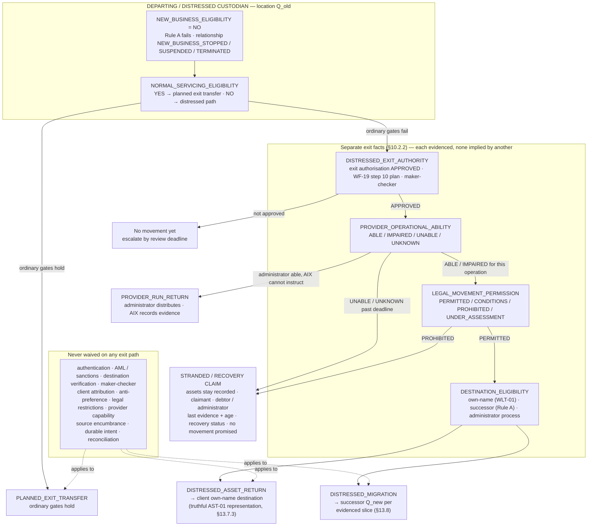

**Loss of new-business eligibility never by itself traps client assets — but DEC-015 does not claim
that exit is always possible.** Where the ordinary gates hold, the planned path runs; where they do
not, the distressed path runs **if and only if** the exit authority, provider ability, legal
permission and destination facts are established on evidence; where the provider is unable or the
movement is prohibited, AIX records a stranded / recovery claim (§10.2.3) and does not represent any
movement that has not occurred.

### 13.7 Distressed custodian exit (R3-F01)

#### 13.7.1 Scope

This section applies the §10.2.2 dimensions to custody. The same gate structure applies to fiat
provider exits (bank / PSP / settlement agent), with an `ACTIVE` successor pool in place of Rule A
and no AST-01 conjunct (STR-04A BNK-REQ-080…084).

#### 13.7.2 What a distressed exit does and does not require

| Requirement | Ordinary `WITHDRAWAL` | `DISTRESSED_ASSET_RETURN` / `DISTRESSED_MIGRATION` |
|---|---|---|
| Custodian approved for new business (Rule A) | No (Rule B) | No |
| WF-19 `approved` | Yes | **No** — `suspended` / `terminated` permitted; WF-19 step 10 exit plan required |
| Arrangement `VERIFIED` | Yes | **No** — `REVERIFICATION_DUE` / `BASIS_DEFEATED` accepted (the exit is the remedy) |
| Ordinary rail activation `ACTIVE` | Yes | **No** — an `EXIT_ONLY` routing entry for the distressed class instead (§35.6) |
| Exit authorisation `APPROVED` (scope incl. distribution basis) | No | **Yes** |
| Provider operational ability for this operation | Implicit | **Evidenced** (`ABLE` / `IMPAIRED`) |
| Legal movement permission | No restriction (§16.8) | **Evidenced** (`PERMITTED` / conditions met) |
| AST-01 C6 via WLT-01 (AIX-instructed return of an MB/PSO instrument) | Yes | **Yes** — by a truthful representation only (§13.7.3) |
| Authentication, AML / sanctions / Travel Rule, WLT-01 verify-and-consume, IAM-02 maker-checker, custodian-side approval, client attribution, legal restrictions, provider capability, source encumbrance, durable intent, submission profile, reconciliation | Yes | **Yes — never waived** |
| Anti-preference | Coverage `COVERED` after movement (§16.3) | §13.7.4 |
| Credentials (`WDR-FIND-001`) | Yes | Yes — revoked or unusable credentials mean `provider_exit_ability ≠ ABLE` for AIX-instructed classes |

#### 13.7.3 AST-01 representation of a return path (what must be proven; no AST-01 change made)

For an AIX-instructed return of an MB/PSO instrument, WLT-01 evaluates `WITHDRAWAL_MB_PSO` (C6).
DEC-015 no longer relies on keeping an approval in place. The candidate representations, each to be
**proven truthful** at the AST-01 compatibility disposition (§52.3 FI-AST-6, §56 step 4a):

| Route | Representation under AST-01 v1.8 | When usable | Proof required before AST-01 `PLAN_READY` |
|---|---|---|---|
| **R-AST-a — successor's row** | The successor's `APPROVED` row with `withdrawal_supported = true`; C6 is instrument-level on the v1.8 text | Once a successor is approved for (I, D) | Confirm C6's custodian-agnostic reading is AST-01's intended semantics, so WLT-01 may evaluate returns from the departing location against it |
| **R-AST-b — withdrawal-only support row** | A new `custody_support` row for the custodian of record of the existing assets with `deposit_supported = false`, `withdrawal_supported = true` (key columns are immutable, so this is a new row after the full-support row is `WITHDRAWN`; a short C6 gap occurs at the change) | Distressed, no successor | AST-01's governance must be able to **truthfully** approve such a row for a custodian that is not approved for new business — i.e., the row states only that existing holdings of (I, D) may be withdrawn. It occupies the one live slot, so it is replaced by a successor's row when one is approved (then R-AST-a) |
| **R-AST-c — none** | No `APPROVED` row can truthfully exist (e.g., AST-01's governance cannot approve a withdrawal-only row, the network is not `ACTIVE`, or the instrument is not withdrawable) | — | AIX-instructed return is **not** available; only `PROVIDER_RUN_RETURN` or a stranded claim. If the required distressed scenario cannot be met by R-AST-a / R-AST-b, **FI-AST-6 becomes a required controlled AST-01 change** (e.g., a return-only status outside `ux_ast1_custody_live` that satisfies C6 for `WITHDRAWAL_MB_PSO` only) before AST-01 `PLAN_READY` |

INV-01 (no `SECURITY` instrument in the MB/PSO path) applies to every route.

#### 13.7.4 Anti-preference in a distressed exit

1. Where each client's holding is separately attributed in the custodian's books (C1 per-client
   subaccount; a VA designated its own pool), each client is its own pool (§17.9 rule 2): returning
   that client's evidenced holding prefers no one.
2. Where holdings are pooled (C2 omnibus, shared address, shared underlying account) and the pool's
   coverage is not `COVERED`, or provider evidence cannot confirm the pool's full verified amount,
   outflows run only under the **distribution basis** approved in the exit authorisation — the
   administrator's evidenced allocation, or pro rata to evidenced claims — in slices that preserve
   that basis. **First-come returns are prohibited.**
3. A partial or failed slice never reallocates value between clients; it follows §13.8.

#### 13.7.5 Walk-through — already withdrawn, no successor (the Round-3 counterexample)

| Fact | State |
|---|---|
| Custodian | Lost new-business approval; WF-19 `suspended`; arrangement `REVERIFICATION_DUE`; its AST-01 row already `WITHDRAWN`; no successor |
| Law / provider | Return legally permitted; provider able to process returns with authenticated evidence |

1. `NEW_BUSINESS_ELIGIBILITY = NO`; `NORMAL_SERVICING_ELIGIBILITY = NO` (WF-19, verification, rail
   activation and C6 all fail). Under v0.3 every outflow was denied; under v0.4 the ordinary path is
   simply not the path used.
2. Exit authorisation `APPROVED` for `DISTRESSED_ASSET_RETURN` (scope: all clients at Q_old, asset I,
   distribution basis per §13.7.4); `EXIT_ONLY` routing opened; `provider_exit_ability = ABLE`;
   `legal_movement_permission = PERMITTED`.
3. Per client: WLT-01 verify-and-consume of the own-name destination, AML / sanctions / Travel Rule,
   client reservation at Q_old (§16.3), IAM-02 maker-checker, custodian-side approval, durable intent.
4. C6: if AST-01 truthfully approves a withdrawal-only row (R-AST-b), WLT-01's `WITHDRAWAL_MB_PSO`
   evaluation passes and the return proceeds per §13.8 slices. If it cannot (R-AST-c), AIX does
   **not** bypass WLT-01 / AST-01: the custodian returns assets itself under its documented return
   process (`PROVIDER_RUN_RETURN`, CUS-REQ-081 / -089), AIX supplying verified client details and
   recording each delivery as an observed outflow (§23.1); if neither is possible, the claim is
   stranded and FI-AST-6 is a required controlled change.
5. Insolvency with a moratorium, or a court order: `legal_movement_permission = PROHIBITED` ⇒
   `INACCESSIBLE`, stranded claim — `WIND_DOWN` never cures it.

#### 13.7.6 No corporate cover

Stranded or delayed custody value is never advanced, bridged or replaced from AIX corporate funds
(§19.4). Compensation is X5 only for an AIX-caused loss by governed decision; X6 only for a classified
shortfall under `EV-35`.

### 13.8 Exit and migration transfer accounting per evidenced slice (R3-F08)

v0.3 said a provider-confirmed departing leg was no longer a claim on the source pool (§17.4), while
row 53 kept the entitlement at the departing pool until receipt at the successor
(`04-review-r3.md` R3-F08). v0.4 applies one rule to every governed client-asset transfer between
pools — custodian migration, fiat rail / provider migration (§12 rule 2), and recovery receipts
(§10.2.3) — per **evidenced slice** (a provider-evidenced amount of one client's transfer).

| Slice state | Meaning | Source allocation (Q_old) | In-flight migration claim | Destination allocation (Q_new) |
|---|---|---|---|---|
| `NOT_SENT` | Durable intent only; nothing transmitted | Unchanged (client reservation protects it) | 0 | 0 |
| `SEND_UNKNOWN` | Possibly transmitted; no authoritative outcome | Unchanged until a source debit is evidenced | 0 | 0 |
| `SOURCE_DEBIT_CONFIRMED` | Authenticated source debit of q | −q | +q | 0 |
| `IN_FLIGHT_MIGRATION` | Debited, not yet received | — | q outstanding | 0 |
| `PARTIAL_DESTINATION_RECEIPT` | Authenticated receipt of r < q | — | q − r | +r |
| `DESTINATION_RECEIVED` | Authenticated receipt of q | — | 0 | +q |
| `DESTINATION_FAILED` | Authenticated failure / rejection at destination; value not received | — | stays (status failed) | 0 |
| `RETURN_CONFIRMED` | Authenticated return of t to source (or delivery to the client's own-name destination) | +t if back at Q_old | −t | — |
| `RECOVERY_OR_DISPUTE` | Neither received nor returned on evidence past the window | — | stays; recovery claim (§10.2.3) | — |

**Journals (client book; each single-book and balanced; linked by `migration_transfer_id` M).**

| Event | Journal(s) |
|---|---|
| Source debit q confirmed | Dr Entitlement(S, A, Q_old) q / Cr Pool Resource(Q_old, A) q **and** Dr Migration In-Transit Resource(M, A) q / Cr Client Migration In-Flight Claim(S, M, A) q |
| Destination receipt r | Dr Pool Resource(Q_new, A) r / Cr Entitlement(S, A, Q_new) r **and** Dr Client Migration In-Flight Claim(S, M, A) r / Cr Migration In-Transit Resource(M, A) r |
| Return t to Q_old | Dr Pool Resource(Q_old, A) t / Cr Entitlement(S, A, Q_old) t **and** Dr Client Migration In-Flight Claim t / Cr Migration In-Transit Resource t (a returned slice is the reversal of the client's own transfer, not a new placement under Rule A) |
| Delivery t to the client's own-name destination instead | Dr Client Migration In-Flight Claim t / Cr Migration In-Transit Resource t, on delivery evidence |

**Example (the review's case).** Old source 100; source debit confirmed 100; new custodian confirms
60; 40 in transit / disputed:

```
Entitlement(S, I, Q_old)            = 0       (consumed on authenticated source debit)
Entitlement(S, I, Q_new)            = 60      (credited only against the in-flight slice)
Client Migration In-Flight Claim(S) = 40      (status IN_FLIGHT_MIGRATION → RECOVERY_OR_DISPUTE past window)
Total client economic claim         = 100     (conserved)
Coverage: Q_old claims −100 / resources −100 · Q_new claims +60 / resources +60 · the 40 is outside both pools
```

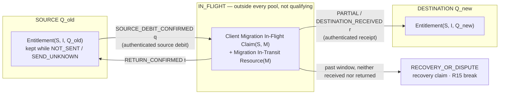

Rules:

1. **Failure before source debit** (`NOT_SENT`, `SEND_UNKNOWN`, authoritative no-execution): the
   source allocation is kept; `SEND_UNKNOWN` is resolved by query-back under the submission profile
   (§35.8.4), never by a blind resend.
2. **Source debited, destination failed:** the in-flight claim is kept explicitly (never silently
   returned to the source allocation or dropped) until `RETURN_CONFIRMED` or a recovery outcome.
3. **No credit at the destination without consuming the corresponding in-flight slice, and no
   source deduction without authenticated source-debit evidence.**
4. Transit / recovery claims **do not** count as qualifying safeguarding resources of any pool unless
   separately validated under the relevant evidence rule (`EV-25`, `EV-29` criteria); they are
   reported on their own safeguarding line (§17.8) and in R15.
5. A slice past its window is a REC-01 break (R15), escalated (INC-01), and a recovery claim; no
   corporate cover (§19.4).

---

## 14. Custody Fallback Hierarchy

| Order | Model | Use when |
|---|---|---|
| 1 | C1 — custodian client subaccount / identifiable entitlement + unique deposit address | Custodian supports per-client attribution |
| 2 | C1 with shared deposit address + memo/tag attribution | Per-client addresses unsupported for a network; attribution by tag |
| 3 | C2 — omnibus custody + AIX client sub-ledger | Custodian supports only pooled custody; conditions in §13.1 met and evidenced |
| — | Arrangement `CONTROL_ASSESSMENT_REQUIRED` (any unassessed §13.4.3 indicator) | **Not a fallback.** Not eligible as third-party custody until `EV-34` assesses it (§13.2) |
| — | AIX unilateral control (§13.4.2) | **Prohibited** unless separately approved (Doc 00 §8.2) |

Rules: the model is recorded per **custodian arrangement × instrument-network**; migration
between models or custodians is a **governed custodian-exit transfer** (§13.6) with reconciliation
before and after and per-slice accounting (§13.8), never a silent remap. During a custodian change,
**Rule A** (§13.5) governs what each location may accept and **Rule B** with the operation-class gates
(§10.2.2) governs how the departing location's existing assets are serviced, returned or migrated.
A departing custodian's loss of eligibility for new placements never **by itself** stops its client
assets from leaving under governance; where the custodian is unable or the movement is unlawful, a
stranded / recovery claim is recorded (§13.7). Under HD-DEC015-02 option A, AST-01 v1.8's sequenced
cutover pauses deposits and withdrawals of the instrument **only** during the single pre-scheduled
change window in which no `custody_support` row is `APPROVED` (§13.6).

---

## 15. Wallet / Address Model

| Object | Owner | Notes |
|---|---|---|
| Deposit address (inbound) | WLT-01 (assignment), custodian (generation) | Assigned to subaccount × instrument-network; never reassigned to another client; retired addresses still attribute late inbound funds or route them to unmatched |
| Shared address + memo/tag | WLT-01 | Missing/wrong tag ⇒ unmatched (§21.4, §22.3) |
| Withdrawal destination | WLT-01 (existing) | Unchanged: registration, screening, proof of control, cooling-off, decision verify-and-consume |
| LP settlement address/account (SSI) | LQD-01 | Counterparty's account; changes are maker-checker; never client-editable |
| Vault / wallet (infrastructure) | Custodian / infrastructure; described on the custody arrangement (owner per HD-DEC015-01) | Not a client identity; not a ledger account; its control facets are recorded per §13.4 |
| Instrument-network identity | AST-01 | Canonical identity (AST-01 v1.8 §3.11): `(chain, network, contract_address_canonical)` or `(chain, network)` |

**One wallet per client is not required** (HB-06). Unique deposit addresses are preferred for
attribution; the custodian's books and the AIX ledger — not the wallet topology — prove client
entitlement.

---

## 16. Accounting Truth vs External Asset Evidence

### 16.1 The principle (replaces "sole source of balances")

> **The AIX ledger is the authoritative source of platform accounting balances and accounting
> state. External bank, PSP, settlement-provider, custodian, blockchain and venue records are
> authoritative evidence of externally held assets, cash, reservations and settlement resources.
> Internal accounting and external resource evidence must reconcile.**

Nothing in this principle weakens double-entry, immutable journals, reversing-entry corrections or
LED-01's exclusive ownership of accounting balances (Module Index §19 rule 1; Doc 00 §10.8).

### 16.2 Division of authority

| AIX ledger (LED-01) owns | External provider evidence covers |
|---|---|
| Accounting entitlement per client × subaccount × asset × resource pool | Actual externally held fiat per pool / location |
| Available, blocked, reserved, pending, settled; deficits; in-flight claims | Actual externally held digital assets per custody pool / address |
| Fees, receivables, payables | External holds |
| Accounting settlement obligations and their state | External transfer and settlement status, finality |
| Accounting history | External balances and statements |

### 16.3 Usable-for-movement check — source-account-specific (preventive; R3-F06)

v0.3 required every outbound movement to reserve against a client's S × A × P available
entitlement. That is right for client-funded movements and wrong for pool-level sources: after X1 the
earned fee is pool-level AIX Fee Payable with no subaccount, and an unidentified receipt sits in
suspense with no identified client (`04-review-r3.md` R3-F06). v0.4 makes the encumbrance follow the
**source account that actually pays**.

**Every external outbound movement declares** (in its durable intent, §18.3 rule 7):

| Field | Meaning |
|---|---|
| `source_account_type` | `CLIENT_ENTITLEMENT` / `POOL_FEE_PAYABLE` / `SUSPENSE_ITEM` / `POOL_EXCEPTION_ITEM` / `CORPORATE_ACCOUNT` |
| `source_account_id` | The S × A × P entitlement account; the P × A AIX Fee Payable account; the `suspense_item_id`; the exception item; or the corporate account |
| `resource_pool_id`, `external_location_id` | The pool and executing location (corporate: the corporate location) |
| asset, amount | Single asset; no FX (§10.6) |
| `authority_ref` | The evidenced authority relied on: client instruction / mandate; `COLLECT_DISCLOSED_FEE` terms; governed return-to-source decision; exit authorisation; corporate approval |
| `encumbrance_type`, `encumbrance_id` | `CLIENT_RESERVATION` / `FEE_PAYABLE_COLLECTION` / `SUSPENSE_ITEM_ENCUMBRANCE` / `EXCEPTION_ITEM_ENCUMBRANCE` / `CORPORATE_SOURCE_CONTROL` |
| `operation_class` | §10.2.2 (ordinary or distressed) |

**Source-specific rules.**

| Source | Typical movements | Encumbrance (atomic, unique per instruction) | Authority | Pool | Consumed by | Never |
|---|---|---|---|---|---|---|
| `CLIENT_ENTITLEMENT` (S × A × P) | Withdrawal; settlement leg; payment; subscription; client-funded refund or payout; per-client exit / migration slice; CDA-1 closure return | `CLIENT_RESERVATION` against S × A × P available (LED-01 CAS, §18) | Client instruction / mandate; product authority; exit authorisation for distressed classes | Selected under §9.6.3 | Dr Client Entitlement / Cr Pool Resource on provider evidence (or the in-flight claims of §17.4 / §13.8) | — |
| `POOL_FEE_PAYABLE` (P × A) | Fee sweep (X2) | `FEE_PAYABLE_COLLECTION` against the pool's AIX Fee Payable **available to collect** (posted payable − open collection encumbrances) | `COLLECT_DISCLOSED_FEE` with source, timing, maximum and consent terms (§20.10) | The payable's own pool — no selection | **X2, once**: Dr AIX Fee Payable / Cr Pool Resource (client book) and Dr AIX Cash / Cr Fee Receivable (corporate book) | Any reservation against a client entitlement — X1 already moved the earned fee out of S's entitlement, consuming the fee portion of S's own reservation; a second client debit is impossible by construction |
| `SUSPENSE_ITEM` (one identified receipt item at P × A) | Return-to-source of an unmatched / unidentified receipt; AML-directed return | `SUSPENSE_ITEM_ENCUMBRANCE` on that item (amount ≤ item remaining) | Governed return decision (DEP-01 case; AML-01 clearance or direction; maker-checker) | The item's own pool (§9.6.3 rule 5) | Dr Client Suspense (item) / Cr Pool Resource | Fabricating a client entitlement or subaccount balance for an unidentified owner |
| `POOL_EXCEPTION_ITEM` | Return of an LP-delivered asset held blocked (§19.5); payment of a post-seal amount owed to a legal entity (§51.4); a governed reclassification of Unallocated / Excess to a proven owner (§17.2 rule 8) | `EXCEPTION_ITEM_ENCUMBRANCE` on that item | Governed resolution (maker-checker) | The item's own pool | Dr Pool Exception (item) / Cr Pool Resource | Treating excess as AIX money by default |
| `CORPORATE_ACCOUNT` (CORPORATE book) | X3 refund into a pool; X4b; X5; X6; AIX's own payments | `CORPORATE_SOURCE_CONTROL` (TRE-01 corporate reservation / treasury approval) | TRE-01 and the event's approval (§16.4) | Corporate location | Corporate-book journal; the client-book inbound leg only on provider receipt | Funding, advancing or bridging any client obligation (§19.4) |

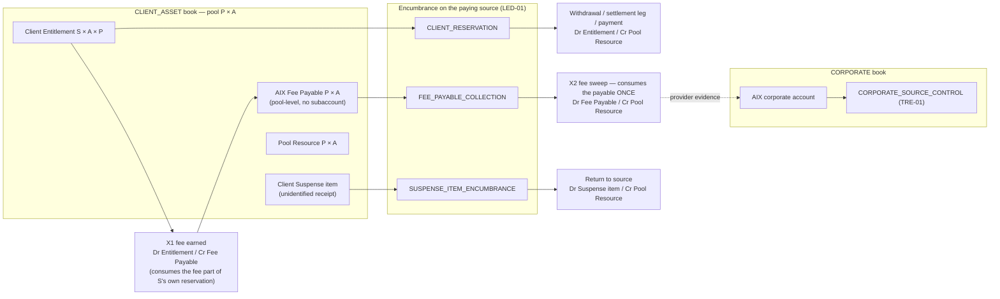

No fee sweep or suspense return ever passes through a client reservation: the fee left S's entitlement
once, at X1; an unidentified receipt never had an entitlement.

**Common preventive controls — every source type.** An outbound movement of asset A from pool P
(location L ∈ P) may proceed only when **all** hold:

1. The declared encumbrance is held atomically by LED-01 (by TRE-01 for corporate sources) and is
   unique to this instruction — the duplicate-spend control for that source.
2. **Fresh, authenticated, movement-scoped provider evidence** for P × A (and for L where the
   allocation mode needs it) is within the freshness policy that applies to **this** movement (§16.7).
   Missing freshness configuration denies.
3. **Coverage.** For a client-book outflow the coverage outcome for P × A after the movement must be
   `COVERED` (§17.2); `SHORTFALL` and `UNDETERMINED` deny. A pool-level outflow reduces a claims-side
   or deducted amount and Pool Resource equally, so it leaves client coverage unchanged by
   construction — **nonetheless, while P × A is `SHORTFALL` or `UNDETERMINED`, fee sweeps and other
   outflows that do not benefit clients are denied** (AIX never prefers itself, §17.9), and suspense /
   exception returns run only as a governed exception (e.g., an AML-directed or legally required
   return).
4. No open reconciliation break of severity ≥ the configured blocking threshold covers P × A, the
   source account or the item.
5. Where §10.3 or §18 requires it, the provider hold is **bound** to the client reservation.
6. The **operation-class gate** holds (§10.2.2): for ordinary classes — arrangement `VERIFIED`,
   allocation mode not `UNSUPPORTED`, rail `ACTIVE` for the class, `operating_state` /
   `servicing_mode` permitting it, (custody) §13.5 Rule A (placements) or Rule B (outflows); for
   distressed classes — §13.7.
7. No legal restriction applies to the amount: S's client-specific restriction is outside S's
   available amount (§7.4); no pool-wide restriction (§16.8) covers P × A for this operation; no AML or
   legal hold is on the suspense / exception item.
8. A durable intent naming every declared field exists before transmission (§18.3 rule 7), and the
   submission follows the arrangement's submission profile (§35.8.4).
9. Reconciliation covers the source: R1 / R2 (pool), R8 (fee payable and sweep), R1 suspense line,
   R14 (intent ↔ outcome), R15 (exit).

### 16.4 Book separation and the cross-book events (R2-F12)

Every journal is **single-book** and **balanced** (debits = credits, per asset). A **cross-book
event** is an explicit, enumerated pair of linked single-book journals sharing a
`cross_book_event_id`. **No other journal may touch both books.** Account names are canonical
categories (§9.3), not final LED-01 schema.

Sign convention (client book, per P × A): **Pool Resource**, **Client Deficit**, **Pool Receivable
from AIX** and debit-balance **Pool Exception** are debit-balance accounts (what the pool holds or
is owed); **Client Entitlement**, **Client Suspense**, **Unallocated / Excess External Resource**,
**AIX Fee Payable** and credit-balance **Pool Exception** are credit-balance accounts (who the pool's
resources belong to).

| # | Cross-book event | Client-book journal (Dr / Cr) | Corporate-book journal (Dr / Cr) | Evidence required |
|---|---|---|---|---|
| X1 | **Fee earned** (§20) | Dr Client Entitlement (S × A × P) / Cr AIX Fee Payable (P × A) | Dr Fee Receivable / Cr Fee Revenue | **Internal evidence**: earning event (fill, payment completion, allotment) + disclosed fee record; **and** the pool's `aix_instruction_authority` includes `COLLECT_DISCLOSED_FEE` (§20.10). No money moves |
| X2 | **Fee sweep** (§20) | Dr AIX Fee Payable (P × A) / Cr Pool Resource (P × A) | Dr AIX Cash / Cr Fee Receivable | Provider confirms transfer from P to the AIX corporate account, instructed under `COLLECT_DISCLOSED_FEE` against a `FEE_PAYABLE_COLLECTION` encumbrance (§16.3). **Consumes the payable once; no client reservation** |
| X3 | **Fee refund / reversal after sweep** | Dr Pool Resource / Cr Client Entitlement (S × A × P) | Dr Fee Revenue (or Refund Expense) / Cr AIX Cash | Provider confirms transfer from AIX corporate account into P. Before sweep a refund is the reversal of both X1 journals under the same `cross_book_event_id` |
| X4a | **AIX-borne provider charge — recognition** (§20.9) | Dr Pool Receivable from AIX (P × A) / Cr Pool Resource (P × A) | Dr Provider Fees Expense / Cr Payable to Client Pool (P) | Authenticated provider debit of P, classified as a charge AIX agreed to bear (§23.1) |
| X4b | **AIX-borne provider charge — reimbursement** | Dr Pool Resource / Cr Pool Receivable from AIX | Dr Payable to Client Pool / Cr AIX Cash | Provider confirms transfer from AIX corporate account into P |
| X4c | **AIX-borne provider charge — settled from AIX-owned money already in P** (alternative to X4b) | Dr AIX Fee Payable (P × A) / Cr Pool Receivable from AIX | Dr Payable to Client Pool / Cr Fee Receivable | Internal evidence: an AIX Fee Payable balance already posted by X1 at the same P × A ≥ the charge. Uses **only** AIX money proven by X1; never Unallocated / Excess External Resource and never for any client's deficit |
| X5 | **Compensation for an AIX-caused client loss** | Dr Pool Resource / Cr Client Entitlement (S × A × P) | Dr Compensation Expense / Cr AIX Cash | Provider confirms transfer; approved error case |
| X6 | **Safeguarding shortfall restoration** (§17.5) | Dr Pool Resource (P × A) / Cr Client Deficit (S × A × P) — restores the pool and discharges the pool's receivable from S; **never** credited to S's entitlement | Dr Operational Exposure Receivable from S / Cr AIX Cash | Provider confirms transfer; coverage `SHORTFALL` **classified** to S's deficit (§17.5); **only where `EV-35` establishes the rule**; separately governed corporate-loss / remediation decision; maker-checker; after the fact |
| X7 | **Recovery from client resources of an evidenced AIX receivable** (after X6, §19.5) | Dr Client Entitlement (S × A × Q) / Cr Pool Resource (Q × A) | Dr AIX Cash / Cr Operational Exposure Receivable from S | Provider confirms transfer from S's pool Q to AIX; **application authority** — a contractual set-off / application basis or S's instruction (`EV-31`, `EV-37`), distinct from any restraint authority (§17.9.1); a `CLIENT_RESERVATION` on S × A × Q (§16.3); maker-checker. Never from another client's entitlement |

Single-book events that complete the picture (no cross-book effect):

| Event | Client-book journal |
|---|---|
| Recall / reversal exceeding S's entitlement (§17.5) | Dr Client Entitlement (S, up to its balance) + Dr Client Deficit (S, remainder D) / Cr Pool Resource (full reversed amount) |
| Recovery from S into P before any X6 | Dr Pool Resource / Cr Client Deficit |
| Unattributable provider outflow (§23.1) | Dr Pool Exception / Cr Pool Resource |
| Unexplained excess found by reconciliation (§17.2) | Dr Pool Resource / Cr Unallocated / Excess External Resource |
| Suspense-item return to source (§16.3, §21.4) | Dr Client Suspense (item) / Cr Pool Resource |
| Exit / migration slice — source debit, destination receipt, return (§13.8) | Per §13.8: each a pair of balanced single-book journals linking source pool, Migration In-Transit Resource, Client Migration In-Flight Claim and destination pool |

**A client book can never be credited from corporate funds to make a trade settle, to fund a
reservation, or to bridge a delayed client leg** (HB-10; §19.4). X4–X7 are after-the-fact,
approved, evidenced remediation or recovery events and are never a settlement mechanism. X6 extends
no credit for any new client activity: the deficit client's scope stays frozen (§17.9).

### 16.5 Client display

The client portal (PRT-01) and statements (RPT-01) show the **accounting balance** with its states
and, per pool / location, **where** it is held and by whom (provider and holding structure, as
verified), using wording that never states or implies that AIX holds, owns or possesses the funds
unless the pool's rail is F3 (and then: "held by AIX in a designated client-money account at
<bank>"). In-flight claims are shown as "awaiting delivery / settlement", never as an asset held.
Exact copy is a Fable task (UX copy), not decided here.

### 16.6 Worked example — mismatch

```
AIX client claims at pool P (USD) = 1,000   (Σ entitlements + suspense + unallocated excess)
Fresh, authenticated provider evidence for P (USD) = 900   (existence verified, within policy)
→ coverage outcome at P × USD: SHORTFALL 100 (§17.2) — evidenced, not inferred
→ REC-01 opens a RECONCILIATION BREAK (pool P, USD, −100)
→ classify the cause (§17.5, §16.8):
     · attributable to client S (recall / reversal / S's direct debit beyond entitlement)
         → S's entitlement ↓ (never below 0), remainder = Client Deficit of S;
           S's affected scope at P × A frozen; S's new risk-taking denied; any cross-pool
           restraint of S's other property only with evidenced authority (§17.9)
     · not attributable (provider error, unexplained, pool-wide encumbrance)
         → Pool Exception / investigation
→ outbound USD from P blocked for every client while the outcome is SHORTFALL — because P's
  resources are fungible, any outflow would prefer the first mover (anti-preference, §17.9);
  other pools unaffected
→ investigation (REC-01 case, maker-checker)
→ resolution is a governed LED-01 reversing/adjusting entry with evidence, recovery from S, a
  provider correction, or (only under EV-35, by separately governed decision) a restoration X6
→ no silent balance adjustment; displayed balance carries "under review", not a new number

Contrast — same pool, provider balance API down (no fresh evidence; last verified = 1,000):
→ coverage outcome UNDETERMINED (not SHORTFALL); no break for a missing amount, an evidence-gap
  alert instead; movements needing fresh evidence wait; nothing is reported as lost; X6 is never
  considered (§16.8)
```

### 16.7 Evidence authority — preventive vs detective (R15)

| Evidence | Owner | Role | Authority for |
|---|---|---|---|
| LED-01 accounting state (entitlement, allocation, reservation incl. hold binding) | LED-01 | **Current operational authority (internal)** | Concurrency; accounting availability; double-spend prevention inside AIX |
| Movement-scoped provider read (authenticated, taken through the provider adapter for the module performing the movement, within the freshness policy for that movement) | Movement owner (WDR-01 for outbound transfers; the reservation requester for holds and trade funding) | **Current operational authority (external resource)** | Pre-execution sufficiency and coverage (§16.3 steps 2–3) |
| Provider hold confirmation, bound to the reservation | Reservation requester (hold instruction owner, §18.1) → LED-01 (binding) | **Current operational authority (external encumbrance)** | Whether resources are externally held for this purpose |
| Authenticated provider transaction events (receipts, debits, returns, recalls) | DEP-01 / WDR-01 (§35.7) | **Operational facts** | Postings (via governed instruction to LED-01) |
| REC-01 statements and scheduled snapshots | REC-01 | **Historical / detective** | Reconciliation, breaks, safeguarding reports |
| LED-01 internal balance snapshot (LED-01 v1.1 §5.17 rule 2, `LED1-FR-027`) | LED-01 | Reporting artefact | **Never** a reservation or sufficiency input |

Rules:

1. A preventive decision **never** uses a REC-01 snapshot or statement as its sufficiency input.
   REC-01's ingestion is not on the movement critical path.
2. A preventive decision **does** read REC-01's open-break status as a deny input (a blocking
   break fails the movement closed). REC-01 output can stop a movement; it can never authorise one.
3. If the fresh provider read and the latest REC-01 evidence for the same pool disagree beyond
   the configured tolerance, after adjusting for movements between their timestamps: **fail
   closed** where the difference is material for the movement; REC-01 opens a break; **neither
   value is chosen for convenience** and the larger value is never used to justify a movement.
4. Terminology: "provider read" (movement-scoped, operational), "statement / scheduled snapshot"
   (REC-01, detective) and "balance snapshot" (LED-01, reporting) are three different artefacts
   and must not share a name in any blueprint.
5. **Freshness policy dimensions (R2-F18).** A freshness policy entry is keyed by **provider ×
   resource type (fiat account / VA / custody subaccount / omnibus pool / address) × asset ×
   resource pool × operation type (Spot or OTC funding, withdrawal, settlement leg, fee sweep,
   exit transfer, safeguarding report, end-of-day reconciliation) × risk tier (amount band, client
   or counterparty risk) × provider capability (real-time balance API, event-driven, statement
   only) × observation method (push event, on-demand read, scheduled statement)**. A Spot trade's
   resource check may require evidence seconds old where the provider offers it; end-of-day
   reconciliation may accept the day's statement. Several dimensions may be wildcarded by
   configuration; **the most specific matching entry applies**, and the absence of any matching
   entry denies.
6. **Unknown or stale beyond policy fails closed for the operation that needs freshness** — and
   only for that operation. It makes the pool's coverage outcome `UNDETERMINED` for safeguarding
   purposes only where the safeguarding freshness policy itself is exceeded (§16.8); it never
   changes the recorded resource amount.

### 16.8 Resource existence, freshness, usability and restriction — separate facts (R2-F02)

v0.2 counted only "authenticated, **fresh**" evidence as qualifying and made a pool whose rail was
not `ACTIVE` contribute **zero**, so a provider API outage, a stale read, a suspended rail or one
client's garnishment reported a pool-wide safeguarding shortfall and could trigger X6
(`04-review-r2.md` R2-F02). v0.3 records six separate facts for each P × A (and, where the
allocation mode needs it, per location):

| # | Fact | Values | Answers | Changed by |
|---|---|---|---|---|
| 1 | **Resource existence / verified amount** | Last authenticated, provider-evidenced amount and its observation time | How much is there, as last proven | New authenticated evidence only. **Never** reduced by an outage, staleness, suspension or a client-specific order |
| 2 | **Resource evidence freshness** | `FRESH` / `STALE` (beyond the applicable policy, §16.7 rule 5) / `UNOBTAINABLE` (provider API or channel unavailable) | Can the amount be relied on **now** for this purpose | Time and evidence arrival |
| 3 | **Operational usability** | `USABLE` / `PROVIDER_UNAVAILABLE` / `RAIL_SUSPENDED` / `WIND_DOWN(servicing_mode)` / `LOCATION_SUSPENDED` / `PROVIDER_OPERATIONAL_FREEZE` / `INACCESSIBLE` (provider unable or movement prohibited, §10.2.2) | Can the provider act on an instruction for this operation now | Provider status, live-routing state (§35.6), operating state (§10.2.1), exit facts (§10.2.2) |
| 4 | **Legal restriction — pool-wide** | `NONE` / `RESTRICTED(amount, scope, evidence)` / `UNDER_ASSESSMENT` | Is a third-party claim against AIX, the account holder or the account as a whole encumbering resources (legal order against AIX, set-off by the bank for AIX's liabilities, freeze of the whole account) not proven subordinate to client ownership (`EV-32`) | Authenticated notice + legal assessment |
| 5 | **Client-specific restriction** | Per S × A × P: restricted amount, order reference, evidence | Is a legal order / garnishment / freeze directed at **one client's** interest | Authenticated notice attributable to S |
| 6 | **Settlement eligibility** | Derived per operation | May this pool be the source of this movement now | Derived from 1–5 + §16.3 |

**How each fact affects movement and safeguarding:**

| Event | Recorded amount (fact 1) | Movement | Coverage outcome (§17.2) | Escalation |
|---|---|---|---|---|
| Provider API unavailable | Unchanged (last verified) | Operations needing fresh evidence wait (fail closed) | `UNDETERMINED` only once the **safeguarding** freshness policy is exceeded; `COVERED` stands while the last verified evidence is within it | Ops alert; INC-01 past threshold; **evidence-gap** report line, not a shortfall |
| Evidence stale beyond policy | Unchanged | Denied for the operations whose policy is exceeded | As above | Force movement-scoped read; REC-01 break only if it persists past its own threshold |
| Rail / location suspended, provider operational freeze, wind-down | Unchanged | Only what the operating state / servicing mode and the operation-class gate permit (§10.2.2) | Unchanged (`COVERED` if it was) | Per §10.2.1 |
| Provider relationship terminated; location `INACCESSIBLE` (provider unable, insolvency, movement prohibited) | Unchanged (last verified, with evidence age) | None by AIX instruction; provider-run return recorded when evidenced | `UNDETERMINED` once the safeguarding freshness policy is exceeded or while the legal basis is under assessment (`EV-14`); `SHORTFALL` only on authenticated evidence that resources left or are legally unavailable to clients | Recovery claim (§10.2.3); Management + Compliance + Legal; INC-01 |
| Legal order / garnishment against **one client** S | Unchanged | S's restricted amount is `Blocked` on S's entitlement (§7.4); other clients unaffected | Unchanged — S's claim and the money backing it are both still there | Compliance + Legal; client-scoped |
| Pool-wide legal restriction (order against AIX or the whole account; set-off for AIX's liabilities) | Unchanged | No outflow of the restricted resources | Restricted resources excluded from qualifying resources **until `EV-32` evidence proves them subordinate to client ownership**; outcome `SHORTFALL` if claims then exceed the rest, or `UNDETERMINED` while the scope is `UNDER_ASSESSMENT` | Compliance + Legal + Management |
| Provider **executes** an order or set-off (money actually leaves P) | **Reduced** on authenticated debit evidence | §23.1 observed-outflow path | Recomputed on the new verified amount; attributable to S ⇒ S's entitlement ↓ (deficit if excess); not attributable ⇒ Pool Exception | Per §23.1 |
| Fresh evidence shows less than claims | **Reduced** | Pool blocked (§17.9) | `SHORTFALL` | Break; classify cause (§17.5) |

**Fail-closed without false accounting.** Uncertainty stops the movements that depend on certainty;
it does not invent a loss. A loss is recorded only from authenticated evidence that resources left
or are legally unavailable to clients.

**AIX corporate money is never triggered by uncertainty.** X6 (and any other company-funded
remediation) is never triggered because a provider API is unavailable, evidence is stale, a rail
is suspended, a location is winding down, or a client-specific legal order exists. Required order:
**freeze the affected operation → investigate → reconcile → classify any actual shortfall**; only
a classified, evidenced `SHORTFALL` may then be considered for X6, and only under `EV-35` and a
separately governed corporate-loss / remediation decision that is never client financing (§17.5).

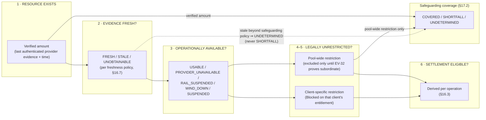

A stale read, an outage or a suspension sits in boxes 2–3: it can stop a movement (box 6) and make
coverage `UNDETERMINED`; it can never reduce box 1 or produce `SHORTFALL`.

---

## 17. Safeguarding Model

### 17.1 What the invariant protects

Each client's **positive** claim on externally held client assets must be backed by **verified,
qualifying external resources in the same resource pool and the same asset**. A negative position
of one client, a receivable from anyone, or an expected settlement can never reduce what another
client is owed or stand in for missing resources.

### 17.2 Coverage rule (per asset × external resource pool)

For every asset (or currency) **A** and every external resource pool **P** in the `CLIENT_ASSET`
book:

```
ClientClaims(A, P)        =  Σ over (client c, subaccount s) of  max( entitlement(c, s, A, P), 0 )
                           +  ClientSuspense(A, P)
                           +  UnallocatedExcessExternalResource(A, P)   (unknown owner — claims side)
                           +  PoolException_credit(A, P)               (post-seal inflows owed to a
                                                                        legal entity, §51.4)

QualifyingResources(A, P) =  VerifiedAmount(A, P)        (fact 1, §16.8 — last authenticated
                                                          provider evidence; not reduced by
                                                          staleness, outage, suspension or wind-down)
                           −  AIX-owned amounts proven in P (AIX Fee Payable posted by X1)
                           −  pool-wide restricted resources (§16.8 fact 4) not yet proven
                              subordinate to client ownership (EV-32)
                           −  0 for every client-specific restriction (§16.8 fact 5 — the
                              restricted money still backs that client's still-existing claim)
                           (= 0 where the pool's legal basis is not established or is defeated —
                              §17.7)

Outcome(A, P) =
   SHORTFALL      if  ClientClaims > QualifyingResources on authenticated evidence (fresh, or the
                      latest evidence where that evidence itself showed the shortfall), or where
                      §17.7 sets resources to zero
   UNDETERMINED   else if the latest verified evidence is beyond the safeguarding freshness policy,
                      a pool-wide restriction is UNDER_ASSESSMENT, the arrangement is
                      REVERIFICATION_DUE, or a §16.7 rule 3 evidence conflict is unresolved
   COVERED        otherwise
```

`UNDETERMINED` denies movement exactly as `SHORTFALL` does (fail closed) but **is not a
shortfall**: it is reported as an evidence / verification gap with its own escalation, it never
triggers X6 or any corporate funding, and it never freezes a client's entitlement (R2-F02).

Binding rules:

1. **No negative-liability netting.** Each client × subaccount term is floored at zero. A client
   entitlement may never be negative (Module Index v1.4 l.793 `client_negative_balance =
   prohibited`); a negative term reaching this computation is itself a **critical break**, never an
   offset. The floor is applied at client × subaccount (the finest level), so no subaccount's
   deficit reduces another subaccount's claim — this assumes no answer to `A2-Q2`.
2. **Negative positions are separate.** A client's debt, shortfall or receivable is recorded as
   **Client Deficit** (§17.5) and is on **neither** side of the coverage rule. It is an exposure,
   pursued against that client, never a negative safeguarding liability.
3. **Per pool, per asset, never pooled across.** Coverage is evaluated per P × A. A surplus in
   pool P1 never covers a shortfall in pool P2. Resources are in the same pool only if legally and
   operationally fungible on the evidence (§9.6.1); otherwise they are different pools **by
   definition**.
4. **No cross-currency / cross-asset netting.** A is a single currency or instrument.
5. **Legal safeguarding pools.** The same rule is evaluated per legal safeguarding pool G (Σ over
   P ∈ G) for regulatory reporting. G-level coverage **never substitutes** for P-level coverage, and
   one G never covers another G unless an explicit, evidenced lawful/resource relationship exists
   (`EV-06`, `EV-07`) — and even then movement between them is a governed transfer.
6. **Aggregate views are reports only.** The per-asset aggregate (Σ over all P) is a safeguarding
   report line (§34 R9). It is never used to decide a movement, and a shortfall in any P remains a
   shortfall regardless of aggregate surplus.
7. **AIX money in a client pool is not a client resource.** AIX Fee Payable posted by X1 (§20) is
   deducted from qualifying resources, so AIX's own money can never mask a client shortfall and
   later be swept away. **It is never applied to any client's deficit** except through X6 under
   `EV-35` (R2-F07); it may settle only an AIX-borne provider charge at the same P × A (X4c).
8. **Excess is not ownership (R2-F07).** Provider-evidenced resources above every recorded claim
   and AIX-owned amount are **Unallocated / Excess External Resource** until provenance, ledger
   classification and the legal account structure prove whose they are. They sit on the claims
   side, so they neither mask a shortfall nor become AIX's by default; releasing them to anyone is
   a governed, evidenced reclassification.
9. **Ledger identity (always holds by double entry, per P × A — §16.4 sign convention):**

   ```
   PoolResource + ClientDeficit + PoolReceivableFromAIX + PoolException_debit
     = Σ Entitlement(·,·,A,P) + ClientSuspense + UnallocatedExcessExternalResource
       + AIXFeePayable + PoolException_credit + Residual
   ```

10. **Reconciliation identity (separate from coverage, §34 R1/R2):**
    `VerifiedAmount(A, P) − PoolResource(A, P) = Unexplained(A, P)`. A non-zero unexplained
    difference is a break even when coverage is `COVERED`; an excess becomes Unallocated / Excess
    External Resource only by a governed posting after investigation, a deficiency is classified
    under §17.5.

### 17.3 Separate treatment of each component

| Component | Coverage side | Condition / treatment |
|---|---|---|
| **Settled client asset claims** (entitlement incl. blocked and reserved parts) | Claim on P | Floored at zero per client × subaccount |
| **Pending outbound** (instructed, not yet provider-debited) | Still a claim on P; resources still in P | Covered as part of entitlement until the provider confirms the debit |
| **Client Suspense** (confirmed, unattributed) | Claim on P | Client money of unknown owner |
| **Verified external safeguarded resources** | Resource of P | Authenticated provider evidence (verified amount, §16.8 — freshness affects the outcome's certainty, not the amount), arrangement `VERIFIED`, designation evidenced, allocation mode not `UNSUPPORTED` |
| **Custodian-held client assets (C1/C2)** | Resource of P | Authenticated custodian evidence attributing to the client or to the segregated client pool; chain evidence is corroboration only |
| **Pending deposit** (notice, unconfirmed bank credit, unconfirmed on-chain receipt) | Neither | Not a resource and not a claim until provider-confirmed |
| **In-flight client settlement claims** (§17.4) | **Neither side of any pool** | Measured in the settlement-exposure view |
| **In-flight migration claims / Migration In-Transit Resource** (§13.8) | **Neither side of any pool** | Reported on their own line; never qualifying unless separately validated (`EV-25`, `EV-29` criteria) |
| **Stranded entitlements** (location `INACCESSIBLE`, §10.2.3) | Still a claim on P; resource at the last verified amount | Coverage per §17.7; recovery claim recorded; expected recoveries are **never** a resource |
| **Verified settlement resources / receivables** (amount due from an LP, settlement agent or escrow on an executed obligation) | **Not a qualifying resource** | May enter a coverage view only where explicitly, externally validated legal/contractual criteria are proven (`EV-29`: e.g., held on trust for the client, segregated at the counterparty, or released only against delivery by an independent agent). **Until proven: fail closed — counted as zero** |
| **Counterparty receivables** (one-leg exception, LP default) | **Not a resource** | Exposure; loss allocation per `EV-30`/`EV-31` (§33.3) |
| **One-leg settlement exposure** | **Not a resource** | Exposure past window; break |
| **Unsecured LP receivable, unconfirmed asset, unconfirmed bank credit, expected settlement** | **Never a resource** | — |
| **AIX corporate money**, at the same provider or anywhere | **Never** | Different book |
| **Client Deficit** | **Neither** | §17.5 |
| **AIX Fee Payable held in P** | Deducted from resources | §17.2 rule 7 |
| **Unallocated / Excess External Resource** | Claim on P (unknown owner) | §17.2 rule 8 — never AIX-owned by default |
| **Pool Receivable from AIX** (X4a) | **Not a resource** | Receivable; restored only by X4b / X4c |
| **Client-specific restricted amount** (order against one client) | Still a claim of that client and still backed | `Blocked` on that client's entitlement (§16.8) |
| **Pool-wide restricted resources** | Excluded from resources until `EV-32` proves them subordinate | §16.8 fact 4 |
| **Resources whose evidence is stale / unobtainable, or whose rail / location is suspended or winding down** | Resource at the last verified amount | Coverage `UNDETERMINED` only past the safeguarding freshness policy (§16.8) |
| **Rounding residuals** | Reconciliation identity | Per LED-01 residual-account policy; bounded; never revenue |
| **Provider adjustments** (charges debited to P) | Reduce resources when evidenced | Attributed to a client per agreement, or to AIX with reimbursement X4 |

### 17.4 In-flight settlement (two-leg trades)

When a client-funded leg leaves its pool (provider-confirmed debit) before the counter-leg
arrives, the client's value is **no longer a claim on that pool** and **not yet a claim on any
other pool**. It is an **In-flight Client Settlement Claim** on the obligation (§9.3), measured in
a separate **settlement-exposure view**:

```
SettlementExposure(counterparty K, asset due A')  =  Σ in-flight claims on obligations with K for A'
                                                   −  QualifyingSettlementResources (EV-29; zero until proven)
```

| Phase | Settlement-exposure treatment |
|---|---|
| Within the obligation's configured settlement window | **Reported**, counted against configured counterparty settlement-exposure limits (LQD-01), visible in the safeguarding report as an explicitly unprotected in-flight amount. **Not** a pool shortfall, so it does not freeze the pool (LED-01 v1.1 §5.19 rule 7 applies to pool coverage, not to this view) |
| Pre-trade | A new obligation that would breach the counterparty or client settlement-exposure limit is **refused** before execution (OMS-01 check; preventive) |
| Past the window | `settlement_exception`; REC-01 break; INC-01 escalation per threshold; no further legs for that obligation without approval |
| Counter-leg received | Claim converts into entitlement at the receiving pool (S × A' × Q) on authenticated receipt; exposure falls |

Whether the client-money regime permits unprotected in-flight value at all, and for how long, is
an external validation item (`EV-07`, `EV-29`) with trigger **LCF / LCA**: until answered, no
live cash-first or asset-first pattern runs for client money in PRODUCTION.

**Scenario walk-through (each against §17.2 and §17.4):**

| Scenario | What happens to claims, resources and exposure |
|---|---|
| **Cash-first buy** (USD 1,000 at P, asset X due from LP K) | Reserve: claim and resource both in P (covered). Instruct: unchanged. Provider confirms debit: entitlement(S, USD, P) −1,000 and Pool Resource(P) −1,000 (P coverage unchanged); in-flight claim(S, X, O) +; exposure(K, X) +. Custodian confirms X at pool Q: in-flight claim → entitlement(S, X, Q); Pool Resource(Q) +; exposure − |
| **Asset-first sell** (X at Q, USD due from K) | Asset reserved at Q (custodian hold/policy lock where supported, §18.7). Custodian confirms delivery: entitlement(S, X, Q) −; Pool Resource(Q) −; in-flight claim(S, USD, O) +. Provider confirms USD into P: claim → entitlement(S, USD, P); Pool Resource(P) + |
| **One-leg-complete past window** | In-flight claim stays recorded, `settlement_exception`, break, escalation. Not a resource; no corporate cover (§19.4); claim holder and loss bearer per `EV-30`/`EV-31` (§33.3) |
| **Bank recall after credit** | §17.5. Recall reduces Pool Resource(P); S's entitlement is reduced up to its amount; any excess becomes Client Deficit — never a negative entitlement, never offset against another client |
| **Custodian reversal** | As bank recall, for asset A at pool Q |
| **Exit / migration slice** | Not a settlement obligation: §13.8 per-slice states and journals; the in-flight migration claim is outside every pool |
| **Counterparty default** | In-flight claims on K's obligations become counterparty-default exceptions; exposure crystallises; **no automatic** client write-down and **no automatic** AIX corporate cover; resolution only under the validated loss-allocation rule (`EV-31`) by maker-checker (§33.3, §40 row 46) |

### 17.5 Negative positions — Client Deficit and pool shortfall

An externally imposed event (bank recall after the funds were used, custodian reversal, chain
reorganisation below finality, provider correction, a client's direct debit beyond its
entitlement) can remove resources from P that S has already spent. Then:

1. LED-01 reduces S's entitlement at P by the reversed amount **up to that entitlement** (never
   below zero) and records the remainder **D** as **Client Deficit** (S × A × P) — Dr Client
   Entitlement + Dr Client Deficit / Cr Pool Resource (§16.4). The client entitlement is never
   negative.
2. Pool Resource(P) falls by the full reversed amount, on authenticated evidence. **Coverage at P
   is then `SHORTFALL` by D**: the other clients' claims at P are short. No AIX-owned amount in P,
   and no Unallocated / Excess External Resource, is silently applied to absorb D (§17.2 rules
   7–8; R2-F07).
3. **Contain (§17.9).** S's affected scope at P × A is frozen (INC-01) and S's new risk-taking is
   denied; S's unrelated property elsewhere is restrained **only** under an evidenced recovery-
   restraint authority (§17.9.1); outbound movements from P are blocked for every client **while**
   the outcome is `SHORTFALL` (anti-preference), except governed exception, recovery and restoration
   actions; other pools are unaffected.
4. **Classify before any corporate consequence.** The shortfall is classified from evidence: which
   client's deficit, which provider error, which encumbrance. An `UNDETERMINED` outcome, an outage,
   stale evidence, a suspended rail or a client-specific legal order is **never** classified as a
   shortfall (§16.8).
5. **Recovery order.** (a) recovery from S (collection of the deficit, including from S's
   resources in other pools **only** by governed, consented or contractually permitted transfer —
   no set-off without a contractual basis); (b) provider correction where the event was erroneous;
   (c) **only where `EV-35` establishes that applicable rules require or permit it, and only by a
   separately governed corporate-loss / remediation decision**, a **safeguarding shortfall
   restoration** (X6, §16.4) from AIX corporate funds into P, which restores the **other**
   clients' coverage, discharges the pool's receivable from S (Cr Client Deficit), is **not**
   credited to S, creates an AIX receivable from S, and enables no new activity by S.
6. X6 is not trade financing and not client financing: it funds no client order, reservation or
   settlement leg, occurs only after the fact, and requires maker-checker and `EV-35`. Until
   `EV-35` is answered, P stays blocked and escalated rather than restored by assumption.
7. **Prevention.** Inbound fiat becomes available only per the rail's evidenced finality and
   recall semantics (`EV-36`, BNK-REQ-043): credits within a configured recall-exposure window
   stay blocked or are limited per client by configuration. Missing configuration denies early
   availability.

### 17.6 Safeguarding and location diagram

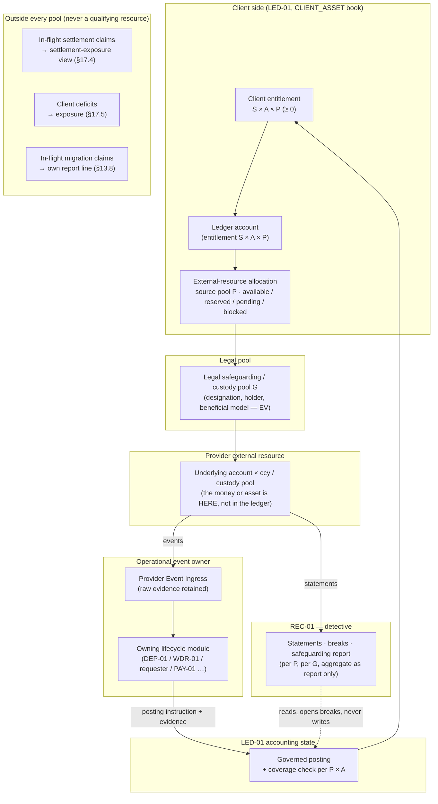

### 17.7 PRODUCTION rule — legal basis vs operational state (R2-F02)

**Contributes zero to qualifying resources** (outcome `SHORTFALL`, reason `LEGAL_BASIS`) only where
a fact **defeats or never established the client-asset legal basis** of the pool:

- arrangement `UNVERIFIED` (never verified — no live client assets may be placed; any found are an
  exception) or `BASIS_DEFEATED`;
- `pool_allocation_mode = UNSUPPORTED`;
- (custody) classification `PROHIBITED_AIX_UNILATERAL_CONTROL`, or an `EV-34` finding of AIX
  control (Doc 00 §8.2).

**Does not change qualifying resources** (the pool keeps its last verified amount; coverage is
`COVERED` or, past the safeguarding freshness policy, `UNDETERMINED`): provider live-routing not
`ACTIVE`, rail suspended, location / arrangement `WIND_DOWN` or `SUSPENDED`, provider API
unavailable, stale evidence, the custodian no longer approved for new placements in AST-01, or a
client-specific legal order.

**Makes coverage `UNDETERMINED` pending evidence:** arrangement `REVERIFICATION_DUE`; custody
classification `CONTROL_ASSESSMENT_REQUIRED` discovered after assets were placed; a pool-wide
restriction `UNDER_ASSESSMENT`; a provider insolvency or legal process whose effect on the client-asset
basis is under assessment (`EV-14`).

**Relationship termination and inaccessibility (R3-F02).** `relationship_state = TERMINATED` and
`operating_state = INACCESSIBLE` do not by themselves change qualifying resources or entitlements.
The last verified amount stays with its evidence age; coverage becomes `UNDETERMINED` once the
safeguarding freshness policy is exceeded or while `EV-14` is assessed, and `SHORTFALL` only on
authenticated evidence that resources left or are legally unavailable to clients — then classified
(§17.5). No write-down without a separately governed decision (§10.2.3).

Any of the above may still make the pool **unusable for movement** (§7.4, §16.3). Usability and
coverage are different questions.

### 17.8 Regulatory views (A2-Q2)

REC-01's safeguarding report can be cut by legal entity, master account, subaccount, asset,
resource pool, legal safeguarding pool and provider. Per P × A it shows **separate lines**:

| Line | Content |
|---|---|
| Client claims | §17.2 ClientClaims, with suspense and unallocated excess shown separately |
| **Verified backing** | Verified amount (fact 1) with evidence time, less AIX-owned amounts |
| **Currently usable liquidity** | The part usable for movement now (facts 2–6) |
| **Legally restricted — pool-wide** | Excluded resources, with legal status |
| **Legally restricted — client-specific** | Per client, informational (still backed) |
| **Temporarily unverifiable** | Resources whose evidence is stale / unobtainable, with last verified amount and age |
| **Resource uncertainty** | Pools with outcome `UNDETERMINED`, with reason |
| Coverage outcome | `COVERED` / `SHORTFALL` (classified cause) / `UNDETERMINED` (reason) |
| In-flight settlement exposure | §17.4 |
| In-flight migration claims | §13.8 — per migration transfer, age, status (in flight / failed / recovery or dispute) |
| Stranded / recovery claims | §10.2.3 — per pool: entitlements outstanding, debtor / administrator, last evidence and age, recovery status, write-off status |
| Client deficits | §17.5 |

**This is a reporting capability only.** It asserts nothing about
whether a subaccount carries separate legal safeguarding treatment — that is `A2-Q2`, unanswered
(§42).

### 17.9 Deficit and shortfall containment scope (R2-F06; corrected by R3-F04)

**Principle.** A deficit affecting client S, pool P and asset A does **not** by itself justify
freezing every client, every pool or unrelated assets. Containment is as narrow as the evidence
allows and widens only for a stated reason. v0.3's rule "missing configuration ⇒ the cross-pool hold
applies" is **withdrawn**: missing configuration cannot manufacture a legal or contractual right to
restrain a client's unrelated property (`04-review-r3.md` R3-F04).

**Three distinct mechanisms — never conflated.**

| Mechanism | What it restrains | Basis required |
|---|---|---|
| **Pool-wide anti-preference block** | Outflows from pool P × A for every client while P cannot be shown to back every claim | §17.2 coverage `SHORTFALL` / `UNDETERMINED` or the other stated grounds below — a safeguarding rule, not a client sanction |
| **Client-specific operational restriction** | The deficit client's affected scope (S × P × A) and S's **new** risk-taking | The deficit itself (S's resources at P are the first recovery source) and the client agreement / ordinary service terms for refusing new business |
| **Authorised cross-pool recovery restraint (or set-off)** | S's **existing** property in other pools / assets / subaccounts | An evidenced authority record (§17.9.1); application or set-off of that property to the deficit needs its own application authority (X7, §16.4) |

| Scope | Default containment | Basis |
|---|---|---|
| **Deficit client S × P × A** | Frozen: no reservation, withdrawal, settlement leg or transfer from S × A × P except governed recovery and exception actions | The deficit is S's; its resources at P are the first recovery source |
| **Deficit client S — new risk-taking anywhere** | New orders, payments, subscriptions or other activity that would create **new** exposure for S are denied where the client agreement or AIX's ordinary service terms permit refusal of new business | A refusal of new business, not a restraint of S's existing property |
| **Deficit client S, other pools / assets / subaccounts — existing property** | **No restraint by default.** A cross-pool recovery restraint applies **only** under an `APPROVED` authority record (§17.9.1). **Missing configuration or missing evidence ⇒ no restraint**; instead: deny new risk-taking (row above), open an assessment (Compliance + Legal), escalate (INC-01, Management) and preserve S's ordinary property rights | P-25; R3-F04 |
| **Other clients at P** | **Not frozen** while P's coverage is `COVERED` and their claims remain demonstrably backed | Client B is never represented as unbacked merely because client A has a deficit |
| **Pool P (all clients)** | Outbound blocked **only while** one of: (i) coverage is `SHORTFALL` or `UNDETERMINED`; (ii) the allocation cannot prove which clients remain backed; (iii) a provider / legal restriction applies to the whole pool; (iv) the risk cannot be safely isolated (e.g., an unresolved evidence conflict) | **Anti-preference:** P's resources are fungible, so while they do not cover every claim any innocent client's outflow reduces the backing of the rest and prefers the first mover |
| **Other pools / assets of other clients** | Unaffected | Per-pool coverage (§17.2 rule 3) |

#### 17.9.1 Authority record for a cross-pool recovery restraint

A `recovery_restraint` on S's property outside the deficit scope exists only when its authority
record is `APPROVED` (maker-checker: Compliance + Legal + Finance; Management above threshold) with:

| Field | Requirement |
|---|---|
| `authority_basis` | One evidenced basis (`EV-37`): a contractual right of restraint or set-off in S's agreement; a specific client agreement or instruction; a specific lawful emergency authority; a court, regulatory or other legal order; another externally validated legal basis. **Configuration, a default, a deficit or a maker-checker approval alone is not a basis** |
| `purpose` | Protection of recovery of the identified deficit (deficit id, amount, asset, pool) |
| `affected_scope` | Named pools / assets / subaccounts of S only — never another client's property |
| `maximum_amount` | ≤ the outstanding deficit (and ≤ any cap in the basis) |
| `start_at`, `duration`, `review_at` | Bounded; review no later than the configured maximum interval; lapses unless renewed on evidence |
| `release_criteria` | Deficit recovered or otherwise resolved; authority lapsed, withdrawn or overturned; review not renewed; order lifted |
| `escalation` | Owner, escalation path and deadline |

Rules: the restraint is applied as `Blocked` on S's affected entitlements with the authority
reference (§7.4) and shown to S as such; it never applies S's property to the deficit — application
needs its own authority and runs as X7 or a governed recovery transfer; if the authority is not
proven, **no restraint is created**.

Rules:

1. The pool-wide block lifts as soon as the outcome is `COVERED` again (after recovery, provider
   correction or a governed X6) and no other reason applies; S's own frozen scope, the refusal of new
   risk-taking and any authorised restraint remain until the deficit is resolved or the authority
   ends.
2. Where per-client backing is provable — C1 custody subaccount per client, or
   `PROVIDER_PER_VA_ENFORCED` with each VA its own pool — clients sit in **different pools**, and
   one client's deficit never reaches another.
3. **Operational restrictions are recorded separately from safeguarding arithmetic.** Where pool
   mechanics prevent safe isolation even with coverage `COVERED` (e.g., the provider can only
   freeze the whole underlying account), the restriction is recorded with that reason as an
   operational state (§16.8 fact 3), and the safeguarding report still shows the other clients as
   backed.
4. Innocent clients' executed obligations blocked by a pool-wide block move to
   `settlement_exception` with a named exposure (counterparty × asset), never to a silent delay.
5. Every scope change (freeze, refusal of new risk-taking, restraint, block, release) is
   maker-checker and audited (SEC-01); INC-01 tracks the client-access consequence (INC-01 v1.1 §5.19).

---

## 18. Reservation / Hold Model

### 18.1 One logical reservation workflow (R06, corrected by R2-F04 and R3-F03)

Exactly **one** business workflow — the **requester** of the reservation — asks for both the
accounting reservation and its provider hold, because it owns **why** the hold is needed. LED-01
owns the **accounting reservation state** (including whether a hold is bound). The provider hold
is a provider instruction whose **business owner is the requester**: the requester records the
hold instruction durably (§18.3 rule 7) and invokes the **provider adapter**, which executes it
with credentials protected by SEC-01 / FND-01 controls (§35.8). The two are bound by one
correlation: `reservation_id`. **OMS-01 and LED-01 never independently request competing holds;
LED-01 never transmits a provider instruction; WDR-01 does not own a hold merely because a later
settlement may involve an outbound movement** (R2-F04). Every hold action — place, extend, reduce,
release, consume — belongs to that requester; a payment out of the hold reaches WDR-01 only through
the single **conversion handoff** of §18.8.4, which leaves hold ownership unchanged (R3-F03).

| Purpose | Requester (business owner of reservation + hold) |
|---|---|
| Spot / OTC order | OMS-01 (TRD-01 orchestrates post-fill) |
| Pay payment | PAY-01 |
| RWA subscription | RWA-03 |
| Client withdrawal / payout | WDR-01 (here WDR-01 *is* the business owner, because the purpose is an outbound withdrawal) |
| Fee sweep, suspense / exception-item return | No client reservation and no provider hold: a pool-level encumbrance on the source item (§16.3) |

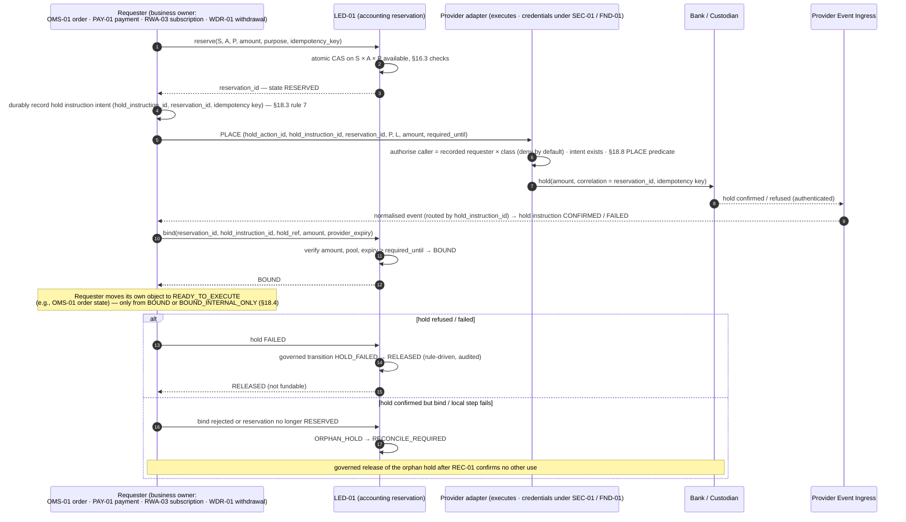

### 18.2 Rules

0. **Ownership (D-3, corrected).** LED-01 owns the accounting reservation and its binding state.
   The requester owns the purpose, is the **only** party that may request the hold and its
   release, and owns the hold-instruction record and lifecycle for its own reservation (one shared
   FND-01 mechanics library implements the hold-instruction state machine for every requester).
   The provider adapter executes; it refuses a hold **action** whose caller is not the reservation's
   recorded requester, that has no durable intent record, or whose **per-action predicate** (§18.8.2)
   does not hold — the v0.3 rule "reservation `RESERVED` and no live hold" is the predicate for the
   initial `PLACE` only, never for extend, reduce, release or consume. WDR-01 may move value out of a
   held balance only with a valid conversion handoff (§18.8.4).
1. **LED-01 is the concurrency authority.** The atomic reservation prevents the same accounting
   balance being promised twice inside AIX. Frontend display state is never an input.
2. **The bound provider hold is the external resource control.** It prevents the same external
   funds being used outside AIX's control — **only to the extent it is enforceable** (§10.3,
   `EV-32`).
3. A reservation names exactly one S × A × P (§9.6.3) and binds at most one live hold.
4. A withdrawal and an order compete for the **same** S × A × P available balance; whichever
   reserves first wins; the other is refused (`INSUFFICIENT_AVAILABLE`). Example: USD 1,000
   available at P ⇒ an order reserving 1,000 makes a concurrent 1,000 withdrawal from P fail
   atomically, and vice versa.
5. Every reservation has a purpose, a requester, an obligation link once executed, and a
   **release policy** (§18.3). Release is a governed state transition, never a silent drop.
6. Partial consumption leaves a residual released only under §18.3 and, where a provider hold is
   bound, only after the provider confirms the reduction or release (§18.8.3, §32).

### 18.3 Reservation states and the release rule (R05)

`REQUESTED → RESERVED → HOLD_PENDING → BOUND | BOUND_INTERNAL_ONLY (§18.4) → EXECUTION_ATTEMPTED →
(EXECUTION_UNKNOWN) → PARTIALLY_CONSUMED → CONSUMED | RELEASE_PENDING_PROVIDER → RELEASED`, plus
`HOLD_FAILED`, `HOLD_MISMATCH`, `ORPHAN_HOLD`, `HOLD_LOST`, `RECONCILE_REQUIRED`, and `EXPIRED`
(only before any execution attempt). These are the **reservation** states (LED-01). The **hold
instruction** carries its own per-action states, owned by the requester (§18.8); LED-01 mirrors the
binding.

**Release rule (normative).**

1. **A reservation MUST NOT be released merely because a timer expires when execution or fill
   status is unknown.** `EXECUTION_ATTEMPTED` is recorded **durably on the reservation before the
   order is transmitted** to EXE-01 / the LP (rule 7; R2-F11). Without that durable record nothing
   is routed. From that moment no timer can release the reservation, so a crash between recording
   and transmission leaves the reservation protected, never released by `EXPIRED`.
2. If the LP / venue / provider status of any attempt is uncertain (timeout, disconnect,
   ambiguous response), the reservation moves to **`EXECUTION_UNKNOWN`** and the requester's
   object to **`reconcile_required`** (TRD-01 v1.2 §5.20 rule 1). The full reserved amount stays
   protected until authoritative resolution.
3. Release (in whole or part) requires **authoritative evidence** for every attempt: confirmed
   no-fill; confirmed cancellation; confirmed final unfilled quantity; or an authoritative
   venue/LP terminal state — obtained by idempotent status query-back (TRD-01 v1.2 §5.20,
   `LPC-REQ-007`) — or consumption by settlement.
4. `EXPIRED` is reachable **only** from `RESERVED` / `BOUND` / `BOUND_INTERNAL_ONLY` with **no**
   execution attempt recorded. It is a governed release.
5. The internal amount is released only after the provider confirms release **or reduction** of the
   bound hold (`RELEASE_PENDING_PROVIDER` and `REDUCE_PENDING_PROVIDER` keep it unavailable — they
   are **not** available balance); a release or reduction failure keeps it unavailable and escalates
   (§40 rows 30, 69). This direction is safe: the client can never use funds internally that
   the provider still holds for a released purpose, and never twice.
6. A hold linked to an instructed or live settlement leg cannot expire or release independently
   (preserves LED-01 v1.1 §5.22 hold pinning).
7. **Durable local intent before any external transmission (R2-F11).** Every external instruction
   — order / RFQ to an LP, provider hold place / extend / reduce / release / consume, payment
   (including a payment from a hold under a conversion handoff), custodian transfer request, fee
   sweep, suspense return, exit transfer, VA lifecycle request — is preceded by a durable
   internal instruction / attempt record committed **in the same transaction** as its outbox
   entry, following the repository outbox convention (master 08 v1.2 §10.4 "Commit financial
   transaction and outbox event in same database transaction"; FND-01 idempotency + outbox,
   Module Index v1.4 l.351; WDR-01 v1.1 §5.19 "atomic send lock binds reserve to provider
   instruction"). Minimum content: `instruction_id` / `execution_attempt_id` (and `hold_action_id`
   for hold actions), business purpose, owning module, operation class, **source declaration of
   §16.3** (`source_account_type`, `source_account_id`, `resource_pool_id`, `authority_ref`,
   `encumbrance_type`, `encumbrance_id` — client and subaccount where the source is a client
   entitlement), asset and amount (or quantity and limit), provider / arrangement / location,
   idempotency key and **submission profile** (§35.8.4), `reservation_id` or handoff id where
   applicable, `created_at`, authorised state and approval references. Sequence: **durable intent →
   transmission → provider acknowledgement / uncertainty / failure** (§35.8.3). An instruction AIX
   transmitted can never lack internal evidence that AIX attempted it; an uncertain outcome is
   treated as possibly executed and resolved under the submission profile — provider-idempotent
   retry or query / statement correlation — **never by a non-idempotent resend** (§35.8.4).

### 18.4 Fallback when the provider cannot hold (`BOUND_INTERNAL_ONLY`)

Allowed only when §10.3 permits it — `withdrawal_authority ∈ {AIX_INSTRUCTED_ONLY,
PROVIDER_CONTROLLED}` **and** `client_direct_instruction_authority = NONE` — so no outflow can
occur without AIX's instruction or provider-applied conditions:

| Step | Control |
|---|---|
| 1 | LED-01 internal reservation (atomic) at S × A × P |
| 2 | **Fresh** movement-scoped provider evidence for P within the operation's freshness window, re-checked immediately before execution (§16.7) |
| 3 | Pool-level sufficiency: coverage holds at P including all bound and internal-only reservations at P |
| 4 | All AIX outbound external transfers from P serialised through WDR-01's external-transfer lifecycle (no parallel transfer path; holds move no value) |
| 5 | State `BOUND_INTERNAL_ONLY`, visible in audit and in settlement-risk reporting |

**Stated increased risk:** between evidence and settlement the provider (not AIX) could debit P
(fees, recalls, legal orders, set-off, provider error). That is **provider exposure** (§33.6), not
principal exposure; it is limited by freshness windows, per-pool exposure limits (configuration)
and fail-closed on stale evidence, and every such debit is posted and reconciled (§23.1, §40
rows 42–45).

### 18.5 Provider-hold expiry (R05)

A provider hold may carry its own provider-side expiry. Then:

| Situation | Required behaviour |
|---|---|
| Hold expiry < the purpose's `required_until` at bind time | Bind refused (`HOLD_MISMATCH`) unless the provider can extend it; requester may re-request with a supported horizon |
| Expiry approaching, **before** any execution attempt | Renew / extend if `supports_reservation_extend`; otherwise **stop progression before expiry** (no new execution attempt may start inside a configured safety margin) and release or re-hold |
| Expiry approaching **after** an execution attempt, status unknown or settlement pending | Renew / extend (`EXTEND`, §18.8.2) if supported; otherwise re-hold a fresh hold for the protected amount (`PLACE` as a governed re-hold, new `hold_instruction_id`); if neither succeeds before expiry → `HOLD_LOST` exception, **fail closed**: block every other outflow from S × A × P for the protected amount, escalate (Ops + Finance), and treat the pool as unusable for new commitments where the client could debit the lapsed amount (§10.3) |
| Hold disappears without an AIX release (provider correction, error) | `HOLD_LOST` → `RECONCILE_REQUIRED`; same fail-closed treatment; REC-01 break (§40 rows 32–34) |

The internal reservation stays in place in every row above; only the external control is lost or
renewed.

### 18.6 Late fills (R05)

| Case | Treatment |
|---|---|
| Fill arrives while the reservation is `EXECUTION_UNKNOWN` | Normal: the fill consumes the still-protected reservation; obligation created from the fill (§31); unconsumed part released only under §18.3 rule 3 |
| Fill arrives **after** an authoritative terminal no-fill / cancel / final quantity on which a release was based (counterparty error) | Never settled automatically (TRD-01 v1.2 §5.20 rules 4–5, `TRD1-FR-030`, E2E-TC-021). TRD-01 parks it as a **late-fill exception**; REC-01 break; the counterparty is put to its own erroneous confirmation under its terms (`LPC-REQ-007`, `EV-33`). If, and only if, a governed decision accepts the fill for the client, it settles from **fresh client resources** reserved under §18.1; if the client's resources are insufficient, it stays an exception. **AIX corporate funds never fund it** (§19.4) |
| Duplicate fill report | Idempotent by counterparty execution id; never a second obligation (§40 row 38) |

Because no reservation is released while status is unknown (§18.3), the pattern *reservation
released → late fill arrives → no client resources remain* cannot arise from AIX's own timers.

### 18.7 Assets

Asset reservations follow the same model at the custodian: custodian hold / policy lock where
supported (`CUS-REQ-025`); otherwise internal reservation + fresh custodian evidence + custodian
policy requiring AIX-originated, custodian-approved outflows — and only where the arrangement is
classified `THIRD_PARTY_ELIGIBLE` (§13.2, §13.4).

### 18.8 Provider hold instruction lifecycle — one owner, per-action states (R3-F03)

v0.3 stated that the requester solely owns the hold, yet §31.1 put hold instructions under WDR-01,
§32 had WDR-01 release an order's hold and released the internal 400 before the provider, R6
labelled the hold WDR-01-owned, the Spot sequence had WDR-01 "convert hold → payment", and the
adapter predicate written for placement was applied to every action (`04-review-r3.md` R3-F03).
v0.4 states **one** lifecycle and every section now refers to it.

#### 18.8.1 Owner invariant

The **business requester recorded on the reservation** (`requester_service_identity`,
`requester_object_ref`) is the sole business owner of the hold-instruction record and of every hold
action for that reservation: OMS-01 for a Spot cash hold; the OTC order's requester (OMS-01) for an
OTC hold — TRD-01 orchestrates post-trade but owns no second hold; PAY-01 for a payment; RWA-03 for a
subscription; WDR-01 for its own withdrawal. Ownership never transfers. Shared credentials or a
shared adapter never confer business authority.

#### 18.8.2 Hold states and per-action predicates

Hold-instruction states (requester-owned; LED-01 mirrors the binding): `NO_HOLD`, `PLACE_PENDING`,
`BOUND`, `EXTEND_PENDING`, `REDUCE_PENDING_PROVIDER`, `RELEASE_PENDING_PROVIDER`, `CONSUME_PENDING`,
`CONSUMED`, `RELEASED`, `HOLD_FAILED`, `HOLD_LOST`, `ORPHAN_HOLD`; any `*_PENDING` action whose
provider outcome is uncertain is **`ACTION_UNKNOWN`** — treated as possibly executed, resolved under
the submission profile (§35.8.4), with the protected amount kept unavailable. The reservation's own
`EXECUTION_UNKNOWN` (order attempt status, §18.3) is a separate fact that constrains which hold
actions are legal.

| Action | Caller | Reservation states allowed | Hold states allowed | Further condition | Result | Internal availability |
|---|---|---|---|---|---|---|
| `PLACE` | Recorded requester | `RESERVED` (initial); for a governed **re-hold**: `BOUND`, `EXECUTION_ATTEMPTED`, `EXECUTION_UNKNOWN`, `PARTIALLY_CONSUMED` | `NO_HOLD`; `HOLD_FAILED` / `HOLD_LOST` (re-hold, new `hold_instruction_id`); never while another live hold exists | Durable intent; §16.3 checks at placement | `PLACE_PENDING` → `BOUND` on bind / `HOLD_FAILED` / `ORPHAN_HOLD` | None — the reservation already encumbers |
| `EXTEND` | Recorded requester | `BOUND`, `EXECUTION_ATTEMPTED`, `EXECUTION_UNKNOWN`, `PARTIALLY_CONSUMED` | `BOUND` | `supports_reservation_extend`; new expiry ≥ `required_until` | `EXTEND_PENDING` → `BOUND` (new expiry); refused → §18.5 | None |
| `REDUCE` | Recorded requester | `PARTIALLY_CONSUMED`, or authoritative terminal evidence for part of the amount (§18.3 rule 3) | `BOUND` | Reduction ≤ the unconsumed remainder whose release §18.3 authorises; never below what live legs or unknown attempts still need | `REDUCE_PENDING_PROVIDER` → `BOUND` (reduced) | The reduced portion stays **unavailable** until the provider confirms; then LED-01 releases exactly that portion |
| `RELEASE` | Recorded requester (or a governed override with provider evidence) | Release authorised by §18.3 (`EXPIRED` with no attempt; authoritative no-fill / cancel; final unfilled remainder after consumption) | `BOUND`; `ORPHAN_HOLD` (governed release after REC-01 confirms no other use) | — | `RELEASE_PENDING_PROVIDER` → `RELEASED` | **Unavailable** until the provider confirms; then released |
| `CONSUME` (convert to payment) | Recorded requester issues the **conversion handoff**; WDR-01 executes the payment | Linked obligation leg or withdrawal; LED-01 guard allows the leg | `BOUND` | Valid handoff (§18.8.4) | `CONSUME_PENDING` → `CONSUMED` on provider-confirmed payment from the hold; `BOUND` if the provider evidences that the payment failed with the hold intact; `HOLD_LOST` if the hold is gone without a payment | Never returns to available; consumption posts per leg |

**Idempotency identity per action:** `hold_action_id = (hold_instruction_id, action, action_seq)`;
the provider idempotency key is derived from it; each action has its own durable intent (§18.3
rule 7). A retried action reuses its `hold_action_id`; a new action gets the next `action_seq`.

#### 18.8.3 Critical invariant — provider confirmation precedes internal availability

```
RELEASE_PENDING_PROVIDER  ≠  available client balance
REDUCE_PENDING_PROVIDER   ≠  available client balance
ACTION_UNKNOWN            ≠  available client balance
```

LED-01 restores available balance for a provider-held amount **only** on the requester's binding
update carrying authenticated provider confirmation of release or reduction. For `BOUND_INTERNAL_ONLY`
(no provider hold, §18.4) release is internal on the §18.3 conditions.

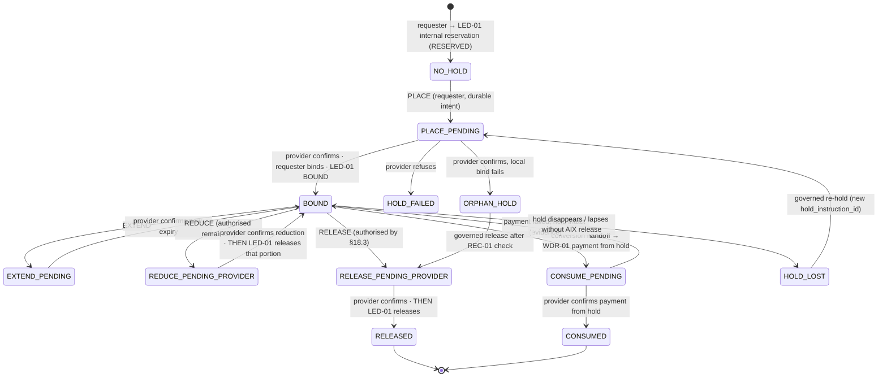

#### 18.8.4 The conversion handoff (requester-owned hold → WDR-01 payment)

1. The requester, on the orchestration owner's request for a leg (TRD-01 for Spot / OTC) or on its own
   withdrawal, records a durable **`hold_conversion_handoff`** in the same transaction as moving the
   hold to `CONSUME_PENDING`: `handoff_id`, `hold_instruction_id`, provider `hold_ref`,
   `reservation_id`, `obligation_id` + leg id (or withdrawal id), amount, asset, destination
   reference (LQD-01 SSI or WLT-01 destination decision), validity.
2. WDR-01 records its own durable payment intent referencing `handoff_id` and owns the **external
   payment lifecycle** from there (send, acknowledgement, uncertainty, completion, return).
3. The adapter executes the instruction class `PAYMENT_FROM_HOLD` only if WDR-01's identity is
   authorised for it, the handoff exists, is unconsumed and matches amount, `hold_ref` and
   destination.
4. Ingress routes payment status to **WDR-01** and hold-state events (consumed / remaining amount) to
   the **requester**; R6 and R14 reconcile both. **Hold ownership does not change; WDR-01 never
   becomes the owner of an OMS-01, PAY-01 or RWA-03 hold.**
5. Where the provider cannot convert a hold into a payment: on a pool whose withdrawal authority is
   AIX-instructed only (§10.3), the requester may issue a `RELEASE` **bound to the handoff**
   (purpose `SETTLEMENT_PAYMENT`) followed by WDR-01's payment, and the released amount never becomes
   internally available (the reservation stays consumed-pending for that leg); on a pool where the
   client can debit directly, conversion is mandatory (BNK-REQ-039) — otherwise the pool's resources
   cannot fund trading (§10.3).

#### 18.8.5 Worked example — partial fill 600 of 1,000

```
R = 1,000 reserved at P; hold H BOUND (owner OMS-01); EXECUTION_ATTEMPTED recorded before routing
fill F1 = 600 → obligation O1 for 600 (+ fee on 600 via X1)
authoritative terminal state: remaining 400 cancelled (venue confirmation)
OMS-01 (requester): durable REDUCE intent (hold_action_id, −400) → adapter → bank
    H = REDUCE_PENDING_PROVIDER; reservation: 600 consumed-pending + 400 RELEASE_PENDING_PROVIDER
    S's available at P: unchanged — the 400 is NOT available
bank confirms reduction to 600 → ingress → OMS-01 → LED-01 releases 400 (+ unearned fee portion)
TRD-01 requests the cash leg → OMS-01 records conversion handoff (H = CONSUME_PENDING, 600)
WDR-01 pays the LP SSI from the hold (PAYMENT_FROM_HOLD, handoff_id) → bank confirms
    → WDR-01 records the payment → LED-01 posts the leg; OMS-01 marks H CONSUMED
REC-01 R6: reservation ↔ hold record (OMS-01) ↔ provider hold; R14: intents ↔ outcomes
```

If the provider cannot reduce a hold, OMS-01 keeps the full hold until the 600 leg has been paid from
it and then issues `RELEASE` for the remainder; the 400 becomes available only on the provider's
release confirmation. A release-and-re-hold of the smaller amount is not used, because it opens a
window in which the held funds are unprotected.

---

## 19. Treasury / Corporate Liquidity Model

### 19.1 Permitted structure

```
AIX Corporate Treasury (TRE-01)
   └── AIX-owned operational balances                        (CORPORATE book)
   └── AIX-owned LP / venue prefunding or credit support     (CORPORATE book) — for AIX's own
                                                               relationship requirements only
```

### 19.2 Rules

1. TRE-01 owns AIX corporate liquidity **only**. It never owns, moves, nets, pledges or reports
   client assets as treasury.
2. Client deposits never become AIX treasury, working capital, trading inventory or LP liquidity.
   No journal moves value between the `CLIENT_ASSET` and `CORPORATE` books except the enumerated
   cross-book events X1–X7 (§16.4).
3. AIX corporate prefunding, collateral or credit support at an LP/venue (HB-09) is AIX's own money
   held for AIX's own relationship requirements (e.g., account minimums, collateral the LP
   requires to deal with AIX at all, AIX's own fees). **It is never the source of value delivered
   for a client obligation** (§19.4).
4. Module Index v1.4 TRE-01 row ("funding of venue accounts, internal transfers") is read as
   **AIX-owned** venue funding and **corporate** internal transfers only (§43 row M-19).

### 19.3 Corporate exposures are named, not hidden

Corporate prefunding, collateral or credit support is an **AIX corporate asset and a corporate
exposure**, never a client asset. It exposes AIX to the venue (counterparty/provider-failure
exposure), and an LP may have contractual recourse to it if a client obligation fails
(`EV-19`, `EV-33`; LPC-REQ-061, -063, -066…069). TRE-01 records it as an operational exposure with
limits (configuration); it is not "inventory" and not a principal trading position (Doc 00 §10.1
item 10 "AIX inventory limit must be zero" is preserved). What happens if the LP actually applies
it is §19.5.

### 19.4 No client financing — no corporate timing advance (R03)

**AIX corporate funds must not advance, bridge, finance or temporarily cover a client-funded
settlement obligation merely because the client leg is delayed, missing or unavailable.** This is
unconditional under DEC-015. It preserves **no client financing** (HB-10; `DEC-013` clause 6 —
lending out of scope), **no principal liquidity** and **no proprietary dealing** (`DEC-013`
clause 5 items 4–6).

Consequences:

1. **No AIX-corporate-funded leg may precede the client-funded leg** of the same obligation, in
   any product, rail or environment.
2. If required client resources are unavailable before execution, the only outcomes are:
   **reject, hold, re-quote, cancel where permitted, wait for verified funding,** or (after
   execution) **move to settlement exception** (§33). Never a corporate bridge.
3. An LP whose settlement model would consume AIX corporate prefunding to settle a client trade
   (because the client's own funds cannot reach the LP in time) **cannot be used for that client
   obligation** until a client-funded path exists (direct counterparty settlement, two-step
   client-funded, conditional settlement, or a client-attributed account at the LP whose
   arrangement facts are evidenced as a client resource pool — `EV-30`, `EV-33`).
4. The **v0.1 "AIX corporate timing advance" concept** (v0.1 §19.4, §25.4 row 3, §57 N) is
   **removed** in v0.2 and stays removed in v0.3 and v0.4. The Round-1 review proposed **HD-DEC015-03** only
   for the case where the human wished to keep that option; because v0.2 removed the option,
   **HD-DEC015-03 is NOT REQUIRED** (§58). §19.5 (LP application of AIX collateral) records an
   involuntary corporate exposure after the fact and does not revive it. Any future business need for AIX-funded settlement support is a **separate
   decision** with its own legal validation (credit extension, licence scope) — never a governance
   record under DEC-015.
5. After-the-fact remediation events X4–X6 (§16.4) are not settlement mechanisms and are not
   affected by this rule's purpose: they fund no client order, reservation or leg.
6. **No disguised equivalents (R3 re-search).** No "advance", "bridge", "temporary funding",
   "settlement buffer" or "corporate cover" may be provided to a client, including: paying out a
   client's **stranded** or **in-flight migration** value from corporate funds pending recovery
   (§10.2.3, §13.7.6, §13.8); funding a distressed return or a delayed leg; or treating corporate
   venue prefunding as a timing cushion. Any such business need is a separate decision with its own
   legal validation; HD-DEC015-03 remains NOT REQUIRED.

### 19.5 LP application or seizure of AIX corporate collateral after a client failure (R2-F16)

If an LP lawfully applies, seizes or sets off AIX corporate collateral / prefunding because a
client-related settlement failed, AIX records **what happened** — it does not re-label it as
client-funded settlement, and it does not move another client's value.

| Step | Record | Book entries (canonical categories) |
|---|---|---|
| 1. LP notice / evidence of application (authenticated, via ingress → TRD-01 for counterparty evidence; TRE-01 for the corporate position) | Corporate collateral use; counterparty settlement consequence; `settlement_exception` on the affected obligation with reason `COUNTERPARTY_APPLIED_CORPORATE_COLLATERAL`; INC-01 incident; REC-01 break (R5, LP statement) | Corporate book: Dr Collateral Applied by Counterparty — Pending Classification / Cr AIX Venue Prefunding / Credit Support |
| 2. Classification (maker-checker, Finance + Compliance + Legal) | **Receivable from the client** only where a valid contractual basis exists (client agreement; `EV-31`); otherwise corporate loss | Corporate book: Dr Operational Exposure Receivable from S / Cr Collateral Applied — Pending, **or** Dr Corporate Loss / Cr Collateral Applied — Pending |
| 3. Client obligation | **Not** settled from corporate value: the client leg stays unfunded and the obligation stays in `settlement_exception`. Any asset the LP delivers as a consequence is held **blocked** in the receiving custody pool's Pool Exception — **never** credited to the client's entitlement on the strength of corporate value, and never AIX inventory | Client book (pool Q): Dr Pool Resource (Q) / Cr Pool Exception (Q) on authenticated receipt |
| 4. Resolution (governed) | Either the client completes its leg **from its own resources** (then the asset is released to S and the AIX receivable is recovered through X7), or a governed unwind / disposal per contract; proceeds and costs recorded on the exposure | Release: Dr Pool Exception (Q) / Cr Client Entitlement (S × X × Q); recovery: X7 |
| 5. Recovery | Only from S, on the classified basis; never from another client's entitlement | X7, or corporate-book cash receipt |

Rules:

1. **No silent client debit, no silent re-labelling.** No other client's assets are debited; the
   seized amount is never classified as client-funded settlement; AIX's principal / counterparty
   exposure is never presented as nil.
2. **No pre-financing permission.** §19.5 records an involuntary corporate exposure after the fact.
   It creates no permission for AIX to fund, advance or bridge any client obligation (§19.4), and
   HD-DEC015-03 stays NOT REQUIRED.
3. The loss remains a **corporate exposure** until a valid recovery / receivable basis exists.
4. An LP whose terms let it apply AIX collateral to client-related failures is disclosed
   (LPC-REQ-061, -063, -066…069), limited by TRE-01 exposure limits, and assessed by LQD-01 before
   activation; where the terms would make AIX collateral the **source of value** for client
   obligations in the ordinary course, the LP cannot settle client obligations (§19.4 item 3).

---

## 20. Fee Architecture

### 20.1 Principles

- Fees are explicit, disclosed before acceptance, and recorded separately from trade consideration.
- **No hidden spread markup** (Doc 00 §10.1 item 9; CURRENT_STATE §9 licence lock).
- Client assets become AIX revenue **only** through the lifecycle below; each step is an
  accounting event; the client→corporate transition is an enumerated cross-book event (§16.4 X1,
  X2), never an unexplained posting across the books.

### 20.2 Example

```
Client total debit        USD 100,000
Trade consideration       USD  99,800   → paid to LP (client-funded cash leg)
AIX disclosed fee         USD     200   → AIX revenue via X1 (earned) and X2 (bounded sweep)
```

### 20.3 Lifecycle

| Step | Owner | Event | Book entries (illustrative) |
|---|---|---|---|
| Calculate | FEE-01 | Schedule × filled consideration, per product rules | none |
| Disclose | FEE-01 → OMS-01/PAY-01/RWA-03 → PRT-01/API-01 | Fee and **maximum** third-party charges shown before acceptance; acceptance evidences disclosure | none (evidence) |
| **Client fee reserve** | LED-01 (requested by the requester) | Reservation at S × A × P covers consideration + fee + disclosed maximum third-party charges | reservation (no journal) |
| **Fee entitlement** | FEE-01 | AIX's right to the fee under the disclosed schedule and the client's acceptance | none (evidence) |
| **Fee accrual / earned** | LED-01 on FEE-01 instruction | At the earning event: fill (trading), payment completion (Pay), allotment (RWA), per disclosed policy | **X1** (pool has `COLLECT_DISCLOSED_FEE`) — client book: Dr Client Entitlement (S × A × P) / Cr AIX Fee Payable (P × A); corporate book: Dr Fee Receivable / Cr Fee Revenue. **Pool without that authority:** corporate book only — Dr Fee Receivable (from S) / Cr Fee Revenue; collected by the §20.10 fallback route |
| **Corporate fee receivable / revenue** | LED-01 (CORPORATE book) | Recognised by X1 | as above |
| **Fee collection instruction** | FEE-01 decides that the payable is due for collection; the product-neutral sweep scheduler requests it | Durable instruction record (§18.3 rule 7) declaring `source_account_type = POOL_FEE_PAYABLE`, the pool's AIX Fee Payable account, amount ≤ payable available to collect and ≤ the authorised maximum, the authority relied on (§20.10) and a `FEE_PAYABLE_COLLECTION` encumbrance (§16.3) — **no client reservation** | encumbrance (no journal) |
| **Actual sweep / transfer** | **WDR-01** external-transfer lifecycle (outbound movement from a client pool) executes through the provider adapter; LED-01 posts | Transfer from pool P to the AIX corporate account, **within the configured maximum sweep latency** | **X2** on provider confirmation — consumes the encumbered payable **once** |
| **Corporate receipt** | TRE-01 (corporate cash position); LED-01 (CORPORATE book) | AIX corporate account credited on provider evidence | part of X2 |
| **Refund / reversal** | FEE-01 decides per disclosed policy; LED-01 posts | Before sweep: reverse X1 (both journals). After sweep: **X3** with provider evidence | per §16.4 |
| Reconcile | REC-01 | Fee calculated = fee earned (X1) = fee swept (X2) = fee revenue; fee payable per pool ages within bound | — |

### 20.4 Placement and bounds

1. **AIX Fee Payable is held at resource-pool level** (P × A), not on a subaccount. Once X1 posts,
   the client's subaccount carries no fee object, so ACC-01's **ledger** closure of the subaccount
   never waits on a fee sweep; for a pool that serves only that subaccount, provider-side
   close-out of the pool waits for the bounded sweep (§51 FI-ACC-5). That sweep is always possible
   without any client entitlement: it encumbers and consumes the pool-level payable (§16.3, R3-F06).
2. AIX Fee Payable is **AIX-owned money physically sitting in a client pool**. It is deducted from
   qualifying resources (§17.2 rule 7), reported separately, and bounded:
   `fee_sweep_max_latency` (configuration, per pool / rail). **Missing configuration denies fee
   accrual (and so fee-bearing activity) for that pool.**
3. **Breach of the bound fails closed:** a payable older than the maximum opens a REC-01 break and
   an INC-01 escalation; past a second configured threshold, new fee-bearing obligations from that
   pool are refused until the sweep completes or a governed decision resolves it. AIX money may
   never sit ambiguously in a client pool indefinitely (Charter §9.2 rule 1). Whether any holding
   period is permitted at all under the applicable client-money rules is part of `EV-07`.
4. Sweeps are per pool, never netted across pools, currencies or clients.

### 20.5 Partial fills, cancellation, failure, refund

| Case | Treatment |
|---|---|
| Partial fill | Fee on **filled** amount only (unless disclosed product policy says otherwise); unfilled reservation released (including its fee portion) only under §18.3 |
| Cancelled before execution | No fee earned (unless a disclosed cancellation fee exists); release under §18.3 |
| LP execution failed (authoritative no-fill) | No fee earned; release |
| Executed, settlement failed and unwound | Fee reversal per disclosed policy: reverse X1 if unswept; X3 if swept |
| Refund (Pay) | Merchant fee refund per Pay product policy; reversal entries, never edits |

### 20.6 Third-party and variable charges

| Charge | Treatment |
|---|---|
| Network fee (on-chain), and any other variable external charge | Disclosed as an amount **with a disclosed / approved maximum**. If the actual charge would exceed it, **either** the client approves the increased amount **before** the transfer, **or** AIX absorbs the excess (corporate expense; X4 where it was debited to a client pool). **No debit beyond the disclosed / authorised amount**, ever |
| Bank fee | As disclosed per rail; provider debits to a client pool must be attributed (client per agreement, or AIX with X4) |
| Custodian fee | Per client agreement and the custodian's fee schedule (`CUS-REQ-066`) |
| LP fee | Part of consideration or separately disclosed; never re-labelled as AIX revenue |

### 20.7 Rebates / inducements

Any LP rebate, payment for order flow or inducement must be **recorded, disclosed and
reconciled**; it is AIX corporate income only where disclosure and regulation permit, and it must
not alter routing outside the disclosed routing policy (`DEC-012` clause 2; LFSA-MB-2024 ¶9.7(i)
as recorded in `DEC-012`). DEC-015 does not approve any rebate.

### 20.8 Ownership

FEE-01 owns schedules, calculation, disclosure evidence, fee entitlement, the fee-collection
decision and refund decisions. LED-01 owns the postings (X1–X3). WDR-01 owns the outbound
external transfer (sweep, refund) and executes it through the provider adapter under the pool's
evidenced authority. TRE-01 owns the corporate receipt position. REC-01 reconciles fee ↔ earned ↔
swept ↔ revenue and the latency bound.

### 20.9 Provider charges that AIX bears

If a provider debits a client pool for a charge AIX has agreed to bear, the debit is recognised
as AIX's liability to the pool (**X4a**) and the pool is restored either from AIX corporate funds
(**X4b**) or from AIX-owned money already proven in that pool (**X4c**, AIX Fee Payable at the same
P × A) — the client book is never left short to absorb an AIX cost. Until restored, the pool
receivable is not a qualifying resource, so coverage may show `SHORTFALL` (reason
`AIX_BORNE_CHARGE`) and §17.9 applies; restoration is bounded by
`aix_charge_reimbursement_max_latency` (configuration; missing ⇒ fee-bearing provider debits to
client pools are not accepted for that pool — BNK-REQ-050 prefers billing to AIX).

### 20.10 Fee-collection authority (R2-F15)

The steps **fee calculation → fee entitlement → fee earned → fee accounting posting → fee
collection instruction → external transfer / sweep → corporate receipt** are separate (§20.3).
**No fee is collected from a client pool on the strength of an internal ledger entitlement alone.**

1. **External authority required.** X1 may move a fee into AIX Fee Payable at pool P only where
   P's arrangement evidences `aix_instruction_authority ∋ COLLECT_DISCLOSED_FEE` (`EV-05`) with:
   fee-debit or fee-sweep authority; the **source account / pool** it applies to; **timing**
   (per event, daily, monthly); the **maximum authorised amount** (per item and per period); and
   the **client disclosure / consent basis** (client agreement clause, acceptance evidence)
   (BNK-REQ-052…056; CUS-REQ-066 for custody fees).
2. **Fallback route where the pool lacks that authority:** the fee is earned against a corporate
   Fee Receivable from the client and collected by a client-instructed payment or invoice
   (configured per client agreement). No AIX money then sits in the client pool. Missing both the
   authority and a configured fallback ⇒ fee-bearing activity from that pool is refused (fail
   closed).
3. **Instruction authority is checked at instruction time.** WDR-01 refuses a sweep whose amount
   exceeds the payable available to collect, the authorised maximum or the authorised timing, whose
   authority evidence has lapsed, or whose pool is `SHORTFALL` / `UNDETERMINED` (§16.3 control 3);
   the payable then ages under §20.4 and fails closed past its bound. A sweep never reserves against,
   and never debits, a client entitlement — X1 already did that once.
4. **Corporate receipt** is recognised only on provider evidence that AIX's corporate account was
   credited (X2).

---

## 21. Fiat Deposit Flow

### 21.1 Current repository assumption (superseded as default)

Workflow Map v1.3 `WF-07` §11.1: *"To recognise fiat client money received into a safeguarded
client-money account and credit client ledger only after bank confirmation."* The Workflow Map,
System Rules, SRS, Role Matrix and masters 07–11 each restate **"Client money safeguarding account =
required"** in their baseline block, and Charter v1.5 §9.2 rule 2 states **"Client money
safeguarding account is required."** Under DEC-015 this becomes **rail F3**, a supported fallback
(§12), and WF-07 is rewritten around rail F1 (§44).

### 21.2 Target flow (rail F1; F2/F3 differ only in the pool's arrangement facts)

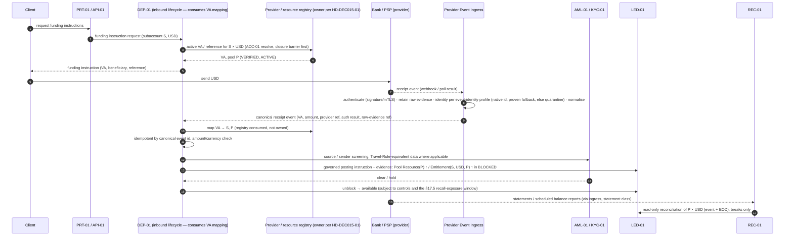

### 21.3 Rules

1. A client deposit **notice** creates nothing in the ledger (pending inbound is an expectation,
   not a resource — §17.3).
2. Ledger posting happens only on **authenticated provider confirmation** (Provider Event Ingress
   authentication + replay protection + idempotency — §35.7, §37).
3. Credit is posted to the client entitlement in a **blocked** state until AML/source controls
   clear and the rail's recall-exposure rule allows (§17.5 item 6); only then does it become
   available. This preserves LED-01 v1.1 §5.6 ("Deposit attribution does not equal available
   credit").
4. Attribution is by VA (or reference) → the registry binding consumed by DEP-01 →
   `subaccount_id` and pool P; never by sender name alone. A pool not `ACTIVE` for new placements
   (§10.2.1) does not receive new funding instructions; late inbound funds to it follow §21.4.
5. Reconciliation of P runs on the event and at end of day (REC-01, detective).

### 21.4 Exceptions

| Case | Handling |
|---|---|
| Unmatched VA / unknown reference | Confirmed funds post to **Client Suspense** at P; case opened; no client credit |
| Wrong VA (belongs to another client) | Attribute to the VA's client **only** if sender is that client's verified source; otherwise suspense + case |
| Amount/currency mismatch | Suspense + case |
| Sender screening hit | Blocked; AML case; return only under AML-01 rules |
| Late funds to a closed VA | Suspense item (pool-level) + return-to-source |
| Return to source | DEP-01 opens return (governed decision, AML-01 cleared or directed); **WDR-01 executes** via WLT/AML/LED payout controls (DEP-01 v1.1 §5.22 `unmatched_return_path = via_wlt_aml_led_payout_controls`, preserved), from the same pool, with `source_account_type = SUSPENSE_ITEM` and a `SUSPENSE_ITEM_ENCUMBRANCE` on that receipt item — **no fabricated client entitlement or subaccount** (§16.3); posts Dr Client Suspense (item) / Cr Pool Resource |
| Bank recall after credit | §17.5; §40 row 8 |

---

## 22. Crypto Deposit Flow

### 22.1 Flow

```
Client → (on-chain) → client deposit address at Legal Custodian (C1) / pool address + tag (C2)
  → custodian detects, applies its screening/policy, reports → Provider Event Ingress (authenticated)
  → WLT-01 identifies the actual instrument by canonical identity (AST-01 v1.8 §3.11; DCR-AST1-002)
     and evaluates DEPOSIT_MB_PSO eligibility (AST-01 v1.8 §5.7 — WLT-01 is the allow-listed caller),
     including §13.5 Rule A (the receiving location may accept new placements)
  → DEP-01: confirmations ≥ network finality threshold (configuration), dedupe, attribution to S, pool Q
  → AML-01: source screening / Travel Rule
  → LED-01 (governed posting instruction from DEP-01): Pool Resource(Q) ↑ / Entitlement(S, X, Q) ↑
     (BLOCKED) → available after controls
  → REC-01: custodian ↔ ledger ↔ chain (detective)
```

### 22.2 Rules

- A **security / security token** is never accepted into an MB/PSO-domain custody path
  (AST-01 INV-01). A deposit of an ineligible or unidentifiable instrument is quarantined, never
  credited.
- Chain observation is corroboration; custodian confirmation is the holding evidence (§17.3).
- Reorg below finality reverses only through the governed clawback path (LED-01 v1.1 clawback
  section, preserved); a reversal exceeding the client's entitlement creates Client Deficit
  (§17.5), never a negative entitlement.

### 22.3 Exceptions

Wrong network / wrong asset (unsupported contract) → quarantine; recovery only if the custodian
can recover, under a governed case. Missing/wrong memo/tag → unmatched. Dust/unsolicited tokens →
quarantine, never credited, never auto-swept.

---

## 23. Fiat Withdrawal Flow

1. Client requests withdrawal from S (USD) to a **WLT-01-verified own-name destination**.
2. **WDR-01 (requester)** asks LED-01 to reserve at a source pool P selected under §9.6.3, then
   asks for the provider hold where the rail requires it (§18.1).
3. IAM-02 maker-checker / client-side approval where required (requires `IAM2-FIND-002`/`003`
   closure before real-actor use — §42).
4. AML-01 pre-transaction gate; WLT-01 destination decision **verify-and-consume** at execution
   (WDR-01 v1.1 Beneficiary Integrity Guard, preserved).
5. WDR-01 records the instruction durably (§18.3 rule 7) and instructs the **provider** through
   the provider adapter to pay from P / L (F1/F2: provider pays from the client structure under
   AIX's settlement-instruction authority — converting WDR-01's own bound withdrawal hold to
   payment where supported, through the same handoff record as §18.8.4;
   F3: AIX instructs its own designated client-money account), **never more than the
   reservation's amount at that pool**, and only if P's operating state permits the withdrawal
   (§10.2.1 — a `WIND_DOWN` pool in `FULL_SERVICING`, `WITHDRAWAL_ONLY` or `RETURN_ONLY` still
   pays clients out). **WDR-01 does not assume AIX possesses the
   funds**; it assumes only the authority recorded on the pool.
6. Provider confirmation (via ingress) → WDR-01 records → LED-01 posts (Entitlement(S, USD, P) ↓ /
   Pool Resource(P) ↓; reservation `CONSUMED`).
7. Return/recall → WDR-01 return lifecycle → DEP-01 inbound → LED-01 reversal (to the same pool).

Where `settlement_instruction_authority` is `CLIENT_ONLY`, AIX cannot pay out: the withdrawal is a
client-side action at the provider. AIX **releases** the reservation on the client's request and
records the provider-evidenced outflow through §23.1.

### 23.1 Uninstructed and direct-client outflows (R11)

A debit from a client pool that AIX did not instruct — a client's direct withdrawal under its own
mandate, a provider fee, a set-off, a legal-order debit, a provider correction — is a fact AIX
must record and reconcile:

```
provider debit event
  → Provider Event Ingress (authenticate, normalise, classify as UNINSTRUCTED_OUTFLOW)
  → WDR-01 observed-outflow lifecycle (owner of outbound movements, instructed or not, that no
       other lifecycle owns — a Pay chargeback debit belongs to PAY-01, §27.2):
       record, match to client / VA / reason, classify (client direct · provider fee ·
       set-off · legal order · correction · unknown)
  → LED-01 governed posting instruction + evidence:
       attributable to S with S's entitlement ≥ amount → Entitlement(S, A, P) ↓ / Pool Resource(P) ↓
       (any reservation of S at P that the debit consumed → HOLD_LOST / RECONCILE_REQUIRED)
       exceeding S's entitlement → excess as Client Deficit (§17.5)
       not attributable → Pool Resource(P) ↓ against Pool Exception; coverage re-evaluated
  → REC-01 reconciliation (R1, R6) and break where unexpected
```

Rules:

1. **Owner:** WDR-01 owns the observed-outflow lifecycle for the **debit** (DEP-01 owns observed
   inflows). Recording needs no KMS; it is not an instruction. The **notice** that may precede or
   accompany a debit — account frozen, legal order, set-off — is not an outbound movement and is
   owned by the holding-arrangement / resource owner (HD-DEC015-01) with the affected lifecycle
   modules and INC-01 (§35.7); a client-specific order is applied as `Blocked` on that client's
   entitlement (§16.8) until the provider actually debits.
2. **During ACC-01 `closing`** the posting is a break resolution (CDA-4); **after the closure
   seal** it posts to pool-level Pool Exception, never to the sealed subaccount (§51 FI-ACC-5).
3. **Compliance consequence:** WLT-01 destination verification, the AML-01 pre-transaction gate and
   AIX-side Travel Rule processing **did not run** on such an outflow. The event is an **AML-01
   monitoring input** (post-event) and, where the location's design permits client-direct
   outflows, the client agreement and AML-01 risk assessment must say so.
4. **Effect on trading resources:** where such outflows are possible, the pool's resources are not
   trading resources unless an enforceable hold is bound (§10.3). A direct debit that defeats a
   bound hold is evidence against `EV-32` and suspends that pool's hold-based eligibility pending
   review (§40 row 41).

---

## 24. Crypto Withdrawal Flow

1. Client requests withdrawal of instrument X from S to a WLT-01-verified destination.
2. AST-01 eligibility `WITHDRAWAL_MB_PSO` via WLT-01 (allow-listed caller); transfer restrictions;
   §13.5 Rule B (servicing of existing assets — a custodian's loss of new-placement eligibility does
   not stop the withdrawal).
3. WDR-01 (requester) → LED-01 reservation at source custody pool Q (§9.6.3); custodian-side
   hold/policy lock where supported (§18.7).
4. IAM-02 maker-checker; AML/Travel Rule; WLT-01 verify-and-consume.
5. WDR-01 submits a **custodian transfer request** (never an AIX-signed on-chain transaction):
   the custodian's policy engine and approval quorum apply, on an arrangement classified
   `THIRD_PARTY_ELIGIBLE` (§13.2, §13.4), from a location whose operating state permits it
   (§13.5 Rule B).
6. Custodian signing/broadcast status (via ingress → WDR-01) → chain confirmation ≥ finality →
   LED-01 posts.
7. Network fee per disclosed maximum (§20.6).

Live execution is blocked by `WDR-FIND-001` (KMS) until secure credential custody for the
custodian API exists; **build design is allowed now** (§42).

---

## 25. Spot Settlement

### 25.1 Execution and settlement flow (Model A, cash-first buy)

Provider and LP events reach a module only through **Provider Event Ingress** and the **owning
lifecycle module**. LED-01 receives governed posting / obligation instructions with evidence; it
never receives provider events and never instructs a provider. Spot/OTC post-trade orchestration
is TRD-01's *(proposed, D-4)*.

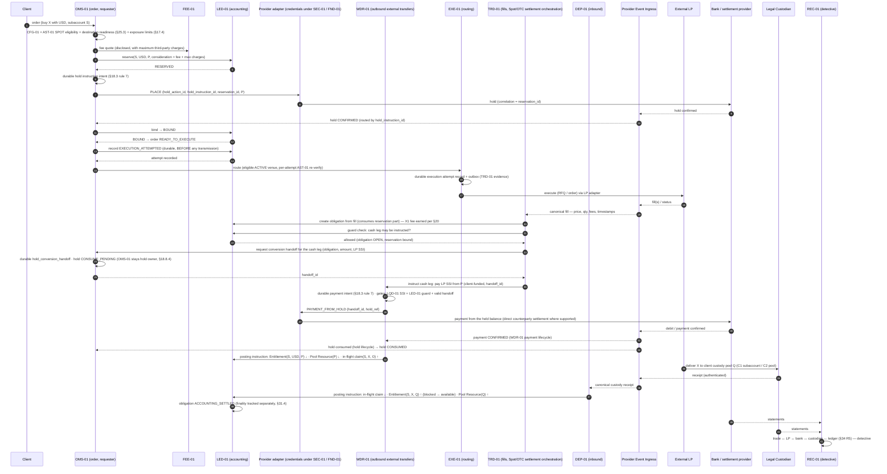

### 25.2 What AIX records

Instruction, order, routing decision, quote, fill(s), cash reservation and bound hold, asset
reservation (for sells), settlement obligation per fill, both legs with provider references, fee,
provider confirmations, custodian receipt, accounting settlement, finality, reconciliation result
— each with evidence and six-year retention where `DEC-012` clause 1 rule 7 applies.

### 25.3 Settlement-destination readiness (pre-trade)

Before routing a **buy**, OMS-01 must confirm that the asset leg has a destination: an active
custody pool for S × instrument-network that satisfies §13.5 Rule A, whose `DEPOSIT_MB_PSO` eligibility
WLT-01 has evaluated against AST-01 for this operation. Before routing a **sell**, the asset
reservation must be bound at the custodian (or fallback). This closes the gap noted in PNF-04
(§41.2) without changing AST-01: AST-01 v1.8 applies the custody conjunct C6 only to custody
subjects, and allow-lists `DEPOSIT_MB_PSO` only to WLT-01 (AST-01 v1.8 §5.2, §5.8).

### 25.4 Cash-leg variants

| Variant | When | Mechanism |
|---|---|---|
| **Direct counterparty settlement** (preferred) | Provider supports paying LP SSIs from the client structure | Provider pays LP from P on AIX instruction, ideally from the bound hold via the requester's conversion handoff to WDR-01 (§18.8.4) |
| **Two-step client-funded** | Direct settlement unsupported | P → client settlement structure (F2) → LP; every hop client-funded, each hop its own pool and leg |
| **Conditional settlement** | An agent / escrow releases one leg against evidence of the other | Rail F2 or escrow (§30.1) |
| ~~AIX corporate prefunded venue / timing advance~~ | — | **Removed in v0.2.** Not permitted for any client obligation (§19.4) |

### 25.5 Sells

Mirror image: asset reservation at custodian → execution → asset leg custodian → LP SSI → cash
leg LP → client fiat pool (inbound via DEP-01). The client's cash entitlement is credited on
**provider-confirmed receipt**, not on fill (§17.4).

---

## 26. OTC Settlement

OTC/RFQ uses the same shared core and the same settlement obligation model; differences:

| Aspect | OTC |
|---|---|
| Price discovery | RFQ / quote-and-confirm (Doc 00 §10.5; `WF-10`) via TRD-01; LP selection reasoning preserved (TRD-01 §5.23) |
| Size | Block; partial fills less common but supported |
| Settlement window | Per LP terms (T+0/T+1, cut-offs); obligation carries the window |
| Sequencing | Per validated LP terms (`EV-20`, `EV-33`): client-funded cash first, LP-delivers-first, or conditional. Whichever applies is recorded on the obligation, never improvised. **Never AIX-corporate-funded first** (§19.4) |
| Credit | Any LP credit to the client is LP-to-client and must be evidenced on the LP arrangement; never AIX-to-client. Any credit facility an LP extends to AIX for AIX's own account is a TRE-01 matter and is never used to fund a client obligation |
| Default / netting | Not assumed: claim holder, loss bearer, gross vs net, set-off, collateral and finality are per validated LP terms (§30.3, `EV-30`, `EV-31`, `EV-33`) |

---

## 27. Pay Settlement

### 27.1 Rails

| Rail | Use | Notes |
|---|---|---|
| Bank / payment rail (fiat) | Merchant collection, payout, refund | Collection via merchant VA/reference (DEP-01 binding to the merchant's subaccount, pool P); payout via WDR-01 |
| Stablecoin rail | Only where the instrument is separately eligible for `PAY` (AST-01 subject `PAY`; securities never — AST-HD-5) | Custody via legal custodian; same deposit/withdrawal controls |
| Merchant settlement | Netting of a merchant's **own** collections against its **own** refunds/fees is product policy; never netting across merchants or clients | Settlement obligation per settlement batch |

### 27.2 Rules

- PAY-01 orchestrates payment intents and owns Pay settlement orchestration; it consumes
  DEP-01/WDR-01/LED-01/FEE-01/REC-01 and does not re-implement them (Module Index §19 rule 8).
- **Pay collections, refunds and chargebacks (R2-F18).** A collection is an inbound receipt
  (DEP-01 records the movement; PAY-01 owns the payment intent). A refund is an outbound transfer
  requested by PAY-01 and executed by WDR-01's external-transfer lifecycle. **PAY-01 is the
  business owner of the Pay chargeback / refund-dispute lifecycle**: the provider adapter and
  ingress authenticate and normalise the external chargeback or dispute event; ingress routes it
  to PAY-01; PAY-01 records the operational event, decides the response (accept, represent,
  dispute) and issues governed instructions; LED-01 records the accounting consequences (reversal
  of the collection, fee reversal under §20.5, Client Deficit of the merchant if the debit exceeds
  its entitlement); DEP-01 / WDR-01 record movement-level consequences against their own movement
  records **on PAY-01's instruction**; REC-01 reconciles (R11); INC-01 consumes escalation signals
  above threshold. **Neither WDR-01 nor DEP-01 becomes the business owner merely because money
  moves.**
- Payer funds are client assets of the payer (or of the merchant once collected), never AIX
  assets. A payment is settled when the provider confirms; refunds are reversing obligations.
- Doc 00 §10.1 item 7 is preserved: **payment and settlement features must not become a custody
  service unless separately approved.** A PAY flow that would leave funds with AIX beyond
  settlement requires its own decision.
- Production activation of Pay beyond the Doc 00 §5.2 baseline remains gated (CURRENT_STATE §9).

---

## 28. RWA Settlement

### 28.1 Abstraction

Because the legal structure of each RWA offering is unresolved (`R4-Q1`…`R4-Q7`, Doc 00 §23),
RWA cash and holder flows are modelled through **role-based settlement parties**, not a fixed
structure:

| Role | Possible holder (resolved per offering by evidence) | Owner module |
|---|---|---|
| Subscription cash holder | Client pool (reserved) / escrow agent / paying agent / issuer account | RWA-03 (orchestration), LED-01 (accounting), arrangement facts per HD-DEC015-01 |
| Escrow agent | Independent third party | Shared provider record (HD-DEC015-01) + RWA-03 rail arrangement |
| Paying agent | Independent third party / issuer agent | Shared provider record (HD-DEC015-01) + RWA-04 rail arrangement |
| Issuer settlement account | Issuer's account (issuer is a CLT-01 client) | Issuer's own pool / destination |
| Holder registry | RWA-04 (or external registrar) | RWA-04 |
| Token custody (securities domain) | Legal custodian — **`R4-Q5` open**; AST-01 v1.8 returns `NOT_ASSESSED` for real-instrument `DEPOSIT_SECURITIES` | EXC-01 / RWA-04 consumers |

### 28.2 Flows (architecture)

| Flow | Sequence |
|---|---|
| Subscription | Investor reservation at investor pool → offering close → allotment → cash leg to escrow/issuer per offering terms → holder entry (RWA-04) / token delivery → reconciliation |
| Distribution | Issuer/paying agent funds distribution → per-holder entitlement computed from RWA-04 record date → payout via WDR-01 or credit to investor pool → reconciliation |
| Redemption | Holder instruction → token/holding lock → redemption cash from issuer/paying agent → holder cash credit on provider confirmation → token burn/registry update |

### 28.3 Rules

- Which party holds subscription cash, and whether AIX ever holds it, is an **external validation
  item** per offering (`EV-21`). The architecture supports all variants; none is assumed.
- An RWA settlement obligation uses the same accounting obligation model (§31) with role-typed
  legs; orchestration is RWA-03 (subscription) / RWA-04 (distribution, redemption).
- RWA securities production activation remains gated (`DEC-013` clause 7).

---

## 29. Exchange Clearing / Settlement

### 29.1 Separation

AIX Exchange is the **securities domain** (`DEC-012` clause 5, `DEC-013` clause 7, `LIC-RULE-005`).
Its clearing and settlement interface is **EXC-01**, which consumes the shared financial control
core (LED-01, REC-01, FEE-01, SEC-01, CFG-01, AST-01 securities subjects) but **does not reuse**
MB Spot/OTC execution, routing or settlement-orchestration code paths (Module Index v1.4 §19 rules 5A
and 8; §20 cross-track rule — the Execution and Securities Exchange tracks "must not share execution code").
EXC-01 owns Exchange settlement orchestration.

### 29.2 Interfaces

| Interface | Owner | Notes |
|---|---|---|
| Cash leg | EXC-01 → LED-01 (securities-domain obligation type) → WDR-01/DEP-01 rails | Participant cash pools per participant arrangement |
| Securities / token leg | EXC-01 → RWA-04 holder registry / custodian | `DEPOSIT_SECURITIES` / `WITHDRAWAL_SECURITIES` subjects (AST-01 allow-list: EXC-01, RWA-04) |
| Clearing interface | EXC-01 | Whether a CCP/clearing agent exists is an external fact (`EV-23`) |
| Holder-registry interaction | RWA-04 | Transfer restrictions enforced (AST-01 v1.8 §7) |
| Transfer controls | EXP-01 (market boundary), RWA-04 / on-chain | |

### 29.3 Settlement pattern

Exchange settlement may be atomic DvP **only** if the chosen infrastructure guarantees it (e.g., a
single-ledger token-vs-token-cash swap or a CSD DvP model); otherwise it is **conditional** or
**orchestrated** settlement (§30). The pattern is selected per market model and recorded; it is not
assumed.

### 29.4 Exchange approval evidence

**Repository evidence:** no document in `docs/` or `platform/` records that an Exchange approval
has been received. Doc 00 v1.5 records "Exchange application pending" (e.g. §6 table row
"Securities / financial-instrument Exchange capability … Production: Exchange application pending;
scope unresolved — `R1-Q1b`") and `R1-Q1b` ("Does AIX's own Exchange approval cover securities,
digital-currency order-book activity, or both?") is open. CURRENT_STATE §1 reads "(Exchange
application pending)". Seeded CFG-01 prohibition reasons in `platform/services/cfg1/src/lib/doc00-baseline.ts`
lines 56–60 read "Exchange application pending; …" (frozen identifiers, `MIG-006`/`MIG-008`).

**Therefore:** DEC-015 records `EV-22` — *Obtain and verify actual Exchange approval evidence,
scope, conditions and commencement requirements.* Software build is **not** dependent on it. No
AIX document may state that AIX operates a live Exchange. Existing "pending" wording is left
untouched until the evidence is verified and a governed master revision updates it.

---

## 30. DvP Terminology

### 30.1 Vocabulary (normative)

| Term | Meaning | Use only when |
|---|---|---|
| **TRUE ATOMIC DvP** | Both legs settle in one indivisible operation; neither can complete without the other | The infrastructure **guarantees** it (e.g., single-ledger atomic swap, CSD/central-bank DvP model). **Never** for commercial bank rails + blockchain + custodian combinations |
| **LINKED TWO-LEG SETTLEMENT** | Two legs on different rails, bound by one obligation, each with its own confirmation; one-leg-complete is an explicit state | Default for Spot/OTC across bank + custodian |
| **CONDITIONAL SETTLEMENT** | A third party (settlement agent, escrow, provider) releases one leg only on evidence of the other | Rail F2, escrow agents, some RWA flows |
| **ORCHESTRATED SETTLEMENT** | AIX sequences and instructs both legs under controls, without a third-party condition | F1 direct settlement where the provider pays on AIX instruction |
| **PREFUNDED SETTLEMENT** | One side's resources are placed in advance; must state **whose** (client-funded / LP). **AIX-corporate-funded prefunding never settles a client obligation** (§19.4) | LP requires prefunding; client reservations |
| **ASYNCHRONOUS EXTERNAL SETTLEMENT** | Legs settle on independent external timelines; AIX observes and reconciles | Most external rails, especially blockchain + bank |

### 30.2 Product mapping (default, subject to provider capability)

| Product | Default pattern | Orchestration owner |
|---|---|---|
| Spot / OTC | Linked two-leg settlement, orchestrated, client-funded, asynchronous external confirmation | TRD-01 *(proposed)* |
| Pay | Orchestrated / asynchronous; refunds as reversing obligations | PAY-01 |
| RWA subscription / servicing | Conditional (escrow/paying agent) or orchestrated, per offering | RWA-03 / RWA-04 |
| Exchange | Per market model: true atomic DvP only if infrastructure guarantees it; else conditional/orchestrated | EXC-01 |

### 30.3 What settlement never does; gross vs net (R07)

1. No settlement step nets, crosses or internalises one AIX client's position against another's
   (`DEC-012` clause 3; `DEC-013` clause 5 items 1–3). Each client fill settles against a distinct
   external counterparty fill (Module Index §19 rule 5).
2. **No client's funds may settle another client's obligation**, under any settlement basis.
3. **DEC-015 does not assume LP settlement is gross, and does not assume it is net.** Each LP
   arrangement records `settlement_basis ∈ {GROSS_PER_OBLIGATION, NET_PAYMENT_AGGREGATION,
   NET_LEGAL_NETTING, UNVERIFIED}` from evidence (`EV-33`), with its set-off, netting, credit
   support, collateral, close-out and finality terms.
4. `NET_PAYMENT_AGGREGATION` (one payment carrying several independently recorded, individually
   funded client obligations, each discharged from its own client's resources and allocated back
   per obligation) is usable only once `EV-33` evidences that the counterparty treats each
   obligation as discharged individually.
5. `NET_LEGAL_NETTING` in which one client's receivable discharges another client's payable is
   **not usable for client obligations** under DEC-015 (rules 1–2). An LP that can only settle
   that way cannot settle client obligations.
6. `UNVERIFIED` ⇒ no live LP settlement for client obligations (fail closed).

### 30.4 Existing wording to rebaseline

LED-01 v1.1 §5.18 "Two-Leg Linked DvP Settlement … 3. **Atomic completion** requires both
required legs to satisfy settlement conditions" describes linked two-leg settlement, not atomic
DvP. Masters use "DvP sequence" as a control name (Charter §9.4, SET-RULE-001, MON-SRS-007, WF-12,
DF-11, Security Architecture threat table). These are terminology changes recorded in §43/§49
(PNF-03).

---

## 31. Settlement State Model

### 31.1 Five lifecycles, five owners — never merged

| Lifecycle | Owner | States (illustrative; each owner's blueprint may rename, meanings binding) |
|---|---|---|
| **Order** | OMS-01 (Spot/OTC); PAY-01 payment intent; RWA-03 subscription; WDR-01 withdrawal request | e.g., `created → awaiting_resources → READY_TO_EXECUTE → routed → (partially_filled) → filled / cancelled / expired / rejected`; `reconcile_required` while an attempt is unknown |
| **Execution** | EXE-01 (routing decision) / TRD-01 (attempts, fills, evidence) | `attempt_sent → acknowledged → filled / partially_filled / rejected / no_fill`; `unknown → resolved` by query-back (TRD-01 v1.2 §5.20) |
| **Reservation** | LED-01 (accounting) — §18.3 | `RESERVED → BOUND → EXECUTION_ATTEMPTED → … → CONSUMED / RELEASED` |
| **Settlement obligation — accounting** | **LED-01** | §31.2 — starts at the fill |
| **Settlement orchestration** (when to instruct which leg, timers, retries, escalation) | **Product workflow owner**: TRD-01 for Spot/OTC *(proposed)*; PAY-01 for Pay; RWA-03 / RWA-04 for RWA; EXC-01 for Exchange; WDR-01 for withdrawals; DEP-01 for deposits / returns-in | Owner-defined; consults LED-01 guards before every leg instruction |
| **Accounting posting** | LED-01 | `pending → posted → (reversed by a new reversing journal)`; never edited |
| **Provider hold instruction** | **The reservation's requester** (§18.8) — OMS-01, PAY-01, RWA-03, or WDR-01 for its own withdrawals | `NO_HOLD → PLACE_PENDING → BOUND → EXTEND / REDUCE / RELEASE / CONSUME (…_PENDING) → RELEASED / CONSUMED`, plus `HOLD_FAILED`, `HOLD_LOST`, `ORPHAN_HOLD`, `ACTION_UNKNOWN` |
| **External transfer** | WDR-01 (outbound external transfers, incl. a payment from a hold under the requester's conversion handoff, and observed outflows — **not** hold instructions) / DEP-01 (inbound, incl. observed returns-in) | `requested → submitted → accepted → completed / failed / returned`; provider finality per §31.4 |

LED-01 **does not own product or business orchestration merely because it owns the accounting
obligation**. LED-01 v1.1's "DvP Settlement Controller" and "DvP Leg Controller" are re-scoped as
**accounting transition guards** (may this leg be posted / instructed given the accounting
state?) with **no timers, no retries and no provider instructions** — renamed per §30 at the
LED-01 revision.

### 31.2 Settlement obligation — accounting states (LED-01)

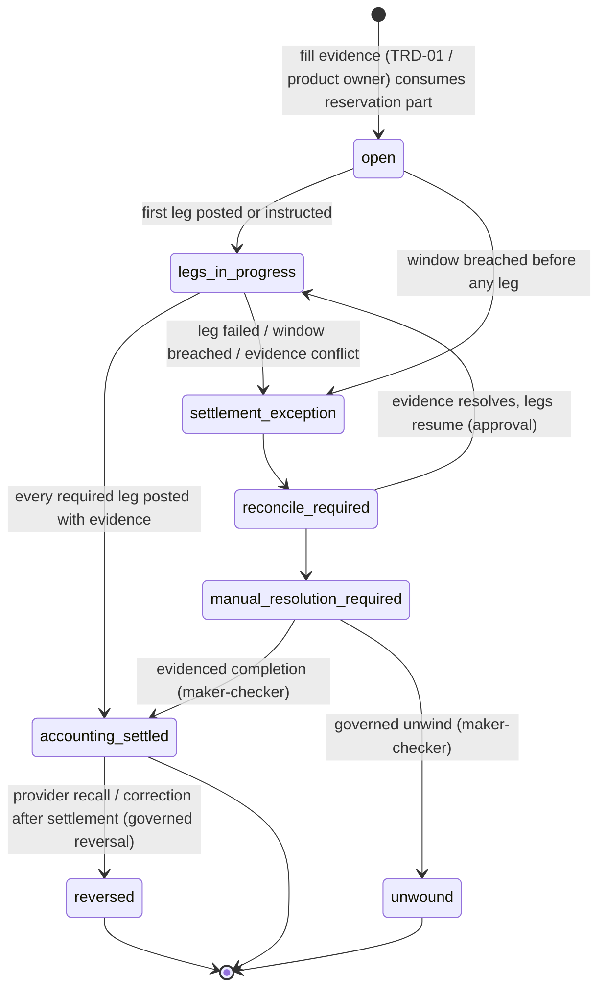

Per-leg accounting status (on the obligation): `due → in_flight (provider-confirmed debit of the
sending leg) → completed (provider-confirmed receipt) | failed | returned`. Each leg also carries
its **finality status** (§31.4).

`suspense` remains a **ledger account** state for funds, not an obligation state. Pre-execution
states (`created`, `awaiting_resources`, `reserved`, `ready_to_execute`) are **not** obligation
states: they belong to the order and the reservation (§31.1).

### 31.3 Rules

1. An obligation is created **only** from fill (or equivalent execution / allotment / payment)
   evidence; one obligation per fill or per venue-fill group (§32).
2. Every transition requires a cause and evidence; transitions out of `manual_resolution_required`
   are maker-checker.
3. An executed trade is never treated as unexecuted: an obligation never returns to a
   pre-execution state; the reservation it consumed is never re-released as if unexecuted.
4. Per-state time limits are configuration **owned and enforced by the orchestration owner**;
   breach escalates (INC-01) and requests REC-01 attention. LED-01 enforces only guards.
5. The orchestration owner may instruct a leg only after LED-01's guard allows it; WDR-01/DEP-01
   execute and record; the provider executes.
6. **Canonical rule for inactive rails (R2-F10).** LED-01 **always** records the accounting
   obligation from fill (or equivalent) evidence, whatever the state of any rail — an execution
   that happened is never left unrecorded. Inactive-rail refusal happens **before** execution and
   **before** instruction, never at obligation creation: OMS-01 / EXE-01 refuse to route to a venue
   or settlement path that is not `ACTIVE` (§35.6), and the instructing module (WDR-01 for
   transfers) and the provider adapter refuse to transmit a leg instruction over a rail that is
   not `ACTIVE`. If a rail becomes inactive after a fill, the obligation exists, the leg is not
   instructed, and the obligation moves to `settlement_exception` (§33.2).

### 31.4 Finality is separate from accounting settlement

`accounting_settled` means every leg is posted with provider evidence. It does **not** mean the
legs are final. Each leg records `finality ∈ {NOT_FINAL, FINAL_PER_RAIL, FINALITY_UNKNOWN}` per the
rail's evidenced finality and recall semantics (`EV-36`, BNK-REQ-043, CUS-REQ-040, `EV-33`). A
recall, return or reversal after `accounting_settled` follows `accounting_settled → reversed`
(§33.4). Client-facing "settled" wording must not imply finality where the rail does not provide it.

---

## 32. Partial Fill Handling

```
USD 1,000 reserved at pool P (BOUND, correlation R; hold owner = OMS-01, the requester); EXECUTION_ATTEMPTED
USD   600 executed (fill F1)
→ obligation O1 created for 600 (+ fee on 600, X1)
→ authoritative terminal state for the attempt (filled-and-done / cancelled remainder confirmed /
  final unfilled quantity confirmed by the venue)
→ OMS-01 (requester) issues REDUCE of 400 (or RELEASE after the 600 leg where the provider cannot
  reduce) — hold REDUCE_PENDING_PROVIDER; the 400 is NOT available
→ provider confirms the reduction → LED-01 releases the unconsumed 400 (+ unearned fee portion) — only now
→ O1 settles: OMS-01 conversion handoff → WDR-01 pays 600 to the LP SSI from the hold; asset to custody pool Q
→ REC-01: reservation ↔ hold record (OMS-01) ↔ provider hold ↔ fills ↔ obligations ↔ payment (R5, R6, R14)
```

Full sequence, per-action predicates and the no-reduce variant: §18.8.5. **WDR-01 never releases or
reduces an order's hold**; it executes only the payment out of the hold under the handoff (§18.8.4).

Rules:

1. Fee follows the **filled** amount unless disclosed product policy states otherwise (§20.5).
2. **No unfilled value remains reserved indefinitely, and none is released while status is
   unknown.** An order's residual reservation is released at the order's **authoritative**
   terminal state (§18.3 rule 3) and, where a provider hold is bound, only after the provider confirms
   the reduction or release (§18.8.3). A reservation expiry timer can release only a reservation with
   no execution attempt (§18.3 rule 4); for an attempted order, a long-unresolved status escalates
   (TRD-01 query-back, INC-01) instead of releasing.
3. Multiple fills (incl. split across venues under Model B) create one obligation per fill or per
   venue-fill group; each settles independently.
4. Slippage/price-tolerance breaches route to release / re-quote / void per TRD-01, unchanged —
   release still subject to §18.3 and §18.8.

---

## 33. Failed / Reversed Settlement

### 33.1 Execution failed (nothing executed)

```
USD 1,000 reserved → LP execution fails with AUTHORITATIVE no-fill (or confirmed cancel)
→ order failed; no obligation created
→ reservation released by governed transition; provider hold released (confirmed)
→ no fee; no AIX financing; client informed
```

A **timeout or ambiguous response is not a failure**: the reservation is `EXECUTION_UNKNOWN`, the
order `reconcile_required`, until the LP confirms fill or no-fill (§18.3, §40 rows 16 and 36).

### 33.2 Execution succeeded, settlement uncertain

Do **not** pretend execution did not happen. Move to `settlement_exception` →
`reconcile_required` → `manual_resolution_required` as evidence dictates. The client's reserved
resources stay reserved and the hold stays pinned; the position is shown as "executed, settlement
pending/exception".

### 33.3 One leg completes first; counterparty default (R07)

| Case | Treatment |
|---|---|
| Cash leg complete, asset leg pending | Normal transient state within the window: the client holds an **in-flight settlement claim** (§17.4). Past window → `settlement_exception`; REC-01 break; LQD-01 counterparty exposure updated; **AIX does not deliver from inventory or corporate funds**. The claim is recorded for the client; **who legally holds the claim against the LP** (`claim_holder`: client directly / AIX as agent / AIX as principal back-to-back) is an arrangement fact (`EV-30`), not assumed |
| Asset leg complete, cash leg pending | Asset received at the client's custody pool is credited **blocked** to the client pending the cash leg; if the cash leg cannot complete, unwind is a governed return of the asset to the LP or completion from the client's reserved funds — never AIX funds |
| LP applies / seizes AIX corporate collateral after a client failure | `settlement_exception` with reason `COUNTERPARTY_APPLIED_CORPORATE_COLLATERAL`; corporate exposure recorded; client obligation **not** settled from corporate value; any delivered asset held blocked in Pool Exception; recovery only from the failing client on a valid basis (§19.5) |
| Counterparty default | Obligations with the defaulting LP move to `settlement_exception` with reason `COUNTERPARTY_DEFAULT`. **Neither "the client bears LP default" nor "AIX bears LP default" is assumed.** The loss bearer is held behind `loss_bearer ∈ {CLIENT_PER_AGREEMENT, AIX_PER_AGREEMENT_OR_LAW, SHARED_PER_AGREEMENT, UNVERIFIED}` (`EV-31`), and recovery mechanics (set-off, collateral, credit support, close-out, insolvency claim) per `EV-33`. While `UNVERIFIED`: no automatic write-down of the client's claim, no automatic AIX corporate cover, the claim stays recorded and escalated, and any resolution is maker-checker on validated terms |
| Netting dispute | The disputed obligations stay at gross per obligation in AIX's records; `settlement_exception`; no client obligation is discharged by another client's value (§30.3) |
| Partial settlement | Explicit per-leg status; no AIX residual position (Charter §9.4 rule 6 preserved) |

### 33.4 Reversal / return

Provider recalls, returns, custodian reversals, chain reorgs below finality, LP corrections → a
**governed reversal** (reversing entries, never edits) with provider evidence, triggering the
coverage re-check for the affected pool (LED-01 v1.1 clawback section preserved). If reversed
funds were already used by the client, the excess over the client's entitlement is **Client
Deficit** (§17.5) with containment of the affected scope (§17.9) — never a negative entitlement, never offset
against another client, and not absorbed by AIX as principal (Doc 00 §10.6 item 22 "Failed LP
execution must trigger trade void or ledger reversal, not AIX principal absorption", generalised).
Any restoration of the pool for other clients is X6 under `EV-35` only.

### 33.5 Who decides

LED-01 owns the accounting state; the product orchestration owner drives the case; REC-01 detects;
Finance/Operations resolve through maker-checker (Role Matrix §23 reconciliation break closure);
INC-01 freezes where an incident threshold is met.

### 33.6 Exposure terminology

| Class | Examples | Status |
|---|---|---|
| **PROHIBITED** | Proprietary trading exposure; company-funded client shortfall **or bridge**; principal liquidity provision; undisclosed inventory execution; AIX-corporate-funded leg preceding a client leg | Never designed, never permitted, every environment |
| **OPERATIONAL (possible, controlled)** | Counterparty exposure to an LP mid-settlement (in-flight claims); settlement timing exposure; provider-failure exposure (bank/custodian/LP insolvency or outage); provider exposure under the §18.4 fallback; corporate prefunding / credit-support exposure at an LP; client-deficit exposure after an external reversal | Named, limited (configuration), monitored, reported; never re-labelled as proprietary dealing and never claimed to be zero |

DEC-015 does **not** claim AIX has zero exposure in all circumstances. It claims AIX takes **no
prohibited** exposure by design and **minimises and controls** operational exposure.

---

## 34. Reconciliation Architecture

### 34.1 Topology

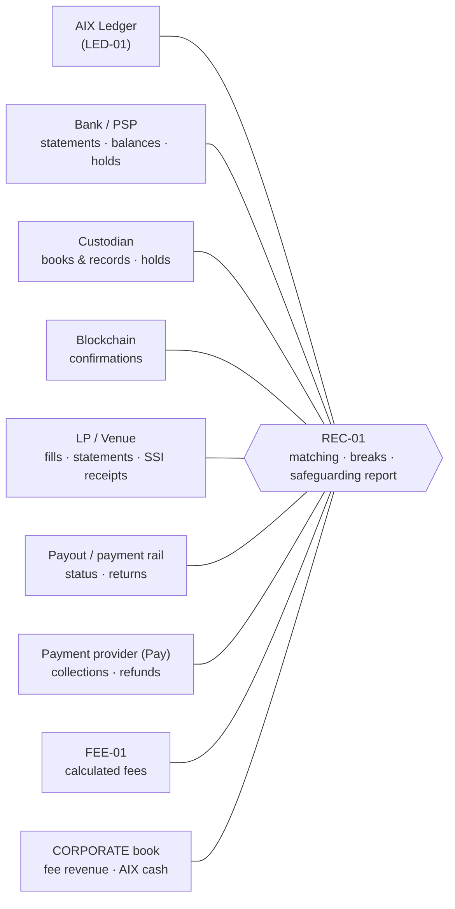

### 34.2 Reconciliation set

| # | Reconciliation | Ways | Cadence |
|---|---|---|---|
| R1 | Ledger ↔ bank/PSP per fiat **resource pool** (client claims + suspense + AIX fee payable + pool exception vs evidenced balance — the §17.2 reconciliation identity) | 2-way | Event-level + intraday + EOD |
| R2 | Ledger ↔ custodian per custody location (client and pool level) | 2-way (C1 per client; C2 per pool **and** per client from AIX sub-ledger vs custodian pool records) | Event + intraday + EOD |
| R3 | Custodian ↔ chain (addresses/vaults) | 2-way, corroborative | Event + EOD |
| R4 | **Ledger ↔ custodian ↔ chain** | 3-way | EOD |
| R5 | **Trade ↔ LP ↔ bank ↔ custodian** (fill ↔ LP confirmation ↔ cash leg ↔ asset leg) | **4-way** (Spot/OTC) | Per obligation + EOD |
| R6 | Reservation (LED-01 binding) ↔ hold-instruction record of the **requester** (OMS-01 / PAY-01 / RWA-03, or WDR-01 for its own withdrawals — §18.8) ↔ provider hold, per action (place / extend / reduce / release / consume) and per conversion handoff ↔ WDR-01 payment; orphan / lost / expiring / release-pending / reduce-pending holds | 3-way (+ handoff) | Event + intraday |
| R7 | Settlement obligation ↔ provider settlement status (each leg) | 2-way per leg | Event + EOD |
| R8 | Fee calculated (FEE-01) ↔ fee earned X1 (LED-01) ↔ fee-payable collection encumbrance ↔ fee swept X2 (bank) ↔ fee revenue (CORPORATE); pool-level fee payable age vs `fee_sweep_max_latency` | 4-way + ageing | Daily |
| R9 | **Safeguarding coverage** per asset × resource pool (§17.2), outcome `COVERED` / `SHORTFALL` / `UNDETERMINED`, with legal-pool and aggregate lines as reports only; separate lines for verified backing, usable liquidity, pool-wide and client-specific legal restriction, temporarily unverifiable resources, resource uncertainty, in-flight settlement exposure (§17.4) and client deficits (§17.5) — §17.8 | Per pool + reports | Intraday + EOD (safeguarding report) |
| R10 | Payout rail ↔ ledger (withdrawals, returns) | 2-way | Event + EOD |
| R11 | Payment provider ↔ ledger (Pay collections, refunds, merchant settlement) | 2-way / 3-way with merchant settlement | Event + EOD |
| R12 | Structural (ACC-01 R-5/R-6 via REC-01) | Existing | Per REC-01 schedule |
| R13 | External location / pool registry ↔ provider (VA list, custodian subaccounts, address assignments, pool membership, operating state) | 2-way | Daily |
| R14 | Instruction intent ↔ provider outcome: every durable instruction record (§18.3 rule 7) has exactly one provider outcome or an open uncertainty case; every provider-evidenced instruction outcome matches a durable intent | 2-way | Event + EOD |
| R15 | Custodian / provider exit: departing location ↔ successor location ↔ client returns ↔ ledger, per evidenced slice including in-flight migration claims (§13.8), before the first and after the last exit transfer (§13.6); stranded / recovery claims ↔ administrator evidence (§10.2.3) | 3-way | Per exit + EOD during exit |
| R16 | Closure-fact attestations ↔ original authorities (§51.5): each attested closure fact matches its original authority's state, watermark and delivery-completeness evidence at seal and at the apply-time recheck | Per authority | Per closure |

### 34.3 Event-handling rules

| Condition | Rule |
|---|---|
| Statement completeness | Safeguarding report is not final until every location's statement for the period is received and authenticated (REC-01 v1.1 `statement_completeness = all_safeguarding_accounts`, preserved) |
| Late event | Matched on arrival; break auto-closes **only** if evidence fully explains it; otherwise stays open |
| Duplicate event | One canonical business event per provider business event, identified under the provider event-identity profile (§35.7): namespaced native event id; a fallback fingerprint only where its discriminator is proven unique per economic occurrence; otherwise `QUARANTINE_AMBIGUOUS_EVENT`. Every redelivery recorded as a **delivery attempt**, never re-posted; same id with different economic content quarantined as a conflict; a missing required id is a provider contract / capability breach, not a duplicate |
| Out-of-order event | Processed by provider sequence/time; state machine rejects impossible transitions → break |
| Provider correction | New evidence record linked to the corrected one; LED-01 governed reversal if postings depended on it |
| Bank recall | §33.4 |
| Chain reorg | §33.4; custodian confirmation threshold per network (configuration) |
| Custodian correction | As provider correction; client-level re-attribution under maker-checker |
| LP correction | Trade correction workflow (TRD-01), never silent fill edits |
| Reservation / hold mismatch | `HOLD_MISMATCH` / `ORPHAN_HOLD` / `HOLD_LOST` (§18.3, §18.5); affected movements blocked |
| Uninstructed outflow | §23.1 observed-outflow path; break unless classified and expected |
| Fresh provider read ≠ REC-01 evidence | §16.7 rule 3: fail closed where material; break |
| Settlement mismatch | `settlement_exception` |
| Fee mismatch | Break; fee sweep for the affected scope blocked until resolved |

### 34.4 Remediation

REC-01 **detects and records**; it **never** changes the ledger and is never the preventive sufficiency input (§16.7). Remediation is a governed LED-01
reversing/adjusting entry or a provider-side correction, approved by maker-checker (Role Matrix §23
"Reconciliation break closure"), with evidence retained. Blocking thresholds (which breaks freeze
which scope) are configuration with a fail-closed default.

### 34.5 Evidence retention

All provider evidence — the **raw payload itself** (or a protected raw-evidence reference to an
immutable copy), its hash, signature / header evidence, authentication result, provider and AIX
timestamps, schema / API version, normalised event and normaliser version, delivery attempts
(§35.7) — plus durable instruction records (§18.3 rule 7), reconciliation runs, breaks and
resolutions are retained at least as long as the ledger and order records they support (≥ 6 years
where `DEC-012` clause 1 rule 7 applies); the platform retention policy, once defined, governs
(DCR-ACC-GOV-06 precedent). **Raw evidence is never discarded because normalisation succeeded.**
Raw payloads may contain client personal data: the store is encrypted, access-controlled and
audited (SEC-01), and data-protection rules (`EV-27`) apply.

---

## 35. Provider Adapter Architecture

### 35.1 Interfaces (provider-neutral)

| Interface | Primary consumers | Responsibilities |
|---|---|---|
| **Bank / PSP / Settlement Adapter** | WDR-01 (outbound transfers: withdrawals, payouts, settlement payments, fee sweeps, returns), reservation requesters (hold actions place / extend / reduce / release / consume for their own reservations — OMS-01, PAY-01, RWA-03, WDR-01; WDR-01 executes a payment **from** another requester's hold only under that requester's conversion handoff, §18.8.4), registry owner per HD-DEC015-01 (VA lifecycle requests), DEP-01 (inbound), REC-01 (statements, read-only), movement owners (movement-scoped reads, read-only) | VA lifecycle, balances, holds, payments, returns, statements |
| **Custodian Adapter** | WDR-01 (transfer requests incl. exit transfers), reservation requesters (asset holds / policy locks), WLT-01 (deposit-address assignment requests only), DEP-01 (inbound), REC-01 (statements, read-only) | Custody accounts/subaccounts, address assignment, balances, holds/policy locks, transfer requests, signing status, statements |
| **Blockchain Observation Adapter** | DEP-01, WDR-01, REC-01 | Independent confirmation/finality observation; reorg detection |
| **LP / OTC Adapter** | EXE-01 (routing), TRD-01 (orders, fills, settlement confirmations), LQD-01 (capability/health) | Quotes, orders, fills, cancellations, settlement status, statements |
| **Payment Rail Adapter** | PAY-01 (intents, chargeback / dispute responses), WDR-01 (payouts, refunds), DEP-01 (collections) | Payment intents, collections, payouts, refunds, chargebacks where applicable |
| **Statement / Reconciliation Adapter** | REC-01 | Statement ingestion (API/file), authentication, completeness |
| **Provider Event Ingress** (shared, §35.7) | All of the above for **inbound** provider traffic | Authenticate, retain raw evidence, dedupe, normalise, route; no business state |

(v0.1's "Venue Settlement Adapter … LED-01 (via WDR-01/DEP-01)" is withdrawn: LED-01 consumes no
adapter. LP settlement confirmations go to TRD-01; AIX-corporate venue balances go to TRE-01.)

### 35.2 Placement

Adapters are **implementations behind interfaces owned by the consuming module's boundary** —
repository precedent: AML-01 `services/aml1/src/lib/providers/registry.ts` and WLT-01
`services/wlt1/src/lib/providers/` each keep their own provider registry — with
shared contracts and cross-cutting mechanics (authentication, idempotency, replay protection,
outbox, retry, circuit breaking, **outbound instruction transmission and credential use**) in
FND-01-style shared packages. Where several modules instruct the same provider arrangement, they
share **one adapter instance per provider arrangement × environment**, whose credentials are held
in KMS / vault under SEC-01 / FND-01 controls (§35.8); no module receives raw credentials. No new
top-level module is created for an integration (P-08). The provider-neutral domain model never contains a provider
field beyond opaque `provider_id` / `provider_arrangement_id`.

### 35.3 Inbound provider traffic and the perimeter

Provider webhooks/callbacks are a new class of inbound internet traffic. They enter through the
IMP-02 perimeter design (no direct exposure of internal services), terminate at **Provider Event
Ingress** (§35.7), with per-provider authentication (signature/mTLS), replay windows and rate
limits. **This is a future FND-01 / IMP-02 / security-architecture item, not a DEC-015 change to
IMP-02** (§44, master 09).

### 35.4 Capability model

Each provider adapter carries a **governed capability profile** (held with the consuming module's
rail arrangement; LP/venue profiles in LQD-01 — D-2): a set of declared capabilities, each
`SUPPORTED` / `NOT_SUPPORTED` / `UNKNOWN`, with evidence reference and the environments in which it
has been demonstrated (mock / sandbox / production).

**Bank / PSP / settlement:** `supports_virtual_accounts`, `supports_unique_payment_reference`,
`supports_balance_api`, `supports_available_balance_api`, `supports_per_va_balance`,
`supports_per_va_debit_limit`, `supports_reservations`, `supports_reservation_release`,
`supports_reservation_extend`, `supports_hold_convert_to_payment`,
`supports_direct_counterparty_settlement`, `supports_wire`, `supports_swift`, `supports_webhooks`,
`supports_polling`, `supports_return_to_source`, `supports_reversal_events`,
`supports_uninstructed_debit_events`, `supports_multi_currency`, `supports_provider_maker_checker`,
`supports_statements`.

**Custodian:** `supports_client_subaccounts`, `supports_omnibus`,
`supports_unique_deposit_addresses`, `supports_address_assignment`, `supports_balance_api`,
`supports_transaction_status`, `supports_withdrawal_policy`, `supports_provider_maker_checker`,
`supports_signing_status`, `supports_whitelisting`, `supports_asset_holds`,
`supports_settlement_transfer`, `supports_statements`, `supports_reconciliation`,
`supported_assets`, `supported_networks`.

**Legal facts are not capabilities.** Custodian legal role, control facets, account holder,
beneficial ownership, allocation mode, hold enforceability, insolvency treatment and insurance are
**arrangement facts** (§10.2, §13.4) evidenced by `EV-*`, recorded separately from technical
capability flags. `supports_reservations = SUPPORTED` says nothing about `provider_hold_authority =
ENFORCEABLE`.

**Rule:** an operation that needs capability *k* checks *k* = `SUPPORTED` for the arrangement in
the current environment; `NOT_SUPPORTED` or `UNKNOWN` denies **that operation** (and selects the
documented fallback where one exists, e.g., §18.4), never the whole provider.

### 35.5 Provider-specific leakage

Provider error codes, state names and payload shapes are mapped to canonical vocabularies in the
adapter / ingress. A domain module never branches on a provider name.

### 35.6 Live-routing state

Each provider rail has a **live-routing (rail activation) state** per operation class and
environment (`DISABLED` / `SANDBOX_ONLY` / `ACTIVE` / `EXIT_ONLY` / `SUSPENDED`), held by the module executing that
operation class as a deny-by-default, maker-checker registry (precedent `wlt1.fiat_rail_coverage`,
migration 061; LP/venue activation stays in LQD-01), evaluated as a conjunct in addition to CFG-01
production activation (`DEC-013` clause 11 access formula). In PRODUCTION, live routing to a
provider for an **ordinary** operation class requires: arrangement facts `VERIFIED` (incl.
classification `THIRD_PARTY_ELIGIBLE` under §13.4 for custodians and §9.6.4 for pools), an
operating state permitting the operation class (§10.2.1 — `WIND_DOWN` routes only its servicing
mode), the shared provider record's WF-19 status `approved`, required notifications complete where
applicable (e.g., LP/venue: ¶7.5 seven-day prior notification per `DEC-012`), credentials in
KMS/vault, and CFG-01 production activation of the consuming capability.

**Distressed exit classes (R3-F01).** `DISTRESSED_ASSET_RETURN` and `DISTRESSED_MIGRATION` route
only through an **`EXIT_ONLY`** entry for that class, opened by maker-checker under an `APPROVED`
exit authorisation (§10.2.2). It does **not** require WF-19 `approved` or arrangement `VERIFIED`, and
it is available while the ordinary classes of the same rail are `SUSPENDED`; it **does** require
credentials in KMS / vault (`WDR-FIND-001`), the identity × instruction-class matrix, provider
capability for the operation, CFG-01 production activation of the consuming capability and every
unconditional control of §10.2.2. An `EXIT_ONLY` entry never routes a new placement, an ordinary
withdrawal or a settlement leg.

`cfg1.feature.current_state = enabled` is never evidence of any of these (`DEC-014`).

### 35.7 Provider Event Ingress, raw evidence, deduplication and event ownership (R06, R2-F08, R2-F18)

**Component.** One shared **Provider Event Ingress** per environment — proposed as an FND-01
shared platform component (D-6), exposed through the IMP-02 perimeter. It verifies authenticity
(signature / mTLS, pinned and rotated keys), enforces replay windows, **retains immutable raw
evidence**, deduplicates, normalises the payload to a canonical event, classifies it and **routes
it to exactly one owning lifecycle module**. **It owns no business state, posts nothing and decides
nothing.** An unauthenticated event is rejected and alerted (its raw bytes and rejection reason are
kept as security evidence); an unclassifiable event is quarantined and alerted.

**Immutable evidence record (per received delivery and per canonical event):**

| Field | Purpose |
|---|---|
| Provider identity; `provider_arrangement_id`; environment | Whose event |
| Event-identity namespace: provider, `provider_arrangement_id` / tenant, environment, feed / endpoint | Scope in which a native id is unique (per the event-identity profile) |
| Provider event id (if offered); provider sequence / version (if offered) | Native identity (within the namespace) |
| Identity basis: `NATIVE` / `PROVEN_FALLBACK` / `AMBIGUOUS_QUARANTINED` / `RESOLVED_DISTINCT` / `RESOLVED_DUPLICATE`, with the resolution evidence | How the canonical event was identified |
| Provider object / reference id (transaction, payment, hold, transfer, VA) | Business identity |
| Event type (provider) and canonical event class | Routing |
| **Raw payload** (or a protected raw-evidence reference to an immutable copy) and its hash | Re-verification and re-derivation; **never discarded because normalisation succeeded** |
| Signature / header evidence (signature, key id, timestamp header, mTLS peer identity) | Re-verify authenticity later |
| Verification result (and reason) | Authentication evidence |
| Provider timestamp; AIX received timestamp | Both kept; ordering uses provider sequence where offered |
| Provider schema / API version | Interpretation |
| Normalised canonical event; canonical schema version; normaliser version | Re-derivation and audit of normalisation |
| Correlation identifiers (`reservation_id`, `hold_instruction_id`, `instruction_id`, `movement_id`, VA / location, `obligation_id`) | Routing to the owner and matching to durable intents (R14) |
| **Delivery-attempt metadata** (attempt number / transport id, delivery time, source endpoint) | Kept per attempt, separate from the canonical event |

**Event identity — one canonical business event per provider economic occurrence (R2-F08,
corrected by R3-F05).** A stable **parent** object reference (order, payment, VA, account) is **not**
an event identity: two genuine partial settlements of USD 100 against order 123 on the same value
date share it (`04-review-r3.md` R3-F05).

1. **Provider event-identity profile** (governed, evidenced, per provider arrangement × feed / event
   class; held with the rail arrangement, consumed by the ingress): `native_id_scope` (global / per
   tenant / per account / per feed); `native_id_uniqueness` (per economic occurrence, or per object
   state change); `redelivery_semantics`; `required_id_classes` (event classes that must carry a
   native id); `fallback_discriminator` (the field set proven unique per economic occurrence — e.g., a
   transaction / leg / fill id or a gap-free statement sequence number — **never** a parent order /
   payment / account reference); `fallback_uniqueness_evidence`. Missing profile ⇒ native ids only;
   no fallback is canonical. (BNK-REQ-059, CUS-REQ-086, LPC-REQ-070.)
2. **Native identity:** the provider-native event id **namespaced** by provider ×
   arrangement / tenant × environment × feed / endpoint as the profile requires (plus provider
   sequence / version where offered).
3. **Proven fallback:** a deterministic semantic fingerprint is canonical **only** where the profile
   proves its `fallback_discriminator` unique per economic occurrence. It **excludes** delivery
   timestamps, attempt counters, transport ids and per-attempt signature headers, so a redelivery is
   still the same event.
4. **Ambiguity ⇒ `QUARANTINE_AMBIGUOUS_EVENT`.** An event with no native id and no proven
   discriminator whose fingerprint equals an earlier event's is **quarantined** — even when a stable
   parent reference exists. Both are retained; the later one is neither routed as new nor dropped.
   Resolution uses an authoritative statement, a provider transaction sequence, query-back or
   provider reconciliation, by maker-checker: `RESOLVED_DUPLICATE` (linked as a delivery attempt) or
   `RESOLVED_DISTINCT` (routed as a new canonical event with the resolution evidence). Dependent
   movements wait; the affected scope is flagged in R1 / R7.
5. **Missing required native id** (per `required_id_classes`) ⇒ a **provider contract / capability
   breach** recorded against the arrangement (alert; REC-01 break; live-routing for the affected
   class may be suspended by configuration) — never treated as proof of duplicate delivery.
6. Every redelivery is recorded as a **delivery attempt** linked to the one canonical event; raw
   evidence of **every** attempt is kept; a redelivery is never routed again as a new economic event.
7. **Same native id, different economic content** (amount, currency, direction, account / VA,
   counterparty) ⇒ **quarantined as a conflict**, alerted, never treated as a new event and never
   silently overwriting the first.
8. **Normalisation may not change** amount, asset / currency, direction, account / VA / address or
   counterparty; any such difference between raw and normalised content quarantines the event.
   The owning module can re-derive the canonical event from the raw evidence and the recorded
   normaliser version.
9. **Downstream idempotency is still required.** The owning module is idempotent by canonical event
   id (DEP-01 v1.1 `13_Reconciliation_Design.md` l.15 "Deduplication — provider event IDs — DEP
   unique keys"; WDR-01 v1.1 `05_Database_Design.md` l.336 "Duplicate provider event cannot
   duplicate settlement"), and every LED-01 posting instruction carries an idempotency key.
   Ingress identity reduces load; it is not the only defence.

**Example.** Order 123; two USD 100 partial settlements, same value date and counterparty. With leg
ids in the profile's discriminator → two canonical events. Without ids and without a proven
discriminator → the second is `QUARANTINE_AMBIGUOUS_EVENT`; the day's statement shows two lines with
distinct statement sequence numbers → `RESOLVED_DISTINCT`, routed; the missing leg id is recorded as a
provider contract breach.

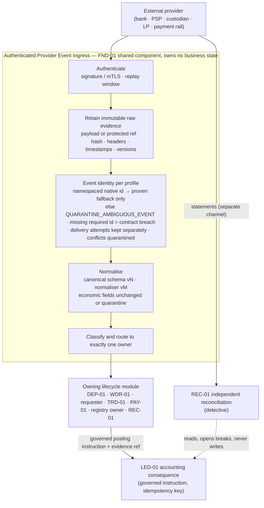

**Event ownership by lifecycle:**

| Event class | Owning lifecycle module | Downstream |
|---|---|---|
| Inbound fiat receipt (VA / reference credit), returns-in, recall notices on inbound credits | **DEP-01** | Governed posting instruction to LED-01 |
| Inbound custody receipt (client deposit, LP asset-leg delivery, LP cash-leg proceeds into a client pool, migration-in) | **DEP-01** | Same |
| Outbound payment / transfer status, debit confirmation, payout return notice, custodian signing / broadcast status, exit-transfer status | **WDR-01** | Same |
| Provider hold confirmed / refused / extended / reduced / released / consumed / expired / disappeared | **The reservation's requester** (owner of the hold instruction, routed by `hold_instruction_id` / `hold_action_id`) | Binding update to LED-01 (§18.8) |
| Payment-from-hold status (under a conversion handoff) | **WDR-01** (payment lifecycle); the hold-consumption effect also to the **requester** | Posting by WDR-01; hold state by the requester (§18.8.4) |
| Administrator / insolvency / recovery notices; recovery distributions | Notices: **holding-arrangement owner** (HD-DEC015-01) + Legal + INC-01; distributions received: **DEP-01** (inbound) | Recovery claim (§10.2.3); governed posting |
| Uninstructed outflow **debit** (client direct, provider fee, set-off debit, legal-order debit, correction) not owned by another lifecycle | **WDR-01** (observed-outflow lifecycle, §23.1) | Governed posting instruction to LED-01; AML-01 monitoring input |
| LP quote, order ack, fill, cancel, reject, status | **TRD-01** (execution evidence) — EXE-01 consumes for routing | Obligation creation in LED-01 from fills |
| LP settlement confirmation / LP statement line; LP notice of collateral application | **TRD-01** (counterparty evidence); statements also **REC-01**; corporate position **TRE-01** | Orchestration evidence; reconciliation; §19.5 |
| Account / VA lifecycle notices (VA opened, suspended, closed) | **Provider / resource registry owner** (per HD-DEC015-01; not pre-assigned to DEP-01) | Registry update; DEP-01 consumes |
| Deposit-address assignment results | **WLT-01** | — |
| **Account blocked / frozen, legal-order notice, set-off notice** (the notice, not a debit) | **Holding-arrangement / resource owner** (per HD-DEC015-01) **+** the affected lifecycle modules (requester for holds, WDR-01 for pending transfers) **+ INC-01** | Pool operational state / legal-restriction facts (§16.8); client-specific `Blocked` via LED-01; REC-01 break where material |
| Pay collection | **DEP-01** (movement) — PAY-01 owns the payment intent | Governed posting |
| Pay refund status | **WDR-01** (outbound transfer) — PAY-01 owns the refund decision | Governed posting |
| **Pay chargeback / dispute** (incl. its debit) | **PAY-01** (business owner of the dispute lifecycle, §27.2) | PAY-01 governed instructions to LED-01; DEP-01 / WDR-01 record movement consequences on PAY-01's instruction; REC-01; INC-01 above threshold |
| Custodian / bank exit or wind-down notices | **Holding-arrangement owner** + INC-01 | Operating state (§10.2.1); exit plan (§13.6) |
| Periodic statements, scheduled balance reports | **REC-01** (detective) | Reconciliation, breaks |
| Provider incident / status-page notices | Rail arrangement owner (consuming module) + INC-01 | Live-routing `SUSPENDED` where configured; evidence freshness (§16.8) |

**Never:** a provider event routed to LED-01; two modules owning the same event; a module
consuming an event the ingress did not authenticate; a raw payload deleted after normalisation.

**Credential cardinality.** Per provider arrangement and per environment:

| Credential | Holder | Scope |
|---|---|---|
| Inbound event-verification trust set | Provider Event Ingress | Verify only |
| Outbound **instruct** credentials (payments, transfers, holds, releases, custodian transfer requests, VA lifecycle) | **The provider adapter**, in KMS / vault under SEC-01 / FND-01 controls (§35.8.2) — **never** distributed to business modules | Used only for instruction classes the calling module is authorised for; `WDR-FIND-001` (KMS) gates live use |
| Deposit-address assignment credentials | WLT-01 (via the custodian adapter) | Address assignment only; no transfer rights |
| **Read** credentials (balances, statements, status) | REC-01 (statements); movement owners (movement-scoped reads) via the adapter | Read-only |

No credential is shared across environments or functions; non-production never holds live
credentials (Doc 00 §1.E rule 2).

### 35.8 Provider instruction ownership (R2-F04)

v0.2 made WDR-01 the transmitter of **every** provider instruction and the owner of account-status
notices (`04-review-r2.md` R2-F04). v0.3 restores WDR-01's canonical boundary — **outbound external
transfer / withdrawal / payout lifecycle** (Module Index v1.4 l.418; WDR-01 v1.1 §2) — and separates
five responsibilities.

#### 35.8.1 Five responsibilities

| Responsibility | Owner |
|---|---|
| **Why** the instruction is needed (business purpose) | The **business / product workflow owner** (OMS-01 / TRD-01, PAY-01, RWA-03 / RWA-04, EXC-01, FEE-01 for fee collection, WDR-01 for withdrawals and payouts, registry owner for VA lifecycle, arrangement owner for exit plans) |
| Internal accounting reservation / state | **LED-01** |
| Provider-specific execution | **Provider adapter** (behind provider-neutral interfaces, §35.1) |
| Credentials, authentication, transport, signing | **SEC-01 / FND-01 shared security and foundation controls** (KMS / vault, master 09 security architecture; WDR-01 v1.1 §5.22 signing-key governance generalised as a platform control at the master 09 rebaseline) |
| The financial movement / event lifecycle | The **lifecycle module**: WDR-01 for outbound external transfers and observed outflows; DEP-01 for inbound; the requester for holds; PAY-01 for chargebacks |

#### 35.8.2 Instruction classes

| Instruction class | Business owner (why) | LED-01 | Lifecycle / instruction record owner | Executes | Gates (in addition to §16.3) |
|---|---|---|---|---|---|
| Client withdrawal / payout | WDR-01 | Reservation (WDR-01 requester) | **WDR-01** | Adapter | WLT-01 destination verify-and-consume, AML-01, IAM-02 |
| Return to source (unmatched inbound) | DEP-01 opens (governed decision) | **Suspense-item encumbrance** (§16.3) — no client reservation | **WDR-01** (outbound transfer) | Adapter | DEP-01 v1.1 §5.22 `via_wlt_aml_led_payout_controls` |
| Spot / OTC settlement cash or asset leg to an LP SSI | TRD-01 (orchestration) | Guard + reservation consumption | **WDR-01** (outbound transfer); a cash leg from a held balance only under the requester's conversion handoff (§18.8.4) | Adapter (`PAYMENT_FROM_HOLD` where a hold is bound) | LQD-01 SSI (no WLT-01 destination decision), LED-01 guard, valid handoff |
| Pay refund / merchant payout | PAY-01 | Reservation | **WDR-01** | Adapter | Per Pay product rules |
| RWA subscription cash leg / distribution payout | RWA-03 / RWA-04 | Reservation | **WDR-01** | Adapter | Role-based settlement party (§28) |
| Fee sweep (X2) | FEE-01 (collection decision) | **Fee-payable collection encumbrance** on the pool's AIX Fee Payable (§16.3) — no client reservation | **WDR-01** | Adapter | `COLLECT_DISCLOSED_FEE` terms (§20.10); pool not `SHORTFALL` / `UNDETERMINED` |
| Custodian transfer request (withdrawal, settlement, exit / migration) | WDR-01 / TRD-01 / arrangement owner (exit plan, exit authorisation) | Reservation | **WDR-01** | Custodian adapter | §13.5 Rule B; §10.2.2 operation-class gate; §13.6–§13.8 for exit (distressed classes only under an `APPROVED` exit authorisation and `EXIT_ONLY` routing) |
| **Provider hold** place / extend / reduce / release / consume (Spot / OTC, Pay, RWA, withdrawal) | **The reservation's requester** | Reservation + binding | **The requester** (shared FND-01 hold-instruction mechanics) | Adapter | Caller = recorded requester; per-action predicate (§18.8.2); no destination gate |
| Payment from a hold (conversion) | The requester (handoff) + orchestration owner (leg) | Leg guard; reservation consumption | **WDR-01** payment lifecycle; the hold record stays with the requester | Adapter (`PAYMENT_FROM_HOLD`) | Valid `hold_conversion_handoff`; LQD-01 SSI or WLT-01 destination |
| VA lifecycle request | Registry owner (HD-DEC015-01) | — | Registry owner | Adapter | Maker-checker (§11.2) |
| Account freeze / legal-order / set-off **notice** response | Arrangement / resource owner (HD-DEC015-01) + affected modules + INC-01 | Client-specific `Blocked`; pool facts | Arrangement owner | — (no instruction unless a response is required) | Compliance / Legal |
| Pay chargeback response (represent / accept) | **PAY-01** | Accounting consequences | **PAY-01** | Payment rail adapter | Per Pay dispute rules |

**WDR-01 does not own** a Spot / OTC cash hold, an OTC hold, a custody asset hold, a payment
reservation hold, an RWA subscription hold, a provider account-freeze event, a legal-order event or
a set-off **notice**. It never places, extends, reduces or releases another requester's hold; it
executes only the **payment out of** a hold under that requester's conversion handoff. It does own
the **debit** that follows a notice, as an observed outflow (§23.1).

**Credential authorisation (no credential spread, no gateway module).** The adapter holds no
business authority. It executes an instruction only when (i) the calling module's authenticated
service identity is authorised for that **instruction class × provider arrangement** in a
governed, deny-by-default matrix (maker-checker; SEC-01 audited), (ii) a durable intent record of
that module exists (§35.8.3), and (iii) the rail's live-routing state is `ACTIVE` for that class.
Bank and custodian instruct credentials therefore stay in one place (KMS / vault, used only by the
adapter), which keeps the security property v0.2 sought from a single WDR-01 credential set
(`04-review-r2.md` R2-F04 assessment) without making WDR-01 the business owner of other modules'
instructions. **No new financial module is created**; the adapter and its credential use are
FND-01 / SEC-01 shared infrastructure, like the ingress.

#### 35.8.3 Durable intent before transmission (R2-F11)

```
owning module: durable instruction record + outbox entry (one transaction; §18.3 rule 7)
  → adapter: authorise identity × class, verify intent exists, transmit with idempotency key
  → provider: acknowledgement | failure | no response
  → ingress / adapter response: outcome recorded against the instruction
       ACKNOWLEDGED → lifecycle continues
       FAILED (authoritative) → governed failure handling
       UNCERTAIN (timeout, ambiguous) → treated as possibly executed; resolved under the
                                         submission profile (§35.8.4): provider-idempotent retry
                                         or query / statement correlation; never a non-idempotent
                                         resend; protected resources stay protected; R14
```

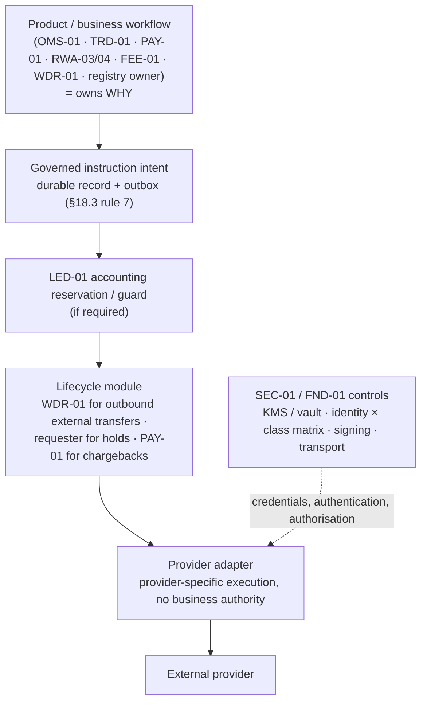

**Future Module Index changes required by this boundary (recorded, not made — §43 M-22, M-46):**
WDR-01 row = outbound external transfer lifecycle (withdrawals, payouts, settlement payments, fee
sweeps, refunds, custodian transfer requests incl. exit transfers) and observed uninstructed
outflows, **not** holds or account-status notices; OMS-01, PAY-01, RWA-03 rows = own the
provider-hold instruction for their reservations; FND-01 row = Provider Event Ingress + shared
adapter mechanics (outbound transmission, hold-instruction state machine, credential use); SEC-01
/ master 09 = provider credential custody and the identity × instruction-class matrix; the
HD-DEC015-01 owner = account-status notices and the provider / resource registry.

#### 35.8.4 Submission idempotency profiles and non-idempotent providers (R3-F11)

Provider-native idempotent submission is a SHOULD (BNK-REQ-046); v0.3's recovery examples assumed a
query by idempotency key that a non-idempotent provider may not honour (`04-review-r3.md` R3-F11).
Each provider arrangement × instruction class carries a governed **`submission_profile`**:

| Profile | Meaning | Activation |
|---|---|---|
| `PROVIDER_IDEMPOTENT` | Evidence (documentation + sandbox demonstration) that the provider honours AIX's idempotency key for this class: the same key never creates a second instruction within a documented window, and a query by key returns the outcome | Evidence on the arrangement |
| `NON_IDEMPOTENT` | The provider does not honour the key (or only partially) | **Only** with the documented profile below |
| `UNVERIFIED` | Neither proven | **Not activatable** for live routing (fail closed) |

**Activation prerequisites for a `NON_IDEMPOTENT` class**, each documented and evidenced before
live routing is `ACTIVE` (or `EXIT_ONLY`):

1. **Single-flight sender** — at most one in-flight submission per `instruction_id`, enforced by a
   durable send lock bound to the intent (WDR-01 v1.1 §5.19 "atomic send lock" generalised).
2. **Query / status correlation** — the provider can be queried by an AIX reference carried in the
   instruction (end-to-end id, client reference, memo) and returns an authoritative status.
3. **Statement correlation** — that reference appears on statements / transaction histories, so
   execution can be proven or disproven from the statement.
4. **Authoritative non-execution evidence where available** — what the provider documents as
   authoritative proof that an instruction was not executed (explicit rejection, cancellation
   confirmation, "no such instruction" after a stated time, statement coverage through the value
   window).
5. **Duplicate-risk analysis** — consequence of a duplicate per class, amount caps and velocity
   limits, recovery route (recall, return request).
6. **Manual escalation** — named owners and the evidence they may rely on.
7. **Uncertainty timeout and escalation thresholds** — when an `UNCERTAIN` instruction escalates
   (Ops → Finance → INC-01).
8. **Operator runbook** — step-by-step resolution, approved by maker-checker.

**Retry versus resend.**

| | `IDEMPOTENT RETRY` | `NON-IDEMPOTENT RESEND` |
|---|---|---|
| Applies to | `PROVIDER_IDEMPOTENT` classes | `NON_IDEMPOTENT` classes |
| Same instruction id / key | Yes — the same key | No — a **new** instruction id linked to the original |
| Permitted when | The outcome is uncertain and the provider's documented window still covers the key | **Only** after authoritative evidence that the original was **not** executed (item 4) — never merely because the first response was lost, timed out or was ambiguous |
| Approval | Automatic within configured limits | Maker-checker for money-moving classes; recorded on both intents |

**If safe resolution cannot be proven:** the instruction **remains `UNCERTAIN`**, nothing is resent,
and the protected resources (client reservation, fee-payable or suspense-item encumbrance, hold) are
**not released** until a governed resolution on evidence; the timeout escalates per item 7; R14
holds the case open. The same rules apply to custodian transfer requests (CUS-REQ-087) and LP orders
and settlement instructions (LPC-REQ-071).

---

## 36. Module Ownership Matrix

> **Revision note (v0.4).** v0.2 corrected per Round-1 R06, R08, R11, R12, R13, R15; v0.3 corrected
> per Round-2 R2-F04 (WDR-01 scope, D-3, new D-7) and R2-F05 (VA registry not pre-assigned); v0.4
> corrects per Round-3 R3-F03 (one requester-owned hold lifecycle, conversion handoff), R3-F01 / F02
> (exit facts, relationship / location / claim records) and R3-F07 (closure-fact authorities).
> Every D-item remains **PROPOSED — SUBJECT TO ROUND-4 REVIEW AND HUMAN ACCEPTANCE**.

### 36.1 Financial objects — one authoritative owner each

| Object | Authoritative owner | Notes |
|---|---|---|
| Legal entity / beneficial owner | **CLT-01** | `DEC-011` |
| Authorised principal / membership | **CLT-01** (+ IAM binding) | `DEC-011` |
| Master account, subaccount | **ACC-01** | ACC-01 v0.10 §2 |
| Asset / instrument identity, network registry, classification, derived eligibility, instrument custody-support **facts** | **AST-01** | AST-01 v1.8 §1.1 |
| Fiat currency reference data | **AST-01** | AST-01 v1.8 §3.10 |
| **Shared provider identity / due-diligence / WF-19 record** for every provider type — Vendor, LP, Custodian, Bank, PSP, settlement agent, paying agent, escrow provider, payment rail, wallet-infrastructure vendor | **UNASSIGNED — HD-DEC015-01** (recommended Option D, §58) | WF-19 is one cross-provider workflow with no owning module (DEC015-PNF-08, merged into R12) |
| **Client-asset holding arrangement** (bank / PSP / settlement-agent / custodian structure): resource pools, legal safeguarding pool, holder, beneficial model, authorities, hold enforceability, allocation mode, custody control facets and control-assessment classification, **operating state and servicing mode** | **Owner per HD-DEC015-01 field-level split** (§36.4) | Consumers carry opaque `resource_pool_id` / `provider_arrangement_id` until decided; decided before §56 step 6 |
| LP / venue arrangement, LP SSIs, LP prefunding/credit terms, settlement basis, venue capability/health, venue activation gate, counterparty limits | **LQD-01** (unchanged) | Module Index v1.4 l.432 |
| Rail / product arrangement (operational configuration), adapter and declared technical capability profile | The **consuming module**, on a shared provider-neutral contract | Precedent: `services/aml1/src/lib/providers/registry.ts`, `services/wlt1/src/lib/providers/` |
| Provider **rail activation** (live-routing) per operation class | The module that executes that operation class | Precedent `wlt1.fiat_rail_coverage` (migration 061). Always **in addition to** CFG-01 production activation (`DEC-014`) |
| Withdrawal / payout destination eligibility | **WLT-01** (existing) | WLT-01 v1.1 §2 |
| Custody deposit-address assignment and eligibility; custody-orchestration requests; inbound instrument identification | **WLT-01** *(D-1)* | Module Index v1.4 l.397 "custody orchestration" |
| Fiat VA / reference registry entry, VA lifecycle and subaccount / pool binding | **Provider / resource registry abstraction — owner per HD-DEC015-01** (VA-registry sub-question; candidates DEP-01 or the holding-arrangement owner) | Not pre-assigned (R2-F05). DEP-01 **consumes** the mapping (its workflow step 5 generates funding instructions from it); one lifecycle authority where a VA is its own pool (§11.2) |
| The external account / VA / custody account / wallet **itself** | **The provider** (external) | AIX owns only registry entries and facts |
| Ledger books, ledger accounts, journals; S × A × P allocation; pool resource accounts; deficits; in-flight claims | **LED-01** | |
| Accounting balances & states | **LED-01** | |
| **Accounting reservation**, incl. hold binding state | **LED-01** *(D-3)* | LED-01 v1.1 Hold / Reserve Service, Atomic Reservation Engine |
| Decision to reserve and to request the hold (business purpose) | The **requester**: OMS-01, WDR-01 (withdrawal), PAY-01, RWA-03 | Single requester per reservation |
| **Provider hold-instruction lifecycle** (intent record, every hold action — place / extend / reduce / release / consume — outcome, binding request, conversion handoff) | **The reservation's requester** *(D-3, corrected)* | Shared FND-01 hold-instruction mechanics; not WDR-01 unless WDR-01 is the requester (R2-F04); WDR-01 executes only the payment out of a hold under the handoff (§18.8.4, R3-F03) |
| Provider-specific instruction execution; credential use | **Provider adapter** under **FND-01 / SEC-01** shared controls *(D-7, proposed)* | No business authority; identity × instruction-class matrix; `WDR-FIND-001` (KMS) gates live use of every instruct credential |
| **Accounting** settlement obligation, per-leg accounting status, transition guards | **LED-01** *(D-4)* | LED-01 v1.1 DvP controllers re-scoped as guards |
| **Settlement orchestration** | **Product workflow owner** *(D-4)*: TRD-01 (Spot/OTC, proposed), PAY-01, RWA-03/04, EXC-01, WDR-01 (withdrawals), DEP-01 (returns-in) | |
| External outbound movement lifecycle (instructed transfers — withdrawals, payouts, settlement payments, fee sweeps, refunds, custodian transfer requests incl. exit transfers — and **observed uninstructed outflows** not owned by another lifecycle) | **WDR-01** | §23.1, §35.8 |
| Account-status notices (freeze, legal order, set-off notice), provider exit / wind-down notices | **Holding-arrangement / resource owner** (HD-DEC015-01) + affected lifecycle modules + INC-01 | §35.7 |
| Relationship state; exit authorisation; provider exit ability; legal movement permission; distribution basis | **Holding-arrangement owner** (HD-DEC015-01) with Compliance + Legal, maker-checker | §10.2.2–§10.2.3, §13.7; WF-19 step 10 |
| Recovery-claim record for stranded assets | **Holding-arrangement owner** (record) with Legal / Finance; **LED-01** keeps the entitlements; **REC-01** keeps the break | §10.2.3; never a relabel or write-off by itself |
| Cross-pool recovery-restraint authority record | **INC-01** restriction record on a Compliance + Legal decision *(proposed)*; LED-01 applies `Blocked` | §17.9.1; never created by configuration default |
| Source-account encumbrances (client reservation, fee-payable collection, suspense-item, exception-item) | **LED-01** (state on the source account or item); corporate source control: **TRE-01** | §16.3 |
| Provider event-identity profile; submission idempotency profile | The **rail arrangement owner** (consuming / executing module) on the shared provider-neutral contract; consumed by the ingress and adapter (FND-01) | §35.7, §35.8.4 |
| Closure-fact attestation of a non-ledger fact | The fact's **original authority** (requester, WDR-01, DEP-01, registry owner, WLT-01, REC-01, Provider Event Ingress) — attesting directly or through a verified LED-01 aggregation | §51.5; LED-01 is never the original authority of a non-ledger fact |
| Pay chargeback / refund-dispute lifecycle | **PAY-01** | §27.2 |
| External inbound movement lifecycle and original inbound provider events | **DEP-01** | |
| Provider event authentication, replay protection, normalisation and routing | **Provider Event Ingress** — FND-01 shared component *(D-6, proposed)* | No business state |
| Provider settlement execution | **The provider** (external) | AIX records evidence only |
| Periodic statements, scheduled snapshots (detective evidence), reconciliation runs, breaks, evidence associations, safeguarding report | **REC-01** *(D-5)* | Never writes the ledger; never a preventive sufficiency input (§16.7) |
| Movement-scoped pre-movement provider read | The module performing the movement | Operational evidence on the movement; forwarded to REC-01 |
| Fee schedule, calculation, disclosure evidence, fee instruction, refund decision | **FEE-01** | |
| Fee postings (X1–X3) | **LED-01** | |
| AIX corporate liquidity, corporate venue prefunding / credit support, corporate operational exposure | **TRE-01** | Never client assets; never funds a client obligation |
| Client order, pre-trade controls, sufficient-resources and exposure-limit checks, settlement-destination readiness | **OMS-01** | |
| Routing decision | **EXE-01** | |
| Quote / trade / fill evidence; Spot/OTC settlement orchestration | **TRD-01** | Orchestration *(proposed)* |
| Payment intent / merchant flows / Pay settlement orchestration | **PAY-01** | |
| Issuer onboarding, structuring, offering/subscription, holder registry/servicing | **RWA-01…04** | |
| Exchange clearing/settlement interface and orchestration | **EXC-01** | Securities domain only |
| Capability evaluation, environment availability, production activation | **CFG-01** | `DEC-013`, `DEC-014` |
| Permissions, approvals, SoD, maker-checker | **IAM-02** | `IAM2-FIND-002`/`003` gate real-actor use |
| Audit evidence | **SEC-01** | |
| Freeze / incident | **INC-01** | Freeze ownership questions per DCR-ACC-GOV-05 remain |
| Statements & regulatory reports | **RPT-01** | From LED-01/REC-01 data |
| UI presentation | **PRT-01** | No balance logic |
| End-to-end fund-flow assurance | **E2E-01** | |

### 36.2 Module responsibility matrix (required set)

| Module | DEC-015 responsibility | Must not |
|---|---|---|
| CLT-01 | Legal owner; beneficial-owner identity; issuer/merchant clients | Carry balances; own locations or providers (vendors are not clients) |
| ACC-01 | Master/subaccount identity, status, `resolve`, closure barrier; future additional closure attesters | Store any external reference, amount, balance, fee object or ledger id |
| AST-01 | Instrument identity incl. fiat reference; custody-support facts (`THIRD_PARTY_CUSTODIAN` + opaque `custodian_ref` identifying a **legal custodian**); eligibility incl. `DEPOSIT_MB_PSO`/`WITHDRAWAL_MB_PSO` | Own entitlements, custodian balances, ledger balances, settlement state, destinations, custody locations or arrangement verification |
| WLT-01 | Withdrawal/payout destination eligibility (existing); custody deposit-address assignment & eligibility; custody-orchestration **requests**; inbound instrument identification (DCR-AST1-002); §13.5 check as `DEPOSIT/WITHDRAWAL_MB_PSO` caller | Own fiat VAs, underlying bank accounts, safeguarding accounts or pools, provider arrangements, bank/custodian legal relationships, external resource balances or beneficial-ownership facts; hold keys; post ledger; execute transfers |
| LED-01 | Books, accounts, journals, S × A × P allocation, coverage computation, reservations incl. binding state, source-account encumbrances, accounting obligations, leg accounting status, transition guards, deficits, in-flight settlement and migration claims, fee postings | Transmit provider instructions; ingest provider events; own product orchestration timers/retries; repair from REC-01 output without governance; restore availability before provider-confirmed release / reduction; assert a non-ledger closure fact as its original authority |
| TRE-01 | Corporate liquidity, corporate prefunding/credit support, corporate exposure limits | Touch client books; bridge, advance or fund any client obligation |
| FEE-01 | Schedules, calculation, disclosure evidence, maxima for variable charges, refund decisions | Post entries; hide fees in price |
| DEP-01 | Inbound movement lifecycle; original inbound provider events; **consumes** the VA → client / subaccount / pool mapping; funding instructions; unmatched/suspense cases; inbound rail activation; records movement consequences of Pay chargebacks on PAY-01's instruction | Credit before authenticated confirmation; own the VA registry unless HD-DEC015-01 so decides; own the Pay dispute lifecycle |
| WDR-01 | Outbound external transfer lifecycle (withdrawals, payouts, settlement payments incl. payments from a hold under the requester's conversion handoff, fee sweeps, suspense returns, refunds, custodian transfer requests incl. planned and distressed exit transfers); observed uninstructed outflows; withdrawal requester (and so owner of withdrawal holds); outbound rail activation | Own, place, extend, reduce or release another requester's holds or own its purpose; own account-status notices; be the universal provider-instruction gateway; hold raw credentials; own the accounting reservation; assume AIX possesses funds; execute live before KMS |
| REC-01 | Statement and snapshot ingestion; reconciliation; breaks; safeguarding report | Own original provider transaction events; change the ledger; initiate movements; be the preventive sufficiency source |
| PAY-01 | Payment orchestration over shared rails; requester of payment reservations and their holds; **Pay chargeback / refund-dispute lifecycle** | Re-implement ledger/settlement/recon; become custody |
| LQD-01 | LP/venue arrangements, SSIs, LP terms incl. settlement basis, venue capability/health, venue activation gate, counterparty limits | Become the generic provider record (HD-DEC015-01); hold client money |
| OMS-01 | Orders; pre-trade; reservation and **every provider-hold action** for orders, including the conversion handoff (§18.8); durable `EXECUTION_ATTEMPTED` before routing; exposure-limit and destination-readiness checks; refuse routing to inactive rails | Read external balances directly; release reservations on timers after an attempt; route before the attempt is durable |
| EXE-01 | Routing decision & evidence | Route to non-active venues |
| TRD-01 | Execution/fill evidence; LP settlement confirmations; Spot/OTC settlement orchestration *(proposed)* | Post entries; instruct providers except through WDR-01 |
| RWA-01 | Issuer/asset onboarding; classification request | Hold subscription cash |
| RWA-02 | Structuring/issuance; initial holder recording | Assume custody basis (`R4-Q5`) |
| RWA-03 | Offering/subscription/allocation orchestration (subscription cash roles); requester of subscription reservations and their holds | Assume escrow structure |
| RWA-04 | Holder registry, distributions, redemption orchestration | — |
| EXC-01 | Exchange clearing/settlement interface and orchestration | Reuse MB settlement/execution code |
| FND-01 | Provider Event Ingress incl. raw-evidence store and event identity per profile, ambiguity quarantine *(proposed, D-6)*; shared adapter mechanics incl. outbound transmission, single-flight send lock, submission profiles, hold-instruction state machine, outbox and credential use *(proposed, D-7)* | Own business state or business authority |
| SEC-01 | Audit for every event in §38; provider credential custody controls and the identity × instruction-class matrix audit *(with master 09)* | — |
| IAM-02 | Approvals for location/arrangement verification, rail activation, withdrawals, settlement-exception resolution, deficits, restoration (X6), fee sweep exceptions | Activate capabilities |
| CFG-01 | Capability / production activation conjuncts | Treat `current_state` or a rail activation as production evidence |
| RPT-01 | Client statements with location disclosure; safeguarding reports | Compute balances |
| PRT-01 | Display per §16.5 | Imply AIX holds client funds |
| E2E-01 | Cross-module assurance under DEC-015 | — |

**No `BANK-01`, `CUS-01` or `SET-01` is created.** The single residual ownership gap — the shared
provider record and the client-asset holding arrangement — is **pre-existing** (WF-19 has no owning
module) and is put to the human as HD-DEC015-01 rather than hidden by over-extending an unrelated
module.

### 36.3 Embedded decision points

Full analysis: §53. Every row is **PROPOSED — SUBJECT TO ROUND-4 REVIEW AND HUMAN ACCEPTANCE**.

| ID | Position (v0.4) |
|---|---|
| **D-1** | WLT-01 keeps destinations and gains custody deposit-address assignment / eligibility and custody-orchestration requests only. Fiat VA / reference registry, VA lifecycle and binding → **provider / resource registry abstraction, owner per HD-DEC015-01** (not pre-assigned; DEP-01 consumes). Underlying accounts, pools, legal pools, arrangement facts, operating state → holding-arrangement owner (HD-DEC015-01) |
| **D-2** | LQD-01 stays LP/venue (arrangement, SSIs, terms, venue gate, limits). Shared provider identity/DD/WF-19 record → HD-DEC015-01 (recommended Option D). Rail arrangements, adapters, capability profiles and rail activation with the consuming / executing modules |
| **D-3** | LED-01 owns the accounting reservation and binding; one requester per reservation requests both reservation and hold **and owns the hold-instruction record and every hold action** (place / extend / reduce / release / consume) with per-action predicates; a payment from the hold passes to WDR-01 only through the requester's conversion handoff, without changing hold ownership; availability is restored only on provider-confirmed release / reduction (§18.8); the provider adapter executes (D-7); WDR-01 owns holds only for its own withdrawals |
| **D-4** | LED-01 owns the accounting obligation, leg accounting status and guards only; settlement orchestration with the product workflow owner (TRD-01 for Spot/OTC proposed) |
| **D-5** | REC-01 detective only (statements, snapshots, reconciliation, breaks, safeguarding report); preventive authority per §16.7 |
| **D-6** | Provider Event Ingress as an FND-01 shared component that owns no business state; retains raw evidence; dedupes per §35.7; event ownership by lifecycle (§35.7) |
| **D-7** | Provider adapters' outbound execution and credential use are FND-01 / SEC-01 shared infrastructure with an identity × instruction-class authorisation matrix and per-class submission profiles (§35.8.4); business ownership of each instruction stays with the module that needs it; WDR-01 = outbound external transfer lifecycle only (§35.8) |

### 36.4 Field-level owner table (R12)

| Field / fact | Owner | Status |
|---|---|---|
| Provider legal identity, regulatory status, ownership, financials | Shared provider record | HD-DEC015-01 |
| Due-diligence, security, compliance, finance and management reviews; WF-19 state; exit plan; BCP; termination | Shared provider record | HD-DEC015-01 |
| Contract / SLA reference | Shared provider record | HD-DEC015-01 |
| Underlying account identity; `account_holder`; `beneficial_ownership_model`; `segregation_designation`; `safeguarding_pool_id` | Client-asset holding arrangement | HD-DEC015-01 field split (recommended: the shared record, as DD-established legal facts) |
| `withdrawal_authority`; `client_direct_instruction_authority`; `settlement_instruction_authority`; `aix_instruction_authority`; `provider_hold_authority` | Client-asset holding arrangement | HD-DEC015-01 field split (same recommendation) |
| `pool_allocation_mode`; resource-pool membership of locations | Client-asset holding arrangement | HD-DEC015-01 field split |
| Custody control facets K1–K17 | Client-asset holding arrangement (custodian) | HD-DEC015-01 field split |
| `arrangement_status` (`VERIFIED` etc.) | Client-asset holding arrangement, maker-checker | HD-DEC015-01 field split |
| `operating_state`, `servicing_mode` (§10.2.1); exit plan | Client-asset holding arrangement, maker-checker | HD-DEC015-01 field split |
| `relationship_state`; `exit_authorisation`; `provider_exit_ability`; `legal_movement_permission`; distribution basis; `recovery_claim` | Client-asset holding arrangement, maker-checker (Compliance + Legal for exit and legal facts) | HD-DEC015-01 field split |
| Provider event-identity profile; submission profile | Rail arrangement (consuming / executing module) | D-2 / D-6 / D-7 |
| Custody control-assessment classification (`THIRD_PARTY_ELIGIBLE` / `CONTROL_ASSESSMENT_REQUIRED` / `PROHIBITED_AIX_UNILATERAL_CONTROL`) and `EV-34` result | Client-asset holding arrangement (custodian), maker-checker | HD-DEC015-01 field split |
| Pool-wide legal-restriction facts (§16.8 fact 4) | Client-asset holding arrangement / resource owner | HD-DEC015-01 field split |
| Technical capability profile; rail activation; credentials | Consuming / executing module | D-2 |
| LP terms, SSIs, settlement basis, `claim_holder`, credit support | LQD-01 | D-2 |
| VA / reference identifier, VA lifecycle and subaccount / pool binding | Provider / resource registry (§36.5) | **HD-DEC015-01 sub-question** (DEP-01 or holding-arrangement owner); DEP-01 consumes |
| Client-specific legal restriction (`Blocked` amount on S × A × P) | LED-01 (state), on governed instruction from the arrangement owner | §16.8 |
| Deposit address and subaccount × instrument-network assignment | WLT-01 | D-1 |
| Withdrawal destination | WLT-01 | Existing |
| S × A × P allocation, reservations, obligations | LED-01 | D-3, D-4 |
| `custody_support` (instrument × domain custodian approval) | AST-01 | Existing |

### 36.5 Provider / resource registry abstraction (R2-F05)

Until HD-DEC015-01 assigns an owner, the canonical bank / VA / resource objects — virtual-account
assignment, underlying legal account, provider relationship, resource pool, client mapping, legal
safeguarding pool, VA lifecycle, operating state — sit behind **one provider / resource registry
abstraction** with an opaque contract. **No final module owner is invented here.**

| Consumer | Consumes | Never |
|---|---|---|
| DEP-01 | VA / reference → `client_id`, `subaccount_id`, `resource_pool_id`, `external_location_id` for inbound attribution and funding instructions | Owns the registry entry or VA lifecycle by pre-assignment |
| WDR-01 | Resource / payout / account mappings and operating state for outbound processing | Changes pool facts |
| LED-01 | `resource_pool_id` (and `external_location_id`) on allocations and reservations | Owns the pool definition or legal facts |
| REC-01 | Registry ↔ provider evidence (R13), pool membership, operating state | Writes the registry |
| WLT-01 | Custody pool / location for deposit-address assignment | Owns fiat VAs or pools |

Rules: one owner per object, decided by HD-DEC015-01 (with the VA-registry sub-question); one
lifecycle authority where a VA is its own pool (§11.2); masters that proceed before the decision
record the seam as **OPEN** (§56).

---

## 37. Security Architecture Consequences

### 37.1 Bank / PSP

| Control | Requirement |
|---|---|
| API authentication | Per-arrangement credentials; mutual TLS where the provider supports it; credential cardinality per §35.7 |
| Webhook authenticity | Verified at **Provider Event Ingress** (§35.7): signature verification (provider key, pinned/rotated); unauthenticated events are rejected and alerted, never processed; signature / header evidence retained with the raw payload |
| Replay protection | Timestamp window + nonce/event-id store at the ingress |
| Idempotency / dedupe | Inbound: event identity per the provider event-identity profile — namespaced native id, a fallback only where proven unique per economic occurrence, else `QUARANTINE_AMBIGUOUS_EVENT`; missing required ids recorded as a provider contract breach; delivery attempts recorded separately; conflicts quarantined (§35.7). Outbound: durable intent + idempotency key per instruction (§18.3 rule 7); per-class submission profile — `PROVIDER_IDEMPOTENT` retry with the same key, or `NON_IDEMPOTENT` single-flight with query / statement correlation and no resend without authoritative non-execution evidence; `UNVERIFIED` not activatable (§35.8.4; BNK-REQ-046, -065) |
| Network | Provider IP allowlists / private connectivity where offered; inbound via IMP-02 perimeter |
| Instruction signing | Payment and hold instructions signed/authenticated with keys in KMS/HSM (WDR-01 v1.1 §5.22 signing-key governance, preserved) |
| Maker-checker | IAM-02 for high-risk payments, SSI changes, VA binding, arrangement / pool verification, operating-state, servicing-mode and relationship-state changes, custodian exit plans, **exit authorisations, `EXIT_ONLY` routing entries and distribution bases**, exit transfers, recovery-claim status and any write-off proposal, **recovery-restraint authority records**, control-assessment classification, identity × instruction-class matrix changes, **event-identity and submission profiles, ambiguous-event resolution, non-idempotent resends**, restoration (X6), recovery (X7), collateral-application classification; provider-side maker-checker where supported, **in addition** |
| Provider instruction controls | **Every provider instruction is executed only by the provider adapter**, only for a calling service identity authorised for that **instruction class × provider arrangement** (deny-by-default matrix, maker-checker, SEC-01 audited), only with a durable intent record (§18.3 rule 7). Provider hold actions (place / extend / reduce / release / consume) are accepted only from the reservation's **recorded requester**, each under its per-action predicate (§18.8.2); a release or reduction requires LED-01's release rule (§18.3) to be satisfied or a governed override (R2-F04); a payment out of a hold (`PAYMENT_FROM_HOLD`) is accepted only from WDR-01 with a valid conversion handoff of that requester (§18.8.4, R3-F03) |
| Credential separation | Per environment, per provider, per function (verify / read / instruct-transfer / instruct-hold / VA lifecycle / address assignment); instruct credentials held only in KMS / vault and used only by the adapter, never handed to a business module; non-production never holds live credentials (Doc 00 §1.E rule 2) |

### 37.2 Custodian

| Control | Requirement |
|---|---|
| Policy engine | Custodian-side transfer policies (amount thresholds, destinations, velocity) mirror AIX policy; mismatch is a break; **policy administration is not an AIX-alone power** (§13.4, K7) |
| Withdrawal approvals | Custodian quorum, independent of AIX, + AIX IAM-02 maker-checker as a **request** control |
| Address allowlists | Custodian allowlist synchronised from WLT-01 decisions; no unilateral AIX whitelist authority (K12) |
| Key model | Every control facet K1–K17 recorded and evidenced (§13.4). **Unconditional:** AIX cannot, by itself, reconstruct signing authority, move assets, recover them to an AIX-controlled destination, bypass custodian controls or re-policy so that it alone can move assets (§13.4.2). **Any** AIX key, key share, MPC share / co-signer, HSM control, recovery material or authority, or other custody control indicator is disclosed, contractually documented, technically evidenced and legally assessed (`EV-34`); until assessed the arrangement is `CONTROL_ASSESSMENT_REQUIRED` and cannot back a live custody location. No indicator is treated as a legal conclusion (R2-F03). Procurement wording follows the same model: STR-04B CUS-REQ-026 prohibits any AIX unilateral signing secret or control unconditionally and admits disclosed, non-controlling participation only where documented, technically evidenced and cleared by `EV-34` (R3-F09) |
| Signing workflow | AIX requests; custodian independently approves and signs; signing status observed via ingress |
| Emergency override | Held by the custodian under its documented procedure; any AIX participation recorded and validated (K11, `EV-34`) |
| High-risk approval | Large/new-destination/new-network transfers require elevated approval |
| Credential/key management | API credentials in KMS/vault; rotation; least privilege; `WDR-FIND-001` gates live use |

### 37.3 General

No plaintext provider credentials anywhere (code, config, logs, task records); KMS/vault; least
privilege; environment-separated credentials; immutable audit (SEC-01); fail closed on
authentication/evidence failure; incident freeze (INC-01) per provider/pool/subaccount scope;
provider outage handling (§40); **no UI-only controls**.

---

## 38. Audit / Evidence Requirements

Every event below emits SEC-01 audit with actor (or service identity), correlation ids
(`client_id`, `subaccount_id`, `resource_pool_id`, `external_location_id`, `provider_id`,
`provider_arrangement_id`, `reservation_id`, `hold_instruction_id`, `obligation_id`,
`movement_id`, `cross_book_event_id`, provider reference), before/after state, evidence hash and
environment:

arrangement / pool created / verified / re-verification due / basis defeated; operating state or
servicing mode changed (active / wind-down / suspended / terminated); custodian exit plan approved
/ exit transfer instructed / confirmed / exit reconciliation signed off; allocation mode, control
facet or control-assessment classification changed; `EV-34` assessment recorded; coverage outcome
changed (`COVERED` / `SHORTFALL` / `UNDETERMINED`) with reason; pool-wide or client-specific legal
restriction recorded / lifted; refusal of new risk-taking applied / lifted; recovery-restraint
authority proposed / approved / applied / reviewed / released; relationship state changed; exit
authorisation proposed / approved / revoked / expired; `EXIT_ONLY` routing opened / closed; provider
exit ability and legal movement permission recorded; distribution basis approved; recovery claim
opened / status changed / write-off proposed or approved; migration slice state changed (§13.8);
source encumbrance created / consumed / released (§16.3); hold action place / extend / reduce /
release / consume requested / confirmed / failed / unknown; conversion handoff created / consumed;
event-identity profile approved; ambiguous event quarantined / resolved; provider contract breach
recorded; submission profile approved; non-idempotent resend approved / refused; closure-fact
attestation collected / rechecked; provider instruction
intent recorded / transmitted / acknowledged / uncertain / failed; instruction refused by the
identity × class matrix; delivery attempt received / duplicate / conflict quarantined; raw evidence
stored; Pay chargeback received / responded; LP collateral application recorded / classified;
fee-collection authority evidenced / lapsed; VA bound/unbound; deposit address assigned/retired; provider record / rail arrangement
created, capability changed, live-routing changed; provider event received at ingress (incl.
authentication result and route) / rejected / quarantined; inbound event matched / suspensed /
credited / returned; uninstructed outflow observed / classified / posted; reservation requested /
reserved / bound / execution-attempted / execution-unknown / released / expired; hold instruction
sent / confirmed / failed / extended / released / lost / orphaned; order routed; fill recorded /
late fill parked / duplicate rejected; obligation state transitions; each leg instructed /
confirmed / failed / returned / finality reached; coverage check failed / restored; client
deficit created / recovered; fee calculated / disclosed / earned (X1) / swept (X2) / refunded (X3)
/ sweep-latency breach; cross-book event X1–X7; reconciliation run / break opened / break
resolved; safeguarding report generated / signed off; freeze applied/lifted; manual resolution
approved.

Evidence retention per §34.5.

---

## 39. Data Model Principles

Architecture only — **no migration is designed here.**

| Concept | Owner | Belongs to ACC-01? | Belongs to AST-01? |
|---|---|---|---|
| Legal entity | CLT-01 | No | No |
| Master account | ACC-01 | **Yes** | No |
| Subaccount | ACC-01 | **Yes** | No |
| Ledger account / ledger book | LED-01 | No | No |
| Shared provider identity / DD / WF-19 record | Owner per HD-DEC015-01 | No | No |
| Client-asset holding arrangement (pools, legal pool, authorities, allocation mode, control facets) | Owner per HD-DEC015-01 field split | No | No |
| External fiat legal account | Provider (object); arrangement record (facts) | No | No |
| External resource pool / legal safeguarding pool | Arrangement record (definition); LED-01 (accounting) | No | No |
| Virtual account | Provider (object); registry entry, lifecycle & binding behind the provider / resource registry abstraction (owner per HD-DEC015-01) | No | No |
| Operating state / servicing mode of a pool or custody location | Arrangement record (HD-DEC015-01) | No | No (AST-01 holds only instrument × domain custody approval) |
| Durable provider instruction / attempt record (incl. §16.3 source declaration and submission profile) | The owning module (§35.8.2) | No | No |
| Relationship state, exit authorisation, provider exit ability, legal movement permission, distribution basis | Arrangement record (HD-DEC015-01) | No | No |
| Recovery-claim record | Arrangement record (HD-DEC015-01) with LED-01 entitlement references | No | No |
| Migration in-transit resource / client migration in-flight claim | LED-01 | No | No |
| Source-account encumbrance (client reservation, fee-payable collection, suspense-item, exception-item) | LED-01 | No | No |
| Hold-action records and conversion handoffs | The reservation's requester (FND-01 mechanics) | No | No |
| Recovery-restraint authority record | INC-01 *(proposed)*; `Blocked` state in LED-01 | No | No |
| Provider event-identity profile; submission profile | Rail arrangement (consuming / executing module) | No | No |
| Closure-fact attestation evidence | Each original authority (§51.5); pinned by ACC-01 per its existing contract | Pinned attestation references only (existing ACC-01 contract) | No |
| Raw provider evidence and delivery attempts | Provider Event Ingress evidence store (FND-01) | No | No |
| External account holder / beneficial ownership model | Arrangement record | No | No |
| External balance evidence | REC-01 (statements, scheduled snapshots — detective); movement module (movement-scoped read — operational) | No | No |
| Reservation (accounting) / binding status | LED-01 | No | No |
| Provider hold instruction / `hold_ref` | The reservation's requester (lifecycle); referenced on the LED-01 reservation | No | No |
| Settlement obligation (accounting) / leg status | LED-01 | No | No |
| Settlement orchestration state | Product workflow owner | No | No |
| Settlement instruction (outbound) | WDR-01 | No | No |
| Settlement account (LP SSI) | LQD-01 | No | No |
| AIX corporate treasury account / venue balance / credit support | TRE-01 + LED-01 CORPORATE book | No | No |
| Client accounting entitlement (S × A × P), in-flight claim, client deficit | LED-01 | No | No |
| AIX Fee Payable (pool-level) | LED-01 | **No** (no subaccount dimension) | No |
| Legal custodian identity | Shared provider record (HD-DEC015-01) | No | Referenced (opaque `custodian_ref`) |
| Custody account / custodian subaccount / omnibus pool | Custodian (object); arrangement record (facts) | No | No |
| Deposit address | Custodian (generation); WLT-01 assignment | No | No (AST-01 owns the instrument-network it is valid for) |
| Withdrawal destination | WLT-01 | No | No |
| LP / counterparty arrangement | LQD-01 | No | No |
| Fee receivable / payable / revenue | LED-01 (postings), FEE-01 (rules) | No | No |
| Reconciliation record | REC-01 | No | No |
| Instrument custody support (which custodian is approved for this instrument × domain) | AST-01 | No | **Yes** (existing `ast1.custody_support`) |
| Fiat currency identity & precision | AST-01 | No | **Yes** (existing) |

**Only two concepts belong to ACC-01 (master account, subaccount) and only two to AST-01
(instrument custody-support facts, fiat reference data) — all already present in the reviewed
branch designs.** Everything else is outside both modules. No generic "balance" table may collapse
these concepts.

---

## 40. Failure Mode Matrix

Legend — **Moves?** whether money movement continues for the affected scope; **Avail.** effect on
client available (accounting) balance; **Res.** effect on the reservation; **Esc.** escalation;
**MC** maker-checker action. "Pool" = external resource pool (§9.6). Rows 1–29 are v0.1 rows,
corrected where marked †; rows 30–50 are new in v0.2 (R14); rows marked ‡ are corrected in v0.3 and
rows 51–58 are new in v0.3 (R2-F01, F02, F08, F11, F16, F18); rows marked § are corrected in v0.4 and
rows 59–71 are new in v0.4 (R3-F01…F08, F11). **Coverage** in this table means the
§17.2 outcome; "usable fails" never means "resources lost" (§16.8).

| # | Failure | System state | Moves? | Avail. | Res. | Esc. | Reconciliation action | MC | Audit evidence |
|---|---|---|---|---|---|---|---|---|---|
| 1‡ | Bank API unavailable | Provider `DEGRADED`; adapter circuit open; evidence `UNOBTAINABLE`; **verified amount unchanged**; coverage stays `COVERED`, becoming `UNDETERMINED` only past the safeguarding freshness policy — **never `SHORTFALL`, never X6** | **No** outbound needing fresh evidence; inbound queued at ingress/provider | Unchanged; usable-for-movement fails | Kept | Ops alert; INC-01 past threshold; evidence-gap report line | Gap-fill from statements on recovery | — | Outage start/end, failed calls |
| 2‡ | Bank evidence stale (beyond the applicable freshness policy) | Pool evidence `STALE`; verified amount unchanged; coverage `UNDETERMINED` only if the **safeguarding** policy is exceeded | **No** for operations whose policy is exceeded | Unchanged; usable fails | Kept | Alert | Force movement-scoped read; break if persists | — | Staleness event |
| 3 | Hold capability `NOT_SUPPORTED`/`UNKNOWN` | §18.4 fallback only if §10.3 permits; else deny | Only under fallback controls | ↓ by internal reservation | Internal only (`BOUND_INTERNAL_ONLY`) | — | R6 marks fallback | — | Fallback mode recorded |
| 4 | Hold refused by provider | `HOLD_FAILED` → governed `RELEASED` | **No** for that purpose | Restored on release | Released | Requester informed | R6 | — | Provider reason code |
| 5† | Hold expires at provider **before any execution attempt** | §18.5: renew / extend, else stop progression before expiry and release or re-hold | **No** new attempt inside the safety margin | Unchanged until release | Renewed, re-held or released (no attempt exists) | — | R6 | — | Expiry event, renewal attempt |
| 6‡§ | Bank callback duplicated (same business event, new delivery timestamp / attempt id) | One canonical event under the provider event-identity profile (namespaced native id, else a fallback proven unique per economic occurrence, §35.7); redelivery recorded as a delivery attempt with its raw evidence; downstream idempotency by canonical event id | n/a | Unchanged | n/a | — | Logged | — | Delivery-attempt record, raw evidence |
| 7 | Bank callback delayed | Pending inbound / leg pending | Dependent movements wait | Unchanged | Kept | Past SLA | Polling + statement | — | Delay metric |
| 8†‡§ | Bank recall after credit, funds already used | Governed reversal: entitlement ↓ to zero at most; excess = **Client Deficit**; coverage `SHORTFALL` at P (classified to S) | S's P × A scope frozen and S's new risk-taking denied; S's other property restrained **only** under an evidenced authority (§17.9.1); outbound from P blocked for all **while** `SHORTFALL`; other pools and other clients unaffected | ↓ (never negative) | n/a | Ops + Compliance + Finance (+ Legal for any restraint) | Break until resolved; shortfall report | Reversal approval; any restraint authority; X6 only under `EV-35` by separate corporate-loss decision | Recall evidence, deficit record |
| 9 | Unmatched VA deposit | Client Suspense at P | n/a | Unchanged | n/a | Case | R1 suspense line | Match/return approval | Case trail |
| 10 | Wrong VA / reference | Suspense unless verified source of VA owner | n/a | Unchanged until resolved | n/a | Case | R1 | Re-attribution approval | Case trail |
| 11‡ | Custodian unavailable | Provider `DEGRADED`; verified amount unchanged; coverage as row 1 | **No** outbound from affected custody pools; deposits queued | Unchanged; usable fails | Kept | Alert / INC-01 | Catch-up on recovery | — | Outage |
| 12 | Custodian balance mismatch | Break on pool; coverage re-checked | **No** outbound from pool (or affected clients if attributable) | "Under review" | Kept | Finance + Ops | R2/R4 investigation | Resolution approval | Break record |
| 13 | Blockchain delayed | Leg/deposit pending | Waits | Unchanged | Kept | Past SLA | Chain observation | — | Confirmation counts |
| 14† | Blockchain reorg (below finality) | Governed clawback; excess over entitlement = Client Deficit | Freeze if funds used | ↓ (never negative) | n/a | Ops | R3/R4 | Reversal approval | Reorg evidence |
| 15 | LP unavailable | Venue health `DOWN`; EXE-01 excludes | No routing to that LP | Release only for reservations with **no attempt** (§18.3) | Per §18.3 | — | — | — | Health event |
| 16† | LP execution timeout (status unknown) | Reservation `EXECUTION_UNKNOWN`; order `reconcile_required` | **No** release; no new use of the reserved amount | Reserved | **Kept, protected; hold renewed per §18.5** | Trading ops | R5; TRD-01 query-back | Resolution approval if manual | Timeout + query trail |
| 17 | Partial fill | Obligation for filled part; residual released only on authoritative terminal state | Yes for filled part | Residual ↑ on release | Partially consumed | — | R5/R6 | — | Fill records |
| 18 | Execution succeeds, settlement uncertain | `settlement_exception` → `reconcile_required` | Leg instructions paused for that obligation | Reserved / in-flight | Kept, pinned | Ops + Finance | R5/R7 | Manual resolution | Full trail |
| 19† | Cash leg succeeds first, asset leg fails / overdue | `settlement_exception`; **in-flight claim** stays recorded; claim holder per `EV-30` | No further legs for obligation | n/a (claim outside pool) | Consumed | Ops + LQD-01 exposure | R5; settlement-exposure report | Unwind / complete approval | Leg evidence |
| 20 | Asset leg succeeds first, cash leg fails | Asset blocked at client custody pool; cash leg retried or asset returned | Retry under controls | Asset `BLOCKED` | Cash reservation kept | Ops | R5 | Unwind approval | Leg evidence |
| 21 | Payout returned | Return lifecycle; DEP-01 inbound to the same pool | n/a | ↑ on confirmed return (to entitlement or suspense) | n/a | Client informed | R10 | Re-send approval | Return evidence |
| 22 | Settlement reversal (provider-initiated after accounting settled) | `accounting_settled → reversed`; deficit if needed | Freeze if needed | ↓ (never negative) | n/a | Ops + Compliance | R7 | Approval | Reversal evidence |
| 23 | Fee posting (X1) failure | Obligation cannot reach `accounting_settled` until X1 posts (fee atomic with settlement journal — LED-01 v1.1) | Sweep blocked | Unchanged | Kept | Ops | R8 | — | Error trail |
| 24 | Reconciliation break (general) | Break per scope and severity | Blocked per configured threshold | "Under review" | Kept | Per severity | Investigation | Closure approval (Role Matrix §23) | Break record |
| 25‡ | External statement missing | Safeguarding report **not final**; coverage `UNDETERMINED` for that pool if no other verified evidence is within the safeguarding policy | Movements continue only on fresh movement-scoped evidence; else stop for that pool | Unchanged | Kept | Finance | Completeness alert | Sign-off blocked | Missing-statement record |
| 26 | Provider webhook authentication failure | Event **rejected** at ingress; security alert | Affected inbound not posted | Unchanged | n/a | Security + Ops | Recover via authenticated poll/statement | — | Rejected payload hash, reason |
| 27 | Wrong asset / wrong network deposit | Quarantine | n/a | Unchanged | n/a | Case | R2/R3 | Recovery approval | Case trail |
| 28‡§ | Provider arrangement loses eligibility for new business (e.g., DD lapse, offboarding) | `operating_state = WIND_DOWN` with a servicing mode (or `SUSPENDED` with review deadline); `relationship_state = NEW_BUSINESS_STOPPED` / `SUSPENDED`; location **never `CLOSED`** while client assets remain; verified amount and coverage unchanged | **No** new placements; existing assets serviced / returned / migrated under the operation-class gate (§10.2.2) — ordinary while its gates hold, distressed under an exit authorisation where they do not | Unchanged; usable only for permitted servicing | Kept | Management | Full recon before and after exit | Exit plan + exit transfer approvals | Operating-state and relationship-state change, exit plan |
| 29† | Client withdraws at bank despite a bound hold (hold not enforceable, or authority misrecorded) | Pool break; `HOLD_LOST`; obligation exception; pool's hold-based eligibility suspended | **No** for pool | "Under review" | `HOLD_LOST` → reconcile | Compliance + Ops | R1/R6 | Resolution | Evidence of outflow (see row 41) |
| 30§ | Provider hold release or reduction failure | Hold `RELEASE_PENDING_PROVIDER` / `REDUCE_PENDING_PROVIDER` (owner: the requester, §18.8) | No release of the amount to the client | Stays unavailable | Kept until the provider confirms | Ops past SLA | R6 break if persists | Governed override only with provider evidence | Hold action intent + failures |
| 31 | Orphan provider hold (confirmed after local timeout, or local bind failed) | `ORPHAN_HOLD` → `RECONCILE_REQUIRED` | No use of held funds | Unaffected internally; funds externally held | n/a internal; governed release of hold | Ops | R6 | Release approval after REC-01 confirms no other use | Hold ref, bind failure |
| 32 | Provider hold disappears unexpectedly (before execution) | `HOLD_LOST`; requester's object not executable | **No** execution; re-hold or release | Unchanged | Kept internally; re-hold attempted | Ops | R6 break | Re-hold / release approval if repeated | Provider status, detection source |
| 33 | Hold expires / disappears **after execution, before settlement** | `HOLD_LOST` with obligation open; §18.5 row 3 | Settlement continues only if pool still covered and no client-independent outflow occurred; other outflows from S × A × P blocked for the protected amount | Reserved / in-flight unchanged | Kept internally; re-hold attempted | Ops + Finance | R6/R7 | Approval to proceed without hold | Expiry evidence, re-hold attempts |
| 34 | Internal reservation exists but external hold missing (found only by reconciliation) | `HOLD_LOST` → `RECONCILE_REQUIRED` | As row 32/33 depending on attempt state | Unchanged | Kept | Ops | R6 break | As row 32/33 | REC-01 finding |
| 35 | External hold exists but internal reservation creation / bind fails | `ORPHAN_HOLD` | No execution | Unchanged | None internally | Ops | R6 | Release approval | Hold ref, failure reason |
| 36 | Late LP fill while status unknown | Fill consumes protected reservation | Yes for the fill | Per fill | Consumed | — | R5 | — | Fill, query-back trail |
| 37 | Late LP fill after an authoritative no-fill / cancel (counterparty error) | Late-fill exception; never auto-settled (TRD1-FR-030) | No settlement unless a governed decision accepts it **and** fresh client resources are reserved | Unchanged unless re-reserved | New reservation only if accepted | Trading ops + Compliance | R5 break | Acceptance / rejection approval | LP confirmations (both) |
| 38 | Duplicate fill | Rejected by counterparty execution id | n/a | Unchanged | Unchanged | — | R5 | — | Duplicate record |
| 39 | Provider correction after settlement | New evidence linked to corrected record; governed reversal / re-posting; deficit if needed | Freeze affected scope if funds used | ↓/↑ per correction (never negative) | n/a | Ops + Finance | R1/R7 | Approval | Correction chain |
| 40 | Provider-confirmed receipt, ledger posting failed | Receipt recorded by DEP-01; posting retried by **governed idempotent replay**, never a manual adjustment | Dependent movements wait | Not credited until posted | n/a | Ops past SLA | R1 break while unposted | Replay approval if manual | Receipt evidence, posting error |
| 41 | Direct bank debit outside AIX (client direct withdrawal) | §23.1 observed-outflow path; posted against S (deficit if excess); `HOLD_LOST` for any affected reservation | Pool's trading eligibility suspended if a bound hold was defeated | ↓ | Affected reservation → reconcile | Compliance + Ops; AML-01 monitoring input | R1/R6 | Classification approval | Provider debit evidence |
| 42 | Provider-originated debit (fee / charge) on a pool | §23.1; attributed to client per agreement, or to AIX with X4 | Pool usable if coverage holds | ↓ only if client-attributed | Kept | Finance | R1; R8 if fee-related | Attribution approval | Provider debit evidence |
| 43‡ | External account blocked / frozen by provider (operational freeze, not a legal order) | Operational usability `PROVIDER_OPERATIONAL_FREEZE`; notice owned by the arrangement owner + INC-01 (§35.7); verified amount and coverage unchanged | **No** outflows from pool | Shown, not usable | Kept (cannot be consumed) | Ops + Compliance + Management | R1 | Unfreeze / exit approval | Provider notice |
| 44‡ | Legal order / set-off / freeze against **AIX or the whole account** (pool-wide) | Pool-wide legal restriction (§16.8 fact 4): restricted resources excluded from qualifying resources until `EV-32` proves them subordinate; coverage `UNDETERMINED` while `UNDER_ASSESSMENT`, `SHORTFALL` only if claims then exceed the rest | **No** outflows of restricted resources; pool block per §17.9 while not `COVERED` | Shown "under legal restriction" | Kept | Compliance + Legal + Management | R1 break; shortfall report only on `SHORTFALL` | Response approval | Order evidence |
| 45 | Set-off by provider against a client pool | Uninstructed outflow (§23.1); coverage re-checked; claim against provider / AIX per `EV-32`/`EV-06` | **No** outflows from pool if coverage fails | ↓ only if lawfully attributable to the client | Kept | Finance + Legal | R1 break | Recovery approval | Set-off notice |
| 46 | Counterparty (LP) default | Obligations → `settlement_exception` (`COUNTERPARTY_DEFAULT`); in-flight claims crystallise; `loss_bearer` per `EV-31` | **No** new routing to LP; no legs | No automatic write-down | Consumed reservations stay consumed | Management + Compliance + Finance | R5; exposure report | Every resolution maker-checker on validated terms | Default notice, exposure snapshot |
| 47 | Netting dispute with LP | Disputed obligations held at gross per obligation; `settlement_exception` | No legs for disputed obligations | Unchanged | Kept | Ops + Finance | R5 | Resolution approval | LP statements, dispute record |
| 48 | Provider settlement complete while ledger settlement pending | Posting backlog; obligation `legs_in_progress` | Dependent movements wait | Not credited until posted | Kept | Ops past SLA | R7 break while pending | Replay approval if manual | Provider completion evidence |
| 49‡ | Stale custodian evidence | Custody pool evidence `STALE`; verified amount unchanged; coverage as row 2 | **No** outbound requiring freshness | Usable fails | Kept | Alert | Force refresh; break if persists | — | Staleness event |
| 50‡ | Safeguarding coverage `SHORTFALL` at a pool (evidenced) | Cause classified (client deficit, provider error, pool-wide encumbrance, AIX-borne charge pending); `UNDETERMINED` handled separately (evidence gap, never X6) | **No** outflows from pool while `SHORTFALL` except governed exception / recovery / restoration (anti-preference, §17.9); other pools unaffected | "Under review" for clients at the pool | Kept | INC-01 + Management + Compliance | R9 shortfall report; R1 | Restoration (X6) only under `EV-35` and a separate corporate-loss decision; recovery approvals | Coverage computation, evidence set, classification |
| 51 | Custodian de-approved for new placements — planned replacement (HD-DEC015-02 option A) | Old location `WIND_DOWN / FULL_SERVICING` → (change window) → `RETURN_OR_MIGRATION`; successor `ACTIVE` (§13.6) | No new placements at old location; existing assets serviced; deposits / withdrawals of the instrument pause only during the pre-scheduled AST-01 change window | Unchanged; client value moves by governed exit transfer | Per exit transfer | Ops + Finance + Compliance | R15 before / after; R2 | Exit plan, each exit transfer | Exit plan, transfer evidence both ends |
| 52§ | Custodian distressed (suspended, de-licensed, re-verification due, restricted, insolvent), no successor yet | Old location `WIND_DOWN / RETURN_ONLY` or `SUSPENDED`; ordinary servicing gates fail; **no reliance on keeping an AST-01 approval**; `DEPOSIT_MB_PSO` suspended instrument-wide where no other location may accept; exit facts recorded (§10.2.2); coverage unchanged unless the legal basis is defeated (`EV-14` → `UNDETERMINED` while assessed) | No new placements anywhere for the instrument; distressed returns only under an `APPROVED` exit authorisation, provider ability, legal permission and a truthful AST-01 representation (§13.7.3), else provider-run return, else stranded (rows 59–61) | Unchanged | Kept for returns | Management + Compliance + Legal + INC-01 | R15; R2 / R4 | Exit authorisation; each return; successor appointment | Distress evidence, exit facts, returns |
| 53§ | Exit / migration transfer fails or is partial | Per evidenced slice (§13.8): before source debit (`NOT_SENT` / `SEND_UNKNOWN`) the source allocation is kept and resolved by query-back; after source debit the slice is an **in-flight migration claim** (outside both pools) until destination receipt or return; partial receipt credits the destination only against the in-flight slice | Further slices for that client paused until resolved | Source unchanged before debit; destination credited only on receipt; in-flight part not available | Kept until source debit; consumed per slice | Ops + Finance | R15 break | Retry / return / recovery approval | Source-debit, transit and receipt evidence |
| 54 | LP applies / seizes AIX corporate collateral after a client failure | §19.5: corporate exposure (pending classification); obligation `settlement_exception` (`COUNTERPARTY_APPLIED_CORPORATE_COLLATERAL`); delivered asset blocked in Pool Exception | No release to the client on corporate value; no other client debited | Unchanged | Client reservation unchanged | Management + Finance + Compliance + Legal | R5; LP statement | Classification (receivable vs loss), resolution | LP notice, collateral statement |
| 55 | Pay chargeback | PAY-01 dispute lifecycle (§27.2); LED-01 reversal of the collection (merchant deficit if excess); DEP-01 / WDR-01 movement records on PAY-01's instruction | Per Pay dispute rules | ↓ merchant (never negative) | n/a | Pay ops; INC-01 above threshold | R11 | Response approval | Chargeback evidence |
| 56§ | Process crash between durable intent and transmission, or provider response lost | Intent record exists (§18.3 rule 7); resolved under the submission profile (§35.8.4): `PROVIDER_IDEMPOTENT` → retry / query with the same key; `NON_IDEMPOTENT` → query / statement correlation, **no resend** without authoritative non-execution evidence; outcome `UNCERTAIN` treated as possibly executed | No blind re-send; dependent steps wait | Reserved / encumbered stays protected | Kept (`EXECUTION_ATTEMPTED` / `UNKNOWN`) | Ops past SLA; INC-01 per thresholds | R14 | Manual resolution / resend approval only on evidence | Intent, send lock, outbox, query-back trail |
| 57 | Same provider event id with different economic content | Quarantined as a conflict at ingress (§35.7); neither version routed as a new event | Dependent movements wait | Unchanged | Kept | Ops + Security | R1 / R7 break | Resolution approval | Both raw payloads, verification results |
| 58 | Legal order / garnishment against **one client's** interest | Client-specific restriction (§16.8 fact 5): amount `Blocked` on S × A × P; resources still qualifying; **no pool-wide effect** on other clients | S's restricted amount cannot move; other clients unaffected | S's available ↓ by the restricted amount | Any S reservation over the restricted amount → reconcile | Compliance + Legal | R1 (informational line) | Response approval | Order evidence attributable to S |
| 59 | Distressed custodian, no successor; ordinary gates fail; provider able; return lawful (incl. AST-01 row already `WITHDRAWN`) | Exit authorisation `APPROVED`; `EXIT_ONLY` routing; per-client `DISTRESSED_ASSET_RETURN` via WLT-01 where a truthful AST-01 representation satisfies C6 (§13.7.3), else `PROVIDER_RUN_RETURN` (§13.7.5) | Returns only, per the approved distribution basis | Unchanged until each slice is evidenced | Client reservation per slice | Management + Compliance + Legal | R15 per slice | Exit authorisation; each return | Exit facts, AST-01 evidence, slice evidence |
| 60 | Provider unable / inaccessible (collapse, credentials revoked, no administrator process) | Location `INACCESSIBLE`; recovery claim opened; last verified amount with evidence age; coverage `UNDETERMINED` past the safeguarding freshness policy | No movement by AIX | Entitlement unchanged; shown "stranded — recovery in progress" | Existing reservations kept; no new | Management + Legal + INC-01 | R1 / R2 break open; stranded report line | Recovery-claim steps | Provider status evidence, claim record |
| 61 | Movement legally prohibited (moratorium, court order, regulatory direction) | `legal_movement_permission = PROHIBITED`; location `INACCESSIBLE` (legal); stranded claim linked to the legal process | None | `Blocked` (legal) | Kept | Compliance + Legal | R1 / R2; stranded line | Re-evaluation on change | Order evidence |
| 62 | Relationship terminated with assets outstanding | `relationship_state = TERMINATED`; location `INACCESSIBLE` (or `WIND_DOWN` where an administrator services); entitlements unchanged; claim `CLAIM_WITH_ADMINISTRATOR` (§10.2.3) | Only provider-run returns and recovery receipts | Unchanged | n/a | Management + Legal + Finance | Break stays open | Termination record; any write-off only by a separate governed decision | Termination evidence, claim record |
| 63 | Partial migration — 100 debited at source, 60 received, 40 in transit / disputed | §13.8: Entitlement(Q_old) 0; Entitlement(Q_new) 60; in-flight migration claim 40; total 100 conserved | Further slices for that client paused | 60 at Q_new after controls; 40 not available | Consumed for 100 | Ops + Finance | R15 break on the 40 past window | Retry / return / recovery approval | Source-debit, receipt and transit evidence |
| 64 | Two same-value events sharing one parent reference, no event ids | `QUARANTINE_AMBIGUOUS_EVENT`; both raw deliveries retained; neither dropped nor double-posted | Dependent movements wait | Unchanged until resolved | Kept | Ops | R1 / R7 against statement / sequence / query-back | Resolution `RESOLVED_DISTINCT` / `RESOLVED_DUPLICATE` | Both raw deliveries, statement evidence |
| 65 | Required native event id missing | Provider contract / capability breach recorded; event quarantined unless a proven-unique fallback applies | Affected class may be suspended by configuration | Unchanged | Kept | Ops + vendor management | Break; arrangement record | Breach disposition | Raw payload, event-identity profile |
| 66 | Fee sweep from a pool | `FEE_PAYABLE_COLLECTION` encumbrance on the pool payable; X2 consumes it once; **no client reservation**; refused while the pool is `SHORTFALL` / `UNDETERMINED` | Sweep only while `COVERED` | Client availability unaffected | None for any client | Finance | R8 | Sweep exception approvals | Encumbrance, provider evidence |
| 67 | Unidentified receipt returned to source | `SUSPENSE_ITEM_ENCUMBRANCE` on the item; Dr Client Suspense (item) / Cr Pool Resource; no fabricated entitlement | Yes, governed | No client affected | None for any client | Ops + AML | R1 suspense line | Return approval | Case trail, return evidence |
| 68 | Deficit client with unrelated assets in pool Y, no evidenced restraint authority | **No** cross-pool restraint; S's new risk-taking denied; assessment opened and escalated; Y withdrawals continue under ordinary controls | Y: yes | Y: unaffected | n/a | Compliance + Legal + Finance | Deficit tracked | Authority decision if evidence emerges (`EV-37`) | Assessment record |
| 69 | Partial fill — provider reduction pending | Hold `REDUCE_PENDING_PROVIDER` (owner OMS-01); the unfilled 400 is not available | The 600 leg proceeds under the conversion handoff | 400 unavailable until provider confirms | 600 consumed-pending; 400 release-pending | Ops past SLA | R6 | Override only with provider evidence | Reduce intent, provider response |
| 70 | Non-idempotent provider: response lost after send | `UNCERTAIN`; single-flight lock held; query / statement correlation; **no resend** | Dependent steps wait | Protected | Kept | Ops → Finance → INC-01 per thresholds | R14 | Resend only on authoritative non-execution evidence, maker-checker, new linked instruction id | Intent, send lock, query and statement evidence |
| 71 | Closure: target-affecting provider event committed upstream but undelivered at seal | Readiness requires each authority's delivery-completeness proof and source watermark (§51.5); without it readiness is denied; an event arriving after the seal blocks post-barrier attestation or posts to Pool Exception (§51.4) | Closure waits | n/a | n/a | Ops | R16 | Governed abort / re-drain / new approval | Watermarks, ingress positions, provider sequence |

---

## 41. External Validation Register

Trigger vocabulary: **LPA** before live provider activation; **PA** before production activation of
the consuming capability; **LCF** before live client fiat; **LCA** before live client digital-asset
transfer; **LEX** before live Exchange operation; **ARCH** — the answer would change the software
architecture (none of the items below is ARCH, because each is held behind an abstraction whose
unproven value fails closed).

### 41.1 Register

| ID | Item | Why it matters | Abstraction that absorbs it (fail-closed value) | Trigger |
|---|---|---|---|---|
| EV-01 | Bank VA legal structure (what the VA is in the bank's books) | Determines rail type F1/F2/F3 | `rail_type` (`UNVERIFIED`) | LPA, LCF |
| EV-02 | Underlying account holder | Control/custody analysis | `account_holder` | LPA, LCF |
| EV-03 | Beneficial ownership of funds | Client-asset status; insolvency | `beneficial_ownership_model` | LPA, LCF |
| EV-04 | Withdrawal authority, including any client direct instruction authority | Double-spend control (§10.3) | `withdrawal_authority`, `client_direct_instruction_authority` | LPA, LCF |
| EV-05 | Settlement-instruction and AIX instruction authority — **including fee-collection authority** (fee-debit / fee-sweep authority, source pool, timing, maximum authorised amount, client disclosure / consent basis) | Whether AIX can pay LPs / hold / release / collect disclosed fees from the client structure | `settlement_instruction_authority`, `aix_instruction_authority` (`COLLECT_DISCLOSED_FEE` absent ⇒ §20.10 fallback or no fee-bearing activity) | LPA, LCF |
| EV-06 | Client-money designation / segregation acknowledgement; legal safeguarding pool | Safeguarding; pool / legal-pool definition | `segregation_designation`, `safeguarding_pool_id` | LCF |
| EV-07 | Client-money legal treatment under applicable Labuan rules for each rail — **including** treatment of in-flight client value during settlement and any permitted holding period for AIX fee money in a client pool | Whether F1/F2 satisfy safeguarding duties or F3 is required; whether cash-first / asset-first patterns and fee holding are permitted | Rail hierarchy; per-scope rail selection; §17.4 (no live cash-first for client money until answered); §20.4 | LCF, LCA |
| EV-08 | Hold API capability (each candidate bank) | Reservation mode | Capability profile | LPA |
| EV-09 | Direct LP settlement capability | Cash-leg variant | Capability profile | LPA |
| EV-10 | Bank insolvency treatment of client funds | Provider-failure exposure; disclosure | Arrangement facts + reporting | LCF |
| EV-11 | Custodian legal structure; whether a candidate (e.g., Fireblocks) acts as legal custodian or technology only | `custody_model` validity | §13.2 classification | LPA, LCA |
| EV-12 | Custodian client-subaccount capability | C1 vs C2 | Capability profile + custody model | LPA |
| EV-13 | Custodian omnibus terms | C2 conditions | Custody model | LCA |
| EV-14 | Custodian (and bank) insolvency treatment — including whether and how client assets may move during insolvency, moratorium or an administrator process, and the claim process for assets that cannot move | Client-asset protection; `legal_movement_permission`; stranded-claim handling (§10.2.2–§10.2.3) | Arrangement facts; `legal_movement_permission` (`UNDER_ASSESSMENT` ⇒ no distressed movement); coverage `UNDETERMINED` while assessed | LCA, LCF |
| EV-15 | Asset-return / provider-exit process — custodian **and bank**: continued servicing of existing client assets after AIX stops new business, on suspension, de-approval, termination, insolvency or regulatory restriction; return-only and migration-only support; **distressed exit ability and who may instruct it; provider-run / administrator return; post-termination servicing; evidence of stranded holdings** | Exit without unnecessary trapping, and truthful stranded claims where exit is impossible (§10.2.1–§10.2.3, §13.6–§13.7) | `operating_state` / `servicing_mode`; exit facts; governed exit transfer classes; recovery claim | LPA (evidence of the exit path before activation), LCA, LCF |
| EV-16 | Insurance (custodian, bank where relevant) | Risk disclosure | Arrangement facts | LCA |
| EV-17 | Custodian Travel Rule integration points | AML-01 integration | Adapter capability | LCA |
| EV-18 | Network finality thresholds per supported network | Credit timing | Configuration | LCA |
| EV-19 | LP prefunding / collateral terms (whose funds, where held, recourse, return) | Corporate exposure; §19.3–§19.4 | TRE-01 limits + LQD-01 terms | LPA |
| EV-20 | Counterparty settlement sequencing and windows | Obligation sequencing | LQD-01 terms on obligation | LPA |
| EV-21 | RWA subscription cash holder per offering (escrow/paying agent/issuer) | Ownership of subscription cash | Role-based settlement parties (§28) | PA (RWA) |
| EV-22 | **Exchange approval evidence — obtain and verify actual approval, scope, conditions and commencement requirements** | Every Exchange production statement; `R1-Q1b` | Production activation gate | LEX |
| EV-23 | Exchange clearing model (CCP/agent/none) and settlement infrastructure | Atomic DvP availability | EXC-01 interface | LEX |
| EV-24 | Regulatory notification requirements for new providers/arrangements (e.g., LP seven-day prior notification per `DEC-012`; any equivalent for banks/custodians) | Live-routing gate | Rail activation (executing module) / LQD-01 venue gate | LPA |
| EV-25 | Rail/custodian/pool migration legal mechanics — including the legal treatment of value in transit between source debit and destination receipt, and whether any transit claim may qualify as a protected client resource | Governed client-asset transfers; per-slice accounting (§13.8) | Migration procedure; in-flight migration claim (not qualifying until validated) | Before any migration |
| EV-26 | Whether AIX's current PSO/MB permissions permit rail F1/F2 orchestration without additional approval | Production activation of fiat rails | CFG-01 production gate | PA |
| EV-27 | Data protection, privacy and data residency for provider-held client data | Provider selection | Arrangement facts | LPA |
| **EV-28** | **Pooled-structure allocation:** whether the provider limits each VA's debits to its own credited balance and reports per-VA balances; whether any party other than AIX can instruct debits on the underlying account; whether provider-originated debits are attributable | Whether a pooled VA structure can hold live client funds without one client's payout consuming another's money (R02) | `pool_allocation_mode` (`UNSUPPORTED`) | LPA, LCF |
| **EV-29** | **Settlement-receivable qualification:** whether any in-flight receivable (from an LP, settlement agent or escrow) qualifies as a protected client resource for a coverage view, and on what legal/contractual criteria (trust, segregation at counterparty, independent DvP agent) | Whether in-flight value may count toward coverage (R01) | `qualifying_settlement_resource` (zero) | LCF, LCA |
| **EV-30** | **LP legal capacity:** the capacity in which AIX faces each LP (disclosed agent / undisclosed agent / principal back-to-back) and who holds the legal claim on an undelivered leg | Claim holder on in-flight claims; Charter §9.4 rule 5 exposure (R07) | `claim_holder` on LQD-01 arrangement (`UNVERIFIED` → no live LP settlement for client obligations) | LPA |
| **EV-31** | **Counterparty-default loss allocation** under client agreements and applicable law | Who bears LP default (R07) | `loss_bearer` (`UNVERIFIED` → no automatic write-down or corporate cover) | LCF, LCA, PA |
| **EV-32** | **Provider hold enforceability and priority:** whether a provider hold binds the account holder (including the client's own mandate), and how it ranks against bank set-off, legal orders, account freezes, recalls and provider corrections; whether debits are limited to the relevant VA / client resource | Whether a hold makes resources usable for trading (R02, R11) | `provider_hold_authority` (`TECHNICAL_ONLY` treated as no hold) | LPA, LCF |
| **EV-33** | **LP settlement legal terms:** gross vs net settlement, netting and set-off rights, credit support, collateral, close-out, settlement finality | Whether net modes are usable for client obligations; default recovery (R07) | `settlement_basis` (`UNVERIFIED` → no live LP settlement for client obligations) | LPA |
| **EV-34** | **Custody control classification:** each control facet K1–K17 evidenced; legal and contractual assessment of custody / control given every disclosed AIX participation or custody control indicator | How the arrangement is classified in law — DEC-015 draws no legal conclusion from an indicator (R2-F03) | Classification `CONTROL_ASSESSMENT_REQUIRED` (not eligible as third-party custody, fail closed) until assessed; §13.4.2 unilateral-control prohibitions apply regardless | LPA, LCA |
| **EV-35** | **Safeguarding shortfall restoration:** whether applicable rules require or permit AIX to restore a pool shortfall caused by a client deficit, timing, and treatment of the resulting receivable | Whether X6 may ever be used (R01) | X6 disabled; pool stays blocked and escalated | LCF |
| **EV-36** | **Inbound finality and recall exposure per rail** (bank recall windows; custodian reversal policy) | When credited value may become available; deficit prevention (R01) | Recall-exposure window configuration (missing ⇒ no early availability) | LCF, LCA |
| **EV-37** | **Recovery-restraint and set-off authority:** whether, under each client agreement and applicable law, AIX may restrain or apply a deficit client's unrelated property (other pools, assets, subaccounts) — contractual right of restraint or set-off, specific client agreement, specific lawful emergency authority, court / regulatory / legal order or other validated basis; its scope, cap, duration and release (R3-F04) | Whether any cross-pool recovery restraint (§17.9.1) or application (X7) may exist | No restraint without an `APPROVED` authority record; refusal of new risk-taking, assessment and escalation instead | LCF, LCA, PA |

### 41.2 Proposed new findings — with Round-1 dispositions

These remain **PROPOSED**. None is added to `OPEN_FINDINGS.md` by this remediation; promotion is a
later governance decision by a human. Round-1 dispositions are recorded as given in
`04-review.md` §8; Round 2 confirmed them and proposed no new PNF (`04-review-r2.md` §12). **v0.3
introduced no new PNF**, and **v0.4 introduces none either**: every Round-2 and Round-3 issue is a
defect in STR-04 itself, remediated in v0.3 / v0.4 (`04-review-r3.md` §16).

| ID | Severity (v0.2) | Round-1 disposition | Affected | Evidence | Risk | Required action | Trigger |
|---|---|---|---|---|---|---|---|
| **DEC015-PNF-01** | MEDIUM | Confirmed new | Charter v1.5, SRS v1.3, masters 07, 08 | **Charter** l.1043 `R[Binance / Approved LP]`, l.1338, l.1378, l.1436, l.1447; **SRS** l.910; `07` l.200, l.232; `08` l.201 | A named LP in current core masters contradicts Doc 00 v1.5 §7 provider neutrality | Remove in the Charter v1.6 / SRS v1.4 / 07 / 08 rebaselines | Next revision of each |
| **DEC015-PNF-02** | MEDIUM | Confirmed new | Charter §9.2/§9.3, SRS l.115/l.390, Workflow Map l.107/WF-07, System Rules l.118, Role Matrix l.107, Module Index l.128, masters 07–11 baseline blocks | "Client money safeguarding account = required" | If carried into LED-01/DEP-01 schemas, rail F3 becomes structurally mandatory | Rebaseline after DEC-015 acceptance (§44) | Before LED-01/DEP-01 schema freeze |
| **DEC015-PNF-03** | LOW | Confirmed new | LED-01 v1.1 §5.18; Charter §9.4; SET-RULE-001; MON-SRS-007; WF-12; DF-11 | "Atomic completion requires both required legs"; "DvP" for linked two-leg sequencing | Misdescribes settlement as atomic DvP | Adopt §30 vocabulary | LED-01 revision; master rebaseline |
| **DEC015-PNF-04** | MEDIUM | Confirmed new (owner OMS-01 with WLT-01; no AST-01 change) | OMS-01 / EXE-01 consumers; AST-01 v1.8 §5.2/§5.8 | C6 applies only to custody subjects; only WLT-01 may evaluate `DEPOSIT_MB_PSO` | Undeliverable asset leg | OMS-01 settlement-destination readiness via WLT-01 (§25.3) | OMS-01/EXE-01 blueprint |
| **DEC015-PNF-05** | LOW | Confirmed new | Module Index v1.4 TRE-01 row | "funding of venue accounts, internal transfers" unqualified | Reads as permitting treasury movement of client funds | Qualify in Module Index rebaseline | Module Index v1.5 |
| **DEC015-PNF-06** | LOW | Confirmed new (UI copy, Fable) | `platform/apps/web/components/site/public-trust-control.tsx` l.101 | "pre-funded controls and safeguarding boundaries" | "pre-funded" without whose-funds qualifier | Fable copy revision | Before public-site release |
| **DEC015-PNF-07** | **LOW** (was MEDIUM) | **Downgraded MEDIUM → LOW** — wording; LED-01 v1.1 §5.15 already makes reconciliation mandatory | Charter v1.5 l.925, Module Index v1.4 l.405/l.534, Workflow Map v1.3 l.1921 | "the only source of balances" / "Sole source of balances" | Ambiguity only | Replace with §16.1 principle | Master rebaseline |
| **DEC015-PNF-08** | MEDIUM | **Reframed and merged into R12 / HD-DEC015-01** — scope = the WF-19 provider record for **all** provider types plus the field-level split; trigger = before §56 step 6 | Workflow Map v1.3 WF-19; Module Index v1.4 | WF-19 defines one "Vendor record" for Vendor / LP / Custodian / Bank with no owning module | Provider identity, DD and holding-arrangement facts have no owner | Decide HD-DEC015-01 (§58); record in Module Index v1.5 and Workflow Map v1.4 | **Before §56 step 6** (not merely before live activation) |
| **DEC015-PNF-09** | LOW | Confirmed new | LED-01 v1.1 (and v1.2) component list l.633 | "Reconciliation Engine — Bank/custodian/chain/sub-ledger recon" alongside REC-01 | Duplicate reconciliation owner | LED-01 keeps internal sub-ledger integrity checks only | LED-01 revision |
| **DEC015-PNF-10** | INFO | Confirmed new | WLT-01 schema, migration 061 | `wlt1.fiat_rail_coverage` seeds MY/MYR, SG/SGD, HK/HKD, ID/IDR only; identifier types `local_account` / `bic` only | USD payout destinations not representable | WLT-01 revision + governed migration | Before live USD payouts |

Round-1 findings R01–R17, Round-2 findings R2-F01…F18 and Round-3 findings R3-F01…F11 are **not** PNFs: they belong to the
DEC-015 remediation (`05-remediation.md`, `05-remediation-r2.md`), not to `OPEN_FINDINGS.md`
(`04-review.md` §8; `04-review-r2.md` §12; `04-review-r3.md` §16).

---

## 42. Existing Finding Impact

| Item | Current state | DEC-015 impact | Closed? |
|---|---|---|---|
| **A2-Q1** (Doc 00 §23) — distinct KYC/reporting/safeguarding treatment of subaccounts | Open, non-blocking | DEC-015 provides reporting **views** by subaccount (§17.8) but asserts no distinct treatment. Answer still required before subaccounts carry client money (`DEC-011`) | **No** |
| **A2-Q2** — subaccount segregation and client-money safeguarding | Open | Safeguarding/reconciliation views by legal entity, master account, subaccount, asset/currency, resource pool, legal safeguarding pool and provider are supported (§17.8, R9). No claim that a subaccount has separate legal safeguarding treatment. Becomes more concrete under DEC-015 because VAs bind at subaccount level: whether a per-subaccount VA creates per-subaccount legal segregation is folded into `EV-03`/`EV-07` | **No** |
| **CFG-FIND-002** (MEDIUM) | Open | Provider live-routing state (§35.6) and any new production-activation conjunct must be covered by a decision-time-verified integrity seal; DEC-015 adds weight to remediating CFG-FIND-002 before any UAT/DEMO use of a provider-gated capability | **No** |
| **IAM2-FIND-002** (HIGH) | Open | Every DEC-015 maker-checker (VA binding, location verification, provider activation, withdrawal, settlement exception resolution, fee sweep) depends on IAM-02 approval entitlement. Trigger unchanged ("before real-actor approval integration, UAT of maker-checker, production exposure"); DEC-015 broadens the set of flows it gates | **No** |
| **IAM2-FIND-003** (MEDIUM) | Open | Approval policies for the new action classes must be seeded; an absent policy must fail closed for money-moving actions | **No** |
| **WDR-FIND-001** (BLOCKED, KMS) | Open | **Build design allowed; live key/credential execution blocked** until secure KMS/provider prerequisites. Under v0.3 / v0.4 instruct credentials are used only by the provider adapter (D-7), so the KMS prerequisite gates live transmission of **every** provider instruction class — WDR-01 transfers, requester-owned holds, VA lifecycle requests, chargeback responses, and `EXIT_ONLY` distressed exit classes. Recording observed uninstructed outflows (§23.1) needs no KMS | **No** |
| **WLT-FIND-016** (INFO/FUTURE_CONSUMER) | Open | WLT-01 already consumes fiat verification posture for fiat **payout destinations**; under v0.2 D-1 WLT-01 does not own fiat VAs or pools, so DEC-015 does not widen the finding. The control must be `true` in all five environments when consumed (consistent with the finding's remedy) | **No** |
| ACC-01-RF-01 (HIGH) | Open external gate | External IAM entitlement/actor-binding dependency — **not** an ACC structure change (§51) | **No** |
| AST-01-F02/F05/F17/F21/F46 | Open | F17 (canonical identity at WLT-01) is a prerequisite for crypto deposit attribution under DEC-015 (§22); others unaffected | **No** |


---

## 43. Repository Impact Matrix

**Method.** Keyword sweep of `docs/` and `platform/` on `main` @ `43f2f34` (excluding
`90_archive/` and `*/reviews/`) for: client money, safeguard, virtual account, sole source / source
of truth, DvP, omnibus, Fireblocks, Binance, Kraken, prefund, custodian, Maybank/CIMB/Muamalat,
"application pending", inventory, plus module IDs, seeded codes, config keys and migration names;
and of `origin/module/ACC-01` @ `3f23c3d` and `origin/module/AST-01` @ `1978f2e` for their current
designs. Module blueprints are assessed at their **authoritative** version on `main` (v1.1 for
REVIEW_REQUIRED packs, per `DOCUMENT_REGISTER.md` §3; v1.2 for TRD-01) — v1.2 REVIEW_REQUIRED
packs carry the same assumptions and inherit the same disposition. Line numbers are at `43f2f34`.
**No bank candidate name (Maybank, CIMB, Bank Muamalat) appears anywhere in the repository at `43f2f34`** (they appear only in the DEC-015 documents themselves, as candidates).

**v0.2 re-search** at `f9538b0` (§55; no non-DEC-015 document changed between `43f2f34` and `f9538b0`, so line numbers hold) **added** rows M-43…M-46, B-24…B-28, A-10, A-11 and G-11 and **corrected** M-20, M-21, M-22, M-29, M-30, B-01, B-07, B-10, B-12, B-14, A-02, A-06, A-07, G-01, G-04 and G-05, including every item Round 1 found missing (ACC-01 DEC-015 numbering collision; closed CDA allow-list; WF-19 provider scope; Module Index `client_negative_balance = prohibited`; the §56 step 8 → step 5 dependency).

**v0.3 re-search** at `b9e8277` (§55; no non-DEC-015 document changed between `f9538b0` and
`b9e8277`, so line numbers hold) **added** rows M-47, M-48, B-29…B-34 and A-12 and **corrected**
M-22, M-29, M-46, B-07, B-10, A-06, A-07, G-04 and G-11 (R2-F01, F04, F05, F08, F11, F18).

**v0.4 re-search** at `11b30d7` (§55; no non-DEC-015 document changed between `b9e8277` and
`11b30d7`, so line numbers hold) **added** rows M-49…M-53, B-35, B-36 and **corrected** M-29, M-45,
A-02, A-07, A-12 and G-11 (R3-F01…F08, F11). The new master hits are the System Rules / Data Flow /
Testing statements that "no client asset may be stranded", which v0.4 preserves as a control
objective without claiming exit is always possible.

### 43.1 Masters

| # | File | Section / Symbol | Current assumption | DEC-015 impact | Disposition |
|---|---|---|---|---|---|
| M-01 | `01_masters/00_Licence_Scope_And_Feature_Lock_v1.5.md` | §5.2 item 6 "Client money ledger" | PSO baseline includes a client-money ledger | Re-term as client-asset book (§16.4); scope unchanged | UPDATE_AFTER_DEC015_ACCEPTANCE |
| M-02 | same | §10.7 rules 10–12 | Client/company money separated in ledger; daily client-money reconciliation; three-way reconciliation where LP involved | Preserved; add per-pool coverage without netting (§17) and 4-way trade↔LP↔bank↔custodian (§34 R5) | UPDATE_AFTER_DEC015_ACCEPTANCE |
| M-03 | same | §8.2 custody prohibitions items 1–6 | No self-custody; no AIX key custody unless approved; no commingling; no company/client mixing; no off-ledger adjustment | Fully consistent; DEC-015 relies on it (§13.2) | NO_CHANGE |
| M-04 | same | §10.1 items 3, 4, 7, 9, 10 | Agency; no principal; payment/settlement not custody; disclosed fee; inventory zero | Consistent (§19, §20, §27.2) | NO_CHANGE |
| M-05 | same | §6 table row "Securities / financial-instrument Exchange capability … Exchange application pending; scope unresolved — `R1-Q1b`"; §10.1 item 2; §12C | Exchange application pending | No repository evidence of approval; recorded as `EV-22` | NO_ACTION_WITH_REASON — change only on verified evidence through a governed revision |
| M-06 | same | Appendix review prompt l.2036–2048 ("Exchange application is pending", "Binance or another approved LP…") | Historical v1.3 review prompt | Historical record | HISTORICAL_ONLY |
| M-07 | same | §23 regulatory questions | 21 preserved questions incl. `A2-Q1`, `A2-Q2`, `R4-Q5` | Add `EV-07` (client-money treatment per rail) and `EV-26` (permission for F1/F2 orchestration) as regulatory questions | UPDATE_AFTER_DEC015_ACCEPTANCE |
| M-08 | `01_masters/01_Project_Charter_v1.5.md` | §9.1 rule 4; `crypto_custody_provider = to_be_selected_before_SRS` | Sub-account / omnibus / segregated model "must be decided before SRS" | Model decided architecturally (C1 preferred, C2 fallback, §13–§14); provider selection remains external (`EV-11`…`EV-16`) | UPDATE_AFTER_DEC015_ACCEPTANCE |
| M-09 | same | §9.2 Fiat Client Money Safeguarding Model; `client_money_safeguarding_account = segregated_bank_level_required` | AIX-held segregated client-money account is **the** model | Becomes rail F3 fallback; F1 default; segregation duty preserved at the external holding structure | SUPERSEDE (as default) |
| M-10 | same | §9.3 table | Custodian/bank "to be selected"; "Client money safeguarding account: Required" | Replace with rail hierarchy + external validation items | UPDATE_AFTER_DEC015_ACCEPTANCE |
| M-11 | same | §9.4 rules 1–10; `dvp_required_where_available`, `prefunded_hold_required` | DvP sequencing; "pre-funded holds" | Adopt §30 vocabulary; "prefunded hold" → client-funded reservation; rules 3, 5, 6 preserved | UPDATE_AFTER_DEC015_ACCEPTANCE |
| M-12 | same | l.925 "Ledger — Double-entry; the only source of balances" | Ledger sole source | Replace with §16.1 principle (PNF-07) | UPDATE_AFTER_DEC015_ACCEPTANCE |
| M-13 | `01_masters/02_Software_Requirement_Specification_v1.3.md` | l.115 baseline "Client money safeguarding account = required" | F3 mandatory | Rail hierarchy | UPDATE_AFTER_DEC015_ACCEPTANCE |
| M-14 | same | l.390 item 11 "Client fiat safeguarding account is required" | F3 mandatory | Rail hierarchy | UPDATE_AFTER_DEC015_ACCEPTANCE |
| M-15 | same | `MON-SRS-007` (l.1467–1475) | DvP sequencing; pre-funded holds | §30 vocabulary; dual reservation | UPDATE_AFTER_DEC015_ACCEPTANCE |
| M-16 | same | l.944–948 bank statement import; "Client-money safeguarding account reconciliation" | Single safeguarding account | Per-location reconciliation (R1–R16) | UPDATE_AFTER_DEC015_ACCEPTANCE |
| M-17 | `01_masters/03_Master_Module_Index_v1.4.md` | LED-01 row l.405 "… settlement, DvP, safeguarding positions … **Sole source of balances**" | Ledger sole source; DvP | §16.1 principle; linked settlement | UPDATE_AFTER_DEC015_ACCEPTANCE |
| M-18 | same | l.534 "Exchange ledger / settlement — LED-01 — Sole source of balances" | Same | Same | UPDATE_AFTER_DEC015_ACCEPTANCE |
| M-19 | same | TRE-01 row l.406 "funding of venue accounts, internal transfers" | Unqualified | "AIX-owned … corporate only" (PNF-05) | UPDATE_AFTER_DEC015_ACCEPTANCE |
| M-20 | same | WLT-01 row l.397 "Extension: custody orchestration; destination scoping to subaccount" | Custody orchestration extension | Custody deposit-address assignment + eligibility and custody-orchestration requests only; **not** fiat VAs, underlying accounts, safeguarding pools or arrangements (D-1 corrected) | UPDATE_AFTER_DEC015_ACCEPTANCE |
| M-21 | same | LQD-01 row l.432 "Provider-neutral LP/venue registry …" | LP/venue only | **Unchanged** (LP/venue arrangement only); Module Index v1.5 must record the owner of the **shared provider identity / DD / WF-19 record for all provider types** per HD-DEC015-01 (Option D recommended) | UPDATE_AFTER_DEC015_ACCEPTANCE |
| M-22 | same | DEP-01 l.417, WDR-01 l.418, REC-01 l.419 rows; OMS-01, PAY-01, RWA-03 rows | Inbound / outbound / reconciliation | DEP-01: LP asset-leg receipts, migration-in, **consumes** the VA mapping (registry owner per HD-DEC015-01 — or the seam recorded OPEN); WDR-01: **outbound external transfer lifecycle** (withdrawals, payouts, settlement payments, fee sweeps, refunds, custodian transfer requests incl. exit transfers) and observed uninstructed outflows — **not** holds or account-status notices (R2-F04); OMS-01 / PAY-01 / RWA-03: own the provider-hold instruction for their reservations; PAY-01: chargeback / dispute lifecycle; REC-01: statements and scheduled snapshots, detective only | UPDATE_AFTER_DEC015_ACCEPTANCE |
| M-23 | same | l.795 `lp_execution_requires_prefunded_hold = true` | "prefunded" unqualified | `client_funded_reservation_required` meaning | UPDATE_AFTER_DEC015_ACCEPTANCE |
| M-24 | `01_masters/04_Role_And_Permission_Matrix_v1.3.md` | l.107 baseline; l.628 LP settlement payment rule | F3 mandatory; "DvP/safeguarded sequence" | Rail hierarchy; §30 vocabulary | UPDATE_AFTER_DEC015_ACCEPTANCE |
| M-25 | same | l.1132 `BYPASS_PREFUNDED_HOLD` prohibited permission code | Prohibited code | Keep identifier; meaning = bypassing a client-funded reservation | NO_ACTION_WITH_REASON — permission identifiers are not renamed by DEC-015 |
| M-26 | same | §23 maker-checker matrix | No rows for VA binding, location verification, provider activation, settlement-exception resolution, fee sweep | Add rows | UPDATE_AFTER_DEC015_ACCEPTANCE |
| M-27 | `01_masters/05_Master_Workflow_Map_v1.3.md` | l.107 baseline; **WF-07 §11.1** "received into a safeguarded client-money account" | F3 is the deposit model | Rewrite WF-07 around F1 with F2/F3 variants (§21) | UPDATE_AFTER_DEC015_ACCEPTANCE |
| M-28 | same | WF-08, WF-09, WF-12, WF-15 | Single-account safeguarding; DvP | §22–§25, §17 per-pool coverage, §30 | UPDATE_AFTER_DEC015_ACCEPTANCE |
| M-29 | same | WF-19 Vendor / LP / Custodian / Bank Approval (l.1314–1362; §23.2 states incl. `approved` / `suspended` / `terminated`; step 10 and blocking condition 8 custody exit; l.2308) | One vendor record for all provider types; **no owning module**; custody exit / asset migration plan required, including where the custodian is suspended or terminated | Owner per HD-DEC015-01 (or recorded OPEN in Workflow Map v1.4 — §56); scope stated for Vendor, LP, Custodian, Bank, PSP, settlement agent, paying agent, escrow provider, payment rail, wallet-infrastructure vendor; arrangement facts, control facets, capability profile, live-routing state; **operating state / servicing mode, relationship state, exit authorisation, provider exit ability, legal movement permission and recovery claims (§10.2.1–§10.2.3, §13.6–§13.8)** — step 10 is satisfied by the planned exit sequence **or** by a distressed exit authorisation; WF-19 `suspended` / `terminated` never by itself blocks a governed distressed exit, and `terminated` may coexist with surviving claims | UPDATE_AFTER_DEC015_ACCEPTANCE; HUMAN_DECISION |
| M-30 | same | WF-27 closure | Ledger drain | Add external drain (VA closure, custody location emptied, no open hold) and the consumer precondition that unexecuted order / payment / subscription reservations are released before closure initiation (§51 FI-ACC-5) | UPDATE_AFTER_DEC015_ACCEPTANCE |
| M-31 | same | l.1921 "Double entry; sole source of balances" (WF-30 step 13) | Sole source | §16.1 | UPDATE_AFTER_DEC015_ACCEPTANCE |
| M-32 | same | WF-30, WF-31, WF-33 | Pay/RWA/Exchange flows | Rail patterns (§27–§29) | UPDATE_AFTER_DEC015_ACCEPTANCE |
| M-33 | `01_masters/06_Master_System_Rules_v1.3.md` | l.118 baseline; `SET-RULE-001`; l.2133 `settlement_sequence_dvp = required` | F3; DvP | Rail hierarchy; §30; new rules for books, reservations, per-location safeguarding, fee lifecycle | UPDATE_AFTER_DEC015_ACCEPTANCE |
| M-34 | `01_masters/07_Master_Data_Flow_v1.2.md` | l.76 baseline; l.200, l.232 "Binance"; DF-11 §19 | F3; named provider; DvP | Rebaseline; remove provider name (PNF-01) | UPDATE_AFTER_DEC015_ACCEPTANCE; NEW_FINDING_PROPOSED |
| M-35 | `01_masters/08_Master_Technical_Architecture_v1.2.md` | l.76; l.201 "Binance"; §13.1 Fiat Bank Integration; §13.2 Custodian Integration; l.391 Settlement Service | F3; named provider; single bank integration | Adapter architecture (§35) | UPDATE_AFTER_DEC015_ACCEPTANCE; NEW_FINDING_PROPOSED |
| M-36 | `01_masters/09_Master_Security_Architecture_v1.2.md` | l.81; threat table l.224–225; l.875 | F3; DvP | §37 provider security; webhook ingress via IMP-02 | UPDATE_AFTER_DEC015_ACCEPTANCE |
| M-37 | `01_masters/10_Master_Testing_Strategy_v1.2.md` | l.77; l.100; `SET-TC-001` | DvP tests | §48 | UPDATE_AFTER_DEC015_ACCEPTANCE |
| M-38 | `01_masters/11_Master_Deployment_Strategy_v1.2.md` | l.85; l.357 integration ownership | F3 | Provider sandbox per environment; credential separation; live-routing activation | UPDATE_AFTER_DEC015_ACCEPTANCE |
| M-39 | `01_masters/03_Master_Module_Index_v1.4.md` | l.128 baseline "Client money safeguarding account = required" | F3 mandatory | Rail hierarchy | UPDATE_AFTER_DEC015_ACCEPTANCE |
| M-40 | `01_masters/01_Project_Charter_v1.5.md` | l.1043, l.1338, l.1378, l.1436, l.1447 "Binance" | Named LP | Provider-neutral wording (DEC015-PNF-01) | UPDATE_AFTER_DEC015_ACCEPTANCE; NEW_FINDING_PROPOSED |
| M-41 | `01_masters/02_Software_Requirement_Specification_v1.3.md` | l.910 "integrate with Binance or another approved LP through a controlled adapter" | Named LP | Provider-neutral adapter requirement (§35) | UPDATE_AFTER_DEC015_ACCEPTANCE; NEW_FINDING_PROPOSED |
| M-42 | `01_masters/01_Project_Charter_v1.5.md` | l.484 "If true DvP is not available, the system must use pre-funded holds, suspense accounts …" | Correctly distinguishes true DvP | Consistent with §30; "pre-funded" re-read as client-funded | NO_CHANGE (wording aligned at v1.6) |
| U-01 | `04_ui/AIX_UI_MEASUREMENT_SPEC_v0.1.md` | l.918 quotes "Client money safeguarding account = required" as copy source | UI copy grounding | Follows the master rebaseline | UPDATE_AFTER_DEC015_ACCEPTANCE |
| M-43 | `01_masters/03_Master_Module_Index_v1.4.md` | l.793 `client_negative_balance = prohibited` | A client balance is never negative | **Preserved.** Add that an externally imposed reversal exceeding a client's entitlement creates a **Client Deficit** receivable/exposure — never a negative entitlement and never netted against another client (§17.2, §17.5) | UPDATE_AFTER_DEC015_ACCEPTANCE |
| M-44 | `05_Master_Workflow_Map_v1.3.md` l.199, l.1073; `02_Software_Requirement_Specification_v1.3.md` l.2089; `10_Master_Testing_Strategy_v1.2.md` `LED-TC-007`; `11_Master_Deployment_Strategy_v1.2.md` l.920 | "No negative balance"; negative-balance tests | Same rule | Consistent with §17 | NO_CHANGE |
| M-45 | `01_masters/08_Master_Technical_Architecture_v1.2.md`; `02_Software_Requirement_Specification_v1.3.md`; `06_Master_System_Rules_v1.3.md` | 08 l.527 "Hold expiry and stale hold release sweeps"; `02_Software_Requirement_Specification_v1.3.md` l.1402–1403 "Hold expiry defined", "Hold release on quote expiry or failed execution"; `06_Master_System_Rules_v1.3.md` l.1170 "Hold release required on expiry/failure" | Sweeps / rules release expired holds | A sweep must never release a reservation that has an execution attempt with unknown status (§18.3), and a provider-held amount becomes available only on provider-confirmed release / reduction requested by the reservation's requester (§18.8) | UPDATE_AFTER_DEC015_ACCEPTANCE |
| M-46 | `01_masters/03_Master_Module_Index_v1.4.md` | FND-01 row l.351; TRD-01 row l.434; SEC-01 row | FND-01 shared mechanics; TRD-01 "settlement handoff" | Add Provider Event Ingress (raw-evidence store, dedupe — D-6) and shared adapter mechanics (outbound transmission, hold-instruction state machine, credential use — D-7) to FND-01; SEC-01 / master 09: provider credential custody and the identity × instruction-class matrix; TRD-01 "settlement handoff" → Spot/OTC settlement orchestration (D-4, proposed); record HD-DEC015-01 and HD-DEC015-02 outcomes **or record each as OPEN** (§56) | UPDATE_AFTER_DEC015_ACCEPTANCE |
| M-47 | `01_masters/08_Master_Technical_Architecture_v1.2.md` | §10.4 Outbox Pattern l.626–647 ("Commit financial transaction and outbox event in same database transaction") | Outbox for money-critical events | **Consistent**; DEC-015 applies it to every external provider instruction as durable intent before transmission (§18.3 rule 7, §35.8.3) | NO_CHANGE (cited at the master 08 rebaseline) |
| M-48 | `01_masters/05_Master_Workflow_Map_v1.3.md` | l.1721 WF-27 closure state `position_closeout_required` | Closure workflow state | Unrelated to LP close-out; consistent with FI-ACC-5 drain mapping | NO_CHANGE |
| M-49 | `01_masters/06_Master_System_Rules_v1.3.md` | VND-RULE-003 Custody Exit / Asset Migration (l.1515–1525): "If custodian is suspended, terminated, replaced, or fails … 7. No client asset may be stranded." | Exit plan, return / migration path, reconciliation, Compliance + Finance review, client notice, Management approval; stranding prohibited | **Preserved as a control objective**: no AIX gate, approval lapse or configuration may strand client assets (P-21, §10.2.2), and the contractual exit path is evidenced before activation. v0.4 does **not** read rule 7 as a guarantee that an unable provider or a legally prohibited movement can always be overcome: in that case a recovery claim is recorded and pursued (§10.2.3, §13.7). Reword at System Rules v1.4: "No client asset may be stranded by an AIX control; where a provider cannot, or may not lawfully, return assets, a recovery claim is recorded and pursued" | UPDATE_AFTER_DEC015_ACCEPTANCE |
| M-50 | `01_masters/07_Master_Data_Flow_v1.2.md`; `10_Master_Testing_Strategy_v1.2.md`; `05_Master_Workflow_Map_v1.3.md` | 07 l.761 ("Vendor Termination … Custody Exit Workflow … No stranded assets"); `10_Master_Testing_Strategy_v1.2.md` l.627 `OFF-TC-008` ("Custody exit / asset return path — No client asset stranded"); `05_Master_Workflow_Map_v1.3.md` l.1735 WF-27 step 3 ("No stranded money") | Same objective in data-flow, testing and closure | Same reading as M-49; `OFF-TC-008` expected result becomes "exit path exercised; no asset stranded by an AIX gate; provider-caused stranding produces a recovery claim with evidence"; WF-27 step 3 maps to FI-ACC-5 / §51.5 readiness | UPDATE_AFTER_DEC015_ACCEPTANCE |
| M-51 | `01_masters/08_Master_Technical_Architecture_v1.2.md` | l.890 "Replay protection must use timestamp, nonce, event ID, or equivalent"; l.656–658 idempotency-key request fingerprints | Replay protection; API idempotency | **Consistent.** API request fingerprints are a different concept from provider-event identity; the provider event-identity profile (§35.7) refines "event ID or equivalent" for inbound provider events | NO_CHANGE (cited at the master 08 rebaseline) |
| M-52 | `01_masters/05_Master_Workflow_Map_v1.3.md`; `06_Master_System_Rules_v1.3.md` | WF-07 / WF-08 l.607–700 (`suspense_held`, "Return-to-source evidence is missing"), l.2569 `unmatched_deposit_handling = suspense_then_match_or_return`; `06_Master_System_Rules_v1.3.md` §12 Deposit and Suspense Rules (l.1033) | Suspense then match or return; return-to-source evidence | **Consistent** with the suspense-item source and encumbrance (§16.3, §21.4) | NO_CHANGE |
| M-53 | `01_masters/05_Master_Workflow_Map_v1.3.md` | WF-19 §23.2 l.1322–1333 (states `approved` / `suspended` / `terminated`) | Provider approval states | Mapped to `relationship_state` (§10.2.3); `approved` gates new business and ordinary servicing only (§10.2.2) | UPDATE_AFTER_DEC015_ACCEPTANCE (with M-29) |

### 43.2 Module blueprints on `main`

| # | File | Section / Symbol | Current assumption | DEC-015 impact | Disposition |
|---|---|---|---|---|---|
| B-01 | `02_modules/LED-01/blueprint/v1.1/01_Module_Blueprint.md` | §5.3 Full Backing invariant | Aggregate per asset | Per asset × resource-pool coverage with zero-floored claims, Client Deficit and the in-flight exposure view (§17) | UPDATE_AFTER_DEC015_ACCEPTANCE |
| B-02 | same | §5.4 "Prefunded Hold Before Execution" | "prefunded" unqualified; internal hold only | Client-funded reservation; dual reservation (§18) | UPDATE_AFTER_DEC015_ACCEPTANCE |
| B-03 | same | §5.5 item 1 "AIX inventory must remain zero unless explicitly non-client operational account and approved" | Corporate exception | Consistent with CORPORATE book (§19) | NO_CHANGE (wording aligned at revision) |
| B-04 | same | §5.18 "Two-Leg Linked DvP Settlement … Atomic completion" | Atomic language | §30 (PNF-03) | UPDATE_AFTER_DEC015_ACCEPTANCE |
| B-05 | same | §5.19 Preventive Safeguarding / Encumbered Backing | Free vs encumbered backing | Maps to bound provider holds and per-pool coverage (§16.3, §17.2) | UPDATE_AFTER_DEC015_ACCEPTANCE |
| B-06 | same | `client_id`-scoped tables (DEC-011: 9 of 23) | No subaccount; no book; no location | Books, location dimension, obligations (§9.3, §31) — together with `DEC-011` consumption | UPDATE_AFTER_DEC015_ACCEPTANCE; FUTURE_MIGRATION_TASK |
| B-07 | `02_modules/DEP-01/blueprint/v1.1/02_Workflow.md` | step 5 "Generate deposit reference / virtual account / approved deposit address instruction" | DEP-01 generates VA instruction | DEP-01 generates the funding instruction from the VA mapping it **consumes**; registry entry, VA lifecycle and binding owner = HD-DEC015-01 sub-question (R2-F05) | UPDATE_AFTER_DEC015_ACCEPTANCE; HUMAN_DECISION |
| B-08 | `02_modules/DEP-01/blueprint/v1.1/01_Module_Blueprint.md` | §5.22 unmatched return path | Via WLT/AML/LED payout controls | Consistent | NO_CHANGE |
| B-09 | same | l.911 open item "Final virtual account/reference model" | Open | Answered architecturally (§11); provider facts in `EV-01`…`EV-05` | SUPERSEDE |
| B-10 | `02_modules/WDR-01/blueprint/v1.1/01_Module_Blueprint.md` | §1 l.40 "submits externally signed/authorised instructions to banks, custodians, chains"; §4 out of scope item 9 "Trading/LP execution" | Could include AIX on-chain signing | Custodian **transfer requests** only for client assets; add settlement payments to LP SSIs (with an LQD-01 SSI gate set instead of the WLT-01 destination decision), fee sweeps, refunds, exit transfers and observed uninstructed outflows (§23.1, §35.8.2); **not** provider holds of other requesters and **not** account-status notices (R2-F04); signing-key governance (§5.22) generalised at the master 09 rebaseline (D-7) | UPDATE_AFTER_DEC015_ACCEPTANCE |
| B-11 | same | §5.22 signing-key governance | HSM/rotation | Consistent | NO_CHANGE |
| B-12 | `02_modules/REC-01/blueprint/v1.1/01_Module_Blueprint.md` | §5.7 safeguarding report "by asset/currency" | Aggregate | Per resource pool coverage plus entity/master/subaccount/legal-pool/provider cuts, in-flight and deficit lines (§17.8) | UPDATE_AFTER_DEC015_ACCEPTANCE |
| B-13 | same | External statements (l.362–379) authenticated, complete | Consistent | — | NO_CHANGE |
| B-14 | `02_modules/WLT-01/blueprint/v1.1/01_Module_Blueprint.md` | §5.2 "Wallet Screening Is Not Custody"; `custody = out_of_scope` | No custody role | Custody-orchestration requests and deposit-address assignment only (no keys, balances, VAs or pools) per Module Index v1.4 + D-1 (corrected) | UPDATE_AFTER_DEC015_ACCEPTANCE |
| B-15 | `02_modules/E2E-01/blueprint/v1.1/03_End_To_End_Fund_Flow_Map.md`, `05_Global_Control_Invariants.md`, `15_Value_Conservation_And_Freeze_Recovery_Model.md` | "Create prefunded hold"; atomic reserve; value conservation | Single-location model | Material rebaseline (§45) | UPDATE_AFTER_DEC015_ACCEPTANCE |
| B-16 | `02_modules/TRD-01/blueprint/v1.2/01_Module_Blueprint.md` | §5.7 "Prefunded Hold Before LP Execution"; §5.13 settlement handoff | Terminology; handoff to LED-01 | Terminology only; handoff consistent | UPDATE_AFTER_DEC015_ACCEPTANCE |
| B-17 | `02_modules/INC-01/blueprint/v1.1/01_Module_Blueprint.md` | Freeze scopes; safeguarding incidents | Client/account scopes | Add provider and location freeze scopes (§40 rows 1, 11, 28) | UPDATE_AFTER_DEC015_ACCEPTANCE |
| B-18 | `02_modules/PRT-01/blueprint/v1.1/` | Balance display | Not location-aware | §16.5 | UPDATE_AFTER_DEC015_ACCEPTANCE |
| B-19 | `02_modules/CFG-01/blueprint/v1.1/` | Capability evaluation | No provider live-routing conjunct | Rail activation stays conjunctive with CFG-01 production activation (§35.6); CFG-01 never infers it from `current_state` | FUTURE_CODE_TASK |
| B-20 | `02_modules/AML-01/blueprint/v1.1/`, `KYC-01/blueprint/v1.1/` | Screening, Travel Rule | Generic | Bind to VA receipts and custodian deposit events | UPDATE_AFTER_DEC015_ACCEPTANCE |
| B-21 | `02_modules/LED-01/blueprint/v1.1/03_Diagrams.md` (and v1.2) l.92 | `Atomic Settlement Journal` | Journal posted atomically | Accounting atomicity, **not** atomic DvP | NO_CHANGE |
| B-22 | `02_modules/LED-01/blueprint/v1.1/01_Module_Blueprint.md` | l.633 "Reconciliation Engine — Bank/custodian/chain/sub-ledger recon" | LED-01 reconciles externally | External reconciliation is REC-01's (DEC015-PNF-09) | UPDATE_AFTER_DEC015_ACCEPTANCE |
| B-23 | `02_modules/WDR-01/blueprint/v1.1/01_Module_Blueprint.md` | l.582 "LED Reserve Adapter — Validates reserve"; l.583 "Rail Routing Engine — Selects approved rail/provider" | WDR-01 consumes reservations | Confirms D-3 (LED-01 owns the accounting reservation; WDR-01 validates it and owns the hold instruction) | NO_CHANGE |
| B-24 | `02_modules/TRD-01/blueprint/v1.2/01_Module_Blueprint.md` | §5.20 rules 1–5; `TRD1-FR-030` | Timeout → `reconcile_required`; late fill after void/released hold cannot settle automatically | Consistent; DEC-015 adds that no reservation is released while status is unknown (§18.3, §18.6) | NO_CHANGE |
| B-25 | `02_modules/LED-01/blueprint/v1.1/01_Module_Blueprint.md` | §5.22 Hold Pinning During In-Flight Settlement | Hold pinned while a settlement leg is live | Extend pinning to `EXECUTION_ATTEMPTED` / `EXECUTION_UNKNOWN` (§18.3) | UPDATE_AFTER_DEC015_ACCEPTANCE |
| B-26 | `02_modules/E2E-01/blueprint/v1.1/07_E2E_Test_Scenarios.md` | l.43 `E2E-TC-021` | LP timeout then late fill after void → exception, no settlement | Consistent (§18.6) | NO_CHANGE |
| B-27 | `02_modules/LED-01/blueprint/v1.1/01_Module_Blueprint.md` | Component list l.627 "DvP Settlement Controller", l.638 "DvP Leg Controller" | Controllers drive sequencing | Re-scope as accounting transition guards — no timers, retries or instructions (§31.1, D-4) | UPDATE_AFTER_DEC015_ACCEPTANCE |
| B-28 | `02_modules/LED-01/blueprint/v1.1/01_Module_Blueprint.md` l.256, l.539, l.863, l.875; `07_Permission_Rules.md` l.76 `negative_balance.allow` | Fees/postings cannot create a negative balance; prohibited permission | Consistent with §17.2 / §17.5 | NO_CHANGE |
| B-29 | `02_modules/DEP-01/blueprint/v1.1/01_Module_Blueprint.md` l.235 "chargeback/return"; `05_Database_Design.md` l.200 `reversal_type … chargeback` (and v1.2) | DEP-01 records chargeback as an inbound reversal type | DEP-01 keeps recording the **movement** reversal, on PAY-01's instruction for Pay; the dispute lifecycle is PAY-01's (R2-F18, §27.2) | UPDATE_AFTER_DEC015_ACCEPTANCE |
| B-30 | `02_modules/WDR-01/blueprint/v1.1/05_Database_Design.md` l.160 `return_type … chargeback` (and v1.2) | WDR-01 records chargeback as a return type | Same: movement record only; PAY-01 owns the dispute lifecycle | UPDATE_AFTER_DEC015_ACCEPTANCE |
| B-31 | `02_modules/REC-01/blueprint/v1.1/01_Module_Blueprint.md` l.266 "chargeback/return/reversal reports" | REC-01 reports chargebacks | Consistent (R11) | NO_CHANGE |
| B-32 | `02_modules/DEP-01/blueprint/v1.1/13_Reconciliation_Design.md` l.15, l.31; `WDR-01/blueprint/v1.1/05_Database_Design.md` l.336; `10_Test_Cases.md` WDR1-TC-062; `01_Module_Blueprint.md` §5.19 l.392–404 | Provider-event dedupe by DEP unique keys; duplicate provider event cannot duplicate settlement; out-of-order parked; one reserve, one send; atomic send lock | **Consistent** with §35.7 downstream idempotency and §18.3 rule 7 durable intent; ingress dedupe is added in front, not instead | NO_CHANGE |
| B-33 | `02_modules/INC-01/blueprint/v1.1/01_Module_Blueprint.md` §5.19 "Freeze Collateral / Client-Money-Access Consequence" | INC-01 tracks the client-access consequence of a freeze | Consistent with §17.9 rule 5 (deficit freeze scope, recovery-protection hold, pool block); unrelated to LP collateral | NO_CHANGE |
| B-34 | `02_modules/REC-01/blueprint/v1.1/01_Module_Blueprint.md` l.380 `statement_freshness`, l.592; `05_Database_Design.md` l.268 `freshness_status`, l.368 | Stale or misaligned statements cannot finalise the safeguarding report | **Consistent** with §16.8 / §17.2 (`UNDETERMINED`, evidence gap, not shortfall); REC-01 rebaseline adds the three-valued outcome and report lines (§17.8) | UPDATE_AFTER_DEC015_ACCEPTANCE |
| B-35 | `02_modules/TRD-01/blueprint/v1.2/01_Module_Blueprint.md`; `LED-01/blueprint/v1.1/01_Module_Blueprint.md` | TRD-01 l.533–539 ("Partial-fill residual hold release must be coordinated with LED-01 … Residual hold release equals hold amount minus consumed amount"); `LED-01/blueprint/v1.1/01_Module_Blueprint.md` l.463 ("Hold release requires settlement terminal state or approved exception") | Residual release coordinated with LED-01 | **Consistent.** DEC-015 adds that the reduction / release is issued by the reservation's requester and that the residual becomes available only on provider confirmation (§18.8.3, §32) | NO_CHANGE (TRD-01 / LED-01 deltas cite §18.8) |
| B-36 | `02_modules/SEC-01/blueprint/v1.1/02_Workflow.md` (and v1.2) | l.248 "Create Critical alert for missing event, late event, or source-sequence gap" | Audit-stream completeness alerting | **Consistent** with provider-event delivery-completeness evidence and sequence-gap detection used by the closure proof model (§51.5) | NO_CHANGE |

### 43.3 Reference branches (read-only)

| # | File (branch) | Section / Symbol | Current assumption | DEC-015 impact | Disposition |
|---|---|---|---|---|---|
| A-01 | `docs/02_modules/ACC-01/blueprint/v0.10/01_Module_Blueprint.md` (`module/ACC-01` @ `3f23c3d`) | §2 ownership boundary; ACC-REQ-007/-009/-037 | No balances, addresses, ledger ids | Consistent (§9.2, §51) | NO_CHANGE |
| A-02 | same | §7.1 CDA-1…CDA-4; §7.2 pinned required attester set (identity, contract, commit-ordered watermark, `committed_after_preseal_watermark`, `max_resolution_version_committed`, `in_flight_status`, `open_item_count`; apply-time re-collection); ACC-REQ-030 attesters | LED-01 attester "and later WLT-01/others"; **closed, fail-closed** CDA list (CDA-5 "None defined") | Every DEC-015 drain activity mapped to CDA-1…CDA-4 or a readiness precondition; no subaccount fee object; **closure facts proven from their original authorities** through a verified LED-01 aggregation attester or independent pinned attesters — both inside the existing contract (§51.5, FI-ACC-1, FI-ACC-5) | NO_ACTION_WITH_REASON — future integration; a CDA-5 list-text amendment only if the FI-ACC-5 preferred resolution is not adopted |
| A-03 | `…/ACC-01/blueprint/v0.10/05_Database_Design.md` | `purpose CHECK IN ('general','trading','treasury','payments','rwa')` "Label only" | `treasury` = label | Clarify = client's own pocket, never AIX corporate treasury (FI-ACC-2) | NO_ACTION_WITH_REASON — clarification at next ACC-01 revision |
| A-04 | `…/ACC-01/blueprint/v0.10/15_Regulatory_Mapping.md` §2 | `A2-Q1`/`A2-Q2` carried | Same | Unchanged | NO_CHANGE |
| A-05 | `…/ACC-01/blueprint/v0.10/13_Reconciliation_Design.md` R-5 | Every `led1.ledger_account.subaccount_id` resolves | Applies to non-null | Corporate-book accounts carry none (§9.3) | NO_CHANGE |
| A-06 | `docs/02_modules/AST-01/blueprint/v1.8/01_Module_Blueprint.md` (`module/AST-01` @ `1978f2e`) | §6 `custody_model ∈ {THIRD_PARTY_CUSTODIAN, NOT_SUPPORTED}`, `custodian_ref` opaque | No AIX custody value | `custodian_ref` identifies a **legal custodian** on the shared provider record (owner per HD-DEC015-01) — **not** LQD-01 (v0.1 residue corrected); arrangement verification, control-assessment classification and operating state enforced at the custody location, not in AST-01 approval (FI-AST-1); AST-01 `APPROVED` is necessary for **new placements** only (§13.5 Rule A) | NO_ACTION_WITH_REASON — semantic binding, no schema change |
| A-07 | `…/AST-01/blueprint/v1.8/05_Database_Design.md` l.809; l.738–748 `custody_support` (`deposit_supported` / `withdrawal_supported` immutable; status `PROPOSED` / `APPROVED` / `WITHDRAWN`) | `ux_ast1_custody_live (instrument_id, domain) WHERE status IN ('PROPOSED','APPROVED')` | One live custody row per instrument × domain; a `WITHDRAWN` row is outside the index | Supports HD-DEC015-02 option A for the **normal** cutover with no AST-01 change (§13.6); the **distressed** return contract needs a truthful representation (R-AST-a / R-AST-b, §13.7.3) to be proven before AST-01 `PLAN_READY`, otherwise FI-AST-6 becomes required; option B needs a controlled revision before `PLAN_READY` (FI-AST-2) | HUMAN_DECISION (HD-DEC015-02); FI-AST-6 CONDITIONAL |
| A-12 | `…/AST-01/blueprint/v1.8/01_Module_Blueprint.md` (`module/AST-01` @ `1978f2e`) | §5 l.389–392 (`DEPOSIT_MB_PSO` / `WITHDRAWAL_MB_PSO` ELIGIBLE iff … `custody_support APPROVED` with deposit / withdrawal supported ∧ network `ACTIVE` ∧ operational state `ENABLED`); §5.8 WLT-01 allow-list | Instrument-level C6 needs **an** `APPROVED` row with the capability supported; custodian-agnostic on the v1.8 text | **v0.4 withdraws v0.3's reliance on keeping the departing row `APPROVED`** (R3-F01). Normal option A uses the planned change window; the distressed return path is R-AST-a (successor row) or R-AST-b (withdrawal-only row, `deposit_supported = false`), each to be proven truthful; R-AST-c (none) ⇒ provider-run return or stranded claim, and FI-AST-6 becomes required | NO_ACTION_WITH_REASON — FI-AST-6 **CONDITIONAL / TO BE DISPOSED BEFORE AST-01 `PLAN_READY`**; AST-01 not modified |
| A-08 | `…/AST-01/blueprint/v1.8/01_Module_Blueprint.md` §5.2 C6, §5.8 allow-list | Custody conjunct on custody subjects only; WLT-01 sole deposit/withdrawal caller | Spot readiness via WLT-01 (§25.3, PNF-04) | NO_CHANGE |
| A-09 | same §3.10 | Fiat as reference data | USD now, more later | NO_CHANGE |
| A-10 | `docs/02_modules/ACC-01/blueprint/v0.10/17_Dependency_Change_Requests_And_Open_Questions.md` (`module/ACC-01` @ `3f23c3d`) | l.48 DCR-ACC-GOV-01 provisional "`DEC-015` recording the ACC-01 design decisions" | Next free number was assumed | Platform-wide DEC-015 now exists; **renumber at ACC-01's next controlled revision** (FI-ACC-6). Not modified here | NO_ACTION_WITH_REASON — ACC-01 is read-only in this turn; text item recorded |
| A-11 | `…/ACC-01/blueprint/v0.10/01_Module_Blueprint.md` | §7, §10 closure barrier refuses every new posting | Sealed targets take no postings | Post-seal provider-evidenced events post to pool-level Pool Exception, never to the sealed subaccount (§51.4) | NO_CHANGE |

### 43.4 Code, migrations, tests, configuration

| # | File | Section / Symbol | Current assumption | DEC-015 impact | Disposition |
|---|---|---|---|---|---|
| C-01 | `platform/services/cfg1/src/lib/doc00-baseline.ts` | l.56–60 seeded `exchange.*` prohibition reasons "Exchange application pending; …" | Sealed baseline text | Frozen identifiers (`DEC-012` class D; `DEC-013` cl. 10; `MIG-006`/`MIG-008`); approval status is `EV-22` | NO_ACTION_WITH_REASON |
| C-02 | `platform/infra/migrations/014_cfg1_core.cjs`, `015_cfg1_decision_engine.cjs` | `lp_settlement_approval.bypass` prohibited | LP settlement needs maker-checker | Consistent | NO_CHANGE |
| C-03 | `platform/apps/web/components/admin/feature-config-data.ts` | l.47, l.67–81 "Exchange application pending" labels | Mirrors seeded reasons | As C-01 | NO_ACTION_WITH_REASON |
| C-04 | `platform/apps/web/components/site/public-trust-control.tsx` | l.101 "pre-funded controls and safeguarding boundaries" | Ambiguous | PNF-06 | FUTURE_CODE_TASK (Fable copy) |
| C-05 | `platform/apps/web/components/site/public-operating-model.tsx` | l.22–28, l.100–101 | Deliberately avoids universal DvP claim | Consistent with §30 | NO_CHANGE |
| C-06 | `platform/apps/web/components/site/public-product-preview.tsx` | l.99, l.107 "BTC Settlement Wallet" mock | Illustrative | Should read as a custody location, not an AIX wallet | FUTURE_CODE_TASK (LOW) |
| C-07 | `platform/services/wlt1/src/config.ts` | `WLT1_FIAT_VERIFICATION_REQUIRED` (l.184, l.545) | Forced true only in prod | WLT-FIND-016 (fiat payout destinations) | FUTURE_CODE_TASK |
| C-08 | `platform/infra/migrations/061_wlt1_fiat_payout_destination.cjs` | WLT-01 fiat payout destinations | WLT-01 owns fiat **payout destinations** | Destinations only — not VAs or pools (D-1 corrected) | NO_CHANGE |
| C-09 | `platform/services/wlt1/src/server.ts` | l.203 comment "Exchange application PENDING" | Boot-guard comment | As C-01 | NO_ACTION_WITH_REASON |
| C-10 | (none) | LED/DEP/WDR/REC/TRE/FEE/LQD/PAY tables | **No migration exists** for any money module (head `071`) | Schemas designed in module tasks after DEC-015 | FUTURE_MIGRATION_TASK |
| C-11 | `platform/tests/**` | No money-movement tests exist | — | §48 test families | FUTURE_TEST_CHANGE |

### 43.5 Governance and other documents

| # | File | Section / Symbol | Current assumption | DEC-015 impact | Disposition |
|---|---|---|---|---|---|
| G-01 | `docs/00_project_state/CURRENT_STATE.md` | §1 "(Exchange application pending)" | Pending | `EV-22` | NO_ACTION_WITH_REASON (DEC-015 status pointer only) |
| G-02 | same | §9 licence lock | Agency; disclosed fee; inventory zero; third-party custody | Consistent | NO_CHANGE |
| G-03 | `docs/DECISION_LOG.md` | — | DEC-014 last | Add DEC-015 **only after** human acceptance | UPDATE_AFTER_DEC015_ACCEPTANCE |
| G-04 | `docs/DOCUMENT_REGISTER.md` §4d | STR-01…03 | — | STR-04, STR-04A/B/C rows moved to v0.2 (Round-1 remediation), v0.3 (Round-2 remediation) and v0.4 (Round-3 remediation) as authorised control writes; v0.1, v0.2 and v0.3 retained; status updated after acceptance | UPDATE_AFTER_DEC015_ACCEPTANCE (status only) |
| G-05 | `docs/OPEN_FINDINGS.md` | — | — | Promote PNF-01…10 only by a later human governance decision (Round-1 dispositions in §41.2); R01–R17 are remediation items, not findings | NO_ACTION_WITH_REASON |
| G-06 | `docs/05_strategy/AIX_Institutional_Platform_Strategic_Re-Baseline_v0.1.md`, `AIX_Re-Baseline_Governance_Decision_Pack_v0.1.md` | Binance/Kraken mentions | Analysis drafts | Historical analysis | HISTORICAL_ONLY |
| G-07 | `docs/04_ui/README.md`, `AIX_UI_DESIGN_FOUNDATION_v0.1.md` etc. | Fireblocks / Kraken Pro as **UI design references** (`REF-UI-002`) | Visual references | Not provider selection; no change | NO_ACTION_WITH_REASON |
| G-08 | `docs/00_project_state/PROJECT_HANDOVER.md` | Narrative | Historical | — | HISTORICAL_ONLY |
| G-09 | `docs/03_implementation/IMP-01/*` | Safeguarding/client-money checklist items | Implementation handover pack (pre re-baseline) | Re-read at E2E-01 rebaseline | NO_ACTION_WITH_REASON |
| G-10 | `docs/90_archive/**` | Superseded masters/modules | Historical | — | HISTORICAL_ONLY |
| G-11 | `docs/03_implementation/tasks/DEC-015/` | `01-plan.md`, `03-evidence.md`, `04-review.md`, `05-remediation.md`, `04-review-r2.md`, `05-remediation-r2.md`, `04-review-r3.md`, `05-remediation-r3.md`, `task.json` | Task record | `task.json` unchanged in all three remediations (convention: review/remediation state is transcribed at acceptance — R2-F17, confirmed by Round 3 §16) | NO_ACTION_WITH_REASON |

---

### 43.6 Source code / schema / test / configuration classification

Inspected: all 71 migrations (names; content of `014`, `015`, `049`, `057`, `061`), `platform/services/*/src`
(no `led1`, `acc1`, `ast1`, `dep1`, `wdr1`, `rec1`, `tre1`, `fee1` or `lqd1` service or schema
exists), `platform/apps/web/**` copy and data files, `platform/tests/unit/*provider*`. **No ledger,
reservation, settlement-state, account-type, custody or balance schema, enum, API schema or error
code exists in code today**; those exist only in documents.

| Path / symbol | What it assumes | Classification |
|---|---|---|
| `platform/infra/migrations/061_wlt1_fiat_payout_destination.cjs` — `wlt1.fiat_rail_coverage` rows and `account_identifier_type`/`bank_identifier_type` CHECKs | Four non-USD inactive rails; `local_account` + `bic` only | **FUTURE MIGRATION TASK** (USD coverage and identifier types; DEC015-PNF-10) |
| same — `wlt1.destination.destination_type IN ('wallet','fiat_payout')` | Destinations only | **FUTURE MIGRATION TASK** (WLT-01 decides how custody deposit-address assignments are stored — D-1; fiat VAs and pools are not WLT-01 objects) |
| `platform/infra/migrations/049_wlt1_core.cjs` — `wallet_type IN ('hosted','unhosted','unknown')` | Classifies the **client's own** external wallet | **NO CHANGE** (different concept from an AIX custody location) |
| `platform/services/wlt1/src/config.ts` — `WLT1_FIAT_VERIFICATION_REQUIRED` | Forced `true` only in prod | **FUTURE CODE TASK** (WLT-FIND-016; must be `true` in all five environments when consumed) |
| `platform/services/aml1/src/lib/providers/registry.ts`, `platform/services/wlt1/src/lib/providers/` | Per-module provider registries | **NO CHANGE** (precedent for D-2) |
| `platform/infra/migrations/014_cfg1_core.cjs` l.153 `balance.direct_edit` prohibited ("Client balance must be derived from ledger") | Accounting balance is ledger-derived | **NO CHANGE** (consistent with §16) |
| `014`/`015` `lp_settlement_approval.bypass` prohibited | LP settlement needs maker-checker | **NO CHANGE** |
| `platform/services/cfg1/src/lib/doc00-baseline.ts` l.56–60; `platform/apps/web/components/admin/feature-config-data.ts` l.47, l.67–81; `platform/services/wlt1/src/server.ts` l.203 — "Exchange application pending" | Frozen seeded reasons / labels / comment | **NO CHANGE** (frozen identifiers; `EV-22`) |
| `platform/apps/web/components/site/public-trust-control.tsx` l.101 "pre-funded controls and safeguarding boundaries" | Unqualified "pre-funded" | **FUTURE CODE TASK** (Fable copy; DEC015-PNF-06) |
| `platform/apps/web/components/site/public-product-preview.tsx` l.99, l.107 "BTC Settlement Wallet" | Mock preview implies an AIX wallet | **FUTURE CODE TASK** (LOW) |
| `platform/apps/web/components/site/public-operating-model.tsx` | Avoids universal DvP claim | **NO CHANGE** |
| `platform/apps/web/components/admin/feature-config-data.ts` l.169–172 `balance.direct_edit` | Ledger-derived balance | **NO CHANGE** |
| `platform/tests/unit/wlt1-fiat-providers.test.ts`, `wlt1-providers.test.ts`, `aml1-stub-provider.test.ts`, `aml1-provider-registry.test.ts` | Mock/stub providers for existing modules | **NO CHANGE**; money-module mock providers are **FUTURE TEST CHANGE** (§48) |
| Ledger / reservation / settlement / custody / VA schemas, enums, API schemas, error codes (`PREFUNDED_HOLD_FAILED`, `SETTLEMENT_SEQUENCE_INVALID` exist in masters only) | Not built | **FUTURE MIGRATION TASK** / **FUTURE CODE TASK** in each module's implementation task |

---

## 44. Master Document Impact

**None is modified in this turn.** After DEC-015 acceptance, rebaseline in this order (it mirrors
the accepted `DEC-013` order, `STR-02` §7.1):

| Order | Master | Current | Expected | Why | Key sections |
|---|---|---|---|---|---|
| 1 | Doc 00 Licence Scope & Feature Lock | v1.5 | **v1.6** | Rail hierarchy, client-asset book term, per-pool safeguarding without netting, Client Deficit, new regulatory questions | §5.2, §10.7, §10.8, §23 (§8.2, §10.1 unchanged) |
| 2 | Project Charter | v1.5 | **v1.6** | §9 is the most direct contradiction (F3 as the only model) | §9.1–§9.4, l.925 |
| 3 | Master Module Index | v1.4 | **v1.5** | Ownership changes D-1…D-7 (WDR-01 = outbound external transfers only; requester-owned holds; FND-01 ingress + shared adapter mechanics; SEC-01 credential custody); HD-DEC015-01 (incl. VA registry) and HD-DEC015-02 outcomes **or each recorded OPEN with its trigger** (§56); LED-01 wording; TRE-01 qualifier; TRD-01 Spot/OTC orchestration; PAY-01 chargeback lifecycle; Client Deficit wording beside `client_negative_balance = prohibited`; remove "Client money safeguarding account = required" (l.128) | §6–§16 rows, l.128, l.351, l.405, l.418, l.434, l.534, l.793, l.795 |
| 4 | SRS | v1.3 | **v1.4** | Requirements for VA, reservations, books, obligations, providers | l.115, l.390, MON-SRS-007, l.944–948, new families |
| 5 | Role & Permission Matrix | v1.3 | **v1.4** | New maker-checker actions | l.107, l.628, §23 |
| 6 | Master Workflow Map | v1.3 | **v1.4** | WF-07 rewrite and dependants; WF-19 owner (or OPEN seam) and provider scope; WF-19 step 10 via operating state + planned or distressed exit (§13.6–§13.7); WF-19 states mapped to relationship state with surviving claims (§10.2.3); WF-27 drain preconditions and closure proof (FI-ACC-5, §51.5) | WF-07/08/09/12/15/19/27/30/31/33, l.1921 |
| 7 | Master System Rules | v1.3 | **v1.4** | Book, reservation, source-encumbrance, hold-lifecycle, safeguarding, fee, settlement-vocabulary rules; VND-RULE-003 rule 7 reworded (M-49) | l.118, SET-RULE-001, l.2133 |
| 8 | Master Data Flow (07) | v1.2 | **v1.3** | Stale since DEC-013; DF-11; provider name | l.76, l.200, l.232, §19 |
| 9 | Master Technical Architecture (08) | v1.2 | **v1.3** | Adapter architecture incl. shared outbound execution; Provider Event Ingress with raw-evidence store and dedupe hierarchy; durable intent before transmission (§10.4 outbox applied to provider instructions); hold-expiry sweep rule | l.76, l.201, §10.4, §13, l.391, l.527 |
| 10 | Master Security Architecture (09) | v1.2 | **v1.3** | Provider credential custody in KMS / vault and the identity × instruction-class matrix; signing-key governance as a platform control; ingress, webhooks, raw-evidence protection; custodian control facets | l.81, l.224–225, l.875 |
| 11 | Master Testing Strategy (10) | v1.2 | **v1.3** | Failure-mode and reconciliation test families | l.77, l.100, SET-TC-* |
| 12 | Master Deployment Strategy (11) | v1.2 | **v1.3** | Per-environment provider sandboxes; live-routing activation | l.85, l.357 |

Masters 07–11 are already knowingly stale (`CURRENT_STATE.md` §7A, `CAN WAIT`); after DEC-015
they **should not remain stale** once money modules begin schema design, because 07–09 are where
the adapter and security architecture is specified. Recommended: rebaseline 07–11 on `DEC-013` and
`DEC-015` together, each with its own promotion review (`DEC-004`).

---

## 45. Module Blueprint Impact

| Module | Affected? | Architectural consequence | Future required revision | Order |
|---|---|---|---|---|
| FND-01 | Yes | **Provider Event Ingress** with raw-evidence store and dedupe (D-6, proposed); shared adapter mechanics (D-7, proposed): webhook verification, replay store, idempotency, outbox, outbound instruction transmission, hold-instruction state machine, credential use under SEC-01 controls | Blueprint delta + shared integration-contract package | 2 |
| CFG-01 | Yes | Provider live-routing as an access-formula conjunct; production activation of rails | Blueprint delta + code task; `CFG-FIND-002` first | 2 |
| IAM-01 | No | — | — | — |
| IAM-02 | Yes | New approval action classes; `IAM2-FIND-002`/`003` gate real-actor use | Policy seeding; permission registration | 2 |
| CLT-01 | Minor | Issuer/merchant clients own their locations via subaccounts; no balance | None structural | — |
| ACC-01 | **Future integration only** (§51) | Closure facts proven from original authorities (aggregation or independent attesters inside the existing pinned-attester contract, §51.5); `treasury` purpose clarification | At next ACC-01 revision or attester configuration | 3 |
| KYC-01 | Minor | KYC state gates VA activation | Integration | 4 |
| AML-01 | Yes | Source screening / Travel Rule bound to VA and custodian events | Integration delta | 4 |
| SEC-01 | Yes | New audit event families (§38); provider credential custody controls and identity × instruction-class matrix audit (with master 09) | Event catalogue; control delta | 4 |
| AST-01 | **Future integration only** (§52) | `custodian_ref` semantics; AST-01 `APPROVED` = necessary for new placements only; custodian cardinality = HD-DEC015-02; distressed return path must be truthfully representable (§13.7.3) | None for normal option A; **FI-AST-6 conditional — disposed before `PLAN_READY`** (required if R-AST-a / R-AST-b cannot be proven); option B ⇒ controlled revision before `PLAN_READY` | 3 |
| WLT-01 | **Yes** | Custody deposit-address assignment & eligibility, custody-orchestration requests, §13.5 Rule A / Rule B checks (D-1 corrected — no VAs, pools or arrangements) | New blueprint version | 3 |
| LED-01 | **Yes — material** | Books, S × A × P allocation, zero-floored per-pool coverage, Client Deficit, in-flight settlement and migration claims, source-account encumbrances (§16.3), accounting reservation + hold binding with provider-confirmed release before availability (§18.8.3), accounting obligation and guards only, fee X1–X3, §30 vocabulary, closure aggregation only on verified authority evidence (§51.5) — **with DEC-011 consumption, before schema freeze** | New blueprint version | 3 (first money module) |
| TRE-01 | Yes (new) | Corporate-only scope; prefunding / credit-support limits; operational exposure; never funds a client obligation (§19.4) | First blueprint | 4 |
| FEE-01 | Yes (new) | Fee lifecycle §20 incl. variable-charge maxima and refund decisions | First blueprint | 4 |
| DEP-01 | **Yes — material** | Consumes the VA mapping (registry owner per HD-DEC015-01), VA receipts, custody receipts incl. migration-in, LP asset-leg receipts, observed returns-in, suspense; movement records for Pay chargebacks on PAY-01's instruction | New blueprint version | 4 |
| WDR-01 | **Yes — material** | Outbound external transfer lifecycle: withdrawals, payouts, settlement payments (LQD-01 SSI gate set) incl. payments from a hold under the requester's conversion handoff, fee sweeps (fee-payable encumbrance, `COLLECT_DISCLOSED_FEE`), suspense-item returns, refunds, custodian transfer requests incl. planned and distressed exit transfers (per-slice, §13.8); observed uninstructed outflows (§23.1); durable intent and submission profiles (§35.8.4); **no** other requester's hold actions, **no** account-status notices, **no** raw credentials (R2-F04, R3-F03); no AIX possession assumption | New blueprint version (KMS still blocks live) | 4 |
| REC-01 | **Yes — material** | Statements and scheduled snapshots (detective only); R1–R16; per-pool safeguarding report with in-flight settlement, in-flight migration, stranded-claim and deficit lines | New blueprint version | 4 |
| PAY-01 | Yes (new) | Pay rails over shared core; requester-owned payment holds; chargeback / dispute lifecycle (§27.2) | First blueprint | 5 |
| OMS-01 | Yes (new) | Reservation and every provider-hold action incl. the conversion handoff (single requester, §18.8); durable `EXECUTION_ATTEMPTED` before routing; settlement-destination readiness (PNF-04); settlement-exposure limit check; no timer release after an attempt; no routing to inactive rails | First blueprint | 5 |
| MKD-01 | No | — | — | — |
| LQD-01 | Yes (unchanged scope) | LP/venue arrangements, SSIs, LP prefunding/credit terms, settlement basis, claim holder, counterparty settlement-exposure limits (D-2) | First blueprint | 4 |
| EXE-01 | Yes (new) | Route only to `ACTIVE` arrangements | First blueprint | 5 |
| TRD-01 | Yes | Spot/OTC settlement orchestration (D-4, proposed); LP settlement confirmations; late-fill rules (consistent) | Delta at next revision | 5 |
| SUR-01 | No (minor) | Settlement exceptions as surveillance input | — | — |
| RWA-01 | Minor | Classification request unchanged | — | 6 |
| RWA-02 | Minor | Custody basis `R4-Q5` unchanged | — | 6 |
| RWA-03 | Yes (new) | Subscription cash roles (§28); requester-owned subscription holds | First blueprint | 6 |
| RWA-04 | Yes (new) | Distributions/redemptions via shared rails | First blueprint | 6 |
| API-01 | Minor | Client-facing API shows accounting balances + locations; provider webhooks **not** via API-01 | First blueprint | 5 |
| RPT-01 | Yes (new) | Location disclosure in statements; safeguarding reports | First blueprint | 6 |
| PRT-01 | Yes | Display rules §16.5 | Delta | 6 |
| INC-01 | Yes | Provider/location freeze scopes; recovery-restraint authority record and refusal of new risk-taking for a deficit client *(proposed, §17.9)* | Delta | 4 |
| E2E-01 | **Yes — material** | Fund-flow assurance rebaseline across five products and three fiat rails | New version | 7 (after module blueprints) |
| EXM-01 | No | — | — | — |
| EXO-01 | No | — | — | — |
| EXC-01 | Yes (new) | Securities-domain clearing/settlement interface pattern (§29) | First blueprint | 6 |
| EXP-01 | No | — | — | — |

Order key: 1 DEC-015 acceptance → 2 platform prerequisites → 3 ownership-defining modules (LED-01,
WLT-01; ACC-01/AST-01 dispositions) → 4 rails, controls and LQD-01 → 5 trading/payment
orchestration → 6 product and reporting modules → 7 E2E-01. The authoritative sequence is §56.

---

## 46. Future Implementation Consequences

### 46.1 Future controlled tasks (to be created as separate task records when authorised; ordering per §56)

| Proposed task | Content | Depends on |
|---|---|---|
| DEC015-T01 | Round-1 independent review — **done**, REMEDIATE (`f9538b0`) | v0.1 |
| DEC015-T01R | Round-1 remediation → STR-04 v0.2 — **done** (`5fcf43b`) | T01 |
| DEC015-T01B | Round-2 independent review (separate context) — **done**, REMEDIATE (`b9e8277`) | T01R |
| DEC015-T01R2 | Round-2 remediation → STR-04 v0.3 — **done** (`642597a`) | T01B |
| DEC015-T01C | Round-3 independent acceptance-gate review — **done**, REMEDIATE (`11b30d7`) | T01R2 |
| DEC015-T01R3 | Round-3 remediation → STR-04 v0.4 — **this turn** | T01C |
| DEC015-T01D | Round-4 independent acceptance-gate review (separate context) | T01R3 |
| DEC015-T02 | Human acceptance record; DECISION_LOG entry; register checkpoint | T01D (and any further remediation) |
| DEC015-T03 | Doc 00 v1.6 + Charter v1.6 rebaseline | T02 |
| DEC015-T04 | Module Index v1.5 + SRS v1.4 | T03 |
| DEC015-T05 | Role Matrix v1.4 + Workflow Map v1.4 + System Rules v1.4 | T04 |
| DEC015-T06 | Masters 07–11 rebaseline (with DEC-013) | T05 |
| DEC015-T07 | ACC-01 / AST-01 compatibility disposition record (consumes §51/§52, incl. FI-ACC-5/-6 and the closure-proof style, FI-AST-6 disposition and the distressed-exit proof, and the HD-DEC015-02 trigger) — parallel with T03 (§56 step 4a) | T02, HD-DEC015-02 for the AST-01 part |
| DEC015-T08 | LED-01 blueprint revision (DEC-011 + DEC-015) | T04, HD-DEC015-01 |
| DEC015-T09 | WLT-01 blueprint revision and the provider / resource registry owner's blueprint (VA registry per HD-DEC015-01), designed together with LED-01 (T08); LQD-01 first blueprint (LP/venue) | T04, HD-DEC015-01 |
| DEC015-T10 | DEP-01 / WDR-01 / REC-01 / TRE-01 / FEE-01 blueprints; FND-01 Provider Event Ingress delta | T06 (masters 08/09), T08, T09 |
| DEC015-T11 | E2E-01 rebaseline | T10 |

### 46.2 Code consequences (none authorised)

Provider-neutral adapter contracts; mock and sandbox adapters per provider type; capability
profiles held with consuming modules; LED-01 books, allocations, reservations and obligations; WLT-01
deposit-address entries and the provider / resource registry (VA registry owner per HD-DEC015-01); rail-activation registries; the shared provider record and
holding arrangement incl. operating state, relationship state, exit facts and recovery claims (owner per HD-DEC015-01); Provider Event Ingress with raw-evidence store and event-identity profiles; shared adapter outbound execution, credential matrix and submission profiles; requester hold-action records and conversion handoffs; source-account encumbrances; durable instruction records; REC-01 evidence store and R1–R16; CFG-01 live-routing conjunct (incl. `EXIT_ONLY`); UI display rules.

### 46.3 Provider integration consequences

Every live provider integration requires: arrangement facts `VERIFIED` (`EV-*`), WF-19 approval,
capability profile evidenced in sandbox, an **event-identity profile** (§35.7) and a **submission
profile** per instruction class (`UNVERIFIED` not activatable, §35.8.4), evidence of the exit path
and of distressed-exit / post-termination servicing (BNK-REQ-080…084, CUS-REQ-080…084, -089), credentials in KMS/vault (`WDR-FIND-001`), webhook
ingress through the IMP-02 perimeter, live-routing `ACTIVE` by maker-checker, and CFG-01 production
activation of the consuming capability.

### 46.4 Build state vs production activation; production disablement

Per `DEC-013`/`DEC-014`, every DEC-015 capability may be architected, specified, implemented,
tested, mock-integrated, sandbox-integrated, used in UAT and in controlled demo (mock/synthetic
only — `DEC-013` clause 2; `R6-Q1` open) while live production remains gated. Where built but not
authorised for live production, disablement is enforced in **every** layer:

| Layer | Enforcement |
|---|---|
| Frontend exposure | Not rendered/navigable (convenience only — never the control) |
| API exposure | Route refuses (`CFG-01` evaluation) |
| Backend capability gate | CFG-01 access formula (permission ∧ environment ∧ product activation ∧ asset eligibility ∧ production gate) |
| Permissions | IAM-02 — necessary, never sufficient (`DEC-013` cl. 11) |
| Environment availability | `cfg1.feature.environment_scope` (`MIG-004`) |
| Product/operational feature state | `cfg1.feature.current_state` (`DEC-014`) |
| Production activation | `PRODUCTION_ACTIVATION_STATE` (unbuilt; PRODUCTION denies `production_activation_absent`) |
| Asset/instrument eligibility | AST-01 |
| Provider adapter live-routing | Executing module's rail activation registry; LQD-01 venue gate for LPs (§35.6) |
| Settlement execution | OMS-01 / EXE-01 refuse to **route** to an inactive venue or settlement path; WDR-01 and the provider adapter refuse to **instruct** a leg over an inactive rail. LED-01 **always** records an obligation from fill evidence — an executed trade is never left unrecorded (§31.3 rule 6; R2-F10) |

"Hide it" never means CSS-only hiding.

---

## 47. Future Migration Consequences

**No migration is designed or authorised.** Future schema areas, each in its owning module's task:

| Module | Schema area |
|---|---|
| LED-01 | Books; ledger accounts with `client_id` + `subaccount_id` + `resource_pool_id` (client book) / none (corporate and pool-level); pool resource, suspense (per item), unallocated / excess external resource, pool receivable from AIX, pool exception and pool-level AIX fee payable accounts; migration in-transit resource and client migration in-flight claim; client deficit; in-flight settlement claims; client-specific restricted amounts; source-account encumbrances (client reservation, fee-payable collection, suspense-item, exception-item); reservations with binding state, durable `EXECUTION_ATTEMPTED` and correlation; accounting obligations and legs; cross-book events X1–X7 |
| WLT-01 | Deposit-address assignments, destinations, eligibility state, bindings to `subaccount_id` |
| LQD-01 | LP/venue arrangements, SSIs, settlement basis, claim holder, venue activation |
| Owner per HD-DEC015-01 | Shared provider records (all provider types: identity, DD, WF-19 status) and client-asset holding arrangements (pools, legal pools, authorities, hold enforceability, allocation mode, custody control facets and classification, operating state / servicing mode, relationship state, exit plans and exit authorisations, provider exit ability, legal movement permission, distribution bases, recovery claims, legal-restriction facts); the provider / resource registry incl. VA registry (sub-question) |
| DEP-01 | Inbound movement records incl. canonical event ids, raw-evidence references, authentication results, suspense cases |
| WDR-01 | Outbound transfer records with durable intents, observed uninstructed outflows, sweep batches, exit-transfer records, outbound rail activation |
| OMS-01 / PAY-01 / RWA-03 | Hold-instruction and hold-action records and conversion handoffs for their own reservations (shared FND-01 mechanics); PAY-01 dispute records |
| INC-01 *(proposed)* | Recovery-restraint authority records and refusal-of-new-risk restrictions (§17.9.1) |
| FND-01 | Provider Event Ingress evidence store (raw payload or protected reference, hash, headers, versions, verification result, delivery attempts, normalised event, identity basis, ambiguity quarantine); event-identity profiles and submission profiles (consumed from the rail arrangement); adapter identity × instruction-class matrix (with SEC-01); single-flight send locks |
| REC-01 | Evidence store, reconciliation runs, breaks, safeguarding report snapshots |
| TRE-01 / FEE-01 | Corporate positions / fee schedules and disclosure evidence |

Sequencing constraint (carried from `DEC-011`): **LED-01 may not freeze its schema until it has
consumed `DEC-011` and (once accepted) DEC-015.** No `client_id` is blindly replaced; no generic
"balance" table collapses distinct concepts (§39).

---

## 48. Future Testing Consequences

| Family | Examples |
|---|---|
| Double-spend | Concurrent order + withdrawal on the same available balance; one wins atomically |
| Reservation | Bound, failed, expired (no attempt), mismatched, orphan, lost, release-failure, fallback mode; single requester; `CLIENT_INDEPENDENT` / client-direct pools refused for funding without an enforceable bound hold |
| Safeguarding | Per-pool shortfall blocks movement at that pool only; aggregate or legal-pool surplus does not mask it; in-flight claims and receivables never count as resources; AIX fee payable never counts |
| No negative netting | A client deficit never reduces another client's claim (the review's −1,000 / +1,000 / 0 example fails coverage at the pool) |
| Pool isolation | No cross-pool, cross-legal-pool or cross-currency cover; a pooled-VA payout never exceeds its reservation at that pool; `UNSUPPORTED` pools refuse live funds |
| Unknown execution | No timer release after an attempt; late fill while unknown consumes the protected reservation; late fill after authoritative no-fill parks as exception and is never corporate-funded |
| Uninstructed outflows | Direct client debit, provider fee, set-off and legal order posted via §23.1; a hold-defeating debit suspends pool eligibility |
| Custody control | Any unassessed §13.4.3 custody control indicator ⇒ `CONTROL_ASSESSMENT_REQUIRED` (no live location, no placements); an `EV-34` clearance ⇒ `THIRD_PARTY_ELIGIBLE` with participation recorded; any §13.4.2 unilateral power ⇒ `PROHIBITED_AIX_UNILATERAL_CONTROL` regardless of assessment |
| Custodian exit | De-approval for new placements never by itself blocks return or migration; planned replacement (option A) completes old → new under AST-01 v1.8 with deposits / withdrawals paused only in the change window; **distressed exit with the AST-01 row already `WITHDRAWN` and no successor** proceeds under an exit authorisation only with provider ability, legal permission and a truthful AST-01 representation, else as provider-run return, else as a stranded claim; WF-19 `suspended` / arrangement `REVERIFICATION_DUE` never alone deny a distressed return; an unable provider or a legal prohibition yields `INACCESSIBLE` + recovery claim and no movement; a location is never `CLOSED` while assets remain; a relationship can be `TERMINATED` with claims outstanding; first-come distressed returns from a short pooled location are refused |
| Resource state | API outage, stale evidence, rail suspension and wind-down never reduce the verified amount and never yield `SHORTFALL`; `UNDETERMINED` denies movement and never triggers X6; a client-specific order blocks only that client; a pool-wide order excludes resources pending `EV-32` |
| Containment | One client's deficit freezes that client's P × A scope and refuses its new risk-taking; **no cross-pool restraint without an `APPROVED` authority record** (missing configuration ⇒ no restraint); an authorised restraint is bounded by its cap, scope, duration and release criteria; other clients at a `COVERED` pool keep moving; the pool blocks only while `SHORTFALL` / `UNDETERMINED`; per-client pools never contaminate each other |
| Corporate funds | No AIX-corporate-funded leg precedes a client leg in any flow; X6 refused without `EV-35` |
| Event ownership | Provider events reach LED-01 only through the owning lifecycle module; unauthenticated events rejected at ingress; hold events route to the reservation's requester; account-status notices to the arrangement owner; Pay chargebacks to PAY-01 |
| Evidence | Stale evidence denies per the matching freshness-policy entry (provider × resource × asset × pool × operation × risk tier × capability × method); unauthenticated webhook rejected; duplicate deliveries with new timestamps / attempt ids yield one canonical event; same id + different content quarantined; **two same-value events sharing one parent reference without event ids are quarantined, never collapsed, and resolved from the statement; a missing required id raises a contract breach**; raw payload of every attempt re-verifiable and re-normalisable after normalisation |
| Instruction ownership | Adapter refuses an instruction from an unauthorised identity × class, without a durable intent, or over an inactive rail; **only the recorded requester can place, extend, reduce, release or consume a hold, each under its per-action predicate; WDR-01 can pay from a hold only with a valid conversion handoff**; a crash between intent and transmission never loses evidence of the attempt; uncertain outcomes are resolved under the submission profile — **a non-idempotent class never resends on a lost response** and keeps protected resources until governed resolution; an `UNVERIFIED` submission profile cannot be activated |
| Split reservations | Any multi-pool funding request is rejected `INSUFFICIENT_AVAILABLE_AT_SOURCE` (§9.6.3) |
| Hold lifecycle | 600 / 1,000 partial fill: the 400 stays unavailable while `REDUCE_PENDING_PROVIDER` / `RELEASE_PENDING_PROVIDER` and becomes available only on provider confirmation; extend permitted while `EXECUTION_UNKNOWN`; re-hold after `HOLD_LOST` uses a new hold instruction; a conversion handoff leaves the hold owner unchanged |
| Source encumbrance | A fee sweep encumbers and consumes the pool fee payable once, with no client reservation and no second client debit; a sweep is refused while the pool is `SHORTFALL` / `UNDETERMINED`; an unidentified receipt is returned through its suspense item with no fabricated entitlement; a corporate-funded movement never touches a client encumbrance |
| Migration accounting | 100 debited / 60 received / 40 in transit ⇒ source 0, destination 60, in-flight 40, total 100; failure before source debit keeps the source; destination credit only against an in-flight slice; transit claims never count as qualifying resources |
| Closure proof | Readiness is denied when any original authority's watermark, clear-state or delivery-completeness evidence is missing, stale or ambiguous; an upstream event committed but undelivered at seal blocks completion (apply-time recheck / post-barrier attestation) or posts to Pool Exception after the seal; LED-01 cannot attest a non-ledger fact from its own cache |
| Fee authority | No X1 / X2 on a pool without `COLLECT_DISCLOSED_FEE`; sweeps above the authorised maximum or outside timing refused; fallback route required or fee-bearing activity refused |
| Corporate collateral | LP application of AIX collateral creates a corporate exposure, never a client credit or another client's debit; delivered asset stays blocked |
| Settlement | Every §31 transition; one-leg-first both directions; partial fills; timeouts as `reconcile_required` |
| Fees | Partial-fill fee; failed-trade no fee; X1/X2/X3; sweep-latency breach fails closed; variable charge never above the disclosed maximum; fee reconciliation |
| Books | Every journal single-book and balanced; no journal crosses books outside X1–X7; no corporate credit to a client book during settlement; §17.2 ledger identity holds after every event |
| Failure modes | Each §40 row as a scenario |
| Provider neutrality | Same suite passes against two mock providers with different capability profiles |
| Environment parity | Identical controls in all five environments (`SYS-RULE-007A`) |
| Disablement | Every §46.4 layer independently refuses |

Mock/sandbox only outside PRODUCTION; no live provider credentials in non-production.

---

## 49. Superseded Assumptions

| Old assumption | Where | Replaced by |
|---|---|---|
| Client fiat always arrives in an AIX safeguarded client-money account | Charter §9.2; WF-07 §11.1; SRS l.390; baseline blocks in masters 02, 04–11 | Rail hierarchy F1 → F2 → F3 (§10–§12) |
| "Ledger is the sole/only source of balances" | Charter l.925; Module Index l.405, l.534; Workflow Map l.1921 | §16.1 principle |
| "DvP" for linked two-leg settlement; "atomic completion" | Charter §9.4; LED-01 v1.1 §5.18; SET-RULE-001; MON-SRS-007; DF-11 | §30 vocabulary |
| "Prefunded hold" (whose funds unstated) | Charter §9.4; Module Index l.795; LED-01 §5.4; TRD-01 §5.7; E2E-01 | Client-funded reservation (§7.5, §18) |
| Custody model "to be decided before SRS" | Charter §9.1 rule 4 | C1 preferred / C2 fallback (§13–§14) |
| WLT-01 has no custody role | WLT-01 v1.1 §5.2 | Custody-orchestration requests + deposit-address assignment & eligibility only; no VAs, pools, keys or balances (D-1 corrected) |
| Treasury "funding of venue accounts" unqualified | Module Index TRE-01 row | AIX-owned only (§19) |
| Single bank integration | Master 08 §13.1 | Provider-neutral adapters with capability discovery (§35) |
| Safeguarding by asset only | LED-01 §5.3; REC-01 §5.7 | Per asset × resource pool, zero-floored claims, no negative / cross-pool / cross-currency netting, with entity/subaccount/legal-pool/provider views (§17) |
| "AIX corporate timing advance" may precede a client leg | STR-04 v0.1 §19.4, §25.4, §57 N (draft only) | Removed; unconditional prohibition (§19.4) |
| "AIX holds no client signing key" as the custody test | STR-04 v0.1 §13.3, §37.2, §57 D (draft only) | Control-facet model (§13.4) |
| One custodian per instrument presented as decided | STR-04 v0.1 §52.2 (draft only) | HD-DEC015-02 (§58) |
| Reservation released at expiry "whichever first" | STR-04 v0.1 §32 rule 2 (draft only) | No release while execution status is unknown (§18.3) |
| A custody location may accept **or release** only while its custodian is AST-01-approved | STR-04 v0.2 §13.5, §14, §57 E (draft only) | Rule A (placements) vs Rule B (servicing), exit transfer class (§13.5, §13.6) |
| Stale evidence / non-`ACTIVE` rail ⇒ resources count zero | STR-04 v0.2 §17.2, §17.7 (draft only) | Six resource facts; three-valued coverage (§16.8, §17.2, §17.7) |
| Any AIX control indicator ⇒ "self-custody in substance" / "Legal custodian is AIX" | STR-04 v0.2 §13.2, §13.4.3, §54 Q14, §57 D (draft only) | Indicators are facts; `CONTROL_ASSESSMENT_REQUIRED` pending `EV-34` (§13.4.3) |
| WDR-01 transmits every provider instruction and owns account-status notices | STR-04 v0.2 §18.1, §35.7, §36.1, §57 J/R (draft only) | Five-way responsibility split; WDR-01 = outbound external transfers (§35.8) |
| DEP-01 owns the fiat VA registry | STR-04 v0.2 §8.1, §36.1, §57 R (draft only) | Provider / resource registry abstraction; owner per HD-DEC015-01 (§36.5) |
| "AIX-owned surplus" in a client pool may absorb a deficit | STR-04 v0.2 §17.5 item 2 (draft only) | Unallocated / Excess External Resource; never applied to a deficit (§17.2 rules 7–8) |
| Ingress keeps a payload hash; dedupe on event id + payload hash | STR-04 v0.2 §34.3, §34.5, §35.7 (draft only) | Raw evidence retained; event id → semantic fingerprint; delivery attempts separate (§35.7) |
| Distressed exit runs through WF-19 `approved`, `VERIFIED`, ordinary rail activation and an AST-01 row kept `APPROVED` "while it is the only return path" | STR-04 v0.3 §13.5, §13.6, §16.3, §35.6, §40 row 52 (draft only) | Six exit facts and operation-class gates; truthful AST-01 representation or provider-run return or stranded claim (§10.2.2, §13.7) |
| "Exit is always available" / loss of eligibility "never traps" as an unconditional claim | STR-04 v0.3 §13.6, §54 Q33, §57 E (draft only) | Exit not always possible; stranded / recovery claim (P-21, §10.2.3) |
| `TERMINATED` only after zero, provider-authenticated zero and clean reconciliation | STR-04 v0.3 §10.2.1, §13.6 (draft only) | Relationship vs location vs claim (§10.2.3); location `CLOSED` / `INACCESSIBLE` |
| WDR-01 releases / reduces an order's hold; internal 400 released before the provider; WDR-01 "convert hold → payment" | STR-04 v0.3 §25.1, §31.1, §32, §34.2 R6 (draft only) | One requester-owned hold lifecycle; provider confirmation before availability; conversion handoff (§18.8) |
| Missing configuration ⇒ cross-pool recovery-protection hold | STR-04 v0.3 §17.9 (draft only) | Restraint only with an evidenced authority record (§17.9.1, `EV-37`) |
| A stable parent object reference makes the fallback fingerprint safe | STR-04 v0.3 §35.7 rule 5 (draft only) | Event-identity profile; proven-unique fallback only; ambiguity quarantine (§35.7) |
| Every outflow reserves client entitlement S × A × P | STR-04 v0.3 §9.6.3, §16.3, §35.8.2 (draft only) | Source-account-specific encumbrance (§16.3) |
| LED-01's journal watermark covers registry, hold and REC facts as "governed state" | STR-04 v0.3 §51.3, §51.5 (draft only) | Closure proof from original authorities (§51.5) |
| Entitlement stays at the departing pool until receipt at the successor | STR-04 v0.3 §40 row 53, §48 (draft only) | Per-slice migration accounting (§13.8) |
| "No client key material ever exposed to AIX" | STR-04B v0.3 CUS-REQ-026 (draft only) | AIX unilateral signing secret / control prohibited; disclosed non-controlling participation only after `EV-34` (STR-04B v0.4 CUS-REQ-026) |

---

## 50. Non-Goals

DEC-015 does **not**: select, score, approve or contract any provider; state any provider's
capability; reach any legal conclusion on custody, control, client-money treatment or insolvency;
claim any regulatory approval (including Exchange); answer `A2-Q1`, `A2-Q2`, `R1-Q1b`, `R4-Q1`…`Q7`,
`R6-Q1` or any other open question; design migrations or schemas; change any code, test, seed,
sealed hash or runtime guard; modify, merge or advance `ACC-01` or `AST-01`; set any `PLAN_READY`;
promote any finding into `OPEN_FINDINGS.md`; introduce FX; permit any `DEC-013` clause 5 or clause 6
item; permit AIX key custody or control of client assets (§13.4); permit any AIX corporate advance,
bridge or financing of a client obligation (§19.4); treat a provider hold as legally enforceable
without `EV-32`; treat any custody control indicator as a legal conclusion (§13.4.3); decide the VA
registry owner; enable split reservations (§9.6.5); decide HD-DEC015-01 or HD-DEC015-02; promise that
exit from a provider is always possible (§10.2.2); create any right to restrain or set off a client's
property (§17.9.1); write off or relabel any stranded or in-flight client value (§10.2.3, §13.8);
choose permanently between an aggregation attester and independent attesters for ACC-01 closure
(§51.5); or decide whether FI-AST-6 is required (§52.3).

---

## 51. ACC-01 Compatibility Assessment

| Field | Value |
|---|---|
| Branch reviewed | `origin/module/ACC-01` (read-only; not merged, rebased, cherry-picked or advanced) |
| Commit reviewed | `3f23c3dcb2c5023a64afa2bd2dfb0ef77fe544be` (re-verified in this remediation) |
| Blueprint reviewed | `docs/02_modules/ACC-01/blueprint/v0.10/` — file 01 (§1, §2, §3, §4.1, ACC-REQ-021/-027/-030/-037, §7, §7.1, **§7.2 pre-seal readiness, seal pin, pinned required attester set with authenticated identity and contract per attester, commit-ordered watermark, post-barrier attestation fields, apply-time re-collection**, §10, §11.3), 05 (`purpose` CHECK), 13 (R-1…R-10), 15, 17 (DCRs incl. DCR-ACC-GOV-01 l.48, OQs, §4) — re-read read-only for v0.4 |
| Review record reviewed | `docs/03_implementation/tasks/ACC-01/04-review-r10.md` and `task.json` (`PLANNING`, `NOT_ACCEPTED`, `PLAN_READY` not set) |
| **Compatibility classification** | **`DEC015_COMPATIBLE_FUTURE_INTEGRATION_ONLY`** — reconfirmed for v0.4. Rounds 1–2 confirmed it; Round 3 confirmed it **conditional on correcting R3-F06 / R3-F07 on the DEC-015 side** (`04-review-r3.md` §11). v0.4 makes the fee sweep independent of any subaccount entitlement (§16.3) and replaces the LED-01-sole-attester claim with a closure proof from original authorities that fits ACC-01's **existing** pinned-attester contract (§51.5) — no ACC-01 schema or contract change |
| Affected sections | File 01 §2 (boundary — unchanged); §7.1 CDA-1…CDA-4 (closed, fail-closed list — every DEC-015 drain activity mapped below, FI-ACC-5); ACC-REQ-030 (additional attesters); §10 closure barrier (post-seal external events — §51.4); file 05 `purpose` (label semantics); file 13 R-5; file 17 DCR-ACC-GOV-01 (numbering) |
| Contradictions found | **v0.1 said "None" — corrected.** Two items, neither structural: (1) DCR-ACC-GOV-01 provisionally names "a `DEC-015`", now the platform-wide decision number (FI-ACC-6); (2) v0.1's design put a subaccount-scoped Fee Payable into a closure path that ACC-01's closed CDA list does not permit, and v0.1 §51.1 wrongly said external drain needs "only attester contracts". v0.2 removed the subaccount fee object (§20.4) and mapped every drain activity (FI-ACC-5). **v0.3's claim that LED-01's journal watermark covers registry, hold and REC facts received "as governed state" was a DEC-015-side defect (R3-F07)** — corrected in v0.4 (§51.5); it was never an ACC-01 contradiction |
| Future changes required | FI-ACC-1…FI-ACC-6 — consumer/integration work plus two possible ACC-01 **text** items at its next controlled revision; none changes an ACC-owned identity, schema, state or invariant |
| Blueprint revision required | **No structural revision.** Text items at ACC-01's next controlled revision: DCR-ACC-GOV-01 renumbering (required, FI-ACC-6); a CDA-5 list-text amendment **only if** the FI-ACC-5 preferred resolution is not adopted; optional text noting that non-ledger attesters (or an aggregation attester) satisfy the same §7.2 contract (configuration of the pinned set needs no schema change) |
| Human decision required | **No** (HD-7 and HD-8 stay pending on their own terms; DEC-015 decides neither) |

### 51.1 Reconfirmation of the specified consequences

| Consequence | Branch evidence | Finding |
|---|---|---|
| **External-resource draining at closure** | ACC-REQ-030: closure needs pre-seal readiness and post-barrier attestation "from LED-01 **(and later WLT-01/others)**"; pinned attester set (file 13 R-10; file 01 §7.2 R5-F04 identity + contract per attester); §7.1 CDA list **closed** — CDA-5 "None defined. Adding one needs a master citation and a governed change to this list (fail closed)"; T-158/T-159 deny unlisted activity under `closing` | External drain needs every closure fact proven **from its original authority** — through a verified LED-01 aggregation attester or independent pinned attesters (FI-ACC-1, §51.5) — **and** every DEC-015 drain activity mapped onto CDA-1…CDA-4 or made a readiness precondition (FI-ACC-5). v0.2 achieves the mapping without any subaccount fee object; v0.4 removes the last client-entitlement dependency of the fee sweep. **Integration only** |
| **`treasury` purpose misread as AIX corporate treasury** | File 05 "Label only"; file 01 §11.3; ACC-REQ-021; HD-8 pending | Consumer rule + clarifying sentence at ACC-01's next revision (FI-ACC-2). **Terminology only** |
| **VA / custody account / deposit address / pool identity altering the ACC model** | File 01 §2 "Never in ACC-01"; ACC-REQ-007, -009, -037; DCR-ACC-WLT-01 / DCR-ACC-CONS-01 | All external identities live outside ACC-01 and **reference** `subaccount_id`. **No change** |

### 51.2 RF-01 / `IAM2-FIND-002`

ACC-01-RF-01 is an **external IAM entitlement / actor-binding dependency** (DCR-ACC-IAM-03…-08).
It gates real-actor governed apply in ACC-01; it is **not** an Account Structure architecture
defect. DEC-015 adds more flows that the same gap gates (§42) but requires nothing of ACC-01.

### 51.3 Future integration items

| ID | Item | Owner | Classification |
|---|---|---|---|
| FI-ACC-1 | External-drain facts (VA / location close-out from the registry owner, WLT-01 deposit-address retirement, requester-owned holds, WDR-01 transfers and observed outflows, DEP-01 inbound receipts and suspense items, REC-01 breaks, ingress delivery completeness, LED-01 ledger facts) reach closure **with proof from their original authority** — via a verified LED-01 aggregation attester or independent attesters, both satisfying ACC-01's existing contract (§51.5). LED-01 never manufactures a non-ledger fact | Original authorities of the facts; ACC-01 consumes via its existing mechanism | FUTURE_INTEGRATION_WORK |
| FI-ACC-2 | `treasury` = a client's own operational pocket; clarifying sentence at next ACC-01 revision | ACC-01 text; TRE-01/LED-01 consumer rule | FUTURE_INTEGRATION_WORK |
| FI-ACC-3 | VA binding (registry owner per HD-DEC015-01) and WLT-01 deposit-address assignment consume `resolve` under the consumer evaluation order | Registry owner, WLT-01 | FUTURE_INTEGRATION_WORK |
| FI-ACC-4 | `A2-Q1`/`A2-Q2` unchanged; DEC-015 supplies reporting views only | External | EXTERNAL_VALIDATION |
| **FI-ACC-5** | **Closure-drain mapping and authoritative closure evidence / handoff** (table below and §51.5): per closure fact — original authority, target / closure-cycle binding, source watermark, clear-state evidence, outstanding-intent / event count, delivery-completeness proof, fence, apply-time recheck, post-barrier late-event handling; missing / stale / ambiguous evidence denies readiness | Consumers; WF-27 rebaseline; ACC-01 text only if a fallback is adopted | FUTURE_INTEGRATION_WORK |
| **FI-ACC-6** | **DEC-015 numbering collision:** ACC-01 v0.10 file 17 DCR-ACC-GOV-01 (l.48, present since v0.1) provisionally names "a `DEC-015` recording the ACC-01 design decisions". `DEC-015` is now this platform-wide decision. ACC-01's provisional number **must be renumbered at ACC-01's next controlled revision** (next free number at that time). **ACC-01 is not modified in this turn** | ACC-01 text (registers) | FUTURE_INTEGRATION_WORK (required) |

**FI-ACC-5 — DEC-015 activities and open items under ACC-01 `closing` / after the seal (R2-F13)**

Notation: **CDA-n** = an activity the ACC-01 v0.10 §7.1 allow-list already permits while `closing`;
**Readiness** = a pre-seal readiness fact the attester must prove absent / complete (§7.2 "no
remaining balance …; no open withdrawal …; no open settlement …; no unresolved reconciliation break
…; no in-flight posting"); **Initiation precondition** = must hold before the maker initiates
closure (WF-27 v1.4 consumer rule, no ACC-01 change).

| DEC-015 item | Maps to | Notes |
|---|---|---|
| Return remaining client balance from pool P to a verified own-name destination | **CDA-1** (bound to the closure initiation id) | Source pool per §9.6.3; one reservation per pool |
| Pending withdrawal (already open) incl. converting its bound hold to payment | **CDA-2**; Readiness: none open | |
| Settlement obligation (already open), incl. its legs and X1 fee earning on its fill | **CDA-3**; Readiness: none open | X1 credits a **pool-level** AIX Fee Payable; no subaccount fee object |
| Settlement exception (`settlement_exception`, `reconcile_required`, `manual_resolution_required`) | **CDA-3** (finish) / **CDA-4** (resolve) ; Readiness: none open | Includes §19.5 corporate-collateral exceptions affecting the subaccount |
| **Active reservation never executed** (order / payment / subscription; any state up to `BOUND` / `BOUND_INTERNAL_ONLY`) | **Initiation precondition** (preferred): the requester cancels and releases it under §18.3 before initiation; Readiness: none remain. **Fallback:** narrow CDA-5 list-text amendment at ACC-01's next revision citing WF-27 v1.4 | Release still waits for provider confirmation (`RELEASE_PENDING_PROVIDER`) |
| **Reservation with an execution attempt** (`EXECUTION_ATTEMPTED`, `EXECUTION_UNKNOWN`) / **unresolved execution** | **Initiation precondition:** closure may not be initiated until every attempt is authoritatively resolved (§18.3 rule 3) — such reservations cannot be released, so no drain activity can clear them; a late resolution into a fill becomes an obligation (CDA-3) only if it arrives while `closing`, else initiation waits | R2-F13 |
| **External provider hold** (live, `ORPHAN_HOLD`, `HOLD_LOST`, `RELEASE_PENDING_PROVIDER`, `REDUCE_PENDING_PROVIDER`, `ACTION_UNKNOWN`) | Release / reduction / consumption within CDA-1…CDA-3 where it belongs to those activities; orphan / lost holds resolved under **CDA-4**; **Readiness:** no live or pending provider hold on any location of the subaccount, **attested from the requester's hold-instruction records and provider confirmations** (original authority), not inferred by LED-01 | Provider-confirmed release required (§18.8.3) |
| **Client Deficit** (has `subaccount_id`) | **Readiness (preferred): no outstanding Client Deficit on the subaccount** — recovery (Dr Pool Resource / Cr Client Deficit, or X7 after X6) is a **CDA-4** break resolution while `closing`. A deficit arising **after** the seal (late recall) cannot post to the sealed subaccount: its home is the pool-level **Pool Exception** with `client_id` attribution and no `subaccount_id` (§51.4) | R2-F13; no ACC-01 change |
| **Pending deposit** (provider-confirmed but unposted receipt; recall window of recent credits open) | **Readiness:** no confirmed-unposted receipt (posting or suspense resolution under CDA-4); recall windows elapsed or exposure accepted by governed decision | Notices of expected deposits create nothing (§21.3 rule 1) |
| **Fee payable / fee sweep** | **Not a subaccount activity** — X2 carries no `subaccount_id`, needs **no** client entitlement or reservation (it encumbers the pool fee payable, §16.3, R3-F06) and never blocks the subaccount's **ledger** closure. **Qualification (R2-F13):** for a pool that serves **only** that subaccount (C1 custody subaccount; a VA designated its own pool), **provider-side close-out of the pool** waits for the bounded sweep (§20.4) or the §20.10 fallback; always executable, so not a deadlock | |
| **Reconciliation break requiring financial action** (incl. observed uninstructed outflow or provider correction while `closing`) | **CDA-4** through the owning module's governed process; Readiness: none blocking, **attested by REC-01 (original break authority)** with its break-register watermark and statement completeness through the readiness as-of | |
| **Unresolved external resource allocation** (suspense case or unallocated excess traced to the subaccount; quarantined inbound) | **CDA-4** resolution (attribution, return-to-source via WDR-01 under CDA-1 binding where it is the client's); Readiness: none attributable to the subaccount | |
| VA deactivation, custody-location close-out, deposit-address retirement at the provider | **Not transaction-producing** — Readiness facts **attested by their original authorities** (registry owner per HD-DEC015-01; WLT-01) with provider closure evidence and delivery completeness (FI-ACC-1, §51.5) | Required before the seal so no new inbound or client-direct outbound can occur |
| Custodian exit transfer of the subaccount's assets while `closing` | **CDA-1** if the destination is the client's own-name destination; otherwise closure waits for the exit to complete (initiation precondition or abort) | §13.6 |
| **In-flight migration claim** (§13.8) | **Readiness:** none outstanding for the subaccount — every slice `DESTINATION_RECEIVED` or `RETURN_CONFIRMED`; a slice in `RECOVERY_OR_DISPUTE` means a remaining claim, so closure waits | Never written off to reach readiness |
| **Stranded entitlement / recovery claim** (location `INACCESSIBLE`, §10.2.3) | **Readiness fails** while any entitlement of the subaccount sits at an inaccessible location (a remaining balance exists); closure waits, or a governed abort applies. Recoveries after a seal post to Pool Exception with `client_id` (§51.4) | DEC-015 never forces a write-off to enable closure |

### 51.4 Post-seal external events

ACC-01's barrier refuses every new posting for a sealed target (file 01 §7, §10). Pre-seal work must
be proven drained and fenced under §51.5 — Pool Exception is **not** a substitute for that proof. A
genuinely late provider-evidenced event that arrives **after** the seal (late recall, provider correction, direct
client debit on a VA the provider failed to close, a late Pay chargeback) therefore posts to the
pool-level **Pool Exception** account (§9.3) with `client_id` attribution and no `subaccount_id` —
never to the sealed subaccount. A resulting deficit is held there as a legal-entity-level receivable
and pursued with the legal entity through REC-01 break handling and governed LED-01 entries. **No
ACC-01 change is needed** (ACC-01 R-5 applies only where a `subaccount_id` is present).

### 51.5 Closure proof from original authorities and ACC-01's attester contract (R2-F13, corrected by R3-F07)

ACC-01 v0.10 file 01 §7.2 (DCR-ACC-LED-01c) defines the contract: a **commit-ordered** watermark
(W_pre) pinned at the seal; post-barrier `committed_after_preseal_watermark = 0`;
`max_resolution_version_committed < closure_sealed_at_version`; `in_flight_status`; `balance_state`
and `open_item_count`; a **pinned, non-empty required attester set** whose members are identified by
authenticated service identity and contract id / version (R5-F04); and an apply-time re-collection
that must return the same watermark. ACC-REQ-030 anticipates further attesters ("LED-01 (and later
WLT-01/others)").

**v0.3's claim is withdrawn.** v0.3 said registry close-out, hold-release and REC-break facts "reach
LED-01 as governed state" and that LED-01's journal watermark then covers them. LED-01 is not the
original authority for those facts, and its financial journal does not move when an upstream
authority commits a target-affecting change it has not yet delivered: a stale "clear" could pass
both seal and post-barrier checks (`04-review-r3.md` R3-F07). **An LED-01 journal watermark proves
only ledger facts.**

**Closure proof model — one row per independently owned closure fact.**

| Closure fact | Original authority | Binding | Source watermark (commit-ordered) | Clear-state evidence | Outstanding count | Delivery-completeness proof | Fence / barrier | Post-barrier late event |
|---|---|---|---|---|---|---|---|---|
| Balances, reservations incl. binding, deficits, obligations, in-flight settlement and migration claims, client-specific `Blocked`, source encumbrances | **LED-01** | Target + closure cycle (`resolve` version stored with each posting) | Journal position | `balance_state`, `open_item_count` | Uncommitted / in-flight postings | n/a (own journal) | Refuse postings under `closure_barrier`; fence in-flight postings | Pool Exception with `client_id` (§51.4) |
| Provider holds (all hold states, §18.8) | **The requester** (OMS-01 / PAY-01 / RWA-03 / WDR-01) | Target's reservations | Hold-instruction commit sequence | No live / pending / unknown hold on the target's locations, with provider confirmations | Open hold actions and intents | Hold-feed delivery position from the ingress (below) | Requester refuses `PLACE` / `EXTEND` for a sealed or closing target except the bound drain actions | `ORPHAN_HOLD` / `HOLD_LOST` exception at pool level |
| Outbound transfers incl. exit slices; observed outflows | **WDR-01** | Target's movements | Movement commit sequence | No open transfer; no `UNCERTAIN` instruction | Open intents / outbox entries | Payment-status feed position | WDR-01 refuses new instructions for the target except CDA-1 / CDA-2 bound to the closure initiation | Observed outflow → Pool Exception (§51.4) |
| Inbound receipts; suspense items attributable to the target | **DEP-01** | Target's VAs / addresses | Inbound commit sequence | No confirmed-unposted receipt; no attributable open suspense item | Unposted receipts | Receipt-feed position | Inbound to a closing target routes to suspense, never to the target | Suspense / Pool Exception |
| VA / location lifecycle; deposit addresses | **Registry owner** (HD-DEC015-01); **WLT-01** | Target's VAs / locations / addresses | Registry / WLT-01 commit sequence | Provider-confirmed closure / retirement | Pending lifecycle requests | Lifecycle-notice feed position | Registry / WLT-01 refuse re-activation or new binding for the target | Late inbound → suspense + return-to-source (§21.4) |
| Reconciliation breaks | **REC-01** | Target-scoped breaks | Break-register commit sequence | No blocking break attributable to the target | Open breaks | Statement completeness through the readiness as-of | — | New break → CDA-4 is no longer available; governed abort or post-seal Pool Exception handling |
| Provider event delivery | **Provider Event Ingress** (FND-01) | Feeds of the target's locations | Per-feed received / routed position; provider sequence or statement continuity where offered | No received-but-unrouted target-affecting event; no sequence gap | Unrouted deliveries; quarantined ambiguous events for the target | **The delivery-completeness proof** itself (below) | Routing of target-affecting events moves to the post-seal epoch at the seal | Routed to Pool Exception / legal-entity attribution |

**Delivery completeness and late-event fencing** — "committed upstream, not yet delivered
downstream at seal" must not pass as clear:

1. **Source acknowledgement / watermark.** Each authority's readiness and attestation payload carries
   its own commit-ordered watermark **and** the delivery position it has consumed through for every
   feed that can affect the target.
2. **No outstanding target-affecting delivery.** The ingress certifies, for the target's feeds, no
   received-but-unrouted event and no unresolved ambiguous event; where the provider offers sequence
   numbers or statement continuity, a gap-free position through the readiness as-of.
3. **Where the provider cannot evidence delivery completeness** (push-only, no sequence), the
   location's provider-confirmed closure plus a statement covering through that closure is required;
   otherwise **readiness is denied** (fail closed).
4. **Fenced processing epoch.** At the seal each authority moves the target to a post-seal epoch: any
   later target-affecting event is handled under §51.4, never applied to the sealed subaccount, and
   any commit after W_pre in any authority makes `committed_after_preseal_watermark > 0` — completion
   blocks.
5. **Apply-time recheck.** ACC-01's apply-time re-collection re-queries every authority (directly, or
   through the aggregator re-querying them); any changed watermark refuses the seal
   (`ACC1_CLOSURE_APPROVAL_STALE`).

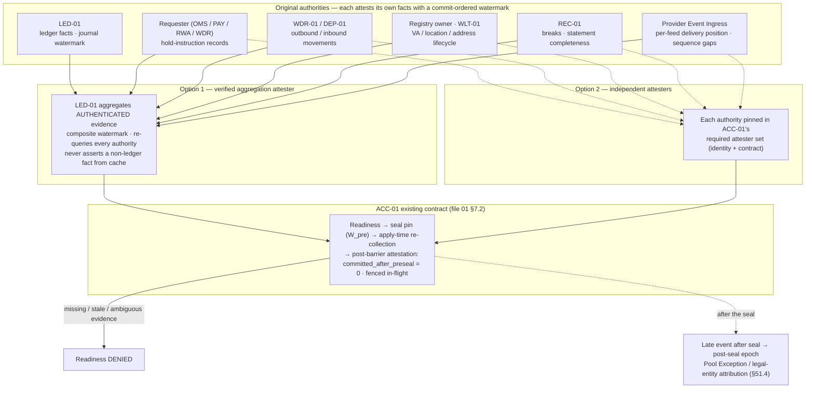

**Two admissible attestation styles — DEC-015 does not choose permanently.**

| Style | How it satisfies ACC-01's existing contract | Conditions |
|---|---|---|
| **Option 1 — verified aggregation attester (LED-01)** | LED-01 is the single pinned attester; its watermark is a **composite** of its journal position and each original authority's commit-ordered watermark and delivery position (ACC-01 treats the watermark as opaque); `committed_after_preseal_watermark` counts commits after W_pre across **all** components; `open_item_count` sums each authority's evidenced count | LED-01 consumes **authenticated, current** closure evidence from each original authority (identity, contract version, as-of, watermark) and includes it in the readiness payload hash; it re-queries them for the apply-time recheck and post-barrier attestation; **it never asserts a non-ledger fact from its own cache** |
| **Option 2 — independent attesters** | Each original authority is a member of the pinned required attester set with its own authenticated identity, contract, commit-ordered watermark and post-barrier fields | Each authority stores the `resolve` version with its target-affecting records (for `max_resolution_version_committed`) and fences in-flight work; an authority that cannot is **not eligible** (fail closed, as DCR-ACC-LED-01c already states for LED-01) |

Either style fits ACC-01 v0.10 as designed: the pinned attester set, opaque commit-ordered watermark
and apply-time recheck already exist. **Missing, stale or ambiguous evidence from any required
authority denies readiness.** The choice is recorded at the ACC-01 compatibility disposition (§56 step
4a) and in the consuming blueprints; neither requires an ACC-01 schema change.

FI-ACC-5 therefore needs **no** ACC-01 blueprint revision under either style.

DEC-015 does **not** set ACC-01 `PLAN_READY`, record ACC-01 acceptance or authorise ACC-01
implementation.

---

## 52. AST-01 Compatibility Assessment

| Field | Value |
|---|---|
| Branch reviewed | `origin/module/AST-01` (read-only; not merged, rebased, cherry-picked or advanced) |
| Commit reviewed | `1978f2e24192b7d893939b25ec9176cc9920791a` (re-verified in this remediation) |
| Blueprint reviewed | `docs/02_modules/AST-01/blueprint/v1.8/` — file 01 (§1, §2, §3.10, §3.11, §5.1–§5.8, §6, §7, §9); file 05 (`ast1.custody_support` l.738–748, `ux_ast1_custody_live` l.809); file 17 |
| Review record reviewed | `docs/03_implementation/tasks/AST-01/04-review-r9.md` and `task.json` (`IDLE`, `NOT_ACCEPTED`, `PLAN_READY` not set) |
| **Compatibility classification** | **`DEC015_COMPATIBLE_FUTURE_INTEGRATION_ONLY`** — reconfirmed for v0.4, **subject to HD-DEC015-02**. Round 3 confirmed it but **rejected v0.3's claim of universally safe exit** (`04-review-r3.md` §12, R3-F01). v0.4 corrects the DEC-015 side (§10.2.2, §13.7) and states exactly what must be proven on the AST-01 side for the distressed return path (§13.7.3); normal option A needs no AST-01 change |
| Affected sections | §6 custody support (`custodian_ref` semantics; immutable `deposit_supported` / `withdrawal_supported`); file 05 `ast1.custody_support` l.738–748 and `ux_ast1_custody_live (instrument_id, domain)` l.809; §5 C6 for `DEPOSIT_MB_PSO` / `WITHDRAWAL_MB_PSO` (l.389–392) and §5.8 allow-list (consumer-side readiness, Rule A / Rule B — no change); `instrument_operational_state` (used to suspend `DEPOSIT_MB_PSO` instrument-wide in the distressed case) |
| Contradictions found | None in AST-01. **v0.1 contained a stale STR-04 statement** (A-06) — corrected in v0.2. **v0.2 contained a DEC-015-side rule (§13.5 "accept or release only while approved") that, combined with `ux_ast1_custody_live`, trapped assets** — corrected in v0.3 (R2-F01). **v0.3 relied on keeping a departing custodian's row `APPROVED` as the distressed return path** — withdrawn in v0.4 (R3-F01): a return path must be truthfully representable (§13.7.3) |
| Future changes required | FI-AST-1…FI-AST-5; FI-AST-6 **conditional** |
| Blueprint revision required | **Not for normal option A.** **FI-AST-6 is CONDITIONAL / TO BE DISPOSED BEFORE AST-01 `PLAN_READY`:** required if the distressed return contract cannot be represented truthfully under v1.8 (R-AST-a successor row / R-AST-b withdrawal-only row, §13.7.3); unnecessary if it can. Option B (concurrent custodians eligible for new placements) requires a controlled AST-01 revision before `PLAN_READY`. DEC-015 pre-decides neither |
| Human decision required | **HD-DEC015-02** (§58) — before AST-01 `PLAN_READY` |

### 52.1 Evidence

1. **Asset / instrument identity, network identity, token/security separation** — unchanged;
   DEC-015 uses canonical identity (§3.11) for deposits (§22) and relies on INV-01. A custodian exit
   transfer (§13.6) never moves a `SECURITY` instrument into an MB/PSO custody location: the
   successor must satisfy Rule A, which requires AST-01 approval for (I, D).
2. **Regulatory classification and eligibility derivation** — unchanged.
3. **Custody eligibility** — §6: `custody_model ∈ {THIRD_PARTY_CUSTODIAN, NOT_SUPPORTED}`, "no value
   exists for AIX self-custody or AIX key custody" — consistent with §13 and with §13.4 (an
   arrangement `CONTROL_ASSESSMENT_REQUIRED` or `PROHIBITED_AIX_UNILATERAL_CONTROL` has no valid
   value; no legal conclusion is drawn). **Eligible for new placements ≠ authorised to return or
   migrate existing assets:** AST-01's `APPROVED` row is a necessary condition for new placements
   (§13.5 Rule A) and, through C6, for any client withdrawal of the instrument; it is **not** the
   DEC-015 test for servicing existing assets at a location (Rule B). For an AIX-instructed
   **distressed** return, WLT-01's C6 evaluation must be satisfied by a truthful representation —
   never by retaining an approval AST-01's governance has withdrawn (§13.7.3).
4. **External custody resource representation** — §6 "Facts, not eligibility", `custodian_ref` "an
   opaque provider id"; §1.2 excludes wallet addresses, ledger and balances.
5. **AST-01 never becomes owner** of client custody entitlement, custodian balance, ledger balance,
   settlement state, custody location, arrangement verification or wallet-destination ownership.
6. **Fiat** — §3.10 supports USD now and more currencies later.

### 52.2 The custodian-cardinality question (not decided by DEC-015)

- **Fact:** file 05 `ux_ast1_custody_live (instrument_id, domain) WHERE status IN
  ('PROPOSED','APPROVED')` and a single `custodian_ref` permit **one live custodian per instrument ×
  domain**. A sequenced cutover is possible (`WITHDRAWN` → new `PROPOSED` → `APPROVED`); during it
  `DEPOSIT_MB_PSO` / `WITHDRAWAL_MB_PSO` deny for that instrument.
- **v0.1 wording "the initial operating model has one legal custodian per instrument × domain" is
  withdrawn**: it is not among HB-01…HB-13 and is **not** a human-approved business decision.
  WF-19 §23.4 item 8 and `CUS-REQ-063` anticipate custodian replacement.
- **HD-DEC015-02** (§58, corrected per R2-F01): **A** — one custodian **eligible for new
  placements** per instrument × domain, with the previous custodian in a controlled wind-down /
  return / migration state until its assets have left (AST-01 stays at v1.8; §13.6 sequence); or
  **B** — several custodians concurrently eligible for new placements under governed policy
  (requires a controlled AST-01 revision before `PLAN_READY`, i.e., before `ux_ast1_custody_live` is
  frozen).
- **v0.2 framed option A on a false premise** (Round-2 R2-F01): under its §13.5 the old location
  could not release once its row was `WITHDRAWN`, and the successor could not accept until its own
  row was `APPROVED`, so no in-kind migration ordering existed. Under v0.3 / v0.4, AST-01's approval
  constrains **new placements** (Rule A); existing assets leave the old location under Rule B and
  the governed exit classes. Option A permits temporary **operational coexistence** of the two
  custodians solely for migration / return; it never makes both eligible for new business.
- **v0.4 — option A relies on the corrected distressed-exit contract** (R3-F01): normal option A
  (planned cutover, ordinary gates holding) **may not require any AST-01 schema change**; but
  option A must also survive a distressed old custodian whose row is already `WITHDRAWN` with no
  successor. That **distressed exit contract must be proven before AST-01 `PLAN_READY`** (§13.7.3):
  if R-AST-a / R-AST-b truthfully represent the return path, no AST-01 change is needed; if not, a
  controlled AST-01 change (FI-AST-6) becomes required. DEC-015 states neither that FI-AST-6 is
  always required nor that it is always unnecessary.

### 52.3 Future integration items

| ID | Item | Owner | Classification |
|---|---|---|---|
| FI-AST-1 | `custodian_ref` identifies a **legal custodian** recorded on the shared provider record (owner per HD-DEC015-01) — not a technology/wallet-infrastructure vendor and not an LQD-01 record. No schema change (opaque `varchar(64)`). Arrangement verification (`VERIFIED`, §13.4.5) is enforced **at the custody location** (§13.5, §17.7), **not** inside AST-01's approval path — no new AST-01 apply-time dependency | Location activation (arrangement owner) + WLT-01 check | FUTURE_INTEGRATION_WORK |
| FI-AST-2 | Custodian cardinality per instrument × domain | AST-01 | **HD-DEC015-02**: option A — no change; option B — controlled AST-01 revision before `PLAN_READY` |
| FI-AST-3 | Spot/OTC settlement-destination readiness via WLT-01 `DEPOSIT_MB_PSO` evaluation (§25.3; DEC015-PNF-04) | OMS-01 / WLT-01 | FUTURE_INTEGRATION_WORK — no AST-01 change |
| FI-AST-4 | Securities-domain custody (`DEPOSIT_SECURITIES`) stays `NOT_ASSESSED` for real instruments pending `R4-Q5` | External | EXTERNAL_VALIDATION |
| FI-AST-5 | F17 (WLT-01 canonical-identity gate) is a prerequisite for DEC-015 crypto deposit attribution | WLT-01 | FUTURE_INTEGRATION_WORK (existing gate) |
| **FI-AST-6** | **Return-only / wind-down representation — CONDITIONAL / TO BE DISPOSED BEFORE AST-01 `PLAN_READY` (R3-F01).** AST-01 v1.8's C6 makes `WITHDRAWAL_MB_PSO` require an `APPROVED` `custody_support` row with `withdrawal_supported`. v0.4 no longer keeps a departing row `APPROVED` as a device. Disposition question: can the distressed return path be represented **truthfully** by R-AST-a (successor's row; C6 custodian-agnostic) or R-AST-b (withdrawal-only row for the custodian of record, `deposit_supported = false`) under AST-01's governance? **Yes ⇒ no AST-01 change** (normal option A also needs none). **No ⇒ a controlled AST-01 change becomes required** — e.g., a status such as `WIND_DOWN` / `RETURN_ONLY` **outside** `ux_ast1_custody_live`, satisfying C6 for `WITHDRAWAL_MB_PSO` only and **never** for `DEPOSIT_MB_PSO`. Option B independently requires a controlled revision (FI-AST-2). **AST-01 is not modified here** | AST-01 compatibility disposition (§56 step 4a) → AST-01's controlled revision if required, before `PLAN_READY` | FUTURE_INTEGRATION_WORK (conditional) |

DEC-015 does **not** set AST-01 `PLAN_READY`, remediate F46, record AST-01 acceptance or authorise
AST-01 implementation.

---

## 53. Ownership Self-Check (D-1…D-6)

Each position was re-tested in v0.2, v0.3 and again in v0.4 against Master Module Index v1.4, Workflow
Map v1.3 WF-19, `DEC-011`…`DEC-014`, ACC-01 v0.10, AST-01 v1.8, the authoritative WLT-01, LED-01,
DEP-01, WDR-01, REC-01 (v1.1) and TRD-01 (v1.2) blueprints, and the Round-1 and Round-2 ownership
reviews (`04-review.md` §5; `04-review-r2.md` §8; `04-review-r3.md` §§7–8). Every position is
**PROPOSED — SUBJECT TO ROUND-4 REVIEW AND HUMAN ACCEPTANCE**.

### D-1 — WLT-01 and external locations (corrected, R12)

| Aspect | Analysis |
|---|---|
| Existing owner/boundary | WLT-01 v1.1 §2: "controls whether a wallet address or fiat payout destination is eligible for use … does not custody assets, hold keys, post ledger entries, or execute transfers"; §5.2 `custody = out_of_scope`. Module Index v1.4 l.397: "Wallet Screening / Payout-Destination Whitelist / **Custody Orchestration** … **Extension:** custody orchestration; destination scoping to subaccount". DEP-01 v1.1 workflow step 5 already "Generate[s] deposit reference / virtual account / approved deposit address instruction" |
| v0.1 position | WLT-01 owns registry entries and eligibility of **all** client-attributable external locations, including fiat VAs and custody accounts — **not proven** (Round-1 R12): it widened WLT-01 from *where value may go* to *where client money is held* without Module Index basis |
| Distinctions applied | Destination (where value may go) ≠ deposit address (where inbound digital assets attribute) ≠ VA (where inbound fiat attributes) ≠ underlying account / custody account (where resources sit) ≠ resource pool ≠ legal safeguarding pool ≠ arrangement (legal facts) ≠ provider identity ≠ balance |
| v0.2 position | WLT-01 destinations + custody deposit addresses; **DEP-01 owns the fiat VA registry** — **not justified as a pre-assignment** (Round-2 R2-F05): DEP-01 v1.1 §3 items 1–2, step 5 and l.911 support *consuming* a VA mapping and generating instructions, not owning a long-lived object that is also an outbound source, a hold target, a closure-drain item and, under `PROVIDER_PER_VA_ENFORCED`, a resource pool with its own lifecycle |
| v0.3 position | **WLT-01:** withdrawal/payout destination eligibility (existing); custody deposit-address assignment and eligibility; custody-orchestration requests; inbound instrument identification. **Provider / resource registry abstraction (§36.5), owner per HD-DEC015-01** (VA-registry sub-question: DEP-01 or the holding-arrangement owner): VA / reference registry entry, VA lifecycle, subaccount / pool binding. **DEP-01:** consumes the VA → client / subaccount / pool mapping for inbound attribution and funding instructions. **Client-asset holding arrangement (owner per HD-DEC015-01):** underlying accounts, custody accounts/pools, resource pools, legal safeguarding pools, holder, beneficial model, authorities, hold enforceability, allocation mode, control facets, operating state. **LED-01:** allocation and balances. **Provider:** the objects themselves |
| Why not WLT-01 for VAs | No Module Index basis; destinations and safeguarding locations need different controls (Round-1 §5) |
| One lifecycle authority | Where a VA is its own pool, the VA lifecycle and the pool operating state belong to the same owner (§11.2) — whichever HD-DEC015-01 names |
| Revision required | Module Index v1.5 rows (WLT-01, DEP-01, registry owner or OPEN seam); WLT-01, DEP-01 and registry-owner blueprint versions |
| Overlap risk | Low once decided; consumers carry opaque ids until then |

### D-2 — LQD-01, providers and HD-DEC015-01 (corrected, R12)

| Aspect | Analysis |
|---|---|
| Existing owner/boundary | Module Index v1.4 l.432 LQD-01 "**Provider-neutral** LP/venue registry, venue adapters, venue capability and health, asset and settlement capability, regulatory eligibility, counterparty exposure limits, and the venue activation gate …". Workflow Map v1.3 WF-19 (l.1314–1361) is **one** workflow, "Vendor / LP / Custodian / Bank Approval", with one vendor record covering DD, security, compliance, finance and management reviews, the exit plan and the custodian asset-migration plan — **no owning module** |
| v0.1 position | LQD-01 not extended (correct); "non-LP" arrangement record to HD-DEC015-01 — **framing incomplete**: splitting LPs from other providers gives one WF-19 record type two owners |
| v0.2 position | **LQD-01** keeps the LP/venue **arrangement** (terms, SSIs, settlement basis, claim holder, credit support, venue gate, limits). The **shared provider identity / DD / WF-19 record** for **all** provider types (Vendor / LP / Custodian / Bank / PSP / settlement agent / paying agent / escrow provider / payment rail / wallet-infrastructure vendor) has **one** owner: **HD-DEC015-01**. Rail / product arrangements, adapters, capability profiles and rail activation stay with the consuming / executing modules. The holding-arrangement fields follow the §36.4 split |
| HD-DEC015-01 options (Round-1 assessment) | **A** — each consuming module owns its arrangements: duplicates identity/DD, breaks WF-19's single approval. **B** — shared registry in an existing module: none fits (CLT-01 is the client domain; KYC-01 performs DD but owns no relationships; LQD-01, TRE-01, CFG-01 rejected). **C** — new module for the whole record: justifiable only for identity/DD/WF-19. **D — split: shared provider identity / DD / WF-19 record (one owner, possibly a narrowly scoped Module Index addition) + module-owned rail/product arrangement** — **recommended** |
| Timing (corrected, R2-F09) | **Before Module Index v1.5 / Workflow Map v1.4 lock in provider ownership** — or those masters record the seam explicitly **OPEN** with this trigger — and **in all cases before** consuming blueprint work that needs the owner (§56 step 6: LED-01, WLT-01, registry owner incl. VA registry) |
| Overlap risk | Low once decided; **high if left undecided into step 6** |

### D-3 — reservations and provider holds (corrected, R06)

| Aspect | Analysis |
|---|---|
| Existing owner/boundary | LED-01 v1.1: Hold / Reserve Service, Atomic Reservation Engine, Backing Encumbrance Engine, §5.17, §5.22 hold pinning. WDR-01 v1.1 l.582: LED Reserve Adapter "**validates** reserve and reports outcomes"; Provider Transmission Adapter; Signing Key Governance. TRD-01 v1.2 §5.7 "hold is atomic through LED-01" |
| v0.1 position | LED-01 owns the reservation and its external-hold state; but diagrams had the requester (§18.1) **and** LED-01 (§25.1) each asking WDR-01 for the hold — two requesters |
| v0.2 position | One requester per reservation; LED-01 owns reservation + binding; **WDR-01 owns the hold-instruction lifecycle and transmission for every purpose** — a scope stretch (Round-2 R2-F04): a Spot hold is not a withdrawal (no value leaves), and WDR-01's gate set has no meaning for it |
| v0.3 position | **One requester per reservation** (OMS-01 / PAY-01 / RWA-03 / WDR-01 for withdrawals) requests the accounting reservation (LED-01) **and owns the provider-hold instruction** for it (durable intent, outcome, binding request) using shared FND-01 hold-instruction mechanics. **LED-01** owns the accounting reservation and its **binding** state. The **provider adapter** executes (D-7). Correlation = `reservation_id`; hold events route to the requester by `hold_instruction_id` |
| v0.4 correction (R3-F03) | v0.3 stated the requester rule but §25.1, §31.1, §32 and R6 still gave WDR-01 hold actions. v0.4: **every** hold action (place / extend / reduce / release / consume) belongs to the requester with per-action predicates (§18.8.2); availability returns only on provider-confirmed release / reduction (§18.8.3); WDR-01 executes only the payment out of a hold under the requester's **conversion handoff** (§18.8.4), and owns that payment lifecycle without becoming the hold owner |
| Why not LED-01 calling the provider | It would put provider credentials and signing inside the accounting module |
| Why not WDR-01 for every hold | WDR-01's canonical boundary is outbound external transfer (Module Index l.418; WDR-01 v1.1 §2, §4 item 9). The security property v0.2 wanted from one credential holder is kept by D-7 (credentials only in the adapter under SEC-01 / FND-01 controls) without making WDR-01 the business owner |
| Overlap risk | Low; trading depends on the shared adapter and KMS (`WDR-FIND-001`), not on WDR-01 |

### D-4 — settlement (corrected, R08)

| Aspect | Analysis |
|---|---|
| Existing owner/boundary | Module Index v1.4 LED-01 "Ledger / Settlement / Safeguarding … settlement, DvP"; LED-01 v1.1 DvP Settlement Controller, DvP Leg Controller; TRD-01 "settlement handoff"; WDR-01 Payout Finality Engine; DEP-01 Finality Model Engine; PAY-01 "payment processing, payout, refund"; EXC-01 "clearing and settlement interfacing" |
| v0.1 position | LED-01 owns the obligation **and** its sequencing; obligation states began at `created → awaiting_resources → reserved → ready_to_execute`; LED-01 instructed WDR-01 — **LED-01 became the product workflow engine** (Round-1 R08) |
| v0.2 position | **LED-01** owns the **accounting** obligation (created from the fill), per-leg accounting status and **transition guards** only — no timers, retries or instructions. **Settlement orchestration** belongs to the product workflow owner: **TRD-01** for Spot/OTC *(proposed — extends "settlement handoff" to post-trade orchestration; requires Module Index v1.5 wording)*, PAY-01, RWA-03/04, EXC-01, WDR-01 (withdrawals), DEP-01 (returns-in). WDR-01/DEP-01 execute and record external transfers; the provider executes. Finality is separate from accounting settlement (§31.4) |
| Alternative recorded | A distinct, non-posting LED-01 "settlement controller" component as the Spot/OTC orchestrator (Round-1 R08 option). v0.2 prefers TRD-01 because LED-01 must not own product orchestration merely because it owns the accounting obligation, and TRD-01 already owns the fill evidence and the settlement handoff; Round-2 may test either |
| Overlap risk | Low–medium with WDR-01 on leg retry: rule — the orchestration owner decides whether to retry (after LED-01's guard allows it); WDR-01 decides how and reports the outcome |

### D-5 — evidence (confirmed, plus R15)

| Aspect | Analysis |
|---|---|
| v0.2 position | **REC-01** owns periodic statements, scheduled snapshots, reconciliation runs, breaks, evidence associations and the safeguarding report — **detective only**. **DEP-01/WDR-01** own original provider transaction events. **Preventive** decisions use LED-01 state + fresh movement-scoped provider reads + bound hold evidence (§16.7); REC-01 output can deny (open blocking break) but never authorise, and is never the sufficiency input. Disagreement between fresh read and REC-01 evidence fails closed and opens a break. LED-01 keeps internal sub-ledger integrity checks only (DEC015-PNF-09) |
| Overlap risk | Low |

### D-6 — Provider Event Ingress (new, R06)

| Aspect | Analysis |
|---|---|
| Gap | v0.1 §35.1 gave one bank adapter to DEP-01, WDR-01, REC-01 and WLT-01; nothing defined who authenticates and routes the single inbound provider stream, or credential cardinality |
| v0.2 position | One **Provider Event Ingress** per environment — an **FND-01 shared component** *(proposed)* exposed through the IMP-02 perimeter — authenticates, dedupes, normalises and routes each event to exactly one lifecycle owner (§35.7); owns no business state. Credential cardinality per §35.7 |
| Why FND-01 | FND-01 already owns idempotency, outbox and shared platform mechanics (Module Index v1.4 l.351); IMP-02 owns the perimeter, not application routing |
| v0.3 addition (R2-F08) | Retains immutable raw evidence and delivery attempts; dedupes on provider event id, else semantic fingerprint; quarantines conflicts; records schema / normaliser versions — still no business state |
| v0.4 correction (R3-F05) | Event identity per a governed provider event-identity profile: namespaced native ids; a fallback only where proven unique per economic occurrence (never a parent reference); `QUARANTINE_AMBIGUOUS_EVENT`; missing required ids recorded as a contract breach; raw evidence of every attempt |
| Revision required | Module Index v1.5 FND-01 row; FND-01 blueprint delta; masters 08/09 |
| Overlap risk | Low; the ingress decides nothing |

### D-7 — provider instruction execution and credentials (new, R2-F04)

| Aspect | Analysis |
|---|---|
| Gap | v0.2 solved credential concentration by making WDR-01 the transmitter of every instruction, which stretched WDR-01 beyond its canonical scope |
| v0.3 position | Business purpose stays with the module that needs the instruction; LED-01 keeps accounting; the **provider adapter** executes; credentials live in KMS / vault under **SEC-01 / FND-01** controls with a deny-by-default **identity × instruction-class × provider-arrangement** matrix; the lifecycle module owns the movement (§35.8). **No new financial module** |
| Why FND-01 / SEC-01 | FND-01 already owns idempotency, outbox and shared platform mechanics (Module Index v1.4 l.351); SEC-01 and master 09 own security controls; WDR-01 v1.1 §5.22 signing-key governance is generalised as a platform control rather than a WDR-01 privilege |
| v0.4 addition (R3-F11) | Per-class **submission profiles** (`PROVIDER_IDEMPOTENT` / `NON_IDEMPOTENT` / `UNVERIFIED`) with single-flight sending, query / statement correlation and no non-idempotent resend without authoritative non-execution evidence (§35.8.4) |
| Revision required | Module Index v1.5 FND-01, SEC-01, WDR-01, OMS-01, PAY-01, RWA-03 rows; master 08 (adapter architecture) and 09 (credential custody, matrix); FND-01 blueprint delta |
| Overlap risk | Low; the adapter holds no business authority and refuses anything outside the matrix |

---

## 54. Mandatory Adversarial Questions

| # | Question | Answer and control | Gap? |
|---|---|---|---|
| 1 | Can the same client resources be allocated twice? | Not inside AIX: LED-01 atomic reservation at S × A × P (§18.2). Not outside AIX where a bound **enforceable** hold exists or no one but AIX can debit the pool (§10.3, §18.4). Otherwise the pool's resources are not trading resources | No |
| 2 | Can a negative client position mask another client's shortfall? | No: claims floored at zero per client × subaccount; negatives are Client Deficit, outside coverage (§17.2 rules 1–2) | No |
| 3 | Can a surplus at one bank / custodian / legal pool mask a shortfall at another? | No: coverage per asset × resource pool; legal-pool and aggregate views never substitute (§17.2 rules 3–6) | No |
| 4 | Can AIX's own unswept fee money mask a client shortfall? | No: deducted from qualifying resources (§17.2 rule 7) | No |
| 5 | Can an expected LP delivery count as a safeguarded resource? | No: in-flight claims sit outside every pool; receivables qualify only on proven `EV-29` criteria (§17.3–§17.4) | No |
| 6 | Can company money fund, bridge or advance a client position? | **No, unconditionally** (§19.4). The v0.1 timing-advance permission is removed; HD-DEC015-03 not required | No |
| 7 | Can client money enter AIX treasury? | Only through the enumerated client → corporate cross-book events: **X1** (fee earned, internal evidence), **X2** (sweep of the pool fee payable, provider evidence, bounded by `fee_sweep_max_latency`) and **X7** (recovery of an evidenced AIX receivable from that client's own resources, under its separate application authority and maker-checker — never another client's). X3–X6 move value from the corporate book into client books. R8 reconciles fees (§16.4, §20, §17.9.1) | No |
| 8 | Can a payout from a pooled VA consume another client's money? | No where the allocation mode is `PROVIDER_PER_VA_ENFORCED` or `AIX_EXCLUSIVE_INSTRUCTION`; any other structure is `UNSUPPORTED` and holds no live client funds (§9.6.4) | No |
| 9 | Can a reservation be released by a timer while a fill may still arrive? | No (§18.3 rules 1–4) | No |
| 10 | What if an LP fills after an AIX timeout? | The reservation is still protected (`EXECUTION_UNKNOWN`); the fill settles against it. A fill after an authoritative no-fill is a parked exception, never auto-settled, never corporate-funded (§18.6) | No |
| 11 | Can a provider hold lapse while settlement is pending? | Renew / re-hold; otherwise `HOLD_LOST`, fail closed for the protected amount, escalate (§18.5, §40 row 33) | Controlled |
| 12 | Can the client withdraw directly at the bank while AIX treats funds as reserved? | Only where `EV-32` has not proven the hold enforceable — and then the pool's resources are not trading resources (§10.3). A defeating debit is posted (§23.1) and suspends hold-based eligibility (§40 row 41) | Controlled |
| 13 | Does a software reservation legally restrict a bank account? | No — stated in §10.3 | No |
| 14 | Can AIX move client crypto through a key share, recovery kit, policy-admin right or quorum seat? | Not alone: any arrangement where AIX can, by itself, reconstruct signing authority, move, recover to itself, bypass or re-policy is `PROHIBITED_AIX_UNILATERAL_CONTROL` (§13.4.2). Any other indicator is recorded as a fact and makes the arrangement `CONTROL_ASSESSMENT_REQUIRED` — no live custody location — until `EV-34` assesses it. No legal conclusion is drawn from the indicator (§13.4.3) | No |
| 15 | Can a bank balance or custodian balance disagree with the ledger? | Yes — expected; break; fail closed for the pool (§16.6, §34) | No |
| 16 | Can a REC-01 snapshot authorise a movement? | No (§16.7) | No |
| 17 | What if one settlement leg succeeds? | In-flight claim, exposure view, exception past window; no AIX delivery from inventory or corporate funds; claim holder / loss bearer per `EV-30`/`EV-31` (§17.4, §33.3) | No |
| 18 | Is LP default assumed to fall on the client, or on AIX? | Neither (§33.3) | No |
| 19 | Is LP settlement assumed gross, or net? | Neither; `settlement_basis` from evidence; no cross-client funding under any basis (§30.3) | No |
| 20 | Can a stale bank or custodian balance still permit execution? | No (§16.3 step 2; §40 rows 2, 49) | No |
| 21 | Can a partial fill release too much or too little? | Release only of the unconsumed remainder, only on authoritative terminal state (§32) | No |
| 22 | Can a returned payment leave a false settled balance? | `accounting_settled → reversed`; deficit if needed; finality separate (§31.4, §33.4) | No |
| 23 | Can REC-01 silently repair a break? | No (§34.4, D-5) | No |
| 24 | Can a production-disabled capability route money through an adapter? | No: every §46.4 layer denies; OMS-01 / EXE-01 refuse to route and the instructing module and the adapter refuse to instruct over an inactive rail; instruct credentials exist only in the adapter's KMS / vault scope and are used only for authorised identity × class pairs; non-production holds no live credentials. LED-01 still records any fill that occurred (§31.3 rule 6) | No |
| 25 | Can a provider event reach LED-01 directly? | No: ingress → owning lifecycle module → governed instruction (§35.7) | No |
| 26 | Can MB Spot reach the securities Exchange matching path? | No: Module Index §19 rule 5A, §16A.2, §20; AST-01 allow-list; EXC-01 shares no MB code (§29.1) | No |
| 27 | Could DEC-015 make ACC-01 owner of bank/custody balances or fee objects? | No (§51; fee payable is pool-level) | No |
| 28 | Could DEC-015 make AST-01 owner of client custody entitlement or location verification? | No (§52.1 item 5; FI-AST-1) | No |
| 29 | Could DEC-015 silently invalidate an accepted-review ACC-01/AST-01 invariant? | No: all impacts are consumer-side; ACC-01 text items only; AST-01 revision only if HD-DEC015-02 option B | No |
| 30 | Does D-1 overload WLT-01? | Corrected in v0.2 (§53 D-1) | Corrected |
| 31 | Does D-4 make LED-01 the product workflow engine? | Corrected in v0.2 (§53 D-4) | Corrected |
| 32 | Is the single-custodian model silently assumed? | No: HD-DEC015-02 (§52.2, §58), with option A restated so that it works (§13.6) | HD |
| 33 | Can withdrawing approval from a custodian trap client assets? | **Not by itself**: Rule A stops new placements; ordinary servicing continues while its gates hold; where they do not, a distressed exit authorisation with evidenced provider ability, legal permission and a truthful AST-01 representation opens returns / migration (§10.2.2, §13.7). DEC-015 does **not** claim exit is always possible: an unable provider or a legal prohibition yields a stranded / recovery claim, never a fictitious movement (§10.2.3) | Controlled |
| 34 | Can a provider API outage create a false safeguarding deficit? | No: the verified amount is unchanged; coverage at worst `UNDETERMINED`, never `SHORTFALL`; no X6 (§16.8, §17.2) | No |
| 35 | Can a single-client legal order create a false pool-wide deficit? | No: it is `Blocked` on that client's entitlement; resources still qualify; other clients unaffected (§16.8 fact 5, §40 row 58) | No |
| 36 | Does any operational AIX control automatically become a legal-custody conclusion? | No (§13.4.3, §57 D) | No |
| 37 | Can WDR-01 still be read as owner of all provider instructions? | No: §35.8 instruction-class table; holds are requester-owned; notices go to the arrangement owner | No |
| 38 | Is DEP-01 presented as permanent VA-registry owner? | No: registry abstraction, owner per HD-DEC015-01; DEP-01 consumes (§36.5) | No |
| 39 | Can one client's deficit unnecessarily freeze unrelated clients — or that client's unrelated property? | No: pool-wide block only on the four stated grounds; per-client pools never contaminate; the deficit client's unrelated property is restrained only under an evidenced authority record (§17.9, §17.9.1) | No |
| 40 | Can duplicate webhook deliveries create duplicate financial events? | No: one canonical event per provider economic occurrence under the event-identity profile; attempts recorded separately; ambiguous events quarantined, not collapsed; downstream idempotency (§35.7) | No |
| 41 | Is raw provider evidence preserved? | Yes: raw payload or protected reference, never discarded after normalisation (§34.5, §35.7) | No |
| 42 | Can "AIX-owned surplus" wording misclassify unidentified client money? | No: excess is Unallocated / Excess External Resource on the claims side until ownership is proven (§17.2 rule 8) | No |
| 43 | Can an external execution occur without a durable local attempt record? | No: durable intent + outbox before transmission; adapter refuses without it (§18.3 rule 7, §35.8.3) | No |
| 44 | Is any example journal one-sided? | No: X1–X7 and the single-book events are balanced pairs (§16.4) | No |
| 45 | Can ACC closure proceed with unresolved reservations, deficits or external holds? | No: initiation preconditions and readiness facts (FI-ACC-5), each proven from its **original authority** with commit-ordered watermarks, delivery completeness, fencing and the apply-time recheck (§51.5) | No |
| 46 | Can split funding occur without child-reservation invariants? | No: not supported; rejected; invariants S-1…S-9 recorded for any future change (§9.6.5) | No |
| 47 | Can AIX collect a fee externally without proven instruction authority? | No: `COLLECT_DISCLOSED_FEE` required for X1 / X2; fallback route or refusal (§20.10) | No |
| 48 | Can LP seizure of corporate collateral silently become client financing? | No: corporate exposure; obligation not settled from corporate value; asset blocked; no other client debited; no pre-financing permission (§19.5) | No |
| 49 | Can a Pay chargeback arrive without an owning lifecycle module? | No: PAY-01 (§27.2, §35.7) | No |
| 50 | Can a stale-evidence policy be too generic for the operation / provider? | No: policy keyed by eight dimensions, most specific match applies, absence denies (§16.7 rule 5) | No |
| 51 | Can a custodian lose normal approval and still complete a separately lawful and possible distressed return? | Yes: WF-19 `suspended`, `REVERIFICATION_DUE` or a `WITHDRAWN` AST-01 row do not alone deny a distressed return; the exit authorisation, `EXIT_ONLY` routing, provider ability, legal permission and a truthful AST-01 representation do (§10.2.2, §13.7.5) | No |
| 52 | If the custodian cannot move assets, does the architecture still promise movement? | No: location `INACCESSIBLE`; stranded / recovery claim with debtor / administrator, last evidence and age; no movement recorded until evidenced (§10.2.3) | No |
| 53 | Does a distressed exit bypass authentication, AML, destination verification, maker-checker, attribution, anti-preference, legal restrictions or provider capability? | No: the never-waived list applies to every exit class; first-come returns from a short pooled location are refused (§10.2.2, §13.7.4) | No |
| 54 | Can an operational relationship terminate while an economic recovery claim remains? | Yes: `relationship_state = TERMINATED` with location `INACCESSIBLE`, entitlements unchanged and a recovery claim open; no fictional zero, confirmation or write-off (§10.2.3) | No |
| 55 | Is there exactly one owner for each provider hold? | Yes: the recorded requester owns every hold action; WDR-01 executes only the payment out of a hold under the requester's conversion handoff (§18.8.1, §18.8.4) | No |
| 56 | Can client availability return before the provider confirms release or reduction? | No: `RELEASE_PENDING_PROVIDER`, `REDUCE_PENDING_PROVIDER` and `ACTION_UNKNOWN` are not available balance (§18.8.3) | No |
| 57 | Can missing recovery-hold configuration fabricate a cross-pool legal right? | No: no restraint without an `APPROVED` authority record; refusal of new risk-taking, assessment and escalation instead (§17.9.1, `EV-37`) | No |
| 58 | Can two same-value partial events sharing one parent reference be deduplicated by accident? | No: a parent reference is never a discriminator; the second is `QUARANTINE_AMBIGUOUS_EVENT` until statement / sequence / query-back evidence resolves it (§35.7) | No |
| 59 | Can a fee sweep happen without inventing or re-reserving client entitlement? | Yes: a `FEE_PAYABLE_COLLECTION` encumbrance on the pool fee payable; X2 consumes it once (§16.3, §20) | No |
| 60 | Can an unidentified receipt be returned without a fake subaccount balance? | Yes: a `SUSPENSE_ITEM_ENCUMBRANCE` on that receipt item; Dr Client Suspense (item) / Cr Pool Resource (§16.3, §21.4) | No |
| 61 | Does ACC closure prove completeness of upstream provider / registry / REC facts rather than trusting a stale LED cache? | Yes: original-authority evidence, watermarks, delivery completeness, fencing and apply-time recheck; LED-01 may aggregate only verified evidence (§51.5) | No |
| 62 | Can a partial migration conserve the client claim across source, in-flight and destination? | Yes: per-slice states and balanced journals; 100 = 0 + 40 + 60 (§13.8) | No |
| 63 | Can a provider without idempotent submission be activated, and can it resend after a lost response? | Only with a documented `NON_IDEMPOTENT` profile; never resend without authoritative non-execution evidence; `UNVERIFIED` cannot be activated (§35.8.4) | No |
| 64 | Are custody key / control requirements consistent with `EV-34`? | Yes: AIX unilateral signing secret / control prohibited unconditionally; disclosed non-controlling participation only after `EV-34` (§13.4, STR-04B CUS-REQ-026) | No |

---

## 55. Final Stale-Assumption Search (re-run for v0.4)

**v0.4 re-run.** `git grep -i -l -F` over `docs/` and `platform/` at `main` @ `11b30d7`, excluding
`docs/90_archive/**`, `**/reviews/**`, `**/node_modules/**`, `**/package-lock.json`,
`tasks/DEC-015/**` and the STR-04 / 04A / 04B / 04C files, for every term in the Round-3 remediation
instruction §30. File counts and dispositions:

| Term (files) | Material current hits | Disposition |
|---|---|---|
| custodian (68) | Masters' custody placeholders, Doc 00 §8.2, WF-19, VND-RULE-003 | M-03, M-08, M-10, M-29, M-49 |
| wind-down (2), provider hold (1), cross-pool (1), DEC-015 (2) | `CURRENT_STATE.md` / `DOCUMENT_REGISTER.md` DEC-015 pointers only | G-01, G-04 |
| terminated (4) | WF-19 §23.2 state `terminated`, blocking condition 8 (l.1332, l.1361); System Rules VND-RULE-003 (l.1517); two unrelated (UI foundation, handover) | M-29, M-49, M-53 |
| stranded (9) | System Rules VND-RULE-003 rule 7 "No client asset may be stranded" (l.1525); Data Flow l.696, l.761; Testing `OFF-TC-008` l.627; WF-27 step 3 l.1735; WLT-01 `pending_screening` "stranded" (unrelated) | **New rows M-49, M-50**: preserved as a control objective; v0.4 records a recovery claim where a provider cannot or may not lawfully return assets |
| recovery claim, recovery hold, hold owner, RELEASE_PENDING_PROVIDER, stable object, fee payable, return to source, closure attester, in-flight migration, PoolException, CUS-REQ-026, non-idempotent, temporary funding, settlement buffer, corporate cover (0 each) | — | New DEC-015 concepts; no conflicting authority |
| approved (693), verification (479), duplicate (406), migration (350), idempotency (341), fingerprint (134) | Broad; narrowed to masters and money modules: WF-19 §23; AST-01 `custody_support` (branch); DEP-01 / WDR-01 / LED-01 dedupe and source event ids; master 08 §10.4–§10.5 outbox and API request fingerprints (l.656–658), l.890 replay protection; DB migrations; config seals and tests | Consistent — M-29, M-47, M-51, B-32; API request fingerprints and DB migrations are different concepts |
| hold release (34), partial fill (28) | SRS l.1403; System Rules l.1170; master 08 l.527; LED-01 v1.1 l.71, l.463, l.692, l.901; TRD-01 v1.2 l.444, l.533–539; Workflow Map l.970, l.2499 | Consistent; requester ownership and provider-confirmed release added — M-45, B-24, B-25, **B-35** |
| event ID (18) | Master 08 l.890; DEP-01 l.118, `13` l.15; LED-01 l.290, l.722; E2E-01 `02` l.139 | Consistent — M-51, B-32; event-identity profile refines |
| late event (2) | SEC-01 v1.1 / v1.2 `02_Workflow.md` l.248 (missing / late event, source-sequence gap alert) | Consistent — **B-36** |
| suspense (39), return-to-source (16) | WF-07 / WF-08 suspense and return evidence; `unmatched_deposit_handling = suspense_then_match_or_return`; System Rules §12; Doc 00 / Charter / SRS suspense and clearing accounts | Consistent with suspense-item encumbrance — **M-52** |
| source account (13), watermark (24), fence (50) | DEP-01 remitter "source account / wallet" metadata; PRT-01 export watermarks; "defence-in-depth" / "ring-fenced" | Different concepts; ACC-01's closure watermark exists only on the read-only branch (A-02) |
| advance (30), bridge (7) | State / sequence advancement, UI status, IMP narrative, network bridge, CLT / IAM role bridge | **No financing hit**; HD-DEC015-03 remains NOT REQUIRED (§19.4 item 6) |

Read-only reference heads re-verified: `origin/module/ACC-01` = `3f23c3dcb2c5023a64afa2bd2dfb0ef77fe544be`,
`origin/module/AST-01` = `1978f2e24192b7d893939b25ec9176cc9920791a`; ACC-01 file 01 §7.1–§7.2 and AST-01
file 01 §5–§6 / file 05 l.738–809 re-read with `git show`.

**v0.3 re-run.** `git grep -i -l -E` over `docs/` and `platform/` at `main` @ `b9e8277`, excluding
`docs/90_archive/**`, `**/reviews/**`, `**/node_modules/**`, `tasks/DEC-015/**` and the STR-04 /
04A / 04B / 04C files, for: custodian, approved custodian, `custodian_ref`, migration, wind-down,
return only, resource pool, stale evidence, provider unavailable / outage, legal order, garnish,
freeze, Client Deficit, self-custody, legal custodian, MPC, key share, WDR, DEP, VA registry,
virtual account, provider instruction, provider event, webhook, dedupe, idempotency, AIX-owned
surplus, fee collection, fee payable, collateral, margin, set-off, close-out, execution attempt,
outbox, closure drain, chargeback, freshness, advance, bridge, DEC-015; broad terms (migration 350
files, stale 376, idempotency 341, freeze 287, outbox 246, freshness 114) narrowed to masters and
money-module blueprints. Results added below; every new material hit is in §43 (M-47, M-48,
B-29…B-34, A-12).

**v0.2 method (retained).** `git grep -i -E` over `docs/` and `platform/` at `main` @ `f9538b0`, excluding
`docs/90_archive/`, `*/reviews/`, `node_modules/` and the DEC-015 documents themselves, for:
client money, safeguard, negative balance, virtual account, bank account, custodian, custody,
Fireblocks, ledger sole/only source, settlement, atomic, DvP, prefund, timing advance, corporate
funds, client financing, reservation, hold expiry, late fill, provider, WF-19, Binance, gross /
net settlement / netting, fee payable, closure drain / CDA-5, DEC-015, omnibus, set-off, key share /
MPC. The ACC-01 and AST-01 branches were searched read-only for closure drain, DCR-ACC-GOV-01 and
`custody_support`. Broad terms (safeguard 207 files, atomic 240, expiry 221, reservation 90,
custody 74, custodian 67, prefund 75) were narrowed to money-module blueprints and masters.

| Assumption / term | Current authoritative hits (v0.2 re-search) | Disposition |
|---|---|---|
| AIX must always receive client fiat into an AIX safeguarded account | Unchanged from v0.1 (Charter l.436; baseline blocks in SRS l.115, Module Index l.128, Role Matrix l.107, Workflow Map l.107, System Rules l.118, masters 07–11; SRS l.390; WF-07 l.599; UI spec l.918) | §43 M-09, M-13, M-14, M-24, M-27, M-33…M-39, U-01 |
| Negative client balance | Module Index l.793 `client_negative_balance = prohibited`; Workflow Map l.199, l.1073; SRS l.2089; Testing `LED-TC-007`; Deployment l.920; LED-01 v1.1 l.256, l.539, l.863, l.875; LED-01 `07_Permission_Rules.md` l.76 `negative_balance.allow` | **Consistent** — v0.2 / v0.3 never make an entitlement negative; externally imposed excess is Client Deficit (§17.5). §43 M-43, M-44, B-28 (v0.2 cited "B-29" in error; corrected) |
| VA implies control / segregation | No hit. DEP-01 v1.1 l.143, l.911, `02_Workflow.md` l.22 (VA instruction; open model item) | §43 B-07, B-09 |
| Ledger is the sole/only source of balances | Charter l.925; Module Index l.405, l.534; Workflow Map l.1921 (IMP-02 acceptance hit is unrelated — "sole source of truth" for a VERSION file) | M-12, M-17, M-18, M-31 (PNF-07, now LOW) |
| Fireblocks is the legal custodian | No hit (UI design references `REF-UI-002` only; handover narrative) | G-07 |
| Binance / Kraken is the approved LP | Charter l.1043, l.1338, l.1378, l.1436, l.1447; SRS l.910; 07 l.200, l.232; 08 l.201; Doc 00 l.576/l.703/l.769 record its removal; Doc 00 l.2044 appendix historical | M-34, M-35, M-40, M-41, M-06 (PNF-01) |
| Corporate timing advance / corporate funds bridging a client leg | **0 hits** outside the DEC-015 v0.1 draft (which v0.2 corrects) | — |
| AIX may finance client trades | No hit (`CLIENT_FINANCE` role name in Role Matrix l.303 is an unrelated client role) | — |
| Reservation released on timer / late fill | TRD-01 v1.2 §5.20 rules 1–5 (timeout → `reconcile_required`; late fill after release cannot settle automatically), `TRD1-FR-030`; LED-01 v1.1 §5.22 hold pinning ("Hold expiry is suspended while settlement leg is live"); E2E-01 `E2E-TC-021`; masters 08 l.527 "Hold expiry and stale hold release sweeps" | **Consistent** with §18.3–§18.6; the sweep in 08 l.527 must not release attempted reservations — §43 B-24, B-25, B-26, M-45 |
| All settlement is atomic DvP | Unchanged (LED-01 §5.18 rule 3; DvP control names in masters) | B-04, M-11, M-15, M-28, M-33, M-34, B-21 |
| Netting of client positions | 37 files — **all** are prohibitions of client-to-client crossing/netting (Doc 00, Charter, SRS, Module Index, Role Matrix, Workflow Map, System Rules, TRD-01 §5.21) | **Consistent** with §30.3; no LP gross/net statement exists anywhere → `EV-33` |
| Gross settlement / set-off / fee payable / closure drain | **0 hits** on `main` outside DEC-015 files | New concepts; ACC-01 branch CDA list handled in §51 FI-ACC-5 |
| WF-19 provider scope | Workflow Map l.261, l.1314–1361, l.2308 | M-29 (HD-DEC015-01) |
| DEC-015 identifier | `main`: `CURRENT_STATE.md` and `DOCUMENT_REGISTER.md` only (DEC-015 pointers). ACC-01 branch: file 17 DCR-ACC-GOV-01 provisional "`DEC-015`" | A-10 (FI-ACC-6) |
| Omnibus | Charter l.412 (§9.1 rule 4) | M-08 |
| Key share / MPC | No architecture hit (matches are `bumpCacheVersion` identifiers and a lockfile hash) | — |
| External bank accounts as ACC master accounts; custody accounts as ACC subaccounts; wallet addresses as AST instruments; AST classification as custody ownership; MB Spot reaching the Exchange matching engine; frontend hiding as a control | No hit | — |
| **v0.3:** approved custodian / `custodian_ref` / wind-down / VA registry / legal order / garnish / key share / AIX-owned surplus / fee collection / fee payable / execution attempt / closure drain | **0 hits** outside DEC-015 files (`custodian_ref` exists only on the read-only AST-01 branch — A-06, A-12) | New DEC-015 concepts |
| **v0.3:** resource pool / Client Deficit / legal custodian / set-off | `DOCUMENT_REGISTER.md` STR-04 rows only | — |
| **v0.3:** custodian (68 files) | Masters' custody-provider placeholders and Doc 00 §8.2 prohibitions (M-03, M-08, M-10); WF-19 step 10 / blocking condition 8 / l.2308 custody exit (M-29) | Consistent with Rule A / Rule B and §13.6 |
| **v0.3:** self-custody (23 files) | Doc 00 §8.2, §20.6; Charter l.324, l.396, l.404, l.664, l.975, l.1412; SRS l.113 — all prohibitions | Consistent (M-03); DEC-015 draws no legal conclusion from indicators |
| **v0.3:** MPC (6 files) | `bumpCacheVersion` identifiers and a lockfile hash only | No architecture hit |
| **v0.3:** virtual account | DEP-01 v1.1/v1.2 l.143, l.911, `02_Workflow.md` l.22 | B-07 (now consumer, not owner), B-09 |
| **v0.3:** provider instruction / provider event / dedupe / idempotency / outbox | WDR-01 v1.1 l.161, l.175–181, §5.19 l.392–404, l.584; REC-01 l.789; DEP-01 `05` l.56, `13` l.15, l.31; WDR-01 `05` l.109, l.161, l.336, WDR1-TC-062; master 08 §10.4 l.626–647; Module Index l.351 | Consistent — downstream idempotency and outbox conventions DEC-015 reuses (B-32, M-47) |
| **v0.3:** webhook (25 files) | Doc 00 l.1599, l.2131, l.2357; Charter l.598, l.931; SRS PAY-SRS-016; Module Index PAY-01 l.420, API-01 l.494, l.532; Role Matrix l.305 — **client-facing** webhooks (API-01) | Different concept from inbound provider events; M-36 (master 09) covers provider webhooks |
| **v0.3:** provider outage | INC-01 v1.1 l.65 "vendor/provider outage incident", INC1-TC-005 | Consistent with §16.8 (outage is an incident, not a loss) |
| **v0.3:** chargeback (8 files) | DEP-01 l.235, `05` l.200; WDR-01 `05` l.160; REC-01 l.266 (v1.1 and v1.2) | B-29, B-30 (movement records only; PAY-01 owns the dispute lifecycle), B-31 |
| **v0.3:** collateral (24 files) | INC-01 §5.19 "Freeze Collateral" (client-access consequence of a freeze); project-state narrative | B-33; no LP-collateral hit — §19.5 is new |
| **v0.3:** margin / close-out | Margin: out-of-scope prohibitions (`DEC-013` clause 6); close-out: Workflow Map l.1721 WF-27 state `position_closeout_required` | Consistent; M-48 |
| **v0.3:** advance / bridge / settlement buffer / timing liquidity / temporary company funding | **0 authoritative financing hits** — "bridge" appears only as IMP-01/IMP-02 narrative ("implementation bridge", network bridge) and the CLT/IAM role-bridge question | HD-DEC015-03 remains NOT REQUIRED |
| **v0.3:** freshness (114 files) | Mostly AML-01, E2E-01 (`14_Decision_Bundle_And_Freshness_Model.md` — KYC / AML / WLT **decision** freshness), DEP-01 l.294 / l.305 (screening-decision freshness), REC-01 v1.1 l.380 `statement_freshness = as_of_aligned_to_period`, `05_Database_Design.md` l.268 `freshness_status fresh/stale/misaligned`, l.368 (statements must pass freshness for the final safeguarding report) | Decision freshness is a different concept (consistent pattern). REC-01 statement freshness is **consistent** with §16.8: a stale statement makes the safeguarding report not final / coverage `UNDETERMINED`, never a shortfall — B-34. No movement-scoped provider-resource freshness policy exists elsewhere; §16.7 rule 5 is new |
| **v0.3:** DEC-015 | `CURRENT_STATE.md`, `DOCUMENT_REGISTER.md` (pointers); ACC-01 branch DCR-ACC-GOV-01 | A-10 (FI-ACC-6) |

Every material current hit is represented in §43 (repository impact matrix), §41 (external
validation) or §44–§47 (future master/module work).

---

## 56. Future Consuming Work Plan

Derived from repository dependencies. Each step is a separate, human-authorised controlled task;
none is started by this turn.

| Step | Work | Depends on | Evidence for placement |
|---|---|---|---|
| 0 | DEC-015 v0.1 draft | — | `b47deaa` |
| 1 | Round-1 independent review — **REMEDIATE** | 0 | `f9538b0`, `04-review.md` |
| 2 | Round-1 remediation → v0.2 | 1 | `5fcf43b`, `05-remediation.md` |
| 2a | Round-2 independent review — **REMEDIATE** | 2 | `b9e8277`, `04-review-r2.md` |
| 2b | Round-2 remediation → v0.3 | 2a | `642597a`, `05-remediation-r2.md` |
| 2c | Round-3 independent acceptance-gate review — **REMEDIATE** | 2b | `11b30d7`, `04-review-r3.md` |
| 2d | **Round-3 remediation → v0.4 (this turn)** | 2c | `05-remediation-r3.md` |
| 2e | **Round-4 independent acceptance-gate review** of STR-04 v0.4 + STR-04A/B/C v0.4; further remediation if required | 2d | `DEC-004` review discipline |
| 3 | **Human acceptance** of DEC-015; `DECISION_LOG.md` entry; register status update. HD-DEC015-01 and HD-DEC015-02 **may remain open at acceptance** only with their triggers recorded (§58) | 2e | `DECISION_LOG.md` holds accepted decisions only |
| 3a | **HD-DEC015-01** decided (shared provider record owner + field split + **VA-registry sub-question**) — any time after 3; **edges:** → 4b-MI (Module Index v1.5 ownership section), → 4b-WF (Workflow Map v1.4 WF-19 / provider-workflow ownership), → affected System Rules v1.4 and master 08 Technical Architecture ownership statements, → step 6 consuming blueprints. **If 4b-MI / 4b-WF proceed first they must record the provider-ownership and VA-registry seam explicitly OPEN with this trigger — never choose an owner silently** | 3 | §53 D-2; R2-F09 |
| 3b | **HD-DEC015-02** decided (custodian new-placement cardinality) — any time after 3; **edges:** → 4a-AST (AST-01 compatibility disposition: option A — no AST-01 change for the normal cutover, **plus proof of the distressed exit contract (§13.7.3); FI-AST-6 required only if that proof fails**; option B — controlled AST-01 revision) → AST-01 `PLAN_READY` decision. Module Index v1.5 records the outcome or marks it OPEN | 3 | §52.2; R2-F09; R3-F01 |
| 4a | **ACC-01 and AST-01 compatibility disposition records** (FI-ACC-5 mapping and closure-proof style — aggregation or independent attesters; FI-ACC-6 renumbering; FI-AST-1; **FI-AST-6 disposition from the distressed-exit proof**; **AST part waits for 3b**) | 3 (ACC part); 3, **3b** (AST part) | Both `…FUTURE_INTEGRATION_ONLY`; parallel with 4b because LED-01 depends on ACC-01 (Module Index l.405) |
| 4b | **Core master rebaseline**: Doc 00 v1.6 → Charter v1.6 → **Module Index v1.5 (4b-MI)** (records D-1…D-7, HD outcomes **or OPEN seams with triggers**, `client_negative_balance` + Client Deficit wording, TRD-01 orchestration, FND-01 ingress + adapter mechanics, WDR-01 scope) → SRS v1.4 → Role Matrix v1.4 → **Workflow Map v1.4 (4b-WF)** (WF-07, WF-19 owner or OPEN seam, WF-19 exit via §13.6, WF-27 preconditions) → System Rules v1.4 | 3; **3a** for the ownership sections (or OPEN seam); **3b** for the HD-DEC015-02 record (or OPEN) | Same order as `DEC-013`; Module Index must precede blueprints that cite ownership |
| 4c | AST-01 `PLAN_READY` decision (AST-01's own governance; not started by DEC-015) | **3b**, 4a-AST | `ux_ast1_custody_live` schema freeze |
| 4d | ACC-01 controlled revision text items (FI-ACC-6; CDA-5 or attester text only if a fallback is adopted) — at ACC-01's next controlled revision | 4a | §51 |
| 5 | Masters 07–11 rebaseline (on `DEC-013` + DEC-015) | 4b; **3a** for master 08 ownership statements (or OPEN seam) | 08/09 specify adapter, ingress, credential custody and webhook security needed before rail schemas freeze |
| 6 | **LED-01 + WLT-01 + provider / resource registry (VA registry) owner** blueprint revisions, together | 4b, 4a, **3a (mandatory — no OPEN seam allowed here)** | LED-01 must consume `DEC-011` + DEC-015 before schema freeze; pool dimension depends on the arrangement owner |
| 7 | **TRE-01 / FEE-01** first blueprints | 6 | Both post through LED-01 books |
| 8 | **DEP-01 / WDR-01 / REC-01** full revisions | **5**, 6, 7 | Rails need masters 08/09 adapter, ingress and security architecture (§44 rationale) and LED-01 reservations/obligations |
| 8a | Platform prerequisites in parallel: `CFG-FIND-002`, `IAM2-FIND-002`/`003`, KMS (`WDR-FIND-001`) | — | Gate UAT/real-actor/live use, not blueprints |
| 8b | **FND-01 Provider Event Ingress** delta (D-6) | 5 | Before any rail consumes provider events |
| 9 | **LQD-01** first blueprint (LP/venue, SSIs, settlement basis, claim holder, collateral-application terms) — may run in parallel with 7–8 | 4b, 3a | Needed before execution modules |
| 10 | **Execution**: OMS-01, EXE-01, TRD-01 delta (incl. Spot/OTC settlement orchestration) | 6, 8, 9 | OMS-01 depends on ACC-01, AST-01, CFG-01, LED-01 (Module Index l.430) |
| 11 | **PAY-01** | 8 | Module Index §19 rule 8 |
| 12 | **RWA-03 / RWA-04** (RWA-01/02 minor) | 8 | Role-based settlement parties |
| 13 | **EXC-01** | 8 | Securities-domain rails |
| 14 | **INC-01, RPT-01, PRT-01, API-01** deltas; then **E2E-01** rebaseline | 10–13 | E2E-01 depends on all money modules |
| 15 | **Implementation tasks**, per module, each with its own approved plan | per module | `DEC-013` practice; no blanket authorisation |
| 16 | **Controlled migrations** — inside each module's implementation task | 15 | Existing per-task discipline (`MIG-004`, `MIG-005`) |

---

## 57. Proposed DEC-015 Decision Record

*Draft text for `DECISION_LOG.md`, to be entered **only** after Round-4 independent review and
human acceptance. **Where this summary abbreviates, the referenced body section governs**, and any
accepted decision text must carry the referenced canonical definitions unchanged (R3-F10).*

### DEC-015 — Client Asset, Fiat Banking, Virtual Account, Custody & Settlement Architecture

**Status: PROPOSED — ROUND-3 REMEDIATED (v0.4) — SUBJECT TO ROUND-4 INDEPENDENT ACCEPTANCE-GATE
REVIEW AND HUMAN ACCEPTANCE.** Date proposed: 2026-10-04; v0.4: 2026-10-05. Baseline commit (v0.4):
`11b30d7`. Scope: platform-wide.

**A. Client experience.** Clients deposit USD, see an available USD balance in AIX, and trade, pay,
subscribe or settle. That balance is an **accounting balance**. It does **not** mean that AIX
physically possesses, owns or holds the funds, or that they sit in an AIX bank account or in AIX
treasury. Where and with whom the assets are held is shown separately (§16.5).

**B. Primary fiat model.** Rail F1 — a bank / PSP / settlement-provider-controlled, client-specific
virtual account, funds held externally, AIX taking no beneficial ownership, provider evidence,
direct settlement where available. **A virtual account does not by itself mean the structure is
non-custodial or segregated**: holder, beneficial ownership, withdrawal, settlement, AIX-instruction,
client-direct and provider-hold authority, allocation mode and legal pool are separate facts,
established externally (§10.2, §11.5).

**C. Fiat fallback hierarchy.** F1 → F2 → F3 AIX safeguarded client-money account **only where
legally or operationally required** (§12).

**D. Custody model and control.** Third-party institutional **legal** custodian (C1 preferred, C2
fallback). Custody technology, wallet infrastructure and orchestration are not legal custody. **AIX
must not be able, by itself, to reconstruct signing authority, move client assets, recover them
to an AIX-controlled destination, bypass the custodian's controls, or change policy so that AIX
alone can move assets** — unconditionally, unless a future architecture decision changes this
under separate governance. Every AIX **custody control indicator** (private key, key share, MPC
share / co-signer, HSM control, recovery material or authority, policy administration,
approval-quorum participation able to release without the custodian, emergency override,
whitelist or wallet administration, unilateral movement or policy-change capability) is recorded
as a **fact**, disclosed, contractually documented and technically evidenced. It is **not** a
legal conclusion: while any indicator is unassessed the arrangement is `CONTROL_ASSESSMENT_REQUIRED`
— not eligible as third-party custody, fail closed — and its legal / contractual classification is
determined by `EV-34`. Lacking a complete private key does not by itself make a structure
non-custodial (§13.4).

**E. Custody fallback hierarchy, eligibility and exit.** C1 → C1 with shared address + tag → C2.
AIX control is not a fallback (§14). **New placements** at a custody location require AST-01
approval of the same custodian for the instrument × domain, an `ACTIVE` location and a `VERIFIED`,
`THIRD_PARTY_ELIGIBLE` arrangement (§13.5 Rule A). **Existing client assets** are serviced, returned
or migrated according to the location's operating state and servicing mode (Rule B) and the gate of
the operation class (§10.2.2). New-business eligibility, normal servicing eligibility, distressed
exit authority, provider operational ability, legal movement permission and destination eligibility
are **separate facts**: a distressed return or migration does not require new-business approval,
WF-19 `approved`, `VERIFIED` or ordinary rail activation, but requires an approved exit
authorisation, evidenced provider ability and legal permission, a truthful AST-01 representation for
AIX-instructed custody returns, and **never** waives authentication, AML / sanctions, destination
verification, maker-checker, client attribution, anti-preference, legal restrictions or provider
capability (§13.7). **Loss of new-business eligibility never by itself traps existing client assets;
exit is not always possible** — where the provider is unable or the movement is prohibited, a
stranded / recovery claim is recorded and no movement is represented (P-21, §10.2.3). Provider
relationship, asset location and economic claim are recorded separately; a relationship may be
terminated while claims survive. Exit and migration transfers are accounted per evidenced slice
(source → in-flight migration claim → destination, §13.8). Custodian cardinality for new placements
is HD-DEC015-02.

**F. Account hierarchy mapping.** `DEC-011` unchanged. Locations, pools, VAs, custody accounts,
deposit addresses and settlement accounts reference `subaccount_id`; **none is an ACC-01 account,
and ACC-01 owns no external asset balance or fee object** (§9).

**G. Accounting authority.** The ledger is authoritative for **accounting** state; **it records
claims and allocations and does not hold money or assets** (§16.1).

**H. External-resource evidence.** Provider records are authoritative evidence of external
resources. Preventive decisions use LED-01 state, fresh movement-scoped provider reads and bound
hold evidence; REC-01 is detective and can deny but never authorise a movement (§16.7).

**I. Safeguarding.** For every asset A and every **external resource pool** P, coverage is the
canonical rule of §17.2, **incorporated here by reference and governing over any abbreviation**:

```
ClientClaims(A, P)        = Σ over (client, subaccount) max(entitlement(c, s, A, P), 0)
                          + ClientSuspense(A, P)
                          + UnallocatedExcessExternalResource(A, P)
                          + PoolException_credit(A, P)
QualifyingResources(A, P) = VerifiedAmount(A, P)
                          − AIX-owned amounts proven in P (AIX Fee Payable posted by X1)
                          − pool-wide restricted resources not yet proven subordinate to client ownership (EV-32)
                          (client-specific restrictions are not deducted; = 0 where §17.7 defeats the legal basis)
Outcome = SHORTFALL / UNDETERMINED / COVERED  (§17.2)
```

**No negative-liability netting; no cross-pool, cross-legal-pool or cross-currency netting**;
aggregate views are reports only. Negative positions are **Client Deficit** exposures. In-flight
settlement claims, in-flight migration claims, receivables, expected settlements, expected
recoveries and unconfirmed credits are **not** safeguarded resources unless externally validated
criteria are proven (`EV-29`, `EV-25`). **Resource existence, evidence freshness, operational
usability, legal restriction (pool-wide or client-specific) and settlement eligibility are separate
facts**; an outage, stale evidence, a suspended rail, a terminated relationship or a client-specific
legal order never by itself creates a shortfall and never triggers corporate funding. `SHORTFALL` or
`UNDETERMINED` ⇒ pool outflows blocked (anti-preference). A deficit contains the deficit client's
P × A scope and refuses its new risk-taking; the deficit client's unrelated property is restrained
**only** under an evidenced authority record (`EV-37`), never by configuration default; unrelated
clients are not affected. Restoration only after classification, under `EV-35` and a separate
corporate-loss decision (§16.8, §17).

**J. Location and reservation.** Client claims are kept per client × subaccount × asset × resource
pool; every client-funded reservation, withdrawal, settlement leg, refund and return has one source
pool chosen deterministically; pooled structures that cannot prove allocation are `UNSUPPORTED`
(§9.6); split funding across pools is not supported (§9.6.5). **Every external movement declares its
source account and encumbers that source once** — a client reservation for client-funded movements,
the pool fee payable for a fee sweep, the suspense item for a return-to-source, the exception item for
an exception return, corporate source control for corporate-funded movements — never a fabricated or
duplicated client reservation (§16.3). One requester requests both the LED-01 reservation and the
provider hold and **owns every hold action** (place, extend, reduce, release, consume) under
per-action predicates; LED-01 owns the accounting reservation and binding; a payment out of a hold
passes to WDR-01 only through the requester's conversion handoff, without changing hold ownership;
**provider-confirmed release or reduction precedes any restoration of internal availability**; the
provider adapter executes (§18.8). **Every external instruction is durably recorded before
transmission and follows its submission profile; a non-idempotent instruction is never resent
because a response was lost (§35.8.4). A reservation is never released by a timer while execution
status is unknown.** Resources the client (or others) can debit without an **enforceable** hold are
not trading resources; **a software reservation does not legally restrict a bank account** (§10.3,
§18).

**K. Settlement.** Order, execution, reservation, accounting obligation, orchestration, posting and
external-transfer lifecycles are separate. LED-01 owns the accounting obligation (always created
from fill evidence), leg accounting status and guards; inactive-rail refusal happens before routing
and before instruction, never at obligation creation; the product workflow owner orchestrates;
WDR-01/DEP-01 execute and record; the provider executes. Accounting settlement is not finality. An
executed trade is never treated as unexecuted (§31–§33).

**L. DvP terminology.** Not all settlement is atomic DvP (§30.1).

**M. Corporate treasury.** TRE-01 owns AIX corporate liquidity and AIX-owned prefunding / credit
support only; client assets never become treasury, working capital, inventory or LP liquidity (§19).

**N. No client financing.** **AIX corporate funds must not advance, bridge, finance or temporarily
cover a client-funded settlement obligation merely because the client leg is delayed, missing or
unavailable.** No AIX-corporate-funded leg precedes a client-funded leg. Insufficient client
resources ⇒ reject, hold, re-quote, cancel where permitted, wait for verified funding, or
settlement exception. The v0.1 corporate timing-advance option is removed (§19.4). An LP's
application of AIX corporate collateral after a client failure is recorded as a corporate exposure,
never as client-funded settlement, never as a debit of another client and never as permission to
pre-finance (§19.5).

**O. Fee-money transition.** Fee calculation → entitlement → reserve (inside the client's own
reservation) → fee earned (X1, internal evidence) → corporate receivable and revenue → collection
instruction against a **fee-payable collection encumbrance** → bounded sweep (X2, consuming the pool
payable once, never a client entitlement) → corporate receipt → refund/reversal (X3). Fee payable is
pool-level; sweep latency is bounded and fails closed; no sweep from a `SHORTFALL` / `UNDETERMINED`
pool; **no fee is collected from a client pool without evidenced external authority
(`COLLECT_DISCLOSED_FEE`: source, timing, maximum, disclosure basis)** — otherwise a fallback route
or no fee-bearing activity; no client debit beyond the disclosed or approved maximum for variable
charges (§16.3, §20). The only client → corporate cross-book events are X1, X2 and X7 (X7 under its
own application authority, §16.4).

**P. Product settlement rails.** One shared control core; product-specific orchestration owners
(TRD-01 Spot/OTC proposed, PAY-01, RWA-03/04, EXC-01); Exchange reuses no MB code (§25–§29).

**Q. Counterparties.** Claim holder, loss allocation on default, gross vs net, set-off, credit
support, collateral (incl. application / seizure rights over AIX collateral), close-out and
finality are external validation items (`EV-19`, `EV-30`, `EV-31`, `EV-33`); none is assumed; no
client's funds settle another client's obligation (§30.3, §33.3, §19.5).

**R. Provider abstraction, ingress and instructions.** Provider-neutral adapters with declared
capabilities; legal facts are not capabilities; one Provider Event Ingress authenticates, retains
immutable raw evidence of every delivery attempt, identifies each event under a governed
**event-identity profile** (namespaced native id; a fallback only where proven unique per economic
occurrence, never a parent reference; otherwise `QUARANTINE_AMBIGUOUS_EVENT`; a missing required id is
a provider contract breach) and routes events to one lifecycle owner; LED-01 never ingests provider
events. Provider instructions: the business workflow owns why, LED-01 owns the reservation or
encumbrance, the provider adapter executes under a per-class **submission profile**, SEC-01 / FND-01
controls protect credentials, the lifecycle module owns the movement; **WDR-01 is the outbound
external transfer lifecycle, not a universal instruction gateway and never the owner of another
requester's hold** (§35). Ownership positions — **each PROPOSED, SUBJECT TO ROUND-4 REVIEW AND HUMAN
ACCEPTANCE**: D-1 (WLT-01 destinations + custody deposit addresses; VA registry behind a provider /
resource registry abstraction, owner per HD-DEC015-01, DEP-01 consumes), D-2 (LQD-01 LP/venue
only; shared provider record = HD-DEC015-01), D-3 (single-requester reservation; LED-01 binding;
requester owns every hold action and the conversion handoff), D-4 (LED-01 accounting obligation and
guards; product orchestration elsewhere), D-5 (REC-01 detective), D-6 (FND-01 Provider Event Ingress),
D-7 (shared adapter execution, credential controls and submission profiles).

**S. Failure handling.** Per §40; fail closed on missing/stale/unauthenticated evidence; no silent
adjustment; governed reversals only.

**T. Reconciliation.** R1–R16 (§34.2); REC-01 detects and never repairs.

**U. External validation.** `EV-01`…`EV-37` (§41.1); no legal conclusion, provider capability or
regulatory approval is asserted. **Exchange approval evidence is `EV-22`; no AIX document may state
that AIX operates a live Exchange.**

**V. Master/module impact.** §43–§45; masters rebaselined in the §56 order after acceptance.

**W. Build vs live.** Every rail may be **built, tested, mocked and sandbox-integrated now** — **build
does not wait for production regulatory approval** — while live money movement needs CFG-01
production activation, an active rail entry, verified arrangement facts and the `EV-*` items for
its trigger (§46).

**X. Testing, migration and security consequences.** §47, §48, §37; no migration designed or
authorised.

**Y. Superseded assumptions.** §49, as defaults only; historical records unchanged.

**Z. ACC-01 compatibility.** `DEC015_COMPATIBLE_FUTURE_INTEGRATION_ONLY` (§51), with FI-ACC-5
closure-drain mapping (incl. Client Deficit, attempted / unknown reservations, provider holds,
in-flight migration and stranded claims) and **closure facts proven from their original
authorities** — through a verified LED-01 aggregation attester or independent attesters, both inside
ACC-01's existing pinned-attester contract, with watermarks, delivery completeness, fencing and the
apply-time recheck; an LED-01 journal watermark proves ledger facts only (§51.5); and FI-ACC-6
renumbering of ACC-01's provisional `DEC-015`. **DEC-015 does not modify ACC-01, set its
`PLAN_READY`, accept it or authorise its implementation.**

**AA. AST-01 compatibility.** `DEC015_COMPATIBLE_FUTURE_INTEGRATION_ONLY` (§52), subject to
HD-DEC015-02; AST-01 approval is necessary for new placements, not the test for servicing existing
assets; the distressed return path must be truthfully representable (§13.7.3) — **FI-AST-6 is
conditional and disposed before AST-01 `PLAN_READY`**; option B requires a controlled revision.
**DEC-015 does not modify AST-01, set its `PLAN_READY`, accept it or authorise its implementation.**

**Not an approval of** any provider, legal conclusion, regulatory approval, live activity,
capability enablement, code, schema, migration or runtime-guard change. **Open items preserved:**
`A2-Q1`, `A2-Q2`, `R1-Q1b`, `R4-Q1`…`R4-Q7`, `R6-Q1`; `EV-01`…`EV-37`; HD-DEC015-01 (incl. the
VA-registry sub-question); HD-DEC015-02 (incl. the distressed-exit proof and FI-AST-6 disposition); proposed findings `DEC015-PNF-01`…`10`. **Supersedes** no decision; extends `DEC-011`…`DEC-014` as
stated in §4.

---

## 58. Human Decisions After Round-3 Remediation

| ID | Question | Status | Recommendation | Must be decided |
|---|---|---|---|---|
| **HD-DEC015-01** | **Who owns the canonical shared provider identity / due-diligence / WF-19 record, while individual rail / product arrangements remain owned by the modules that consume them?** Applies to every provider type (Vendor, LP, Custodian, Bank, PSP, settlement agent, paying agent, escrow provider, payment rail, wallet-infrastructure vendor). Includes confirming the §36.4 field-level split for the client-asset holding arrangement and the **VA-registry sub-question**: who owns the provider / resource registry (§36.5) — VA registry entry, VA lifecycle, subaccount / pool binding (DEP-01, or the holding-arrangement owner). **DEP-01 is not pre-assigned** (R2-F05) | **OPEN / SAFE TO DEFER** | **Option D** — shared provider identity / DD / WF-19 record (one owner) + module-owned rail / product arrangement. No recommendation is made on the VA-registry sub-question beyond "one lifecycle authority where a VA is its own pool" | **Latest safe point:** before Module Index v1.5 / Workflow Map v1.4 lock in provider ownership — **or those masters record the seam explicitly OPEN with this trigger** — and in all cases **before** consuming blueprint work that requires the owner (§56 steps 3a → 4b-MI / 4b-WF / 5, mandatory before step 6). May remain open at DEC-015 acceptance |
| **HD-DEC015-02** | **A** — a single primary custodian **eligible for NEW placements** per instrument × domain, with controlled sequenced cutover: the previous custodian moves to `WIND_DOWN` (return-only / migration-only) and remains operational solely to return or migrate existing assets — temporary operational coexistence for migration / return only, never two custodians eligible for new business; **or B** — multiple custodians **concurrently eligible for new placements** under governed policy | **OPEN / SAFE TO DEFER** | Human's call. **A** relies on the corrected distressed-exit contract (§10.2.2, §13.7): **normal option A may not require any AST-01 schema change**, but the **distressed exit contract must be proven before AST-01 `PLAN_READY`** (§13.7.3) — if existing AST-01 contracts cannot truthfully support the required return-only scenario, a controlled AST-01 change (FI-AST-6) becomes required. DEC-015 does not state that FI-AST-6 is always required or always unnecessary. **B requires a controlled AST-01 revision before `PLAN_READY`** (not made here). Under either option, de-approval never by itself traps assets, and exit is never promised where the provider is unable or movement is prohibited | **Before AST-01 `PLAN_READY`** (§56 step 3b → 4a-AST → 4c), after the distressed-exit proof; the outcome (or OPEN) is also recorded in Module Index v1.5 |
| ~~HD-DEC015-03~~ | *May any AIX-corporate-funded leg ever precede a client-funded leg?* | **NOT REQUIRED** | Proposed by the Round-1 review **only if** the corporate timing advance were retained. v0.2 removed that architecture option (§19.4); the prohibition is unconditional under DEC-015. The v0.3 and v0.4 re-searches found no "advance", "bridge", "timing liquidity", "temporary funding", "temporary company funding", "settlement buffer" or "corporate cover" path in any authoritative document; v0.4 §19.4 item 6 prohibits disguised equivalents (stranded or in-flight value paid from corporate funds), and §19.5 (LP application of AIX collateral) is an involuntary corporate exposure recorded after the fact, not a settlement path. Recorded here for history; any future need is a separate decision | — |

The HD-DEC015-01 latest safe point and the VA / resource-registry sub-question are unchanged; the
holding-arrangement owner it names also owns the v0.4 relationship-state, exit-fact and recovery-claim
fields (§36.4). No other human decision is raised by this remediation.

---

*STR-04 v0.4 — DRAFT, Round-3 remediated. Changes no master, blueprint, code, migration, test or
runtime guard. Approves no provider, legal conclusion or regulated activity. v0.1, v0.2 and v0.3
are retained unmodified as historical evidence.*

```txt
STR-04 v0.4:
ROUND-3 REMEDIATED / AWAITING ROUND-4 INDEPENDENT ACCEPTANCE-GATE REVIEW

DEC-015 STATUS:
NOT_ACCEPTED

IMPLEMENTATION:
NOT AUTHORISED
```
