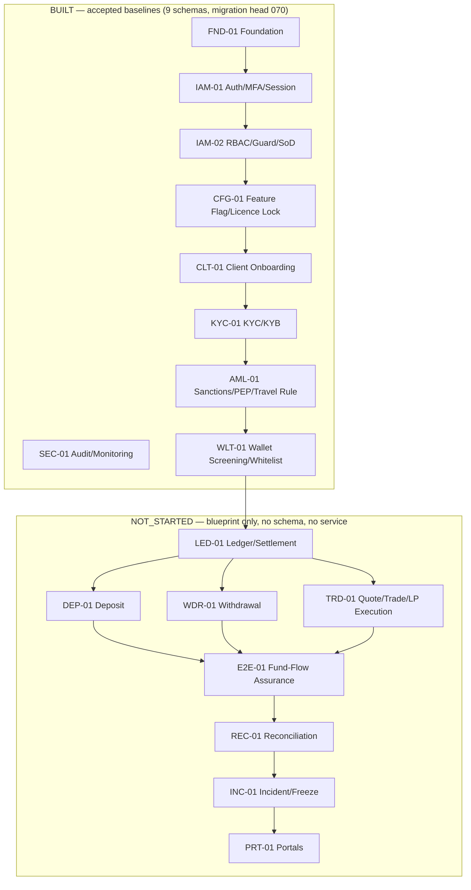
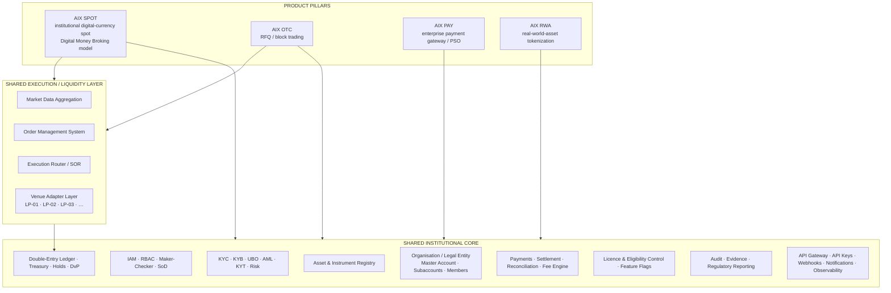
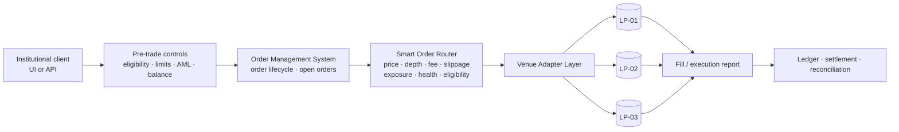
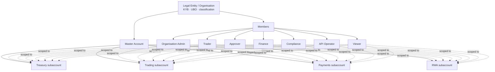
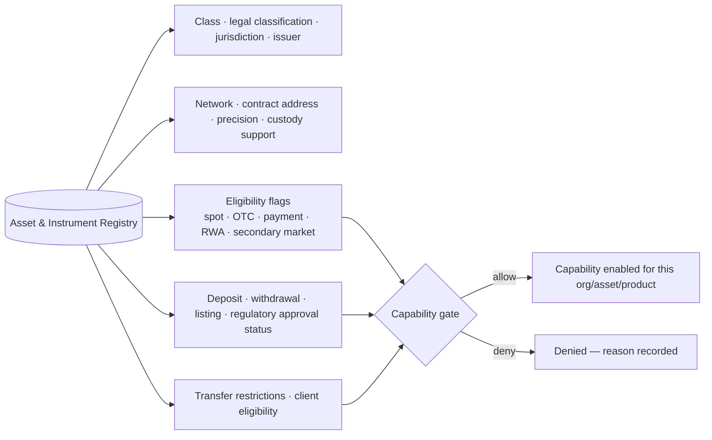
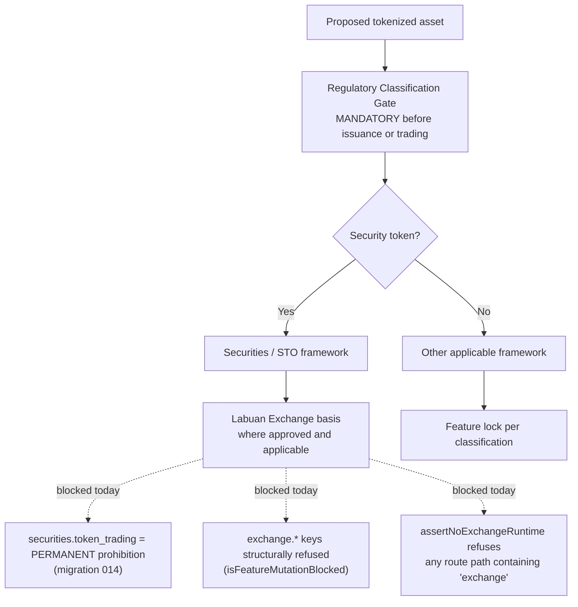
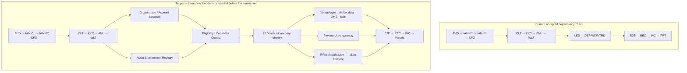
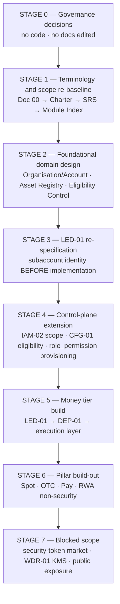

# AIX Institutional Platform Strategic Re-Baseline v0.1

**Status: DRAFT / ANALYSIS ONLY. This document changes nothing.** It supersedes no
master, closes no finding, approves no scope, and authorises no implementation. Every
authoritative record named in it — `01_masters/00`–`11`, the module blueprint packs,
[`DOCUMENT_REGISTER.md`](../DOCUMENT_REGISTER.md), [`OPEN_FINDINGS.md`](../OPEN_FINDINGS.md),
[`DECISION_LOG.md`](../DECISION_LOG.md) — remains exactly as authoritative after this
document as before it.

**Regulatory authority is unchanged.** `01_masters/00_Licence_Scope_And_Feature_Lock_v1.3.md`
remains the licence-scope control authority. Nothing below grants, implies or anticipates a
regulatory permission. Where the proposed product direction needs a permission the current
licence scope does not record, this document says so and stops, rather than resolving it.

---

## 1. Executive context

### 1.1 Why this document exists

A new product direction has been stated: AIX is to be repositioned as an **AIX Institutional
Digital Asset & Tokenized Securities Platform** with four pillars — **AIX Spot**, **AIX OTC**,
**AIX Pay**, **AIX RWA** — sharing one institutional platform core.

The repository currently encodes a different, narrower, fully-governed product: a Labuan
Money Broking + PSO platform whose product surface is OTC/RFQ plus a quote-and-confirm MB
Spot Broking Terminal. That model is not a draft; it is locked in twelve approved master
documents, seventeen module blueprint packs, a 30-code prohibited-feature registry seeded
into the database, and a boot-time guard compiled into all nine running services.

This document establishes, from repository evidence only, what exists, what the target
implies, and what stands between them. It is written so that a later controlled turn can act
on it without re-deriving the analysis.

### 1.2 The single most important finding

**The repository is roughly half-built, and the unbuilt half is exactly the half the new
direction changes most.**

Nine modules have accepted implementation baselines; **eight have none** — `LED-01`, `TRD-01`,
`DEP-01`, `WDR-01`, `REC-01`, `INC-01`, `PRT-01`, `E2E-01` are all `NOT_STARTED`
([`MODULE_STATUS.md`](../00_project_state/MODULE_STATUS.md);
[`DOCUMENT_REGISTER.md`](../DOCUMENT_REGISTER.md) §3). Verified directly against the schema:
the database has nine schemas (`foundation`, `iam`, `iam2`, `sec1`, `cfg1`, `clt1`, `aml1`,
`kyc1`, `wlt1`) at migration head `070`, and **contains no ledger, account, balance, order,
trade, quote, settlement, asset, instrument, fee, merchant or payment table of any kind.**

The consequence is favourable and time-limited. The control plane (identity, permissions,
audit, licence-lock, onboarding, KYC, AML, wallet screening) is built and reusable largely
as-is. The money and trading plane — where the four-pillar model demands an order management
system, a venue-neutral router, a subaccount-aware ledger, a merchant gateway and a token
lifecycle — is still on paper. Decisions taken **before** `LED-01` and `TRD-01` are
implemented are cheap; the same decisions taken after are migrations of live financial
records.

### 1.3 What is genuinely hard

Three things, in descending order of difficulty:

1. **Regulatory terminology.** The word *Exchange* is currently bound, across twelve masters
   and in compiled code, to "AIX operating a public order book / matching engine for digital
   currency — locked pending the Labuan Exchange application". The new direction rebinds
   *Labuan Exchange* to "securities / security-token market activity". These are different
   propositions about the same licence, and the repository cannot hold both silently.
2. **Order types.** The current scope locks resting limit orders, stop-limit, GTC, post-only,
   IOC and FOK as *Exchange order-book behaviour*
   (`00_...v1.3.md` §6, §11.2; `03_Master_Module_Index_v1.2.md` §17 `FUT-09`–`FUT-11`). AIX
   Spot as described requires limit orders and open orders. Whether a limit order **routed to
   an external approved venue** is exchange behaviour or money-broking order handling is a
   regulatory question this repository has never been asked, and which no model may answer.
3. **Security tokens.** `securities.token_trading` is seeded as a **permanent** prohibition
   (`platform/infra/migrations/014_cfg1_core.cjs`), and CFG-01 records that lifting a
   permanent lock requires a new licence-scope document revision, not merely the Exchange
   approval ceremony. AIX RWA's security-token path runs straight into it.

None of the three is an engineering problem. All three are governance decisions with an
engineering consequence.

---

## 2. Current-state architecture (what the repository actually is)

### 2.1 Identity of the current product

From [`CURRENT_STATE.md`](../00_project_state/CURRENT_STATE.md) §1 and
`01_masters/00_Licence_Scope_And_Feature_Lock_v1.3.md` §3: a Labuan FSA **Money Broking + PSO**
platform, Exchange application **pending**. Documentation in `docs/`, code in `platform/`.

Licence position as seeded into `cfg1.licence_profile` (migration `014`), which matches Doc 00
§3 exactly:

| Licence | Status | System treatment |
|---|---|---|
| Money Broking | Approved | Active build scope |
| Payment System Operator | Approved | Active build scope |
| Exchange application | Pending | Locked until approval |

### 2.2 Current architectural assumptions

Read from the masters and confirmed in code:

1. **Agency / back-to-back only.** AIX is never principal, market maker or proprietary trader
   (Doc 00 §4.1, §8.1). AIX inventory limit is zero.
2. **Quote-and-confirm, not order-driven.** The client receives a quote, confirms it, and AIX
   executes against an approved LP (Doc 00 §7.3). There is no resting order, no book, no
   time-in-force.
3. **Single-LP-shaped liquidity.** Doc 00 §7.5 records `primary_lp = Binance_or_approved_LP`.
   TRD-01's blueprint is materially better than this (§5.2 below), but the master is
   single-provider in its wording.
4. **Client-centric, not organisation-centric.** The unit of account is `client_id`. There is
   no master account, no subaccount, and no organisation-scoped role.
5. **Fail-closed everywhere.** Unknown feature → deny; LP outage → deny with no internal
   fallback; missing config → refuse to start.
6. **Four independent Exchange locks** (this is the strongest control in the platform):
   - the 30-row sealed `cfg1.prohibited_feature` registry, `SELECT`-only to the runtime role;
   - a change-request guard refusing any registry key **and any `exchange.`-prefixed key**, at
     request time and again at apply time (`services/cfg1/src/lib/decision.ts`,
     `isFeatureMutationBlocked`);
   - `assertNoExchangeRuntime`, run at boot by **all nine services**, which refuses to start
     if any registered route path matches one of 15 prohibited fragments — `exchange`,
     `order-book`/`orderbook`, `matching-engine`/`matching_engine`,
     `market-maker`/`market_maker`, `market-making`, `principal-dealing`/`principal_dealing`,
     `spread-markup`/`spread_markup`, `maker-taker`/`maker_taker`, `client-to-client`
     (`platform/packages/foundation/src/no-exchange.ts`);
   - a hash integrity seal verified before every feature decision.

### 2.3 What is built

| Layer | Modules | State |
|---|---|---|
| Foundation / control plane | `FND-01`, `IAM-01`, `IAM-02`, `SEC-01`, `CFG-01` | Accepted baselines |
| Client / compliance tier | `CLT-01`, `KYC-01`, `AML-01`, `WLT-01` | Accepted (WLT-01 partial) |
| Money tier | `LED-01`, `DEP-01`, `WDR-01`, `TRD-01` | **NOT_STARTED — no schema, no service** |
| Assurance / portal | `E2E-01`, `REC-01`, `INC-01`, `PRT-01` | **NOT_STARTED** |



### 2.4 Control-plane state that constrains everything downstream

These are facts, re-verified this turn, that any target architecture must design around:

- **No permission grant exists.** `iam2.role_permission` has **zero rows**; four provisional
  roles and 99 permissions are seeded, but `evaluatePermission` reaches `allow` only through
  a role grant. No identity currently holds an effective permission
  (`UI-04` §54; migrations `006`, `007`).
- **Approver authorization is not enforced** — `IAM2-FIND-002`, HIGH, OPEN.
- **No approval policy is seeded** — `IAM2-FIND-003`, MEDIUM, OPEN. Every approval takes the
  defaults: one approval, no step-up, 24-hour expiry.
- **No ordinary feature flag is defined.** `cfg1.feature` is empty by approved decision; only
  the 30 prohibitions and 3 licence profiles are seeded (`UI-04` §55).
- **Internet exposure is prohibited** pending `FND-FIND-001` (HIGH, OPEN) and the remaining
  `IMP-02` work (`DECISION_LOG.md` DEC-010).

### 2.5 Two module-numbering universes (pre-existing, not caused by this re-baseline)

`03_Master_Module_Index_v1.2.md` defines a **conceptual** module taxonomy in twelve groups —
`FND-01`…`FND-10`, `IAM-01`…`IAM-10`, `CLT`, `CMP`, `VND`, `PRD-01`…`PRD-15`, `AST-01`…`AST-10`,
`MON`, `RPT`, `PRT`, `OPS`, `FUT-01`…`FUT-12`. The repository implements a **different**,
seventeen-code taxonomy (`FND-01`, `IAM-01`, `IAM-02`, `SEC-01`, `CFG-01`, `CLT-01`, `AML-01`,
`KYC-01`, `WLT-01`, `LED-01`, `TRD-01`, `DEP-01`, `WDR-01`, `REC-01`, `INC-01`, `PRT-01`,
`E2E-01`).

The two do not reconcile: index `IAM-02` is *MFA*, implementation `IAM-02` is *RBAC / Permission
Guard / SoD*; index `FND-02` is *Feature Flags*, implementation `CFG-01` is. This ambiguity
exists today and is not introduced by the new direction — but the new direction adds many
modules, and adding them without resolving the collision would compound it. Recorded as
**DEC-REQ-11** (§13.2). **No renumbering is proposed or performed here.**

---

## 3. Target-state architecture

### 3.1 Four pillars over one core



### 3.2 AIX Spot — target operating model



The load-bearing property is that **AIX operates no matching engine and no book of its own**.
Client orders are managed by AIX and executed at approved external venues. This preserves the
agency model the current licence scope requires, while presenting an order-driven experience
rather than a quote-and-confirm one. Whether that presentation is permissible is
**DEC-REQ-R2** (§13.3) — it is not assumed here.

### 3.3 Institution-first account model (target)



### 3.4 Asset & Instrument Registry (target concept)

One registry, many instrument classes, with **eligibility as data rather than code**:



### 3.5 Licence and eligibility control (target)

The current control answers *is this feature prohibited?* The target control must answer a
multi-dimensional question:

```
capability_allowed = f(product, licence, asset, jurisdiction, client_class,
                       regulatory_approval, compliance_status, account_status,
                       trading_status, payment_status, rwa_classification)
```

CFG-01's decision engine is the right home for this, but its current input is a single
`feature_code` plus advisory context; `cfg1.feature` has **no** environment-scope,
client-class or dependency column — decision steps 4, 5 and 7 are documented "STRUCTURALLY
N/A" (`services/cfg1/src/lib/decision.ts`). The dimensions above are therefore an
**extension**, not a configuration exercise.

---

## 4. Regulatory terminology separation

**This section identifies conflicts. It fixes none.** No master document is edited by this
turn.

### 4.1 The core rebinding

| Term | Current repository meaning | Proposed meaning | Conflict |
|---|---|---|---|
| **Exchange** | AIX operating a public order book / matching engine for **digital currency**; locked pending the Labuan Exchange application | Reserved for **securities / security-token** market activity | **Direct.** 315 case-insensitive occurrences across the 12 masters carry the current meaning (`00`:73, `01`:34, `02`:19, `03`:38, `04`:18, `05`:18, `06`:20, `07`:16, `08`:14, `09`:22, `10`:24, `11`:19) |
| **AIX Exchange** | Prohibited label for the MB spot product (Doc 00 §11.1) | Must not describe BTC/USDT-style spot | **Consistent** — both forbid it |
| **Spot** | Quote-and-confirm MB Spot Broking Terminal | Order-driven institutional spot over external venues | **Partial** — same licence basis, different interaction model |
| **Securities token** | Permanently prohibited (Doc 00 §8.1 item 5; `AST-10`; seeded `securities.token_trading`) | A supported RWA outcome, where classified and approved | **Direct** |

### 4.2 Where crypto spot is treated as Exchange scope

Evidence, by document. Each is a place where order-driven spot mechanics are classified as
Exchange behaviour rather than money-broking order handling:

| Location | Statement | Conflicts with |
|---|---|---|
| `00_...v1.3.md` §6 | "Resting exchange limit orders — Locked"; "Stop-limit order book — Locked"; "Post-only orders"; "Good-till-cancelled exchange orders" | AIX Spot limit orders, open orders |
| `00_...v1.3.md` §7.2 | Terminal "must not … use GTC, post-only, stop-limit, or resting limit order behaviour in MVP"; must not "allow client to click LP depth level to execute directly" | AIX Spot order entry from depth |
| `00_...v1.3.md` §11.1 | Use "Instant Quote" **not** "Market Order"; "Open Requests" **not** "Open Orders"; "Quote Validity" **not** "Time in Force" | AIX Spot market orders, open orders, order history |
| `00_...v1.3.md` §11.2 | MVP-disabled UI concepts include stop-limit, post-only, GTC, FOK, IOC, public order book, click-to-trade depth ladder | AIX Spot order types |
| `00_...v1.3.md` §8.1 items 14, 17 | "AIX exchange order book before approval"; "Price Target Request as executable resting order" | Resting order concept generally |
| `03_Master_Module_Index_v1.2.md` §17 | `FUT-09` Resting Limit Orders, `FUT-10` Stop-Limit, `FUT-11` GTC/Post-Only/IOC/FOK — all classified **Exchange Scope** | Same |
| `03_Master_Module_Index_v1.2.md` §12 | `PRD-05` External LP Market Depth = "non-executable indicative"; `PRD-06` "Prevents continuous executable order-book behaviour" | AIX Spot aggregated depth presentation |
| `01_Project_Charter_v1.3.md` §10.2 | Out of scope: resting public exchange orders, click-to-trade depth ladder, maker/taker fee model | Same |
| `TRD-01` v1.2 `01_Module_Blueprint.md` FR-022 | "No Exchange Features" | Any order-driven extension of TRD-01 |

**Note on substance versus label.** The prohibition on an *AIX internal matching engine* and
on *client-to-client matching* is **not** in conflict with the new direction — the target
architecture routes to external venues and explicitly declines an internal matching engine.
The conflict is narrower and sharper: whether a **client limit order held by AIX and worked
against an external venue** is (a) a resting exchange order, or (b) money-broking order
handling. The repository currently assumes (a) without ever considering (b).

### 4.3 Where Labuan Exchange and securities-market terminology are conflated with money broking

The current documents use one "Exchange" concept for both the digital-currency order book and
the pending Labuan licence. They never separate securities-market activity as its own
category:

- `00_...v1.3.md` §2 lists the regulatory reference base with **no securities / digital
  securities / STO instrument**. The regulatory basis for a security-token market is absent,
  not merely locked.
- `00_...v1.3.md` §6 attributes every locked item to "Exchange approval pending" — so the same
  approval is implicitly assumed to unlock a crypto order book **and** anything securities-shaped.
- `03_Master_Module_Index_v1.2.md` §17 `FUT-12` is "Market Surveillance for **Public Exchange** —
  Required only if Exchange approved", framing surveillance as crypto-exchange infrastructure
  rather than securities-market infrastructure.
- `AST-10` "Securities Token Lock — Blocks securities token support unless approved" sits in the
  **asset configuration** group with no corresponding securities-market module anywhere in the index.

### 4.4 Old assumptions that conflict with the new product model

| Assumption | Where | Conflict |
|---|---|---|
| `primary_lp = Binance_or_approved_LP` | `00_...v1.3.md` §7.5 | Provider-neutral multi-LP requirement |
| Displayed depth is "indicative snapshot", `lp_depth_executable = false` | `00_...v1.3.md` §7.5 | Order-driven execution against aggregated depth |
| Client type = institutional + HNWI/professional only | `00_...v1.3.md` §10.2A; Charter §8 | Consistent — **retain** |
| Revenue = disclosed brokerage fee only; spread markup blocked | `00_...v1.3.md` §4.2 | Payment-gateway and RWA fee models need their own basis |
| `securities.token_trading` prohibition is **permanent** | migration `014`; CFG-01 notes | AIX RWA security-token path |
| PSO scope = 9 workflow items, no merchant concept | `00_...v1.3.md` §5.2 | AIX Pay merchant gateway |
| Self-custody prohibited; third-party custody required | `00_...v1.3.md` §8.2 | Constrains RWA token custody design |

### 4.5 The code-level terminology blocker

This is the one terminology conflict that is not a document edit. `assertNoExchangeRuntime`
refuses to boot **any** service registering a route path containing `exchange`. A future
securities-market service under a name like "AIX Labuan Exchange" therefore cannot register
`/exchange/...` routes without changing accepted `FND-01` foundation code and the nine
services' boot guard — a deliberate, load-bearing control that should be changed only by an
explicit governed decision, never incidentally. Recorded as **DEC-REQ-A7** (§13.2).

---

## 5. Liquidity and execution gap

### 5.1 What exists today

**In code: nothing.** `TRD-01` is `NOT_STARTED`; there is no `trd1` schema, no LP adapter, no
market-data component, no order table.

**In governance: considerably more than expected, and better than the masters.** `TRD-01`
v1.2's blueprint pack already specifies:

| Capability | Where | Fit for provider-neutral target |
|---|---|---|
| Instrument Registry | `TRD1-FR-001` | Seed of the Asset & Instrument Registry |
| **LP Registry** | `TRD1-FR-002` | Directly reusable |
| LP quote request / firmness | `FR-004`, `FR-024` | Reusable |
| **Multi-LP selection with recorded reason** | §5.23, `FR-034` | **Already provider-neutral** — captures eligible LP set, LP selected, and selection reason including price, depth, availability, coverage, latency, risk/compliance restriction |
| Prefunded hold before execution | §5.7, `FR-009` | Reusable for Spot and OTC |
| Slippage, partial fill, requote | §5.11, `FR-013`, `FR-026` | Reusable |
| Fill conservation invariant | §5.18, `FR-025` | Reusable |
| No internalisation / no netting | §5.21, `FR-031` | Consistent with target |
| LP outage fail-closed | §5.18, `FR-018` | Reusable |
| Execution-time licence revalidation | §5.22, `FR-033` | Reusable and important |
| Settlement handoff to `LED-01` | §5.13, `FR-016` | Reusable |
| Three-way reconciliation | §5.15, `FR-020` | Reusable |

**`TRD-01` §5.23 is the most valuable single asset for this re-baseline.** It already
describes multi-venue selection with recorded evidence — the contract a Smart Order Router
needs. The master document (Doc 00 §7.5) is single-LP in wording; the module blueprint is not.

### 5.2 What is missing

| Capability | Status | Note |
|---|---|---|
| Venue Adapter Layer (LP-01, LP-02, …) | **NEW** | `TRD-01` has an LP registry, not a pluggable adapter contract with health, capability and settlement metadata |
| Market Data Aggregation | **NEW** | Doc 00 §7.4 permits indicative LP depth display; no aggregation service, normalisation or consolidated book is specified anywhere |
| Order Management System | **NEW** | Nothing in the repository manages an order lifecycle. `TRD-01` manages a **quote** lifecycle |
| Smart Order Router | **EXTEND** of `TRD-01` §5.23 | Selection evidence exists; the routing decision function, venue scoring and split-fill policy do not |
| Venue health / API monitoring | **NEW** | `TRD-01` §5.4 requires "LP connectivity must be healthy" but defines no health model |
| Counterparty exposure limits | **PARTIAL** | Doc 00 §7.5 records `lp_counterparty_exposure_limit = to_be_defined` — named, never defined |
| Venue fee model | **NEW** | Fee engine is `PRD-01` in the index; no implementation module owns it |
| Pre-funded hold | **BLUEPRINT ONLY** | Specified in `TRD-01` §5.7 and `LED-01`; neither is built |
| DvP | **BLUEPRINT ONLY** | Charter §9.4 defines settlement sequencing / DvP rules; `LED-01` unbuilt |
| Settlement | **BLUEPRINT ONLY** | `LED-01` unbuilt |
| Reconciliation | **BLUEPRINT ONLY** | `REC-01` unbuilt; three-way reconciliation specified |
| Order book / depth presentation | **BLOCKED** | Currently permitted only as non-executable indicative depth (§4.2) |

### 5.3 Structural recommendation

Keep `TRD-01`'s execution-integrity work (fill conservation, no internalisation, execution-time
revalidation, hold atomicity, settlement truth) exactly as specified — it is licence-critical
and pillar-independent. Separate **order management** and **routing** from **quote handling**,
so that AIX Spot (order-driven) and AIX OTC (RFQ-driven) share one venue layer and one
execution-integrity core without one product's interaction model being imposed on the other.

---

## 6. Institutional account model gap

### 6.1 What is reusable — more than expected

`clt1.client_profile` is already a **legal-entity** record, not a person record:

```
client_id · application_id · applicant_type · legal_name · registration_number
country_of_incorporation · client_class · status · version
```

`clt1.authorised_user` is already an **organisation membership** record:

```
authorised_user_id · client_id · user_reference · role · status
approval_id · requested_by · version · iam_user_id   ← added by migration 067
```

Migration `067` added the optional `iam_user_id` binding with a partial unique index
guaranteeing **at most one active membership per `(iam_user_id, client_id)`**, and the
accepted architecture is explicit that authority exists only when a live authenticated IAM
session presents the same `user_id`. That is precisely the authenticated-principal →
organisation-membership seam the institution-first model needs, and it is already built and
accepted.

Also reusable: `clt1.client_mandate` (mandate rules, versioned, approval-bound),
`clt1.authorised_party` (UBO / controller / director with ownership percentage and screening
status), KYB and UBO collection in `KYC-01`, and the `CLIENT_OWNER` / `CLIENT_USER` /
`CLIENT_APPROVER` / `CLIENT_READONLY` role vocabulary in `04_Role_And_Permission_Matrix_v1.2.md` §5.1.

### 6.2 What is missing

| Concept | Status | Evidence |
|---|---|---|
| **Master account** | **NEW** | No account table exists in any schema |
| **Subaccounts** | **NEW** | Same; and `led1.ledger_account` (blueprint) keys on `client_id` + asset + rail, with **no subaccount dimension** |
| Subaccount-scoped permissions | **NEW** | `iam2.user_role` carries an optional `client_id`, but the assignment route never sets it and the permission check never reads it — **no scope is enforced today** |
| Client-side functional roles | **EXTEND** | Trader, Finance, Compliance, API Operator have no equivalent; only Owner / User / Approver / Read-only exist |
| Organisation ↔ IAM role bridge | **NEEDS DECISION** | Two role systems coexist: `clt1.authorised_user.role` (organisation membership) and `iam2.role` (platform RBAC). Neither references the other |
| API keys / programmatic identity | **NEW** | `iam.service_account` exists for **internal services**; there is no client-facing API credential model |
| Entity hierarchy (parent/subsidiary) | **NEEDS DECISION** | `clt1.related_party_edge` models related parties, not corporate group structure for accounts |

### 6.3 Are the current authority chains still valid?

Yes, and they should be preserved. The accepted chain is:

```
IAM-01 session → user_class ∈ {client, client_approver} → CLT-01 membership authority
   → X-AIX-Client-Id narrowing-only → FND-01 rate limit → idempotency → operation
```

The institution-first model **extends** this rather than replacing it: the same chain, with a
subaccount-scoped authority check appended after membership resolution. The critical
constraint is that `X-AIX-Client-Id` is **narrowing-only** — a subaccount selector must be
narrowing-only too, never a means of widening authority.

**One dependency must be stated plainly:** subaccount-scoped RBAC cannot be enforced until
`role_permission` grants exist at all. With zero grants seeded, adding scope to an
unenforced permission model changes nothing observable. `IAM2-FIND-002` is therefore on the
critical path for the institutional model, not merely for approvals.

---

## 7. RWA gap

`AIX RWA` is the largest greenfield area: **no issuer, asset-onboarding, classification,
token, holder, distribution or redemption concept exists anywhere in the repository** —
not in code, not in a blueprint pack, not in the module index.

### 7.1 Required new domains

| Domain | Depends on | Note |
|---|---|---|
| Issuer onboarding | `CLT-01`, `KYC-01` | An issuer is a legal entity with a different role — extend, don't duplicate |
| Issuer KYB / UBO / due diligence | `KYC-01`, `AML-01` | Largely reusable |
| Asset onboarding | Asset & Instrument Registry | New |
| **Regulatory Classification Gate** | CFG-01 eligibility control | **The mandatory control.** Must precede issuance and trading; must not default to "security token" |
| Asset verification / structuring | — | New; likely document- and evidence-heavy |
| Token configuration | Asset registry | New |
| Smart-contract orchestration | Custody, key management | New — **note `WDR-FIND-001`: KMS is already a platform blocker** |
| Offering / subscription | Ledger, payments | New |
| Allocation | Ledger | New |
| Issuance | Ledger, custody | New |
| Holder / investor registry | Organisation model | New — and a securities register is a regulated record in its own right |
| Servicing | — | New |
| Distributions / corporate actions | Ledger, payments | New |
| Transfers with restriction enforcement | Asset registry, compliance | New |
| Redemption | Ledger, settlement | New |
| **Security-token secondary market** | Labuan Exchange basis | **BLOCKED** — see §7.2 |
| Regulatory + holder reporting | `REC-01`, evidence | New |

### 7.2 The classification gate, and the blocker behind it



The gate itself is implementable within the existing control philosophy — it is a
classification decision with evidence, an approval, and a resulting eligibility state, which
is exactly what CFG-01 and IAM-02 already do together. **The securities path out of the gate
is not implementable under current governance**, for three independent reasons shown above.
Lifting any of them is a governance and regulatory act, not an engineering one.

**A non-security RWA token has no such blocker** and is the realistic first RWA increment,
provided the asset passes classification and the Asset & Instrument Registry can express its
eligibility.

---

## 8. Payments gap (PSO → AIX Pay)

### 8.1 Current PSO architecture

Doc 00 §5.2 defines the entire approved PSO scope as nine workflow items: deposit,
withdrawal, payment instruction, payment status tracking, settlement tracking, client money
ledger, payment reconciliation, payment reference tracking, payment reports. `DEP-01`,
`WDR-01`, `LED-01` and `REC-01` hold the blueprints; **none is built**. `WDR-01` is
additionally **blocked on KMS** (`WDR-FIND-001`).

The model is **client-instruction-shaped**: a known, onboarded client instructs a payment.

### 8.2 AIX Pay is merchant-acquiring-shaped

That is a different shape, and most of it has no counterpart in the repository:

| AIX Pay capability | Current counterpart | Classification |
|---|---|---|
| Merchant onboarding | `CLT-01` client onboarding | **EXTEND** — a merchant is a client with a different product profile |
| Merchant organisation accounts | — | **NEW** (§6.2) |
| Payment intents | — | **NEW** |
| Checkout / hosted payment page | — | **NEW** — first genuinely *public, unauthenticated* surface AIX would operate |
| API payments | — | **NEW** |
| Invoices, QR payments | — | **NEW** |
| Merchant API keys | `iam.service_account` (internal only) | **NEW** |
| Webhooks | — | **NEW** |
| Stablecoin / digital-asset payments | `WLT-01` screening + whitelist | **EXTEND** |
| Settlement | `LED-01` (unbuilt) | **DEFER then EXTEND** |
| Conversion where permitted | — | **NEEDS DECISION** — Charter §9.5 has an FX / conversion policy gate |
| Refunds | — | **NEW** — no reversal-of-payment concept exists (ledger reversal ≠ refund) |
| Merchant transaction history / reports | `REC-01` (unbuilt) | **DEFER** |
| Payout controls, whitelisted destinations | **`WLT-01` — built and accepted** | **KEEP** — directly reusable |
| Maker-checker | **`IAM-02` — built** | **KEEP** |
| Merchant teams / permissions | §6.2 | **NEW** |
| Configurable fee engine | `PRD-01` in index; no module | **NEW** |

### 8.3 The two structural consequences

1. **A checkout surface is a public, pre-authentication surface.** The platform's entire
   perimeter posture (`DEC-010`, `FND-FIND-001`, `IMP-02`) was designed for six authenticated
   `/wlt1/*` routes, and internet exposure is **prohibited** today. A merchant checkout is a
   materially larger public surface and would need its own perimeter analysis.
2. **The fee engine becomes cross-pillar.** Doc 00 §4.2 permits only a disclosed brokerage
   fee, and blocks spread markup. Payment-gateway fees and RWA fees are different revenue
   mechanics on a different licence basis, and the revenue model in the masters does not
   contemplate them.

---

## 9. KEEP / EXTEND / REFACTOR / DEFER / NEW matrix

Classification of every existing domain. "Built" means an accepted implementation baseline
exists; "blueprint" means a certified pack exists with no code.

### 9.1 Built modules

| Module | State | Class | Why |
|---|---|---|---|
| `FND-01` Platform Foundation | Built | **KEEP** | Envelope, context, idempotency, outbox, audit publisher, rate-limit engine are pillar-independent. The no-Exchange guard is affected only by a securities-market decision (§4.5) |
| `IAM-01` Auth / MFA / Session | Built | **KEEP** | Session, MFA, step-up and introspection are unchanged by the pillar model. Client-facing API keys are a **NEW** adjacent domain, not a change to IAM-01 |
| `IAM-02` RBAC / Guard / SoD | Built | **EXTEND** | Needs organisation and subaccount scope, plus client-side functional roles. Blocked in practice by `IAM2-FIND-002` / zero grants |
| `SEC-01` Audit / Monitoring | Built | **KEEP** | Evidence model is product-neutral. New event types are additive |
| `CFG-01` Feature Flag / Licence Lock | Built | **EXTEND** | Must grow from single-key prohibition checks to the multi-dimensional eligibility function in §3.5. The 30-code registry and seal stay |
| `CLT-01` Client Onboarding | Built | **EXTEND** | Legal-entity and membership records are the institution-first foundation. Needs master account, subaccounts, functional roles, merchant and issuer profiles |
| `KYC-01` KYC / KYB | Built | **EXTEND** | KYB and UBO reusable; issuer due diligence and RWA-specific evidence are additive |
| `AML-01` Sanctions / PEP / Travel Rule | Built | **EXTEND** | Screening reusable. **KYT (transaction monitoring) does not exist** — `UI-04` §51 records that AML-01's "monitoring" is periodic rescreening, not transaction monitoring |
| `WLT-01` Wallet Screening / Whitelist | Built (partial) | **KEEP + EXTEND** | Whitelisting and screening are directly reusable by Pay and RWA. Custody orchestration is a **NEW** adjacent domain |

### 9.2 Blueprint-only modules (no code — cheapest to change)

| Module | Class | Why |
|---|---|---|
| `LED-01` Ledger / Settlement | **REFACTOR (before build)** | Account identity must gain a subaccount dimension **before** the first journal is posted. Unbuilt, so this is a document change today and a financial-data migration later |
| `TRD-01` Quote / Trade / LP Execution | **REFACTOR + EXTEND** | Execution-integrity core is excellent and should be kept verbatim. Quote-only lifecycle must be separated from order management and routing. **Name becomes misleading** |
| `DEP-01` Deposit | **EXTEND** | Needs merchant inbound payment and RWA subscription inflow |
| `WDR-01` Withdrawal | **DEFER** | Blocked on KMS (`WDR-FIND-001`) regardless of this re-baseline |
| `REC-01` Reconciliation | **EXTEND** | Must reconcile multi-venue executions and merchant settlement, not just one LP |
| `INC-01` Incident / Freeze | **KEEP** | Freeze and recovery are product-neutral |
| `E2E-01` Fund-Flow Assurance | **EXTEND** | Must cover four pillars' flows, not one |
| `PRT-01` Portals | **REFACTOR** | UI Phases 2A–2T built 17 pages against the **current** product. A four-pillar institutional platform is a different information architecture |

### 9.3 Proposed new domains

Named descriptively; **no module codes are assigned** (see §10.3 and DEC-REQ-11).

| Proposed domain | Serves | Priority |
|---|---|---|
| Organisation / Account Structure (master account, subaccounts, members, scoped roles) | All four | **Highest — foundational** |
| Asset & Instrument Registry | All four | **Highest — foundational** |
| Eligibility / Capability Control (multi-dimensional gate) | All four | **Highest — extends CFG-01** |
| Venue / Liquidity Provider Management (adapter contract, health, capability) | Spot, OTC | High |
| Market Data Aggregation | Spot, OTC | High |
| Order Management System | Spot | High |
| Execution Router / SOR | Spot, OTC | High |
| Fee Engine | All four | High |
| Treasury | All four | Medium |
| Custody Orchestration | Spot, RWA, Pay | Medium |
| Counterparty Management | Spot, OTC, RWA | Medium |
| Merchant Gateway (intents, checkout, invoices, webhooks) | Pay | Per Pay sequencing |
| Client API Gateway / API Keys | All four | Per API sequencing |
| Issuer Management | RWA | Per RWA sequencing |
| Asset Onboarding & Structuring | RWA | Per RWA sequencing |
| **Regulatory Classification Gate** | RWA | **Mandatory before any RWA issuance** |
| Token Lifecycle & Smart-Contract Orchestration | RWA | Per RWA sequencing |
| Offering / Subscription / Allocation | RWA | Per RWA sequencing |
| Holder Registry | RWA | Per RWA sequencing |
| Servicing / Distributions / Corporate Actions | RWA | Per RWA sequencing |
| Redemption | RWA | Per RWA sequencing |
| Security-Token Secondary Market | RWA | **BLOCKED** (§7.2) |
| Notifications | All four | Medium — `FND-04` in index, no module |
| Client Reporting | All four | Medium |
| Regulatory Reporting | All four | Medium |

### 9.4 Items requiring a decision before classification

| Item | Why undecided |
|---|---|
| Limit / open-order semantics | Regulatory (§4.2) |
| Labuan Exchange scope definition | Regulatory (§4.3) |
| Security-token secondary market | Regulatory + permanent lock (§7.2) |
| Organisation role model vs IAM-02 role model | Architecture (§6.2) |
| Subaccount identity in the ledger | Architecture (§9.2, `LED-01`) |
| Module numbering reconciliation | Governance (§2.5) |
| Conversion / FX in AIX Pay | Regulatory (Charter §9.5) |
| Fee model beyond disclosed brokerage fee | Regulatory (§8.3) |
| Custody model for RWA tokens | Regulatory + KMS blocker |
| Public checkout perimeter | Security (§8.3) |

---

## 10. Module impact

### 10.1 Remain valid without change

`FND-01`, `IAM-01`, `SEC-01`, `INC-01`. Their subject matter is independent of the product
pillars.

### 10.2 Require scope extension

`IAM-02`, `CFG-01`, `CLT-01`, `KYC-01`, `AML-01`, `WLT-01`, `DEP-01`, `REC-01`, `E2E-01` —
each for the reasons in §9. None needs replacing.

### 10.3 Names that may become misleading

| Module | Current name | Issue |
|---|---|---|
| `TRD-01` | Quote / Trade / LP Execution | Would own order management and multi-venue routing — "Quote" understates and "LP" presumes a single provider class |
| `AML-01` | Sanctions / PEP / Adverse-Media / Travel Rule | Would also own KYT; the name lists the current four capabilities exhaustively |
| `WLT-01` | Wallet Screening / Payout-Destination Whitelist | Would also own custody orchestration |
| `CLT-01` | Client Onboarding / Client Profile | Would own organisation, master account, subaccounts, merchants and issuers |
| `CFG-01` | Feature Flag / Licence Lock | Would own multi-dimensional eligibility, which is more than a flag |
| `FUT-01`…`FUT-12` (index) | "Future-Locked **Exchange** Modules" | Grouping assumes one Exchange concept (§4.3) |

**No renaming and no renumbering is proposed here.** Renaming an accepted module is a
governance act with wide reference impact — twelve masters, seventeen packs, code namespaces,
schema names, service directories and the register all carry these codes.

### 10.4 Dependency changes

The current chain is linear (`IMP-01` §2). The target adds three foundational domains that
**precede** the money tier:



The inserted dependencies are the whole point: **Organisation/Account Structure, Asset &
Instrument Registry and Eligibility Control must land before `LED-01`**, because each changes
the identity of a ledger account or the gate in front of a posting.

---

## 11. Governance-document impact

Documents that will eventually need a controlled version update, with the reason and the
sequence. **None is edited by this turn.**

| Document | Change needed | Depends on |
|---|---|---|
| `00_Licence_Scope_And_Feature_Lock` v1.3 → v1.4 | Separate Labuan Exchange (securities) from digital-currency order-book locks; resolve order-type terminology (§6, §11.1, §11.2); make §7.5 provider-neutral; state the basis for Pay and RWA fee models; address `securities.token_trading` | **DEC-REQ-R1…R4 first** |
| `01_Project_Charter` v1.3 → v1.4 | Four-pillar vision, scope, out-of-scope list (§10.2), user groups | After Doc 00 |
| `02_SRS` v1.2 → v1.3 | Requirements for the four pillars and the shared core | After Charter |
| `03_Master_Module_Index` v1.2 → v1.3 | New module groups; resolve the two-taxonomy collision (§2.5); reclassify `FUT-09`–`FUT-11` if order types are re-decided | After SRS; **DEC-REQ-11** |
| `04_Role_And_Permission_Matrix` v1.2 → v1.3 | Organisation roles, subaccount scope, API-operator role, merchant and issuer roles | After module index |
| `05_Master_Workflow_Map` v1.2 → v1.3 | Spot order lifecycle, Pay merchant flows, RWA lifecycle | After SRS |
| `06_Master_System_Rules` v1.2 → v1.3 | Rules for order handling, classification gate, eligibility | After SRS |
| `07_Master_Data_Flow` v1.2 → v1.3 | Market data, venue connectivity, token lifecycle flows | After SRS |
| `08_Master_Technical_Architecture` v1.2 → v1.3 | OMS/SOR/venue-adapter topology, API gateway | After SRS |
| `09_Master_Security_Architecture` v1.2 → v1.3 | API keys, webhook signing, smart-contract key custody, public checkout perimeter | After SRS; interacts with `IMP-02` |
| `10_Master_Testing_Strategy` v1.2 → v1.3 | Venue simulation, order-lifecycle and token-lifecycle testing | After architecture |
| `11_Master_Deployment_Strategy` v1.2 → v1.3 | Venue connectivity, market-data feeds, public checkout | After architecture |
| `TRD-01` pack v1.2 → v2.0 | Separate order management and routing from quote handling | After Doc 00 order-type decision |
| `LED-01` pack v1.1 → v1.2 | Subaccount dimension in `ledger_account` | **Before `LED-01` implementation** |
| `CLT-01`, `IAM-02`, `CFG-01`, `KYC-01`, `AML-01`, `WLT-01`, `DEP-01`, `REC-01`, `E2E-01`, `PRT-01` packs | Scope extensions per §9 | Per module |
| `DECISION_LOG.md` | New `DEC-011`+ entries for each resolved decision in §13 | As decided |
| `DOCUMENT_REGISTER.md` | Register every new/updated document | Continuous |
| `IMP-01` | Revised build order per §12 | After module index |

**The `v1.2` REVIEW_REQUIRED backlog is a complication.** Eleven module packs
(`CLT-01`, `KYC-01`, `AML-01`, `WLT-01`, `LED-01`, `E2E-01`, `DEP-01`, `WDR-01`, `REC-01`,
`INC-01`, `PRT-01`) have an uncertified `v1.2` on disk while `v1.1` remains authoritative
(`DOCUMENT_REGISTER.md` §3). Re-baselining on top of an uncertified layer would compound the
ambiguity; adjudicating eleven packs first is a large turn in its own right. This tension
needs an explicit decision — **DEC-REQ-A8**.

---

## 12. Migration strategy

The ordering principle is: **decide what cannot be reversed cheaply first; build what is
already unblocked in parallel; touch accepted code last.**



### 12.1 Stage detail

| Stage | Contains | Precondition | Why here |
|---|---|---|---|
| **0** | Resolve §13.2 architecture decisions; obtain regulatory positions on §13.3 | This document reviewed | Every later stage depends on the terminology and order-type answers. **Nothing else should start** |
| **1** | Controlled updates to Doc 00 → Charter → SRS → Module Index, in dependency order (each is "base document" to the next) | Stage 0 | The masters are a chain; updating out of order creates contradictions |
| **2** | Blueprint packs for Organisation/Account Structure, Asset & Instrument Registry, Eligibility Control | Stage 1 | These three change the identity of accounts and the gate in front of every operation |
| **3** | `LED-01` pack revision for subaccount identity | Stage 2 | **The one genuinely time-critical item.** Free now; a financial-data migration after `LED-01` ships |
| **4** | `IAM-02` organisation/subaccount scope; `CFG-01` multi-dimensional eligibility; **`role_permission` provisioning** (`IAM2-FIND-002`) | Stage 2 | Scope is meaningless until grants exist. Also unblocks approvals platform-wide |
| **5** | `LED-01`, `DEP-01`, then venue layer / market data / OMS / SOR | Stages 3, 4 | Existing build order, with the execution layer replacing single-LP `TRD-01` |
| **6** | Pillar surfaces: Spot, OTC, Pay merchant gateway, RWA through classification for **non-security** assets | Stage 5 | Each pillar needs the ledger and eligibility control beneath it |
| **7** | Security-token secondary market; `WDR-01` (KMS); any internet-exposed surface | External unblocking | Blocked by governance, KMS and `FND-FIND-001` respectively |

### 12.2 What must not break

1. **Nine accepted module baselines** stay accepted. Extensions are additive phases with their
   own independent acceptance, exactly as `CLT-01` Phase 4A and `WLT-01` Phase 2C were.
2. **The four Exchange locks** stay intact until a governed decision changes them, and then
   only deliberately and one at a time.
3. **Migration head 070** continues forward-only. No migration is edited.
4. **`IMP-02` and `FND-FIND-001`** continue to govern exposure independently of this
   re-baseline.
5. **The UI's 17 pages** stay as they are until `PRT-01` is re-specified; they were built
   against the current product and are honest about it.

### 12.3 Work that is unblocked today

Available in parallel with Stage 0, because none depends on the unresolved decisions:
`role_permission` provisioning (`IAM2-FIND-002`), approval-policy seeding (`IAM2-FIND-003`),
`IMP-02` Turn M-B, and the Asset & Instrument Registry **design** (its structure is
product-neutral even though its eligibility flags are not).

---

## 13. Decisions

### 13.1 Determined by the new product direction (not open)

1. AIX is repositioned as an institutional digital asset and tokenized securities platform.
2. Four pillars: Spot, OTC, Pay, RWA, over **one** shared core.
3. AIX Spot is **Digital Money Broking**, not Labuan Exchange.
4. **No** internal matching engine as the default for AIX Spot.
5. Liquidity is external and **provider-neutral** (LP-01, LP-02, LP-03, …); no single provider
   is hard-coded.
6. Architecture is **institution-first**: Legal Entity → Master Account → Subaccounts →
   Members → Roles → Permissions.
7. Every tokenized asset passes a **Regulatory Classification Gate** before issuance or
   trading; an RWA token is **not** automatically a security token.
8. "Labuan Exchange" is reserved for securities-market activity.
9. Prohibitions retained: no proprietary market making, no principal dealing without an
   express approved basis, no derivatives, no margin, no futures, no staking, no
   lending/yield.
10. AIX OTC reuses the existing controls (DvP, pre-funded hold, limits, maker-checker,
    settlement, ledger, audit, reconciliation, counterparty controls).
11. The four external product references are **commercial inspiration only, never regulatory
    authority** (§15).

### 13.2 Unresolved architecture decisions

| ID | Decision | Note |
|---|---|---|
| **DEC-REQ-A1** | Organisation role model vs `iam2` role model — bridge, merge, or keep separate with a mapping? | Two role systems exist today with no reference between them |
| **DEC-REQ-A2** | Subaccount identity in the ledger — dimension on `ledger_account`, or an account hierarchy? | **Time-critical: before `LED-01` is built** |
| **DEC-REQ-A3** | Does the Asset & Instrument Registry become a new module, or extend `CFG-01`? | `TRD1-FR-001` and index `AST-01`/`AST-02` both claim parts of it |
| **DEC-REQ-A4** | Does the OMS/SOR extend `TRD-01` or become new modules? | Affects whether `TRD-01`'s acceptance is reopened |
| **DEC-REQ-A5** | Client API credential model — extend `iam.service_account`, or a new client-facing key domain? | Security-sensitive; `service_account` is internal-only today |
| **DEC-REQ-A6** | Does AIX Pay's checkout live inside the platform perimeter or a separate edge? | Interacts with `DEC-010` and `FND-FIND-001` |
| **DEC-REQ-A7** | Whether, and how, `assertNoExchangeRuntime` changes for a securities-market service | Load-bearing control in nine services (§4.5) |
| **DEC-REQ-A8** | Adjudicate the eleven `REVIEW_REQUIRED` `v1.2` packs before or during the re-baseline? | §11 |
| **DEC-REQ-A9** | Custody orchestration — extend `WLT-01` or a new domain? | Affects Spot, Pay and RWA |
| **DEC-REQ-A10** | Does KYT extend `AML-01` or become a new domain? | AML-01's "monitoring" is rescreening, not transaction monitoring |
| **DEC-REQ-11** | Reconcile the two module-numbering universes (§2.5) | Pre-existing; adding modules compounds it |

### 13.3 Unresolved regulatory decisions — require LFSA / legal confirmation

**No model, and no implementation turn, may resolve any of these.**

| ID | Question | Blocks |
|---|---|---|
| **DEC-REQ-R1** | Is a client **limit order** held by AIX and worked against an external approved venue permissible under Digital Money Broking — or is it a resting exchange order? | AIX Spot order types; Doc 00 §6, §11.1, §11.2; `FUT-09`–`FUT-11` |
| **DEC-REQ-R2** | May AIX present **aggregated executable depth** and accept orders against it, given Doc 00 §7.2's non-clickable, non-executable indicative-depth rule? | AIX Spot market view |
| **DEC-REQ-R3** | What exactly does the Labuan Exchange licence cover — securities/security tokens only, or also digital-currency order-book activity? | The entire terminology separation (§4) |
| **DEC-REQ-R4** | On what basis may `securities.token_trading` — a **permanent** prohibition — be lifted, and does the Exchange approval suffice or is a licence-scope revision required? | AIX RWA security-token path |
| **DEC-REQ-R5** | Does the PSO licence cover merchant acquiring, checkout, invoicing and refunds, or only the nine workflow items in Doc 00 §5.2? | AIX Pay |
| **DEC-REQ-R6** | What fee models are permitted for Pay and RWA, given the disclosed-brokerage-fee-only revenue model? | Fee engine |
| **DEC-REQ-R7** | What is the regulatory basis for issuing and servicing tokenized real-world assets from Labuan? | AIX RWA generally |
| **DEC-REQ-R8** | Does conversion/FX inside AIX Pay fall within the PSO licence? | Charter §9.5 |
| **DEC-REQ-R9** | Custody basis for RWA tokens, given self-custody is prohibited and third-party custody required | RWA token lifecycle |
| **DEC-REQ-R10** | Are institutional clients' own **subaccounts** subject to distinct KYC, reporting or safeguarding treatment? | Institution-first model |
| **DEC-REQ-R11** | Does an RWA holder registry constitute a regulated securities register, and who is its legal keeper? | Holder registry |
| **DEC-REQ-R12** | Does market-data redistribution for aggregated multi-venue depth need licensing beyond Doc 00 §7.5's existing requirement? | Market data aggregation |

---

## 14. Risks

| # | Risk | Impact | Mitigation |
|---|---|---|---|
| R1 | Terminology re-baselined in documents but not in the seeded registry, the CFG-01 guard and `assertNoExchangeRuntime` | Documents and enforcement disagree — the worst outcome for a regulated platform | Treat §4.5 as part of any terminology change, never a follow-up |
| R2 | `LED-01` built before the subaccount decision | Account-identity migration over live financial records | **DEC-REQ-A2 before Stage 5** |
| R3 | Implementation starts before the §13.3 regulatory answers | Rework, or worse, a built capability outside licence scope | Stage 0 gate |
| R4 | Nine accepted baselines reopened rather than extended | Loss of accepted evidence; large re-acceptance cost | Additive phases with independent acceptance (§12.2) |
| R5 | Four-pillar scope pursued at once | Nothing finishes; the control plane's quality regresses | Sequence per §12; one pillar at a time after the core |
| R6 | Re-baselining on eleven uncertified `v1.2` packs | Compounded version ambiguity | **DEC-REQ-A8** |
| R7 | RWA treated as one module | Under-scoped; the lifecycle spans a dozen domains | §9.3 keeps them separate |
| R8 | Kraken-inspired feature parity drives scope | Features adopted without a licence basis | §13.1 item 11; references are commercial only |
| R9 | Institutional model added without `role_permission` grants | Scope that enforces nothing | Stage 4 pairs scope with `IAM2-FIND-002` |
| R10 | Public checkout exposed before `FND-FIND-001` closes | Exposure prohibition breached | `DEC-REQ-A6`; `IMP-02` governs |
| R11 | Module renaming cascades through 12 masters, 17 packs, code and schema names | Wide, error-prone change | §10.3 defers renaming to an explicit decision |
| R12 | `securities.token_trading` lifted incidentally rather than deliberately | A permanent, governed prohibition weakened without a record | `DEC-REQ-R4`; four independent locks make accidental lifting unlikely |

---

## 15. External product references

Recorded as required. Internet access was not used for this analysis; these are
**product/commercial/infrastructure inspiration only and carry no regulatory authority**.
Nothing in this document derives a permission from them.

1. `https://cryptiecraft.com/kraken-clone-script/`
2. `https://cryptiecraft.com/spot-trading-crypto-exchange-development/`
3. `https://cryptiecraft.com/crypto-payment-gateway-revenue-models/`
4. `https://cryptiecraft.com/rwa-tokenization-platform-revenue-models/`

`01_masters/00_Licence_Scope_And_Feature_Lock_v1.3.md` remains the regulatory control
authority.

---

## 16. Recommended next action

**One action, then stop.**

> **Convene a governance session on §13.3 (DEC-REQ-R1 … R12), starting with DEC-REQ-R1,
> DEC-REQ-R3 and DEC-REQ-R4.**

Those three determine the meaning of *Exchange*, the permissibility of order-driven spot, and
whether the RWA securities path exists at all. Every document update in §11, and every stage
from §12.1 onward, is shaped by their answers. Updating Doc 00 before them would encode a
guess into the platform's regulatory control authority.

**Two things should proceed in parallel, because they depend on none of the above:**

1. **`DEC-REQ-A2` — the `LED-01` subaccount decision.** Free today, expensive after `LED-01`
   ships. It is the only item in this document with a closing window.
2. **`IAM2-FIND-002` remediation — `role_permission` provisioning.** Already an open HIGH
   finding, already on the critical path for approvals, and a hard prerequisite for
   organisation-scoped permissions.

**Not recommended yet:** any master-document edit, any module renaming or renumbering, any
new blueprint pack, and any code change. This document is the input to those turns, not a
licence to begin them.

---

## 17. Document control

| Item | Detail |
|---|---|
| Document ID | `STR-01` |
| Version | v0.1 |
| Status | **DRAFT — analysis only; supersedes nothing, approves nothing** |
| Baseline commit | `48b9478` |
| Repository state at analysis | 9 schemas, migration head `070`, 9 accepted module baselines, 8 `NOT_STARTED` modules, 17 UI pages |
| Method | Repository inspection only; no internet access; no code, migration, test or infrastructure change |
| Authority | None. `01_masters/00`–`11` remain the authoritative masters; `DOCUMENT_REGISTER.md`, `OPEN_FINDINGS.md` and `DECISION_LOG.md` remain their respective authorities |
| Findings | **None created.** This document registers no finding and closes none |
| Next review | After the §13.3 governance session |
