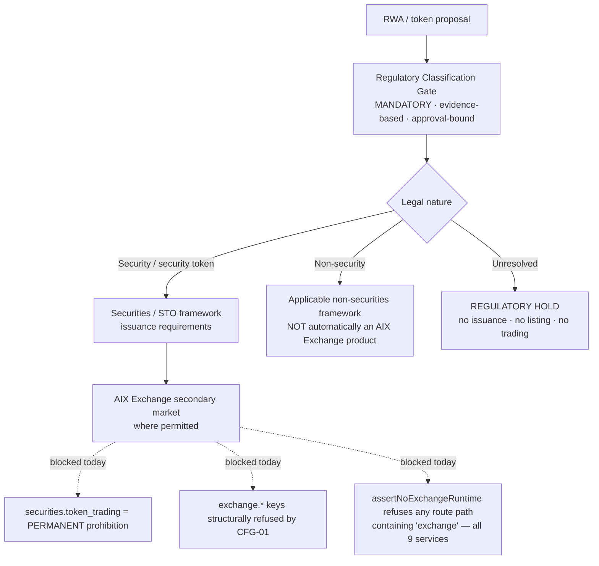

# AIX Re-Baseline Governance Decision Pack v0.1

**Status: DRAFT / PROPOSED DECISIONS ONLY. Nothing here is approved.** This pack prepares four
decisions for governance approval. It approves no scope, changes no master, resolves no
regulatory question, creates and closes no finding, and authorises no implementation.
`01_masters/00_Licence_Scope_And_Feature_Lock_v1.3.md` remains the licence-scope control
authority.

**Relationship to [`STR-01`](AIX_Institutional_Platform_Strategic_Re-Baseline_v0.1.md):** STR-01
is the analysis; this pack is the decision instrument for the four items STR-01 identified as
blocking the master re-baseline. Evidence established in STR-01 is cross-referenced, not
repeated.

**Graduation path:** an approved decision here becomes a `DEC-011`+ entry in
[`DECISION_LOG.md`](../DECISION_LOG.md), which by its own terms holds *"already-established
governance decisions"* only. Nothing in this pack belongs there until approved.

---

## 0. How to read this pack

Four claim types are tagged throughout and must not be conflated:

| Tag | Meaning | Verifiable by |
|---|---|---|
| **[REPO FACT]** | Verified in this repository at the stated commit | Re-running the cited check |
| **[REG FACT]** | Regulatory statement established by an approved AIX document **or by a cited LFSA source in §0.2** | The cited paragraph |
| **[OWNER-ASSERTED]** | Regulatory/product statement supplied in a commissioning instruction and **not established by any cited source** | Product owner / legal |
| **[ARCH REC]** | Architecture recommendation by this analysis — carries no authority | Governance approval |
| **[REG QUESTION]** | Open question requiring LFSA / legal confirmation | External confirmation |

**An [ARCH REC] is never evidence for a [REG FACT].** Where the recommended architecture
depends on an unconfirmed regulatory position, the decision status is
`BLOCKED_PENDING_REGULATORY_CONFIRMATION` regardless of how well-supported the architecture is.

**A [REG FACT] establishes only what its cited paragraph says.** Where a provision is
consistent with a proposition but does not establish it, the proposition stays open. This
distinction is applied explicitly throughout §2.

### 0.2 Regulatory evidence register

Sources cited in this pack. Added at `284e2e7`+ in response to the `STR-02` §7 step 1 action
("attach the DMB-guideline extract"), which is hereby discharged. Provisions are paraphrased
concisely; no substantial regulatory text is reproduced.

> **VERIFICATION STATUS — INDEPENDENTLY VERIFIED.** The product owner has verified the
> provisions below directly against the published Labuan FSA documents. They may be treated as
> **externally verified governance evidence**. This supersedes the earlier caveat in this pack's
> first revision, which recorded the paraphrases as owner-supplied and unverified against the
> source PDFs. One element is excepted and flagged in the table (post-trade information under
> LFSA-DMB-2025 ¶5.9).

| Ref | Source | Date / effect | URL |
|---|---|---|---|
| **LFSA-DMB-2025** | Guidelines on the Management of Digital Money Broking Platform (Final) | Effective **1 January 2027** | [labuanfsa.gov.my …Guidelines-on-the-Management-of-Digital-Money-Broking-Platform_Final.pdf](https://www.labuanfsa.gov.my/clients/asset_120A5FB8-61B6-45E8-93F0-3F79F86455C8/contentms/img/documents/Legislation_and_Guidelines/Guidelines/Other_businesses/2025/Guidelines-on-the-Management-of-Digital-Money-Broking-Platform_Final.pdf) |
| **LFSA-MB-2024** | Guidelines on the Establishment of Money Broking Business in Labuan IBFC | **9 September 2024** | [labuanfsa.gov.my …Guidelines-on-the-Establishment-of-Money-Broking-Business-in-Labuan-IBFC_09092024.pdf](https://www.labuanfsa.gov.my/clients/asset_120A5FB8-61B6-45E8-93F0-3F79F86455C8/contentms/img/documents/Legislation_and_Guidelines/Guidelines/Other_businesses/2024/Guidelines-on-the-Establishment-of-Money-Broking-Business-in-Labuan-IBFC_09092024.pdf) |
| **LFSA-EXCH-WEB** | Labuan FSA — Exchange (business-area description) | Undated web page | [labuanfsa.gov.my/areas-of-business/financial-services/exchange](https://www.labuanfsa.gov.my/areas-of-business/financial-services/exchange) |

**Provisions relied on:**

| Ref | ¶ | Establishes (paraphrase) |
|---|---|---|
| LFSA-DMB-2025 | **2.1** | Applies to Labuan money brokers running technology-enabled digital money broking platforms that facilitate trading/exchanging of digital currencies **on behalf of clients** |
| LFSA-DMB-2025 | **5.2** | A trade may be executed for a client **only when sufficient funds are available** in the client's platform account |
| LFSA-DMB-2025 | **5.5** | Order handling: record particulars of client order instructions; take reasonable steps to execute promptly; do not improperly withdraw, delay or withhold client orders; execute on **best available terms** |
| LFSA-DMB-2025 | **5.9** | Pre-trade information includes current bid/offer prices, available volume and **depth of trading interest**. *(A post-trade element — price, trade time, volume — was stated in the original commissioning instruction but was **not re-listed in the independent verification**; it is therefore retained below the verified line and marked ‡ wherever relied on.)* |
| LFSA-DMB-2025 | **5.12** | Detailed **order and trade records** must be retained for at least **six years** |
| LFSA-DMB-2025 | **6.4(i)** | Controls include price/quantity thresholds, **suspicious-order blocking** and **cancellation of unexecuted orders** |
| LFSA-DMB-2025 | **6.4(ii)** | **Automated pre-trade controls** must apply before execution |
| LFSA-MB-2024 | **1.1** | Money broking is **intermediary activity** and excludes acting as principal, liquidity provider or market maker |
| LFSA-MB-2024 | **fn 1 to 1.2** | Digital assets permitted to be traded under the Money Broking framework **must not have the features of securities as defined under section 2 LFSSA** |
| LFSA-MB-2024 | **7.5** | Counterparties expressly include **liquidity providers**; applicable counterparties must be appropriately regulated / of good track record, undergo due diligence, and **changes require notification to Labuan FSA within seven days prior to commencement** of the new arrangement |
| LFSA-MB-2024 | **9.2** | Expressly refers to risk-mitigating measures **such as stop loss orders**. **This does not by itself approve any particular exchange-style stop-order implementation** (§2.8, R3-Q3) |
| LFSA-MB-2024 | **9.3** | Due diligence must cover clients, principal broker / liquidity provider and trading-platform providers, **proportionate to exposure** |
| LFSA-MB-2024 | **9.5** | Must make clear **the capacity in which it acts** and disclose relevant conflicts involving service providers / liquidity providers |
| LFSA-MB-2024 | **9.7(i)** | Must disclose how execution services are performed, including **order-routing procedures**, **fair application of routing**, **third-party arrangements for routing client orders**, and **payment-for-order-flow / inducement arrangements** |
| LFSA-EXCH-WEB | — | Labuan Exchanges are described as venues for **listing/trading financial instruments** including equities, investment funds, debt instruments, **digital securities and security tokens** |

**Three limits on this evidence, applied throughout:**

1. **TEMPORAL RULE — LFSA-DMB-2025 is effective 1 January 2027.** It may be used as the
   **target operating requirement** for a platform intended to operate from that date.
   **No AIX document may describe it as already effective before 1 January 2027**, and any
   build decision relying on it must state that timing.
2. **LFSA-EXCH-WEB is a generic business-area description.** It establishes what Labuan
   Exchanges are *in general*. It does **not** establish the scope of AIX's own Exchange
   approval, and is not used for that purpose anywhere in this pack.
3. **A provision establishes only what it says.** LFSA-MB-2024 ¶9.2's reference to stop loss
   orders as a risk-mitigation concept is the clearest example: it does not approve a stop-order
   product, a stop-order implementation, or any exchange-style conditional-order mechanism.

### 0.3 Decision status summary

| ID | Decision | Status |
|---|---|---|
| **DEC-REQ-R1** | Regulatory/product meaning of "Exchange" | **Platform terminology *direction* APPROVED — [`DEC-012`](../DECISION_LOG.md) clause 5.** The **scope of AIX's own Exchange approval remains `BLOCKED_PENDING_REGULATORY_CONFIRMATION`** (R1-Q1b) and is expressly not approved |
| **DEC-REQ-R3 — Model A** | External-venue routing | **`ACCEPTED` — [`DEC-012`](../DECISION_LOG.md) clause 1.** Target initial architecture for AIX Spot |
| **DEC-REQ-R3 — Model B** | Multi-LP / smart order routing | **`ACCEPTED_TECHNICAL_CAPABILITY` / `PRODUCTION_GATED` — [`DEC-012`](../DECISION_LOG.md) clause 2** |
| **DEC-REQ-R3 — Model C** | Internal client-to-client matching | **`BLOCKED` / `OUT_OF_SCOPE` — [`DEC-012`](../DECISION_LOG.md) clause 3.** No architecture approval granted |
| **DEC-REQ-R4** | RWA / securities regulatory architecture | `BLOCKED_PENDING_REGULATORY_CONFIRMATION` (securities route). **Asset-eligibility gate placement APPROVED — [`DEC-012`](../DECISION_LOG.md) clause 6**; classification-gate architecture otherwise `READY_FOR_GOVERNANCE_APPROVAL` |
| **DEC-REQ-A2** | Organisation / account / subaccount hierarchy | **`APPROVED` — [`DEC-011`](../DECISION_LOG.md)** |
| **DEC-REQ-A7** | `assertNoExchangeRuntime` evolution | `PROPOSED` — deliberately deferred behind R1/R4; **current lock remains active and unmodified** |

---

## 1. DEC-REQ-R1 — Regulatory / product meaning of "Exchange"

### 1.1 Decision statement

Adopt a two-term separation in all AIX governance and product language:

- **AIX Spot** and **AIX OTC** are **Digital Money Broking** products — digital-currency spot
  and RFQ/block execution, agency/intermediary, executed at approved external venues.
- **AIX Exchange** denotes **Labuan securities-market capability only** — securities, digital
  securities and security tokens where applicable. It is *never* the name for BTC/USDT-style
  spot.

### 1.2 Why the decision exists

The repository currently uses one word for two different regulatory propositions. Until they
are separated, every downstream document inherits the ambiguity, and the RWA pillar has no
vocabulary to describe a securities venue at all.

### 1.3 Current repository assumption

**[REPO FACT]** "Exchange" means: AIX operating a public order book / matching engine for
**digital currency**, locked pending the Labuan Exchange application
(`00_...v1.3.md` §6; §3 licence table).

### 1.4 New target assumption

**[REG FACT — LFSA-EXCH-WEB]** Labuan FSA describes Labuan Exchanges as platforms for listing
and trading **financial instruments** — equities, investment funds, debt instruments, other
financial instruments, **digital securities and security tokens**. The generic Labuan Exchange
concept is therefore securities / financial-instrument oriented.

**[REG FACT — LFSA-DMB-2025 ¶2.1]** A Labuan money broker may operate a technology-enabled
digital money broking platform facilitating trading/exchanging of **digital currencies** on
behalf of clients. Digital-currency platform activity is therefore situated in the money
broking framework, not in the Exchange framework.

**[REG FACT — LFSA-MB-2024 fn to ¶1.2]** Digital assets traded under the money broking
framework **must not have the features of securities under LFSSA** — a clean regulatory seam
between the two frameworks at the level of the *instrument*.

**Together these support the proposed separation** (digital currency → Digital Money Broking;
securities / digital securities / security tokens → Exchange). **They do not establish the
scope of AIX's own pending Exchange application** — see R1-Q1.

### 1.5 Evidence — semantic classification of all 315 occurrences

**[REPO FACT]** Every occurrence of "exchange" (case-insensitive) in the twelve masters was
extracted with ±95 characters of context and classified. Method and per-document counts are
reproducible; totals:

| Class | Meaning | Count | Treatment |
|---|---|---|---|
| **A** | Correct Labuan **securities**-Exchange reference | **0** | — |
| **B** | Governance reference to the **existing** Exchange approval / lock | **155** | **Retain**; qualify where ambiguous |
| **C** | **Crypto-spot** mechanics or naming described as Exchange | **115** | **Conflicts** with target terminology |
| **D** | Feature-lock name / configuration identifier | **45** | **Freeze**; rename only under a controlled migration |
| **E** | Generic English use | **0** | — |
| | **Total** | **315** | |

Per document:

| Document | A | B | C | D | E |
|---|---:|---:|---:|---:|---:|
| `00_Licence_Scope_And_Feature_Lock_v1.3` | 0 | 19 | **47** | 7 | 0 |
| `01_Project_Charter_v1.3` | 0 | 20 | 14 | 0 | 0 |
| `02_Software_Requirement_Specification_v1.2` | 0 | 10 | 9 | 0 | 0 |
| `03_Master_Module_Index_v1.2` | 0 | 10 | 4 | **24** | 0 |
| `04_Role_And_Permission_Matrix_v1.2` | 0 | 13 | 4 | 1 | 0 |
| `05_Master_Workflow_Map_v1.2` | 0 | 12 | 5 | 1 | 0 |
| `06_Master_System_Rules_v1.2` | 0 | 8 | 8 | 4 | 0 |
| `07_Master_Data_Flow_v1.2` | 0 | 9 | 6 | 1 | 0 |
| `08_Master_Technical_Architecture_v1.2` | 0 | 8 | 5 | 1 | 0 |
| `09_Master_Security_Architecture_v1.2` | 0 | 17 | 3 | 2 | 0 |
| `10_Master_Testing_Strategy_v1.2` | 0 | 15 | 7 | 2 | 0 |
| `11_Master_Deployment_Strategy_v1.2` | 0 | 14 | 3 | 2 | 0 |

**Three findings follow, and they change the shape of the problem:**

1. **Category A is zero.** There is **no** correct securities-Exchange usage anywhere in the
   masters. The securities meaning does not exist in this repository — introducing it creates a
   genuinely new term rather than disambiguating an existing one.
   *(A first pass wrongly scored 7 here by matching "security" in the information-security
   sense — "Exchange-Lock Security", "Future-Locked Exchange Security Exclusion". Corrected: all
   seven are class B.)*
2. **Category E is zero.** No occurrence is incidental English. Every one of the 315 is
   regulatory or product language, so none can simply be left alone as harmless.
3. **The conflict is concentrated.** 47 of the 115 class-C occurrences (41%) are in Doc 00
   alone, and 24 of the 45 class-D identifiers are in the Module Index (`FUT-01`…`FUT-12` and
   the `12_future_locked_exchange/` folder). Two documents carry most of the work.

### 1.6 Regulatory facts already established

- **[REG FACT]** Money Broking approved; PSO approved; Exchange application **pending**
  (Doc 00 §3).
- **[REG FACT]** AIX must not operate a public order book or matching engine, act as principal,
  market maker or proprietary trader (Doc 00 §4.1, §6, §8.1).
- **[REG FACT]** Securities token trading is prohibited unless separately approved
  (Doc 00 §8.1 item 5).
- **[REG FACT]** Doc 00 §2 lists *Guidelines on the Management of Digital Money Broking
  Platform* in the regulatory reference base — **the guideline's existence is a repository
  fact; its contents are not reproduced in this repository.**

### 1.7 What remains unconfirmed

| ID | Question | State |
|---|---|---|
| **R1-Q1a** | What is the generic meaning of "Labuan Exchange"? | **CLOSED_BY_REGULATORY_EVIDENCE** — LFSA-EXCH-WEB: listing/trading of financial instruments including digital securities and security tokens |
| **R1-Q1b** | What does **AIX's own pending Exchange application** cover — securities, digital-currency order-book activity, or both? | **OPEN.** LFSA-EXCH-WEB is a generic business-area description and is deliberately **not** used to infer AIX's application scope |
| **R1-Q2** | If AIX Spot is Digital Money Broking, does AIX's Exchange lock still constrain it at all — or only the securities venue? | **OPEN** — an AIX-internal interpretation question that Doc 00's own revision must settle, informed by R1-Q1b |
| **R1-Q3** | May the product name "AIX Exchange" be used for a securities venue before that licence is granted? | **OPEN** |
| **R1-Q4** | Does renaming feature-lock identifiers (class D) require regulator notification, given they are cited as licence-lock evidence? | **OPEN** |

### 1.8 Architecture alternatives

| # | Alternative | Consequence |
|---|---|---|
| **1** | **Qualified-term migration** — introduce `AIX Exchange (Securities)` and `Digital Money Broking Spot`; leave bare "Exchange" only in class-B governance text, qualified on first use per document | Lowest risk; no identifier churn; ambiguity persists in prose until each master is revised |
| **2** | **Full terminology migration** — rewrite all 115 class-C occurrences and rename class-D identifiers | Cleanest end state; touches the seeded 30-code registry, `cfg1` config keys, the `FUT` taxonomy and licence-lock evidence; high regression risk |
| **3** | **Namespace split** — retain "Exchange" for the existing crypto lock and coin a distinct term (e.g. "Securities Venue") for the new capability | Avoids all churn and all collision; **contradicts the owner-asserted direction** that "Labuan Exchange" *is* the securities term |
| **4** | Defer entirely | Cheapest now; every downstream document inherits the ambiguity |

### 1.9 Recommended technical architecture

**[ARCH REC]** **Alternative 1 now, Alternative 2 staged after R1-Q1b is answered.**

> **APPROVED as `DEC-012` clause 5 — the platform terminology *direction* only.**
> The **scope of AIX's own Exchange approval is expressly not approved** and remains R1-Q1b.
> Approving what the two product names *mean on this platform* does not assert what AIX is
> licensed to do under either.
>
> - **"AIX Spot"** = the Digital Money Broking product for **eligible non-security digital
>   currencies**.
> - **"AIX Exchange"** = reserved platform/product terminology for the **securities /
>   financial-instrument Exchange capability**, subject to AIX's actual regulatory approval and
>   the applicable securities framework.
>
> **Historical references must not be silently rewritten.** Class B (155) references remain
> historically accurate and stay. Class C (115) crypto-spot uses require a later controlled
> migration. Class D (45) seeded identifiers remain **frozen** until a specific migration
> decision exists. **No bulk rename is authorised by this decision.**

Proposed terminology rule, for approval:

```
AIX Spot              = Digital Money Broking · digital-currency spot · agency · external venues
AIX OTC               = Digital Money Broking · RFQ/block · agency · external LPs
AIX Exchange          = Labuan securities-market capability ONLY (securities / digital
                        securities / security tokens). NEVER ordinary crypto spot.
"Exchange" unqualified = PROHIBITED in new text. Every new use carries a qualifier:
                        "Exchange (securities)" or "Exchange (digital-currency order book)".
Class-D identifiers   = FROZEN. No rename in this or any adjacent turn.
```

Migration approach, in order: (1) approve the rule; (2) add a terminology section to Doc 00
defining both senses, changing no existing sentence; (3) qualify class-C occurrences
document-by-document during each master's own controlled revision — **never as a sweep**;
(4) treat class-D identifier renaming as a separate, independently-reviewed turn, if ever.

**No global replacement.** 45 class-D identifiers are load-bearing: they appear in the seeded
`cfg1.prohibited_feature` registry, the sealed Doc 00 baseline hash, and licence-lock test
names. A textual sweep would break the integrity seal.

### 1.10–1.16 Impact

| Aspect | Detail |
|---|---|
| **LFSA/legal confirmation** | R1-Q1 … R1-Q4 (§1.7) |
| **Implementation impact** | None in this pack. Eventually: Doc 00 terminology section; no code change under Alternative 1 |
| **Documents affected** | All twelve masters (Doc 00 and Module Index first); `STR-01` §4; UI naming control Doc 00 §11 |
| **Modules affected** | None directly. `CFG-01` if class-D identifiers are ever renamed |
| **Feature-lock implications** | **None under the recommendation.** All four Exchange locks (STR-01 §2.2) remain exactly as they are |
| **Status** | `BLOCKED_PENDING_REGULATORY_CONFIRMATION` — the rule cannot be approved before R1-Q1 |

---

## 2. DEC-REQ-R3 — AIX Spot order and execution model

### 2.1 Decision statement

Adopt **Model A (external-venue routing)** as the initial AIX Spot execution architecture,
structurally capable of evolving to **Model B (multi-LP smart order routing)**, with **Model C
(internal client-to-client matching) feature-locked and out of scope** unless expressly
approved.

### 2.2 Why the decision exists — and the correct framing

**The question is not whether client orders are permitted. That is now settled by evidence.**

**[REG FACT — LFSA-DMB-2025 ¶5.5, ¶6.4(i), ¶6.4(ii), ¶5.9, ¶5.12]** The Digital Money Broking
framework expressly contemplates client orders as a regulated object: their particulars are
**recorded** (¶5.5, ¶5.12), they are executed **promptly** and on **best available terms**
(¶5.5), they may not be improperly withdrawn, delayed or withheld (¶5.5), they may exist in an
**unexecuted** state for which a **cancellation** control is required (¶6.4(i)), they carry
**price and quantity** attributes subject to threshold controls (¶6.4(i)), **automated
pre-trade controls** apply before execution (¶6.4(ii)), and the platform provides pre-trade
bid/offer/volume/**depth of trading interest** and post-trade price/time/volume information
(¶5.9).

**[REG FACT — LFSA-MB-2024 ¶9.7(i)]** A Labuan money broker must disclose how execution
services are performed, including **order-routing procedures**, how routing is applied fairly,
and **third-party arrangements for routing client orders**. Third-party routing of client
orders is therefore expressly contemplated by the framework.

**[REG FACT — LFSA-MB-2024 ¶7.5]** **Liquidity providers are expressly named as
counterparties**, alongside principal broker, custodian, payment system provider and e-wallet
provider.

*(This discharges the former `R3-Q5`, which asked for exactly this evidence. Doc 00 §2 cites
both guidelines but reproduces none of their content — **[REPO FACT]** — so the provisions are
registered in §0.2 rather than inferred from any master.)*

**Timing qualifier [REG FACT]:** LFSA-DMB-2025 is **effective 1 January 2027**. It establishes
the forward framework. Build sequencing that relies on it must state that date.

**What the evidence does not establish.** None of the cited provisions authorises AIX to match
one AIX client's order against another AIX client's order. ¶5.5 and ¶6.4 regulate how a broker
*handles* client orders; ¶9.7(i) regulates *routing them to third parties*. Neither speaks to
operating an internal matching venue, and LFSA-MB-2024 ¶1.1 confines money broking to
**intermediary activity**. The architecture question therefore narrows to one axis, exactly as
framed: **where matching occurs** — externally at an approved venue (Models A/B), or internally
at an AIX venue (Model C).

### 2.3 Current repository assumption

**[REPO FACT]** Quote-and-confirm, not order-driven. Evidence:

- Doc 00 §7.3 execution model is `Client → Terminal → Quote Engine → LP Adapter → LP`.
- `TRD-01` v1.2 `06_State_Machine.md` §1 quote states are `offered → accepted | expired |
  cancelled`; the trade state machine **begins** at `accepted`. **There is no client-order
  state machine anywhere** — no `open`, `working`, `partially_filled` or `cancelled_by_client`
  lifecycle exists.
- Doc 00 §6 locks "Resting exchange limit orders", "Stop-limit order book", "Post-only",
  "Good-till-cancelled exchange orders"; §11.2 disables IOC/FOK.
- Doc 00 §11.1 mandates "Instant Quote" **not** "Market Order"; "Open Requests" **not** "Open
  Orders"; "Quote Validity" **not** "Time in Force".
- `03_Master_Module_Index_v1.2.md` §17 classifies `FUT-09` resting limit orders, `FUT-10`
  stop-limit, `FUT-11` GTC/post-only/IOC/FOK as **Exchange Scope**.

### 2.4 New target assumption

A client order may be **held unexecuted inside AIX's OMS** while AIX seeks execution externally,
**provided AIX never matches one client against another.**

- The *unexecuted client order* half is now **[REG FACT — LFSA-DMB-2025 ¶6.4(i), ¶5.5]**.
- The *routed externally to a third party* half is now **[REG FACT — LFSA-MB-2024 ¶9.7(i)]**.
- The *never matched internally* half is an **[ARCH REC]** constraint this pack imposes, and is
  the boundary that keeps Models A/B intermediary under **[REG FACT — LFSA-MB-2024 ¶1.1]**.
- Whether AIX's **own Doc 00 §6 lock** on "resting exchange limit orders" was drafted to reach
  an OMS-pending order remains **[OWNER-ASSERTED]** and open — see R3-Q1b.

### 2.5 The three models

| | **Model A — external-venue routing** | **Model B — multi-LP / SOR** | **Model C — internal matching** |
|---|---|---|---|
| Client order held by | AIX OMS, pending | AIX OMS, pending | AIX order book |
| Matching occurs | External approved venue | External approved venues | **Inside AIX** |
| AIX role | Intermediary / agent | Intermediary / agent | **Venue operator** |
| Venue count | One | Many, routed | N/A |
| Client-to-client crossing | Never | Never | **Yes, by design** |
| Repo compatibility | Compatible with `TRD-01` §5.21 rules 1–6 | Compatible; `TRD-01` §5.23 already anticipates it | **Prohibited** by `TRD-01` §5.1/§5.21, Doc 00 §6/§8.1, `FUT-01`/`FUT-02`/`FUT-05` |
| Status | **Recommended initial** | **Recommended evolution** | **FEATURE-LOCKED — out of scope** |

### 2.6 Evidence — `TRD-01`'s position

**[REPO FACT]** `TRD-01` v1.2 contains, verbatim:

- **§5.21 rule 1–2:** "Internal crossing/netting between clients is prohibited. Client A buy and
  Client B sell cannot be matched internally." — a precise, correct prohibition of **Model C
  only**.
- **§5.21 rule 3:** "Every client fill must bind to a distinct external LP fill ID" — structurally
  guarantees external execution. **Directly supports Models A and B.**
- **§5.23 / `TRD1-FR-034`:** multi-LP selection recording the eligible LP set, the LP selected,
  and the selection reason (best executable price, liquidity/depth, availability, instrument
  coverage, latency/quality, risk/compliance restriction).
- **§5.22 / `FR-033`:** execution-time and settlement-time CFG-01 licence revalidation.
- **§5.1:** prohibits exchange order book, matching engine, client-to-client matching, market
  making, principal dealing.

**Can `TRD-01` §5.23 be the foundation of the future execution architecture? [ARCH REC] Yes —
it is the strongest existing asset for this decision.** It already describes venue-neutral
selection across an eligible set with recorded, auditable reasoning, which is precisely a smart
order router's decision record. It requires three additions, none contradicting it: a routing
*policy* (how the venue is chosen, not merely that the choice is recorded), a venue *health and
capability* model, and a *split-fill* policy across venues.

**One drafting conflict must be resolved [REPO FACT]:** `TRD-01` §5.21 **rule 7** states *"No
order book, matching, netting or internalisation data structures may exist."* Read with rules
1–6 the intent is plainly anti-internalisation, but read literally "order book … data
structures" could be argued to cover an OMS table of pending client orders. **[ARCH REC]** The
eventual `TRD-01` revision should distinguish *a record of client instructions to AIX* (Model A,
permitted) from *a book of mutually matchable orders* (Model C, prohibited). No change is made
here.

### 2.6a Market-data / order-book terminology rule (approved — `DEC-012` clause 4)

Three concepts are routinely conflated under the word "order book". They are architecturally
and regulatorily distinct, and AIX documentation must keep them apart:

| | Concept | What it is | Status |
|---|---|---|---|
| **A** | **Client Order Store / OMS** | Records an AIX client's own instructions and their lifecycle. **Does not imply client-to-client matching** | **Permitted** — Model A |
| **B** | **External Market Depth** *(or "Aggregated Market Depth")* | Bid/offer information **sourced or aggregated from approved external venues / LPs**. **Does not imply AIX operates an internal matching book** | **Permitted as market data** |
| **C** | **Internal Matching Book** | Maintains mutually executable AIX client orders and **matches them internally** | **LOCKED — Model C** |

**Rule.** "Market Depth" / "Aggregated Market Depth" may be used for (B). Neither term, nor any
client-order record under (A), may be taken to imply (C). Conversely, no permission for (C) can
be derived from the existence of (A) or (B).

**Note on executability.** This rule governs *naming and architecture*, not whether a client may
execute against displayed depth. That remains open as R3-Q2b, constrained today by Doc 00 §7.2's
non-clickable rule.

### 2.6b Required future drafting change to `TRD-01` §5.21 rule 7

**[REPO FACT]** `TRD-01` v1.2 §5.21 rule 7 currently reads:

> "No order book, matching, netting or internalisation data structures may exist."

Read with rules 1–6 its intent is plainly anti-internalisation. Read literally, "order book …
data structures" could be argued to prohibit (A) the OMS client-order record required by
Model A, and (B) an aggregated external market-depth representation — neither of which was in
contemplation when it was drafted.

**[ARCH REC] The required future change is to re-scope rule 7 from a data-structure prohibition
to a matching-capability prohibition**, along these lines:

> *No internal matching book may exist: AIX must not maintain a data structure in which AIX
> client orders are mutually executable against one another, and must not match, cross or net
> one client's order against another's. This does not prohibit (a) a client order store
> recording AIX clients' own instructions and their lifecycle, or (b) representation of market
> depth sourced or aggregated from approved external venues — neither of which makes client
> orders mutually executable within AIX.*

The prohibition's **force is unchanged**; only its object moves from *any structure that
resembles a book* to *the capability of internal matching*. Rules 1–6 of §5.21 are already
capability-based and need no change.

**`TRD-01` is not modified by this decision.** The change lands in the eventual `TRD-01`
re-baseline (§4.11).

### 2.7 Regulatory facts already established

From approved AIX masters:

- **[REG FACT]** Agency/back-to-back only; no principal, market making or proprietary trading
  (Doc 00 §4.1, §4.3, §8.1).
- **[REG FACT]** AIX inventory limit is zero; LP outage fails closed with no internal fallback
  pricing (Doc 00 §7.4 rules 14–15).
- **[REG FACT]** LP depth is displayed as indicative and **non-executable / non-clickable**
  (Doc 00 §7.4 rules 2–3; §7.2 rule 1).
- **[REG FACT]** Internal matching and client-to-client matching are prohibited before Exchange
  approval (Doc 00 §7.4 rules 12–13).

From the LFSA sources in §0.2 — **four of these impose obligations the repository does not yet
model**, so they are architecture requirements, not merely context:

- **[REG FACT — LFSA-MB-2024 ¶1.1]** Money broking is intermediary activity and **excludes
  acting as principal, liquidity provider or market maker.** Independently confirms Doc 00
  §4.1 and is the provision Model C must be tested against.
- **[REG FACT — LFSA-DMB-2025 ¶5.2]** A trade may be executed **only when sufficient funds are
  available** in the client's platform account. → **Elevates pre-funded execution from an
  AIX-internal control to a regulatory requirement.** `TRD-01` §5.7 / `TRD1-FR-009` already
  specify a prefunded hold; they now carry external backing.
- **[REG FACT — LFSA-DMB-2025 ¶6.4(ii)]** **Automated pre-trade controls** apply before trades
  are executed → the OMS pre-trade control layer is required, not optional.
- **[REG FACT — LFSA-DMB-2025 ¶5.12]** Order details and trade confirmations are records
  retained **at least six years** → **new retention obligation on the OMS**, not currently
  modelled anywhere (no order record exists in the repository).
- **[REG FACT — LFSA-MB-2024 ¶7.5]** **Seven days' prior notification to Labuan FSA** before a
  new counterparty arrangement commences → **new operational gate on venue onboarding**, not
  currently modelled.
- **[REG FACT — LFSA-MB-2024 ¶9.5, ¶9.7(i)]** Capacity disclosure, conflict disclosure, routing
  procedure and fairness disclosure, and inducement / payment-for-order-flow disclosure are
  required → routing policy must be **disclosable and explicable**, not merely auditable.

### 2.8 What remains unconfirmed

Each original question was re-tested against §0.2. A question is closed **only** where a cited
paragraph answers it directly — never because the architecture is sound. Three questions split,
because the evidence answers one half and is silent on the other.

| ID | Question | Outcome |
|---|---|---|
| **R3-Q1a** | Are **unexecuted client orders** contemplated under Digital Money Broking? | **CLOSED_BY_REGULATORY_EVIDENCE** — LFSA-DMB-2025 ¶6.4(i) requires a control for *cancellation of unexecuted orders*; ¶5.5 requires recording order particulars and forbids improperly withholding them. An order that can be cancelled before execution is an order that exists before execution |
| **R3-Q1b** | Was AIX's **own Doc 00 §6 lock** on "resting exchange limit orders" drafted to reach an OMS-pending order routed externally? | **OPEN** — AIX-internal interpretation, not an LFSA question. To be settled by Doc 00's revision, informed by R1-Q1b. *(Note: §6's wording is "resting **exchange** limit orders", which on its face targets orders resting in an exchange book, not orders pending in a broker's OMS.)* |
| **R3-Q2a** | May AIX **display** aggregated bid/offer/volume/depth? | **CLOSED_BY_REGULATORY_EVIDENCE** — LFSA-DMB-2025 ¶5.9 makes current bid, current offer, available volume and **depth of trading interest** part of required pre-trade information. Display is not merely permitted but **expected** |
| **R3-Q2b** | May a client **execute against displayed depth** (click-to-order), given Doc 00 §7.2's non-clickable rule? | **OPEN** — ¶5.9 is an information-disclosure provision. It establishes nothing about executability of the displayed depth |
| **R3-Q3** | Which specific order types are permitted: market, limit, IOC, FOK, GTC, stop? | **OPEN, further narrowed — see §2.8a.** Established: orders exist, carry **price and quantity** (¶6.4(i)), may be **unexecuted and cancellable** (¶6.4(i)), must be executed promptly on best available terms (¶5.5), and **stop loss orders are named as a risk-mitigation concept** (LFSA-MB-2024 ¶9.2). **Not established:** that any particular order type is approved as a product, or any time-in-force / conditional-order implementation |
| **R3-Q4** | Does routing across **multiple** venues create additional regulatory obligation versus single-venue? | **CLOSED_BY_REGULATORY_EVIDENCE, in substance.** Multi-venue routing creates no new *category* of obligation, but multiplies existing per-counterparty duties and triggers routing-specific disclosure: each venue is a counterparty requiring appropriate regulation, good track record and due diligence (LFSA-MB-2024 ¶7.5), due diligence proportionate to exposure (¶9.3), **seven days' prior notification to Labuan FSA of counterparty changes** (¶7.5), disclosure of routing procedures and **fairness of routing** (¶9.7(i)), disclosure of inducements / payment-for-order-flow (¶9.7(i)), capacity and conflict disclosure (¶9.5), and best available terms across the routed set (LFSA-DMB-2025 ¶5.5) |
| **R3-Q5** | Attach the DMB-guideline evidence | **CLOSED** — discharged by §0.2 |

### 2.8a Order-type classification for the target architecture

**[ARCH REC] A classification, not an approval.** Nothing below is enabled, implemented or
approved for production by this decision; production order types remain separately governed
(`DEC-012` clause 1, rule 10).

| Tier | Order types | Basis |
|---|---|---|
| **Baseline candidates** | **Market**, **Limit**, **Cancel** | Client orders with price and quantity (¶6.4(i)), prompt execution on best available terms (¶5.5), and cancellation of unexecuted orders (¶6.4(i)) are all established concepts. These are the minimum set an OMS must express to satisfy the cited controls |
| **Future — requires specific product-rule review** | **Stop**, **Stop-Limit**, **IOC**, **FOK**, **GTC** *(where persistence semantics raise further issues)* | ¶9.2 names stop loss orders only as a **risk-mitigation concept**; it approves no stop-order product or implementation. Nothing in either guideline addresses time-in-force semantics |

**Definition — "Limit Order" under Model A.** A **client instruction containing a price
condition, maintained by the AIX OMS, and routed for external execution when it becomes
executable under the applicable routing and product policy.** It is expressly **not** an order
resting on an AIX internal client-to-client matching engine — that is Model C, which remains
locked. This definition is what makes a limit order compatible with the agency model.

**Unresolved regardless of this evidence** (restated so it is not lost in the closures):

- **Whether any specific external exchange or LP is acceptable for AIX** — ¶7.5 sets the
  *standard* (appropriately regulated, good track record, due diligence) and the *process*
  (7-day prior notification); it approves no particular venue. This is a per-counterparty
  governance activity, not a decision this pack can make.
- **Whether particular order behaviours exceed permitted money broking** — R3-Q3, R3-Q2b.
- **Internal AIX client-to-client matching** — see §2.9; no cited provision supports it.

### 2.9 Consequences of each alternative

| Alternative | Consequence |
|---|---|
| **A initially, B-capable** *(recommended)* | Preserves the agency model and every existing execution-integrity control; delivers the order-driven experience; **now supported by ¶5.5 / ¶6.4 / ¶9.7(i)**; requires an OMS layer that does not exist; residual openness is R3-Q2b and R3-Q3, both of which constrain *order types and depth interaction*, not the routing architecture |
| **B immediately** | Best execution across venues from day one; multiplies per-counterparty due diligence (¶7.5, ¶9.3), 7-day notifications (¶7.5) and reconciliation before any venue is live |
| **C** | Would make AIX a venue operator. **No cited provision supports it**, and LFSA-MB-2024 ¶1.1 confines money broking to intermediary activity. Also contradicts four independent repository locks. **Not approved; not recommended in any timeframe without express regulatory confirmation** |
| **Stay quote-and-confirm** | Zero regulatory risk; no new decision needed; does not deliver AIX Spot as described, and forgoes an order model the framework expressly contemplates |

### 2.10 Recommended technical architecture

**[ARCH REC]** Layered, provider-neutral, with matching strictly external:

```
Client (UI / institutional API)
  → Pre-trade controls        eligibility · limits · AML · balance · asset eligibility
  → Order Management System   client-order lifecycle · open orders · cancellation
  → Execution Policy          order type → routing strategy
  → Execution Router / SOR    price · depth · fee · slippage · exposure · health ·
                              venue eligibility · asset eligibility · settlement capability
  → LP Abstraction Layer      provider-neutral contract
  → Venue Adapters            LP-01 · LP-02 · LP-03 · …
  → Approved external venues
  → Fill / execution report
  → Ledger · settlement · reconciliation · best-execution evidence
```

Invariant to preserve verbatim from `TRD-01` §5.21: **every client fill binds to a distinct
external venue fill.** That single rule is what keeps Models A and B on the agency side of the
line, and it is already written.

**Provider neutrality [REPO FACT]:** Doc 00 §7.5 records `primary_lp = Binance_or_approved_LP`
— identified for future controlled revision, **not revised here**. No target component may
name a provider.

Required future domains (no module codes assigned — see `STR-01` §9.3 and DEC-REQ-11):
LP Registry *(seed exists: `TRD1-FR-002`)*, Venue Adapter, Market Data Aggregator, OMS,
Execution Router / SOR *(seed exists: `TRD-01` §5.23)*, Execution Policy, Counterparty Limits
*(`lp_counterparty_exposure_limit` is named but `to_be_defined` in Doc 00 §7.5)*, LP Health,
Venue Eligibility, Best-Execution Evidence *(seed exists: `TRD1-FR-034`)*, LP Reconciliation
*(seed exists: `TRD-01` §5.15)*.

**Six requirements the evidence adds, none currently modelled [ARCH REC]:**

| # | Requirement | Source |
|---|---|---|
| 1 | **Client-order record** with particulars, retained **≥ 6 years** | ¶5.5, ¶5.12 |
| 2 | **Cancellation of unexecuted orders** as a first-class control | ¶6.4(i) |
| 3 | **Automated pre-trade controls** before execution, including price/quantity thresholds and suspicious-order detection/blocking | ¶6.4(i), ¶6.4(ii) |
| 4 | **Sufficient-funds check before execution** — the pre-funded hold is a regulatory precondition | ¶5.2 |
| 5 | **Venue onboarding gate**: a venue cannot be activated for routing until due diligence is recorded **and** 7-day prior notification to Labuan FSA has elapsed. The LP/Venue Registry needs a notification-status dimension and must refuse activation before it clears | ¶7.5, ¶9.3 |
| 6 | **Disclosable routing policy**: routing procedure, fairness rationale, third-party arrangements and any inducement / payment-for-order-flow must be explicable to a client and a regulator — `TRD-01` §5.23's evidence record satisfies the *audit* need but not the *disclosure* need | ¶9.7(i), ¶9.5 |

Requirement 5 is the one most likely to be missed: it makes venue activation an **operational
workflow with an external dependency and a waiting period**, not a configuration toggle.

### 2.11–2.16 Impact

| Aspect | Detail |
|---|---|
| **LFSA/legal confirmation** | Remaining: R3-Q1b, R3-Q2b, R3-Q3 (§2.8). Closed: R3-Q1a, R3-Q2a, R3-Q4, R3-Q5 |
| **Implementation impact** | `TRD-01` gains a client-order state machine upstream of its existing trade state machine; trade/LP/settlement states unchanged. Six new requirements in §2.10 |
| **Documents affected** | Doc 00 §6, §7.2, §7.5, §11.1, §11.2; Module Index §12, §17 (`FUT-09`–`FUT-11`); Charter §10.2; `TRD-01` pack; `STR-01` §5 |
| **Modules affected** | `TRD-01` (refactor), `CFG-01` (order-type + venue eligibility), `LED-01` (holds for pending orders), `REC-01` (multi-venue reconciliation), `SEC-01` (order-record retention evidence) |
| **Feature-lock implications** | **Model C stays locked.** `FUT-01`/`02`/`05` and the `client-to-client` guard fragment remain untouched. If order types are re-decided under R3-Q3, `FUT-09`–`FUT-11` need **reclassification, not deletion**. A new lock is needed for venue activation pending 7-day notification (§2.10 requirement 5) |
| **Status — Model A** | **`ACCEPTED` — [`DEC-012`](../DECISION_LOG.md) clause 1.** Target initial architecture for AIX Spot. Order-type scope (R3-Q3) and depth interaction (R3-Q2b) remain open but **constrain features within Model A, not the model itself** |
| **Status — Model B** | **`ACCEPTED_TECHNICAL_CAPABILITY` / `PRODUCTION_GATED` — [`DEC-012`](../DECISION_LOG.md) clause 2.** Approving the capability approves **no venue**: each is gated on due diligence (¶7.5, ¶9.3), notification within seven days prior to commencement (¶7.5) and routing/inducement disclosure (¶9.7(i)) |
| **Status — Model C** | **`BLOCKED` / `OUT_OF_SCOPE` — [`DEC-012`](../DECISION_LOG.md) clause 3.** No cited provision supports internal client-to-client matching; LFSA-MB-2024 ¶1.1 confines money broking to intermediary activity. Existing guards unmodified |

---

## 3. DEC-REQ-R4 — RWA / securities regulatory architecture

### 3.1 Decision statement

Adopt a mandatory **Regulatory Classification Gate** ahead of any RWA issuance, listing or
trading, with three outcomes — **Security**, **Non-Security**, **Unresolved** — and enforce the
outcome through system controls. **An RWA token is never a security token by default.**

### 3.2 Why the decision exists

Without a classification gate, either every RWA token is treated as a security (blocking the
pillar entirely, since securities-token trading is prohibited) or none is (a regulatory
breach). The gate is the control that makes the pillar tractable.

### 3.3 Current repository assumption

**[REPO FACT]** No RWA concept exists anywhere — no issuer, asset-onboarding, classification,
token, holder, distribution or redemption model in code, blueprint or module index.
Securities tokens are prohibited: Doc 00 §8.1 item 5; `AST-10` "Securities Token Lock";
`securities.token_trading` seeded as a **permanent** prohibition in
`platform/infra/migrations/014_cfg1_core.cjs`.

### 3.4 New target assumption

**[OWNER-ASSERTED]** Tokenized real-world assets are in scope, classified per asset, with
securities routed to a securities framework and non-securities to another applicable framework.

### 3.5 The gate



**[ARCH REC]** The **Unresolved → regulatory hold** state is the most important element and the
one most often omitted. It must be the *default* on asset creation, so an asset cannot reach
issuance by an absent decision — fail-closed, consistent with the platform's existing posture.

**Scope correction — APPROVED as `DEC-012` clause 6.** Because LFSA-MB-2024 fn 1 to ¶1.2
excludes assets bearing **the features of securities as defined under section 2 LFSSA** from the
Money Broking framework, the classification test **cannot live only in the RWA pillar**. Any
asset admitted to AIX Spot or AIX OTC must first be tested for securities features; otherwise a
listing decision could silently take an asset outside the framework AIX operates under.

**The gate therefore sits at the shared Asset & Instrument Registry level** and is consumed by
every pillar. Architecture rule:

```
Asset proposed
  → legal / regulatory classification
  → product eligibility

  NON-SECURITY DIGITAL ASSET
    → potentially eligible for AIX Spot / OTC, subject to all other rules
  SECURITY / SECURITY TOKEN
    → NOT admitted to Spot / OTC under the Money Broking route
    → route to the applicable securities / Exchange governance path
  UNRESOLVED
    → blocked from product activation (fail closed)
```

This widens `STR-01` §9.3's placement of the gate and must be carried into the Registry's
design. **No specific token is classified by this decision**, and the securities *route* remains
blocked (R4-Q2).

### 3.6 Regulatory facts already established

- **[REG FACT]** Securities token trading is prohibited unless separately approved (Doc 00 §8.1).
- **[REG FACT]** Self-custody is prohibited; third-party custody is required (Doc 00 §8.2).
- **[REG FACT]** Exchange application is pending (Doc 00 §3).
- **[REPO FACT]** Lifting a `permanent` CFG-01 prohibition requires a new licence-scope document
  revision — not the Exchange approval ceremony (CFG-01 implementation notes; migration `014`
  header).

**New external evidence — this materially strengthens the gate:**

- **[REG FACT — LFSA-MB-2024 fn to ¶1.2]** Digital assets traded under the money broking
  framework **must not have the features of securities under LFSSA.** This is the single most
  important provision for R4: it means a tokenized asset bearing securities features is
  **categorically outside** the money broking framework. **The classification gate is therefore
  not merely prudent architecture — the framework boundary it enforces is a regulatory
  boundary**, and "does this asset have securities features under LFSSA?" becomes a required
  gating test before any asset is admitted to Spot or OTC, not only before RWA issuance.
- **[REG FACT — LFSA-EXCH-WEB]** Labuan Exchanges are described as covering **digital securities
  and security tokens** — consistent with routing a security-classified asset to the Exchange
  framework rather than the money broking framework.

**What this does not establish.** It does not establish that AIX may issue or list any RWA, that
AIX's Exchange application covers security tokens, or on what basis the **permanent**
`securities.token_trading` prohibition could be lifted. R4-Q1, R4-Q2 and R4-Q6 are untouched.

### 3.7 What remains unconfirmed

| ID | Question |
|---|---|
| **R4-Q1** | What is the regulatory basis for issuing and servicing tokenized real-world assets from Labuan? |
| **R4-Q2** | On what basis may `securities.token_trading` — a **permanent** prohibition — be lifted? Does Exchange approval suffice, or is a licence-scope revision required? |
| **R4-Q3** | Who is the legal classifier of record, and what evidence standard binds AIX? |
| **R4-Q4** | Does an RWA holder registry constitute a regulated securities register, and who is its legal keeper? |
| **R4-Q5** | Custody basis for RWA tokens, given self-custody is prohibited |
| **R4-Q6** | May non-security RWA tokens be issued under the **existing** licences, or is a separate approval required? |
| **R4-Q7** | Does secondary trading of a **non-security** RWA token fall under Money Broking, the Exchange licence, or neither? |

### 3.8 Architecture alternatives

| # | Alternative | Consequence |
|---|---|---|
| **1** | **Gate-first, non-security only** *(recommended)* | Delivers RWA without touching the permanent securities lock; the securities route stays designed-but-locked; needs R4-Q1/Q6/Q7 |
| **2** | Gate-first, both routes | Complete architecture; blocked by three independent controls (§3.5) and R4-Q2 |
| **3** | Defer RWA entirely | No regulatory exposure; pillar not delivered |
| **4** | Treat all RWA as securities | Maximally conservative; blocks the entire pillar behind the permanent lock |

### 3.9 Recommended technical architecture

**[ARCH REC]** Alternative 1. Build the classification gate and the non-security path; specify
the securities path fully but leave it feature-locked pending R4-Q2.

Classification outcome must be a **first-class, approval-bound record** on the asset —
maker-checker-governed via IAM-02, evidence-referenced via SEC-01, and consumed by CFG-01's
eligibility function as an input dimension (`rwa_classification`, per `STR-01` §3.5). Eligibility
flags on the Asset & Instrument Registry are then **derived from** the classification, never set
independently of it.

### 3.10–3.16 Impact

| Aspect | Detail |
|---|---|
| **LFSA/legal confirmation** | R4-Q1 … R4-Q7 (§3.7) |
| **Implementation impact** | Substantial: eleven new RWA domains (`STR-01` §9.3), plus the Asset & Instrument Registry and eligibility control as prerequisites |
| **Documents affected** | Doc 00 (§5 scope, §8.1 prohibitions, §9 flags), Charter §10, SRS, Module Index (new group), Role Matrix (issuer roles), Security Architecture (smart-contract key custody) |
| **Modules affected** | New: issuer, asset onboarding, classification, token lifecycle, offering/subscription/allocation, holder registry, servicing/distributions, redemption. Extended: `CLT-01`, `KYC-01`, `AML-01`, `CFG-01`, `LED-01`, `WLT-01` |
| **Feature-lock implications** | `securities.token_trading` **remains permanent and untouched**. New locks needed: per-classification issuance lock, secondary-market lock, transfer-restriction enforcement. Unresolved classification must fail closed |
| **Status** | Classification-gate architecture: `READY_FOR_GOVERNANCE_APPROVAL`. Securities route: `BLOCKED_PENDING_REGULATORY_CONFIRMATION` |

---

## 4. DEC-REQ-A2 — Organisation / account / subaccount hierarchy (LED-01 window)

> **STATUS: APPROVED by the product owner.** Recorded as **[`DEC-011`](../DECISION_LOG.md)** —
> that entry is the authoritative decision record. This section is retained as the supporting
> analysis. The approval covers the **canonical hierarchy and the extend-CLT-01 direction
> only**; it is not schema approval, and no migration is designed here.

### 4.1 Decision statement

Adopt the canonical hierarchy **Legal Entity / Client → Master Account → Subaccount →
Ledger Account**, with members attached through the existing CLT-01 / IAM-01 / IAM-02 authority
chain, and **freeze it into the LED-01 design before LED-01 implementation begins**.

### 4.2 Why the decision exists — and why it is urgent

**This is the only decision in this pack with a closing window, and it has no regulatory
blocker.**

**[REPO FACT]** `client_id` is a scoping column in **9 of LED-01's 23 specified tables** —
`ledger_account`, `journal_line`, `balance_snapshot`, `hold`, `deposit`, `settlement`,
`live_balance`, `atomic_reservation`, `settlement_group`. **`subaccount_id` appears in none.**

Today that is a documentation change. After LED-01 ships it is an account-identity migration
across live double-entry financial records, balances, holds and reservations — the most
dangerous class of migration this platform could undertake.

### 4.3 Current repository assumption

**[REPO FACT]** `client_id` conflates three concepts that the target separates:

| Concept | Today | Target |
|---|---|---|
| Legal owner | `clt1.client_profile.client_id` | Legal Entity / Organisation |
| Operational account | *(does not exist)* | Master Account → Subaccounts |
| Ledger account | `led1.ledger_account.account_id` + `client_id` + asset + rail | Ledger Account under a Subaccount |

### 4.4 What already exists — more than expected

**[REPO FACT]**

- **`clt1.client_profile`** is already a **legal-entity** record: `applicant_type`, `legal_name`,
  `registration_number`, `country_of_incorporation`, `client_class`, `status`, `version`.
- **`clt1.authorised_user`** is already an **organisation membership** record: `client_id`,
  `user_reference`, `role`, `status`, `approval_id`, plus `iam_user_id` added by migration
  `067` with a partial unique index enforcing **at most one active membership per
  `(iam_user_id, client_id)`**.
- **`clt1.client_mandate`** provides versioned, approval-bound mandate rules.
- **`clt1.authorised_party`** covers UBO / director / controller with ownership percentage.
- **`led1.ledger_account.account_id`** already exists as an identity **distinct from**
  `client_id` — the natural attachment point for a subaccount.
- **`iam2.user_role.client_id`** exists but is **never written by the assignment route and never
  read by the permission check** — no scope is enforced today (`roles.ts` contains zero
  `client_id` references).

### 4.5 Is a new Organisation domain necessary?

**[ARCH REC] No — extend CLT-01.** `client_profile` is already the legal entity and
`authorised_user` is already membership with an IAM binding. A parallel Organisation domain
would duplicate onboarding, KYB, UBO, mandate and membership models that exist, are accepted,
and are already bound to the authority chain. **What is genuinely missing is the account layer
between the entity and the ledger, not the entity itself.**

### 4.6 Architecture alternatives

| # | Alternative | Consequence |
|---|---|---|
| **1** | **Extend CLT-01 with Master Account + Subaccount; `led1.ledger_account.account_id` references a subaccount** *(recommended)* | Reuses accepted entity/membership work; LED-01 tables keep `client_id` for legal ownership **and** gain a subaccount reference for operational scope; no new onboarding domain |
| **2** | New Organisation domain alongside CLT-01 | Clean conceptual separation; duplicates KYB/UBO/mandate/membership; two client models to reconcile forever |
| **3** | Subaccount as an attribute of `ledger_account` only | Smallest change; subaccounts invisible to IAM, limits and reporting; cannot scope permissions |
| **4** | Defer past LED-01 | **Not recommended.** Converts a document change into a financial-record migration across 9 tables |

### 4.7 Recommended technical architecture

**[ARCH REC]**

```
clt1.client_profile            Legal Entity / Organisation   (EXISTS — legal ownership)
  └── account (new)            Master Account                (one per entity, per target)
        └── subaccount (new)   Trading · Treasury · Payments · RWA
              └── led1.ledger_account   asset × rail × account_type   (per subaccount)

clt1.authorised_user (EXISTS)  Members, bound to IAM via iam_user_id (migration 067)
  └── role (EXTEND)            Organisation Admin · Trader · Approver · Finance ·
                               Compliance · API Operator · Viewer
  └── scope (NEW)              narrowing-only, to specific subaccounts
```

**Three separations to preserve explicitly:**

| Separation | Why |
|---|---|
| **Legal ownership ≠ operational account** | Client money safeguarding attaches to the legal entity; operational segregation attaches to the subaccount. Conflating them puts safeguarding evidence at risk |
| **Operational account ≠ ledger account** | One subaccount holds many ledger accounts (asset × rail × type). `led1.ledger_account` already models this correctly |
| **Membership authority ≠ subaccount scope** | Membership says *who may act for the entity*; scope says *on which subaccount*. The existing `X-AIX-Client-Id` narrowing-only rule must extend to the subaccount selector — **narrowing-only, never widening** |

**Should subaccounts exist before LED-01's migration design is frozen? [ARCH REC] Yes — this is
the core recommendation.** LED-01's account identity must be designed once, with the subaccount
dimension present from the first migration, even if only a single default subaccount is
provisioned initially.

**Dependency that must be stated [REPO FACT]:** subaccount-scoped RBAC cannot be *enforced*
until `iam2.role_permission` has rows — it currently has **zero**, so no identity holds an
effective permission. Adding scope to an unenforced permission model changes nothing
observable. `IAM2-FIND-002` is therefore on this decision's critical path.

### 4.8–4.16 Impact

| Aspect | Detail |
|---|---|
| **LFSA/legal confirmation** | **A2-Q1:** are institutional subaccounts subject to distinct KYC, reporting or safeguarding treatment? **A2-Q2:** does subaccount segregation affect client-money safeguarding obligations? *(Neither blocks the approved architecture; both affect operating rules and must be answered before subaccounts carry client money)* |
| **Implementation impact** | `CLT-01` gains account/subaccount tables and scoped roles; `LED-01`'s account identity gains the ownership dimensions **before** first implementation; `IAM-02` gains scope enforcement |
| **Documents affected** | `LED-01` pack (**before implementation**), `CLT-01` pack, `IAM-02` pack, Role Matrix §5.1, Charter §8, `STR-01` §6 |
| **Modules affected** | `CLT-01` (extend), `LED-01` (re-specify before build), `IAM-02` (extend), `WLT-01` (destinations may scope to a subaccount), `DEP-01`/`WDR-01`/`REC-01` (downstream) |
| **Feature-lock implications** | None. No licence boundary is engaged |
| **Status** | **`APPROVED` — [`DEC-011`](../DECISION_LOG.md)**. Architecture and direction approved; schema, migration and identifier design remain to be specified per module |

### 4.9 Binding design requirements carried by the approval

Recorded here because `DEC-011` adopts them; each must be satisfied by the eventual `CLT-01`
and `LED-01` designs. **No schema is designed in this pack.**

| # | Requirement |
|---|---|
| 1 | **Stable identifiers** for master account and subaccount, independent of `client_id` |
| 2 | **Explicit legal-entity ownership** on every account and subaccount |
| 3 | **No cross-client subaccount ownership** — a subaccount belongs to exactly one legal entity |
| 4 | **Lifecycle states** for master account and subaccount |
| 5 | **Ownership immutable after financial activity**, unless a governed migration path exists |
| 6 | **Audit events** for creation, state change and any ownership change |
| 7 | **Maker-checker** for sensitive administrative changes, via the existing IAM-02 approval flow |
| 8 | **Subaccount-scoped permission capability** — narrowing-only, never widening |
| 9 | **Compatibility with wallet ownership** (`WLT-01` destinations) |
| 10 | **Compatibility with ledger posting** (`LED-01`) |
| 11 | **Compatibility with all four pillars** — Spot, OTC, Pay, RWA |
| 12 | **Compatibility with reporting and reconciliation** (`REC-01`) |
| 13 | **No financial balances stored directly on CLT identity records** — balances live in the ledger, never on `clt1.client_profile` |
| 14 | **One-to-many entity→master-account capability** — a legal entity may initially have one master account, but the model must not assume the relationship can never become one-to-many |

---

### 4.10 LED-01 consequence (binding)

**`LED-01` may not freeze its migration or schema design until it has consumed `DEC-011`.**

**[REPO FACT]** `client_id` is a scoping column in 9 of LED-01's 23 specified tables; no
subaccount dimension exists anywhere. That direct use of `client_id` **must be reviewed table by
table** during the `LED-01` revision.

**[ARCH REC] Do not blindly replace `client_id` with `subaccount_id`.** They answer different
questions, and some tables need more than one:

| Dimension | Identifier | Answers |
|---|---|---|
| Legal owner | `client_id` | Whose money is it? Safeguarding, regulatory reporting, client-money segregation |
| Operational scope | `subaccount_id` | Which operational pocket? Limits, permissions, product attribution |
| Accounting destination | `ledger_account_id` | Where does the posting land? Double-entry integrity |

Worked illustration, **not a design**: a hold plausibly needs all three (whose money, which
pocket, which account); a safeguarding position is a legal-owner concept and may need no
subaccount at all; a journal line is an accounting primitive keyed on the ledger account.
**The `LED-01` revision must decide each table deliberately and record the reasoning.**

### 4.11 TRD-01 consequence (binding)

Future `TRD-01` re-baselining **must preserve §5.23's multi-LP selection and evidence model** —
it is the strongest existing asset for the execution architecture (§2.6) and is now reinforced
by LFSA-MB-2024 ¶9.7(i)'s routing-disclosure duty.

Expected extensions, none contradicting the existing pack:

| Extension | Note |
|---|---|
| Client-order state machine | Upstream of the existing trade state machine, which begins at `accepted` |
| External venue-routing policy | The routing *decision*, not merely its record; must be disclosable (¶9.7(i)) |
| Venue capability and health | ¶5.4's "LP connectivity must be healthy" currently has no model |
| Partial and split fills | Across venues, preserving §5.18's fill-conservation invariant |
| Execution evidence | Extend §5.23 to the multi-venue case |
| Best-execution reasoning | ¶5.5's "best available terms" across the routed set |
| Subaccount scope | Per `DEC-011` — orders and fills attribute to a subaccount |

**`TRD-01` is not modified in this turn.**

---

## 5. Special code finding — `assertNoExchangeRuntime` (DEC-REQ-A7)

**Inspected, not modified.**

### 5.1 What it is

**[REPO FACT]** `platform/packages/foundation/src/no-exchange.ts`, exported via
`packages/foundation/src/index.ts`.

| Property | Finding |
|---|---|
| **Original purpose** | Documented as *"FND-01 §5.7 / §11 — hard licence lock at the foundation. No foundation shortcut may introduce an Exchange runtime path."* |
| **Mechanism** | Lowercases each registered route path and rejects any containing one of **15** fragments: `order-book`, `orderbook`, `matching-engine`, `matching_engine`, `market-maker`, `market_maker`, `market-making`, `principal-dealing`, `principal_dealing`, `spread-markup`, `spread_markup`, `maker-taker`, `maker_taker`, `client-to-client`, `exchange` |
| **Scope** | Route **path strings only**. Input is `app.printRoutes()` output |
| **Callers** | **All 9 services**, at boot, in `server.ts`: `fnd`, `iam`, `iam2`, `sec1`, `cfg1`, `clt1`, `aml1`, `kyc1`, `wlt1` |
| **Failure mode** | Throws a raw `Error` — `MODULE_BOUNDARY_VIOLATION: prohibited Exchange runtime route(s) detected: …`. The service does not start |
| **Test coverage** | **17 files** reference it: 6 dedicated `*-no-exchange.test.ts` (canonical + `aml1`/`cfg1`/`clt1`/`kyc1`/`wlt1`), 6 `*-app.test.ts`, 5 `*-db.test.ts` integration suites |

### 5.2 Terminology-based or capability-based?

**[REPO FACT] Terminology-based.** It matches *strings in route paths*. It has no knowledge of
what a route does, what licence it engages, or what capability it exposes. Two consequences
follow directly:

| | Consequence |
|---|---|
| **Over-inclusive** | A perfectly lawful securities-market route — `/exchange/securities/listing` — is refused at boot even though the securities venue is exactly what the term should mean after R1 |
| **Under-inclusive** | A genuine matching engine at `/trading/cross` or `/v1/book/match` passes cleanly. **The control cannot detect the capability it exists to prevent** if the path avoids the 15 fragments |

**[ARCH REC]** This is not a defect to fix hastily. As a **defence-in-depth tripwire against
accidental naming** it works, and it has real value: it makes an Exchange-shaped surface
impossible to add carelessly. It is simply not, and was never, a capability control — and the
FND-01 §5.7 framing ("no foundation *shortcut* may introduce an Exchange runtime path")
suggests a tripwire was the original intent.

### 5.3 Would future securities-Exchange functionality conflict?

**[REPO FACT] Yes, directly.** Under the DEC-REQ-R1 direction, a securities venue is precisely
what "AIX Exchange" would name. Any service registering `/exchange/...` would fail to boot in a
codebase where nine services run this guard and 17 test files assert it.

### 5.4 Recommended evolution — deferred, not proposed for action

**[ARCH REC]** Eventual direction: **capability-based regulatory enforcement**, where a route
declares the capability and licence basis it engages and the guard evaluates that declaration
against CFG-01's eligibility function — rather than inspecting a path string.

**Explicitly not recommended now, and not in any adjacent turn.** Sequencing:

1. R1 is answered → the meaning of "exchange" is settled.
2. R4 is answered → whether a securities venue will exist at all is settled.
3. Only then design a capability declaration model.
4. Run terminology guard **and** capability guard in parallel for a full release.
5. Retire the terminology guard only with independent acceptance evidence.

**Until then the control stays exactly as it is.** It is one of four independent Exchange locks
(`STR-01` §2.2); weakening it before a capability control demonstrably works would remove a
boot-time licence guarantee and replace it with nothing. **Status: `PROPOSED` — deferred behind
R1 and R4.**

---

## 6. Consolidated regulatory confirmations required

**No model and no implementation turn may answer any of these.**

### 6.1 Closed by regulatory evidence this revision

| ID | Question | Closed by |
|---|---|---|
| **R1-Q1a** | Generic meaning of "Labuan Exchange" | LFSA-EXCH-WEB |
| **R3-Q1a** | Are unexecuted client orders contemplated under DMB? | LFSA-DMB-2025 ¶6.4(i), ¶5.5 |
| **R3-Q2a** | May AIX display aggregated bid/offer/volume/depth? | LFSA-DMB-2025 ¶5.9 |
| **R3-Q4** | Does multi-venue routing add obligations? | LFSA-MB-2024 ¶7.5, ¶9.3, ¶9.5, ¶9.7(i) + LFSA-DMB-2025 ¶5.5 |
| **R3-Q5** | Attach DMB-guideline evidence | §0.2 |

### 6.2 Still open

| ID | Question | Blocks |
|---|---|---|
| **R1-Q1b** | Does **AIX's own** Exchange approval cover securities, digital-currency order-book activity, or both? *(The terminology **direction** is approved as `DEC-012` clause 5; this scope question is expressly not.)* | Class-C terminology migration; any securities venue |
| **R1-Q2** | Does AIX's Exchange lock constrain AIX Spot at all under a Digital Money Broking reading? | Doc 00 §6 revision |
| **R1-Q3** | May "AIX Exchange" name a securities venue before that licence is granted? | Product naming |
| **R1-Q4** | Does renaming licence-lock identifiers require regulator notification? | Class-D migration |
| **R3-Q1b** | Was Doc 00 §6's "resting exchange limit orders" lock drafted to reach an OMS-pending order? | Doc 00 §6 revision *(AIX-internal, not LFSA)* |
| **R3-Q2b** | May a client **execute against** displayed depth (click-to-order)? | AIX Spot market view |
| **R3-Q3** | Which specific order types are approved **as products**? Baseline candidates (Market / Limit / Cancel) and the future tier (Stop, Stop-Limit, IOC, FOK, GTC) are classified in §2.8a; ¶9.2's stop-loss reference approves no implementation | Doc 00 §6/§11.2; order-type activation within Model A |
| **R3-Q6** | **Is any specific external venue or LP acceptable for AIX?** ¶7.5 sets the standard and the notification process; it approves no particular venue | Every venue activation |
| **R4-Q1** | Regulatory basis for issuing/servicing tokenized RWAs from Labuan | AIX RWA |
| **R4-Q2** | Basis for lifting the **permanent** `securities.token_trading` prohibition | Security-token route |
| **R4-Q3** | Legal classifier of record and binding evidence standard for the securities-features test | Classification gate |
| **R4-Q4** | Is an RWA holder registry a regulated securities register? | Holder registry |
| **R4-Q5** | Custody basis for RWA tokens | Token lifecycle |
| **R4-Q6** | May non-security RWA tokens be issued under existing licences? | Non-security route |
| **R4-Q7** | Does non-security RWA secondary trading fall under MB, Exchange, or neither? | Secondary market |
| **R-MODEL-C** | May AIX ever match one client's order against another's? **No cited provision supports it**; `DEC-012` clause 3 blocks it | Model C — remains locked and out of scope |
| **A2-Q1** | Are institutional subaccounts subject to distinct KYC/reporting/safeguarding treatment? | Subaccount operating rules *(not the approved architecture)* |
| **A2-Q2** | Does subaccount segregation affect client-money safeguarding obligations? | Safeguarding design |

---

## 7. Recommended governance sequence

**Done this revision:** ~~step 1, attach the DMB-guideline extract~~ (§0.2); ~~step 2, approve
DEC-REQ-A2~~ (`DEC-011`).

1. **Approve the Model A architecture** (`READY_FOR_GOVERNANCE_APPROVAL`, §2.11) and **Model B
   as a gated technical capability**, graduating both into `DECISION_LOG.md`. Model C stays
   locked and is not part of that approval.
2. **Obtain R1-Q1b, R3-Q3, R4-Q2** — now the three highest-value unanswered questions. R3-Q1a,
   R3-Q2a and R3-Q4 no longer need asking.
3. **Begin the `LED-01` ownership-dimension review** (§4.10) — `DEC-011` is approved, so this
   is unblocked and is the item with the closing window.
4. **Approve the R1 terminology rule and the R4 gate** once step 2 returns.
5. **Only then** begin the Doc 00 → Charter → SRS → Module Index re-baseline (`STR-01` §12,
   Stage 1).
6. **Independently of all of the above:** `IAM2-FIND-002` role-grant provisioning, which gates
   subaccount-scoped permissions (`DEC-011` requirement 8), approvals and configuration changes
   alike.

**Not recommended yet:** any master edit, any module renaming or renumbering, any change to
`assertNoExchangeRuntime`, any code, migration or test change.

### 7.1 Proposed master re-baseline order (proposal only — nothing is updated)

The masters form a declared dependency chain: each names the prior as its **base document**
(`03_Master_Module_Index_v1.2.md` Document Control cites Doc 00 and the Charter as base
documents 1 and 2) **[REPO FACT]**. Updating out of order creates contradictions that the later
document then inherits.

| # | Document | Why it must come here | Depends on |
|---|---|---|---|
| **1** | **Doc 00 — Licence Scope & Feature Lock** | The licence-scope control authority. Owns the Exchange lock (§6), the LP model (§7.5), UI naming (§11) and the prohibitions (§8) — every one of which the four-pillar direction touches. **Nothing downstream can be settled while its terms are unsettled** | `DEC-012`; R1-Q1b, R3-Q3, R4-Q2 |
| **2** | **01 — Project Charter** | Declares vision, scope and out-of-scope (§10.2, which currently excludes resting orders and click-to-trade). Cites Doc 00 as its base | Doc 00 |
| **3** | **03 — Master Module Index** | Adds the new domains and must resolve the **two-taxonomy collision** (`STR-01` §2.5). Cites Doc 00 **and** the Charter as base documents | Doc 00, Charter |
| **4** | **02 — SRS** | Requirements derive from settled scope and a settled module set. Writing them before the index is renumbered would strand requirement-to-module references | Doc 00, Charter, Module Index |
| **5** | **04 — Role & Permission Matrix** | **Affected** — needs organisation/subaccount scope (`DEC-011`) and client-side functional roles (Trader, Finance, API Operator). Follows the SRS because roles bind to requirements | SRS; `DEC-011` |
| **6** | **05 — Master Workflow Map** | Spot order lifecycle, Pay merchant flows, RWA lifecycle — workflows presuppose modules, requirements and roles | SRS, Role Matrix |
| **7** | **06 — Master System Rules** | Platform rules for order handling, the classification gate and eligibility. Rules are the invariants the workflows must satisfy, so they follow the workflow map | Workflow Map |
| **8** | **Affected module blueprints** | `TRD-01` (§2.6b, §4.11), `LED-01` (§4.10 — **may not freeze until it consumes `DEC-011`**), `CLT-01`, `IAM-02`, `CFG-01`, plus new-domain packs | All of the above |

**Proposed order confirmed as approximately correct**, with one qualification: **04 Role &
Permission Matrix is genuinely affected** and should not be treated as conditional — `DEC-011`
requires subaccount-scoped permissions and client-side functional roles that its §5.1 does not
contain **[REPO FACT]**.

**Not in this sequence, and deliberately so:** `07 Master Data Flow`, `08 Technical
Architecture`, `09 Security Architecture`, `10 Testing Strategy` and `11 Deployment Strategy`
all eventually need revision (`STR-01` §11), but none blocks the re-baseline's critical path and
each is better written once the module set is settled.

**Accepted modules needing NO change from this decision:**

| Module | Why unaffected |
|---|---|
| `FND-01` | Envelope, context, idempotency, outbox, audit publisher and rate-limit engine are product-neutral. *(Its `assertNoExchangeRuntime` is affected only by a future `DEC-REQ-A7`, which is deferred.)* |
| `IAM-01` | Session, MFA, step-up and introspection are unchanged by the pillar model or by `DEC-011` |
| `SEC-01` | The audit/evidence model is product-neutral; new event types are additive |
| `KYC-01` | Unaffected by `DEC-012`. *(Extends later for issuer due diligence under R4, not under this decision.)* |
| `AML-01` | Unaffected by `DEC-012`. *(KYT is a later extension, `STR-01` §9.1.)* |
| `WLT-01` | Unaffected by `DEC-012`. *(Destinations may later scope to a subaccount under `DEC-011`, which is a `CLT-01`/`LED-01`-led change.)* |

---

## 8. Document control

| Item | Detail |
|---|---|
| Document ID | `STR-02` |
| Version | v0.1 — **retained**; see revision note below |
| Status | **DRAFT decision pack.** `DEC-REQ-A2` → `DEC-011`; R3 Models A/B, the terminology rules and the asset-gate placement → `DEC-012`. **NOT approved: the scope of AIX's Exchange approval (R1-Q1b), Model C, the R4 securities route, and any specific order type, venue or asset** |
| Baseline commit | `284e2e7` (original); regulatory evidence attached in the following commit |
| Depends on | [`STR-01`](AIX_Institutional_Platform_Strategic_Re-Baseline_v0.1.md) v0.1 |
| Method | Repository inspection at `284e2e7`; 315-occurrence semantic classification; `no-exchange.ts` caller and test-coverage audit; `TRD-01` v1.2 and `LED-01` v1.1 blueprint analysis. **Regulatory sources per §0.2 have been independently verified by the product owner against the published Labuan FSA documents** (one exception flagged in §0.2: the post-trade element of LFSA-DMB-2025 ¶5.9). No network retrieval was performed by this analysis |
| Authority | **None.** Masters, `DOCUMENT_REGISTER`, `OPEN_FINDINGS` and `DECISION_LOG` remain their respective authorities. `DEC-011` — not this document — is the authoritative record of the A2 decision |
| Findings | **None created, none closed** |
| Changes to code/migrations/tests | **None** |
| Graduation | Approved decisions become `DEC-011`+ in `DECISION_LOG.md`. `DEC-REQ-A2` has graduated |

**Revision note.** The version stays `v0.1` rather than bumping: the repository's
version-in-filename convention for controlled documents would require a rename, and `DEC-003`
makes Git the primary change-history mechanism for a document still in `DRAFT`.

| Revision | Commit | Material change |
|---|---|---|
| 1 | `284e2e7`+ | Original pack: four decisions prepared, 315-occurrence classification, `assertNoExchangeRuntime` assessment |
| 2 | `5747367` | Regulatory evidence register (§0.2); R1 evidence strengthened; R3 re-assessed with four questions closed and three split; R4 gate widened beyond the RWA pillar; `DEC-REQ-A2` APPROVED → `DEC-011` with binding requirements and LED-01 / TRD-01 consequences |
| 3 | *this revision* | **Evidence independently verified** and upgraded (§0.2), incl. new LFSA-MB-2024 ¶9.2 and the explicit temporal rule; **`DEC-012` approved** — Model A `ACCEPTED`, Model B `ACCEPTED_TECHNICAL_CAPABILITY`/`PRODUCTION_GATED`, Model C `BLOCKED`, market-depth terminology rule (§2.6a), `TRD-01` §5.21 rule 7 drafting change (§2.6b), order-type classification (§2.8a), asset-gate placement (§3.5), terminology direction (§1.9); proposed master re-baseline order (§7.1) |
