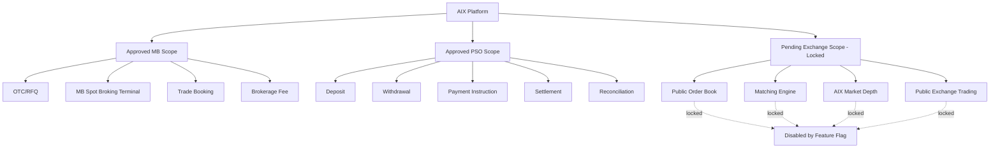
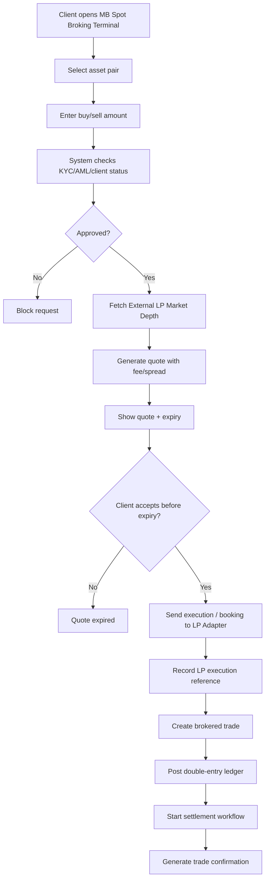

# 00 Licence Scope and Feature Lock  
# AIX Money Broking Platform

## Document Control

| Item | Details |
|---|---|
| Document name | 00_Licence_Scope_And_Feature_Lock.md |
| Platform | AIX Money Broking Platform |
| Document type | SDLC Phase 0 / Licence Scope Control |
| Version | v1.1 |
| Status | Revised after LP-backed Spot Broking discussion |
| Prepared for | Development, architecture, compliance, product, and system design |
| Primary purpose | Lock what can be built now, what must remain disabled, and what controls must be enforced by the system |

---

## 1. Purpose

This document defines the licence scope, feature activation rules, locked modules, prohibited functions, and development boundaries for the AIX Money Broking Platform.

The purpose is to prevent the platform from being developed as:

1. A generic crypto exchange.
2. An unrestricted trading platform.
3. A proprietary trading platform.
4. A market maker platform.
5. A public order-book exchange before Exchange approval is granted.

The current licence position is:

1. Money Broking licence is approved.
2. Payment System Operator licence is approved.
3. Exchange application is still pending.

Therefore, the system may proceed with approved Money Broking and PSO-related modules, but all Exchange-related features must remain locked until Exchange approval is granted.

This document must be read before preparing:

1. Project Charter.
2. Software Requirement Specification.
3. Module Index.
4. Database Design.
5. API Specification.
6. Frontend Page Map.
7. Claude Code implementation prompts.
8. Any production deployment plan.

---

## 2. Regulatory Reference Base

The platform must be designed with reference to the following Labuan FSA regulatory areas.

| Area | Reference |
|---|---|
| Money Broking | Guidelines on the Establishment of Money Broking Business in Labuan IBFC |
| Digital Money Broking Platform | Guidelines on the Management of Digital Money Broking Platform |
| Digital Financial Services | Labuan FSA DFS approval requirements |
| Market Conduct | Guidelines on Market Conduct for Labuan Digital Financial Intermediaries |
| Travel Rule | Guidelines on Travel Rule for Labuan Digital Financial Services |
| AML/CFT/CPF/TFS | Guidelines on AML/CFT/CPF and TFS for Labuan Key Reporting Institutions |
| Digital Currency Admission | Admissibility Framework for Digital Currencies |
| Payment / Settlement | PSO licence scope and relevant LFSA guidance |
| Outsourcing / External Vendors | LFSA external service / outsourcing expectations where applicable |
| Technology / Cyber Risk | Technology management, digital governance, security, access, logging, and monitoring expectations |

### 2.1 Developer Interpretation

For development purposes, the platform must be treated as:

```txt
A regulated Labuan Money Broking + PSO platform
with LP-backed spot broking and OTC/RFQ capabilities,
not as AIX's own public exchange until Exchange approval is granted.
```

---

## 3. Current Licence Status

| Licence / Approval | Status | System Treatment |
|---|---|---|
| Money Broking Licence | Approved | Active build scope |
| Payment System Operator Licence | Approved | Active build scope |
| Exchange Application | Pending | Locked until approval |

---

## 4. Approved Build Scope

The following modules are approved for documentation, system design, and MVP development.

### 4.1 Money Broking Scope

Allowed modules:

1. Client onboarding.
2. KYC/KYB.
3. Beneficial ownership collection.
4. AML risk profile.
5. Source of funds / source of wealth.
6. OTC/RFQ broking.
7. MB Spot Broking Terminal.
8. LP-backed quote request.
9. Trade booking.
10. Brokerage fee calculation.
11. Client trade history.
12. Trade confirmation.
13. Reporting.
14. Audit log.

### 4.2 PSO Scope

Allowed modules:

1. Deposit workflow.
2. Withdrawal workflow.
3. Payment instruction.
4. Payment status tracking.
5. Settlement tracking.
6. Client money ledger.
7. Payment reconciliation.
8. Payment reference tracking.
9. Payment reports.

### 4.3 Compliance Scope

Allowed modules:

1. KYC/KYB review.
2. AML risk scoring.
3. Sanctions screening.
4. PEP screening.
5. Beneficial ownership.
6. Wallet screening.
7. Travel Rule readiness.
8. AML case management.
9. Account freeze.
10. Account suspension.
11. Enhanced due diligence.
12. Compliance notes.
13. Compliance decision log.

### 4.4 Platform Foundation Scope

Allowed modules:

1. Authentication.
2. MFA.
3. Role-based access control.
4. Feature flags.
5. Audit log.
6. Maker-checker.
7. Notification.
8. Document management.
9. Admin portal.
10. Staff portal.
11. Client portal.
12. System settings.
13. Reporting.
14. System health monitoring.

---

## 5. Exchange Pending / Locked Scope

The following features must remain disabled because the Exchange application is pending.

| Feature | Status | Reason |
|---|---|---|
| AIX public order book | Locked | Exchange approval pending |
| AIX internal matching engine | Locked | Exchange approval pending |
| AIX market depth as exchange | Locked | Exchange approval pending |
| Public exchange trading | Locked | Exchange approval pending |
| Open exchange-style market | Locked | Exchange approval pending |
| Client-to-client matching | Locked | Exchange approval pending |
| Market maker engine | Locked | Not MB MVP |
| Principal dealing engine | Locked | Not MB scope |
| Public market API | Locked | Exchange approval pending |
| Resting exchange limit orders | Locked | Exchange approval pending |
| Stop-limit order book | Locked | Exchange approval pending |
| Post-only orders | Locked | Exchange order-book behaviour |
| Good-till-cancelled exchange orders | Locked | Exchange order-book behaviour |

### 5.1 Important Design Rule

The platform may display external LP market information, but it must not represent that data as AIX's own exchange order book.

Allowed label:

```txt
External LP Market Depth
```

Avoid label:

```txt
AIX Order Book
```

---

## 6. LP-Backed Spot Broking Model

AIX intends to use Binance or another approved liquidity provider behind the Spot Broking Terminal.

### 6.1 Approved Concept

The user interface may look like a professional trading terminal with:

1. Chart.
2. Asset pair selector.
3. External LP market depth.
4. Recent LP market activity.
5. Buy / sell quote ticket.
6. Open requests.
7. Trade history.
8. Asset summary.

### 6.2 System Execution Model

The backend must follow this model:

```txt
Client
↓
AIX Spot Broking Terminal
↓
AIX Quote Engine
↓
AIX LP Adapter
↓
Binance / approved LP
↓
AIX Trade Booking
↓
AIX Ledger
↓
AIX Settlement
↓
AIX Reporting
```

The backend must not follow this model:

```txt
Client order
↓
AIX public order book
↓
AIX matching engine
↓
Client-to-client execution
```

### 6.3 LP-Backed Spot Broking Rules

1. Binance or another approved LP may provide market data and liquidity.
2. LP market depth may be displayed as indicative external depth.
3. Client execution must go through AIX quote confirmation.
4. AIX must record LP price snapshot.
5. AIX must record client quote.
6. AIX must record spread and fee.
7. AIX must record LP execution reference where applicable.
8. AIX must record slippage where applicable.
9. AIX must not expose Binance API directly to the client.
10. AIX must not present external LP depth as AIX's own order book.
11. AIX must not operate an internal matching engine before Exchange approval.
12. AIX must not match one AIX client against another AIX client before Exchange approval.

### 6.4 Added Parameters for LP Model

```txt
liquidity_model = external_lp_backed
primary_lp = Binance_or_approved_LP
displayed_depth_source = external_lp
displayed_depth_type = indicative
internal_orderbook = disabled
internal_matching_engine = disabled
client_to_client_matching = disabled
aix_market_making = disabled
aix_principal_dealing = disabled

lp_due_diligence_required = true
lp_api_integration_required = true
lp_order_reference_required = true
lp_execution_report_required = true
lp_slippage_record_required = true
lp_outage_fallback_required = true
lp_rate_limit_handling_required = true
lp_price_snapshot_required = true
best_available_terms_evidence = required
```

---

## 7. Prohibited Scope

The following features must not be developed or activated unless separately approved by management and regulator where required.

### 7.1 Trading and Product Prohibitions

1. Principal dealing under the MB module.
2. Proprietary trading.
3. Market making.
4. Derivatives.
5. Securities token trading.
6. Margin trading for digital assets.
7. Lending or borrowing of client assets.
8. Staking service.
9. Yield product.
10. Algorithmic stablecoin support.
11. Privacy coin support.
12. Unapproved asset listing.
13. MYR trading pair.
14. AIX exchange order book before approval.
15. Internal client-to-client matching before Exchange approval.

### 7.2 Custody Prohibitions

1. Self-custody wallet service.
2. Private key custody by AIX unless separately approved.
3. Client asset commingling.
4. Company asset and client asset mixing.
5. Off-ledger balance adjustment.
6. Manual balance editing without ledger transaction.

### 7.3 System Prohibitions

1. Balance update without ledger entry.
2. Sensitive admin action without audit log.
3. Trade booking without approved client status.
4. Withdrawal without compliance and settlement checks.
5. Quote acceptance after expiry.
6. Feature activation from frontend only.
7. Staff approval of own maker-checker request.
8. Production activation of locked exchange features.
9. API bypass of disabled features.
10. Deletion of audit logs.
11. Direct client access to LP account.
12. Hidden spread or fee manipulation without audit log.

---

## 8. Feature Flags

The platform must implement backend-enforced feature flags.

Frontend hiding is not enough. If a feature is disabled, the backend API must also block access.

### 8.1 Enabled MVP Feature Flags

```txt
feature_client_onboarding = enabled
feature_kyc_kyb = enabled
feature_document_upload = enabled
feature_compliance_review = enabled
feature_beneficial_ownership = enabled
feature_source_of_funds = enabled
feature_source_of_wealth = enabled

feature_otc_rfq = enabled
feature_mb_spot_broking_terminal = enabled
feature_spot_broking_request = enabled
feature_external_lp_market_depth = enabled
feature_lp_backed_quote = enabled
feature_trade_booking = enabled
feature_brokerage_fee = enabled

feature_deposit = enabled
feature_withdrawal = enabled
feature_payment_instruction = enabled
feature_payment_settlement = enabled
feature_reconciliation = enabled

feature_double_entry_ledger = enabled
feature_audit_log = enabled
feature_maker_checker = enabled
feature_reports = enabled
feature_notifications = enabled

feature_travel_rule_readiness = enabled
feature_wallet_screening = enabled
feature_aml_case_management = enabled
feature_account_freeze = enabled
feature_account_suspension = enabled
```

### 8.2 Disabled / Locked Feature Flags

```txt
feature_exchange_orderbook = disabled
feature_matching_engine = disabled
feature_market_depth_as_aix_exchange = disabled
feature_public_exchange_trading = disabled
feature_public_market_pair_listing = disabled
feature_public_market_api = disabled
feature_client_to_client_matching = disabled

feature_derivatives = disabled
feature_margin_trading = disabled
feature_securities_token = disabled
feature_market_making = disabled
feature_proprietary_trading = disabled
feature_self_custody_wallet = disabled
feature_staking = disabled
feature_yield_product = disabled

feature_MYR_trading_pair = disabled
feature_privacy_coin = disabled
feature_algorithmic_stablecoin = disabled
```

### 8.3 Feature Flag Enforcement Rules

1. Feature flags must be stored in the database.
2. Feature flags must be enforced by backend middleware or service guard.
3. Frontend must also hide disabled features, but frontend is not the source of truth.
4. Admin changes to feature flags must require permission.
5. High-risk feature flag changes must require maker-checker approval.
6. Every feature flag change must create an audit log.
7. Locked exchange features must not be enabled by normal admin users.
8. Locked exchange features require management and regulatory approval confirmation before activation.
9. Backend API must reject disabled-feature requests with `FEATURE_DISABLED`.
10. Locked feature API routes should not be publicly documented until enabled.

---

## 9. Core System Rules

### 9.1 Licence Boundary Rules

1. The platform must operate within approved MB and PSO scope.
2. Exchange features must remain disabled until Exchange approval is granted.
3. AIX acts as broker/intermediary under the MB module.
4. AIX must not act as principal, market maker, or proprietary trader under the MB module.
5. The system must not allow exchange-style order matching before approval.
6. Spot broking must remain quote-and-confirm, LP-backed, and brokered.
7. Payment and settlement features must not become custody service unless separately approved.
8. LP market data must be labelled as external LP market depth, not AIX order book.

### 9.2 Client Eligibility Rules

1. Client must complete onboarding before using transaction modules.
2. Client must pass KYC/KYB before trading.
3. Client must have approved status before RFQ or spot broking request.
4. Rejected client cannot trade.
5. Suspended client cannot trade, deposit, or withdraw.
6. Frozen client cannot withdraw.
7. Client risk profile must be created before transaction approval.
8. Beneficial ownership must be collected for corporate clients.
9. Source of funds must be captured where required.
10. Source of wealth must be captured where required.

### 9.3 AML/KYC Rules

1. Every client must go through CDD.
2. High-risk clients must go through EDD.
3. PEP screening status must be recorded.
4. Sanctions screening status must be recorded.
5. Wallet screening status must be recorded where digital asset transfers are involved.
6. Suspicious activity must create a compliance case.
7. Compliance must be able to freeze or suspend account.
8. Compliance decisions must record user, date, reason, and evidence.
9. AML status must be checked before trade booking and withdrawal.
10. Transaction monitoring rules must be supported in the system.

### 9.4 Travel Rule Readiness Rules

1. Digital asset transfers must support Travel Rule data capture.
2. Originator information must be stored where applicable.
3. Beneficiary information must be stored where applicable.
4. Wallet address must be linked to the client where possible.
5. Counterparty VASP or financial institution data must be stored where applicable.
6. Transfer must not proceed if required Travel Rule data is missing.
7. Post-facto Travel Rule submission must not be the intended design.
8. Travel Rule records must be audit-ready.
9. Travel Rule exceptions must be recorded.
10. Travel Rule data must be protected as sensitive information.

### 9.5 OTC/RFQ Rules

1. Only approved clients can create RFQ.
2. RFQ must include asset pair, side, amount, and quote type.
3. RFQ must have status.
4. Quote must have expiry timestamp.
5. Expired quote cannot be accepted.
6. Quote must show fee and spread where applicable.
7. Quote must record price source or LP quote.
8. Quote must record whether it is firm or indicative.
9. Client acceptance must be timestamped.
10. Accepted RFQ must create trade booking.
11. Trade booking must trigger ledger process.
12. RFQ cannot skip required status sequence.

### 9.6 MB Spot Broking Rules

1. Spot broking MVP must use brokered quote-and-confirm flow.
2. Spot broking must not operate as a full public exchange.
3. Client must confirm before trade booking.
4. Price, fee, spread, and settlement details must be shown before confirmation.
5. Trade confirmation must be generated after booking.
6. Spot broking request must create audit log.
7. Spot broking trade must use ledger entries.
8. Spot broking cannot use locked matching engine.
9. External LP depth may be displayed only as external indicative market data.
10. Client order must not rest inside an AIX order book.
11. Client order must not match against another AIX client.
12. LP execution reference must be recorded where applicable.

### 9.7 Payment and Settlement Rules

1. Deposit must be linked to client account.
2. Withdrawal must be reviewed before processing.
3. Settlement must have status.
4. Settlement must have reference number.
5. Settlement proof must be stored where applicable.
6. Failed settlement must be escalated.
7. Settlement completion must require permission.
8. High-risk settlement must require maker-checker.
9. Payment and settlement must be reconciled.
10. Client money and company money must be separated in ledger.

### 9.8 Ledger Rules

1. Every balance movement must use double-entry ledger.
2. Direct balance editing is prohibited.
3. Total debit must equal total credit.
4. Ledger transaction must have clear source module.
5. Ledger transaction must have reference ID.
6. Ledger reversal must not delete original entry.
7. Ledger reversal must create new reversing entries.
8. Pending balance, available balance, and frozen balance must be separated.
9. Ledger entries must be immutable after posting.
10. Ledger reports must be exportable.

### 9.9 Audit Log Rules

1. Every sensitive action must create audit log.
2. Audit logs must not be deleted.
3. Audit logs must capture before and after values where applicable.
4. Audit logs must capture user ID.
5. Audit logs must capture role.
6. Audit logs must capture IP address.
7. Audit logs must capture user agent.
8. Audit logs must capture timestamp.
9. Audit logs must capture module and action.
10. Audit logs must be searchable by authorised staff.

### 9.10 Maker-Checker Rules

1. Sensitive actions must support maker-checker.
2. Staff cannot approve own request.
3. Settlement approval may require checker.
4. Withdrawal approval may require checker.
5. Feature flag change may require checker.
6. Fee configuration change may require checker.
7. Role permission change may require checker.
8. Ledger reversal must require checker.
9. Account freeze or unfreeze may require checker.
10. Checker decision must be logged.

---

## 10. UI Naming Control

The platform must use terminology that reflects MB/PSO scope and avoids implying that AIX is already operating a public exchange.

### 10.1 Preferred UI Terms

| Use This | Avoid This |
|---|---|
| Spot Broking | AIX Exchange |
| MB Spot Broking Terminal | Exchange Terminal |
| External LP Market Depth | AIX Order Book |
| Instant Quote | Market Order |
| Open Requests | Open Orders |
| Quote History | Order Book History |
| Trade History | Exchange Trade Feed |
| Price Target Request | Limit Order |
| Quote Validity | Time in Force |
| External Market Activity | AIX Market Activity |
| Brokered Trade | Matched Trade |

### 10.2 MVP Disabled UI Concepts

1. Stop-limit.
2. Post-only.
3. Good-till-cancelled.
4. Fill-or-kill.
5. Immediate-or-cancel.
6. Public order book.
7. Maker/taker fee model.
8. Market maker panel.
9. Public exchange depth.
10. Internal matching engine status.

---

## 11. Development Rules

### 11.1 General Development Rules

1. Do not build active exchange order-book features.
2. Do not build active matching engine.
3. Do not expose locked features in production.
4. Do not bypass feature flags.
5. Do not update balances directly.
6. Do not skip audit logs.
7. Do not allow client access to another client’s data.
8. Do not allow staff action without permission check.
9. Do not allow expired quote acceptance.
10. Do not allow rejected or suspended clients to trade.

### 11.2 Backend Rules

1. Backend must enforce all feature flags.
2. Backend must enforce all permissions.
3. Backend must validate client status before transaction modules.
4. Backend must check AML status where required.
5. Backend must create audit logs for sensitive actions.
6. Backend must use ledger service for financial postings.
7. Backend must reject locked feature API calls.
8. Backend must protect Travel Rule and AML data.
9. Backend must validate all request bodies.
10. Backend must return consistent error codes.
11. Backend must separate external LP market data from internal execution records.
12. Backend must store LP price snapshots for trade evidence.

### 11.3 Frontend Rules

1. Frontend must hide disabled features.
2. Frontend must show account status clearly.
3. Frontend must show quote expiry clearly.
4. Frontend must show fee, spread, and settlement details before confirmation.
5. Frontend must prevent duplicate submission.
6. Frontend must display compliance pending status.
7. Frontend must not expose internal system settings to client.
8. Frontend must not store secrets.
9. Frontend must not calculate final ledger balances.
10. Frontend must show proper error messages from backend.
11. Frontend must label LP data as external LP market depth.
12. Frontend must not label external LP depth as AIX order book.

### 11.4 Database Rules

1. Use soft delete where required.
2. Do not delete financial records.
3. Do not delete audit logs.
4. Use indexes for high-volume tables.
5. Use unique references for transactions.
6. Store timestamps for all key events.
7. Separate client account, ledger account, and user account.
8. Separate client funds and company funds in ledger design.
9. Store feature flag changes.
10. Store approval decisions.
11. Store LP price snapshot and execution reference.
12. Store spread, fee, quote expiry, acceptance time, and settlement reference.

### 11.5 Production Safety Rules

1. Locked Exchange features must remain disabled in production.
2. Production feature flag change must require authorised approval.
3. Production database changes must use migration.
4. Production secrets must not be stored in code.
5. Production logs must not expose passwords, tokens, or sensitive documents.
6. Production deployment must include rollback plan.
7. Production access must be limited.
8. Production admin actions must be logged.
9. Production system must have monitoring.
10. Production release must pass testing checklist.

---

## 12. MVP Boundary

The MVP must focus on approved MB and PSO functions only.

### 12.1 MVP Includes

1. Authentication.
2. MFA.
3. User management.
4. Role and permission.
5. Client onboarding.
6. KYC/KYB.
7. Beneficial ownership.
8. Document upload.
9. Compliance review.
10. Client approval workflow.
11. OTC/RFQ request.
12. RFQ quote handling.
13. RFQ acceptance or rejection.
14. MB Spot Broking Terminal.
15. External LP Market Depth display.
16. LP-backed quote request.
17. Trade booking.
18. Deposit request.
19. Withdrawal request.
20. Payment instruction.
21. Settlement tracking.
22. Double-entry ledger.
23. Audit log.
24. Maker-checker.
25. Feature flags.
26. Admin portal.
27. Staff portal.
28. Client portal.
29. Reports.
30. Travel Rule readiness.
31. AML case management.
32. Account freeze and suspension.

### 12.2 MVP Excludes

1. Full AIX exchange order book.
2. AIX matching engine.
3. AIX market depth as exchange.
4. Public exchange trading.
5. Public exchange API.
6. Market maker function.
7. Proprietary trading.
8. Securities token trading.
9. Derivatives.
10. Margin trading.
11. Self-custody wallet.
12. Staking.
13. Yield product.
14. Algorithmic stablecoin.
15. Privacy coin.
16. MYR trading pair.
17. Client-to-client matching.
18. Resting public exchange orders.

### 12.3 MVP Success Criteria

The MVP is considered successful when:

1. Client can register.
2. Client can complete onboarding.
3. Client can submit KYC/KYB.
4. Compliance can approve or reject client.
5. Approved client can submit OTC/RFQ request.
6. Staff can issue quote.
7. Client can accept valid quote before expiry.
8. Client can use MB Spot Broking Terminal to request and confirm brokered spot quote.
9. System can store external LP price snapshot.
10. System can store client quote and LP execution reference where applicable.
11. System can book trade.
12. Ledger entries are created correctly.
13. Settlement status can be tracked.
14. Deposit and withdrawal workflow works.
15. Reports can be generated.
16. All sensitive actions are logged.
17. Disabled exchange features remain inaccessible.
18. Rejected or suspended clients cannot trade.
19. Travel Rule data fields are available for relevant digital asset transfers.

---

## 13. High-Level Licence Boundary Diagram



---

## 14. LP-Backed Spot Broking Diagram



---

## 15. Initial Developer Parameters

These parameters must be included in later SRS, database design, API design, and Claude Code prompt.

```txt
licence_money_broking_status = approved
licence_pso_status = approved
licence_exchange_status = pending

platform_role = broker_intermediary
principal_dealing = blocked
proprietary_trading = blocked
market_making = blocked

client_onboarding_required = true
kyc_kyb_required = true
beneficial_ownership_required = true
source_of_funds_required = true
source_of_wealth_required = conditional
pep_screening_required = true
sanctions_screening_required = true
wallet_screening_required = true
travel_rule_readiness_required = true

liquidity_model = external_lp_backed
primary_lp = Binance_or_approved_LP
displayed_depth_source = external_lp
displayed_depth_type = indicative
internal_orderbook = disabled
internal_matching_engine = disabled
client_to_client_matching = disabled
aix_market_making = disabled
aix_principal_dealing = disabled

lp_due_diligence_required = true
lp_api_integration_required = true
lp_order_reference_required = true
lp_execution_report_required = true
lp_slippage_record_required = true
lp_outage_fallback_required = true
lp_rate_limit_handling_required = true
lp_price_snapshot_required = true
best_available_terms_evidence = required

double_entry_ledger_required = true
audit_log_required = true
maker_checker_required = true
feature_flag_required = true
backend_feature_flag_enforcement = true

exchange_orderbook = disabled
matching_engine = disabled
market_depth_as_aix_exchange = disabled
public_exchange_trading = disabled

otc_rfq = enabled
mb_spot_broking_terminal = enabled
spot_broking_request = enabled
external_lp_market_depth = enabled
lp_backed_quote = enabled
payment_settlement = enabled
deposit_withdrawal = enabled
reconciliation = enabled

myr_trading_pair = disabled
privacy_coin = disabled
algorithmic_stablecoin = disabled
securities_token = disabled
derivatives = disabled
margin_trading = disabled
self_custody_wallet = disabled
```

---

## 16. Instruction for Next SDLC Document

After this document is accepted, the next document to prepare is:

```txt
01_Project_Charter.md
```

The Project Charter must use this licence scope as its base.

No SRS, database design, API design, or Claude Code implementation should start until this Licence Scope and Feature Lock document is accepted.

---

## 17. Claude Model Usage for This Document

### 17.1 Claude Opus

Use Claude Opus to review this document because it involves licence boundary, architecture, compliance, and high-risk product design.

### 17.2 Claude Sonnet

Do not use Claude Sonnet yet. Coding has not started.

### 17.3 Claude Fable

Do not use Claude Fable yet. UX copy is not the current priority.

---

## 18. Claude Opus Review Prompt

```txt
Review this 00_Licence_Scope_And_Feature_Lock.md document as a principal fintech architect.

Context:
- Money Broking licence is approved.
- PSO licence is approved.
- Exchange application is pending.
- Platform will support OTC/RFQ, MB Spot Broking Terminal, LP-backed quote execution, onboarding, KYC/KYB, ledger, payment, settlement, audit log, admin portal, staff portal, client portal, and reporting.
- Binance or another approved LP may provide external market depth and liquidity.
- Exchange order-book, internal matching engine, market depth as AIX exchange, and public exchange trading must remain disabled until Exchange approval is granted.
- Platform must include Travel Rule readiness, AML/KYC, audit log, maker-checker, feature flags, and double-entry ledger.

Review for:
1. Missing feature flags.
2. Missing system restrictions.
3. Risk of accidentally building an exchange.
4. Risk of acting as principal instead of broker.
5. Missing audit and ledger controls.
6. Missing AML/KYC and Travel Rule controls.
7. Missing LP integration controls.
8. Missing developer instructions.
9. Missing MVP boundary controls.
10. Unsafe UI wording.

Do not write code.

Return only:
- Critical gaps.
- Recommended corrections.
- Additional parameters to add.
```
