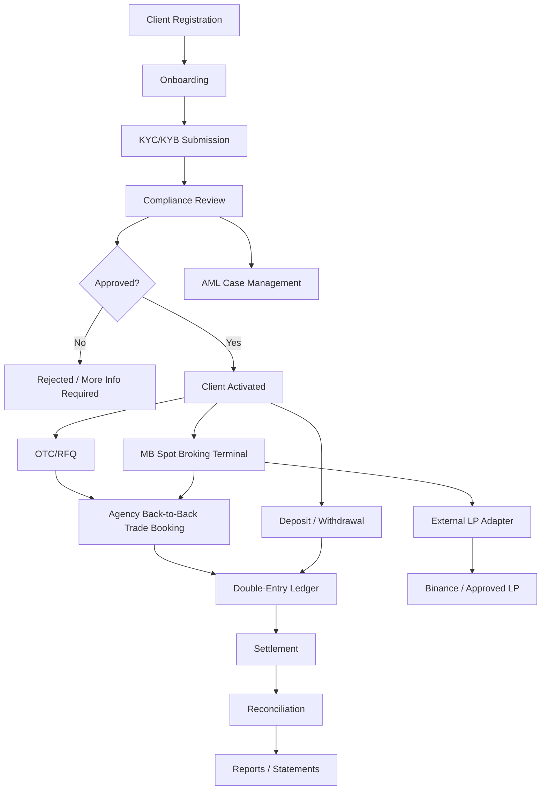
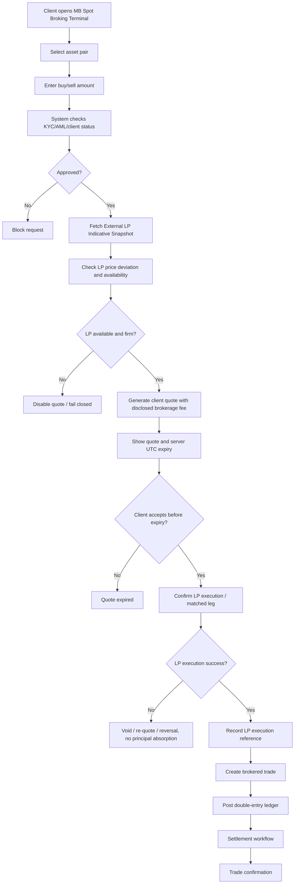

# 01 Project Charter  
# AIX Money Broking Platform

## Document Control

| Item | Details |
|---|---|
| Document name | 01_Project_Charter_v1.1.md |
| Platform | AIX Money Broking Platform |
| Document type | SDLC Phase 1 / Project Initiation |
| Version | v1.1 |
| Status | Revised using accepted 00_Licence_Scope_And_Feature_Lock_v1.3.md |
| Prepared for | Management, product, compliance, development, architecture, and implementation planning |
| Base document | 00_Licence_Scope_And_Feature_Lock_v1.3.md |

---

## 1. Purpose of This Document

This Project Charter formally defines the project purpose, scope, boundaries, delivery approach, licence assumptions, MVP scope, exclusions, major risks, and success criteria for the AIX Money Broking Platform.

This is the second SDLC document after:

```txt
00_Licence_Scope_And_Feature_Lock_v1.3.md
```

This document does not define database tables, API endpoints, UI components, or implementation code. Those will be prepared in later documents.

This document answers:

1. What are we building?
2. Why are we building it?
3. Who will use it?
4. What licence scope controls the build?
5. What is included in MVP?
6. What is excluded from MVP?
7. What are the high-level modules?
8. What are the main risks?
9. What are the success criteria?
10. What documents must be prepared next before coding starts?

---

## 2. Project Name

```txt
AIX Money Broking Platform
```

Recommended internal product name:

```txt
AIX MB Platform
```

Recommended spot broking module name:

```txt
MB Spot Broking Terminal
```

Names that must not be used until Exchange approval is granted:

```txt
AIX Exchange
AIX Order Book
AIX Matching Engine
AIX Market Maker
AIX Public Trading Market
```

---

## 3. Project Background

AIX holds:

1. Approved Money Broking licence.
2. Approved Payment System Operator licence.
3. Pending Exchange application.

The platform will be developed as a regulated Labuan Money Broking and PSO platform.

The platform will support:

1. Client onboarding.
2. KYC/KYB.
3. AML risk controls.
4. OTC/RFQ broking.
5. MB Spot Broking Terminal.
6. External LP-backed agency/back-to-back execution.
7. Payment and settlement workflow.
8. Double-entry ledger.
9. Audit log.
10. Maker-checker approval.
11. Travel Rule enforcement.
12. Reporting.
13. Staff portal.
14. Admin portal.
15. Client portal.

The platform must not be developed as a full public exchange until Exchange approval is granted.

---

## 4. Project Vision

The project vision is to build a secure, scalable, modular, and audit-ready Labuan Money Broking + PSO platform.

The platform must be built as a real production platform, not a demo.

The platform must support:

1. More than 1,000 users.
2. High-traffic usage.
3. Modular expansion.
4. Staff operations.
5. Compliance control.
6. Auditability.
7. Ledger integrity.
8. Future Exchange expansion without rebuilding from zero.

---

## 5. Project Objectives

The project objectives are:

1. Build a production-grade Money Broking platform.
2. Support OTC/RFQ broking.
3. Support MB Spot Broking Terminal.
4. Use external LP-backed agency/back-to-back execution.
5. Prevent AIX from acting as principal, market maker, or liquidity provider.
6. Keep AIX inventory limit at zero.
7. Use disclosed brokerage fee as revenue model.
8. Block AIX spread markup.
9. Support client onboarding and compliance review.
10. Support KYC/KYB and beneficial ownership collection.
11. Support AML risk scoring and compliance case handling.
12. Support Travel Rule enforcement for relevant digital asset transfers.
13. Support deposit, withdrawal, payment instruction, and settlement workflows.
14. Support double-entry ledger for all financial movements.
15. Support audit log for all sensitive actions.
16. Support maker-checker for high-risk actions.
17. Support admin, staff, and client portals.
18. Support reporting and statement generation.
19. Keep Exchange-related features disabled until Exchange approval is granted.
20. Prepare the platform for future Exchange module activation using feature flags and modular architecture.

---

## 6. Licence Scope Summary

The platform must follow the licence boundaries defined in `00_Licence_Scope_And_Feature_Lock_v1.3.md`.

| Licence / Approval | Status | Project Treatment |
|---|---|---|
| Money Broking | Approved | Active MVP scope |
| Payment System Operator | Approved | Active MVP scope |
| Exchange Application | Pending | Locked future scope |

### 6.1 Money Broking Build Scope

The Money Broking scope includes:

1. OTC/RFQ broking.
2. MB Spot Broking Terminal.
3. Brokered quote-and-confirm flow.
4. External LP-backed liquidity.
5. Agency/back-to-back trade booking.
6. Disclosed brokerage fee calculation.
7. Trade confirmation.
8. Client trade history.
9. Compliance-linked trade approval.
10. Audit-ready transaction records.

### 6.2 PSO Build Scope

The PSO scope includes:

1. Deposit request.
2. Withdrawal request.
3. Payment instruction.
4. Payment tracking.
5. Settlement tracking.
6. Reconciliation.
7. Payment reference.
8. Payment report.

### 6.3 Exchange Locked Scope

The following must stay locked:

1. AIX public order book.
2. AIX internal matching engine.
3. AIX public market depth.
4. Public exchange trading.
5. Client-to-client matching.
6. Public market API.
7. Market maker engine.
8. Exchange-style open market execution.
9. Resting limit orders.
10. Stop-limit, GTC, post-only, maker/taker order behaviour.

---

## 7. Execution and Revenue Model

### 7.1 Execution Model

The approved MVP execution model is:

```txt
Agency back-to-back execution
```

This means:

1. AIX does not act as principal.
2. AIX does not carry naked position.
3. AIX inventory limit is zero.
4. Client execution must be tied to firm or secured LP leg.
5. LP outage must fail closed.
6. No internal fallback pricing is allowed.
7. LP partial fill must not create AIX residual position.
8. LP slippage beyond tolerance must void or re-quote the client trade.
9. Any re-quote requires fresh client confirmation.
10. Failed LP execution triggers void or ledger reversal, not principal absorption.

### 7.2 Revenue Model

The approved MVP revenue model is:

```txt
Disclosed brokerage fee / commission
```

The following are blocked:

1. AIX spread markup.
2. Hidden spread.
3. Principal margin.
4. Market-making revenue.
5. Proprietary trading gain.
6. Client trade loss becoming AIX gain.

---

## 8. Client Type Scope

The MVP client type scope is:

```txt
Institutional clients and HNWI / professional clients only.
```

Retail client onboarding is disabled by default.

Rules:

1. Retail onboarding must remain disabled unless separately approved.
2. Corporate and institutional clients must complete KYB.
3. Beneficial ownership must be collected for corporate clients.
4. HNWI / professional clients must complete required suitability, source of funds, and source of wealth checks.
5. Product access must be filtered by client type.
6. Any future retail access requires separate approval, documentation update, risk assessment, and feature flag change.

---

## 9. Project Scope

### 9.1 In Scope for MVP

#### Foundation

1. Authentication.
2. MFA.
3. User management.
4. Role-based access control.
5. Feature flags.
6. Audit log.
7. Maker-checker.
8. Notification.
9. Document management.

#### Client and Compliance

1. Client onboarding.
2. KYC/KYB.
3. Beneficial ownership.
4. Source of funds.
5. Source of wealth.
6. AML risk scoring.
7. Sanctions / PEP status.
8. Wallet screening.
9. Travel Rule enforcement.
10. AML case management.
11. Account freeze / suspension.
12. Periodic KYC/CDD refresh.
13. STR / regulatory filing workflow.
14. Threshold transaction reporting.
15. Tainted-funds / mixer handling.

#### Product

1. OTC/RFQ.
2. MB Spot Broking Terminal.
3. External LP Market Depth display.
4. LP-backed quote request.
5. Agency/back-to-back trade booking.
6. Disclosed brokerage fee calculation.
7. Trade confirmation.
8. Best execution / fair pricing evidence.

#### Money and Settlement

1. Double-entry ledger.
2. Client balance.
3. Deposit workflow.
4. Withdrawal workflow.
5. Payment instruction.
6. Settlement.
7. Daily client-money reconciliation.
8. LP three-way reconciliation.
9. Statement generation.

#### Portal and Reporting

1. Client portal.
2. Staff portal.
3. Admin portal.
4. Compliance reports.
5. Ledger reports.
6. Transaction reports.
7. Settlement reports.
8. Management reports.
9. System health monitoring.
10. Incident log.

---

### 9.2 Out of Scope for MVP

The following are excluded from MVP:

1. AIX full exchange order book.
2. AIX internal matching engine.
3. Public exchange market depth.
4. Public exchange trading.
5. Public market API.
6. Client-to-client matching.
7. Market maker module.
8. Proprietary trading.
9. Securities token trading.
10. Derivatives.
11. Margin trading.
12. Lending.
13. Staking.
14. Yield product.
15. Self-custody wallet service.
16. Privacy coins.
17. Algorithmic stablecoins.
18. MYR trading pairs.
19. Retail client onboarding.
20. Resting public exchange orders.
21. Executable price target request.
22. Click-to-trade depth ladder.
23. Maker/taker fee model.
24. Mobile native app.

---

## 10. Main User Groups

### 10.1 Client

Client actions:

1. Register account.
2. Complete profile.
3. Submit KYC/KYB.
4. Upload documents.
5. View approval status.
6. Submit OTC/RFQ request.
7. Use MB Spot Broking Terminal.
8. Request deposit.
9. Request withdrawal.
10. View settlement status.
11. Download trade confirmation.
12. Download statement.
13. Submit support request.

### 10.2 Compliance Officer

Compliance actions:

1. Review KYC/KYB.
2. Review beneficial owner details.
3. Review risk profile.
4. Approve client.
5. Reject client.
6. Request additional information.
7. Review AML cases.
8. Freeze account.
9. Suspend account.
10. Add compliance notes.
11. Review transaction alerts.
12. Review Travel Rule data.
13. Prepare STR / regulatory filing workflow.

### 10.3 Operations Officer

Operations actions:

1. Monitor OTC/RFQ.
2. Issue or review quote.
3. Monitor spot broking requests.
4. Review LP-backed execution.
5. Book trade.
6. Monitor settlement.
7. Handle failed trades.
8. Escalate exception cases.
9. Upload settlement proof.
10. Update transaction status.

### 10.4 Finance Officer

Finance actions:

1. View ledger.
2. Perform reconciliation.
3. Review deposits.
4. Review withdrawals.
5. Review fee income.
6. Generate reports.
7. Export settlement reports.
8. Review client money movement.
9. Review trial balance.
10. Review LP three-way reconciliation.

### 10.5 Customer Support

Customer support actions:

1. View client profile.
2. View onboarding status.
3. View transaction status.
4. Create support ticket.
5. Escalate issue.
6. Cannot approve KYC.
7. Cannot process settlement.
8. Cannot change financial records.

### 10.6 Admin

Admin actions:

1. Manage staff users.
2. Manage roles.
3. Manage permissions.
4. Manage feature flags.
5. Manage assets.
6. Manage asset pairs.
7. Manage fee rules.
8. Manage limits.
9. Manage system settings.
10. View audit logs.

### 10.7 Super Admin

Super Admin has high-level system control but must still be subject to:

1. Maker-checker.
2. Audit log.
3. Production safety rules.
4. Feature lock restrictions.
5. No self-approval for restricted actions.
6. No access to modify own audit trail.

---

## 11. High-Level Platform Modules

### 11.1 Foundation Modules

1. Authentication.
2. MFA.
3. User Management.
4. RBAC.
5. Feature Flags.
6. Audit Log.
7. Maker-Checker.
8. Notification.
9. File / Document Management.

### 11.2 Compliance Modules

1. Client Onboarding.
2. KYC/KYB.
3. Beneficial Ownership.
4. Source of Funds / Source of Wealth.
5. AML Risk Scoring.
6. Sanctions / PEP Screening.
7. Wallet Screening.
8. Travel Rule Enforcement.
9. AML Case Management.
10. Account Freeze / Suspension.
11. STR / Regulatory Filing.
12. Periodic KYC Refresh.
13. Deposit Wallet Screening Disposition.

### 11.3 Product Modules

1. Asset Configuration.
2. Asset Pair Configuration.
3. Fee Engine.
4. Pricing Engine.
5. LP Adapter.
6. External LP Market Depth.
7. OTC/RFQ.
8. MB Spot Broking Terminal.
9. Best Execution Evidence.

### 11.4 Money and Settlement Modules

1. Double-Entry Ledger.
2. Client Balance.
3. Deposit.
4. Withdrawal.
5. Payment Instruction.
6. Settlement.
7. Reconciliation.
8. Statement Generation.
9. Ledger Reversal.
10. Suspense / Clearing Accounts.

### 11.5 Portal and Reporting Modules

1. Client Portal.
2. Staff Portal.
3. Admin Portal.
4. Reporting.
5. Compliance Reports.
6. Management Reports.
7. System Health.
8. Incident Log.

### 11.6 Locked Future Modules

1. Exchange Order Book.
2. Matching Engine.
3. Public Market Depth.
4. Public Exchange Trading.
5. Market Surveillance.
6. Public Market API.

---

## 12. High-Level System Flow



---

## 13. High-Level Spot Broking Flow



---

## 14. Project Delivery Approach

The project will follow SDLC with module-level blueprint packs.

### 14.1 SDLC Phases

| Phase | Description | Output |
|---|---|---|
| Phase 0 | Licence scope lock | 00 Licence Scope and Feature Lock |
| Phase 1 | Planning | Project Charter |
| Phase 2 | Requirement analysis | SRS |
| Phase 3 | System design | Architecture, database, API, module blueprints |
| Phase 4 | Development | Source code |
| Phase 5 | Testing | Test results and UAT |
| Phase 6 | Deployment | Staging and production release |
| Phase 7 | Maintenance | Monitoring, fixes, changes, improvements |

### 14.2 Module Blueprint Method

Every module must have its own blueprint pack.

Required files per module:

```txt
01_Module_Blueprint.md
02_Workflow.md
03_Diagrams.md
04_API_Specification.md
05_Database_Design.md
06_State_Machine.md
07_Permission_Rules.md
08_Audit_Log_Events.md
09_Error_Handling.md
10_Test_Cases.md
11_Claude_Prompt.md
```

### 14.3 No Coding Before Documentation Rule

Claude Code must not start coding until the relevant module blueprint is complete and reviewed.

---

## 15. Proposed Technology Stack

The proposed stack is:

| Layer | Recommended Technology |
|---|---|
| Frontend | Next.js + TypeScript |
| Backend | NestJS + TypeScript |
| Database | PostgreSQL |
| ORM | Prisma |
| Cache / Queue | Redis + BullMQ |
| Realtime | WebSocket / Socket.IO |
| File Storage | S3-compatible object storage |
| Infrastructure | Docker first, Kubernetes later |
| API Docs | OpenAPI / Swagger |
| Testing | Jest, Playwright, API tests |
| Monitoring | Sentry, Prometheus, Grafana |
| CI/CD | GitHub Actions |
| Secret Management | KMS / Vault |
| Audit Integrity | Append-only + hash-chain |
| Ledger | Double-entry ledger |

This stack may be confirmed again during `08_Master_Technical_Architecture.md`.

---

## 16. Performance Targets

Initial performance targets:

| Item | Target |
|---|---:|
| Registered users | 1,000+ |
| Concurrent users target | 1,000 |
| Normal API response | Less than 300 ms |
| Heavy API response | Less than 1,000 ms |
| Quote update response | Less than 1 second |
| WebSocket reconnect | Less than 5 seconds |
| Uptime target | 99.9% |
| Error rate target | Below 1% |
| Recovery point objective | 15 minutes or less |
| Recovery time objective | 1 hour or less |

These targets are initial developer planning targets and may be refined after load testing.

---

## 17. Security and Control Principles

The platform must apply:

1. MFA for staff.
2. MFA for clients where required.
3. Role-based access control.
4. Permission guard on every protected API.
5. Backend-enforced feature flags.
6. Maker-checker for sensitive actions.
7. Audit log for all sensitive actions.
8. Tamper-evident audit log.
9. Read access logging for sensitive PII.
10. Double-entry ledger for all balance movements.
11. No direct balance editing.
12. No deletion of audit logs.
13. No production secrets inside code.
14. Rate limiting.
15. Session timeout.
16. Device and IP logging.
17. Secure file upload.
18. Encryption in transit.
19. Encryption at rest for sensitive data.
20. Monitoring and alerting.
21. Backup and restore plan.
22. Incident response process.
23. Server UTC quote expiry.
24. Idempotency on financial operations.
25. Fail-safe default deny.

---

## 18. Key Project Assumptions

The project assumes:

1. MB licence is approved.
2. PSO licence is approved.
3. Exchange approval is pending.
4. AIX will not activate Exchange features until approval.
5. Binance or another approved LP may be used for liquidity and market depth.
6. External LP data must be treated as external indicative market depth.
7. LP depth must be non-executable and non-clickable.
8. AIX will not directly expose LP access to client.
9. AIX will not operate internal matching engine in MVP.
10. AIX will use disclosed brokerage fee as revenue model.
11. AIX will not earn principal spread markup.
12. AIX inventory limit is zero.
13. LP outage fails closed.
14. LP partial-fill or slippage beyond tolerance results in void, re-quote, or reversal.
15. Institutional and HNWI/professional clients are the MVP client scope.
16. Retail onboarding is disabled by default.
17. System must be audit-ready from day one.

---

## 19. Key Project Constraints

The project has these constraints:

1. Exchange application is pending.
2. Exchange features must be locked.
3. AIX must not act as principal under MB module.
4. AIX must not operate market maker logic under MB module.
5. Client-to-client matching is not allowed in MVP.
6. MYR trading pairs are disabled.
7. Privacy coins are disabled.
8. Algorithmic stablecoins are disabled.
9. Securities tokens are disabled unless separately approved.
10. Self-custody wallet is disabled unless separately approved.
11. Retail onboarding is disabled in MVP.
12. Travel Rule enforcement must be built for relevant digital asset transfers.
13. AML/KYC must be integrated into transaction flow.
14. Ledger must be double-entry.
15. Feature flags must be backend-enforced.
16. Audit logs must be immutable and tamper-evident.
17. LP market data redistribution rights must be confirmed before production.
18. Data residency must be confirmed before production.

---

## 20. Key Risks

| Risk | Description | Control |
|---|---|---|
| Exchange boundary risk | Platform accidentally behaves like exchange | Feature flags, naming control, no matching engine |
| Principal dealing risk | AIX accidentally acts as principal | Agency/back-to-back flow, zero inventory, disclosed fee only |
| Spread risk | Fee model looks like dealer spread | Prohibit AIX spread markup |
| LP dependency risk | Binance / LP outage | Fail-closed, no internal fallback pricing |
| Slippage risk | LP fills worse than client quote | Void or re-quote, no AIX absorption |
| Partial-fill risk | LP partially fills trade | Void or re-quote, no residual inventory |
| Ledger risk | Balance mismatch | Double-entry ledger, idempotency, reconciliation |
| AML risk | Suspicious client or transaction missed | Risk scoring, case management, screening, STR workflow |
| Travel Rule risk | Missing originator/beneficiary data | Travel Rule enforcement and transfer block rules |
| Security risk | Unauthorised access | MFA, RBAC, logging, rate limits |
| Operational risk | Staff makes wrong approval | Maker-checker, audit log |
| Compliance risk | Wrong asset offered | Approved asset whitelist |
| Deployment risk | Bug in production | Staging, testing, rollback |

---

## 21. Success Criteria

The project will be considered successful at MVP stage when:

1. Client can register and complete onboarding.
2. Client can submit KYC/KYB and documents.
3. Compliance can review, approve, reject, or request more information.
4. Approved client can submit OTC/RFQ request.
5. Approved client can use MB Spot Broking Terminal.
6. System can show external LP market depth safely.
7. External LP depth is non-executable and non-clickable.
8. Client can request and confirm LP-backed quote.
9. Quote expiry works using server UTC.
10. Trade booking works through agency/back-to-back flow.
11. AIX inventory remains zero.
12. AIX spread markup is not used.
13. LP outage fails closed.
14. LP partial-fill or unacceptable slippage does not create AIX exposure.
15. Ledger entries are created correctly.
16. Deposit and withdrawal workflow works.
17. Settlement status is tracked.
18. Reconciliation workflow exists.
19. Audit log captures sensitive actions.
20. Maker-checker works for sensitive actions.
21. Travel Rule enforcement fields and block rules exist.
22. Reports and statements are generated.
23. Exchange features remain disabled.
24. Suspended or rejected clients cannot trade.
25. Platform can support 1,000+ users with acceptable response time.

---

## 22. Deliverables

### 22.1 Documentation Deliverables

1. 00 Licence Scope and Feature Lock.
2. 01 Project Charter.
3. 02 Software Requirement Specification.
4. 03 Master Module Index.
5. 04 Role and Permission Matrix.
6. 05 Master Workflow Map.
7. 06 Master System Rules.
8. 07 Master Data Flow.
9. 08 Master Technical Architecture.
10. 09 Master Security Architecture.
11. 10 Master Testing Strategy.
12. 11 Master Deployment Strategy.
13. Module blueprint packs.

### 22.2 Development Deliverables

1. Monorepo setup.
2. Frontend application.
3. Backend application.
4. Database schema.
5. Auth and RBAC.
6. Audit log.
7. Maker-checker.
8. Onboarding.
9. KYC/KYB.
10. Travel Rule enforcement.
11. Ledger.
12. Payment and settlement.
13. OTC/RFQ.
14. MB Spot Broking Terminal.
15. LP Adapter.
16. Reporting.
17. Admin/staff/client portals.
18. Test suite.
19. Deployment pipeline.

---

## 23. Build Priority

The build priority must be:

```txt
1. Documentation
2. Architecture
3. Foundation modules
4. Compliance modules
5. Ledger and settlement modules
6. LP integration module
7. OTC/RFQ module
8. MB Spot Broking Terminal
9. Reporting
10. Testing
11. Deployment
```

The platform must not start with the trading screen.

---

## 24. AI Tool Usage

### 24.1 ChatGPT 5.5

Use for:

1. SDLC documentation.
2. Architecture planning.
3. Database design.
4. API planning.
5. Security review.
6. Regulatory logic mapping.
7. Claude prompt generation.
8. Review checklists.

### 24.2 Claude Opus

Use for:

1. Architecture review.
2. Ledger review.
3. Security review.
4. RBAC review.
5. Audit log review.
6. LP-backed spot broking review.
7. Regulatory boundary risk review.

### 24.3 Claude Sonnet

Use for:

1. Normal coding.
2. Module implementation.
3. Frontend pages.
4. Backend APIs.
5. Database migrations.
6. Unit tests.
7. Bug fixing.

### 24.4 Claude Fable

Use for:

1. UX copy.
2. Error messages.
3. Help text.
4. Empty states.
5. Onboarding guidance text.
6. Client-facing explanations.

---

## 25. Next Document

The next document after this Project Charter is:

```txt
02_Software_Requirement_Specification.md
```

However, before writing the full SRS, the recommended supporting document is:

```txt
03_Master_Module_Index.md
```

Reason:

The Master Module Index will define every module and the required blueprint pack for each module. This will make the SRS easier to write and reduce the risk of missing modules.

Recommended next order:

```txt
03_Master_Module_Index.md
02_Software_Requirement_Specification.md
04_Role_And_Permission_Matrix.md
05_Master_Workflow_Map.md
```

---

## 26. Claude Opus Review Prompt

Use Claude Opus to review this document before moving to Master Module Index or SRS.

```txt
Review this 01_Project_Charter_v1.1.md as a principal fintech platform architect.

Context:
- AIX has approved Money Broking and PSO licences.
- Exchange application is pending.
- This Charter is based on 00_Licence_Scope_And_Feature_Lock_v1.3.md.
- The project is to build a regulated Labuan Money Broking + PSO platform.
- Platform includes OTC/RFQ, MB Spot Broking Terminal, external LP-backed agency/back-to-back execution, onboarding, KYC/KYB, AML, Travel Rule enforcement, ledger, payment, settlement, audit log, maker-checker, reporting, and admin/staff/client portals.
- AIX revenue model is disclosed brokerage fee only.
- AIX spread markup, principal dealing, market making, internal matching, and client-to-client matching are blocked.
- Exchange order book, matching engine, public market depth, and public exchange trading must remain locked.
- MVP client scope is institutional and HNWI/professional only. Retail onboarding is disabled by default.

Review for:
1. Missing project scope.
2. Missing constraints.
3. Missing risks.
4. Missing modules.
5. Missing success criteria.
6. Missing licence boundary controls.
7. Missing AI / Claude workflow controls.
8. Missing development delivery controls.
9. Missing documentation deliverables.
10. Any part that may accidentally allow exchange-like or principal-dealing behaviour.

Do not write code.

Return only:
- Critical gaps.
- Recommended corrections.
- Additional parameters to add.
```
