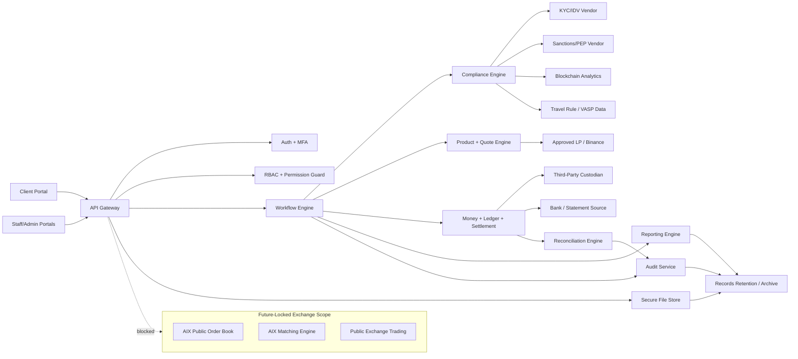

# 07 Master Data Flow  
# AIX Money Broking Platform

## Document Control

| Item | Details |
|---|---|
| Document name | 07_Master_Data_Flow_v1.0.md |
| Platform | AIX Money Broking Platform |
| Document type | SDLC Phase 2 / Master Data Flow and Data-Control Map |
| Version | v1.0 |
| Status | Initial master data flow for review |
| Prepared for | Product, compliance, architecture, security, development, QA, operations, finance, and implementation planning |
| Base document 1 | 00_Licence_Scope_And_Feature_Lock_v1.3.md |
| Base document 2 | 01_Project_Charter_v1.3.md |
| Base document 3 | 03_Master_Module_Index_v1.2.md |
| Base document 4 | 02_Software_Requirement_Specification_v1.2.md |
| Base document 5 | 04_Role_And_Permission_Matrix_v1.2.md |
| Base document 6 | 05_Master_Workflow_Map_v1.2.md |
| Base document 7 | 06_Master_System_Rules_v1.2.md |

---

## 1. Purpose

This document defines the master data flow for the AIX Money Broking Platform.

The purpose is to map how data moves across portals, backend services, databases, vendors, custody, bank, LP, compliance tools, reporting, audit, and future-locked modules.

This document answers:

1. What data enters the platform?
2. Where is the data stored?
3. Which service processes the data?
4. Which external vendor receives or returns data?
5. Which data flows are sensitive or regulated?
6. Which data flows require encryption, masking, read-access logging, or audit?
7. Which flows trigger ledger, balance, settlement, reconciliation, or safeguarding records?
8. Which flows must fail closed?
9. Which flows must never occur because they breach licence scope?
10. Which flows must be refined in module blueprints?

---

## 2. Scope Baseline

The data flow is based on the accepted platform boundary:

```txt
Money Broking licence = approved
PSO licence = approved
Exchange application = pending
MVP client type = institutional and HNWI/professional only
Retail onboarding = disabled by default
Execution model = agency back-to-back
Revenue model = disclosed brokerage fee only
AIX spread markup = blocked
AIX inventory limit = zero
Self-custody = disabled
Third-party custody model = required
Client money safeguarding account = required
Exchange order book = locked
Matching engine = locked
Client-to-client matching = locked
Market making = blocked
Principal dealing = blocked
```

---

## 3. Data Flow Principles

### 3.1 Data Minimisation

Only data required for onboarding, compliance, broking, payment, settlement, reporting, audit, and legal retention may be collected or processed.

### 3.2 Backend-Controlled Data Movement

Frontend does not decide whether sensitive data can move.

Backend services must enforce:

1. Role and permission.
2. Feature flag.
3. Client status.
4. Workflow state.
5. Licence boundary.
6. Data classification.
7. Encryption requirement.
8. Audit requirement.
9. Vendor approval status.
10. Data residency rule.

### 3.3 Sensitive Data Protection

Sensitive data must be encrypted, access-controlled, and logged when read.

Sensitive data includes:

1. PII.
2. KYC/KYB documents.
3. Beneficial ownership.
4. Source of funds.
5. Source of wealth.
6. Professional/accredited status evidence.
7. Bank account data.
8. Wallet ownership evidence.
9. Travel Rule data.
10. AML/STR records.
11. Wallet screening results.
12. Client-money safeguarding records.
13. Ledger and balance records.
14. Audit log exports.
15. Vendor due diligence and security records.

### 3.4 Fail-Closed Vendor Flow

If external vendor data cannot be obtained, verified, parsed, authenticated, or reconciled, the related workflow must fail closed or move to controlled exception state.

### 3.5 No Unapproved External Disclosure

No client PII, KYC, KYB, Travel Rule, AML, wallet, bank, ledger, or transaction data may be sent to:

1. Unapproved vendors.
2. AI prompts.
3. Public logs.
4. Email attachments without approval.
5. Client-visible pages for other clients.
6. Future-locked Exchange modules.
7. Unapproved analytics tools.

---

## 4. Data Classification Model

| Classification | Examples | Controls |
|---|---|---|
| Public | Public website text, generic FAQ | Integrity control |
| Internal | Internal configuration, non-sensitive settings | RBAC |
| Confidential | Client profile, vendor records, support tickets | RBAC, audit where sensitive |
| Restricted | KYC/KYB, BO, SOF/SOW, bank, wallet, Travel Rule | Encryption, masking, read-access logging |
| Highly Restricted | STR, AML case, sanctions true match, audit exports, secrets | Strict RBAC, encryption, read-access logging, export approval |
| Financial Critical | Ledger, balance, settlement, safeguarding, reconciliation | Immutable records, idempotency, reconciliation, audit |
| Security Critical | Secrets, MFA reset, roles, permissions, break-glass | KMS/vault, maker-checker, audit, SoD |

Every module handling Restricted, Highly Restricted, Financial Critical, or Security Critical data must have `16_Data_Classification.md`.

---

## 5. Primary Systems and Data Stores

### 5.1 Internal Systems

| System | Purpose | Data Handled |
|---|---|---|
| Client Portal | Client onboarding, trading, deposits, withdrawals, statements | Client profile, documents, quotes, withdrawals |
| Staff Portal | Operations, compliance, finance, support | Workflow data, cases, approvals |
| Admin Portal | Admin settings, users, roles, feature flags | IAM, config, vendor, asset data |
| API Gateway | Authentication, validation, routing, rate limits | API requests and responses |
| Auth Service | Login, MFA, session | Credentials, MFA, sessions |
| RBAC / Permission Service | Permission checks | Roles, permissions, policies |
| Workflow Engine | State transitions | Workflow states and approvals |
| Compliance Engine | KYC/KYB, AML, Travel Rule, transaction monitoring | Compliance records |
| Product / Quote Engine | OTC/RFQ, spot quote, fee and pricing | Quote, LP price, fee |
| LP Adapter | LP price, execution, status | LP market data, execution reference |
| Ledger Service | Double-entry ledger | Ledger entries, balances, holds |
| Payment / Settlement Service | Deposit, withdrawal, settlement, LP payment | Payment instructions, settlement states |
| Reconciliation Service | Bank/custodian/LP/ledger reconciliation | Statements, breaks |
| Reporting Service | Reports and exports | Report datasets |
| Audit Service | Append-only audit logs | Audit events |
| Notification Service | Email/SMS/in-app notification | Notification metadata |
| File Service | Secure document storage | Documents and evidence |
| Security Monitoring | Security and incident logs | Security events |
| Job Queue / Worker | Async screening, reports, reconciliation | Job payloads |

### 5.2 External Systems

| External System | Purpose | Data Shared |
|---|---|---|
| KYC / IDV Vendor | Identity/company verification | Client identity, documents |
| Sanctions / PEP Vendor | Screening | Names, identifiers, entities |
| Blockchain Analytics Vendor | Wallet screening | Wallet address, transaction hash |
| Counterparty VASP Registry / Data Source | Travel Rule support | VASP information |
| LP / Binance or Approved LP | Price, execution, settlement status | Asset pair, quote request, execution data |
| Third-Party Custodian | Digital asset custody, balances, transfers | Custody account, asset movement |
| Bank / Statement Source | Fiat receipt, payment status, safeguarding | Bank statement, payment instruction |
| Cloud Provider | Hosting | Encrypted data and infrastructure logs |
| Notification Vendor | Email/SMS/OTP | Contact details, message metadata |
| Pen Test / Security Vendor | Security testing | Test scope and non-production data only |

---

## 6. Master Data Flow Diagram



---

## 7. Master Data Domains

| Domain | Data Examples | Primary Owner | Classification |
|---|---|---|---|
| IAM | Users, sessions, MFA, roles | Security/Admin | Security Critical |
| Client | Client profile, contact, status | Compliance/Ops | Confidential / Restricted |
| KYC/KYB | Documents, BO, SOF/SOW | Compliance | Restricted |
| AML | Risk score, alerts, cases, STR | Compliance/MLRO | Highly Restricted |
| Travel Rule | Originator/beneficiary data | Compliance | Restricted / Highly Restricted |
| Wallet Screening | Wallet risk, disposition | Compliance | Restricted |
| Product | Product access, asset/pair config | Product/Compliance | Internal / Confidential |
| Quote/Trade | Quotes, fees, LP evidence, confirmations | Ops | Financial Critical |
| Ledger/Balance | Ledger, balance, holds, reversals | Finance | Financial Critical |
| Payment/Settlement | Deposits, withdrawals, LP payment | Ops/Finance | Financial Critical |
| Reconciliation | Bank/custodian/LP matching, breaks | Finance | Financial Critical |
| Safeguarding | Liability/resources computation | Finance/Compliance | Financial Critical |
| Vendor | Vendor DD, contracts, SLA, exit plan | Admin/Domain Owner | Confidential |
| Reporting | Reports, exports, regulatory filings | Domain Owner | Varies |
| Audit | Audit events, hash chain | Security/Audit | Security Critical |
| Privacy | DSAR, privacy requests | DPO | Restricted |
| Complaints | Complaints/disputes | Support/Compliance | Confidential / Restricted |

---

## 8. DF-01 Client Registration and Onboarding Data Flow

### 8.1 Flow Summary

Client onboarding data moves from Client Portal to API, File Service, Client Profile Store, Compliance Engine, Screening Vendors, and Audit Service.

### 8.2 Data Flow Table

| Step | Source | Destination | Data | Control |
|---:|---|---|---|---|
| 1 | Client Portal | API Gateway | Registration data | Validation, rate limit |
| 2 | API Gateway | Auth Service | User credentials | Password policy, MFA |
| 3 | Client Portal | File Service | KYC/KYB documents | Encryption, malware scan |
| 4 | API Gateway | Client Profile Store | Client profile | RBAC, audit |
| 5 | Client Profile Store | Compliance Engine | Client profile, BO, SOF/SOW | Restricted access |
| 6 | Compliance Engine | Screening Vendors | Name/entity identifiers | Vendor approval |
| 7 | Screening Vendors | Compliance Engine | Screening result | Sensitive read audit |
| 8 | Compliance Engine | Workflow Engine | Decision/status | Maker-checker |
| 9 | Workflow Engine | Audit Service | Audit event | Append-only |
| 10 | Workflow Engine | Notification Service | Status notice | Data minimisation |

### 8.3 Data Controls

1. Retail onboarding data path is blocked by default.
2. Client cannot access transaction modules from onboarding data alone.
3. KYC/KYB documents must be encrypted and access logged.
4. Screening results are Restricted or Highly Restricted depending on result.
5. Compliance decision must be immutable through decision log.

---

## 9. DF-02 Professional / Accredited Status Data Flow

| Step | Source | Destination | Data | Control |
|---:|---|---|---|---|
| 1 | Client Portal | File Service | Eligibility evidence | Encryption |
| 2 | File Service | Compliance Engine | Evidence metadata | Sensitive read audit |
| 3 | Compliance Engine | Workflow Engine | Review decision | Maker-checker |
| 4 | Workflow Engine | Client Profile Store | Eligibility status | Product access gate |
| 5 | Workflow Engine | Audit Service | Decision audit | Append-only |

Rules:

1. Product access remains blocked until status is approved.
2. Evidence must be retained according to data retention policy.
3. Expired status triggers refresh-required flow.

---

## 10. DF-03 KYC/KYB, Beneficial Ownership, SOF/SOW, and EDD Data Flow

| Step | Source | Destination | Data | Control |
|---:|---|---|---|---|
| 1 | Client Portal | Client Profile Store | BO and ownership structure | Validation |
| 2 | Client Portal | File Service | SOF/SOW evidence | Encryption |
| 3 | Compliance Engine | Sanctions/PEP Vendor | BO/director/representative data | Approved vendor only |
| 4 | Vendor | Compliance Engine | Screening result | Restricted |
| 5 | Compliance Engine | AML Risk Engine | Risk factors | AML rules |
| 6 | AML Risk Engine | Compliance Workspace | Risk score | Sensitive read audit |
| 7 | Compliance Workspace | Workflow Engine | EDD requirement / decision | Maker-checker |
| 8 | Workflow Engine | Audit Service | Decision log | Append-only |

Rules:

1. Missing BO, SOF/SOW, or EDD blocks product access.
2. Screening of beneficial owners must be linked to client record.
3. EDD evidence must be access controlled.

---

## 11. DF-04 Product Access and Agreement Data Flow

| Step | Source | Destination | Data | Control |
|---:|---|---|---|---|
| 1 | Compliance Engine | Product Access Service | Client approval data | Eligibility gate |
| 2 | Client Portal | Consent Store | Agreement acceptance | Version, timestamp, IP |
| 3 | Product Access Service | Client Profile Store | Product access flag | Maker-checker |
| 4 | Product Access Service | Audit Service | Product access event | Append-only |
| 5 | Product Access Service | Client Portal | Allowed modules | Backend source of truth |

Rules:

1. UI visibility must not replace backend product access check.
2. Product access requires approved client, professional status, AML clearance, agreement acceptance, and asset/pair eligibility.

---

## 12. DF-05 Payout Destination Whitelist Data Flow

| Step | Source | Destination | Data | Control |
|---:|---|---|---|---|
| 1 | Client Portal | API Gateway | Payout destination request | Validation, MFA |
| 2 | API Gateway | Workflow Engine | Request metadata | Client-side approval check |
| 3 | Client Approver | Workflow Engine | Client-side approval | SoD check |
| 4 | Client Portal | File Service | Ownership evidence | Encryption |
| 5 | Workflow Engine | Compliance Engine | Destination review data | Own-name rule |
| 6 | Compliance Engine | Blockchain Analytics Vendor | Wallet address if crypto | Wallet screening |
| 7 | Compliance/Ops/Finance | Workflow Engine | Approval decision | Maker-checker |
| 8 | Workflow Engine | Payout Destination Store | Approved destination | Cooling-off hard gate |
| 9 | Workflow Engine | Audit Service | Audit events | Append-only |

Rules:

1. Third-party payout destination is blocked by default.
2. New destination cannot be used before cooling-off period ends.
3. Client-side dual authorization is required where mandate/threshold applies.
4. Crypto wallet destination links to Travel Rule and wallet screening.

---

## 13. DF-06 Fiat Deposit and Suspense Data Flow

| Step | Source | Destination | Data | Control |
|---:|---|---|---|---|
| 1 | Bank / Statement Source | Bank Integration | Statement line / receipt | Bank evidence |
| 2 | Client Portal | Deposit Service | Deposit notice | Optional notice |
| 3 | Deposit Service | Matching Engine | Reference, amount, sender | Matching rules |
| 4 | Matching Engine | Suspense / Clearing Account | Unmatched funds | No client credit |
| 5 | Ops/Finance | Deposit Workflow | Investigation evidence | Maker-checker |
| 6 | Deposit Workflow | Compliance Engine | AML review if required | Risk-based |
| 7 | Deposit Workflow | Ledger Service | Credit request | Idempotency |
| 8 | Ledger Service | Balance Service | Ledger-derived balance | Atomic operation |
| 9 | Reconciliation Service | Bank/Ledger Stores | Match result | Reconciliation |
| 10 | Safeguarding Service | Safeguarding Store | Liability/resource update | Full-backing invariant |

Rules:

1. Bank receipt confirmation is required before credit.
2. Unmatched deposit must go to suspense / clearing account.
3. Unmatched deposit cannot increase client available balance.
4. Return must be to verified source where applicable.
5. Deposit credit must link to ledger and reconciliation.

---

## 14. DF-07 Digital Asset Deposit Data Flow

| Step | Source | Destination | Data | Control |
|---:|---|---|---|---|
| 1 | Custodian / Node Provider | Deposit Monitoring Service | Transaction hash / asset / amount | Vendor approved |
| 2 | Deposit Monitoring Service | Confirmation Engine | On-chain confirmation data | Threshold |
| 3 | Deposit Monitoring Service | Blockchain Analytics Vendor | Wallet / transaction data | Wallet screening |
| 4 | Vendor | Compliance Engine | Wallet risk result | AML review |
| 5 | Deposit Service | Suspense / Clearing Account | Unmatched deposit | No client credit |
| 6 | Compliance/Ops/Finance | Workflow Engine | Credit decision | Maker-checker |
| 7 | Workflow Engine | Ledger Service | Credit instruction | Idempotency |
| 8 | Ledger Service | Balance Service | Client balance | Atomic ledger/balance |
| 9 | Reconciliation Service | Custodian/Ledger Stores | Reconciliation record | Break handling |
| 10 | Audit Service | Audit Store | Deposit audit trail | Append-only |

Rules:

1. Approved deposit address is required.
2. On-chain/custodian confirmation threshold must be met.
3. Wallet screening must clear or be reviewed.
4. Digital deposit credit requires maker-checker.
5. Custodian reconciliation is required.

---

## 15. DF-08 Withdrawal Data Flow

| Step | Source | Destination | Data | Control |
|---:|---|---|---|---|
| 1 | Client Portal | Withdrawal Service | Withdrawal request | MFA, validation |
| 2 | Withdrawal Service | Client/Profile/Product Services | Client and product status | Product access gate |
| 3 | Withdrawal Service | Payout Destination Store | Destination data | Own-name, cooling-off |
| 4 | Withdrawal Service | Client Approval Workflow | Approval request | Dual auth where required |
| 5 | Withdrawal Service | Ledger Service | Hold request | Atomic hold |
| 6 | Withdrawal Service | Travel Rule Service | Originator/beneficiary data | Travel Rule |
| 7 | Withdrawal Service | Blockchain Analytics Vendor | Wallet screening data | Crypto only |
| 8 | Compliance/Ops/Finance | Workflow Engine | Approval decisions | Maker-checker |
| 9 | Payment Service | Bank/Custodian | Release instruction | Approved destination |
| 10 | Bank/Custodian | Payment Service | Release status | Evidence |
| 11 | Ledger Service | Ledger/Balance Store | Settlement posting | Double-entry |
| 12 | Reconciliation Service | Bank/Custodian/Ledger | Reconciliation data | Break management |
| 13 | Audit Service | Audit Store | Workflow events | Append-only |

Rules:

1. Withdrawal to third-party destination is blocked.
2. Client-side approval occurs before staff-side release where required.
3. Withdrawal hold must be atomic.
4. Bank/custodian release must be linked to approved withdrawal.
5. Reconciliation path is required.

---

## 16. DF-09 OTC/RFQ Data Flow

| Step | Source | Destination | Data | Control |
|---:|---|---|---|---|
| 1 | Client Portal | RFQ Service | RFQ request | Product access gate |
| 2 | RFQ Service | Compliance/Product Services | Eligibility data | KYC/AML/product |
| 3 | RFQ Service | LP Adapter | RFQ pricing request | Approved LP |
| 4 | LP Adapter | Pricing Engine | LP price snapshot | Market data licence |
| 5 | Pricing Engine | Fee Engine | Brokerage fee | Disclosed fee only |
| 6 | Pricing Engine | Best-Execution Service | LP reference / tolerance | Fair pricing |
| 7 | Quote Service | Client Portal | Quote | Server UTC expiry |
| 8 | Client Portal | Quote Service | Quote acceptance | Client confirmation |
| 9 | Quote Service | Client Approval Workflow | Large trade approval | Dual auth where required |
| 10 | Quote Service | Ledger Service | Pre-funded hold request | Atomic hold |
| 11 | Execution Service | LP Adapter | LP execution request | Hold required |
| 12 | LP Adapter | Execution Service | Execution reference/status | LP evidence |
| 13 | Trade Service | Ledger/Settlement Services | Trade booking | Double-entry / DvP |
| 14 | Audit Service | Audit Store | Quote/trade events | Append-only |

Rules:

1. Quote must be LP-derived.
2. AIX spread markup is blocked.
3. Best-execution check must pass before booking.
4. LP execution cannot fire before pre-funded hold.
5. Partial fill/slippage results in void, re-quote, or reversal.

---

## 17. DF-10 MB Spot Broking Terminal Data Flow

| Step | Source | Destination | Data | Control |
|---:|---|---|---|---|
| 1 | Client Portal | Spot Quote Service | Pair/amount/side | Product access |
| 2 | Spot Quote Service | Asset/Pair Config | Pair eligibility | Asset lock |
| 3 | Spot Quote Service | LP Adapter | Indicative LP price request | Approved LP |
| 4 | LP Adapter | Pricing Engine | LP snapshot | External LP only |
| 5 | Pricing Engine | Client Portal | Quote + disclosed fee | No order book |
| 6 | Client Portal | Quote Service | Acceptance | Server UTC check |
| 7 | Quote Service | Ledger Service | Pre-funded hold | Atomic hold |
| 8 | Execution Service | LP Adapter | Execution request | Hold confirmed |
| 9 | LP Adapter | Trade Service | LP execution reference | LP evidence |
| 10 | Trade Service | Settlement/Ledger Services | Booking and settlement | DvP |
| 11 | Audit Service | Audit Store | Events | Append-only |

Rules:

1. External LP market depth is indicative only.
2. No AIX order book data flow exists.
3. No matching engine data flow exists.
4. No client-to-client order data flow exists.

---

## 18. DF-11 LP Execution, Settlement Payment, and DvP Data Flow

| Step | Source | Destination | Data | Control |
|---:|---|---|---|---|
| 1 | Trade Service | Ledger Service | Pre-funded hold status | Required |
| 2 | Execution Service | LP Adapter | Execution order | Approved LP |
| 3 | LP Adapter | Execution Service | Execution reference | Evidence |
| 4 | Execution Service | Settlement Service | Matched leg details | DvP |
| 5 | Settlement Service | LP Payment Workflow | LP payment request | Maker |
| 6 | Ops/Finance Checker | LP Payment Workflow | Approval | Checker |
| 7 | Payment Service | Bank/Custodian/LP | LP payment / settlement instruction | DvP/safeguarded control |
| 8 | LP/Bank/Custodian | Settlement Service | Settlement status | Evidence |
| 9 | Ledger Service | Ledger Store | Settlement postings | Double-entry |
| 10 | Reconciliation Service | LP/Ledger/Trade Stores | Three-way reconciliation | Break management |
| 11 | Audit Service | Audit Store | Settlement events | Append-only |

Rules:

1. LP payment cannot be released before DvP/safeguarded sequence passes.
2. LP payment requires maker-checker.
3. LP execution and ledger/trade record must reconcile.
4. Settlement failure triggers exception, reversal, void, or re-quote.

---

## 19. DF-12 Ledger, Balance, Hold, and Reversal Data Flow

| Step | Source | Destination | Data | Control |
|---:|---|---|---|---|
| 1 | Source Workflow | Ledger Service | Posting request | Idempotency |
| 2 | Ledger Service | Ledger Store | Debit/credit entries | Immutable |
| 3 | Ledger Service | Balance Service | Balance projection | Derived from ledger |
| 4 | Balance Service | Ledger Store | Hold/release reference | Atomic transaction |
| 5 | Ledger Service | Trial Balance Engine | Ledger totals | Debit = credit |
| 6 | Reversal Workflow | Ledger Service | Reversal request | Maker-checker |
| 7 | Ledger Service | Ledger Store | Reversing entry | No deletion |
| 8 | Audit Service | Audit Store | Ledger events | Append-only |

Rules:

1. Direct balance edit is prohibited.
2. Direct ledger edit/delete is prohibited.
3. Holds cannot exceed available balance.
4. Available balance cannot go negative.
5. Concurrent operations cannot double-spend same balance.

---

## 20. DF-13 Reconciliation and Break Data Flow

| Step | Source | Destination | Data | Control |
|---:|---|---|---|---|
| 1 | Bank | Reconciliation Service | Bank statement | Bank evidence |
| 2 | Custodian | Reconciliation Service | Custodian statement | Custody evidence |
| 3 | LP | Reconciliation Service | LP execution/settlement report | LP evidence |
| 4 | Ledger Store | Reconciliation Service | Ledger entries | Financial critical |
| 5 | Reconciliation Service | Break Management | Mismatch record | Owner required |
| 6 | Finance/Ops | Break Management | Investigation evidence | Maker |
| 7 | Finance Manager | Break Management | Closure approval | Checker |
| 8 | Ledger Service | Ledger Store | Reversal/adjustment if approved | Controlled posting |
| 9 | Audit Service | Audit Store | Break events | Append-only |

Rules:

1. Reconciliation breaks cannot be deleted.
2. Break closure requires evidence and checker.
3. Ledger adjustment must use controlled reversal/adjustment workflow.

---

## 21. DF-14 Client-Money Safeguarding Data Flow

| Step | Source | Destination | Data | Control |
|---:|---|---|---|---|
| 1 | Ledger Store | Safeguarding Service | Client money liability | Financial critical |
| 2 | Bank/Custodian Stores | Safeguarding Service | Safeguarded resources | Financial critical |
| 3 | Safeguarding Service | Safeguarding Store | Computation result | Full-backing invariant |
| 4 | Safeguarding Service | Alert/Workflow Engine | Shortfall alert | High severity |
| 5 | Finance/Compliance | Safeguarding Workflow | Investigation/remediation | Maker-checker |
| 6 | Reporting Service | Report Store | Safeguarding report | Export controlled |
| 7 | Audit Service | Audit Store | Computation events | Append-only |

Rules:

1. Client money resources must fully back client liabilities.
2. Client money must not be used for AIX operations.
3. Shortfall creates high-severity workflow.

---

## 22. DF-15 Transaction Monitoring, AML Case, Travel Rule, and Wallet Screening Data Flow

| Step | Source | Destination | Data | Control |
|---:|---|---|---|---|
| 1 | Ledger/Trade/Deposit/Withdrawal Stores | Transaction Monitoring Engine | Transaction data | AML rules |
| 2 | Monitoring Engine | Alert Store | Alert | Severity |
| 3 | Alert Store | AML Case Management | Case data | Restricted |
| 4 | Compliance User | AML Case Management | Notes/evidence/decision | Sensitive read audit |
| 5 | AML Case | Freeze Workflow | Freeze request where required | Maker-checker |
| 6 | Digital Asset Flow | Travel Rule Service | Originator/beneficiary data | Required fields |
| 7 | Travel Rule Service | VASP/Counterparty Source | VASP data | Approved source |
| 8 | Wallet Flow | Blockchain Analytics Vendor | Wallet/tx hash | Approved vendor |
| 9 | Vendor | Compliance Engine | Wallet risk result | Review disposition |
| 10 | Audit Service | Audit Store | AML/TR/wallet events | Append-only |

Rules:

1. Missing Travel Rule data blocks transfer.
2. High-risk wallet results block workflow pending review.
3. STR records are highly restricted.
4. Sanctions true match may trigger freeze workflow.

---

## 23. DF-16 Account Freeze, Suspension, and Offboarding Data Flow

| Step | Source | Destination | Data | Control |
|---:|---|---|---|---|
| 1 | AML/Sanctions/Fraud/Regulatory Source | Freeze Workflow | Trigger reason | Required evidence |
| 2 | Compliance | Freeze Workflow | Scope/effective time | Maker |
| 3 | Compliance Officer/MLRO | Freeze Workflow | Approval | Checker |
| 4 | Freeze Workflow | Client Status Engine | Restriction state | Backend enforcement |
| 5 | Client Status Engine | Product/Payment/Trade Services | Restriction signal | Default deny |
| 6 | Client/Compliance | Offboarding Workflow | Closure request | Reason |
| 7 | Offboarding Workflow | Ledger/Settlement/Reconciliation | Open obligation scan | No stranded money |
| 8 | Offboarding Workflow | Payment Service | Balance return to own-name destination | Controlled withdrawal |
| 9 | Offboarding Workflow | Records Retention | Retention action | Legal hold |
| 10 | Audit Service | Audit Store | Freeze/offboarding events | Append-only |

Rules:

1. Freeze scope must be enforced across all transaction modules.
2. Offboarding cannot close account with open balance, trade, settlement, withdrawal, or reconciliation break.
3. Balance return must use verified own-name payout destination.

---

## 24. DF-17 Periodic KYC Refresh and Sanctions Re-Screening Data Flow

| Step | Source | Destination | Data | Control |
|---:|---|---|---|---|
| 1 | Scheduler / Screening Vendor | Compliance Engine | Refresh trigger / list update | Risk schedule |
| 2 | Compliance Engine | Screening Vendor | Client/BO/representative data | Vendor approved |
| 3 | Vendor | Compliance Engine | Screening result | Restricted |
| 4 | Compliance Engine | Client Portal | Refresh request | Data minimisation |
| 5 | Client Portal | File Service | Updated evidence | Encryption |
| 6 | Compliance User | Workflow Engine | Refresh decision | Maker-checker |
| 7 | Workflow Engine | Product Access Service | Restrict/suspend/restore access | Backend gate |
| 8 | Audit Service | Audit Store | Refresh events | Append-only |

Rules:

1. Refresh overdue may restrict product access.
2. Sanctions list update must trigger re-screening.
3. Unresolved high-risk result may trigger freeze/suspension.

---

## 25. DF-18 Asset, Pair, FX, and Precision Configuration Data Flow

| Step | Source | Destination | Data | Control |
|---:|---|---|---|---|
| 1 | Admin/Ops | Asset Config Service | Asset record | Maker |
| 2 | Compliance | Asset Review Workflow | Admissibility decision | Checker |
| 3 | Asset Config Service | Product Services | Approved asset/pair list | Backend enforcement |
| 4 | Admin/Finance | FX Policy Store | Rate source/tolerance/rounding | Maker-checker |
| 5 | Admin/Finance | Precision Policy Store | Asset decimals/rounding | Maker-checker |
| 6 | Pricing/Ledger Services | FX/Precision Stores | Runtime policy lookup | Required |
| 7 | Audit Service | Audit Store | Config events | Append-only |

Rules:

1. Prohibited asset categories are blocked.
2. Asset without precision policy is blocked.
3. Unapproved FX source is blocked.
4. Rounding must not create undisclosed spread or ledger imbalance.

---

## 26. DF-19 Vendor, Custodian, Bank, LP, Secret, and Exit Data Flow

| Step | Source | Destination | Data | Control |
|---:|---|---|---|---|
| 1 | Domain Owner/Admin | Vendor Registry | Vendor record | Maker |
| 2 | Domain Owner | File Service | DD/contract/SLA/exit plan | Secure storage |
| 3 | Security/Compliance/Finance/Ops | Vendor Workflow | Reviews/approvals | Maker-checker |
| 4 | Security/Tech | KMS/Vault | API secrets | No plaintext access |
| 5 | Vendor Registry | Integration Services | Approved vendor status | Runtime gate |
| 6 | Custodian/Bank/LP | Integration Services | Operational data | Approved channel |
| 7 | Vendor Termination | Custody Exit Workflow | Migration/return plan | No stranded assets |
| 8 | Audit Service | Audit Store | Vendor/secret events | Append-only |

Rules:

1. Vendor cannot receive data before approval.
2. Secrets must not enter logs, AI prompts, tickets, or code.
3. Custody exit must define asset return or migration route.
4. LP failover remains disabled until separately approved.

---

## 27. DF-20 Reporting, Regulatory Filing, Audit, and Records Data Flow

| Step | Source | Destination | Data | Control |
|---:|---|---|---|---|
| 1 | Operational Stores | Reporting Service | Report data | Permission |
| 2 | Reporting Service | Data Minimisation Layer | Report dataset | Masking/filtering |
| 3 | Domain Owner | Report Workflow | Review decision | Maker |
| 4 | Compliance/MLRO/Management | Report Workflow | Approval | Checker |
| 5 | Reporting Service | Export Store | Export file | Audit/export control |
| 6 | Reporting Service | Regulator Submission Evidence Store | Filing evidence | Restricted |
| 7 | Audit Service | Audit Store | Report/export events | Append-only |
| 8 | Records Service | Archive Store | Archived records | Retention |

Rules:

1. STR/AML export is highly restricted and approval-gated.
2. Regulatory report submission must retain evidence.
3. Sensitive export requires audit log.

---

## 28. DF-21 Complaints, Disputes, DSAR, and Privacy Data Flow

| Step | Source | Destination | Data | Control |
|---:|---|---|---|---|
| 1 | Client/Support | Complaint Service | Complaint/dispute | Case record |
| 2 | Support/Compliance | Complaint Workflow | Assignment/evidence/resolution | Maker-checker where needed |
| 3 | Client/Support | Privacy/DSAR Service | DSAR request | Identity verification |
| 4 | DPO/Compliance | Data Inventory | Search request | Restricted |
| 5 | Data Stores | DPO Workspace | DSAR response dataset | Data minimisation |
| 6 | DPO/Compliance | DSAR Workflow | Approval/restriction decision | Checker |
| 7 | DSAR Service | Export Store | Response package | Audit/export control |
| 8 | Audit Service | Audit Store | Privacy/complaint events | Append-only |

Rules:

1. DPO owns privacy/DSAR workflow.
2. Retention/legal conflict must be checked before data release or deletion.
3. Complaint owner cannot close own complaint without oversight.

---

## 29. DF-22 Admin Configuration, IAM, and Break-Glass Data Flow

| Step | Source | Destination | Data | Control |
|---:|---|---|---|---|
| 1 | Admin/Security | IAM Service | User/role/permission change | Maker |
| 2 | Security/Super Admin | IAM Workflow | Approval | Checker |
| 3 | Admin | Feature Flag Service | Feature flag change | Licence lock |
| 4 | Domain Checker | Feature Flag Workflow | Approval | Maker-checker |
| 5 | Security/Tech | Break-Glass Workflow | Emergency request | Reason |
| 6 | Senior Approver | Break-Glass Workflow | Approval | Grantor != recipient |
| 7 | Break-Glass User | System Services | Emergency action | Heightened audit |
| 8 | Audit Service | Audit Store | IAM/config/break-glass events | Append-only |

Rules:

1. Role/permission changes require maker-checker.
2. Future-locked Exchange flags cannot be enabled.
3. Break-glass cannot bypass licence lock or audit logging.
4. Emergency access must be time-boxed.

---

## 30. Future-Locked Exchange Data Flow Block

### 30.1 Blocked Data Flows

The following data flows must not exist in MVP runtime:

```txt
Client order -> AIX public order book
Client order -> AIX matching engine
Client order -> another client order
Client order -> AIX market maker engine
Client order -> public exchange execution engine
AIX market data -> public exchange market depth
Maker/taker fee calculation -> client trade
Resting limit order -> order book store
Stop-limit order -> order book store
Public market API -> client trading
```

### 30.2 Rule

Any attempted flow to future-locked Exchange modules must be blocked by backend feature flag, licence lock, permission guard, and deployment configuration.

Error code:

```txt
EXCHANGE_MODULE_LOCKED
```

---

## 31. Data Retention and Archival Flow

| Data Type | Retention Owner | Retention Control |
|---|---|---|
| KYC/KYB | Compliance | Retention policy, legal hold |
| AML/STR | MLRO | Highly restricted retention |
| Travel Rule | Compliance | Secure retention |
| Ledger | Finance | Immutable financial record |
| Audit Log | Security/Audit | Append-only, no deletion |
| Client Agreement | Compliance | Versioned consent retention |
| Vendor DD | Domain Owner | Contract and exit-plan retention |
| Reports | Domain Owner | Report archive |
| DSAR | DPO | Privacy retention and restriction |
| Complaints | Compliance/Support | Case retention |
| Security Logs | Security | Security retention policy |

Rules:

1. Retention deletion cannot override AML, audit, legal, or financial retention.
2. Archive access requires permission.
3. Archive retrieval must be audit logged for sensitive data.

---

## 32. Data Residency and Cross-Border Flow

Data residency must be approved before production.

Cross-border data flow must be reviewed for:

1. KYC/IDV vendor.
2. Sanctions/PEP vendor.
3. Blockchain analytics vendor.
4. LP.
5. Custodian.
6. Bank.
7. Cloud provider.
8. Notification vendor.
9. Security vendor.

Rules:

1. Cross-border vendor processing requires vendor due diligence.
2. Sensitive cross-border transfer requires approved purpose.
3. Data residency violation blocks production go-live.
4. Data residency controls must be documented in module data classification files.

Error code:

```txt
DATA_RESIDENCY_VIOLATION
```

---

## 33. Data Flow Security Controls

Every sensitive data flow must define:

1. Source.
2. Destination.
3. Data fields.
4. Classification.
5. Encryption in transit.
6. Encryption at rest.
7. RBAC permission.
8. Feature flag dependency.
9. Workflow state dependency.
10. Audit event.
11. Retention rule.
12. Vendor approval dependency where applicable.
13. Error code.
14. Test case.

---

## 34. Master Data Flow Testing Requirements

Data flow testing must include:

1. Permission-denied data access tests.
2. Sensitive read-access logging tests.
3. Encryption configuration tests.
4. Data masking tests.
5. Data export approval tests.
6. Cross-client data isolation tests.
7. Vendor approval gate tests.
8. Vendor outage fail-closed tests.
9. PII not sent to unapproved vendor tests.
10. AI prompt / secret leakage prevention tests.
11. Ledger-to-balance consistency tests.
12. Bank/custodian/LP reconciliation data tests.
13. Unmatched deposit suspense data tests.
14. Travel Rule missing data block tests.
15. Wallet screening risk block tests.
16. Client-money safeguarding computation tests.
17. Future-locked Exchange data flow block tests.
18. Data retention and archival tests.
19. DSAR privacy export tests.
20. Data residency gate tests.

---

## 35. Open Items for Module Blueprints

The following must be finalised per module:

1. Exact data fields.
2. Exact database tables.
3. Exact encryption fields.
4. Exact masking rules.
5. Exact audit event payload.
6. Exact retention period.
7. Exact export formats.
8. Exact vendor payload schema.
9. Exact Travel Rule schema.
10. Exact wallet screening schema.
11. Exact LP adapter request/response.
12. Exact bank statement import format.
13. Exact custodian balance/transfer format.
14. Exact reconciliation matching fields.
15. Exact safeguarding formula inputs.
16. Exact FX rate source and precision data schema.
17. Exact data residency evidence.
18. Exact archive retrieval process.

---

## 36. Claude Model Usage

### 36.1 ChatGPT 5.5

Use for:

1. Data-flow refinement.
2. Data classification planning.
3. Module blueprint drafting.
4. API/database data mapping.
5. Audit event and test mapping.
6. Claude prompt creation.

### 36.2 Claude Opus

Use for:

1. Review of this Master Data Flow.
2. Data privacy/security review.
3. Client-money and ledger data-flow review.
4. AML/Travel Rule data-flow review.
5. Vendor/LP/custody/bank data-flow review.
6. Licence-boundary and future-locked flow review.

### 36.3 Claude Sonnet

Do not use Sonnet for coding until the relevant module blueprint is approved.

### 36.4 Claude Fable

Use later for user-facing wording and privacy/support messages.

---

## 37. Claude Opus Review Prompt

```txt
Review this 07_Master_Data_Flow_v1.0.md as a principal fintech platform architect and regulated fintech data/security reviewer.

Context:
- AIX has approved Money Broking and PSO licences.
- Exchange application is pending.
- This document is based on:
  - 00_Licence_Scope_And_Feature_Lock_v1.3.md
  - 01_Project_Charter_v1.3.md
  - 03_Master_Module_Index_v1.2.md
  - 02_Software_Requirement_Specification_v1.2.md
  - 04_Role_And_Permission_Matrix_v1.2.md
  - 05_Master_Workflow_Map_v1.2.md
  - 06_Master_System_Rules_v1.2.md
- MVP supports institutional and HNWI/professional clients only.
- Retail onboarding is disabled by default.
- Platform includes onboarding, KYC/KYB, AML, Travel Rule, transaction monitoring, payout destination whitelist, OTC/RFQ, MB Spot Broking Terminal, LP-backed agency execution, pre-funded hold, best-execution check, ledger, deposit, withdrawal, client-money safeguarding, settlement, reconciliation, audit log, maker-checker, client-side dual authorization, complaints, DSAR/privacy, break-glass access, account freeze/suspension, offboarding, periodic KYC refresh, FX/precision controls, reporting, and admin/staff/client portals.
- AIX spread markup, principal dealing, market making, internal matching, client-to-client matching, public order book, matching engine, and public exchange trading are blocked.

Review for:
1. Missing data flows.
2. Missing data stores.
3. Missing external data integrations.
4. Missing sensitive-data controls.
5. Missing encryption, masking, or read-access logging controls.
6. Missing AML/KYC/Travel Rule data flows.
7. Missing deposit, withdrawal, ledger, balance, settlement, reconciliation, or safeguarding data flows.
8. Missing LP, custodian, bank, vendor, or outage data flows.
9. Missing reporting, audit, privacy, DSAR, or retention data flows.
10. Missing data residency or cross-border controls.
11. Missing testability and data-flow-to-rule mapping.
12. Any data flow that could accidentally allow exchange-like or principal-dealing behaviour.
13. Any conflict with 00, 01, 03, 02, 04, 05, or 06.

Do not write code.

Return only:
- Critical gaps.
- Recommended corrections.
- Additional data-flow requirements or parameters to add.
```

---

## 38. Next Document

After this Master Data Flow document is reviewed and accepted, the next document should be:

```txt
08_Master_Technical_Architecture.md
```

Reason:

Technical architecture should be written after rules and data flows are locked, so system components, services, databases, queues, integrations, and deployment patterns match the regulatory workflow and data-control requirements.
