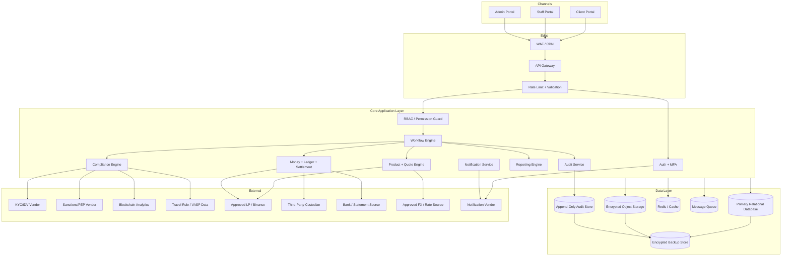
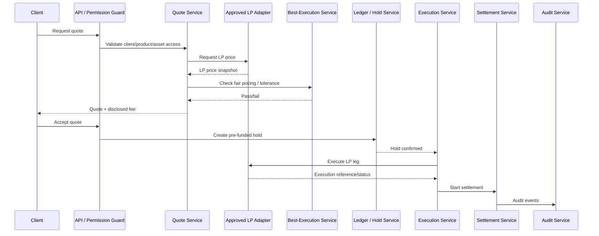

# 08 Master Technical Architecture  
# AIX Money Broking Platform

## Document Control

| Item | Details |
|---|---|
| Document name | 08_Master_Technical_Architecture_v1.0.md |
| Platform | AIX Money Broking Platform |
| Document type | SDLC Phase 2 / Master Technical Architecture |
| Version | v1.0 |
| Status | Initial master technical architecture for review |
| Prepared for | Product, compliance, architecture, security, development, DevOps, QA, operations, finance, and implementation planning |
| Base document 1 | 00_Licence_Scope_And_Feature_Lock_v1.3.md |
| Base document 2 | 01_Project_Charter_v1.3.md |
| Base document 3 | 03_Master_Module_Index_v1.2.md |
| Base document 4 | 02_Software_Requirement_Specification_v1.2.md |
| Base document 5 | 04_Role_And_Permission_Matrix_v1.2.md |
| Base document 6 | 05_Master_Workflow_Map_v1.2.md |
| Base document 7 | 06_Master_System_Rules_v1.2.md |
| Base document 8 | 07_Master_Data_Flow_v1.2.md |

---

## 1. Purpose

This document defines the master technical architecture for the AIX Money Broking Platform.

The purpose is to convert the approved licence scope, requirements, workflows, system rules, and data flows into a controlled technical architecture before security architecture, deployment architecture, and module blueprint implementation.

This document answers:

1. What is the recommended system architecture?
2. What are the main applications, services, databases, queues, and integrations?
3. How will licence locks be enforced technically?
4. How will money movement, ledger, settlement, and reconciliation be protected?
5. How will KYC/KYB, AML, Travel Rule, wallet screening, and reporting be supported?
6. How will LP-backed agency execution work technically without becoming an exchange?
7. How will audit, logging, idempotency, concurrency, encryption, and data retention be implemented?
8. What must be blocked from MVP?
9. What technical decisions remain open before coding?

---

## 2. Scope Baseline

The architecture is based on the accepted platform boundary:

```txt
Money Broking licence = approved
PSO licence = approved
Exchange application = pending
MVP client type = institutional and HNWI/professional only
Retail onboarding = disabled by default
Execution model = agency back-to-back
Revenue model = disclosed brokerage fee only
AIX spread markup = blocked
AIX inventory limit = zero
Self-custody = disabled
Third-party custody model = required
Client money safeguarding account = required
Exchange order book = locked
Matching engine = locked
Client-to-client matching = locked
Market making = blocked
Principal dealing = blocked
```

---

## 3. Architecture Style Decision

### 3.1 Recommended MVP Architecture

The recommended MVP architecture is:

```txt
Modular monolith backend with strict domain boundaries
+ event-driven background workers
+ isolated financial ledger module
+ append-only audit module
+ approved external integrations
+ cloud-hosted private network deployment
```

Reason:

1. AIX is building a regulated platform with many compliance-critical workflows.
2. A distributed microservice architecture too early increases operational risk.
3. A single modular backend simplifies transaction integrity for ledger, balance, settlement, and approval workflows.
4. Strict internal boundaries allow later extraction into services when scale requires.
5. Financial-critical components can still be isolated logically and permission-protected.

### 3.2 Future Architecture Evolution

The architecture may later evolve into service extraction for:

1. Ledger Service.
2. Audit Service.
3. Compliance Engine.
4. LP Adapter.
5. Reconciliation Service.
6. Reporting Service.
7. Notification Service.

Extraction must not happen until:

1. Module boundaries are stable.
2. API contracts are approved.
3. Event schema is stable.
4. Security architecture is approved.
5. Operational monitoring is mature.

---

## 4. High-Level Technical Architecture



---

## 5. Runtime Zones

| Zone | Components | Notes |
|---|---|---|
| Public Edge Zone | WAF, CDN, API entry | No direct database access |
| Application Zone | Backend app, workers, API services | Private network |
| Data Zone | Database, object storage, cache, queue, audit store | Private, encrypted |
| Integration Zone | Vendor adapters | Controlled egress only |
| Admin Zone | Staff/admin portals, support tools | MFA and IP/security controls |
| Monitoring Zone | Logs, metrics, alerts, SIEM | PII scrubbed |
| Backup / DR Zone | Backup store, restore environment | Encrypted and residency-controlled |

---

## 6. Environment Architecture

| Environment | Purpose | Data Rule |
|---|---|---|
| Local Development | Developer coding | No production data |
| Development | Integration build | Synthetic data only |
| Test / QA | QA testing | Synthetic or masked data only |
| UAT | Business validation | Synthetic or approved masked data |
| Staging | Production-like validation | No live client data unless formally approved and masked |
| Production | Live regulated platform | Full controls |
| DR / Restore Test | Disaster recovery validation | Controlled backup copy |

Rules:

1. Production data must not be copied to development.
2. Secrets must be environment-specific.
3. Feature flags must be environment-specific.
4. Exchange-locked modules must remain disabled in every production-like environment.
5. Vendor sandbox credentials must not be used in production.
6. Production credentials must not be used outside production.
7. Each environment must have separate audit trail.

---

## 7. Application Layer Architecture

### 7.1 Portals

| Portal | Users | Purpose |
|---|---|---|
| Client Portal | Client Owner, Client User, Client Approver, Read-only Client | Onboarding, consent, payout destination, deposit, withdrawal, RFQ, spot quote, statements |
| Staff Portal | Support, Compliance, Ops, Finance, Management, Auditor | Review, approval, monitoring, settlement, reporting |
| Admin Portal | Admin, Super Admin, Security, Tech | IAM, feature flags, vendor config, asset config, system settings |

Rules:

1. Portals call backend APIs only.
2. No portal bypasses API permission guard.
3. UI visibility is not permission enforcement.
4. Client portal can only access own client records.
5. Staff portal access is role-scoped.
6. Admin portal cannot enable future-locked Exchange modules.

### 7.2 API Gateway

Responsibilities:

1. TLS termination or pass-through according to deployment.
2. Request validation.
3. Rate limiting.
4. Authentication handoff.
5. Request correlation ID.
6. IP/device metadata capture.
7. Routing to backend services.
8. Abuse protection.
9. API version routing.

The API Gateway must not contain business rules that belong inside domain services.

### 7.3 Backend Application

The backend application contains domain modules with strict boundaries.

Required core modules:

1. Auth and IAM.
2. RBAC / Permission Guard.
3. Workflow Engine.
4. Client and Onboarding.
5. Compliance / AML.
6. Travel Rule and Wallet Screening.
7. Product Access.
8. Asset / Pair / FX / Precision Configuration.
9. Quote / OTC / Spot Broking.
10. LP Adapter.
11. Ledger / Balance / Hold.
12. Deposit / Withdrawal.
13. Settlement.
14. Reconciliation.
15. Client-Money Safeguarding.
16. Reporting and Regulatory Filing.
17. Audit.
18. Notification.
19. Vendor Registry.
20. Data Privacy / DSAR.
21. Complaints.
22. Admin Configuration.
23. Break-Glass.

---

## 8. Core Service Catalogue

| Service / Module | Main Responsibility | Critical Controls |
|---|---|---|
| Auth Service | Login, MFA, sessions, password reset | Rate limit, token security, MFA, no token logging |
| RBAC Service | Role/permission evaluation | Default deny, SoD, no self-approval |
| Workflow Engine | State transitions and approvals | Maker-checker, state guard, audit |
| Client Service | Client profile and status | Client isolation, eligibility gates |
| Compliance Engine | KYC/KYB, AML, screening, EDD | Sensitive data, MLRO approvals |
| Travel Rule Service | Originator/beneficiary data | Missing-data block |
| Wallet Screening Service | Blockchain risk disposition | High-risk block |
| Product Access Service | Product eligibility | Client status, asset/pair gate |
| Asset Config Service | Asset and pair controls | Prohibited categories |
| FX / Precision Service | Rate, precision, rounding policy | No principal exposure, trial balance |
| Quote Service | Quote lifecycle | LP-derived price, expiry |
| Fee Service | Brokerage fee calculation | Disclosed fee only |
| Best-Execution Service | Fair pricing validation | Tolerance and evidence |
| LP Adapter | LP quote/execution/status | Approved LP, fail closed |
| Ledger Service | Double-entry ledger | Immutable, atomic, idempotent |
| Balance Service | Derived balances and holds | No negative, no double-spend |
| Deposit Service | Fiat/crypto deposit handling | Confirmation, suspense |
| Withdrawal Service | Withdrawal workflow | Own-name, cooling-off, approval |
| Settlement Service | DvP and LP settlement | No AIX exposure |
| Reconciliation Service | Bank/custodian/LP matching | Break workflow |
| Safeguarding Service | Client money computation | Full backing |
| Reporting Service | Reports and filings | Export approval, retention |
| Audit Service | Append-only audit | Tamper evidence |
| Notification Service | Email/SMS/in-app/OTP | Data minimisation |
| Vendor Registry | Vendor approval state | Runtime gate |
| Privacy Service | DSAR/privacy requests | DPO control |
| Complaints Service | Complaint/dispute cases | Owner/checker |
| Break-Glass Service | Emergency access | Time-box, heightened audit |

---

## 9. Data Layer Architecture

### 9.1 Primary Database

Recommended primary store:

```txt
Relational database with ACID transaction support
```

Rationale:

1. Ledger and balance need transactional integrity.
2. Maker-checker and workflow states need strong consistency.
3. Financial reconciliation requires relational traceability.
4. Audit references must be queryable.
5. Reporting needs structured data.

### 9.2 Logical Schemas

Recommended logical schemas:

| Schema | Purpose |
|---|---|
| iam | Users, roles, permissions, sessions |
| client | Client profile, status, mandates |
| compliance | KYC/KYB, AML, screening, cases |
| product | Product access, assets, pairs, FX, precision |
| trading | Quotes, trades, LP execution |
| money | Deposits, withdrawals, settlements |
| ledger | Ledger, balances, holds, reversals |
| reconciliation | Reconciliation runs and breaks |
| safeguarding | Client-money computation |
| reporting | Reports and exports |
| audit | Audit references and metadata |
| admin | Feature flags, configs |
| vendor | Vendor registry and integration config |
| privacy | DSAR/privacy |
| complaints | Complaints/disputes |

Physical separation may be decided later, but logical ownership must be enforced.

### 9.3 Object Storage

Object storage is used for:

1. KYC/KYB documents.
2. SOF/SOW evidence.
3. Beneficial ownership evidence.
4. Professional/accredited evidence.
5. Vendor due diligence.
6. Complaint evidence.
7. DSAR packages.
8. Report exports.
9. Reconciliation evidence.
10. Settlement evidence.

Rules:

1. Object storage must be encrypted.
2. File access must be pre-signed, short-lived, and permission-scoped.
3. File read access must be logged for sensitive documents.
4. Malware scanning required for uploads.
5. Production documents must not be exposed through public bucket/object access.

### 9.4 Cache

Cache may be used for:

1. Sessions or token metadata.
2. Rate limiting counters.
3. Non-sensitive reference data.
4. Short-lived workflow locks.
5. Quote expiry lookup.

Cache must not be used as source of truth for:

1. Ledger.
2. Balance.
3. Client money safeguarding.
4. KYC/KYB approval.
5. AML case decision.
6. Audit log.
7. Regulatory filing.

### 9.5 Queue / Job Worker

Queue is required for:

1. Screening jobs.
2. Wallet screening jobs.
3. Travel Rule enrichment.
4. Reconciliation runs.
5. Report generation.
6. Notification delivery.
7. Audit hash-chain processing where asynchronous.
8. Backup and DR notifications.
9. Monitoring alerts.

Rules:

1. Queue messages must not contain full KYC documents, STR payloads, secrets, or unnecessary PII.
2. Queue payloads must use IDs/references where possible.
3. Failed jobs must go to controlled retry or dead-letter queue.
4. Financial jobs must be idempotent.

---

## 10. Ledger and Money Architecture

### 10.1 Ledger Design Principle

The ledger is the financial source of truth.

Rules:

1. Ledger entries are immutable.
2. No direct ledger edit.
3. No ledger deletion.
4. Reversal uses reversing entries.
5. Debit equals credit.
6. Every posting links to source workflow.
7. Every posting uses idempotency key.
8. Every posting is audit logged.

### 10.2 Balance Design

Balances are derived from ledger.

Balance views may include:

1. Total balance.
2. Available balance.
3. Held balance.
4. Frozen balance.
5. Pending settlement.
6. Pending withdrawal.
7. Pending deposit.
8. Suspense balance.

Rules:

1. Direct balance edit is prohibited.
2. Hold cannot exceed available balance.
3. Available balance cannot go negative.
4. Concurrent operations must use row lock, serializable isolation, or equivalent.
5. Balance view must be reproducible from ledger.

### 10.3 Transaction Boundary

Money-critical actions must be atomic:

1. Balance check.
2. Hold creation.
3. Ledger posting.
4. Workflow transition.
5. Audit event reference.
6. Idempotency record.

If one critical step fails, the action must fail or move into controlled exception state.

### 10.4 Outbox Pattern

For money-critical events, use an outbox pattern:

1. Commit financial transaction and outbox event in same database transaction.
2. Worker publishes event after commit.
3. Event is idempotent.
4. Failed event remains retryable.
5. External side effect is never assumed successful without confirmation.

Required for:

1. Trade booking.
2. Deposit crediting.
3. Withdrawal release.
4. LP settlement payment.
5. Reconciliation break notification.
6. Safeguarding shortfall alert.
7. Regulatory report submission event.

---

## 11. LP-Backed Agency Execution Architecture

### 11.1 Technical Flow



### 11.2 Technical Rules

1. LP execution cannot occur before pre-funded hold.
2. Quote must be LP-derived.
3. Brokerage fee must be separate from LP price.
4. Best-execution check must pass before booking.
5. LP outage fails closed.
6. Partial fill/slippage beyond tolerance triggers void, re-quote, or reversal.
7. AIX must not carry residual position.
8. No internal matching engine is allowed.
9. No client-to-client matching is allowed.
10. No AIX public order book exists in MVP runtime.

---

## 12. Compliance Architecture

### 12.1 KYC/KYB

KYC/KYB architecture must support:

1. Client profile capture.
2. Document upload and secure storage.
3. Beneficial ownership.
4. SOF/SOW.
5. Professional/accredited status.
6. Screening vendor calls.
7. EDD workflow.
8. Compliance approval.
9. Periodic refresh.
10. Re-screening on list update.

### 12.2 AML / Transaction Monitoring

AML architecture must support:

1. Rule engine.
2. Alert generation.
3. Alert triage.
4. AML case management.
5. Evidence and notes.
6. STR workflow.
7. MLRO decision.
8. Account freeze trigger.
9. Restricted access and tipping-off controls.

### 12.3 Travel Rule / Wallet Screening

Architecture must support:

1. Originator/beneficiary data.
2. Counterparty VASP due diligence.
3. Self-hosted wallet handling.
4. Wallet risk scoring.
5. Travel Rule missing-data block.
6. High-risk wallet disposition.
7. Transfer block/release decision.
8. Evidence retention.

---

## 13. Payment, Custody, and Settlement Architecture

### 13.1 Fiat Bank Integration

Bank integration must support:

1. Bank statement import.
2. Deposit receipt confirmation.
3. Payment instruction status.
4. Safeguarding account evidence.
5. Reconciliation.
6. Return-to-source workflow for unmatched funds.

### 13.2 Custodian Integration

Custodian integration must support:

1. Deposit address assignment.
2. Asset balance query.
3. Transfer status.
4. Confirmation status.
5. Custodian statement.
6. Reconciliation.
7. Custody exit / asset migration workflow.

### 13.3 Settlement Service

Settlement Service must enforce:

1. DvP / safeguarded sequence.
2. No LP payment before client-side control.
3. No final client credit before confirmed receipt where exposure would be created.
4. LP settlement payment maker-checker.
5. Settlement failure exception workflow.
6. Three-way reconciliation.

---

## 14. Vendor Integration Architecture

### 14.1 Adapter Pattern

Each external vendor must be accessed through an adapter.

Adapter responsibilities:

1. Request signing.
2. Authentication.
3. Retry policy.
4. Timeout policy.
5. Response validation.
6. Idempotency where applicable.
7. Error mapping.
8. Audit/event logging.
9. Data minimisation.
10. Fail-closed behaviour.

### 14.2 Vendor Runtime Gate

No vendor adapter may be used unless:

1. Vendor is approved.
2. Contract/SLA is recorded.
3. Security review completed.
4. Compliance review completed.
5. Credentials stored in KMS/vault.
6. Environment is correctly configured.
7. Vendor feature flag enabled.

### 14.3 Vendor Categories

| Vendor | Adapter Required | Fail Behaviour |
|---|---|---|
| KYC/IDV | Yes | Hold onboarding |
| Sanctions/PEP | Yes | Hold/review client |
| Blockchain Analytics | Yes | Hold transfer |
| Travel Rule/VASP | Yes | Hold transfer |
| LP | Yes | Fail closed / re-quote |
| Custodian | Yes | Hold deposit/withdrawal/settlement |
| Bank | Yes | Hold credit/release |
| FX/Rate Source | Yes | Block quote/trade |
| Notification | Yes | Retry / alert |
| Security/Pen Test | N/A | Controlled scope only |

---

## 15. Audit Architecture

### 15.1 Audit Design

Audit Service must be append-only and tamper-evident.

Minimum design:

1. Audit event schema.
2. Correlation ID.
3. Actor ID.
4. Role.
5. Client ID where relevant.
6. Workflow ID.
7. Entity type and ID.
8. Before/after state where permitted.
9. Decision reason.
10. IP/device where applicable.
11. Timestamp in server UTC.
12. Hash-chain or equivalent tamper-evidence.

### 15.2 Audit Events

Audit must capture:

1. Authentication and MFA.
2. Sensitive read access.
3. Onboarding decision.
4. Screening result review.
5. AML case.
6. STR filing.
7. Travel Rule decision.
8. Wallet screening disposition.
9. Payout destination change.
10. Deposit/withdrawal.
11. Quote/trade/LP execution.
12. Ledger posting/reversal.
13. Settlement and reconciliation.
14. Safeguarding computation.
15. Feature flag.
16. Role/permission change.
17. Break-glass access.
18. Report export.

### 15.3 Audit Storage

Audit storage must be:

1. Append-only.
2. Encrypted.
3. Restricted.
4. Backed up.
5. Retention-controlled.
6. Searchable by authorised users only.
7. Protected from delete/modify.

---

## 16. Security Architecture Boundary

Detailed security architecture will be defined in:

```txt
09_Master_Security_Architecture.md
```

This technical architecture requires the following security controls:

1. TLS in transit.
2. Encryption at rest for sensitive stores.
3. KMS/vault for secrets and keys.
4. MFA for staff.
5. MFA/step-up for sensitive client flows.
6. Backend RBAC.
7. Maker-checker.
8. SoD matrix enforcement.
9. Sensitive read logging.
10. PII scrubbing from logs.
11. Rate limiting.
12. Input validation.
13. Malware scanning for upload.
14. WAF and security monitoring.
15. Break-glass with heightened audit.
16. Backup encryption and residency control.

---

## 17. Observability, Logging, and Monitoring

### 17.1 Required Telemetry

The platform must monitor:

1. API error rate.
2. Authentication failure rate.
3. MFA failure/reset events.
4. Vendor outage.
5. LP outage.
6. Bank/custodian integration failure.
7. Queue failure and dead-letter count.
8. Ledger imbalance.
9. Reconciliation break.
10. Safeguarding shortfall.
11. Suspicious transaction alert.
12. Withdrawal failure.
13. Report export.
14. Break-glass usage.
15. Backup success/failure.
16. DR restore test result.

### 17.2 PII Scrubbing

Logs must not include:

1. Password.
2. OTP.
3. Session token.
4. API secret.
5. Production secret.
6. Full bank account number.
7. Full KYC document.
8. Full Travel Rule payload.
9. STR contents.
10. Full wallet screening evidence unless approved and masked.

---

## 18. Backup and DR Architecture

### 18.1 Backup Scope

Backup must cover:

1. Primary database.
2. Object storage.
3. Audit store.
4. Configuration.
5. Vendor metadata.
6. Reports and archive.
7. Encryption metadata where required.

### 18.2 DR Requirements

The DR design must define:

1. RTO.
2. RPO.
3. Backup frequency.
4. Backup encryption.
5. Backup storage location.
6. Restore test process.
7. Restore access approval.
8. Restore evidence.
9. DR runbook.
10. Incident communication.

### 18.3 Production Gate

Go-live cannot proceed unless:

1. Backup configured.
2. Restore test passed.
3. DR procedure documented.
4. Monitoring active.
5. Data residency for backup approved.

---

## 19. API Architecture

### 19.1 API Principles

APIs must enforce:

1. Authentication.
2. RBAC.
3. Feature flag.
4. Workflow state.
5. Client status.
6. Licence lock.
7. Idempotency.
8. Request validation.
9. Rate limiting.
10. Audit event where sensitive.

### 19.2 API Versioning

Recommended API versioning:

```txt
/api/v1/...
```

Rules:

1. Breaking changes require new version or controlled migration.
2. Client-facing APIs must be stable.
3. Internal service APIs must be documented.
4. Vendor adapter APIs must be wrapped; do not expose vendor shape directly to domain services.

### 19.3 Idempotency

Idempotency required for:

1. Quote acceptance.
2. Trade booking.
3. Deposit crediting.
4. Withdrawal submission.
5. Withdrawal release.
6. Ledger posting.
7. Settlement status update.
8. LP settlement payment.
9. Report submission.
10. Payout destination approval.

---

## 20. Event Architecture

### 20.1 Event Types

Minimum event categories:

1. client.onboarding.submitted
2. client.approved
3. client.frozen
4. compliance.screening.completed
5. aml.alert.generated
6. travel_rule.data_missing
7. payout_destination.approved
8. deposit.matched
9. deposit.unmatched
10. withdrawal.submitted
11. quote.issued
12. quote.accepted
13. trade.booked
14. lp.execution.failed
15. ledger.posted
16. settlement.completed
17. reconciliation.break_detected
18. safeguarding.shortfall_detected
19. report.submitted
20. audit.event_recorded

### 20.2 Event Rules

1. Events must not contain secrets.
2. Events must minimise PII.
3. Financial events must be idempotent.
4. Events must be tied to workflow and audit ID.
5. Event consumers must handle retry safely.
6. Failed events must be visible in monitoring.
7. Event ordering must be defined for money-critical flows.

---

## 21. Feature Flag Architecture

### 21.1 Feature Flag Layers

Feature flags must exist at:

1. Backend module level.
2. API route level where applicable.
3. Portal UI visibility level.
4. Product access level.
5. Environment level.

Backend flag is authoritative.

### 21.2 Locked Feature Flags

The following flags are hard-locked to false in MVP:

```txt
enable_public_order_book = false
enable_matching_engine = false
enable_client_to_client_matching = false
enable_public_exchange_trading = false
enable_market_maker = false
enable_principal_dealing = false
enable_aix_spread_markup = false
enable_retail_onboarding_by_default = false
enable_derivatives = false
enable_margin = false
enable_lending = false
enable_staking = false
enable_yield_product = false
```

---

## 22. Future-Locked Exchange Technical Exclusion

The production MVP must not include active runtime paths to:

1. Matching engine.
2. Public order book store.
3. Client-to-client matching service.
4. Market maker engine.
5. Public exchange market data API.
6. Maker/taker fee engine.
7. Resting order engine.
8. Stop-limit engine.
9. Public trade feed.

If code for future modules exists in repository later, it must be:

1. Physically isolated.
2. Not deployed to production runtime.
3. Feature-locked.
4. API-inaccessible.
5. Not linked to client portal.
6. Not linked to settlement/ledger runtime.

---

## 23. Deployment Architecture

### 23.1 Recommended Production Pattern

```txt
Cloud VPC
+ public edge
+ private application subnet
+ private data subnet
+ controlled egress
+ encrypted storage
+ managed database
+ managed queue/cache where approved
+ WAF
+ monitoring
+ backup/DR
```

### 23.2 Deployment Controls

Production deployment requires:

1. CI checks passed.
2. SAST passed.
3. Dependency scan passed.
4. Secret scan passed.
5. Container/image scan where applicable.
6. DAST passed or risk accepted.
7. Test suite passed.
8. Migration reviewed.
9. Rollback plan.
10. Maker-checker deployment approval.
11. Feature flags verified.
12. Exchange modules disabled verified.

### 23.3 CI/CD

CI/CD must enforce:

1. No direct push to main.
2. Pull request review.
3. Protected branches.
4. Automated tests.
5. Security scans.
6. Secret scanning.
7. Build artefact signing or controlled release where possible.
8. Environment-specific deployment approval.
9. Production deployment audit log.

---

## 24. Technology Stack Decision

The exact stack must be confirmed before implementation.

Recommended stack profile:

| Layer | Recommended Capability |
|---|---|
| Frontend | Modern web framework with secure SSR/SPA support |
| Backend | Strongly typed API framework |
| Database | PostgreSQL or equivalent ACID relational database |
| Cache | Redis or equivalent |
| Queue | Managed queue or reliable worker queue |
| Object Storage | Encrypted object storage |
| Secrets | KMS / Vault |
| Audit | Append-only audit store with hash-chain |
| Monitoring | Metrics, logs, tracing, alerting |
| CI/CD | Protected branch + automated security testing |
| Infrastructure | IaC-managed cloud resources |

Rules:

1. Stack choice must support ACID ledger operations.
2. Stack choice must support secure audit logging.
3. Stack choice must support encryption and KMS/vault.
4. Stack choice must support modular boundaries.
5. Stack choice must be maintainable by AIX technical team.

---

## 25. Non-Functional Technical Requirements

### 25.1 Availability

1. Production uptime target to be defined.
2. Critical vendor outage must fail closed.
3. Scheduled maintenance workflow required.
4. Incident communication workflow required.

### 25.2 Performance

Performance targets from SRS must be translated to:

1. API latency budgets.
2. Quote response budget.
3. Ledger posting budget.
4. Report generation budget.
5. Reconciliation batch timing.
6. Screening job timeout.

### 25.3 Scalability

Scale strategy:

1. Horizontally scale stateless web/backend workers.
2. Keep ledger operations strongly consistent.
3. Queue long-running jobs.
4. Cache safe reference data.
5. Do not cache financial truth as source of truth.

### 25.4 Maintainability

Rules:

1. Module boundaries documented.
2. API contracts versioned.
3. Database migrations reviewed.
4. Test coverage for core logic.
5. Architecture decision records for major decisions.
6. Dependency updates controlled.

---

## 26. Architecture-to-Rule Mapping

| Architecture Area | System Rules |
|---|---|
| API Gateway | SYS-RULE-001, SYS-RULE-005 |
| Auth/MFA | IAM-RULE-001, SEC-RULE-003 |
| RBAC | SYS-RULE-001, SOD-RULE-001 |
| Feature Flags | CFG-RULE-001, CFG-RULE-002 |
| Client/Product Access | CLT-RULE-001, CLT-RULE-002, CLT-RULE-003 |
| Compliance Engine | AML-RULE-001, AML-RULE-002, AML-RULE-003, AML-RULE-004, AML-RULE-005, AML-RULE-006 |
| Travel Rule/Wallet | TR-RULE-001, TR-RULE-002 |
| Payout/Withdrawal | PAY-RULE-001, PAY-RULE-002, PAY-RULE-003 |
| Deposits/Suspense | DEP-RULE-001, DEP-RULE-002, DEP-RULE-003 |
| Quote/Best Execution | QTE-RULE-001, QTE-RULE-002, QTE-RULE-003 |
| FX/Precision | FX-RULE-001, LED-RULE-005 |
| LP Execution | LP-RULE-001, LP-RULE-002, LP-RULE-003, LP-RULE-004 |
| Ledger/Balance | LED-RULE-001, LED-RULE-002, LED-RULE-003, LED-RULE-004 |
| Settlement/Reconciliation | SET-RULE-001, SET-RULE-002, SET-RULE-003 |
| Safeguarding | SAFE-RULE-001, SAFE-RULE-002, SAFE-RULE-003 |
| Freeze/Offboarding | FRZ-RULE-001, FRZ-RULE-002, OFF-RULE-001 |
| Vendor/Secrets | VND-RULE-001, VND-RULE-002, VND-RULE-003, VND-RULE-004 |
| Privacy/Records | DATA-RULE-001, DATA-RULE-002, DATA-RULE-003, REC-RULE-001 |
| Reporting | RPT-RULE-001, RPT-RULE-002, RPT-RULE-003 |
| Audit | SEC-RULE-002 |
| Break-Glass | SEC-RULE-001 |
| BCP/DR | REL-RULE-001 |
| Go-Live | GOV-RULE-001 |

---

## 27. Technical Testing Requirements

Technical architecture testing must include:

1. API permission guard tests.
2. Feature flag lock tests.
3. Exchange module block tests.
4. Auth/session/MFA tests.
5. Rate limiting tests.
6. Input validation tests.
7. File upload malware/validation tests.
8. Sensitive read audit tests.
9. Encryption configuration tests.
10. Ledger double-entry tests.
11. Balance concurrency tests.
12. Idempotency tests.
13. Outbox/retry tests.
14. Queue dead-letter tests.
15. LP outage fail-closed tests.
16. Bank/custodian outage tests.
17. Reconciliation break tests.
18. Safeguarding shortfall tests.
19. Backup restore tests.
20. DR runbook test.
21. Audit tamper-evidence test.
22. Log PII scrubbing test.
23. STR tipping-off protection test.
24. Production deployment gate test.

---

## 28. Open Technical Decisions

The following must be finalised before implementation:

1. Cloud provider.
2. Production region and data residency.
3. Primary database technology.
4. Object storage provider.
5. Queue technology.
6. Cache technology.
7. KMS/vault technology.
8. Monitoring/SIEM tooling.
9. CI/CD platform.
10. IaC tool.
11. Backend framework.
12. Frontend framework.
13. API style.
14. Vendor sandbox/production onboarding timeline.
15. LP adapter design.
16. Custodian integration design.
17. Bank integration method.
18. Backup/DR RTO and RPO.
19. Audit hash-chain implementation.
20. Ledger posting schema.
21. Outbox/event schema.
22. Data retention and archival technology.

---

## 29. Prohibited Technical Architecture

The MVP architecture must not include:

```txt
public_order_book_service
matching_engine_service
client_to_client_matching_service
market_maker_service
principal_dealing_service
aix_inventory_management_for_trading
maker_taker_fee_engine
resting_order_database
public_market_api
retail_default_onboarding_path
direct_balance_edit_admin_tool
direct_ledger_edit_admin_tool
audit_log_delete_tool
plaintext_secret_storage
production_data_in_development
client_money_operational_payment_path
```

---

## 30. Module Blueprint Implications

Every module blueprint must include:

1. API endpoints.
2. Database tables.
3. State machine.
4. Permission guard.
5. Feature flag.
6. Audit events.
7. Error codes.
8. Data classification.
9. Test cases.
10. Integration contract where applicable.
11. Operational runbook where critical.
12. Go-live checklist where critical.

High-risk modules additionally require:

1. Reconciliation design.
2. Risk and control map.
3. Regulatory mapping.
4. Data classification.
5. Go-live checklist.
6. Security review.

---

## 31. Claude Model Usage

### 31.1 ChatGPT 5.5

Use for:

1. Architecture refinement.
2. Service boundary planning.
3. Module blueprint drafting.
4. API/database planning.
5. Technical test planning.
6. Claude prompt creation.

### 31.2 Claude Opus

Use for:

1. Review of this Master Technical Architecture.
2. Fintech architecture risk review.
3. Ledger/money architecture review.
4. LP/custody/bank integration review.
5. Licence-boundary and exchange-lock review.
6. Deployment and operational readiness review.

### 31.3 Claude Sonnet

Do not use Sonnet for coding until technical architecture, security architecture, deployment strategy, and relevant module blueprint are approved.

### 31.4 Claude Fable

Use later for user-facing technical status wording and help messages.

---

## 32. Claude Opus Review Prompt

```txt
Review this 08_Master_Technical_Architecture_v1.0.md as a principal fintech platform architect and regulated fintech technical reviewer.

Context:
- AIX has approved Money Broking and PSO licences.
- Exchange application is pending.
- This document is based on:
  - 00_Licence_Scope_And_Feature_Lock_v1.3.md
  - 01_Project_Charter_v1.3.md
  - 03_Master_Module_Index_v1.2.md
  - 02_Software_Requirement_Specification_v1.2.md
  - 04_Role_And_Permission_Matrix_v1.2.md
  - 05_Master_Workflow_Map_v1.2.md
  - 06_Master_System_Rules_v1.2.md
  - 07_Master_Data_Flow_v1.2.md
- MVP supports institutional and HNWI/professional clients only.
- Retail onboarding is disabled by default.
- Platform includes onboarding, KYC/KYB, AML, Travel Rule, transaction monitoring, payout destination whitelist, OTC/RFQ, MB Spot Broking Terminal, LP-backed agency execution, pre-funded hold, best-execution check, ledger, deposit, withdrawal, client-money safeguarding, settlement, reconciliation, audit log, maker-checker, client-side dual authorization, complaints, DSAR/privacy, break-glass access, account freeze/suspension, offboarding, periodic KYC refresh, FX/precision controls, reporting, and admin/staff/client portals.
- AIX spread markup, principal dealing, market making, internal matching, client-to-client matching, public order book, matching engine, and public exchange trading are blocked.

Review for:
1. Missing architecture components.
2. Missing runtime zones or deployment boundaries.
3. Missing service boundaries.
4. Missing database, queue, cache, object storage, or audit architecture.
5. Missing ledger, balance, idempotency, concurrency, or outbox controls.
6. Missing LP, custodian, bank, KYC, AML, Travel Rule, wallet, FX, or notification integration architecture.
7. Missing security, encryption, secrets, logging, monitoring, backup, or DR controls.
8. Missing operational readiness or go-live gates.
9. Missing technical tests.
10. Any component that could accidentally allow exchange-like or principal-dealing behaviour.
11. Any conflict with 00, 01, 03, 02, 04, 05, 06, or 07.

Do not write code.

Return only:
- Critical gaps.
- Recommended corrections.
- Additional architecture requirements or parameters to add.
```

---

## 33. Next Document

After this Master Technical Architecture document is reviewed and accepted, the next document should be:

```txt
09_Master_Security_Architecture.md
```

Reason:

Security architecture should be written after the technical architecture is reviewed, so authentication, RBAC, encryption, secrets, network security, audit, monitoring, privacy, incident response, and production hardening can be mapped onto the approved technical design.
