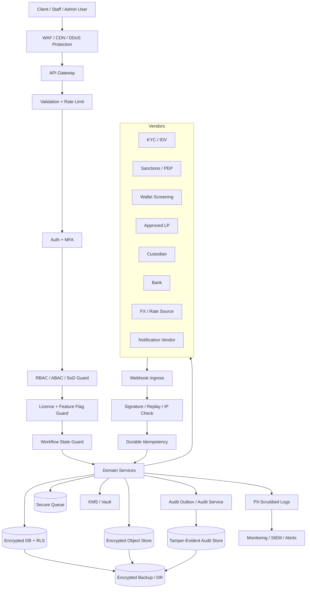

# 09 Master Security Architecture  
# AIX Money Broking Platform

## Document Control

| Item | Details |
|---|---|
| Document name | 09_Master_Security_Architecture_v1.1.md |
| Platform | AIX Money Broking Platform |
| Document type | SDLC Phase 2 / Master Security Architecture |
| Version | v1.1 |
| Status | Revised after Claude Opus security architecture review; threat model, transaction limits, field-level encryption, immutable/isolated backups, ransomware playbook, staff impersonation controls, stronger authentication, supply-chain controls, meta-audit, service-to-service auth, vendor certificate pinning, and rule-mapping reconciliation added |
| Prepared for | Security, compliance, architecture, DevOps, development, QA, operations, finance, and management |
| Base document 1 | 00_Licence_Scope_And_Feature_Lock_v1.3.md |
| Base document 2 | 01_Project_Charter_v1.3.md |
| Base document 3 | 03_Master_Module_Index_v1.2.md |
| Base document 4 | 02_Software_Requirement_Specification_v1.2.md |
| Base document 5 | 04_Role_And_Permission_Matrix_v1.2.md |
| Base document 6 | 05_Master_Workflow_Map_v1.2.md |
| Base document 7 | 06_Master_System_Rules_v1.2.md |
| Base document 8 | 07_Master_Data_Flow_v1.2.md |
| Base document 9 | 08_Master_Technical_Architecture_v1.2.md |

---

## 1. Purpose

This document defines the master security architecture for the AIX Money Broking Platform.

The purpose is to translate the approved licence scope, system rules, data flows, and technical architecture into concrete security controls before testing, deployment, and module blueprint implementation.

This document covers:

1. Identity and authentication security.
2. RBAC, ABAC, maker-checker, and segregation-of-duties enforcement.
3. Client and tenant data isolation.
4. Network security and runtime zoning.
5. Encryption, secrets, keys, and certificate management.
6. Inbound webhook and vendor integration security.
7. API, application, and secure coding controls.
8. Ledger, balance, settlement, and client-money security.
9. Audit, logging, monitoring, and tamper-evidence.
10. Privacy, data protection, retention, and DSAR security.
11. Backup, DR, incident response, and break-glass.
12. CI/CD, environment, and production hardening controls.
13. Future-locked Exchange security exclusion.

---

## 2. Scope Baseline

Security controls must enforce the accepted platform boundary:

```txt
Money Broking licence = approved
PSO licence = approved
Exchange application = pending
MVP client type = institutional and HNWI/professional only
Retail onboarding = disabled by default
Execution model = agency back-to-back
Revenue model = disclosed brokerage fee only
AIX spread markup = blocked
AIX inventory limit = zero
Self-custody = disabled
Third-party custody model = required
Client money safeguarding account = required
Exchange order book = locked
Matching engine = locked
Client-to-client matching = locked
Market making = blocked
Principal dealing = blocked
```

Security must not weaken or bypass these controls.

---

## 3. Security Principles

### 3.1 Default Deny

All access and actions are denied unless explicitly allowed.

Applies to:

1. API routes.
2. Portal screens.
3. Database access.
4. File access.
5. Vendor calls.
6. Report exports.
7. Admin actions.
8. Feature flags.
9. Break-glass.
10. Production deployment.

### 3.2 Defence in Depth

Security must not rely on a single layer.

Minimum layers:

1. WAF / edge protection.
2. API authentication.
3. Backend permission guard.
4. Workflow state guard.
5. Client status guard.
6. Feature flag guard.
7. Licence-lock guard.
8. Database tenant isolation.
9. Audit and monitoring.
10. Maker-checker and SoD.

### 3.3 Fail Closed

Security decision failure must fail closed.

Examples:

1. Vendor signature verification fails.
2. Permission service unavailable.
3. Feature flag state unknown.
4. KYC vendor unavailable.
5. LP unavailable.
6. Audit outbox unavailable.
7. Encryption key unavailable.
8. Scheduler missed critical run.
9. Data residency unresolved.
10. Licence lock status unknown.

### 3.4 No Security by Frontend

Frontend hiding is not a security control.

Every sensitive action must be enforced in backend.

### 3.5 Regulated Security First

For conflict between usability and regulated control, regulated control wins.

---

## 4. Master Threat Model

### 4.1 Threat Model Purpose

This master threat model anchors the security architecture and must be completed before go-live.

The threat model must be refined in each high-risk module blueprint.

### 4.2 Critical Assets

| Asset | Classification | Why It Matters |
|---|---|---|
| Client money | Financial Critical | Safeguarding, liability, fraud prevention |
| Ledger and balances | Financial Critical | Financial source of truth |
| Holds and settlements | Financial Critical | Prevents double-spend and AIX exposure |
| KYC/KYB documents | Restricted | Client identity and regulatory evidence |
| BO / SOF / SOW / EDD data | Restricted | AML/CFT evidence |
| STR / suspicious activity records | Highly Restricted | Tipping-off and regulatory confidentiality |
| Travel Rule data | Restricted / Highly Restricted | Digital asset transfer compliance |
| Wallet screening results | Restricted | AML and sanctions exposure |
| Bank and wallet identifiers | Restricted | Payout and fraud risk |
| LP, custodian, bank credentials | Security Critical | Money movement and settlement risk |
| Webhook HMAC secrets | Security Critical | Prevents spoofed callbacks |
| Encryption keys | Security Critical | Protects all sensitive records |
| Audit log | Security Critical | Evidence and non-repudiation |
| Feature flags / licence locks | Security Critical | Prevents exchange/principal-dealing breach |
| Admin and privileged accounts | Security Critical | High-impact operational access |

### 4.3 Threat Actors

| Threat Actor | Examples |
|---|---|
| External attacker | Credential stuffing, API abuse, webhook spoofing, ransomware |
| Compromised client user | Account takeover, withdrawal abuse, payout-destination fraud |
| Malicious insider | Unauthorised data access, ledger tampering attempt, audit reconnaissance |
| Compromised staff account | Support-view abuse, approval abuse, data export |
| Compromised vendor | Poisoned screening result, false callback, data leakage |
| Compromised developer or CI/CD path | Supply-chain compromise, secret leakage |
| Cloud/operator misconfiguration | Public bucket, exposed database, weak network rules |
| Ransomware actor | Backup deletion/encryption, operational disruption |

### 4.4 Trust Boundaries

| Boundary | Security Control |
|---|---|
| User browser to WAF/API | TLS, WAF, rate limit, validation |
| API to Auth/RBAC | AuthN/AuthZ, session validation |
| Client scope to platform data | Tenant scoping, RLS/app scoping |
| Staff portal to sensitive records | RBAC, reason, read audit |
| Backend to database | Private network, least privilege, encryption |
| Backend to KMS/vault | Workload identity, audit |
| Backend to vendors | Approved adapter, mTLS/cert controls where applicable |
| Vendor webhook to platform | HMAC/signature, replay, IP allowlist, idempotency |
| Production to backup/DR | Encryption, immutable retention, isolated copy |
| CI/CD to production | Protected branches, signed artefacts, approval |

### 4.5 Top Threats and Mitigations

| Threat | Mitigations |
|---|---|
| Spoofed deposit callback credits fake balance | Webhook HMAC/signature, replay protection, inbound idempotency, verified bank/custodian evidence, no direct ledger write |
| Account takeover drains approved payout destination | MFA/step-up, velocity/value limits, anomaly holds, client-side dual auth, withdrawal maker-checker, monitoring |
| Staff impersonates client and initiates transaction | Read-only impersonation/support-view, no transaction execution, time-boxing, reason, heightened audit |
| Insider reads STR or audit trail silently | Highly restricted RBAC, sensitive read logging, meta-audit of audit-log reads/exports, access review |
| Ransomware encrypts production and backups | Immutable/WORM backup, isolated/air-gapped copy, restore integrity test, ransomware playbook |
| Cross-client data leakage | App tenant scoping, DB RLS/equivalent, release-gate isolation tests |
| Ledger tampering or balance override | Ledger service only, immutable entries, no direct edit/delete, audit atomicity, reconciliation |
| Principal exposure through LP failure | Pre-funded hold, LP fail-closed, no fallback pricing, DvP sequencing, exception workflow |
| Secret leakage in repo/logs/AI prompts | KMS/vault, secret scanning, log scrubbing, no secrets in AI prompts, rotation |
| Supply-chain compromise | SBOM, pinned dependencies, signed builds, provenance/attestation, CI/CD scanning |
| Exchange lock bypass | Hard feature flags, no routes/services, no break-glass bypass, negative tests |
| Vendor MITM or rogue endpoint | TLS, vendor certificate validation/pinning where appropriate, allowlisted endpoints, adapter controls |

Parameter:

```txt
threat_model = required_before_go_live
```

---

## 5. Security Architecture Diagram



---

## 6. Identity and Authentication Security

### 6.1 User Categories

| User Category | Authentication Requirement |
|---|---|
| Client Owner | Password + MFA / step-up where configured |
| Client User | Password + MFA / step-up where configured |
| Client Approver | Password + MFA required for approval actions |
| Staff User | Password + MFA required |
| Admin / Super Admin | Password + phishing-resistant MFA preferred / required before production |
| Security / Tech Admin | Password + phishing-resistant MFA preferred / required before production |
| Auditor | Password + MFA required |
| System Service Account | Non-human credential, scoped, rotated |

### 6.2 Password Security

Rules:

1. Passwords must be hashed with approved adaptive hashing.
2. Passwords must never be stored as plaintext.
3. Passwords must never be logged.
4. Password reset token must be short-lived and single-use.
5. Password reset must be audit logged.
6. Staff password reset requires maker-checker where applicable.
7. Suspicious password reset attempt triggers security monitoring.
8. Account-lockout or progressive-delay policy is required.
9. Unlock workflow must balance brute-force protection with denial-of-service risk.

### 6.3 MFA Security

Rules:

1. Staff MFA is mandatory.
2. Admin/Super Admin/Security/Tech MFA is mandatory.
3. Client MFA or step-up MFA is required for sensitive flows where configured.
4. Client Approver approval action must require MFA/step-up where configured.
5. MFA secrets must be encrypted at rest.
6. MFA reset requires maker-checker.
7. MFA bypass is prohibited except controlled break-glass.
8. MFA events must be audit logged.
9. Phishing-resistant MFA such as FIDO2/WebAuthn is required for Admin, Super Admin, Security Admin, and Tech Admin before production unless formally risk accepted.
10. SMS-only MFA is not sufficient for privileged roles.

### 6.4 Session Security

Rules:

1. Sessions must be server-controlled.
2. Session tokens must be short-lived or revocable.
3. Refresh tokens must be protected.
4. Session fixation prevention is required.
5. Session invalidation is required after password reset, MFA reset, high-risk role change, or account freeze where applicable.
6. Admin sessions require shorter timeout.
7. Sensitive actions may require step-up authentication.
8. Session tokens must never be logged.
9. New-device or new-location login must trigger notification and may trigger step-up authentication.
10. High-risk session changes must be audit logged.

### 6.5 Service Account Security

Rules:

1. Service accounts must be non-human.
2. Service account permissions must be scoped.
3. Service account secrets must be in KMS/vault.
4. Service account usage must be audit logged.
5. Service account rotation policy is required.
6. Service accounts must not be used for human login.
7. Production service accounts must not exist in lower environments.

---

## 7. Authorization Security

### 7.1 RBAC and ABAC

Authorization must combine:

1. Role.
2. Permission.
3. Client ownership / tenant scope.
4. Workflow state.
5. Feature flag.
6. Client status.
7. Licence lock.
8. Data classification.
9. Maker-checker status.
10. SoD conflict status.

### 7.2 Backend Permission Guard

Every protected endpoint must call backend permission guard.

The guard must evaluate:

```txt
actor
role
permission
client_id / tenant scope
entity ownership
workflow state
feature flag
client status
licence lock
data classification
SoD conflict
maker-checker requirement
```

### 7.3 Segregation-of-Duties

The security architecture must enforce all SOD-001 to SOD-020 controls from the Role and Permission Matrix.

Rules:

1. Maker cannot approve own request.
2. Client initiator cannot approve same client-side action.
3. Admin cannot approve own role/permission change.
4. Ledger reversal maker cannot approve same reversal.
5. LP settlement payment maker cannot approve same LP payment.
6. Break-glass grantor cannot be recipient.
7. Complaint owner cannot close own complaint without oversight.
8. Unknown SoD result fails closed.

### 7.4 Maker-Checker Security

Maker-checker must be enforced for:

1. Client approval.
2. Professional/accredited status.
3. High-risk client.
4. Payout destination.
5. Withdrawal.
6. LP settlement payment.
7. Ledger reversal.
8. Reconciliation break closure.
9. Safeguarding shortfall closure.
10. Feature flag.
11. Role/permission.
12. Vendor approval.
13. Asset/pair activation.
14. Production deployment.
15. Break-glass access.

### 7.5 Privileged Access

Privileged actions require:

1. Strong MFA.
2. Maker-checker.
3. SoD check.
4. Audit event.
5. Reason/comment where sensitive.
6. Alert where high-risk.
7. Time-boxing where temporary.

---

## 8. Per-Client Data Isolation

### 8.1 Isolation Model

The platform must use defence-in-depth:

```txt
application tenant/client scoping
+ database row-level security or equivalent database-level guard where feasible
+ strict API authorization
+ staff-access reason and audit logging
```

### 8.2 Client Portal Isolation

Rules:

1. Client portal APIs must always be scoped to authenticated client ID.
2. Client cannot supply arbitrary client ID to access other client records.
3. Server must derive client scope from authenticated session, not request body.
4. Client-side data export is own-record only.
5. Client statements, trades, balances, and documents must be scoped by client ID.
6. Missing client scope fails closed.

### 8.3 Staff Portal Cross-Client Access

Rules:

1. Staff access must be role-scoped.
2. Sensitive client record read must be logged.
3. Restricted records require permission.
4. STR records require special permission.
5. Bulk export requires approval and audit.
6. Staff cannot access data outside role purpose.


### 8.4 Staff Impersonation / Support-View Control

Staff impersonation or support-view must be explicitly controlled.

Rules:

1. Impersonation / support-view is disabled by default.
2. Support-view must be read-only by default.
3. Staff must not execute trades, withdrawals, payout destination changes, client approvals, or consent as the client.
4. Any act-as-client function requires explicit permission and formal approval.
5. Access must be justified with ticket/case reference.
6. Access must be time-boxed.
7. Access must be heightened-audited.
8. Client notification or visibility should be applied where required by policy.
9. Support-view must clearly display that the staff user is viewing as support, not acting as client.
10. Break-glass cannot be used to bypass transaction prohibition as client.

Parameter:

```txt
staff_impersonation = explicit_readonly_timeboxed_heightened_audit
```

### 8.5 Database-Level Isolation

Rules:

1. Client-owned tables must include client_id or equivalent ownership key.
2. Database RLS or equivalent guard should be used where feasible.
3. Direct ad-hoc production database access is prohibited except emergency controlled access.
4. Reporting read models must preserve tenant scope.
5. Cross-client isolation tests are release gates.

---

## 9. Network Security Architecture

### 9.1 Network Zones

| Zone | Security Control |
|---|---|
| Public Edge | WAF, DDoS protection, TLS |
| API Zone | Rate limiting, validation, auth |
| Application Zone | Private subnets, no public DB access |
| Data Zone | Private, encrypted, restricted |
| Integration Zone | Controlled egress and verified ingress |
| Admin Zone | MFA, IP/device controls where applicable |
| Monitoring Zone | PII-scrubbed logs, restricted access |
| Backup / DR Zone | Encrypted, access-controlled, residency-approved |

### 9.2 Ingress Security

Allowed ingress:

1. User traffic through WAF/API only.
2. Vendor webhooks through Webhook Ingress only.
3. Admin access through approved staff/admin portal only.
4. Monitoring access through approved security channel.

Blocked ingress:

1. Direct database access from public internet.
2. Direct object storage public access.
3. Direct service-to-service public exposure unless approved.
4. Unverified vendor callback.
5. Internal service calls without approved service identity where service extraction exists.

### 9.3 Egress Security

Rules:

1. Egress must be restricted to approved vendors.
2. Vendor endpoints must be configured per environment.
3. Production vendor credentials must not be used outside production.
4. Sensitive data must not be sent to unapproved analytics or AI tools.
5. Egress logs must not expose secrets or full PII.
6. Internal service-to-service communication must use mTLS or workload identity where services are extracted.
7. Critical financial-vendor egress should use certificate pinning or equivalent endpoint authenticity control where feasible.

---

## 10. API and Application Security

### 10.1 API Security Controls

Every API must implement:

1. Authentication.
2. Authorization.
3. Input validation.
4. Rate limiting.
5. Idempotency where applicable.
6. CSRF protection where applicable.
7. Replay protection where applicable.
8. Correlation ID.
9. Audit event where sensitive.
10. Error handling without sensitive leakage.

### 10.2 Input Validation

Rules:

1. Strict schema validation.
2. Reject unexpected critical fields.
3. Validate amount, asset, pair, wallet, bank, ID, document, and date fields.
4. Validate precision and rounding.
5. Validate file type and size.
6. Validate webhook payload schema.
7. Sanitise free-text fields.
8. Reject invalid enum/state transitions.

### 10.3 Rate Limiting and Abuse Protection

Rate limiting required for:

1. Login.
2. MFA.
3. Password reset.
4. OTP request.
5. Registration.
6. Document upload.
7. Quote request.
8. Withdrawal submission.
9. Payout destination submission.
10. Webhook endpoint.
11. Report export.
12. Admin actions.

### 10.4 Secure Error Handling

Rules:

1. Errors must not disclose secrets.
2. Errors must not disclose whether a sanctions/STR case exists.
3. Auth errors must avoid account enumeration.
4. Vendor errors must be mapped to safe internal codes.
5. Financial errors must include correlation ID.
6. Client-visible errors must be non-sensitive.

---

## 11. Encryption, Key, and Secret Management

### 11.1 Encryption in Transit

Rules:

1. TLS required for all client, staff, admin, vendor, and service communication.
2. Internal service communication must be encrypted where supported.
3. Weak TLS configurations are prohibited.
4. Certificates must be managed and rotated.
5. Expired certificates must alert and fail safe.

### 11.2 Encryption at Rest

Encrypt at rest:

1. Primary database.
2. Object storage.
3. Audit store.
4. Backup store.
5. Cache where sensitive.
6. Queue where sensitive.
7. Log store where sensitive.
8. KYC/KYB documents.
9. Travel Rule data.
10. AML/STR records.
11. Bank and wallet data.


### 11.3 Field-Level / Application-Level Encryption

Field-level, envelope, or application-level encryption is required for Security Critical and Highly Restricted fields where feasible.

Minimum fields requiring field-level encryption or tokenisation:

1. MFA secrets.
2. Recovery codes.
3. Bank account identifiers.
4. Wallet ownership identifiers.
5. Government ID / document numbers.
6. STR content and filing package fields.
7. Travel Rule sensitive payload fields.
8. Beneficial ownership sensitive identifiers.
9. SOF/SOW highly sensitive evidence metadata.
10. Vendor/API secrets and HMAC secrets.

Rules:

1. Field-level encryption is layered on top of storage-at-rest encryption.
2. Keys must be managed through KMS/vault.
3. Decryption access must be permission-controlled and audit logged.
4. Tokenisation should be used where the platform only needs reference or display masking.
5. Reports and exports must use masked/tokenised values unless full value is explicitly approved.
6. Backups and replicas must not weaken field-level encryption.

Parameters:

```txt
field_level_encryption_sensitive = required
tokenisation_where_applicable = recommended
```

### 11.4 Key Management

Rules:

1. KMS/vault required.
2. Production keys must not be in code.
3. Production keys must not be in AI prompts, tickets, documents, or chat.
4. Key access must be restricted.
5. Key access must be audit logged.
6. Key rotation policy required.
7. Separate keys per environment.
8. Emergency key access requires break-glass.

### 11.5 Secret Management

Secrets include:

1. Database passwords.
2. API keys.
3. LP credentials.
4. Custodian credentials.
5. Bank credentials.
6. KYC/vendor credentials.
7. Webhook HMAC secrets.
8. Notification vendor secrets.
9. OAuth/client secrets.
10. Encryption keys.

Rules:

1. Store in KMS/vault only.
2. No secrets in source code.
3. No secrets in environment files committed to repository.
4. No secrets in logs.
5. No secrets in frontend.
6. Secret rotation requires maker-checker where production-impacting.
7. Secret scanning required in CI/CD.

---

## 12. Inbound Webhook and Vendor Security

### 12.1 Webhook Verification

Every inbound webhook must pass:

1. Vendor identification.
2. Signature/HMAC verification where supported.
3. Timestamp freshness check.
4. Replay/nonce/event-ID check.
5. Source allowlist where reliable.
6. Payload schema validation.
7. Idempotency check.
8. Workflow state validation.

### 12.2 Webhook Failure

Failure behaviour:

1. Do not update business state.
2. Do not credit balance.
3. Do not release withdrawal.
4. Do not mark settlement complete.
5. Do not close screening.
6. Record security event.
7. Alert if repeated or critical.

### 12.3 Vendor Credential Security

Rules:

1. Vendor credentials in KMS/vault.
2. Per-environment credentials.
3. Least-privilege vendor scopes.
4. Vendor activation depends on approval status.
5. Vendor DD and security review required.
6. Vendor secret rotation evidence retained.
7. Critical money vendors such as LP, custodian, and bank should use certificate pinning or equivalent endpoint authenticity control where feasible.
8. Vendor TLS/certificate failures must fail closed for money-critical calls.

### 12.4 Outbound Vendor Data Minimisation

Rules:

1. Send minimum required data only.
2. Avoid sending full KYC document unless necessary.
3. Do not send STR data to non-STR vendors.
4. Do not send secrets in payload.
5. Do not send unnecessary PII to notification vendor.
6. Vendor payloads must be logged only as masked metadata.

---

## 13. Ledger, Money Movement, and Client-Money Security

### 13.1 Ledger Security

Rules:

1. Ledger write only through Ledger Service.
2. Direct ledger write prohibited.
3. Direct ledger edit/delete prohibited.
4. Reversal only through approved reversal workflow.
5. Ledger posting requires idempotency.
6. Ledger posting requires audit/outbox guarantee.
7. Trial balance must net to zero.
8. Ledger schema must not be directly modified by non-ledger modules.

### 13.2 Balance Security

Rules:

1. Balance derived from ledger.
2. Direct balance edit prohibited.
3. Hold cannot exceed available balance.
4. Available balance cannot go negative.
5. Concurrent hold must be prevented.
6. Frozen balance cannot be withdrawn.
7. Held balance cannot be reused.
8. Balance query must be client-scoped.

### 13.3 Withdrawal Security

Rules:

1. Own-name payout only.
2. Verified destination only.
3. Cooling-off hard gate.
4. Client-side dual authorization where required.
5. Staff maker-checker.
6. Travel Rule and wallet screening where required.
7. AML monitoring.
8. Hold before release.
9. Release only to approved destination.
10. Reconciliation path required.


### 13.4 Transaction Limits and Approval Thresholds

Money movement must be protected by configurable value, velocity, and approval thresholds.

Controls:

1. Per-transaction withdrawal limit.
2. Daily withdrawal limit.
3. Rolling 24-hour withdrawal limit.
4. Per-destination limit.
5. New-destination first-withdrawal limit.
6. Per-client risk-based limit.
7. Per-asset limit.
8. Per-currency limit.
9. Large trade threshold.
10. Value-tiered staff approval.
11. Anomaly-triggered hold.
12. Velocity-triggered hold.

Rules:

1. Limits are enforced by backend before release or execution.
2. Limit breach blocks or holds workflow.
3. High-value withdrawal requires senior / dual staff approval.
4. Rapid drain pattern triggers transaction monitoring alert.
5. Limit changes require maker-checker and audit.
6. MLRO/Compliance review required for high-risk override.
7. Client-side approval does not replace platform value/velocity limits.
8. Approved payout destination does not bypass value/velocity controls.

Error / alert categories:

```txt
TRANSACTION_LIMIT_EXCEEDED
WITHDRAWAL_VELOCITY_ALERT
ANOMALY_HOLD_TRIGGERED
VALUE_TIER_APPROVAL_REQUIRED
```

Parameters:

```txt
withdrawal_velocity_limits = required
transaction_value_limits = required
value_tiered_staff_approval = required
anomaly_based_hold = required
```

### 13.5 LP Settlement Payment Security

Rules:

1. LP payment requires verified LP execution reference.
2. LP payment requires DvP/safeguarded sequence pass.
3. LP payment requires maker-checker.
4. No LP payment before client-side fund/asset control.
5. Reconciliation linkage required.
6. LP payment maker cannot approve same payment.
7. Failed LP settlement triggers exception workflow.

### 13.6 Client-Money Security

Rules:

1. Client money must be fully backed.
2. Client money cannot be used for AIX operations.
3. Safeguarding computation must be scheduled.
4. Shortfall alerts are Critical.
5. Shortfall closure requires Finance and Compliance approval.
6. Client-money reports are export-controlled.

---

## 14. Quote, LP, and Exchange-Lock Security

### 14.1 Quote Security

Rules:

1. Quote must be LP-derived.
2. Brokerage fee displayed separately.
3. Manual markup prohibited.
4. FX/rate source approved.
5. Precision/rounding policy applied.
6. Best-execution check required.
7. Quote expiry uses server UTC.
8. Expired quote cannot be accepted.
9. Re-quote requires fresh client confirmation.

### 14.2 Agency Execution Security

Rules:

1. Pre-funded hold before LP execution.
2. LP outage fails closed.
3. No internal fallback pricing.
4. No residual AIX position.
5. Partial fill/slippage beyond tolerance voids, reverses, or re-quotes.
6. No AIX principal absorption.

### 14.3 Exchange-Lock Security

Hard-blocked:

```txt
public_order_book
matching_engine
client_to_client_matching
public_exchange_trading
market_maker
maker_taker_fee_engine
resting_order_database
public_market_api
```

Security controls:

1. Feature flags hard false.
2. API routes disabled.
3. No production deployment path.
4. No client UI link.
5. No backend runtime connection.
6. No break-glass bypass.
7. Security tests verify blocked paths.

---

## 15. Compliance, AML, Travel Rule, and STR Security

### 15.1 KYC/KYB Security

Rules:

1. KYC/KYB documents encrypted.
2. Document access logged.
3. Malware scanning required.
4. BO, SOF/SOW, EDD data restricted.
5. Compliance decisions maker-checker.
6. EDD required for high-risk.
7. Periodic refresh scheduled.
8. Sanctions re-screening on list update.

### 15.2 AML Case Security

Rules:

1. AML cases restricted.
2. Case access logged.
3. STR records highly restricted.
4. STR data never visible to client.
5. Tipping-off protection enforced.
6. MLRO approval required for STR filing.
7. STR filing evidence retained.
8. STR export approval-gated.

### 15.3 Travel Rule Security

Rules:

1. Travel Rule data encrypted.
2. Missing data blocks transfer.
3. Read access logged.
4. Counterparty VASP data approved.
5. Self-hosted wallet handling controlled.
6. Data retention applied.

### 15.4 Wallet Screening Security

Rules:

1. Wallet screening required for relevant crypto flows.
2. High-risk result blocks transfer.
3. Sanctions exposure may trigger freeze.
4. Mixer/taint exposure may trigger AML case.
5. Disposition requires compliance review.
6. Screening evidence retained.

---

## 16. Audit, Logging, and Monitoring Security

### 16.1 Audit Architecture

Audit must be:

1. Append-only.
2. Tamper-evident.
3. Encrypted.
4. Restricted.
5. Retention-controlled.
6. Search/export controlled.
7. Protected from delete/modify.
8. Audit-log read access must itself be audit logged.
9. Audit-log export must require approval and be audit logged.
8. Linked to workflow and actor.
9. Server UTC timestamped.
10. Hash-chain or equivalent tamper-evidence.

### 16.2 Audit-Write Atomicity

Sensitive actions must not commit without audit guarantee.

Approved models:

1. Same-transaction audit reference; or
2. Same-transaction audit outbox + guaranteed audit worker + missing-audit reconciliation.

Rules:

1. Missing audit creates Critical alert.
2. Audit outbox must be idempotent.
3. Audit worker failure must be monitored.
4. Audit hash-chain can be async only after durable raw event.
5. Sensitive action with no audit/outbox is prohibited.

### 16.3 Log Security

Logs must not contain:

1. Password.
2. OTP.
3. Session token.
4. Production secret.
5. API key.
6. Full bank account.
7. Full KYC document.
8. STR contents.
9. Full Travel Rule payload.
10. Full wallet screening evidence unless approved and masked.

### 16.4 Monitoring and Alerting

Critical alerts:

1. Ledger imbalance.
2. Client-money shortfall.
3. LP outage.
4. Bank/custodian outage.
5. Webhook verification failure spike.
6. Suspicious login spike.
7. MFA reset anomaly.
8. Scheduler missed safeguarding run.
9. Scheduler missed reconciliation run.
10. Missing audit event.
11. Failed backup.
12. Failed DR restore.
13. Break-glass use.
14. Cross-client access attempt.
15. Exchange-locked route access attempt.
16. Transaction limit breach.
17. Withdrawal velocity anomaly.
18. Staff impersonation/support-view usage.
19. Audit-log read/export access.
20. Ransomware indicators.

---

## 17. Privacy, Data Protection, and Records Security

### 17.1 Data Classification

Security controls depend on classification:

1. Public.
2. Internal.
3. Confidential.
4. Restricted.
5. Highly Restricted.
6. Financial Critical.
7. Security Critical.

### 17.2 Data Minimisation

Rules:

1. Collect only required data.
2. Send only required vendor data.
3. Export only required report fields.
4. Notification payload minimised.
5. Logs scrubbed.
6. DSAR response minimised and approved.

### 17.3 Data Residency

Rules:

1. Production region must be approved.
2. Vendor cross-border processing reviewed.
3. Backup location approved.
4. Log storage location approved.
5. Notification vendor data processing reviewed.
6. Data residency violation blocks production go-live.

### 17.4 Retention and Legal Hold

Rules:

1. Retention policy required.
2. AML, STR, ledger, audit, Travel Rule records cannot be deleted outside policy.
3. Legal hold overrides deletion.
4. Archive retrieval audit logged.
5. DSAR deletion cannot override AML/legal/financial retention.

---

## 18. File Upload and Document Security

### 18.1 Upload Controls

Rules:

1. File type allowlist.
2. File size limit.
3. Malware scanning.
4. Content validation where possible.
5. Encrypted object storage.
6. Private bucket/object only.
7. Short-lived pre-signed access.
8. Upload audit event.

### 18.2 Document Access

Rules:

1. Access requires permission.
2. Sensitive read logged.
3. No public URL.
4. No direct object path exposure.
5. Download/export controlled.
6. STR or AML evidence access restricted.

---

## 19. Break-Glass and Incident Security

### 19.1 Break-Glass Access

Rules:

1. Time-boxed.
2. Named user only.
3. Grantor not recipient.
4. Reason required.
5. Senior approval required.
6. Heightened audit.
7. Auto-alert Security/Management/Compliance where relevant.
8. Post-incident review mandatory.
9. No licence-lock bypass.
10. No audit bypass.

### 19.2 Incident Response

Incident categories:

1. Security breach.
2. Data leakage.
3. Fraud/account takeover.
4. Client-money shortfall.
5. Ledger imbalance.
6. Vendor outage.
7. LP outage.
8. Custodian/bank failure.
9. STR/tipping-off risk.
10. Exchange-lock attempted bypass.
11. Production secret exposure.
12. Ransomware or destructive malware.
13. Backup tampering or deletion attempt.

Incident response requires:

1. Severity classification.
2. Incident owner.
3. Containment.
4. Evidence preservation.
5. Regulatory assessment.
6. Client communication assessment.
7. Root cause analysis.
8. Remediation.
9. Closure approval.
10. Audit record.
11. Ransomware containment and recovery playbook where applicable.
12. Immutable/isolated backup restore path where applicable.

---

## 20. Backup, DR, and Business Continuity Security

### 20.1 Backup Security

Rules:

1. Backups encrypted.
2. Backup keys in KMS/vault.
3. Backup location residency-approved.
4. Backup access restricted.
5. Backup restore tested.
6. Backup failures alert.
7. Backup deletion follows retention/legal hold.
8. Backup access logged.
9. Immutable/WORM backup retention required for critical datasets.
10. Offline, air-gapped, or logically isolated backup copy required.
11. Restore integrity verification required.
12. Backup tamper/delete attempts must alert.

### 20.2 DR Security

Rules:

1. DR environment access restricted.
2. Restore data protected like production.
3. Restore tests documented.
4. DR credentials environment-specific.
5. DR runbook approved.
6. RTO/RPO defined.
7. DR failover does not enable locked Exchange modules.
8. DR restore does not bypass audit.
9. DR restore must verify backup integrity before use.
10. Ransomware recovery scenario must be tested.

### 20.3 BCP Security

Business continuity must cover:

1. LP outage.
2. Custodian outage.
3. Bank outage.
4. KYC/AML vendor outage.
5. Cloud outage.
6. Notification outage.
7. Security incident.
8. Client-money safeguarding issue.
9. Reconciliation break.
10. Data restoration.
11. Ransomware recovery.
12. Immutable-backup restore.

---

## 21. CI/CD and Environment Security

### 21.1 Source Control

Rules:

1. Protected main branch.
2. Pull request required.
3. No direct push to main.
4. Code owner review for critical modules.
5. Commit signing recommended.
6. Dependency versions must be pinned or locked.
7. SBOM required for production releases.
8. Build artefacts should be signed.
9. Build provenance / attestation required where tooling supports it.
6. Sensitive config not stored in repository.

### 21.2 Security Scans

Required scans:

1. SAST.
2. Dependency scanning.
3. Secret scanning.
4. Container/image scanning where applicable.
5. IaC scanning.
6. DAST before production.
7. Malware scanning for uploaded files.
8. Licence/dependency review where relevant.
9. SBOM generation.
10. Build provenance / signed artefact verification.

### 21.3 Environment Separation

Rules:

1. No production data in dev.
2. No production secrets in non-production.
3. Separate credentials per environment.
4. Sandbox vendors for non-production.
5. Production deployment requires approval.
6. Exchange-locked modules disabled in all production-like environments.

### 21.4 Deployment Security

Production deployment requires:

1. CI checks passed.
2. Security scans passed or formally risk accepted.
3. Test suite passed.
4. Migration reviewed.
5. Rollback plan.
6. Feature flags verified.
7. Exchange modules disabled verified.
8. Maker-checker approval.
9. In-flight transaction handling.
10. Deployment audit event.

Risk acceptance must capture:

1. Named approver.
2. Rationale.
3. Residual-risk rating.
4. Remediation owner.
5. Target remediation date.

---

## 22. Future-Locked Exchange Security Exclusion

The following must remain inaccessible in MVP:

```txt
public_order_book_service
matching_engine_service
client_to_client_matching_service
market_maker_service
principal_dealing_service
maker_taker_fee_engine
resting_order_database
public_market_api
```

Security requirements:

1. No route.
2. No permission.
3. No frontend component.
4. No deployed service.
5. No feature flag enablement.
6. No database table used by MVP runtime.
7. No break-glass path.
8. No admin override.
9. Negative security tests required.

---

## 23. Security Testing Requirements

Security testing must include:

1. Authentication tests.
2. MFA tests.
3. Password reset tests.
4. Session expiry/revocation tests.
5. RBAC denial tests.
6. SoD conflict tests.
7. Maker-checker bypass tests.
8. Cross-client isolation tests.
9. RLS/application-scoping tests.
10. Sensitive read audit tests.
11. Input validation tests.
12. Rate limiting tests.
13. Webhook signature/replay tests.
14. Spoofed deposit callback block test.
15. Secret scanning tests.
16. Encryption configuration tests.
17. File upload malware tests.
18. Ledger direct-write block tests.
19. Direct balance edit block tests.
20. Audit delete/modify block tests.
21. Audit-write atomicity tests.
22. Log PII scrubbing tests.
23. STR tipping-off protection tests.
24. Break-glass controls tests.
25. Backup restore security tests.
26. Data residency gate tests.
27. Exchange-locked route block tests.
28. Production deployment gate tests.
29. Pen test before go-live.
30. DR restore test before go-live.
31. Threat model review test / sign-off.
32. Transaction limit and velocity breach tests.
33. Value-tiered approval threshold tests.
34. Anomaly-based hold tests.
35. Field-level encryption / tokenisation tests.
36. Immutable/WORM backup restore test.
37. Ransomware recovery tabletop / restore test.
38. Staff impersonation/support-view abuse test.
39. Phishing-resistant MFA privileged-role test.
40. Account lockout / progressive-delay test.
41. New-device/new-location notification and step-up test.
42. SBOM and signed-build verification test.
43. Audit-read/export meta-audit test.
44. Service-to-service mTLS/workload identity test where extracted.
45. Critical vendor certificate-pinning / endpoint authenticity test.

---

## 24. Security Go-Live Gate

Production go-live requires:

1. Security architecture approved.
2. Master threat model completed and high-risk module threat models completed or scheduled with approved scope.
3. Pen test completed or formally risk accepted.
4. Critical and High vulnerabilities remediated or formally risk accepted.
5. Secrets stored in KMS/vault.
6. Encryption configured.
7. MFA enforced.
8. RBAC tested.
9. SoD tested.
10. Maker-checker tested.
11. Cross-client isolation tested.
12. Webhook security tested.
13. Audit-write atomicity tested.
14. Audit tamper-evidence tested.
15. Backup and restore tested.
16. Immutable/WORM or isolated backup recovery tested.
17. Ransomware recovery playbook approved.
18. DR runbook approved.
19. Monitoring and alerting active.
20. Incident response runbook approved.
21. Data residency approved.
22. Exchange-locked modules disabled verified.
23. Production deployment maker-checker approved.
24. Compliance/MLRO sign-off.
25. Management/Principal Officer sign-off.
26. Transaction limits and approval thresholds configured.
27. Field-level encryption/tokenisation configured for required fields.
28. Staff impersonation/support-view control tested.
29. SBOM and signed build/provenance controls verified.

---

## 25. Security Operations

### 25.1 Access Review

Access review must occur periodically and cover:

1. Staff roles.
2. Admin roles.
3. Super Admin.
4. Security/Tech roles.
5. Auditor access.
6. Service accounts.
7. Vendor access.
8. Break-glass history.
9. Staff impersonation/support-view history.
10. Audit-log read/export history.
11. Dormant users.
12. Privileged permissions.

### 25.2 Vulnerability Management

Rules:

1. Vulnerabilities tracked.
2. Severity assigned.
3. Owner assigned.
4. Remediation due date.
5. Risk acceptance controlled.
6. Repeat vulnerabilities escalated.
7. Critical vulnerabilities trigger emergency review.

### 25.3 Security Monitoring

Security monitoring must cover:

1. Authentication anomalies.
2. Privileged access.
3. Data export.
4. Sensitive read spikes.
5. Cross-client access attempts.
6. Vendor webhook failures.
7. Secret leakage.
8. Malware upload.
9. Exchange-lock bypass attempt.
10. Suspicious withdrawal patterns.

---

## 26. Open Security Decisions

The following must be finalised before production:

1. MFA method.
2. Password policy.
3. Session timeout values.
4. Step-up MFA triggers.
5. RLS implementation strategy.
6. KMS/vault provider.
7. Key rotation schedule.
8. Webhook verification method per vendor.
9. HMAC secret rotation policy.
10. WAF provider and rules.
11. DDoS protection tier.
12. SIEM/logging platform.
13. Audit hash-chain implementation.
14. Audit outbox implementation.
15. Backup encryption and residency.
16. DR RTO/RPO.
17. Pen test provider.
18. Vulnerability SLA.
19. Incident response escalation path.
20. Data retention and legal-hold configuration.
21. Break-glass max duration.
22. Privileged access review frequency.
23. Threat modelling method and template.
24. Transaction limit thresholds by client risk class.
25. Value-tiered approval thresholds.
26. Field-level encryption field list and tokenisation scheme.
27. Immutable/WORM backup provider and retention period.
28. Air-gapped/logically isolated backup design.
29. Ransomware recovery playbook owner.
30. Staff impersonation/support-view policy.
31. Phishing-resistant MFA rollout timeline.
32. Account-lockout/progressive-delay parameters.
33. SBOM/signing/provenance tooling.
34. Service-to-service mTLS/workload identity approach.
35. Vendor egress certificate-pinning feasibility per vendor.

---

## 27. Security Parameters

```txt
default_deny = true
defence_in_depth = true
fail_closed = true

staff_mfa = required
admin_strong_mfa = required
phishing_resistant_mfa_admin = required
client_step_up_mfa_sensitive_flows = required
mfa_reset_maker_checker = required
password_plaintext_storage = prohibited
session_token_logging = prohibited
account_lockout_policy = required
new_device_login_notification = required

rbac_backend_enforced = true
sod_matrix_enforced = true
maker_checker_enforced = true
self_approval = prohibited
privileged_access_timeboxed_where_temporary = true

per_client_isolation = rls_and_app_scoping
client_scope_from_session = required
cross_client_query_without_scope = prohibited
staff_impersonation = explicit_readonly_timeboxed_heightened_audit

tls_in_transit = required
encryption_at_rest_sensitive = required
field_level_encryption_sensitive = required
tokenisation_where_applicable = recommended
kms_vault = required
production_secret_in_code = prohibited
production_secret_in_logs = prohibited
production_secret_in_ai_prompt = prohibited

webhook_security = hmac_signature_replay_protection_idempotency
deposit_credit_requires_verified_inbound_event = true
source_ip_allowlist_where_supported = true
vendor_egress_cert_pinning = required_for_money_vendors

ledger_direct_write = prohibited
balance_direct_edit = prohibited
withdrawal_velocity_limits = required
transaction_value_limits = required
value_tiered_staff_approval = required
anomaly_based_hold = required
audit_write_atomicity = same_transaction_or_guaranteed_outbox_reconciled
audit_delete_modify = prohibited
audit_tamper_evidence = required

log_pii_scrubbing = required
str_tipping_off_protection = required
data_residency_approval = required_before_production
backup_encryption = required
immutable_backup = required
air_gapped_or_isolated_backup_copy = required
ransomware_incident_playbook = required
backup_restore_test = required

break_glass = timeboxed_named_user_heightened_audit
break_glass_bypass_licence_lock = prohibited

threat_model = required_before_go_live
sbom_required = true
signed_build_artifacts = required
dependency_pinning = required
audit_read_export_meta_audited = true
internal_service_mtls = required_where_extracted

exchange_locked_routes = blocked
public_order_book = prohibited
matching_engine = prohibited
client_to_client_matching = prohibited
market_making = prohibited
principal_dealing = prohibited
```

---

## 28. Security-to-Rule Mapping

| Security Area | System Rules |
|---|---|
| Default Deny | SYS-RULE-001 |
| Input Validation / Rate Limit | SYS-RULE-005 |
| Feature Flags / Configuration | CFG-RULE-001, CFG-RULE-002, CFG-RULE-003 |
| Licence Lock | LIC-RULE-001, LIC-RULE-002, LIC-RULE-003, LIC-RULE-004 |
| Asset Lock | ASSET-RULE-001 |
| Client Access | CLT-RULE-001, CLT-RULE-002, CLT-RULE-003 |
| KYC/AML | AML-RULE-001, AML-RULE-002, AML-RULE-003, AML-RULE-004, AML-RULE-005, AML-RULE-006 |
| Travel Rule / Wallet | TR-RULE-001, TR-RULE-002 |
| Payout / Withdrawal / Limits | PAY-RULE-001, PAY-RULE-002, PAY-RULE-003, AML-RULE-004 |
| Deposit / Suspense | DEP-RULE-001, DEP-RULE-002, DEP-RULE-003 |
| Quote / LP | QTE-RULE-001, QTE-RULE-002, QTE-RULE-003, LP-RULE-001, LP-RULE-002, LP-RULE-003, LP-RULE-004 |
| Ledger / Balance | LED-RULE-001, LED-RULE-002, LED-RULE-003, LED-RULE-004, LED-RULE-005 |
| Settlement / Reconciliation | SET-RULE-001, SET-RULE-002, SET-RULE-003 |
| Safeguarding | SAFE-RULE-001, SAFE-RULE-002, SAFE-RULE-003 |
| Freeze / Offboarding | FRZ-RULE-001, FRZ-RULE-002, OFF-RULE-001 |
| Vendor / Secrets | VND-RULE-001, VND-RULE-002, VND-RULE-003, VND-RULE-004 |
| Data / Records | DATA-RULE-001, DATA-RULE-002, DATA-RULE-003, REC-RULE-001 |
| Reporting | RPT-RULE-001, RPT-RULE-002, RPT-RULE-003 |
| IAM / Break-Glass / Audit | IAM-RULE-001, IAM-RULE-002, SEC-RULE-001, SEC-RULE-002, SEC-RULE-003 |
| Complaints / Privacy | CMP-RULE-001, PRIV-RULE-001 |
| Reliability / Go-Live | REL-RULE-001, GOV-RULE-001 |

---

## 29. Module Blueprint Security Requirements

Every module blueprint must include:

1. Security classification.
2. Authentication requirement.
3. Authorization rule.
4. Data classification.
5. Encryption requirement.
6. Audit events.
7. Sensitive read logging.
8. Rate limits.
9. Input validation.
10. Error handling.
11. Threat scenarios.
12. Security test cases.
13. Go-live security checklist.
14. Threat model mapping.
15. Field-level encryption requirement where applicable.
16. Transaction limit/threshold requirement where applicable.
17. Staff impersonation/support-view policy where applicable.

High-risk modules additionally require:

1. Threat model.
2. Abuse case list.
3. Pen-test scope.
4. Security monitoring events.
5. Incident playbook.
6. Break-glass consideration.
7. Data residency mapping.

---

## 30. Claude Model Usage

### 30.1 Planning Model

Use for:

1. Security architecture refinement.
2. Security test planning.
3. Module blueprint security controls.
4. Threat model drafting.
5. Claude prompt creation.

### 30.2 Claude Opus

Use for:

1. Review of this Master Security Architecture.
2. Security control gap review.
3. Regulated fintech security review.
4. Money-movement and ledger security review.
5. AML/Travel Rule and privacy security review.
6. Exchange-lock security review.

### 30.3 Claude Sonnet

Do not use Sonnet for coding until security architecture, deployment strategy, testing strategy, and relevant module blueprint are approved.

### 30.4 Claude Fable

Use later for user-facing security messages, error wording, privacy notices, and help text.

---

## 31. Claude Opus Review Prompt

```txt
Review this 09_Master_Security_Architecture_v1.1.md as a principal fintech platform architect and regulated fintech security reviewer.

Context:
- AIX has approved Money Broking and PSO licences.
- Exchange application is pending.
- This document is based on:
  - 00_Licence_Scope_And_Feature_Lock_v1.3.md
  - 01_Project_Charter_v1.3.md
  - 03_Master_Module_Index_v1.2.md
  - 02_Software_Requirement_Specification_v1.2.md
  - 04_Role_And_Permission_Matrix_v1.2.md
  - 05_Master_Workflow_Map_v1.2.md
  - 06_Master_System_Rules_v1.2.md
  - 07_Master_Data_Flow_v1.2.md
  - 08_Master_Technical_Architecture_v1.2.md
- MVP supports institutional and HNWI/professional clients only.
- Retail onboarding is disabled by default.
- Platform includes onboarding, KYC/KYB, AML, Travel Rule, transaction monitoring, payout destination whitelist, OTC/RFQ, MB Spot Broking Terminal, LP-backed agency execution, pre-funded hold, best-execution check, ledger, deposit, withdrawal, client-money safeguarding, settlement, reconciliation, audit log, maker-checker, client-side dual authorization, complaints, DSAR/privacy, break-glass access, account freeze/suspension, offboarding, periodic KYC refresh, FX/precision controls, reporting, and admin/staff/client portals.
- AIX spread markup, principal dealing, market making, internal matching, client-to-client matching, public order book, matching engine, and public exchange trading are blocked.

This v1.1 added a master threat model, transaction limits and approval thresholds, field/application-level encryption, immutable/isolated backups with ransomware playbook, staff impersonation/support-view controls, phishing-resistant MFA for privileged roles, account lockout/progressive delay, new-device/new-location notification, SBOM/signed build/provenance controls, audit-read/export meta-audit, internal service-to-service authentication, vendor egress certificate pinning for money vendors, and security-to-rule mapping reconciliation. 08_Master_Technical_Architecture_v1.2.md has been produced and remains the correct base reference.

Review for:
1. Missing security controls.
2. Missing authentication, MFA, session, or service-account controls.
3. Missing authorization, RBAC, ABAC, maker-checker, or SoD controls.
4. Missing tenant/client isolation controls.
5. Missing network, API, application, webhook, or vendor security controls.
6. Missing encryption, KMS, secret, key, or certificate controls.
7. Missing ledger, balance, client-money, settlement, or LP payment security controls.
8. Missing AML, STR, Travel Rule, privacy, DSAR, or tipping-off controls.
9. Missing audit-write atomicity, tamper-evidence, log security, or monitoring controls.
10. Missing backup, DR, incident response, break-glass, or BCP controls.
11. Missing CI/CD, environment, or deployment security controls.
12. Missing security tests or go-live gates.
13. Any control gap that could accidentally allow exchange-like, principal-dealing, market-making, client-money misuse, or cross-client data leakage.
14. Any conflict with 00, 01, 03, 02, 04, 05, 06, 07, or 08.

Do not write code.

Return only:
- Critical gaps.
- Recommended corrections.
- Additional security requirements or parameters to add.
```

---

## 32. Next Document

After this Master Security Architecture document is reviewed and accepted, the next document should be:

```txt
10_Master_Testing_Strategy.md
```

Reason:

Testing strategy should be written after security architecture is reviewed, so testing can cover requirements, workflows, rules, data flows, technical architecture, security architecture, go-live gates, and module-level acceptance criteria.
