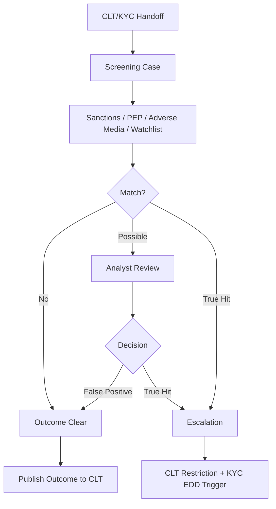
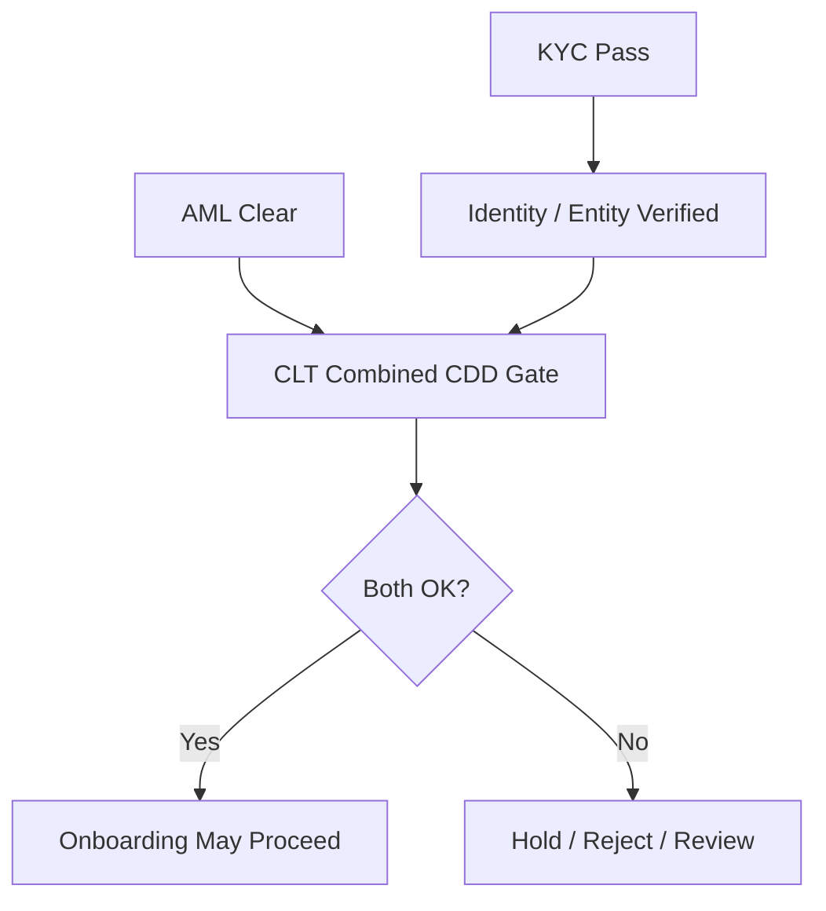
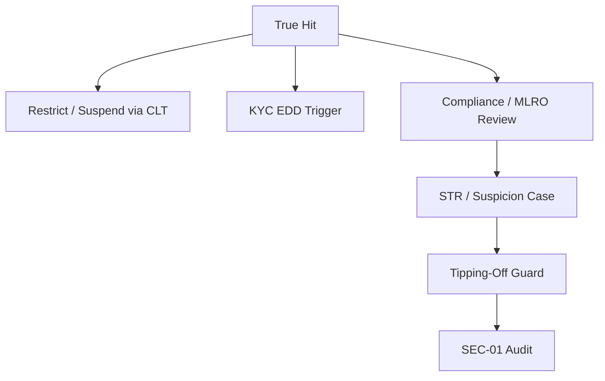
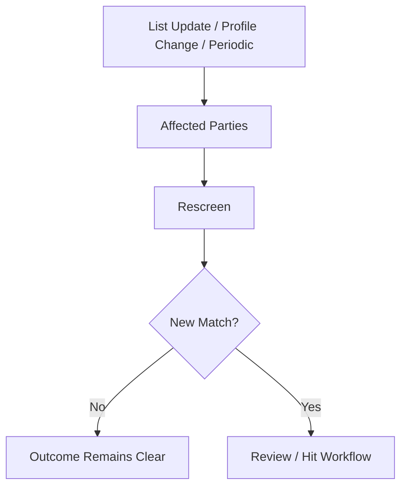
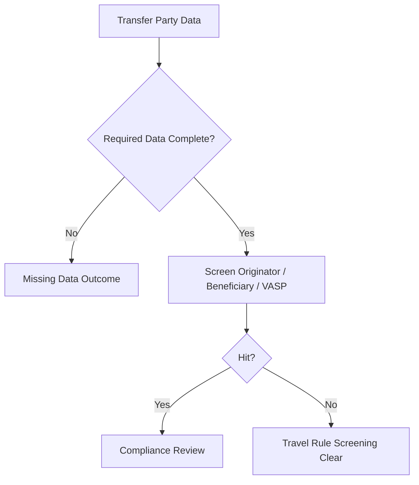

# AML-01 Sanctions / PEP / Adverse Media / Travel Rule Screening
## 03 Diagrams

## 1. Screening Flow

---

## 2. KYC / AML Boundary

---

## 3. True Hit Escalation

---

## 4. Ongoing Rescreening

---

## 5. Travel Rule Screening

