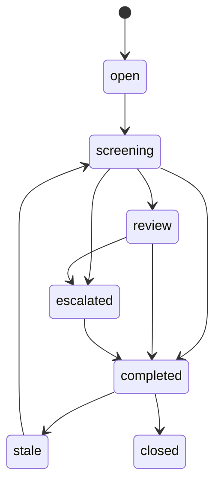
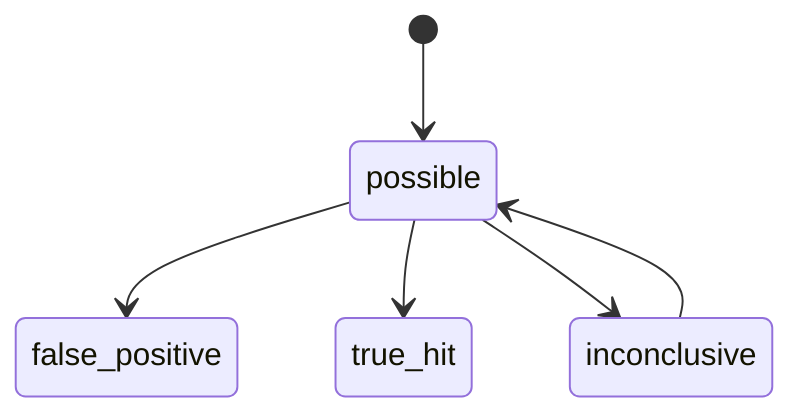
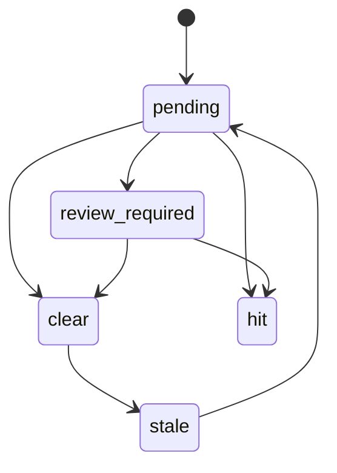
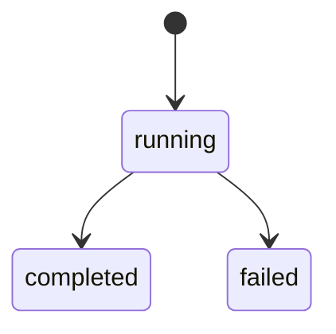
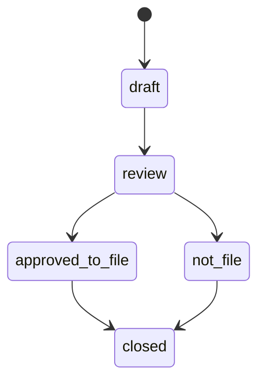

# AML-01 Sanctions / PEP / Adverse Media / Travel Rule Screening
## 06 State Machine

## 1. Screening Case State

## 2. Match Candidate State

## 3. AML Outcome State

## 4. Rescreening State

## 5. STR Case State

