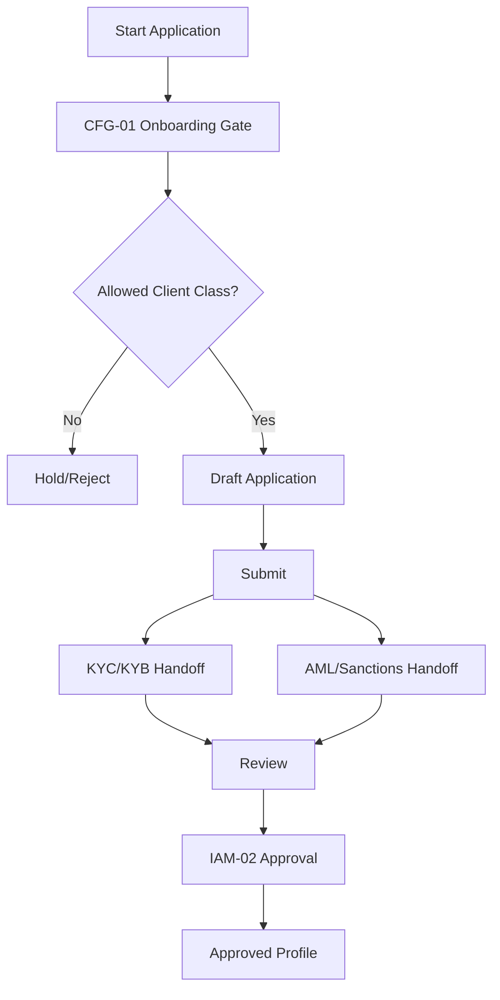
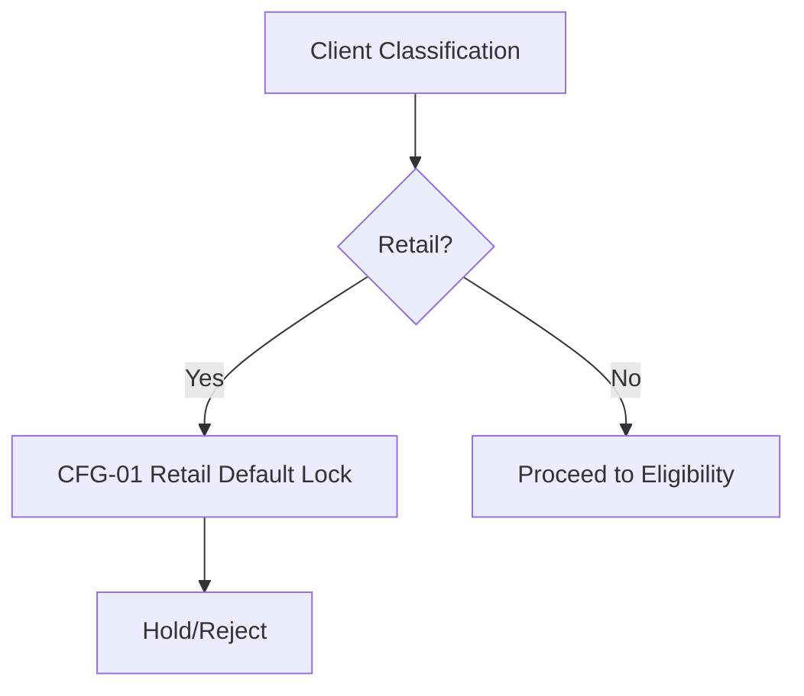
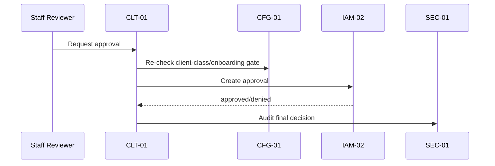
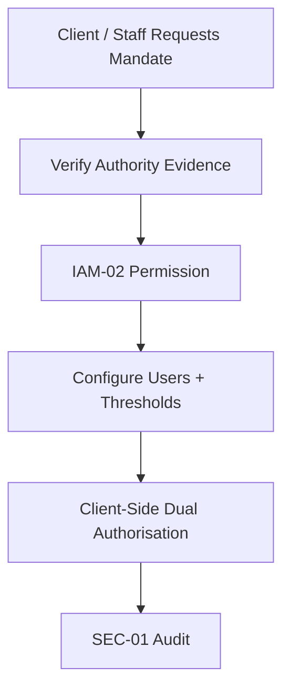
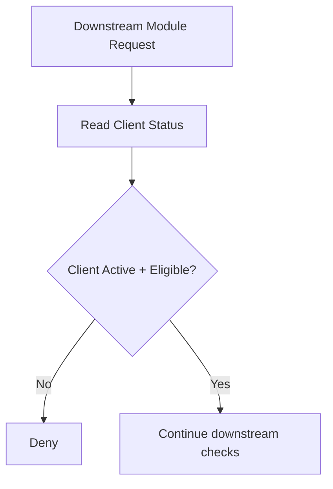

# CLT-01 Client Onboarding / Client Profile
## 03 Diagrams

## 1. Onboarding Flow

---

## 2. Retail Lock

---

## 3. Final Approval

---

## 4. Mandate Setup

---

## 5. Downstream Status Control

