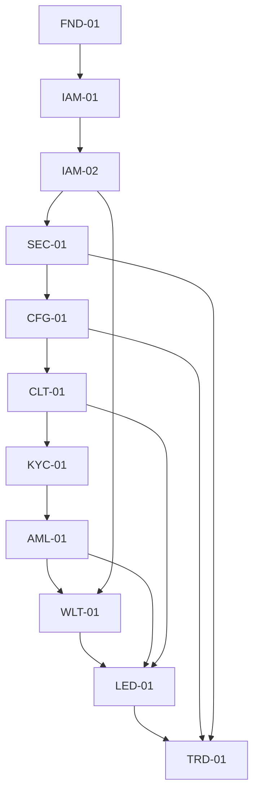

# E2E-01 Cross-Module End-to-End Fund-Flow Review
## 02 Cross-Module Architecture

## 1. Layered Architecture

```txt
Control Plane:
  FND-01  Platform foundation
  IAM-01  Authentication / MFA / session
  IAM-02  RBAC / permission guard / SoD
  SEC-01  Audit log / security monitoring
  CFG-01  Feature flag / licence lock

Compliance Tier:
  CLT-01  Client onboarding / profile / mandate
  KYC-01  KYC/KYB verification
  AML-01  Sanctions / PEP / adverse media / Travel Rule

Money Tier:
  WLT-01  Wallet screening / payout destination whitelist
  LED-01  Ledger / settlement / safeguarding
  TRD-01  Quote / trade / LP execution
```

## 2. Core Dependency Direction



## 3. Runtime Principle

No money movement or trade execution may rely on a stale prior approval.

Runtime checks are required at execution-sensitive points:

1. CFG-01 licence lock decision.
2. IAM-02 permission / maker-checker.
3. CLT-01 status and mandate.
4. AML-01 pre-transaction gate.
5. WLT-01 destination/source decision.
6. LED-01 atomic live-balance and safeguarding check.
7. TRD-01 agency execution checks.

## 4. Source of Truth by Domain

| Domain | Source of Truth |
|---|---|
| Platform request/correlation/idempotency | FND-01 |
| Authentication/session/MFA | IAM-01 |
| Permission/SoD/maker-checker | IAM-02 |
| Audit/security evidence | SEC-01 |
| Licence/feature lock | CFG-01 |
| Client status/profile/mandate | CLT-01 |
| Identity/entity verification | KYC-01 |
| AML/sanctions/PEP/adverse media/Travel Rule | AML-01 |
| Wallet/payout destination eligibility | WLT-01 |
| Ledger/balance/settlement/safeguarding | LED-01 |
| Quote/trade/LP execution | TRD-01 |

## 5. Prohibited Cross-Layer Anti-Patterns

1. TRD-01 posts ledger directly.
2. WLT-01 executes payout directly.
3. AML-01 approves onboarding by itself.
4. CLT-01 treats KYC pass as AML clear.
5. LED-01 trusts balance snapshots for reservation.
6. TRD-01 creates client fill without external LP fill.
7. IAM-02 grants prohibited Exchange permissions.
8. CFG-01 runtime lock bypassed after quote.
9. SEC-01 audit failure silently ignored.
10. Any service performs direct balance edit.
