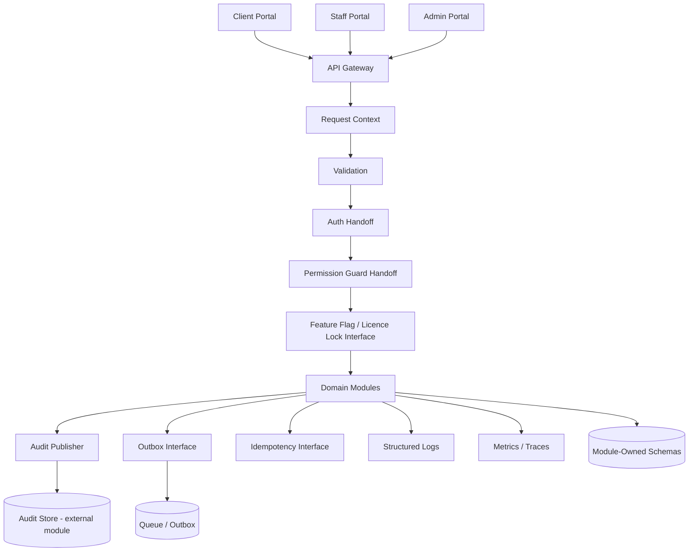
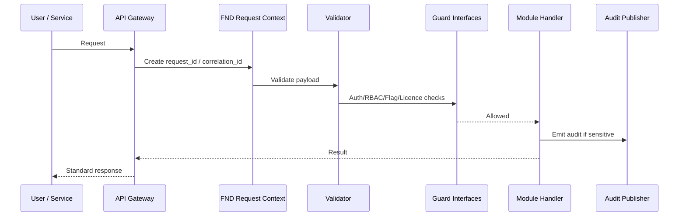
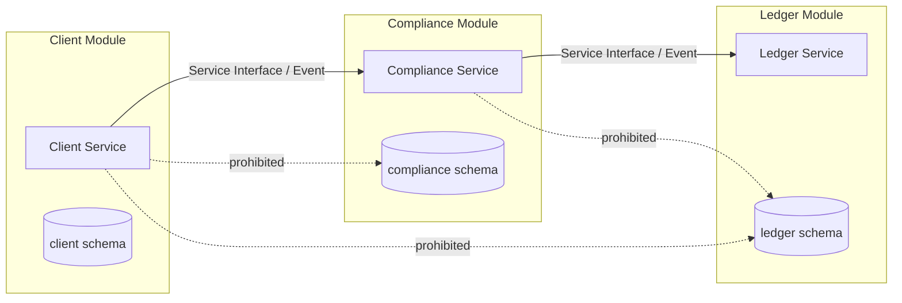
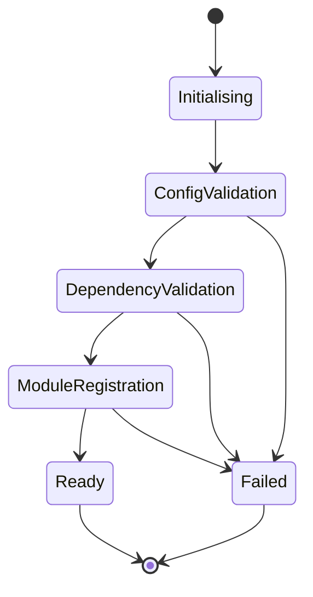
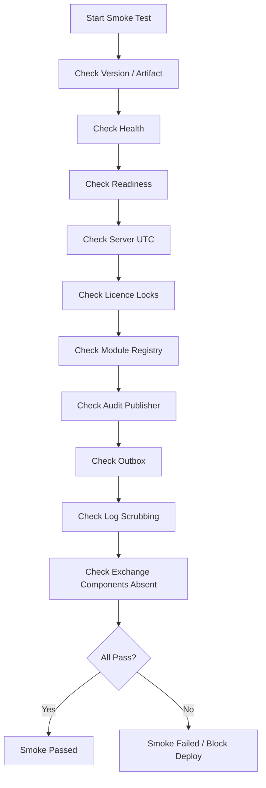
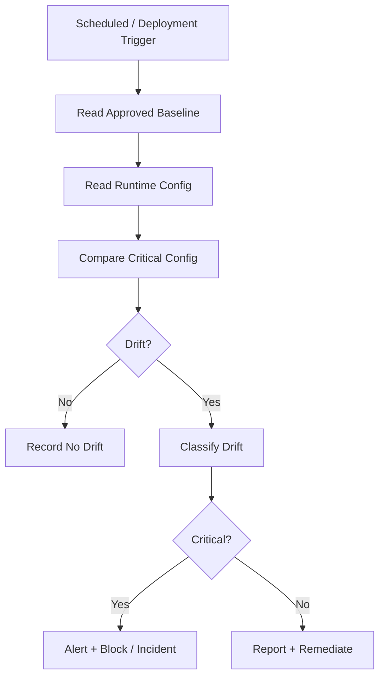

# FND-01 Platform Foundation  
## 03 Diagrams

## 1. Foundation Context Diagram

---

## 2. Request Lifecycle

---

## 3. Module Boundary Model

---

## 4. Foundation Startup

---

## 5. Deployment Smoke Flow

---

## 6. Configuration Drift Detection

