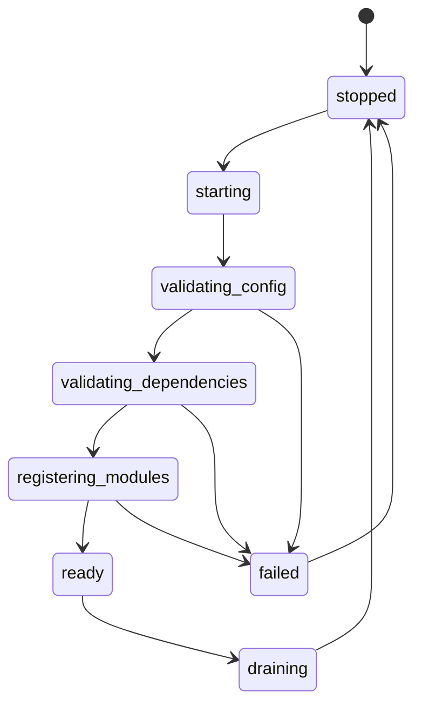
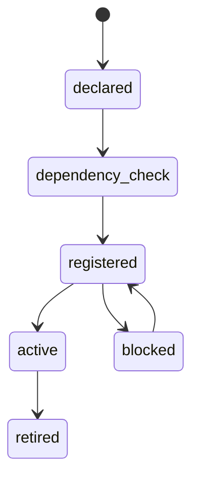
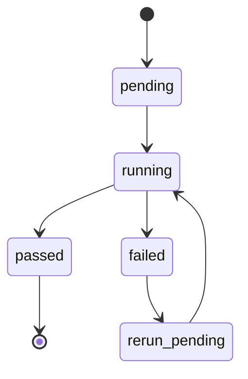
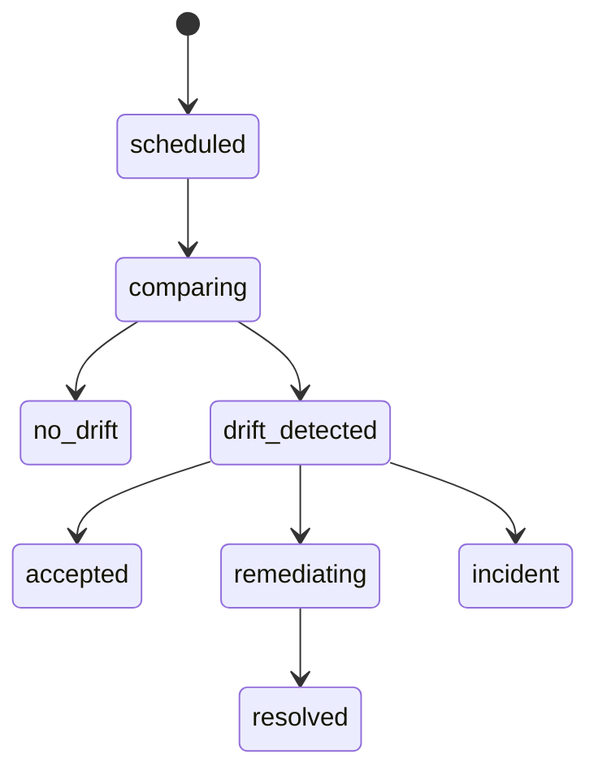
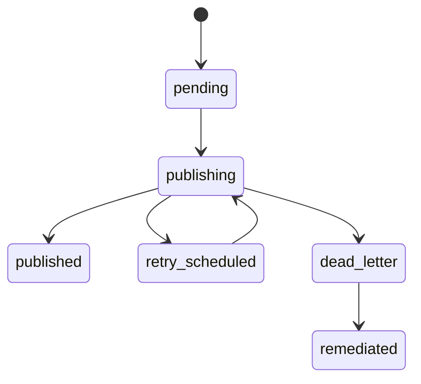
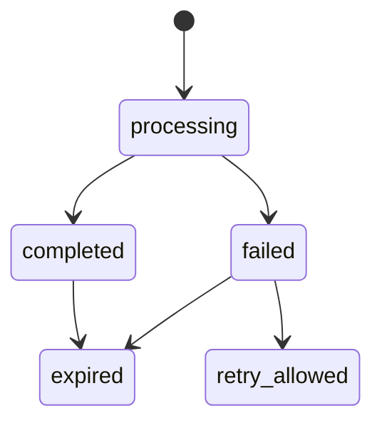

# FND-01 Platform Foundation  
## 06 State Machine

## 1. Application Runtime State

### States

| State | Meaning |
|---|---|
| stopped | Runtime not running |
| starting | Process booting |
| validating_config | Critical config being checked |
| validating_dependencies | DB/queue/cache/time/audit dependencies checked |
| registering_modules | Module registry being loaded |
| ready | Runtime ready |
| draining | Runtime stopping safely |
| failed | Startup failed |

---

## 2. Module Registration State

| State | Meaning |
|---|---|
| declared | Module exists in code/config |
| dependency_check | Dependencies being validated |
| registered | Module registered but not active |
| active | Module runtime active |
| blocked | Activation blocked |
| retired | Module retired |

Blocking conditions:

1. Dependency missing.
2. Licence lock conflict.
3. Future-locked Exchange module in MVP.
4. Owner missing.
5. Security review missing where required.

---

## 3. Deployment Smoke State

Rules:

1. Failed Critical smoke check blocks deployment.
2. Rerun requires defect fix or approved risk acceptance.
3. Smoke evidence must be retained.

---

## 4. Config Drift State

Critical drift goes to incident.

---

## 5. Outbox Event State

Rules:

1. Publishing is idempotent.
2. Dead-letter for money/audit events is Critical or High depending event.
3. Dead-letter requires controlled remediation.

---

## 6. Idempotency Record State

Rules:

1. Duplicate same fingerprint returns safe result.
2. Duplicate different fingerprint is rejected.
3. Financial idempotency retention must match records policy.
