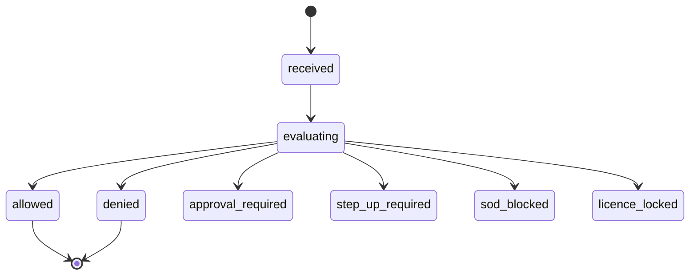
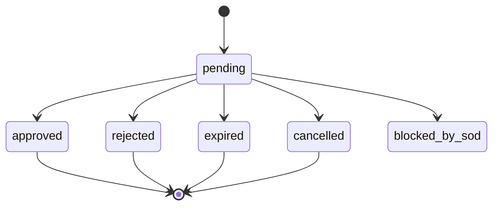
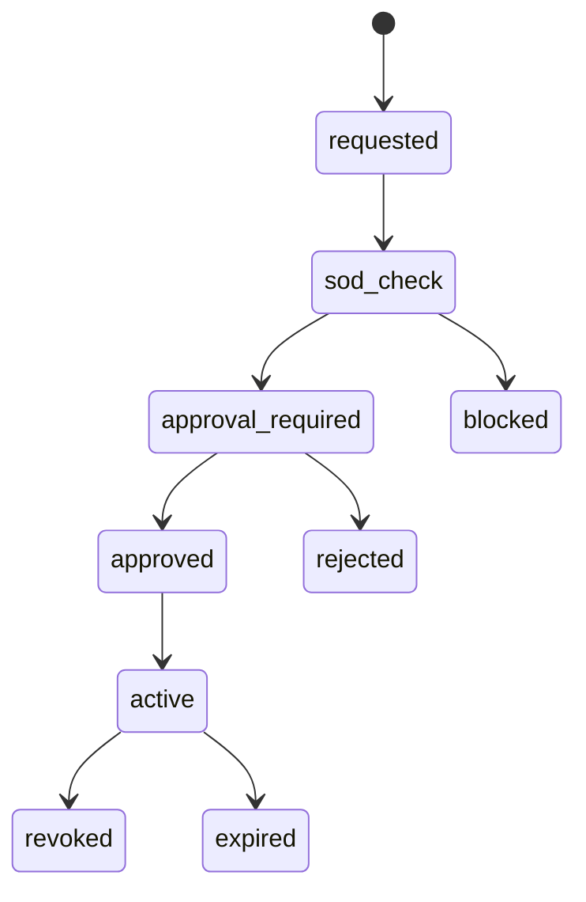
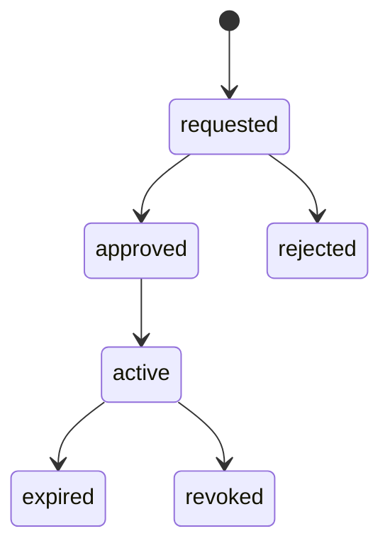
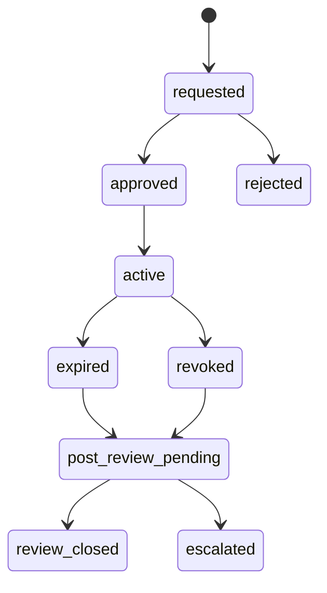
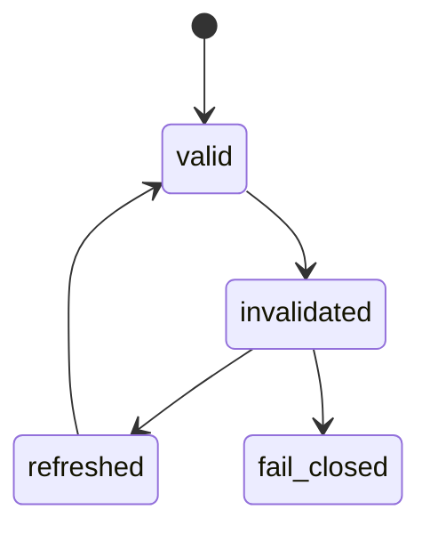

# IAM-02 RBAC / Permission Guard / SoD  
## 06 State Machine

## 1. Permission Decision State

## 2. Approval Request State

## 3. Role Assignment State

## 4. Delegation State

## 5. Temporary Permission State

## 6. Break-Glass State

## 7. Permission Cache State

