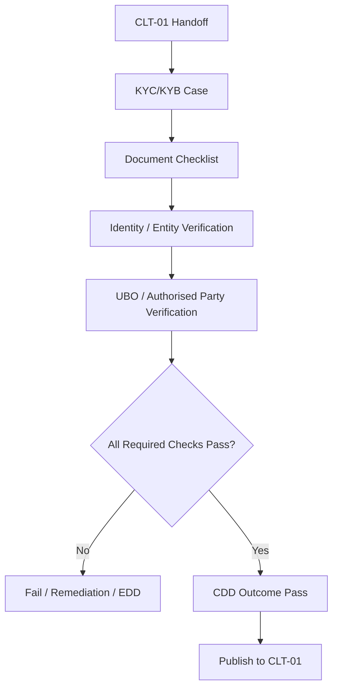
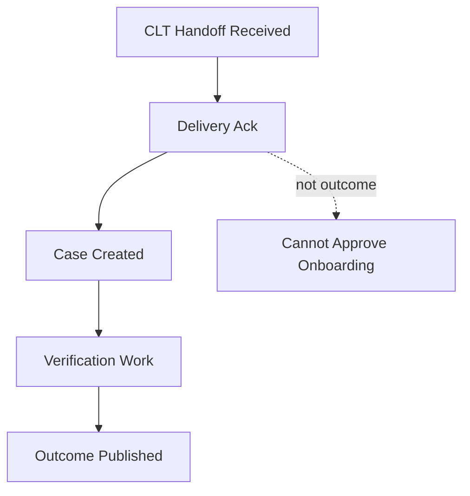
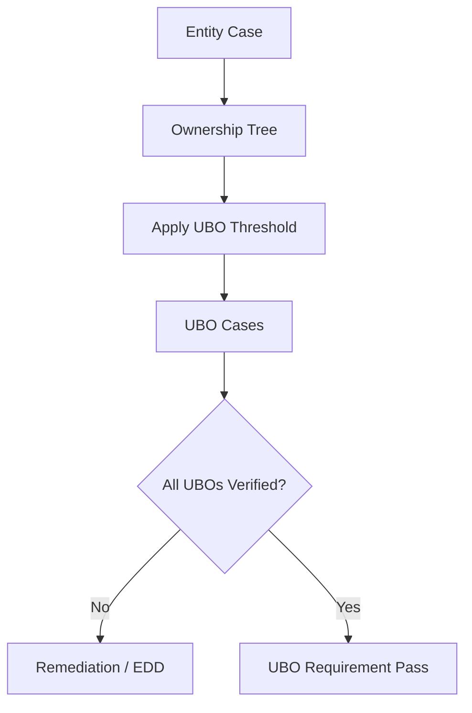
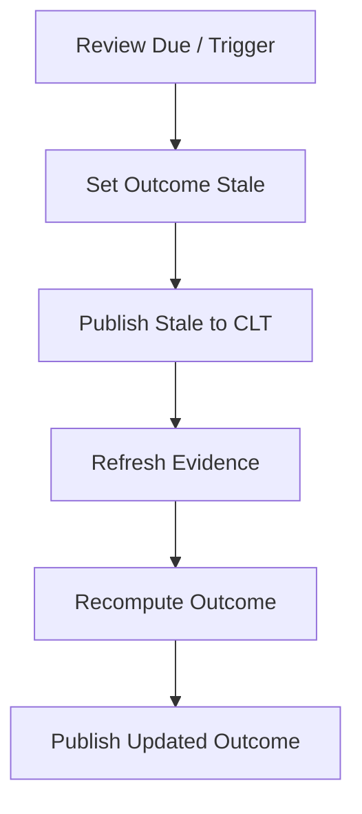
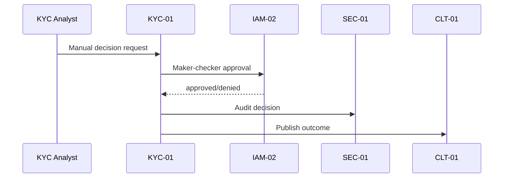

# KYC-01 KYC / KYB Verification
## 03 Diagrams

## 1. KYC/KYB Outcome Flow

```mermaid
flowchart TD
  A[CLT-01 Handoff] --> B[KYC/KYB Case]
  B --> C[Document Checklist]
  C --> D[Identity / Entity Verification]
  D --> E[UBO / Authorised Party Verification]
  E --> F{All Required Checks Pass?}
  F -->|No| G[Fail / Remediation / EDD]
  F -->|Yes| H[CDD Outcome Pass]
  H --> I[Publish to CLT-01]
```

---

## 2. Handoff vs Outcome

```mermaid
flowchart TD
  A[CLT Handoff Received] --> B[Delivery Ack]
  B --> C[Case Created]
  C --> D[Verification Work]
  D --> E[Outcome Published]
  B -. not outcome .-> F[Cannot Approve Onboarding]
```

---

## 3. UBO Verification

```mermaid
flowchart TD
  A[Entity Case] --> B[Ownership Tree]
  B --> C[Apply UBO Threshold]
  C --> D[UBO Cases]
  D --> E{All UBOs Verified?}
  E -->|No| F[Remediation / EDD]
  E -->|Yes| G[UBO Requirement Pass]
```

---

## 4. Periodic Review

```mermaid
flowchart TD
  A[Review Due / Trigger] --> B[Set Outcome Stale]
  B --> C[Publish Stale to CLT]
  C --> D[Refresh Evidence]
  D --> E[Recompute Outcome]
  E --> F[Publish Updated Outcome]
```

---

## 5. Manual Review

```mermaid
sequenceDiagram
  participant Analyst as KYC Analyst
  participant KYC as KYC-01
  participant IAM2 as IAM-02
  participant SEC as SEC-01
  participant CLT as CLT-01

  Analyst->>KYC: Manual decision request
  KYC->>IAM2: Maker-checker approval
  IAM2-->>KYC: approved/denied
  KYC->>SEC: Audit decision
  KYC->>CLT: Publish outcome
```
